# Reddit 出海指南：从 Build in Public 到社区驱动增长

> 来源：[https://u0ry0qxjdd.feishu.cn/docx/DsEDdHohgoYi9mxTCcNcXj6enph](https://u0ry0qxjdd.feishu.cn/docx/DsEDdHohgoYi9mxTCcNcXj6enph)

很多独立开发者或一人公司创业者都面临一个尴尬的现实：有能力做出产品，却卡在了冷启动和持续增长上。

如果你正关注出海，想要开启全球业务，Reddit 可能是一个不错的起点。

在本篇文章中，我复盘和整理了在 Reddit 上的实操经验，包括：

*   从公开建造到社区共创的转变

*   一些通过 Reddit 平台创业成功的案例

*   新手如何快速上手 Reddit

*   如何利用 Reddit 挖掘需求 & 验证 MVP

*   利用 Reddit 冷启动增长获客的方法

# Build in Public VS Build in Community

在早期，我也有尝试过公开构建。

但是BIP 的问题是，当把想法和进展完全暴露，吸引来的不一定是用户，而是比你更卷的竞争对手，导致想法被复制，失去先机。

Gumroad 创始人萨希尔在 《小而美：持续盈利的经营法则》这本书中提到

是社区将你引向问题，问题将你引向产品，产品为你带来生意。

选择合适的问题去解决（很可能就是你遇到的问题），确认他人也面临这个问题，然后确认你拥有“生意-你”的最佳契合点」。

当产生疑虑的时候，一定要回到社区，他们会帮助你继续前行，直到最后取得成功。

与其公开建造，不如与用户共建。Build in community 的好处是，能够直接与目标用户对话，获取真实反馈，辅助你判断是否发现了一个真实的问题。同时可以让信任用户参与共创，培养早期忠实粉丝。

那么问题来了，去哪里找到好的社区呢？

# 从多个成功案例中感受到 Reddit 社区的魅力

在对独立创客这条路产生兴趣后，我去收集和调研过近百个独立创客的案例，对他们的流量渠道、变现模式、构建过程进行了深度拆解。

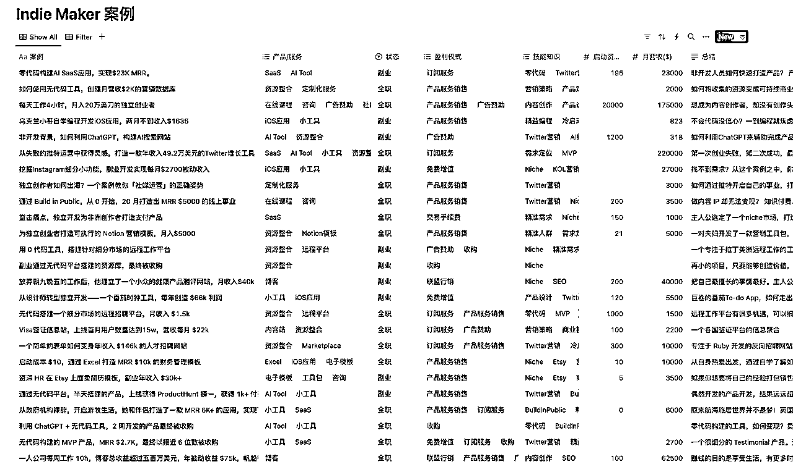

其中发现，有很多个成功的产品，都是靠 Reddit 发家，包括 SaaS 工具、Newsletter 简报、个人服务、数字数据库、社群等，这里分享几个案例 ⬇️

Loopcv 一个自动化求职平台，通过在 Reddit 发布还没有任何功能的落地页验证需求，在收到了几百个用户注册后，开始构建，通过 Reddit 冷启动，产品月营收在 $15K 左右。

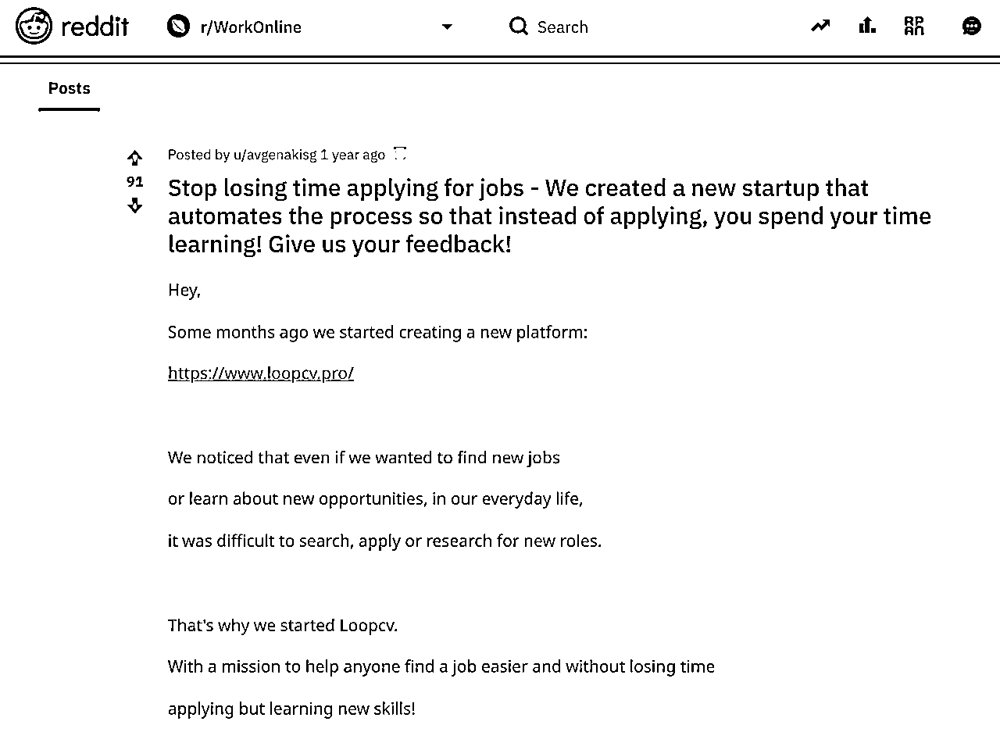

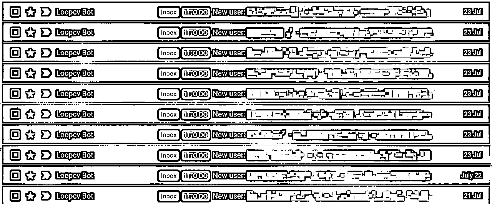

Stagetimer 一个非常细分小众的远程遥控计时器，最初是在细分社群中发布了产品想法，得到了反馈和验证后构建，在 Reddit 发布启动产品，月营收在 $8K 左右。

除了做 SaaS 工具的，还有卖 newsletter、卖模版、做社群的各路创客，大家在 Reddit 社区里面挖需求、找用户、寻建议、做转型。

比如，AI Tools 工具导航站的创作者，把自己的网站发到了 Reddit，有用户指出，要想办法引流用户回到你的网站来，而不是依赖添加网站书签，而 Newsletter 就是一种不错的方式。之后这位创作者就做了一个关于 AI 的 Newsletter —— World of AI，相互为产品做引流，达到了 $6K 左右的月收益

一位连续创业者积累了非常多的资源和工具，他在 Reddit 上面做了分享，发现很多人感兴趣，最终他将他的这些知识库和经营变成了标准化的产品，月收入在 $2.25K 左右。

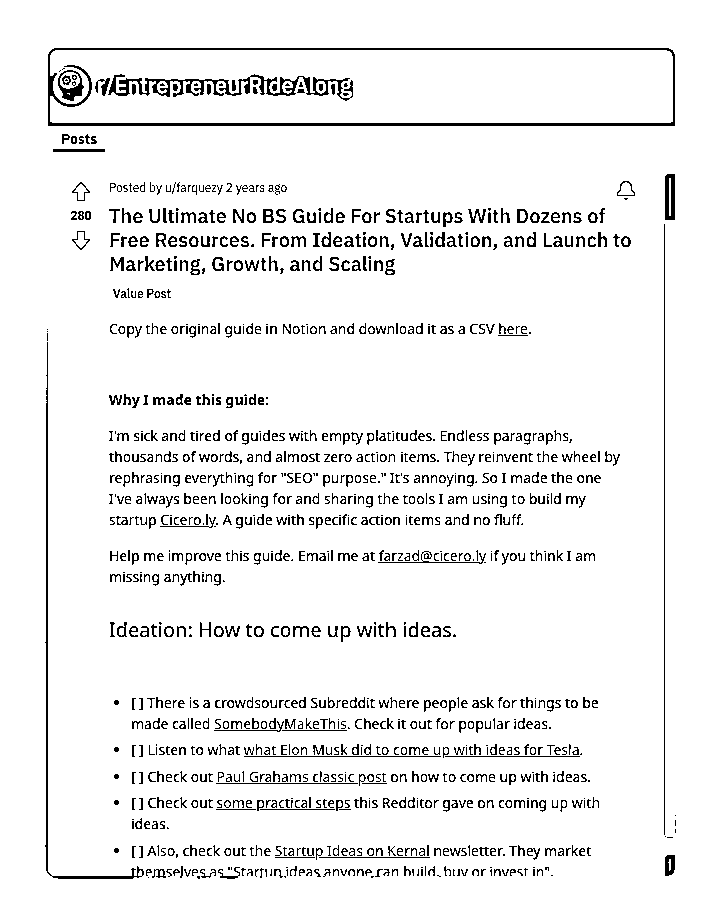

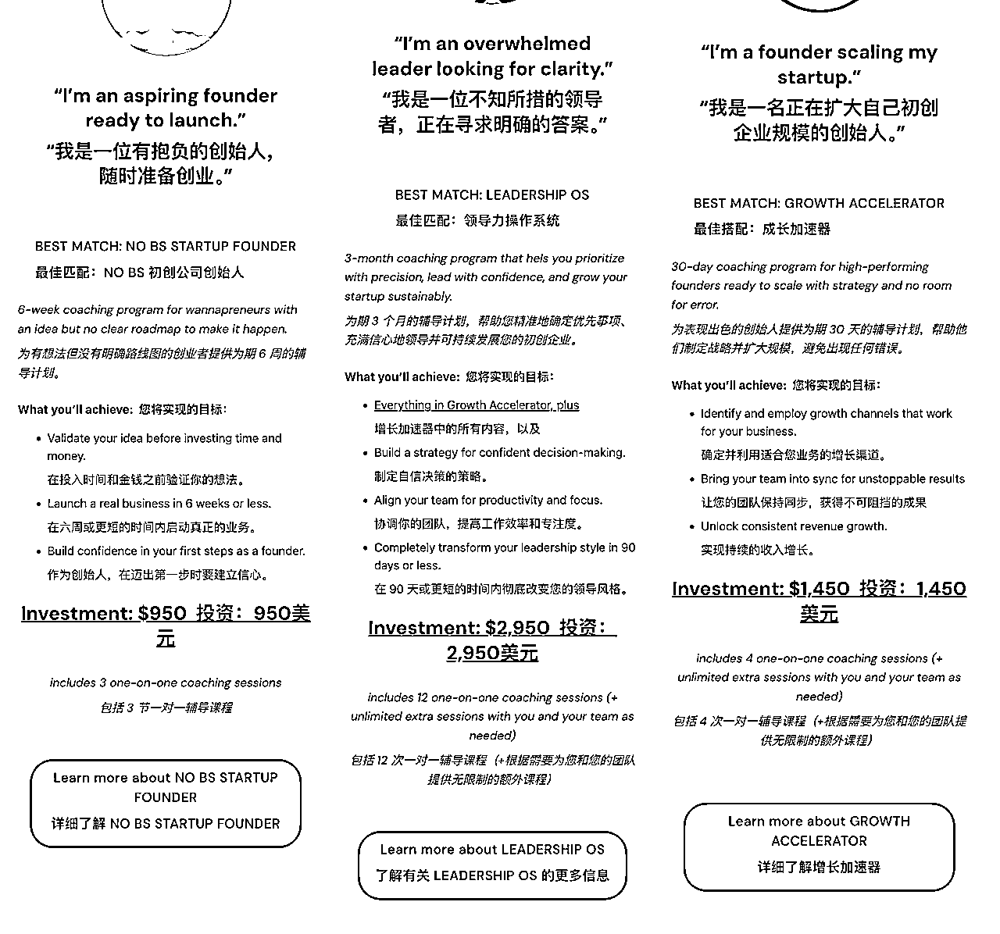

一个人的成功之路可能是运气，但很多人都在这条路上走通了，说明它具有普适性、适合大多数人。

别人的故事经验是否能被复用，当然还是要自己去实践验证。

从去年开始，我重视起了 Reddit。

看别人都很厉害，自己却一做一个不吱声。

但好在一直坚持摸索，从一开始发什么都没有流量、没有反馈，到慢慢积累 K 值，发帖都有「真人回应」和互动后，我的感受是，Reddit 是一个很适合新手想要起步开展出海业务的平台。

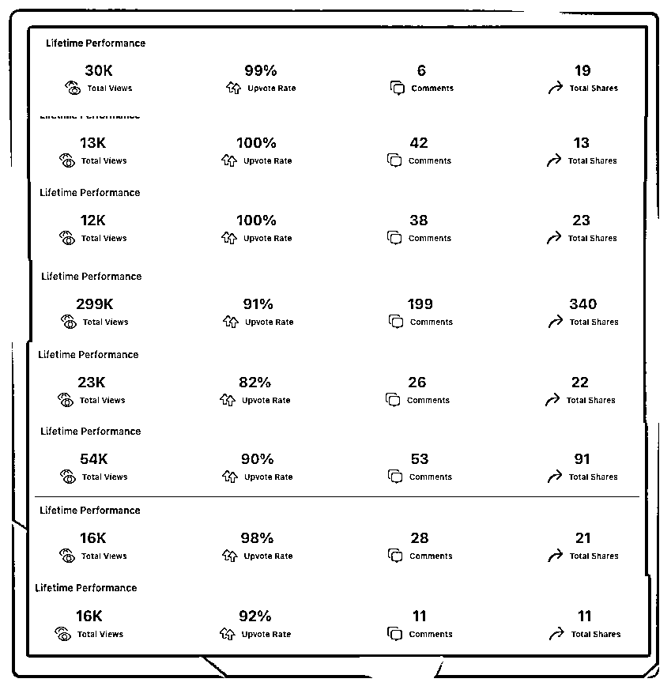

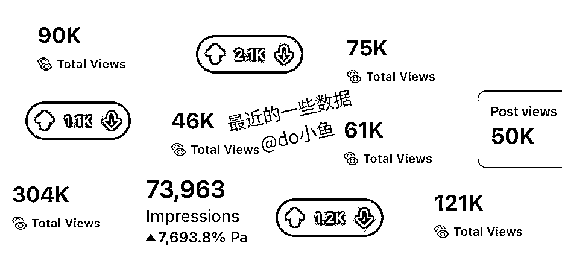

我的部分 Reddit 帖子互动数据

最初我只是很功利的把 Reddit 当作一个营销渠道，当我在社区里面呆久了以后，我发现，Reddit 更是能去挖掘需求、与真实海外创业者建立连接、挖掘出海机遇的平台。

Reddit 拥有来自世界各地的用户，社区氛围开放，用户积极热情，愿意去帮助新手解答问题。通过他们，能获得很多「insight」，帮助我们更好的完整和完善自己的产品和服务。

而与一些社交媒体相比较，Reddit 的社区本身就自带流量，只要你能提出好的问题，就可以得到及时反馈，解决了新人出海没有流量的困扰。

# 新手可以做好的 3 件事情

## 泡子社区

Reddit 里面有非常丰富的子社区，不管你目前有没有产品、创业idea，都可以先把社区泡上。

以下是我整理的与创业、互联网产品、苹果生态、App 开发、社交媒体相关的社区，已整合在 Notion 文档：点击连接可直达

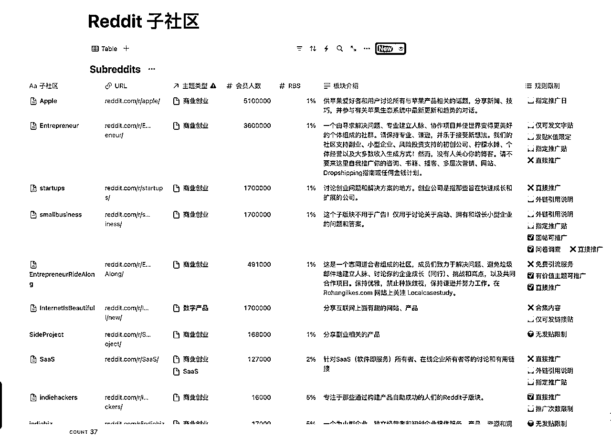

前期我加入了大量的感兴趣的子社区，当你对某个群体、或者某个领域感兴趣时，可通过搜索关键词，找到目标社区【如下图】

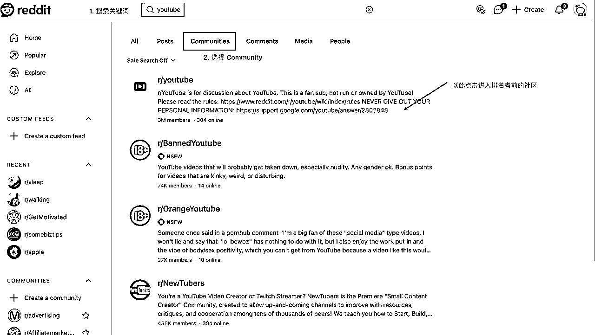

进入子社区后，可以通过右上的社区简介，了解这个社区是否活跃，依次是：

1.  Subscribers：加入社区的总用户数量

1.  Viewers / Online：该社区实时在线的用户数量

1.  Rank by size：社区规模，一般排名在 5% 前的都是流量比较大的社区

如果一个社区，流量大、在线用户多，并且首页的帖子都是最近的时间，那么是值得加入的。

点击社区右上角的「Join」，你就会在你的首页左栏看到所有你加入的社区，以首字母顺序排列。

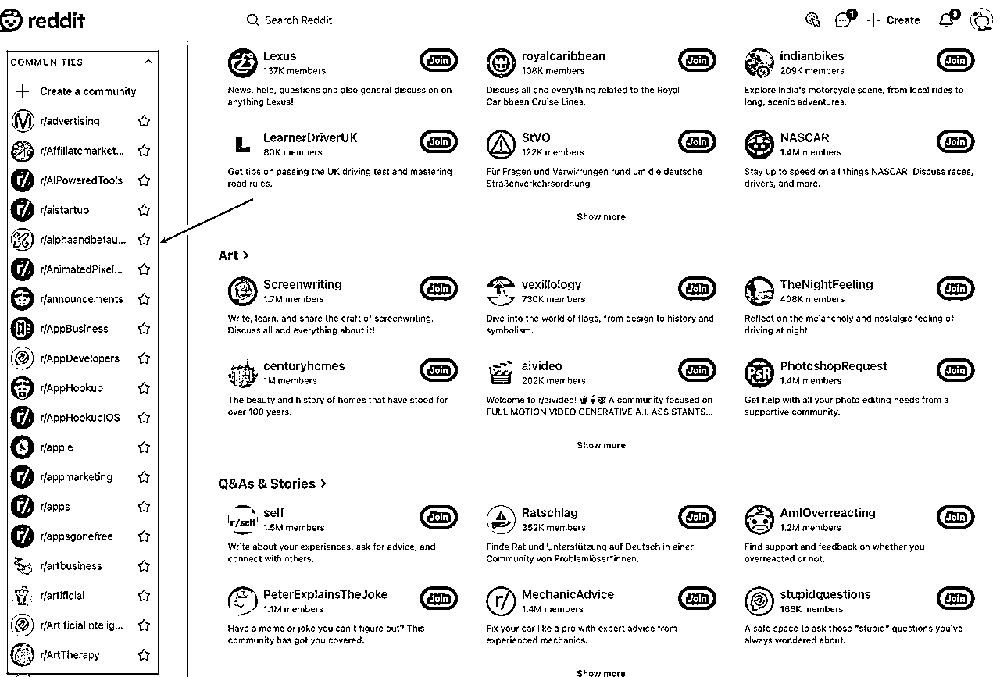

## 看组规

Reddit 混社区的最关键的一件事情，遵循组规。

很多朋友注册了Reddit 账号，就开始疯狂发帖。这大概率是会被删除 or 被 ban 掉的。

想要在任何一个平台“混下去”，底层逻辑都是要遵循社区规则，真诚、利他，为平台和用户带去价值，而不是制造营销垃圾。

如何避免送人头发帖 —— 不被删帖或者被禁？每个 Reddit 子社区都有自己的组规，在发帖之前，请先研读组规！！

我一开始是不知道有社区规则这个东西存在的 😓（送人头的第一步）后来即使知道了，也发现规则（下图）太长了根本看不进去啊🤦

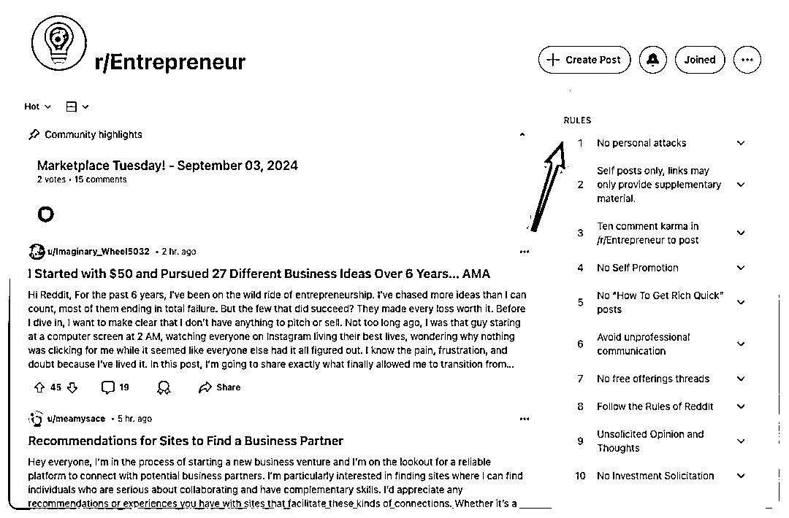

这个时候就靠 AI 来帮忙了 ⬇️

1.  先收集一些可以长期活跃的 reddit 子社区在 notion 里面

1.  让 AI 阅读规则，翻译成中文(如下)，这时候你大致就能清楚哪些能做哪些不能做了。

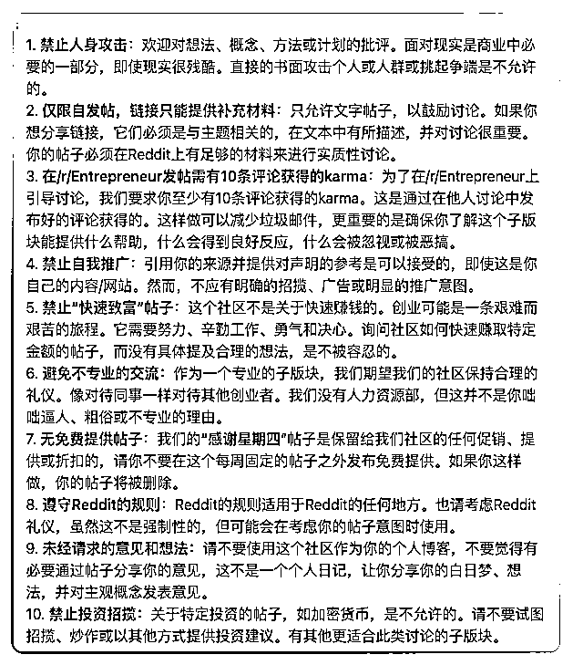

为了方便，有一些社区之间通用的规则可以打上标签：

✅ 表示可以做的

🟨 表示可以做，但是有规则限制：比如发营销贴只能在制定日期发、一个月只能发一两次等

❌ 表示小组禁止做的，做了就会被删掉或者禁号

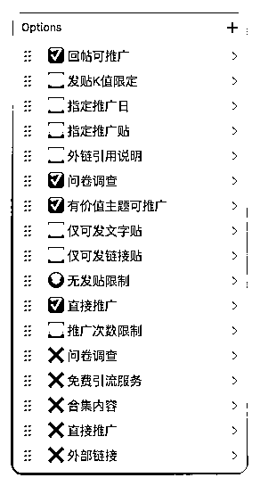

要发帖的时候，就去notion表格里面看看规则和注意事项，或者让 AI 翻译，一般限制会有是否可以发链接、图片格式、内容话题、k值要求、限定发帖日等。

多研究研究组规，按照社区要求发帖，基本上不会被删了。我将大家都能用到的子社区的规则已经整理进 notion 文档，大家有需要也可以去查阅：点击连接可直达

有时间和能力的朋友，也可以把这个流程做成一个插件，这样可以在混社区的时候更加便利。

## 涨 K 值

在 Reddit 社区，你的发帖和评论，如果得到了社区用户的点赞、评论、转发，都会增加你的 Karma 值。

K 值越高，说明你在社区里面的活跃度和信用度越高，当你以后需要一些营销动作的时候 —— 比如，直接在社区里面发链接，或者直接私信用户，被封禁的可能性更小。K 值也是很多子社区发帖的门槛要求。

我的个人K值状态

一开始我也很愁，自己在感兴趣或者目标小组很认真、用心写的帖子，怎么没有人看？

后来发现思路有问题，如果是以涨 K 值为目标，那么我们需要去到的是一些泛流量大的子社区去发帖。

在 Top community 里面我们可以看到社区的排名 ⬇️ 排名前 20 的社区，基本上都是娱乐、搞笑、好玩相关的社区，由于流量大，发帖限制少，初期可通过在这些社区活跃快速涨 K 值。

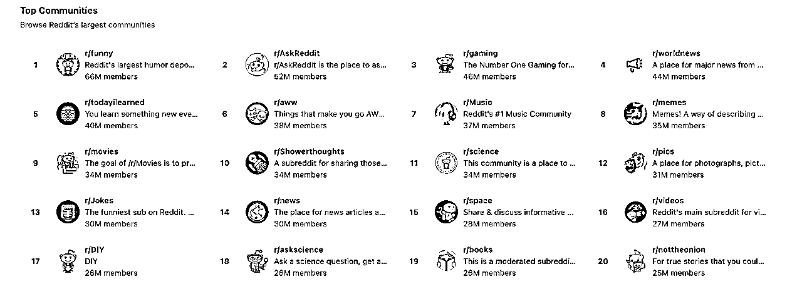

比如 awww 这个社区，是一个纯图片社区，只需要发布自己的萌宠，就很容易获得上千点赞、涨 K 值。

# 利用 Reddit 子社区挖掘需求 & 验证 MVP

当你有了一个想要做的产品方向，如何判断是否是否是「真需求」，值得去花时间和精力开发，变成一套成熟的解决方案或者产品？

那前面做的事情其实是熟悉 Reddit 平台，接下来聊聊，如果我们想要通过 Reddit 挖掘需求和机遇、获得潜在用户，可以做些什么？

## 4.1 看：观察活跃社区热门讨论话题，从评论区里面找需求

### 4.1.1 看社群规模

人越多，机会越大。某个社群的成员数量庞大，说明这个领域有足够的关注度和潜在用户。

比如，我最近在小红书刷到几个产品，都以 ADHD 多动症人群为目标，去提供解决方案，并且互动量都很高，那么说明有很多问题困扰着这个人群。

在 Reddit 上面，我们可以直接搜索 ADHD 这个关键词，进入到子社区里面。

然后发现，这个社群人群基数大——200w用户， 并且是排名前 1% 的社区，说明社区活跃，交流多。

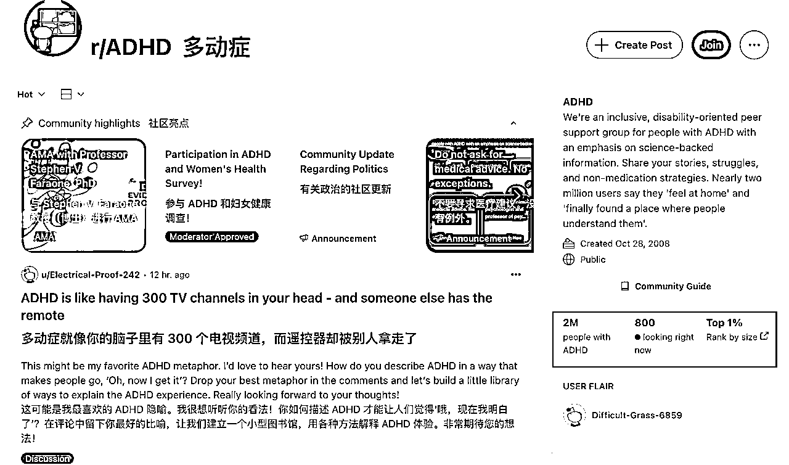

### 4.1.2 看讨论的主题和问题

接下来筛选「Hot」热门帖子，去看看这个社区里面的人都在讨论什么。

关注那些高赞、高评论的话题，看看这个群体中，大家在关注的是哪些问题？

从评论区看是否存在很多「负面情绪」，当用户频繁抱怨某个问题时，往往意味着市场存在的真实痛点，也正是产品或者服务可以切入的机会。

自己看肯定很费劲，这个时候，就可以请出 AI 小助理。

找到一些评论比较多的帖子，让 AI 来帮我们「看」痛点，分析潜在的产品功能点：

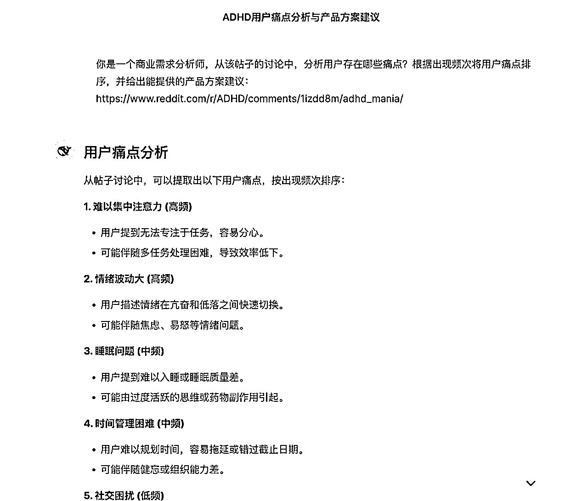

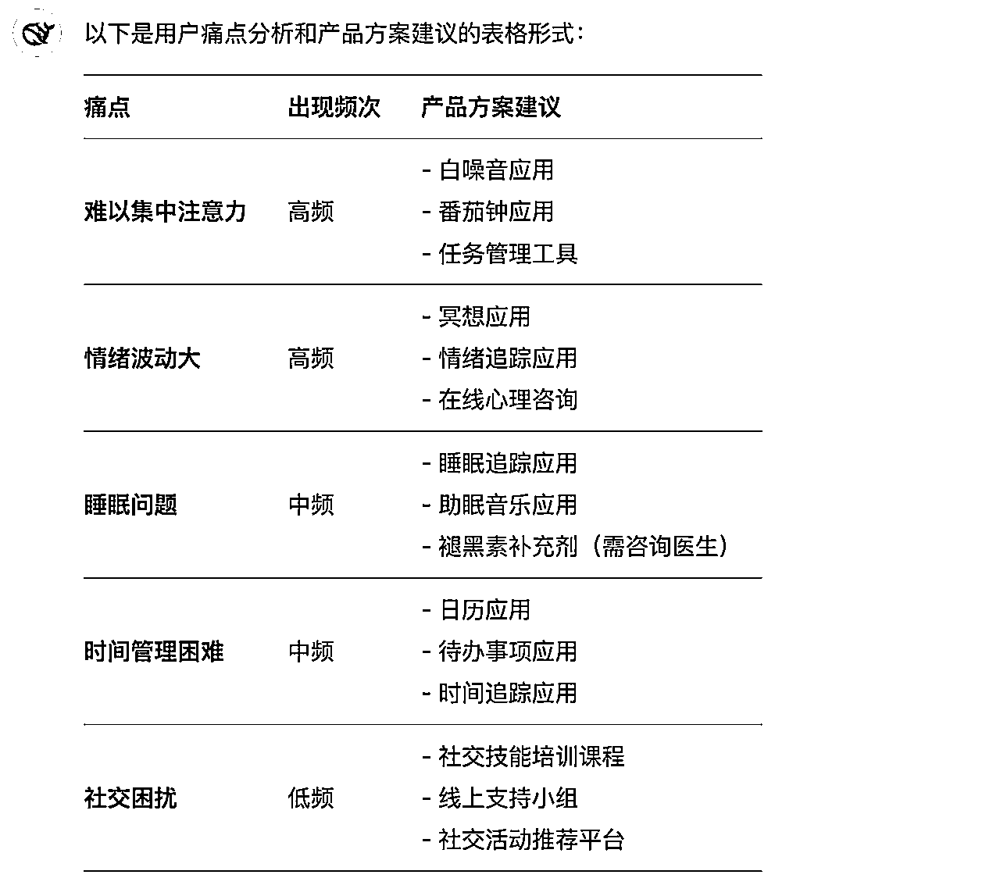

让 AI 去读热门的前 20 条评论大于 50 条的帖子，分析其中存在的问题，很快你就能聚合出高频出现的一些用户痛点和需求点，将其整理在表格里，根据痛点排序，再结合自身资源和情况，去判断你能针对什么问题提供解决方案。

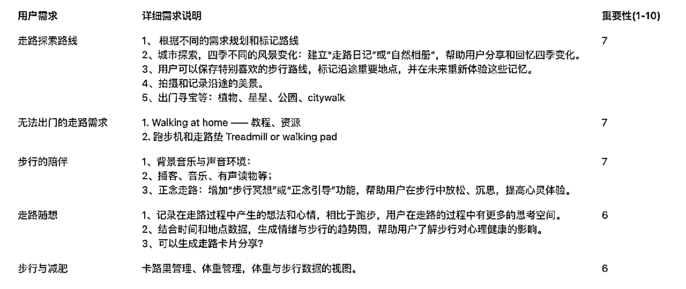

我之前通过Reddit针对「走路」这个场景收集到的一些需求

优秀圈友四喜也做了 AI Agent，来帮助挖掘和分析 Reddit 上面的用户需求：scys.com/articleDetail/xq_topic/4848144281141488

## 4.2 问：直接对话，获取用户反馈

当你看了大量的讨论后，对于用户群体的画像和常见问题已经有了一些初步的感知。这时候，如果已经有了一些初步的想法和感受，就可以直接在社区里面提问。

提问的方式，是把自己代入这个人群，根据你想要提供的解决方案提供一个场景，询问大家的意见。

比如，就刚刚 ADHD 这个人群，你想要进一步挖掘「注意力集中」的问题，看真实的用户是怎么面对和解决的，可以直接提问，可套用公式【用户画像】+【场景】+【困扰】+【寻求帮助】

比如，我是一个 ADHD 患者，我发现自己很难在独处的时候集中精力做完成的任务，有人有同样困扰吗？大家是如何解决的？

通过真实用户的反馈，能够了解到现有的一些解决方案。而用户的「真实有效」的解决方案，也能进一步助你完善产品的核心功能。

## 4.3 验：快速测试，验证你的假设

好了，这时候，你已经挖掘出了一些值得深入的真实的痛点，并且有了一些解决方案思路，接下来就是将其产品化。

但在之前，先不要着急开始开发，可以进一步发一篇主题帖，标题可参考：“我创建了 一个「XX产品」，帮助我解决「XX问题」”

在主题贴里面，以一个真实用户的身份，分享你如何用你自己的产品，解决了一个具体的问题，同时展示一些设计 Demo，并且询问更多的功能意见。

如果有用户直接反馈给你说愿意，能不能分享出来？或者直接请你把它变成一个产品。

这时候你就可以在帖子里埋一个落地邮箱注册页，开始收集潜在用户邮箱。

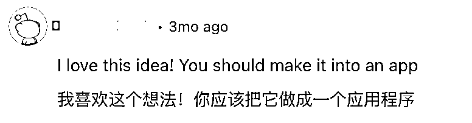

我把想法和原型发布在了 Reddit 相关子社区上面，得到了非常直接的用户正面反馈

这时，我们就完成了一个小的 MVP 验证闭环 —— 从痛点需求挖掘、到解决方案验证、再到种子用户的邮箱收集。

而在目标群体相关性高的社区里面做这件事情的好处是，你收集到的邮箱大概率是有效邮箱，不会是泛流量，或者看热闹、甚至是暗中观察你的竞争对手。

通过在 Reddit 子社区“看-问-验”三步法，可以快速跑通MVP（最小可行产品）。接下来，你就可以规律地 Build in community 或者通过邮件向用户发布你的产品动态，像他们收集意见和反馈，避免闭门造车。

# 在 Reddit 上冷启动持续获客增长

当你的产品做好了，Reddit 也是一个非常棒的冷启动产品发布平台。

## 5.1 直接在相关目标社区发布产品

简单高效，能直接为产品带货，吸引目标用户。

但是风险比较大，需要遵循组规，并且注意不要太硬。

可在产品正式发布的时候发布，不建议长期频繁发主题贴直接营销产品。

如果频繁发布的主题贴，都是硬广，很容易被系统判定为垃圾营销贴。

那么换个思路，从想要营销别人到给用户提供价值会怎样？

## 5.2 为提问的人带去有价值的解决方案

我们的产品、服务本身就是给对的用户提供价值的。

很多用户也在社区里面在寻觅更加合适的解决方案，不是吗？

哪里有问题哪里就有需求！

### 5.3.1 如何捕捉他们的信号？

目前我主要是用 2 种方式去找到与产品受众高相关性的帖子 ⬇️

#### 5.3.1.1 谷歌搜索产品人群场景

可套用搜索公式【 How to +你的产品or服务的应用场景的关键词 + Reddit 】

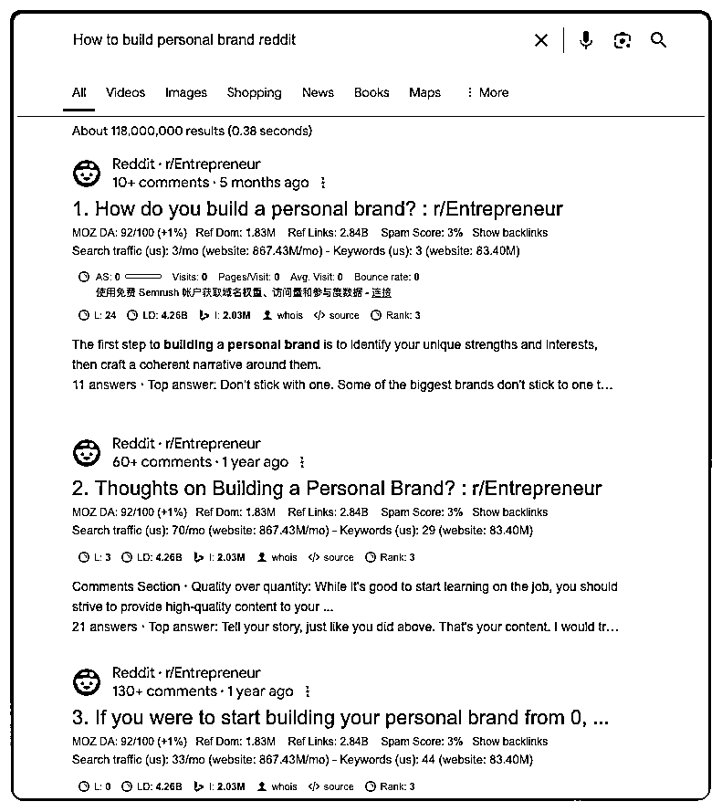

能直接定位到一系列的关于这个场景痛点下用户的提问。这个时候去回复 + 产品链接，不仅自然，针对的人群也很精准，更有利于转化，还不会被 ban 哦 👀

#### 5.3.1.2 主动监测关键词

一个免费的工具： f5bot.com

输入你需要检测的关键词后，一旦检测到出现在 Reddit，会通过邮件提示。

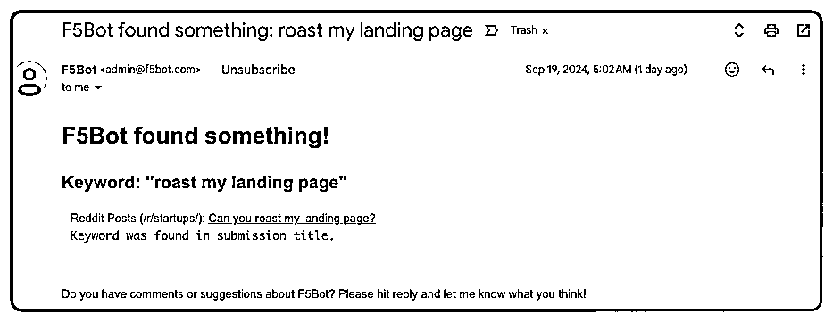

另外还会显示过去一周内的关键词出现次数 —— 等于变相可以调研关键词热度。

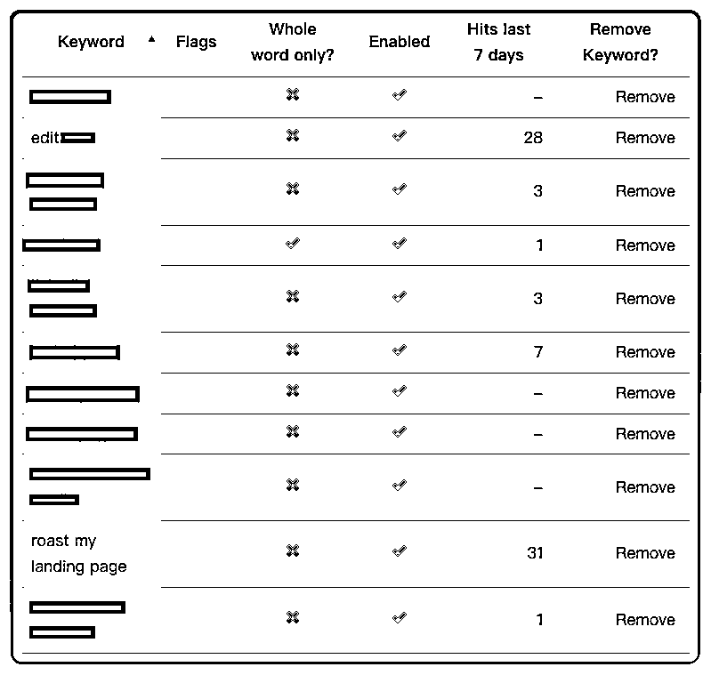

用这个工具可以监测哪些东西呢？

1.  竞品关键词：用来监测竞品如何在 Reddit 上面做营销，挖掘对方的营销渠道；

1.  潜在关键词：一些想要用来主打 SEO的关键词，看看有没有热度和流量，用户是不是真的有在讨论；如果出现频繁，说明不错，可以用来做主打的 SEO 优化。

1.  定位潜在用户：通过关键词直接定位到潜在用户，在留言区里面评论介绍你的产品，引流到落地页等。

1.  监控自己的产品：看看有没有用户在讨论和提及产品，挖掘出你的「铁粉」或者「黑粉」用户。

1.  挖掘 SEO 博文内容话题：如果有一些想要做的主题博文，也可以通过这种方式去挖掘有没有用户在讨论，如果有的话，写好了博文，也可以在评论区留言引流到网站。

这个工具有一定的局限性。主要就是关键词本身和背后的需求并不是一一对应的，有的词会在莫名其妙的场合出现，并非理想的用户场景，需要进行一些过滤和筛选。

### 5.3.2 怎样转化目标用户？

试过了很多方式来做转化，有一些帖子流量大，但转化效果差；最好的还是直接定位到你的目标人群，让他们对你的产品感兴趣。

#### 5.3.2.1 自问自答型

就你的产品能解决的问题在相关社群里面提问，如：作为 ADHD ，我很难专注，有没有什么好的工具推荐？

公式：【人群】+【痛点】+【寻求工具解决方案】

比如，你是做 App的，你就问有没有什么好的 app；做网站的，就问有没有什么好的网页。

那么进来这个帖子的，也自然是对用户感兴趣的。

然后在评论区里，可以用小号回答，或者以真实用户的身份回答：

【最近我找到了一个不错的工具，它解决了我的问题，叫「XX」】

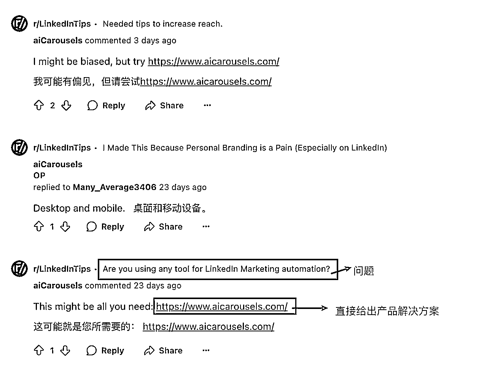

比如这个工具，就是通过评论区引流到网站

在 Reddit 帖子里留产品相关的信息，还有一个好处是， Reddit 网站权重高，用户可能在谷歌搜索，会给到 Reddit 的结果，也等于变相做了 SEO。

#### 5.3.2.2 真诚利他型

另外，如果很难定位到你的场景，你可以把自己的昵称改成【产品/网站名称+ 解决方案】，在你的主页里，留下你的产品介绍，然后去目标用户发的帖子下面回答问题，不一定非与你的产品直接相关，但是能吸引到你的目标用户关注到你，这样进入你的主页后，也有机会通过简介了解到你的产品。

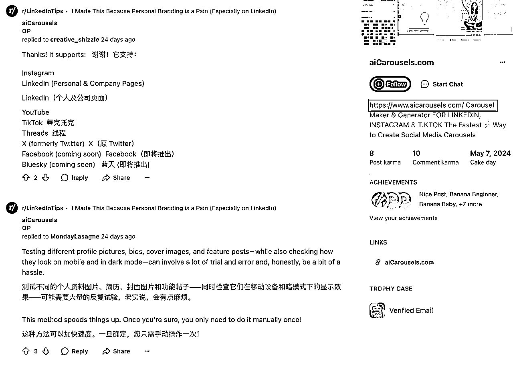

另外，如果你是做网站的，你可以把一些高赞的 Reddit 用户提问，变成你的 SEO 文章，在帖子下面发布，引流到你的主站去。

* * *

# 从社区出发，开启出海之旅

如果你想要提高出海事业的成功率，不妨从一个社区开始：社区会带你发现问题，问题会引导你找到解决方案，而产品最终会为你带来生意。

其实除了 Reddit，每个平台都有自己的子社区。而 Reddit 社区集合了流量大、用户活跃、子社区丰富的优势，是相对比较好上手、能快速拿到反馈的平台，值得各位出海人深根尝试。

以上就是过往在 Reddit 实践上的一些心得经验，也欢迎各位在评论区查漏补缺！！

感谢观看 ❤️

# 往期生财相关分享

2024.9 《如何挖掘价值百万的需求？》

2023.6 《如何利用工具完成快速上线》

2023.3 利用 GPT4 迅速将想法落地，让创意在半天时间内变成 MVP！