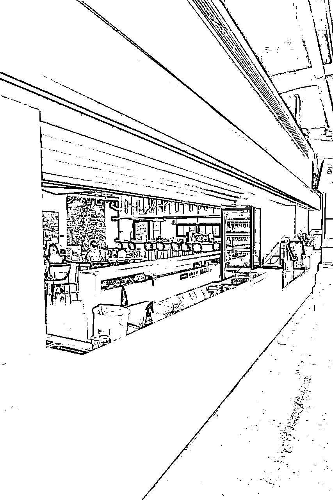

# 旅行省钱指南：00后如何用2w预算玩遍3国

> 来源：[https://rjs9i4i6z4.feishu.cn/docx/E8vpd5Nlaovtprxs1m9c3Iilnkf](https://rjs9i4i6z4.feishu.cn/docx/E8vpd5Nlaovtprxs1m9c3Iilnkf)

# 一、自我介绍

去年6月底裸辞，9月带着2w块临时决定出去旅行，一走就是4个月。

路线：深圳出发——重庆——成都——兰州——武威——张掖——嘉峪关

——新疆：乌鲁木齐——北屯市——布尔津——哈巴河县——白哈巴村——喀纳斯——禾木村——乌鲁木齐——吐鲁番——库尔勒——库车——阿克苏——喀什——红其拉甫——喀什——莎车——叶城

——西藏：大红柳滩——日土县——阿里地区——冈仁波齐——萨嘎—— 聂拉木

——加德满都（尼泊尔）——博卡拉（尼泊尔）——日喀则——拉萨——那曲——格尔木——西宁——西安——首尔（韩国）——釜山（韩国）——济州岛（韩国）——南京——杭州——义乌——深圳结束

总花费2w左右包含所有

# 二、吃穿住行

## 交通（最大开销）

### 大交通

#### 火车：硬座+高铁

##### 一、一般优惠券

一般会用几个不同的平台，去哪儿（首选）、携程、同程、飞猪等大概率会有5-10元优惠券，有时候支付宝12306小程序也会有，在你支付宝付款时，你可以看支付消息里面

锦锦水印

##### 二、火车盲盒

这个很多人不太清楚，首先同程他有9元和28元的单人火车盲盒，也有双人的，机票也有盲盒（后续讲），这个火车盲盒它是可以自己选出发地，目的地是随机的，且开出来的时间是在24-48小时内（注意时间）。那开出来的地点也很随机，旺季的时候大概率会开出来票价在大几十或者是100多的票，也就意味着是距离你出发地可能4-5个站。

例如我从拉萨出发，开出来的很多票是到那曲、林芝或者格尔木（跟拉萨只有几站距离）。

小概率幸运儿就可以开出票价3、400多的票，这个时候就算你不坐，也可以直接锁定购买不退票，因为这也可以兑你的火车积分，这9元兑几百的积分还是很值的。

9元盲盒和28的盲盒区别在于28的需要3人助力成功就能买，每天早上10点开售，不需要抢。9元的每天下午3点开抢，有时候手速慢就没有了，卡点抢基本能抢到。这俩个是可以同时买的。

锦锦水印

注意事项：

1、一周只能买一次，买了盲盒之后他会开出一张火车票，你有15分钟的时间来考虑是否需要，如果需要就点锁定就可以出票成功，如果不需要就点放弃，如果超时也就默认为放弃。且这个锁定一个月只能一次。再加上盲盒火车票的时间，如果你有明确的出发日期，比如4.3日12点，那你开盲盒的时间就要在4.1日的12点到4.2日的12点之间才能开出4.3日的票。

2、盲盒开出来的火车票是可以改签的。有例外情况可以退票，很麻烦要找客服要投诉，且退了之后就再也开不了盲盒了。

3、不管你用多少个手机号注册不同的账号，一个身份证只能用一次，开的票也必须要用绑定实名的那个身份证用。

4、开盲盒之前你可以先看一下你想去的日期当天从你出发地出发到目的地的火车有哪几趟以及时间还有中间的途径站，如果没开到想要的，但开到了途经的某个站也可以先上车后补票，也能省点钱。

这里还有个搭配操作就是用智行

智行也有36.8开火车盲盒活动，它基本开出来的就是周边的站点，也就是热门路线，比如西宁-兰州，南京-杭州，拉萨-那曲等等这些短距离路线，而且它每次可以开7个盲盒，开始会免费送你3次开盲盒机会，这个时候还没有开出想要的，就要邀请好友助力。如果开到了想要的，付款买了之后要在24小时内兑换车次。

除此之外智行还有个很大的优点是她可以自己选时间也就是车次，这样你就可以利用这点开组合路线。

比如我当时从拉萨出发，我用同程开出了拉萨-格尔木。于是我就用智行接着从格尔木开，开出了格尔木-西宁，并选择了同一趟列车，所以无缝衔接了后面的站。

当时我的目的地是西安，前面的软件盲盒次数用完了，接着我又接了一个软件-马达出行

马达是9元盲盒，需要邀请2位好友助力就可以每天买一次，规则跟同程差不多。

所以我从西宁到西安这最后一趟就是用马达开出来接力的。

如果直接买一张从拉萨-西安的票是293.5元

我运气不好开了3个盲盒才凑上是70多元

运气很好的比如我朋友9元直接就开出来从拉萨-长沙的，中途开到西安也可以直接下车，全程只要9元。

所以朋友们不差时间的可以按需开盲盒。

锦锦水印

##### 三、国外火车票

1、直接在对应官网买大部分是最便宜的，很多你在网上搜到的能购票的网址很多还是第三方平台，有点类似于携程这些，真正的官网平台可以在小红书上搜都有的，而且操作其实也不复杂。

有些票在淘宝买或者找咸鱼买会比官网买更便宜，比如日本的新干线可以比直接买少2-3百

#### 飞机

##### 一、飞机盲盒

主要规则跟火车差不多，分198国内机票和298国际机票（现在同程没有了），都是含机建燃油的。差别在于机票开出来的时间在3-30天内，我开出来的基本上都是一周左右的机票。所以如果有确定的出发日期，至少要提前一个星期才能开出自己满意的日期。且开出来的机票价格基本是原本票价就只有几百的，所以也可以预测出来能开到哪些城市。而且在出发前你可以搜你选的出发地的特价机票，在哪个日期去哪里很便宜，那大概率就会开出来这个。

比如从拉萨出发，大概率是开到绵阳。票价在3、400左右。旺季的时候，它会直接关掉拉萨这个出发地，因为从拉萨不管往哪里飞都很贵，所以直接就不能买。

锦锦水印

##### 二、低价机票

1、对比多方平台，我一般是用去哪儿买票，基本都是最便宜的价格。另外不分淡旺季，提前一周左右的时间是更容易买到低价票的，一般早班机和晚班机最便宜，不带行李额的还会更便宜。

2、去闲鱼搜机票优惠券，有时候平台会举办活动领券但你自己不知道，这个时候可以直接去闲鱼搜或者是小红书，直接搜关键词“xxx平台优惠券”直接联系客服就会发给你，不需要拍。

3、如果你乘坐的那趟航班在1-3天的时候还一直显示有票，并且一直在降价，没有随着出发时间越近涨价， 那大概率这一趟航班还有很多空位，在出发前12小时内买票，很容易捡到超低价。

4、反向航班也能蹲到超低价，比如大年初一从泰国飞回中国，在一个星期前，他会又降又涨，但在出发的前一天晚上或者是出发前大几个小时，突然就变成了骨折价。我同期回来的，其他人基本都是1k多，我是等到出发前一周买的600多，出发前一天就只要300多了。

5、没买行李额也能带超重量的包上去，很多航空公司看到你提的20寸箱子或者是只背了包，是不会撑重的，甚至70l的徒步包装满了也不会查。只要是背的包大胆直接上基本不会扣你的行李。如果能线上值机，线上值机完后直接去机子上打印完登机牌就可以直接去登机了，不用再去柜台办理。锦锦水印

6、如果是深圳出发飞国际，尤其是东南亚国家，建议从香港飞，会比内地便宜大几百，我51去日本来回的机票都只花了几百块，深圳直飞要1k多。而且去香港机场很方便，你可以直接用护照进出关，不需要港澳通行证，福田口岸过关有公交车可以去机场，只是需要中途转一趟，但全程基本一个半小时就能到，只要20几块钱，性价比很高。另外口岸出发也有机场大巴能到，看自己选择。

7、中转机票可以利用起来，中转机票一般会比直飞便宜，你可以选择中转时间长的，比如24小时以上，这样你还可以在多玩一个城市。比如我西安飞首尔花了400多，我特意选了中转深圳26个小时的，而且还是中午的航班有午饭吃，还能免费回家换一身装备，真的很划算。同时有些地区机场是会免费提供过夜住宿的，比如我从深圳直飞的重庆，票价300多，到的时候是凌晨1点多，就算你不中转，你也可以免费住一晚，还有7座车过来接你从机场去酒店，酒店是标间，后面来的人有可能会跟你睡一起，但是是同性不用担心。第二天他们还会送你回机场。（不得不说重庆司机真的很猛！）

8、部分机票可以兑换礼品，比如在韩国你可以凭机票免费领一张交通卡，如果在便利店买也要20几一张，在韩国有一张交通卡真的很方便。（韩国交通篇后续会单独出一篇细讲）

9、去韩国、日本这些地方从杭州、上海、青岛出发是相对便宜的，如果你要去欧洲，也建议从国外的国家转机更便宜。比如韩国去日本机票只要2、300百，从日本飞伦敦就只要1k多点，如果直接直飞就需要2k多。省下来的钱还可以多玩一个国家，凭机票有些国家是可以拿过境签待3天的。美签基本大部分国家都能用过境签。

锦锦水印

#### 汽车、大巴等其余工具

1、长途打车用顺风车，嘀嗒出行现在有点靠运气，因为它价格不贵，但司机会私下私聊你加价，这个时候没关系可以不用理他，换下一家。现在很多平台比如高德、滴滴这些都推出了顺风车，可以多平台对比。

2、打车目前主流是高德和滴滴，用小程序花小猪偶尔可以领到大额无门槛优惠券，也可以搭配一起使用。

3、大巴车基本在各大平台都能搜到，但在新疆还有西藏这些地方，他们的设施还不够完善，只能依靠网络或者是在当地询问才能知道司机联系方式，尤其是新疆旺季的时候，会有部分司机杀黑，这个时候你就需要刷小红书或者是直接问当地人他们买票多少钱，不要傻傻的啥也不问就上车，他们就是你不给他们钱他们是不让你下车的，我就遇到了这样的情况。本来从哈巴河县去白哈巴村是70，他看我们外地人开口就是100，另外俩个姐姐收的是120，然后我就直接说不是70吗，他看我说清楚了就先敷衍我们说行，等下车的时候，他看我们都是女生他就开始耍无赖说要收100才准下车。

4、徒搭，手势是👍，在公路旁你可以做出手势等别人有顺路的把你一起带上，有一定危险性，这只是个人经历，我在西藏大部分就是这么白搭过来的。

## 住

### 一、住宿：青旅、酒店、民宿、别人家

1、一般住青旅，青旅一般价位都在30-90之间，40-60这个价位的其实很多都挺不错的，可能大家第一时间考虑到的是安全问题，但目前我没有在住青旅的时候丢过东西，也没有其他损失。最大的影响可能是你运气不好碰到一个打呼的室友。但好处有很多，你可以进青旅群找搭子，现场找很快！适合独自旅行的宝宝。多人出行，可以一起住酒店a下来也不贵。其次不同的青旅会因为老板风格文化也不一样，所以适合喜欢体验的人！

2、淡季住酒店是可以线下谈价格的，可以比平台便宜个几十块钱，如果碰上节假日那就需要提前几天定上避免想住的没房。

3、在国外可以用couchsurfing软件住到别人家里，这算是比较早期的背包客文化。我在韩国半个月就是住在几个不同陌生人的家里，省了几千房费，还结交了当地朋友。（同样也是安全问题）

锦锦水印

### 二、怎么筛选酒店

1、看开业时间或者是最近装修时间，尽量挑近三年内的，我挑的一般都是22年之后开业的，至少设备还有床品不会太旧。

2、地理位置要选好，离地铁口或者是市区近一点方便交通，如果目的是旅游，还是建议住在景区附近，每天逛完很累的时候可以花小钱打车回去。同时要看是不是靠近主路，这个可以根据评论判断晚上吵不吵。

3、仔细看评论，字多的还带很多张图的真实性不是很高，但同样言语太恶劣的也有可能是同行攻击，所以直接看差评，看他们差评出现频率最高的是什么地方，如果10个差评里面5个以上都在说吵，那酒店隔音大概率不是很好，如果是个别因为床单不干净或者是其他小事，还是可以尝试入住，因为这都是可以解决的问题。还有可以看追评，如果有老板真实发言回复的，说明老板也是用心做生意的，这种也是可尝试的。

4、看酒店福利，是否有免费停车场，有没有早餐送，大厅装修是什么风格，是否有正规前台办理入住，从这些都能判断出这个酒店的档次，比如能做得起早餐还有自己停车场的，一般不会差到你进门就想逃。

酒店照片+评论搭配组合适用于所有类型的入住筛选

如果有想知道我住的是哪几家的，可以底下评论，我会更新到下一篇，或者在我的公主号：锦上野火，xhs会更新每家的实况照片。

## 吃

### 一、搜索途径

1、小红书，里面确实有很多人推荐的东西好吃，怎么识别是不是广，看博主有没有跟评论区的人互动，在看博主主页，看是否有生活气息。另外还可以单独搜这家店，看相关笔记是否都是重复性文案。

2、高德地图，建议小红书+高德地图搭配使用，当你在小红书上搜到某家店名的时候，可以直接在高德上面进行搜索并收藏，等经过一轮小红书搜索后，就可以直接在高德上面看到所有你想吃的具体在哪些区域，这样当你在某一个景点玩的时候可以很方便的找到附近有没有你在小红书上面收藏的吃的。

同时高德地图上面的收藏数量也可以成为这个地方的衡量标准

3、如果是在国外，一般是用Google Maps。当你搜索附近的餐馆的时候，他会直接显示附近有哪些餐馆，以及餐馆评分，还有他们的菜单和评价等，类似于国内的高德+大众点评，这个App上面的评分真实度还挺高的。

4、我个人是喜欢直接去扫街，骑一辆自行车慢悠悠逛，如果看到哪个店有很多当地人吃或者是排队，那我也会去尝试一下。总而言之，你看到这个店当地人比较多，那可能大概率你就来对了。

## 穿

### 一、出行装备

1、一次性用品可以在1688上面买，质量较好，且价格比较优惠。最推荐要买的一次性用品是一次性内裤。

2、速干型浴巾，这个真的很方便，他卷起来体积较小很轻，且干的比较快，很适合旅行的时候用，通常大家都是游泳后用的。

3、折叠拖鞋，或者人字拖，折叠拖鞋不占地方，而且很轻，而且你发现不管去哪儿有一双拖鞋真的很方便。

4、酒精湿巾，旅游的时候可能没有条件进行洗澡，这时候清洁湿巾就可以派上很大的用场。

5、感冒药、布洛芬、lu雷他定、头孢、拉肚子的是可以备着的，因为旅行的路上其实蛮考验体力的，身体不是很好的小伙伴，可能一不小心就会生病感冒。

6、折叠衣架3个左右，这个适合长期在外旅行的朋友使用。

7、衣服的话，短袖、抓绒衣、抗风的冲锋衣，速干裤、秋裤都可以备一条，这个根据你要去的地方来定，我的话一般是在路上要用的时候才买，出去半年都是一个20寸的行李箱就能够装好再走。

真的建议出去旅行的朋友不用带太多的东西，给你的行李箱留一个富足的空间，因为你可能会忍不住买买买。

8、如果是各大品牌的产品，比如迪卡侬的背包，还有始祖鸟等等，可以在闲鱼上面搜索他们的优惠券，一般可以打个几折（咸鱼真的很万能）

其他需要购买的可以在拼多多上面搜索旅行必备好物，你会打开一个新世界！

锦锦水印

## 最后

每个国家的文化以及习俗都不一样，所以对应到他们的交通方式的攻略以及饮食攻略的话，会有一些差别，其中交通还是差别最大的，比如日本的交通跟国内的就会有很多不一样的地方，这些细节我会在后面更新每一个国家和地区攻略的时候，用我的故事将他们讲出来，如果你期待看到我更多的故事可以关注我，如果你有其他出行想要问我的问题也可以联系我，我会尽我所能帮到大家。

（放一点自己拍的照片嘿嘿）

