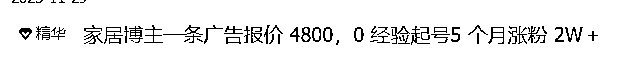
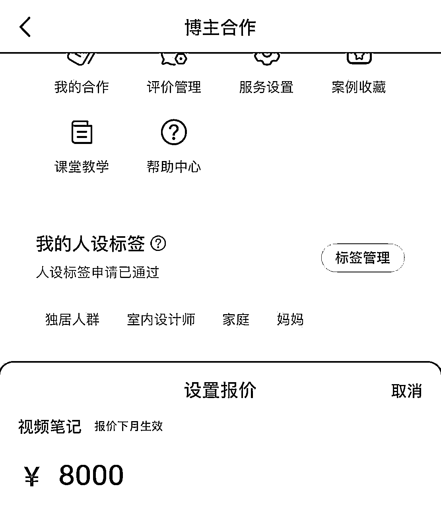
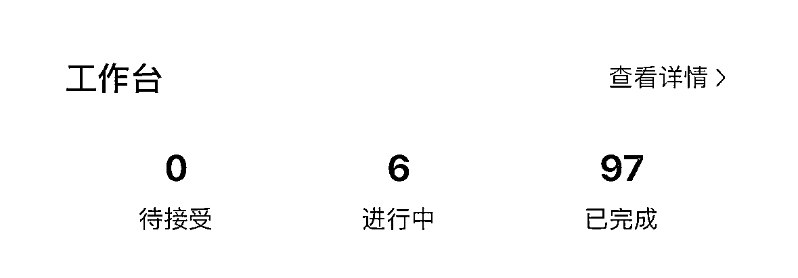
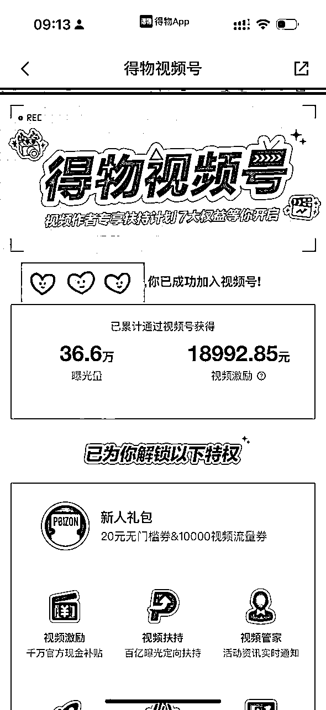
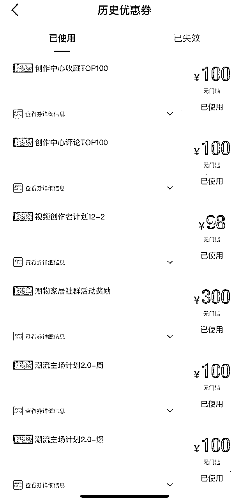
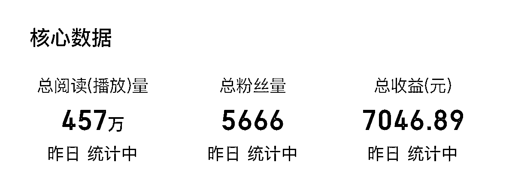
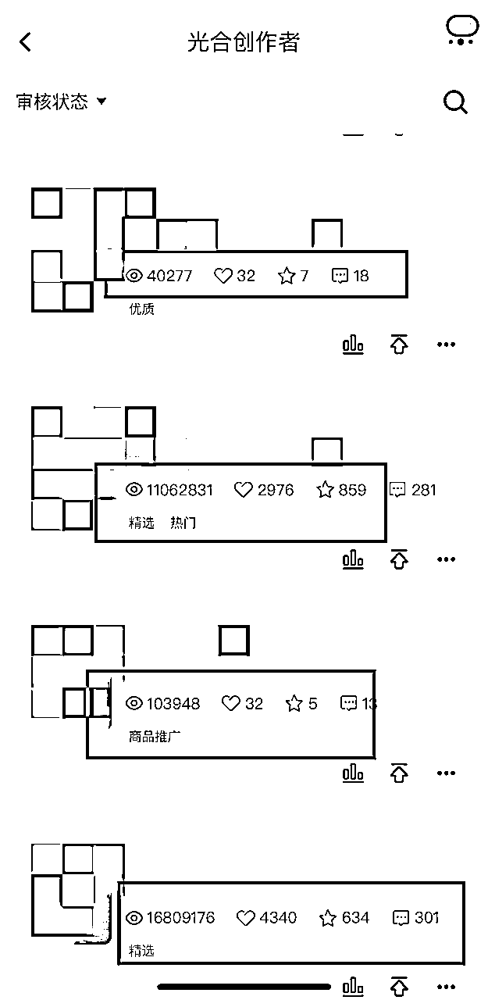
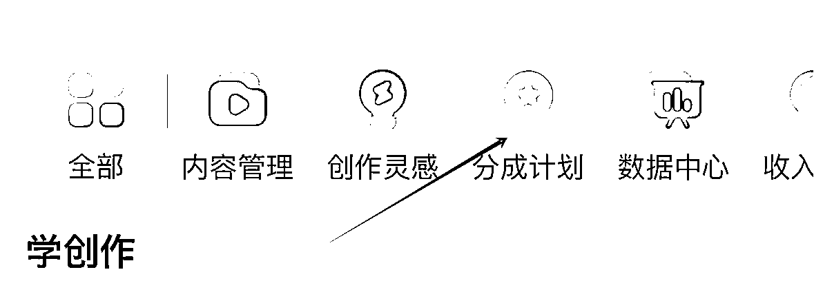
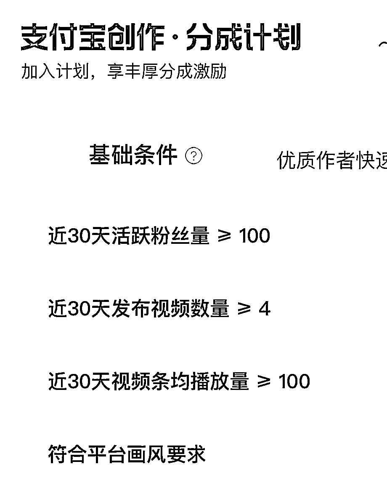

# 生财第二年，自媒体博主如何实现收益最大化

> 来源：[https://nppwiv0upp.feishu.cn/docx/EKQ9dh2zLo4yRwxU7SGcnXDknjd](https://nppwiv0upp.feishu.cn/docx/EKQ9dh2zLo4yRwxU7SGcnXDknjd)

hello，圈友们好我是十一，今年是我加入生财的第二年，距离上次分享已经间隔有一年的时间，在年度续费节点来临之际，我也想对这一年来的自媒体之路做一个小小的复盘，也向生财的圈友们汇报一下今年的项目进度，写作水平不佳大家多担待。先奉上上期链接方便圈友们衔接本期内容。

https://articles.zsxq.com/id_cv3k5lfijxss.html

上图是去年的主题，今年的粉丝量没有特别迅速的增加，目前小红书单平台不到4w粉，报价去到了8000一条，线上有100多条的广告合作，当然还有水下的，因为是家居博主所以产品大多数是品牌赠送，毫不夸张地说家里的家电家具基本全部零成本。

除此之外一鱼多吃，作品在全网分发，粉丝数量在10w＋变现数据还算可观，也算是在自媒体博主这条路上摸索出了属于自己的一条路

在上一期分享中已系统解析小红书起号方法论，本次将聚焦"一鱼多吃"战略的实战落地，重点拆解非主流平台的掘金路径。通过持续3个月的全平台矩阵测试，提炼出四大高价值分发渠道运营模型。

# 【全渠道分发底层逻辑】

基于"3×3"测试法则建立分发策略：

## 平台筛选三要素

*   流量倾斜方向（新兴内容板块）

*   商业变现通道（广告/带货/补贴）

*   用户匹配度（平台核心用户画像）

## 内容优化三阶段

*   初筛测试：基础分发观测自然流量

*   数据验证：重点突破播放量＞2000平台

*   深度运营：建立平台专属内容生产线

## 收益组合三维度

*   直接变现：平台分成/带货佣金

*   间接价值：品牌资源积累/供应链置换

*   长尾效应：SEO权重提升/私域导流

# “一鱼多吃”的“鱼”都在哪里？

拿我举例，我的主战场是小红书，可我擅长短视频，那么我需要知道还有哪些国内平台是以短视频为主（抖，快，视）又或者哪些平台在往内容板块发展（得物，逛逛，支付宝，百家号，爱奇艺甚至美团）

所以在了解平台属性之后，我会先把视频分发上去试试水，看看各大平台的反馈，一旦发现浏览量还不错的情况下重点拆解突出视频的结构以及脚本，二创混剪或者实拍，所以在测试过所有平台以及收益验证之后，推荐大家除了主流平台外，几个流量大，收益高的小众平台（适用于任何赛道）

# 【高价值平台拆解】

经实测筛选出四大高潜力渠道：

## 一、得物

• 流量机制：双瀑布流+视频号专属流量池

*   创作者激励计划（CPM约15-20元）

*   品牌种草直通车（单条广告报价粉丝量的10%）

*   平台资源包（年度购物券，一年省下不少钱）

• 运营建议：

*   重点布局3:4竖版视频

*   平台在扶持AI内容，做AI自媒体的同学可以同步下内容

*   与类目小二建立深度联系

## 二、百家号

• 收益模型：

*   基础流量分成（千次播放收益3-5元）

*   带货分佣（家居类目平均转化率1.2%）

*   星图任务（腰部账号月均接单量5-8条） • 运营技巧：

*   布局知识付费专栏

*   搭建SEO关键词矩阵

*   参与平台热点话题补贴

相对来说千次播放收益不算高，不过可矩阵批量化生产内容

## 3.淘宝逛逛

• 现状分析：

*   混剪内容过审率＞85%

*   平均千次播放收益0.5-1元

*   隐藏价值：店铺导流成交增量（实测带来15%自然流量提升） • 优化方案：

*   植入商品卡智能推荐

*   绑定品牌会员体系

*   参与逛逛造物节等IP活动

以下是逛逛视频部分流量截图，还是相当容易拿到流量的

## 4.支付宝生活号

• 收益结构：

*   独家流量补贴（CPM可达50+元）

*   本地生活服务分佣（餐饮/酒店类目8-12%）

*   商家代运营服务（年度框架合作20w+） • 避坑指南：

*   谨慎选择MCN签约模式（实测自主运营收益高30%）

*   重点布局生活服务类内容

这个平台我去年风向标有分享过，建议所有内容创作者都去研究一下，绝对大有可为，千次播放收益非常高，因为这个是签了MCN所以没有收益截图，去年一年的单账号播放收益有10W＋，正是因为踩了签约的坑所以也刚好帮圈友避雷，自主申请分成计划的步骤如下图。

满足要求即可开通分成计划（目前查重不严，可搬运二创）

特别提醒：

1.  支付宝生活号慎签MCN（我的血泪教训）

1.  得物平台务必开通视频号，图文没有分成收益

1.  所有平台开通后立即申请商品橱窗（哪怕暂时不带货）

虽然目前还没有达到年入百万的目标，但是60分的水准也希望能给更多还没有拿到结果的圈友树立信心，希望明年再分享的时候，我已经可以自信的给自己打80分！

最后祝大家，把手弄脏，多多生财！