# 小红书虚拟资料（教师）精准引流变现经验分享

> 来源：[https://wiz662adgxu.feishu.cn/docx/ENt7dSgM7ob7Aux2TkocmqG7ndd](https://wiz662adgxu.feishu.cn/docx/ENt7dSgM7ob7Aux2TkocmqG7ndd)

# 一、教师资料变现项目是什么？

## 1.项目简单介绍

在小红书发布老师工作中需要的各种文档、上课和家长会等需要的 PPT 笔记，他们需要后就会找你要资料，你让他们加到微信后，以 9.9、19.9 或者更高的价格卖给他们（也有用小红书店铺卖货的，这篇文档不涉及哦）。

## 2.可以卖什么？

小红书发布售卖资料，主要以班主任资料和任课资料为主。

### 2.1 班主任资料

可以卖的第一种班主任资料：例如下面笔记提到的这些，家长会 PPT 和逐字稿、期末评语等等

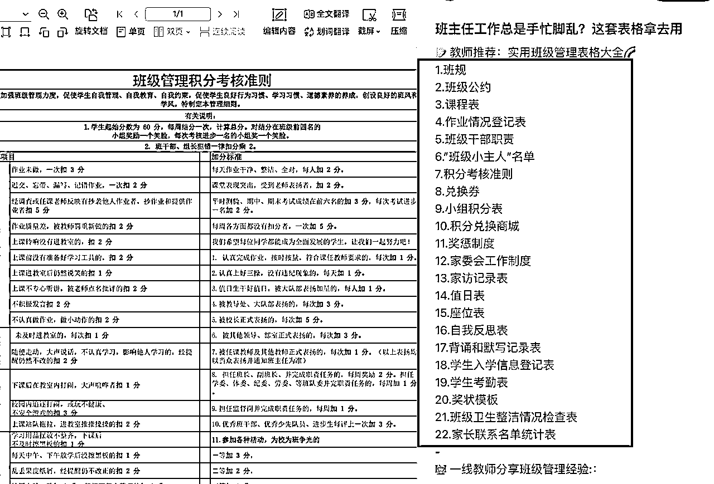

### 2.2 任课资料

教案课件，如语文课件、数学课件、英语课件、心理健康课件、体育课件、道法教案等等，还有各种公开课、作业任务单、晨读早读课件等等

# 二、需要准备什么？

## 2.1 心理预期很重要

如果你没做过小红书，或者没做过副业项目。

那你最重要的是先获得正反馈，你的目标我建议是：我先注册第一个账号，我先制作第 1 篇笔记，我先发布第 1 篇笔记，我先成功引流 1 个人，我先加到了 10 个人，我成交了第 1 单。

如果你已经做过小红书，或者有尝试过副业项目

那我觉得目标就可以是我先更新 3 个号，我加到第 1 个人，我卖了 1 块钱，我卖了 100 块钱，我卖了 1000 块钱。

如果是实操很多次项目的，那我就悄悄的……

## 2.2 准备 3 个小红书账号

我是建议使用起码 3 个小红书账号来准备，如果一开始没办法注册这么多账号，也要用起码 2 个账号来进行项目。

如果你用 1 个账号来实操，那可能（也是大概率）发布第 1 篇数据很差，发布 5 篇数据还是很差，发布 10 篇数据也是很差，然后你就放弃了。

用 3 个账号，你每个账号发你 10 篇笔记，你第 1 个账号数据一直很差，第 2 个账号小眼睛不超过 100，第 3 个账号没准账号发布了 1 篇笔记数据好了，就爆了，那恭喜你能赚到钱了。

并且账号因为各种原因违规后，你也还有其他账号可以发，同一篇笔记爆了你几个号去重后再发，也有可能爆。

用我自己的经历来举例，2 月份初开学，我发布了语文晨读课件，做了 6 个账号，第 1 个账号爆了，引流了不少人后笔记被举报，号也没了。我第 2 个号也爆了，好像两三天后这个号也没了，我第 3 个号也小爆了。

## 2.3 注册发话题贴测试账号

注册小红书后点开视频，看笔记，多评论互动一下，或者看直播，多评论互动一下最后点个关注，浏览的时间半个小时起。

然后发一条话题笔记，例如姓“劳”取名字、被裁员怎么办？怎么度过低谷期

第二天如果笔记不符合加热要求，提示异常发布或者存在异常互动，那么再发一条话题笔记。如果还是不符合加热要求，注销这个账号，然后重新注册账号。

第二天，如果笔记可以正常进行薯条加热，并且小眼睛大于 5，那么账号正常，今天可以正常发 1 条笔记

## 2.4 账号隐私设置

在「设置-隐私设置」下将「我的收藏、我的表态」设置为「不公开」，隐藏「关注与粉丝列表」，具体操作路径看下图：

## 2.5 账号简介设置

账号头像：小红书搜索“教师头像”“头像”，然后截图保存后在主页设置修改

账号昵称：设置修改为 XX 老师，比如豆豆老师，小雅老师，兰兰老师等

账号简介：不用写，也可以找同行对标的来进行设置

## 2.6 找准关键

项目一开始最重要的是：你要发什么笔记，抓紧做笔记，抓紧发笔记。

所以，要不要一机一号，流量不够怎么办？换设备怎么办，等等这些都不重要。

## 2.7 做好账号违规，封号的准备

可能甚至可以说是一定会遇到的违规有：

笔记涉及异常发布或异常互动、群聊违规、账号发布过多营销推广内容、笔记涉及诱导他人点赞评论收藏等互动行为的内容、被举报笔记侵权、账号流量权益被限制等

群聊违规就解散群聊，并只能用小号在群内发布引流视频和回复内容

发布过多营销推广内容就注销账号，将手机刷机然后重新开始

诱导点赞就修改笔记内容

流量权益被限制就注销账号，手机刷机重新开始

出现的各种问题都有对应办法，问题不大。

# 三 、怎么找选题？

## 3.1 火过的内容还会再火！爆款总是重复的

首先需要知道，爆了 的内容还会再爆，所以你需要做的就是重复，找到的选题是别人爆过的，你去做到这样的笔记和选题，然后重新把笔记做一遍，然后会再爆。

下面是我做过的笔记，同样的选题和资料，换一种方式去重后，发出去还是会爆

## 3.2 找选题的 6 个原则

这里先说一下，6 个原则满足 2-3 条我就会选择去做发笔记，不然会把时间浪费在找选题上，并且很难找到同时满足的选题笔记。

### 3.2.1 看供应和需求

注意看一下供给小于需求的笔记。你如果看到一份资料数据很好，在搜索框搜索看一下这份资料发的人多不多。

按照“综合”“最新”排序下，同一份资料发的人多不多，如果同一份资料发的人有很多，那我就不大会考虑发。

### 3.2.2 看付费意愿（必须满足）

找付费意愿强，转化高的资料和产品笔记（必须满足）

这一条是我必须会满足的，不然好不容易把笔记流量做起来了，引流到了微信，结果发现卖不出去，那就很可惜。这里我前期就有踩坑。

比如表扬信，我发过一篇每天引流好些人（具体数据记不大清了），数据到了几百赞，但是转化很低，但是没有多少人愿意付费买。

这里推荐一些自己做几个小时一两天起，做起来麻烦不如花 9.9、19.9、49.9 这些省心的资料，比如家长会 ppt，教案，公开课等等。

### 3.2.3 低粉爆赞

低粉爆赞，优先低于 1000 粉丝的笔记，点赞大于粉丝数。粉丝数超过 1000 的号，自己是新号，你去抄模仿爆的概率相对较少。

比如下面这篇，点赞 1392，粉丝 534，点赞大于粉丝数，并且粉丝小于 1000，就是一个很好的选题。

### 3.2.4 近期有大量求分享（重点）

评论区 24 小时内有大量想要，求分享，求购买类似的评论（重点）

为什么我会考虑 24 小时内？

因为 24 小时内说明这篇笔记目前平台还在给他推荐，有热度有流量，并且现在这份资料是教师们需要的。

### 3.2.5 素人笔记

关注素人号，实拍分享笔记内容（容易火）

为什么要关注素人号？

其实这种笔记通常都会满足其他的几个原则，比如低粉爆赞，是异常值，近期有大量求分享等。

因为我发布了很多篇笔记，都火起来了。

比如图 1 的 2 篇期末评语，其他账号发布也火起来引流了不少人，图 2 虽然没有多少引流变现，但数据都火起来了，图 3 我发布数据也不错。

图 4 我 1 月底过年前发布数据涨到了几百赞，可惜号没了，过年后新号发数据也是火起来了（转化也比较差），图 5 也是 1 月底过年前我发涨到了几百赞后账号没了，2 月初发数据还是涨到几百赞。

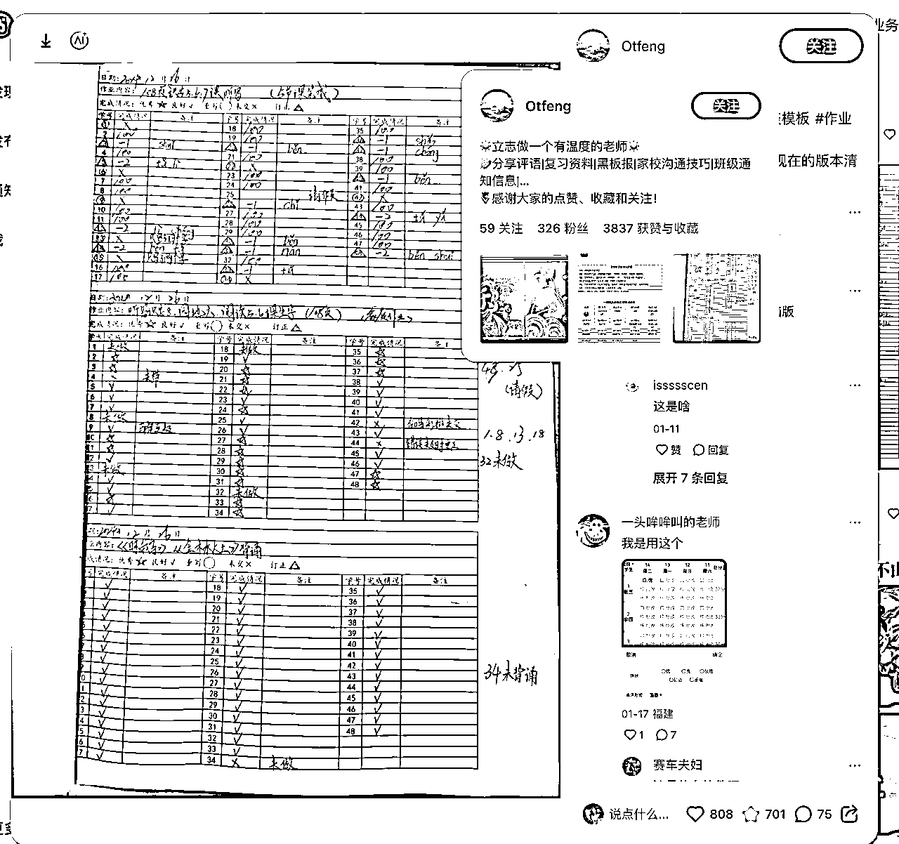

### 3.2.6 异常值

就是显著异于其他数据表现的情况，小红书上最多的就是“某几篇笔记数据都很低，这个时候突然有几篇笔记数据很好”的情况。

比如下面图 1，标注之外的笔记点赞最高不超过 10 个，结果出现了 1 篇 100 多点赞，1 篇 200 多点赞。

比如下面图 2，突然出现了 1 篇笔记超过了 1300 点赞，这就是一个异常值，其他的类似。

再强调一下，满足 2-3 条原则就是很不错的选题了，超过更多的很难找到，重点是找到个不错的选题，赶紧做好笔记发出去才是重点。

## 3.3 在哪里找选题？

### 3.3.1 关键词搜索+联想词

如下图，通过关键词和联想词可以获得一些不错的关键词去搜索笔记，然后根据找笔记的选题来进行判断。

这里第一个关键词也会看到有多少篇笔记，可以集合搜索出来的笔记，大致判断一些竞争程度。

如果刚开始接触项目，不知道搜什么。那可以从这几个开始：xxx 年级 xx 科目 xx 教案/课件、xxx 年级家长会/公开课等

搜索后，点击“筛选”按钮，各个排序依据下都看一下前面的笔记。

### 3.3.2 发现页笔记

在「发现页」看到数据不错的笔记，点进去，看评论区，看点赞收藏，然后点进主页看粉丝数据，点击「刚刚看过」快速跳转到刚看的那篇笔记看数据。

如下面案例，评论区有很多 24 小时求分享的笔记；点赞 281，粉丝 55，点赞大于粉丝；粉丝数不到 1000 是低粉爆赞；284 点赞比其他作品都要更好是 1 个异常值。

不到 30 秒，就获得了一个很不错的选题，值得快速验证做一篇笔记。

### 3.3.3 话题标签找笔记

在笔记标签下，找一个点进去，看一下综合、最新、最热这 3 个排序下的笔记，然后看一下发布时间、点赞数、评论情况、粉丝数，根据选题原则来进行判断。

通过话题标签也可以很好的看一下这个话题标签近期的热度，最近发的多怎么有热度，并且也可以帮助判断一下竞争程度。

### 3.3.4 额外的一些选题方式

可以用正在发笔记的方式刷一下发现页，也会发现不少低粉爆款笔记，素人笔记。

小号关注一些优秀的同行笔记，关注后发现的笔记会通过发现也推送给你，也可以在「关注」页看到，不过「关注」页的时间排序是乱的。

小号通过关键词搜索「商品」，然后查看评论区的近期评论，如果近期热度搞销量高，商品页会显示多少人购买，24 小时内多少人加购。

## 3.4 有了很多选题，那要选什么？

如果已经卖出去了第 1 单，已经爆了 1 篇笔记，那就优先重新把卖出的笔记去重后继续发，什么资料卖的多优先发什么，起码要保证每天都有更新。

比如我家长会 PPT 已经卖出去了，我今天只能发 9 篇笔记，那我最起码会保证有 2-3 篇是发同一份资料的家长会 PPT 笔记。

## 3.5 要不要发干货笔记？

我自己做是不需要发干货笔记，直接开始发可以卖出去的资料产品笔记就可以了。原因是，哪怕再低的浏览量，你的产品笔记也能卖出去资料，并且好的产品笔记也会“爆”起来。

# 四、怎么做笔记？

## 4.1 先看看常见的资料类型

教师资料，主要分为文档和 PPT 的两种资料为主。

教案、逐字稿、班主任表格类似的文档类型，家长会 ppt 和上课需要的 PPT 资料类型。

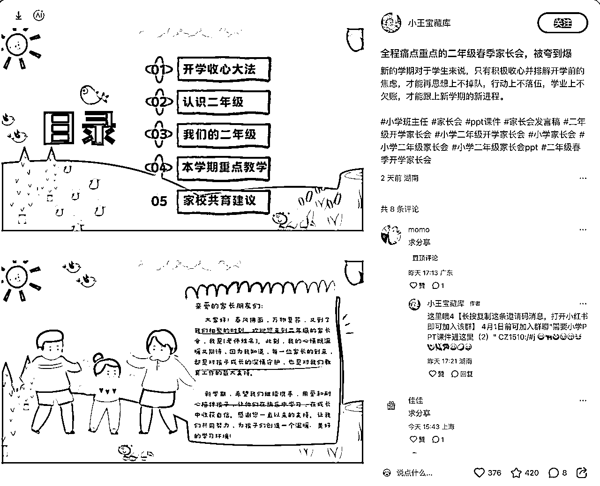

文档类型的后面做笔记基本不需要怎么单独的处理。如果是 PPT，通常是 PPT 截图，拼图或者是实拍的资料。

现在了解这 2 种资料后，我就教你快速制作笔记，熟练的话你可以将做一篇笔记的速度缩减到 10 分钟以内。

我们制作的笔记效果是怎么样的？制作出来就是尽可能模仿一个实拍的效果。

如果是文档，类似下面这样的实拍，或者换一个背景

如果是 PPT，类似是下面这样

那让我们开始！ 别担心，按照实操下来相信你都可以搞定的

## 4.2 先统一获取单页图片并准备好模板表格

### 4.2.1 如果你有源文件

第一步，用 WPS（需要 WPS 会员）打开源文件，不管是 PPT、PDF 还是 Word 文档都用 WPS 打开。（以 PPT 做演示）

第二步，点击「文件」，选择「输出为图片」

第三步，「输出方式」选择为「逐页输出」，其余的操作设置根据个人设置就好。

小技巧：如果需要制作拼图类的资料，可以使用「合成长图」，「页码选择」输入 1-3，4-6 类似的完成长图输出

到这里，如果你有源文件，那这里就获取了单页图片，后面就可以通过后面的几种方法，来进行快速的制作。

如果你是 PDF 文件按照下图选择导出，然后参加上面的第三步。如果你是 Word 文档，导出方法同上面 PPT 文件导出一样。

到这里后，就获得了单页的图片，然后按照下面 4.2.2 部分的步骤进行处理（跳过第四、五步）。

### 4.2.2 如果你是模仿爆款笔记

注意：新手需要的是先模仿，再原创！模仿爆款笔记不是要抄袭，注意避开有版权的工作室、机构出的有版权作品，选择弱版权，无版权的资料哟。

第一步，点击下载图标，用插件将笔记图片下载下来，插件会将图片、标题和笔记内容打包进行下载，然后打开即可。

这步可以根据自己的使用选择来，我也会将插件安装包放到文档最后。

第二步：新建一个 Excel 表格，名称随便命名，存放文件夹都可以，只要你找得到就行。

第三步：打开 Excel 文件，然后复制需要处理的原笔记图片，将鼠标选择在 A2 单元格，然后将图片粘贴进来

第四步：点击「图片工具」，选择「批量处理」下的「裁剪」。

第五步，选择一个裁切的的范围（只需要大概区域符合即可）。

点击「✅」后就会自动开始裁切，自动处理完后，点击「覆盖全部」就会自动替换表格里面的图片了。

补充：如果遇到这种是倾斜视角的，还可以点击「自动矫正」，多数时候都可以自动完成裁切矫正

很多时候处理效果也非常好

第六步：选择「图片工具」下的「左对齐」

第七步：选择图片的情况下，单击鼠标右键选择「图片嵌入单元格」

第八步：继续单击鼠标右键选择「转为浮动图片」

第九步：在 A1 单元格将随便属于一个标题内容

最后保存，这里就大功告成了。

不要担心，这里看起来步骤很多，实际上一点也不少……其实熟练之后两三分钟不到就搞定了，非常快速。

补充：使用的插件叫做「小金薯」

## 4.3 可画批量创建笔记（PPT 类）

### 4.3.1 先准备一个笔记模板

首先：进入到可画的官网，登录后点击创建设计

点击「小红书帖子」

然后你就得到了一个空白的「小红书笔记」，进入了编辑页面。然后将我们准备的背景图片复制粘贴进来

放大图片将背景图铺满页面

「素材」下选择一个「相框」

将相框铺满需要替换的内容，给“挡住”。

恭喜，到这里就已经完成一大半了，随便拖入一张图片到「相框」里看看效果。

补充：上面为什么要用相框，不用一张资料图片挡住的一个好处是可以在编辑器里面的图片，可以直接拖到相框里面完成替换，如果用资料图片就没办法快速替换。

### 4.3.2 快速制作一篇笔记

在「应用」下，选择「批量创建」

选择上传数据

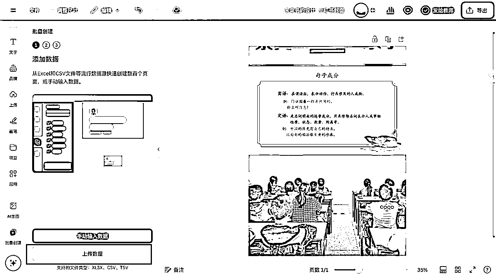

选择 4.2 部分准备好的 Excel 表格，并且打开。一定要注意表格里面的图片必须要是「浮动图片」，必须要有「标题」，不然无法成功识别。

点击「继续」

选择需要被替换的图片，然后点击「关联数据」下识别到到 Excel 表格里面的标题，然后点击「继续」。

继续点击「生成 xx 个设计」

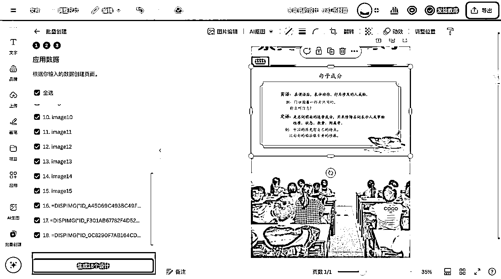

然后等待生成

然后不到 1 分钟，一组笔记就做完了，非常的快，非常的不错。

最后导出，下载就大功告成，非常的 Nice。

通过上面的从 4.2-4.3.2 的这几步，看起来需要你要点很多步骤，但其实你熟练之后，每篇笔记制作的时间都能控制在 10 分钟以内。

### 4.3.3 快速创建多篇同一选题笔记

那如果你有 1 篇笔记爆了，你有 10 个账号，你都想再发一篇，那怎么办呢？

那这个时候继续用可画，重复 4.3.2 的步骤，你就可以在半小时内制作很多篇笔记，平均下来 10 篇笔记都花不了 30 分钟，一篇笔记不到 5 分钟。

首先，你需要重复 4.3.1 部分的内容，准备好不同的笔记模板。

然后你需要制作多少篇笔记，你就打开多少个笔记模板

补充：在首页，你做好的笔记模板（可画里面叫“设计”）添加星标后，会固定在侧边栏，建议将准备的模板都添加为星标。

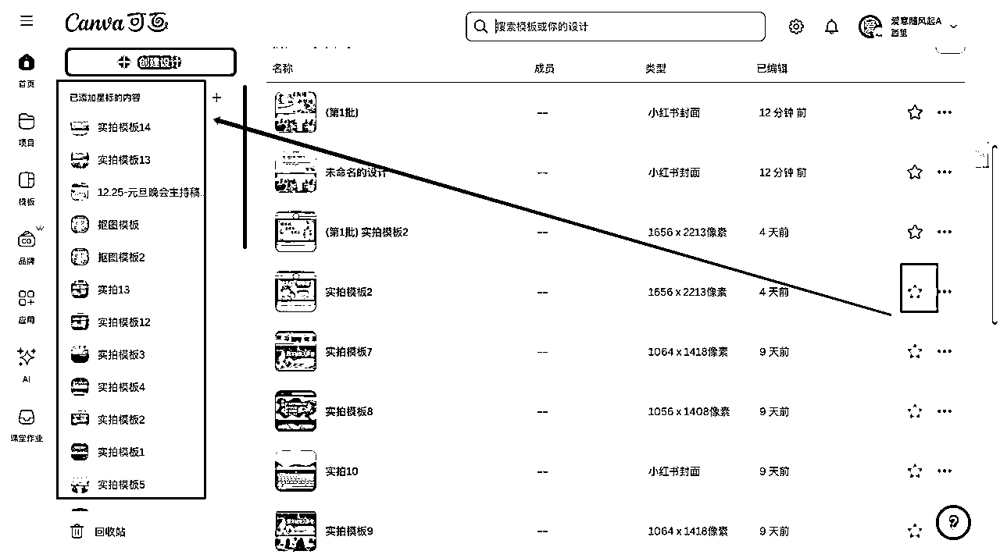

鼠标放到星标内容下需要打开的模板位置，单击鼠标右键，选择「在新标签页中打开」

你准备了多少个模板，想制作多少篇，你就打开多少。

然后挨个点开标签页，重复 4.3.2 的步骤，然后等待生成。同时生成的笔记多的话，等待的时间会长一些。

## 4.4 可画抠图换背景

### 4.4.1 先创建抠图的笔记模板

第一步，先将准备后的抠图背景图片，铺满页面

第二步，将需要抠图的背景调整到适合的比例大小，比如下面我这种就铺满页面（无强烈违和感就好）。

注意：如果需要抠图换背景的笔记图片较多，按照 4.3.2-3 的步骤创建好笔记。

### 4.4.2 AI 抠图处理图片

先选中图片，然后点击「AI 抠图」就可以自动完成抠图了，就这么简单。

如果识别有问题，就看下面 4.4.3 部分的内容。

### 4.4.3 AI 提取主体

选中图片，点击「图片编辑」后，选择「AI 提取主体」。

然后点击要保留图片的部分内容，如果遇到没识别的区域，就点击一下

比如这里点击图片后，还有手指没有识别到，接下来点击一下手指。

点击「抓取」后，就完成了抠图

最后将背景和相框给删掉，就处理完做好笔记了

删除完就完成了处理，效果还很不错。

## 4.5 美图模拟实拍&换背景（文档类）

### 4.5.1 美图秀秀批量制作模仿实拍笔记

第一步，点击批处理

第二步，「打开图片」或者「打开文件夹」都可以，把图片给选择导入进来。

第三步，点击「加素材」下的「添加图片」导入一张准备的实拍的 A4 纸张图片。

第四步，选择混合模式——正片叠底

第五步：调整 A4 纸张图片比例

第六步，选择「保存全部」就可以了。

补充一下：「正片叠底」是什么，来看看 DeepSeek 的介绍。

### 4.5.2 美图秀秀快速替换文档资料背景

换背景图片，可以使用各种纹理图片，牛皮纸图片等等都可以尝试，按照 4.5.1 的操作，添加「背景图片」，然后选择「正片叠底」就可以了，例如替换为下面这几种

替换前：

替换后

注意：如果觉得背景图影响阅读体验，可以调整一下「不透明度」

### 4.5.3 快速创建同份文档的多批文档笔记

按照 4.5.2 的步骤制作保存后，不要关闭或者清空图片，先选择「删除」掉背景图，然后重复 4.5.2 部分的操作，你就可以在很快时间内制作出多篇笔记。

## 4.6 剪映将图文制作为视频笔记

### 4.6.1 为什么要把图文变为视频？

主要是有 2 点，一是为了去重，将图片变为视频后，是可以通过平台的审核。二是视频的基础流量，会比图文笔记更高一些，视频笔记虚拟资料，相对竞争也会更低一些。

### 4.6.2 实拍文档资料变视频笔记

第一步：导入需要处理的笔记图片

第二步，将需要处理的图片，拖入一张到剪映的轨道里面，并且拖动图片，时长拖到 3 秒

第二步，然后复制图片，需要处理几张图片就复制到几份

第三步，将图片拖动导入到轨道上到图片

然后选择「复用原视频效果」和「替换片段」，然后同样的操作完成所有的图片替换。

第四步，在「转场」里面搜索翻页效果，然后选择免费版的「翻页」转场，拖入到 轨道上。

然后反复操作，都把图片添加「翻页」转场效果。

第五步，选择「音乐」下的素材，然后添加到轨道上。

第六步，按快捷键「B」将多余的音乐素材分割出来，然后删除掉

第七步，导入一张 A4 实拍图片到剪映轨道上。

第八步，然后把图片纸张部分铺满全部页面

第九步，在「画面—基础—混合」下选择「正片叠底」

最后，选择导出，参数可以使用默认的就可以

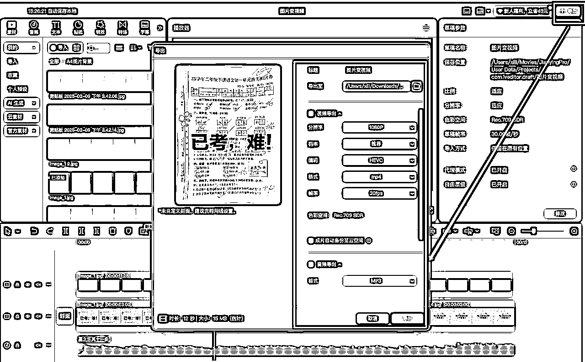

### 4.6.3 文档图片制作实拍视频笔记

如果是资料图片，那可以打开 4.6.2 的图片，选择将图片把轨道上到图片给进行替换。

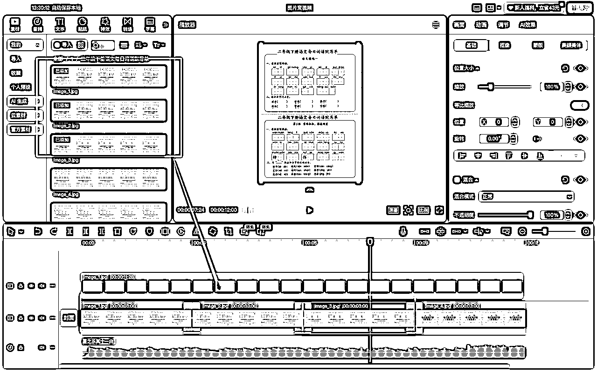

因为上面有 A4 纸张图片选择了混合模式，所以这里直接导入图片后会有一个模仿实拍笔记的效果。也可以使用 4.5.1 的方法先制作为模仿实拍笔记的效果，这样效果会更好。

### 4.6.4 课件 PPT 制作视频笔记

第一步，在剪映里面导入一张背景图

第二步，将需要处理的 PPT 导入到背景图到上面轨道（如果需要获取 PPT 图片，看 4.2 部分的内容）

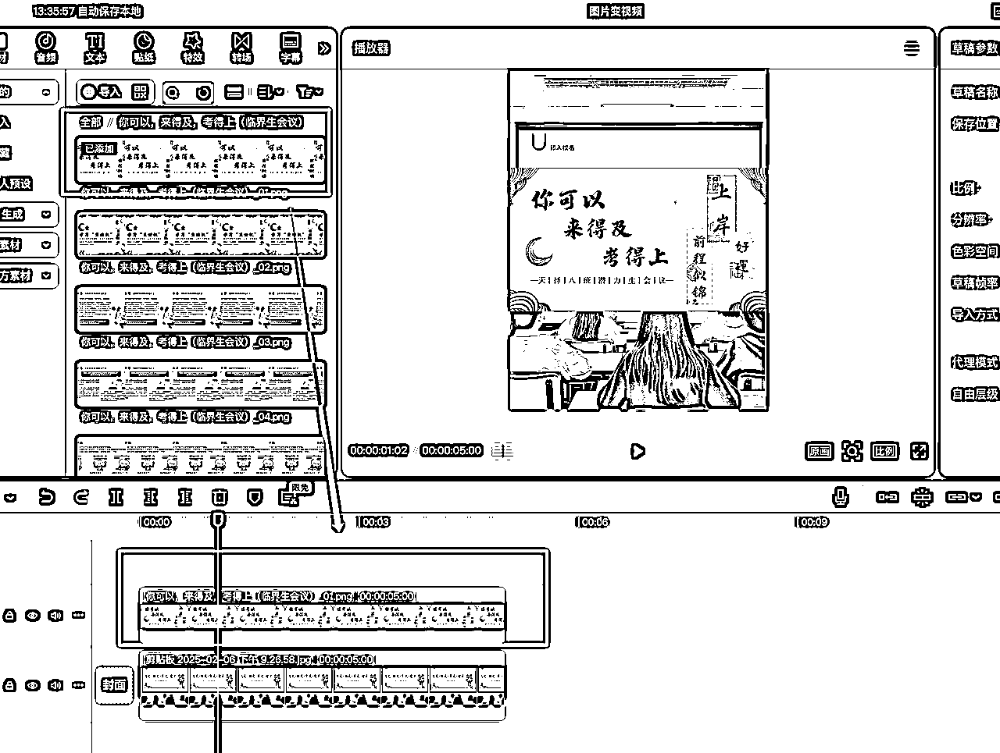

第三步，然后将图片缩放盖住原来背景图上的内容（可能需要裁切图片）。

第四步，调整轨道图片时长，需要处理放几张，然后将背景图图片对齐

最后，拖动需要处理的图片完成替换，并且添加「翻页」效果，添加背景音乐，然后导出。具体操作看 4.6.2 的操作。

# 五、怎么发笔记？附小技巧

### 5.1 怎么把笔记传到手机？

如果你做的账号是 3-4 个，可以用电脑 QQ 复制粘贴发笔记到群里，图片顺序不会乱。

### 5.2 怎么写标题？

刚开始写笔记的时候，如果不知道怎么写，那可以使用下面这两种方法。

第一种关键词组合：25/最新版➕xx 年级➕xx 资料➕有 xx 页/有课件+教案/有讲稿

如：人教版一下数学核心素养教案共 145 页！

第二种参考笔记重写：将原来的笔记标题顺序替换、加入 emoji 标签、关键词替换就好。

如下面的截图标题：🔥被校长夸爆！一场直击痛点的家长会！&直击痛点不废话的数学家长会！被校长夸爆/家长感动哭

### 5.3 怎么写笔记正文？

### 5.3.1 笔记正文

笔记正文里面，最好是留下可以引导用户要资料的提示。

比如：有配套课件 ppt 共 xx 页｜有 xx 页完整版可打印｜有完整版｜有可编辑文档/PPT｜有逐字稿

并且可以多用特殊符号的🈶️🉑类似的。

如果提到 xx 页面，要进行不完全展示，比如说共 10 页，笔记里面只放了 5 页，那用户就更可能找你要完整资料。

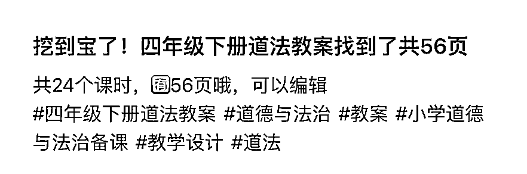

### 5.3.2 笔记标签

笔记标签写 5 个左右就可以，并且可以围绕你发的资料来进行。如果你是模仿爆款笔记，那可以使用爆款笔记的话题标签，适当增减就好。

每个账号的话题标签，可以打开编辑器复制粘贴过去到小红书编辑器里面，可以自动识别成功不用再手动输入。

用微信输入法「跨设备同步」，电脑复制，手机粘贴也可以被识别（如果不行就在小红书编辑器里面长按，然后选择粘贴就可以）

### 5.3.3 关联群聊

发布笔记时关联小红书群，这样会有要资料的，看到后直接点击入群，没办法及时回复，做的账号多建议关联群聊。

# 六、怎么引流？

## 6.1 什么时候开始引流？

当有人在评论区要资料、有私信要资料、有人关注的时候，开始进行引流

## 6.2 要做些什么？

1.  制作引流微信视频

1.  建小红书群进行引流设置

1.  评论区回复

1.  关注粉丝发送群邀请

1.  小号发送群微信视频（有 15-20 人左右发一次）

1.  定时查看小红书回复消息

## 6.3 怎么制作引流视频？

第一步，在可画新建一个正方形的「设计」。

第二步，导入引流微信的图片，铺满图片

第三步，用白色截图盖住「微信号」，然后改为“薇-信”

第四步，在「素材」下搜索「云朵」，然后添加到图片上盖住

第五步，输入「亲们，红薯没法发文件请➕下方薇-信」，设置倾斜，加粗和轮廓

第六步，添加线条指引到微信

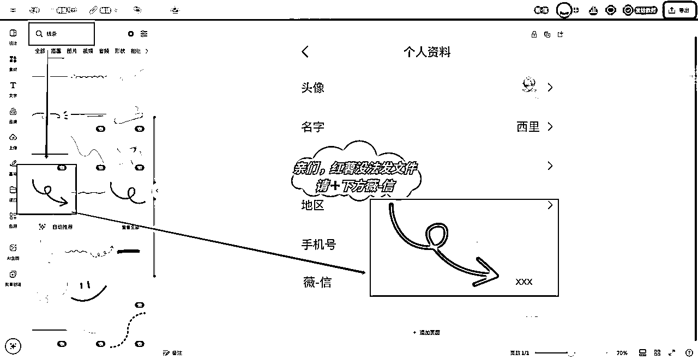

然后还可以给线条加入一些动效

最后下载视频就好了

## 6.4 怎么创建设置小红书群？

### 6.4.1 创建群聊

先点击「发现群聊」，点击「创建群聊」，群名称设置为「电籽版在群置顶」，群介绍可以设置为「需要课件教案的进来吧」

### 6.4.2 群打卡设置

点击「➕」号，选择「群话题」，话题名称设置为「➕引流的微信号」。话题介绍设置为「领 zi 料➕引流的微信号」

### 6.4.3 群置顶视频

将制作的引流视频发送到小红书群，长按引流视频，发送「岭 zi 料👀这里哈⬆️⬆️」，然后将这两条消息置顶。

### 6.4.4 设置群公告，群昵称

将群公告设置为「请看群置顶」，本群昵称设置为「领 zi 料➕引流的微信」。

### 6.4.5 设置群管理（入群方式、欢迎语、权限）

将进群方式设置为「允许任何人加群」

设置群欢迎语，将群欢迎语设置为「领 zi 料➕被引流的微信」

群成员权限，给全部关掉

## 6.5 要怎么引流？

### 6.5.2 评论区引流

小红书的推荐算法，关注的权重是最高的，然后是评论分享。所以如果是未关注的评论区要资料，要引导关注。

当有第一个人评论，回复“guan🐷我哦”，提示要关注，然后在评论区，长按评论置顶这条消息。如果有关注了的，那就可以回复“👌👌👌、好的安排，来啦，🉑以哦”类似的表述，并且多用特殊符号。

然后点击头像，进入到账号主页。点击消息图标，点击「➕」号，选择「分享群聊」，选择小红书群就好，最后等待入群即可。

### 6.5.3 私信区引流

点击进入私信聊天页面，点击「➕」号选择「分享群聊」，然后选择分享群聊。

注意：不管别人发什么，你只需要发送群聊邀请，不要回复消息！

### 6.5.4 关注页引流

互关的粉丝，不超过 40 人，就在小红书群选择「···」进入到「聊天设置」，点击「➕」号，选择需要邀请「互关好友」点击完成就可以了。

互关的粉丝超过 40 人，就进入到账号主页。点击消息图标，点击「➕」号，选择「分享群聊」，选择小红书群就号，最后等待入群即可。具体图片截图可以看 6.5.2。

### 6.5.5 小号发引流视频

如果有笔记爆了，或者群里入群人数多了，间隔 15-25 人可以用小号往小红书群内发引流视频。

前期刚开始做的时候账号数量不够，同时发笔记一定有数据普遍差的，这时候可以先用这个号发引流视频，然后后面准备单独的小号。

## 6.6 评论区维护

### 6.6.1 评论区回复

评论区主要 2 种回复策略：

面对未关注的，就回复「guan🐷我哦」类似的回复。

关注了的就回复「👌👌、好的来啦、安排」类似的回复，评论多了之后大多数人都会主动关注。

### 6.6.2 评论区引导

如果有笔记你突然感觉数据好起来了，比如这篇笔记发出去后，突然几分钟就有十多个人给你点赞。

那就可以拍一下有需要的资料包图片，然后置顶，然后评论一下笔记相关教师有需要的资料。

这里有 2 个小技巧：

一是将图片置顶，如果置顶成功就代表这条评论别人也能看得到不会被吞只有自己看得到；

二是图片最后倾斜一下角度拍摄，直接网盘截图或者拍摄网盘图片通过率会低一些。

# 七、怎么卖资料？

我主要是制作学习小红书选题和引流的内容，转化卖资料交付的部分接触不多，刚接触项目小白的话，重点解决发笔记引流是重点。

这里提 1 个技巧，2 个话术参考，然后其余的再根据客户回答来进行。遇到其他问题，可以根据同行来，同行是最好的老师。

## 7.1 微信简介筛选白嫖

先筛选白嫖用户，可以节省时间不和白嫖用户一直聊，如果你有笔记爆了还会减少添加你的人。

示例：🔥优质课件，整理不易小小有偿💰，白嫖勿扰哦～

## 7.2 话术成交逻辑

大致的成交流程是下面的这样，各个过程中的具体话术根据自己售卖的资料和同行来确定参考。后面出单多了，自己熟悉了，就可以做测试话术，看成交率来进行选择。

1.先询问需要什么资料，告诉需付费

2.发价格表，介绍，解决疑问

3.发付款方式

4.发客户需要的资料

5.告诉可以限时补差价提升单价

## 7.3 参考示例话术

新人前期最主要的是发笔记完成引流，这里介绍一下自我介绍和价格套餐设置话术，其他的可以向同行学习。前期把精力放到发笔记上面。

### 7.3.1.介绍话术

主要是提醒资料不免费，询问需要什么资料。

如：你好，我是 xx 老师，专注 xx 资料，资料整理不易，小小有偿哦，请问你需要什么资料呢？

### 7.3.2 介绍价格和套餐

xx 资料有的哦，资料获得方式主要有下面 3️⃣种：​​

1️⃣单份资料

✅公开课课件 PPT 9.9 米💰​

✅某年级教学进度表 9.9 米💰

2️⃣公开课资料包

✅年级公开课课件 PPT+逐字稿等资料包 19.9 米💰

✅某学年教辅资料教案➕课件➕公开课➕作业设计等资料包共 49.9 米💰

3️⃣资料会员

✅共 xxx 米💰享受 xxx T 的教师职业➕价值 xxx 教辅资料包➕xxx 视频资源，持续更新（强烈推荐）

# 八、6 个踩坑经验

## 8.1 注意小红书账号本身流量问题

注意按照流程，发布一篇话题笔记测试一下，确保话题笔记小眼睛大于 5，笔记可以正常进行薯条推广。

## 8.2 发布 10 篇后账号笔记流量问题

在确定制作笔记没有明确问题，更新 10 篇以后，注销掉小眼睛不突破 100 的账号。

我自己每个号更新 2-3 篇。这样如果是 3 个号更新，都更新 10 篇以后，相似的选题其他账号有超过 100 小眼睛，这个号一直没超过 100 小眼睛，那就考虑注销掉。

## 8.3 保证稳定更新

不管做了几个账号，建议都能保证稳定更新，比如每个号每天更新 2-3 篇，发布笔记的时间不一定要固定在一个时间，但是建议不要断更。

## 8.4 时效很重要

同一份资料，如果你不是独家资料，其实很多虚拟资料都是相似的。所以你评论区及时回复，私信及时回复，微信及时回复，可以很大的提升加微的转化率，售出资料的转化率。

建议固定时间段查看消息，比如 1-2 个小时看 1 遍小红书消息。

## 8.5.尽力做更多账号

如果可以做 6 个号就不做 3 个号，不要只做 1 个账号。

账号多，可以增加笔记爆的概率。比如我自己当时做了 6 个账号后，有 1 个账号笔记爆了之后，我每个账号都发了，并且接下来 2 天我都去重后发同一份资料。

2 天后号被举报被限流了，但是我其他账号开始继续爆了。

并且你做多个账号有更多概率火起来，被封 1 个账号也还有 2 个，如果只做 1 个账号，号被封就没了。

## 8.6 笔记爆了之后，避免易违规的操作

笔记爆了，尽可能避免引流账号易违规、或者风控的操作，比如发容易被举报的笔记资料，频繁切换账号，更换设备，群内用爆了的账号发引流视频等等。

# 九、最后

小红书教师虚拟资料最重要的是找到教师需要的资料，然后发布笔记，完成引流，然后卖出去。

前期先围绕找到选题资料，发布笔记来展开，把资料先卖出去最重要。

最后，感谢希平哥，学习到很多，小红书笔记选题方法，笔记制作，引流方法，真心无保留的分享，我也是实现了从只能做三四个号到现在，变化太多啦～

犹如新生。