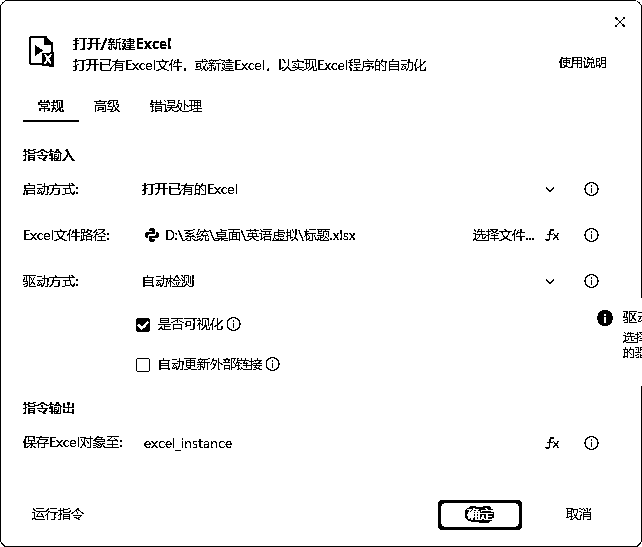
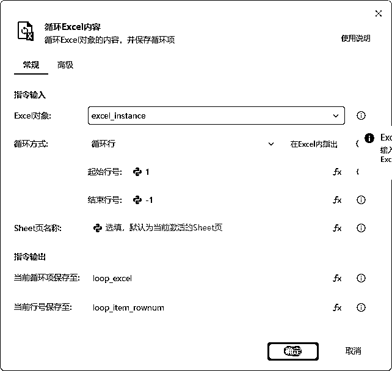
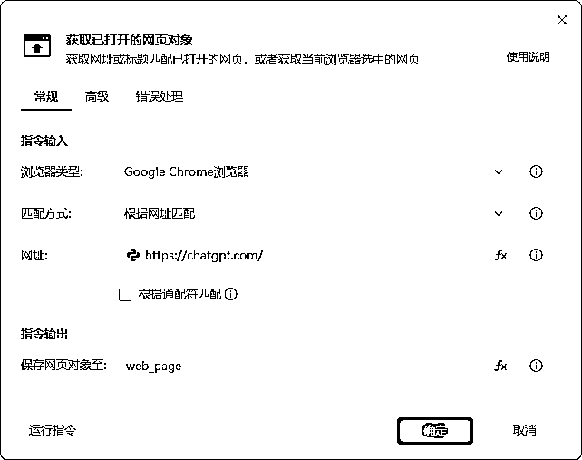
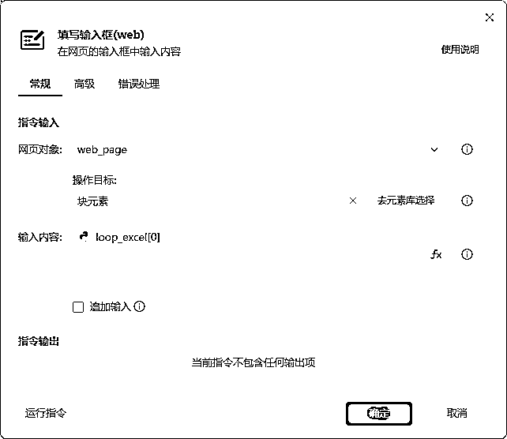
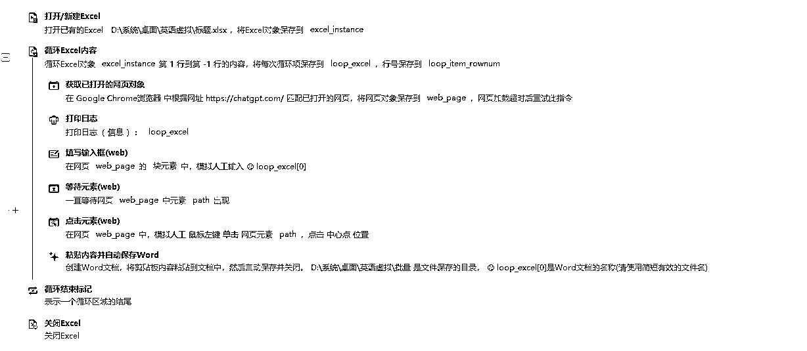

# 利用AI+RPA，快速打造内容自动化工具

> 来源：[https://stdjhxpwyn.feishu.cn/docx/EjPkdNUK4o8fQ1xHxMPc06Hjnwg](https://stdjhxpwyn.feishu.cn/docx/EjPkdNUK4o8fQ1xHxMPc06Hjnwg)

#### 环境准备

1.  安装软件

*   下载影刀RPA：官网下载

*   安装Chrome浏览器（版本≥115）

*   安装Office/WPS（确保默认保存为.docx格式）

1.  账号配置

*   注册ChatGPT账号并登录网页版（chat.openai.com）

*   准备Excel数据文件（如 data.xlsx），确保表格无合并单元格。

# 第一步

将标题复制到Excel并保存，将文件位置保存好。（我是提前准备好标题，生成标题跟生成内容是一样的）

# 第二步

从影刀创建文件，找到之前创建Excel文件路径，复制到文件路径

# 第三步

创建一个循环列表，我的表格是一排的数据，所以我这个是起始行号1，-1是最后一个。（这个是循环Excel里面的的内容）

# 第四步

这个是匹配gpt链接

# 第五步

这个是gpt输入框，将Excel数据传到这里，注意点是需要切换一下四叶花。

# 第六步

获取gpt复制按钮

# 第七步

操作word文件创建、内容复制、保存

下面实例代码

