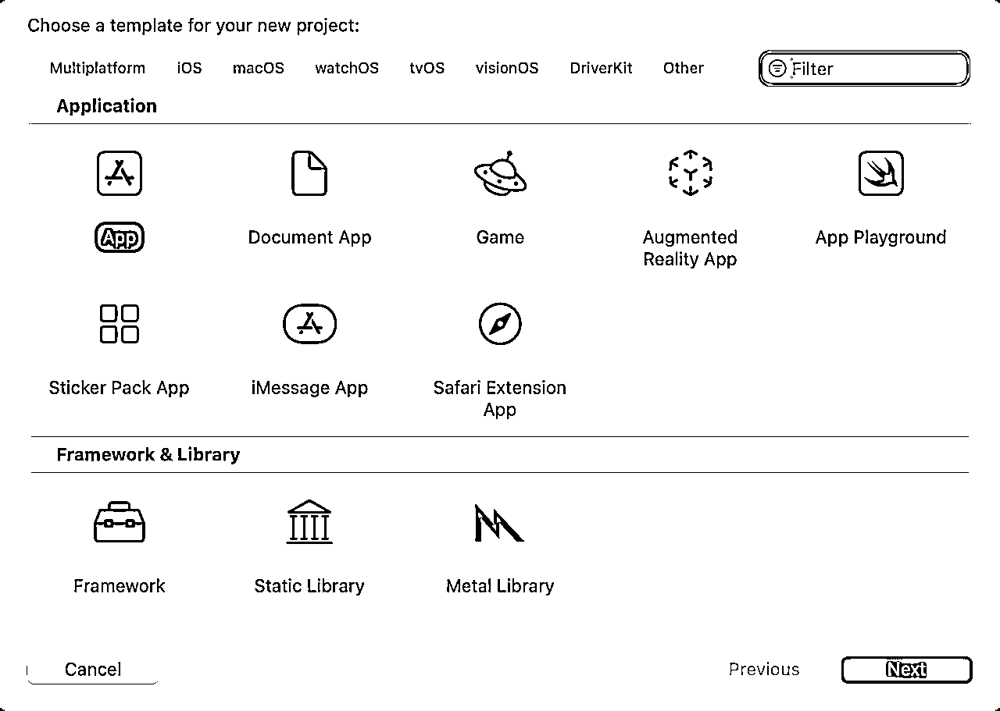
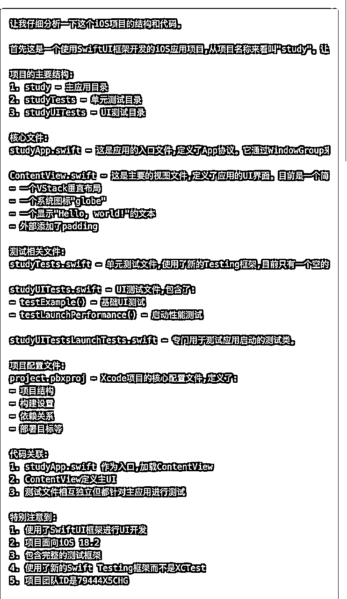
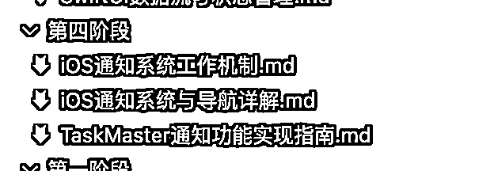
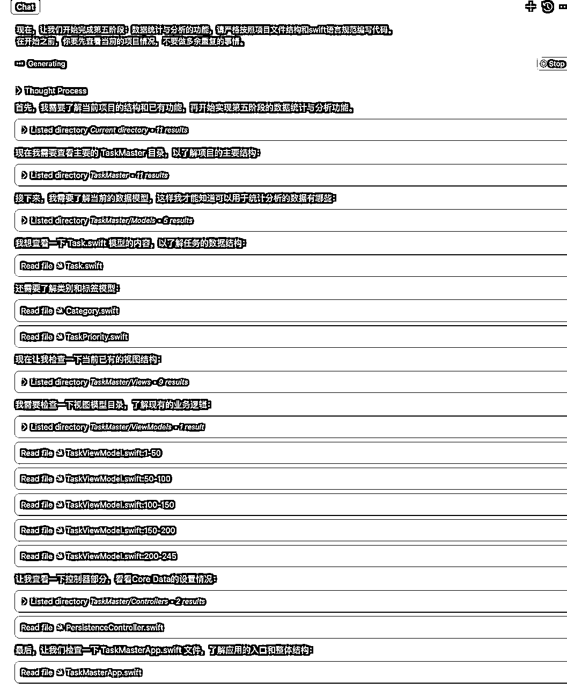
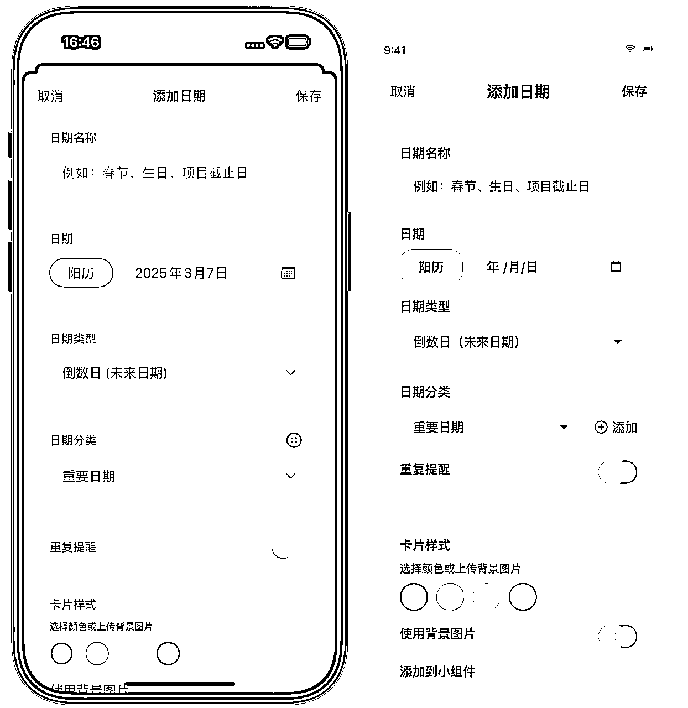
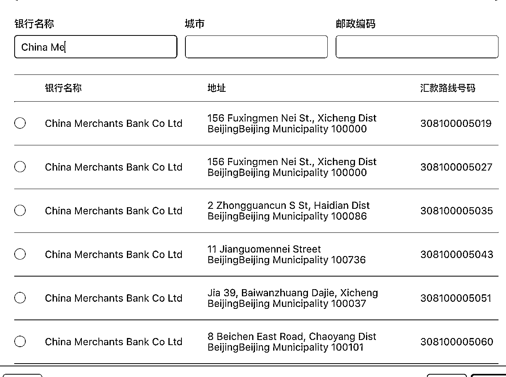

# 不懂ios编程的人，怎么才能做出一款小而美的APP?

> 来源：[https://vqxvy65apk2.feishu.cn/docx/Esf9d94NUoav65xkjpUcBY0qnpf](https://vqxvy65apk2.feishu.cn/docx/Esf9d94NUoav65xkjpUcBY0qnpf)

大家好，我是阿紫，从上个月开始，我就一直在思考一件事：不懂ios编程的人，真的能做出一款精美的app吗？

为了得到答案，我经历了近一个月的尝试，想向大家汇报一下我的成果，并将我的行动总结成了此文，欢迎大家的阅读。

## 背景

上个月，我第一次尝试做app，花了2天时间，怎么做也做不好，各种bug，也看不懂AI写了啥，一头包，弃之。

本人虽然是程序员，但从没接触过ios开发，可以理解成一个粤菜厨师，突然来做川菜，就锅和勺一样，其他还是一头包

而这是我花了5天(含工作日，实际更短)做出的app，功能有多样化日期记录、倒计时，事件时间线，准备清单，小组件，iCloud同步等一系列功能，我认为这应该算一个小而美的app了。所以我可以说，我做到了。


目前app已上架app store, 有兴趣的圈友可以尝试一下，交个朋友，app叫：记痕


那中间那么长的时间，我到底在干什么呢？

## 思考

在第一次尝试失败之后，我进行了以下思考

*   我不知道AI到底有没有理解我在表达什么，AI虽然说他懂了，但实际结果却没懂

*   我无法判断AI到底是在干活还是在糊弄我，结果就是在糊弄我，我除了骂他两句一点办法没有

所以我可以不会IOS编程，但我需要看懂AI在干嘛，这就像你不会做菜，但需要理解厨师在厨房里做什么，这样你才能对它指手画脚

不会真有人敢在厨房对老婆指手画脚吧~

## 学习IOS编程(不是）

先说我的学习方法

*   AI是最好的老师，我们要养成遇到问题就问AI的习惯，直到搞清楚为止

*   当遇到AI陷入问题循环一直解决不了时，尝试与他沟通。

如当我们说这个功能有问题，你帮我解决一下，它一直解决不了时。我们可以说，一般这样的功能我们会怎么实现它？和他聊完后：那你看看我们现在的实现方式是对的吗？

或者你肯定也会有自己的思考，可以提醒他：那我们是不是搞错了，你看你说的是A，但你刚刚又在做B。

*   技术来源生活，在学习的过程中，多让AI进行类比，借助你已有的知识理解新的知识。

如：这块知识我没理解，你可以举个生活中的例子吗？或者：这是不是就像..

在这篇文章，我更倾向于表达我是怎么和AI交互的，对于一些非关键性的操作我就不放了，避免文章臃肿，因为我相信，只要学会AI交互的技巧，你也可以在AI的帮助下搞定它。

### 开始学习

首先，安装好xcode，并新建项目





这里我随意取名为study，并且我看到下面的选项里可以选择不同的东西，但我并不清楚有什么用，如


于是我截图并打开cursor进行提问


如果你感兴趣的话可以尝试进行一些追问，本文大多问题我都进行了追问

创建完毕之后，就来到了这个界面


我对这个界面也是一无所知，所以


我注意到AI老师告诉我可以直接拖拽控件预览，我表示很感兴趣！


简单玩了一下，好吧，我没有美感


把修改回退一下，继续学，刚刚AI老师讲了，xcode自带源代码控制，所以我们可以直接到对应的界面将代码回滚


没有AI的帮助太难受了，所以，cursor, 启动！




这里我追问了他回答的一些专业术语，代码里面每一行，每个关键词的含义和作用。

### 如何在cursor上开发

因为我们重点还是使用AI编程，所以cursor会是我们的主力，在砍柴之前磨好刀是很有必要的。

使用cursor开发ios需要安装一些插件

1.  安装 Swift、CodeLLDB 插件

Swift 插件提供了 Swift 语言的基本支持， CodeLLDB 插件提供了调试功能。

1.  安装 SweetPad 插件

可用于配置在编辑器中代码格式化、调试等功能。

安装好插件后，我们会看到有编译上的一些报错，如图


解决方法：

安装xcode-build-server

```
brew install xcode-build-server
```

再使用命令

```
xcode-build-server config -project study.xcodeproj -scheme study
```

study是我的项目名，请替换成你的。

如何使用SweetPod?

在cursor左侧，将插件钉选到布局上，方便使用


运行之后选择一下设备就可以了，等待一会，就会打开

#### 代码格式化

```
brew install swift-format
```

打开cursor settings.json文件。

快捷键 command + shift + p， 输入"打开用户设置"


添加配置

```
  "[swift]": {
    "editor.defaultFormatter": "swiftlang.swift-vscode"
  }
```

不出意外，现在编辑代码保存后会自动格式化了。

#### 代码热重载

代码热重载可以让我们在修改代码时立即刷新UI查看效果。

举个例子，原来修改了一行代码，必须要重新启动项目，才能看到效果，个人觉得很费时间，修改代码5秒钟，启动项目1分钟。

现在修改后立即生效，项目无需再重启。

效果如下

设置方法如下

1、打开appstore, 搜索InjectionIII安装


2、选择自己的项目


3、点击Prepare Project按钮


4、在xcode打开项目对应 Target 的设置 -> Build Settings -> 搜索 Other Linker Flags，分别添加 -Xlinker 和 -interposable


现在，就可以自由的在cursor上开发ios了~

xcode是什么？不知道，不认识，离我远点，我怕cursor误会~

### 以案例为驱动

学习新东西我一直遵守守破离原则，在什么不懂的情况下，老师教什么我就学什么。

所以我这里就让AI老师出了个课程，让我可以建立一个基本知识系统，能看懂老婆到底在厨房折腾啥


然后我让他将学习方案写到.cursorrules文件里(你懂的~）

这是产出的学习方案，给大家参考一下，我认为还是很不错的

```
# Task Master项目学习路线

## 项目概述
Task Master是一个功能完整的待办事项管理应用。通过逐步实现各项功能，系统地学习iOS开发技术栈。

## 功能阶段

### 第一阶段：基础任务管理
**目标功能：**
- [ ] 任务列表显示
- [ ] 添加新任务
- [ ] 删除任务
- [ ] 标记任务完成状态

**涉及知识点：**
- SwiftUI基础（View、Text、Button等组件）
- 列表视图（List）
- 导航视图（NavigationView）
- 基础数据模型（struct、protocol）
- 状态管理（@State、@Binding）
- 视图间通信

**学习要点：**
1\. View协议和视图结构
2\. 数据模型设计
3\. 用户交互处理
4\. 列表数据管理

### 第二阶段：任务详情与编辑
**目标功能：**
- [ ] 任务详情页面
- [ ] 编辑任务信息
- [ ] 任务优先级设置
- [ ] 截止日期管理

**涉及知识点：**
- 表单处理（Form）
- 日期选择器（DatePicker）
- 导航管理
- 数据持久化（CoreData）
- MVVM架构

**学习要点：**
1\. 页面导航控制
2\. 表单数据处理
3\. CoreData基础操作
4\. 状态管理进阶

### 第三阶段：分类与筛选
**目标功能：**
- [ ] 任务分类管理
- [ ] 标签系统
- [ ] 筛选功能
- [ ] 搜索功能

**涉及知识点：**
- 高级列表操作
- 搜索控制器
- 过滤器设计
- CoreData关系管理
- 复杂数据模型

**学习要点：**
1\. 数据关系处理
2\. 搜索算法实现
3\. 界面交互优化
4\. 数据库查询优化

### 第四阶段：提醒与通知
**目标功能：**
- [ ] 任务提醒设置
- [ ] 本地通知
- [ ] 重复提醒
- [ ] 提醒管理界面

**涉及知识点：**
- UserNotifications框架
- 后台任务处理
- 日期时间处理
- 系统权限管理

**学习要点：**
1\. 通知系统集成
2\. 后台任务调度
3\. 用户授权处理
4\. 提醒逻辑实现

### 第五阶段：数据统计与分析
**目标功能：**
- [ ] 完成率统计
- [ ] 任务趋势图表
- [ ] 分类统计
- [ ] 数据导出

**涉及知识点：**
- 图表框架使用
- 数据处理与计算
- 文件管理
- 异步操作

**学习要点：**
1\. 数据可视化
2\. 统计算法
3\. 文件操作
4\. 性能优化

### 第六阶段：设置与个性化
**目标功能：**
- [ ] 主题切换
- [ ] 应用设置
- [ ] 数据备份还原
- [ ] 用户偏好设置

**涉及知识点：**
- UserDefaults
- 主题管理
- 文件系统
- 设置页面设计

**学习要点：**
1\. 主题系统设计
2\. 设置页面架构
3\. 数据迁移
4\. 用户偏好管理

## 进阶功能（可选）
- [ ] 数据同步（iCloud）
- [ ] 小组件支持
- [ ] 快捷指令集成
- [ ] 手势操作优化
- [ ] 动画效果
- [ ] 辅助功能支持

## 技术架构
- SwiftUI
- CoreData
- Combine
- UserNotifications
- FileManager
- CloudKit (可选)

## 开发工具
- Xcode
- Simulator
- Instruments
- Git

## 学习资源
- [Apple SwiftUI 教程](https://developer.apple.com/tutorials/swiftui)
- [Swift 官方文档](https://swift.org/documentation/)
- [Human Interface Guidelines](https://developer.apple.com/design/human-interface-guidelines/)

## 进度追踪
- 开始日期：[填写日期]
- 当前阶段：[填写阶段]
- 完成功能：[填写数量]
- 总体进度：[填写百分比]

## 注意事项
1\. 每个功能完成后进行测试
2\. 注重代码质量和重构
3\. 保持良好的Git提交习惯
4\. 记录学习心得和问题解决方案

## 项目里程碑
1\. 基础任务管理（第一阶段）
2\. 完整的CRUD功能（第二阶段）
3\. 分类和搜索系统（第三阶段）
4\. 提醒通知系统（第四阶段）
5\. 数据分析功能（第五阶段）
6\. 设置与个性化（第六阶段）

记得定期更新进度，每完成一个功能就打钩标记！
```

### 设计项目结构

新手接触AI编程一大难点就是：让AI写好了功能，但完全不知道功能对应的代码在哪个文件里，想做功能迭代或者出了bug根本不知道怎么问，只能让AI自己找对应的代码，极其痛苦。

所以我们一开始就要理清楚整个项目结构，不能把代码随便乱放，让后续的开发井然有序。

Ios app的最佳实践是什么呢？我也不知道，还是请出AI老师。同样的，这个过程中，有问题就问。


很明显，这里出现了不一致的问题，AI推荐的文件夹结构和xcode创建的很不一致

考虑到AI的语料库比较旧，于是我在github上翻开最新的ios app目录结构，成功找到了案例


该开源项目和最新xcode创建的项目完全一致，我只需参考这样的目录结构进行开发就可以了

我注意到项目都是大写字母开头的，为了更好的学习，我重新创建了一个TaskMaster的项目


### 完成App功能

接下来就是按照AI给的阶段，一步一步的完成整个App的功能点，并进行学习

#### 第一阶段


AI写好之后，尝试运行看看效果


界面并不是很好看，功能是正常使用的，但没有关系，我的目的主要是学习掌握ios编程。这样我才能不被AI耍的团团转。


这里我突发奇想，当我理解了这个知识点后，可能我过段时间就忘了，那我其实是可以让AI总结成文章转化成知识库的。

好的，我现在理解了这一部分内容，感谢你的回答，请你帮我将这些知识点总结成一篇markdown格式的文章笔记，写到 @iosDoc 目录下


这里我花了断断续续好几天的时间，把第一阶段的所有代码都理清楚了，并让AI整理了好几篇文档。这个过程因人而异，我在后面实践中发现，其实也不需要学的这么仔细，还是那句话，你只要保证你能看懂厨师在做什么就行，又不是真要你炒菜。至于你能不能看懂，我相信你有自己的评判标准。


这里的学习程度因人而异，我个人是喜欢把这些东西搞懂，所以花了很长时间。

如果你只想知道每个功能在哪里，能简单明白AI在做什么，那不需要像我这样。

#### 第二阶段

现在，让我们开始完成第二阶段任务详情与编辑的功能，请严格按照项目文件结构和swift语言规范编写代码。


我天真的以为经历过第一阶段的磨炼，第二阶段学起来将如鱼得水，但AI老师给我狠狠地上了一课 ┭┮﹏┭┮

这是我在第二阶段所学习的内容，花费时间 +1天


#### 第三阶段

现在，让我们开始完成第三阶段分类与筛选的功能，请严格按照项目文件结构和swift语言规范编写代码。

在开始之前，你要先查看当前的项目情况，不要做多余重复的事情。


第三阶段需要学习的知识逐渐减少，处于回顾前两个阶段所学和挖取更多细节的情况


#### 第四阶段

现在，让我们开始完成第四阶段提醒与通知的功能，请严格按照项目文件结构和swift语言规范编写代码。

在开始之前，你要先查看当前的项目情况，不要做多余重复的事情。


阶段四的功能比较简单，只是加个设置提醒按钮，重点学习怎么将事件发给ios，做出通知的效果，并且在用户点击通知后，回到对应的任务详情页



#### 第五阶段

现在，让我们开始完成第五阶段：数据统计与分析的功能，请严格按照项目文件结构和swift语言规范编写代码。

在开始之前，你要先查看当前的项目情况，不要做多余重复的事情



第五阶段内容主要是学习图表和文件导出的实现方式，在功能完成调试完毕之后，我认为我的知识储备已经达到了一定的水平，有了一个基础的知识体系，这个项目已经学习完毕了。后续更多的知识点可以在做app时遇到了再进行学习。

简单分享一下效果


### 小结

在整个过程中，我也在观察目前AI对项目的掌控力，会不会随着项目的复杂度增加而减少。

结论：bug肯定会有，但相比于之前还是少了很多，其中大部分的bug AI可以自己解决，过程中有一两个bug AI陷入了困境，问题的原因比较极端，在和AI沟通之后，因为我也能大致看懂它在干嘛了，所以也发现了问题，就让它解决了。

## 实战做App产品

没错，学习完毕，接下来就是实战了。虽然我依旧不会写代码，但我可以看懂他在干嘛了。

### 生成原型

这里我想尝试接近实际开发的流程，先有原型图，再让AI开发。这样我可以先理清UI交互和页面逻辑，确保这个产品是可以用的，而不是牛头不对马嘴，那做出来也没法用。

当然，原型图也是AI生成的，大概需要5分钟。

提示词：

```
我想开发一个【】现在需要输出高保真的原型图，主要功能包括【】

请通过以下方式帮我完成所有界面的原型设计，并确保这些原型界面可以直接用于开发：

1、用户体验分析：先分析这个App的主要功能和用户需求，确定核心交互逻辑。

2、产品界面规划：作为产品经理，定义关键界面，确保信息架构合理，用户流程顺畅。

3、高保真UI设计：作为UI设计师，严格遵循iOS设计规范(Human Interface Guidelines)，设计贴近iOS系统风格的界面，使用卡片式布局、圆角元素和适当的投影效果，确保视觉体验现代简洁。

4、HTML原型实现：使用HTML + Tailwind CSS生成所有原型界面，使用JavaScript实现基本交互功能，包括页面跳转、表单操作和数据模拟。代码文件应清晰分离为HTML、CSS和JS。

5、每个界面应作为独立的HTML文件存放，例如home.html、profile.html、settings.html, 使用index.html作为主入口，使用iframe方式嵌入这些HTML片段，并将所有页面平铺展示，方便整体预览, 每个独立页面之间应支持相互跳转，确保单独打开也能完整体验

- 真实感增强：
  - 界面尺寸应模拟iPhone 15 Pro（393×852px），并应用圆角边框（20px）。
  - 选择与应用主题相关的图片，避免使用明显的占位图（如灰色块或标有"image"的框）
  - 图标和UI元素可使用Font Awesome或Material Icons等专业图标库 (通过CDN引用)
  - 背景和内容图片可从Unsplash、Pexels等免费图库选取，确保风格统一
  - 添加iOS标准状态栏和底部导航栏，包含主页、小组件和设置三个选项卡。
  - 使用符合iOS风格的日期选择器、开关组件和列表样式。

请按照以上要求生成完整的代码，并添加必要的注释说明界面逻辑和交互设计考虑。
```

效果：


出原型的目的是让我们可以先进行尝试整个app的设计，先把原型改成理想状态，再着手开发。学习时做的任务管理很丑很大的原因就是没有预先设计，想到哪做到哪。

首先我觉得整体风格不好看，让他改。


第二步，我认为逻辑不自洽，改


花了一两个小时，将整体改到了我认为满意的程度。

到这里其实你已经可以拿到小红书上尝试销售了，看看市场的反响

### 生成开发文档

让AI将它整理成开发文档，用于下一步的app开发

```
这个项目中包含了使用HTML、CSS和JavaScript制作的交互式原型图。请分析项目中的所有文件，并整理出一份详细的Swift/SwiftUI开发规范文档，以指导实际iOS应用开发。

请在文档中包含以下内容：

1\. **Swift/SwiftUI设计风格与规范**
   - 从CSS和样式中提取主色调与调色板，转换为SwiftUI的Color系统
   - 分析字体规范并匹配至iOS系统字体，使用SwiftUI的Font系统
   - 归纳UI组件样式，并对应到SwiftUI原生组件（Button、List、TextField、Card等）
   - 总结动画与交互效果，并转换为SwiftUI动画和过渡效果实现方案

2\. **界面清单与功能说明**
   - 通过分析HTML文件，列出所有界面及对应的SwiftUI视图(View)
   - 分析每个界面的主要功能点，并考虑SwiftUI的状态管理方式
   - 梳理界面之间的导航关系，规划SwiftUI的NavigationView和TabView的使用结构

3\. **Swift数据模型设计**
   - 通过分析整个原型（HTML、表单结构和JS代码），提取核心数据结构并转换为Swift模型（使用struct和Identifiable协议）
   - 设计数据持久化方案（SwiftData或AppStorage）
   - 规划SwiftUI的数据流和状态管理（@State、@Binding、@ObservedObject、@EnvironmentObject等）

4\. **分阶段开发计划**
   - **重要：请严格按界面来划分SwiftUI开发阶段，每个阶段对应一个或多个相关界面的完整开发**
   - 例如：第一阶段开发主页界面，第二阶段开发添加内容界面，依此类推
   - 对于每个界面的开发阶段，请详细列出：
     * 该界面需要的SwiftUI视图组件
     * 该界面的状态管理和数据流设计
     * 界面上需要实现的交互功能和手势
     * 该阶段完成的验收标准

5\. **iPhone开发注意事项**
   - iPhone不同机型的适配考虑
   - 深色模式和动态类型支持
   - SwiftUI辅助功能(Accessibility)实现
   - 性能优化建议
   - App Store审核可能关注的问题

请确保文档足够详细，能够指导SwiftUI开发团队按照原型图的设计进行实际开发，并保证最终iOS应用在视觉和功能上与原型图效果一致，同时充分利用SwiftUI和Swift的现代特性。生成的分阶段开发计划应该清晰地指导开发者按照界面为单位，逐个完成应用的各个iPhone界面。
```

这样就得到了一份详细的开发计划

我尝试了将生成的内容划分到多个文档里，一个阶段一个文档，可能会更好的指导AI工作，可惜agent模型在生成多个文件时会非常缓慢，甚至失败，提示词我也给到这里，你有兴趣可以尝试一下

```
我需要您帮我将这个原型图项目转换为一系列模块化的iOS APP开发指导文档。

这个项目中包含了使用HTML、CSS和JavaScript制作的交互式原型图。请分析项目中的所有文件，并整理出多个专注的Swift/SwiftUI开发规范文档，重点放在设计指导和结构设计上，而非完整代码实现。

请在项目下生成以下独立但相互关联的文档：

**文档1：项目概览与设计系统**
- 项目简介和应用核心功能
- 从CSS和样式中提取的主色调与调色板，转换为SwiftUI的Color系统（仅提供关键颜色定义示例，不需完整实现）
- 字体规范并匹配至iOS系统字体（提供基本示例即可）
- 归纳UI组件样式特点，对应到SwiftUI原生组件类型
- 总结动画与交互效果特点
- 避免提供大量代码，仅以简短示例说明核心设计元素

**文档2：界面清单与结构设计**
- 通过分析HTML文件，列出所有界面及其基本功能
- 梳理界面之间的导航关系和流程图
- 简述各界面的主要组件和布局结构
- 提供SwiftUI视图层次结构建议，但无需详细代码实现
- 专注于架构和结构设计，避免提供完整视图代码

**文档3：数据模型与状态管理**
- 通过分析原型，提取核心数据实体和关系
- 提供Swift数据模型的基本结构（仅简要示例）
- 概述数据持久化方案
- 简述SwiftUI状态管理策略
- 仅提供模型定义的基本框架，不需完整实现所有属性和方法

**后续文档：分阶段开发计划**
- 根据原型中的实际界面数量，为每个主要界面创建独立的开发规划文档
- 严格按照界面来划分开发阶段，每个阶段对应一个界面的完整开发
- 界面应按照依赖关系和用户流程合理排序

对于每个界面开发文档，请包含：
- 界面的详细功能描述和用户体验目标
- 所需SwiftUI组件的清单
- 界面的基本布局和结构建议
- 关键交互功能的实现思路
- 开发要点和注意事项
- 仅提供关键组件的示例代码（如特殊的自定义视图或复杂交互），而非整个界面的完整实现

请确保每个文档都聚焦于提供开发指导而非完整实现。文档应该清晰描述"应该做什么"和"如何做"，而不是直接提供所有代码。这种方式既能指导开发团队理解需求和设计意图，又为实际开发阶段保留了空间。
```

### 开始开发

这一切都准备之后，使用xcode新建项目，再用cursor打开，对了，别忘了之前的配置项目的事情，热加载那些

#### 配置规则文件

将规则文件放到规则目录下 .cursor/rules


#### 第一阶段

然后截取主页的原型，输入提示词

现在，让我们开始完成第一阶段：主页界面（HomeView）开发，请严格按照项目文件结构和swift语言规范编写代码。

在开始之前，你要先查看当前的项目情况，不要做多余重复的事情


这是复现出来的效果，基本是一致的。左边是新出炉的app，右边是原型


#### 第二阶段

现在，让我们开始完成第二阶段：添加日期界面（AddDateView）开发，请严格按照项目文件结构和swift语言规范编写代码。

在开始之前，你要先查看当前的项目情况，不要做多余重复的事情

同时我注意到之前有添加日期界面了，但和原型不符，请修改它和原型保持一致 （根据实际情况调整提示词）

这是第二阶段的完成情况对比



#### 第三阶段

现在，让我们开始完成第三阶段：日期详情界面（DateDetailView）开发，请严格按照项目文件结构和swift语言规范编写代码。

在开始之前，你要先查看当前的项目情况，不要做多余重复的事情


后面的阶段就不放出来了，都一样的做饭

### 小结

在这个过程中，我主要遇到了一个挑战：小组件的开发

小组件的开发需要新建一个target，但我不知道，AI也不知道(可能是假装的)

在多次沟通无果后，我用上了开始学习的第二个方法： 一般这样的功能我们会怎么实现它？和他聊完后：那你看看我们现在的实现方式是对的吗？

他终于幡然醒悟，并告诉我应该怎么做。

## 发布app

### App Icon

app的图标可以用AI生成，你可以选择自己喜欢的方式，无论是用claude画svg图，还是用AI绘画都可以，做一个1024x1024的图片，上传至app icon目录即可


### 修改应用名称

因为我们的项目是英文名，如果你发布时想用中文名，就必须修改一下配置


这里有个version，发布新版本时记得修改它


### 上传到app connect


### 隐私政策

上传到app connct之后，接下来就在网页上打开 App Store Connect

主要填写这几个板块的信息，如果记不到也没关系，提交的时候会提示还有哪些东西没写


填的信息都很简单，按你的情况填就行

里面的有两个需要填链接的，一个是隐私政策，一个是技术支持。

可以直接在飞书上写，然后选择互联网可见就行了，比如这就是我的隐私政策

技术支持我也用的它

### 预览图

预览图可以使用软件做，也可以直接截屏

使用这个软件就可以做一些简单的了


这是我的app的效果


### 定价

定价也是在这个页面，填好之后要去商务页面更新一下你的银行卡信息


这里有点小问题，填CANPS代码时银行信息是英文


比如我是招商银行，就要去网上搜一下




大概就这些东西，其他的我相信你会，或者你可以通过AI学会

## 结语

整个学习过程我花了将近半个月，当然我还在工作，如果你是每天都在学，或者不像我死磕那么深入，我相信你使用的时间会比我很多。

同时，我也很庆幸我自己半个月的努力学习没有白费，因为我确实完成了一款小而美的产品，并且花了我认为可以接受的时间。主要的时间还是花费在小组件的坑点上。后续的app肯定会更快。

我相信，你也可以做出一款小而美的产品，希望看完本文对你有所帮助。

我是阿紫，我们下次见~