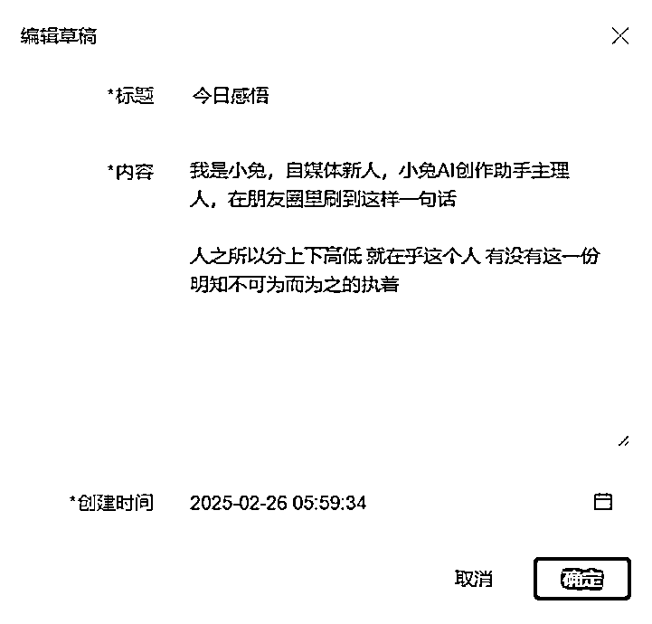
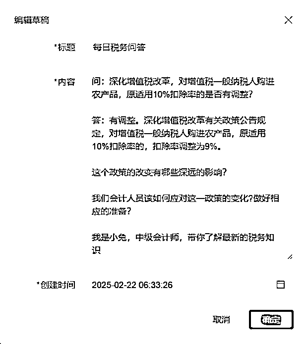
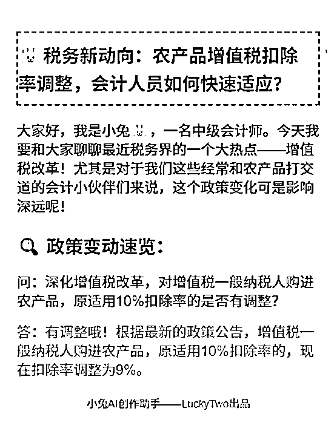
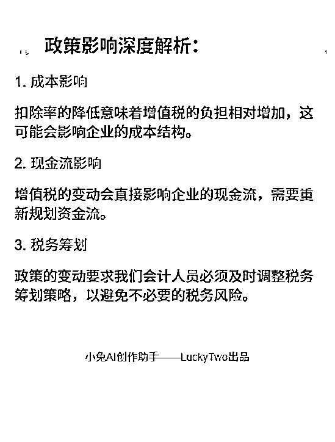
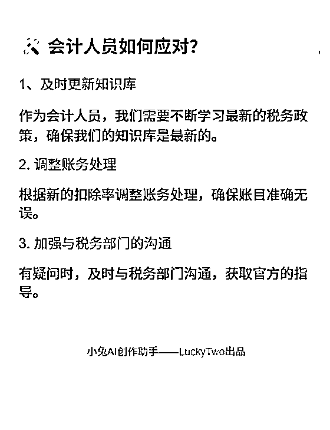

# 用cursor做出AI写作软件，接口是大热的DeepSeek，目前GMV2万+

> 来源：[https://barwz0eq5fn.feishu.cn/docx/F4hodPA0soSDs5xpblmcioXln4b](https://barwz0eq5fn.feishu.cn/docx/F4hodPA0soSDs5xpblmcioXln4b)

hi~ 你好呀！高效搞副业，请找宝藏兔！我是小兔，第一次在生财发文，希望多多指教！

自己和三个会计女生+一个技术人员做出了目前GMV2万+的AI写文软件

# 一、概要

从我有一个想法到GMV2万+，我们只用了57天！

Cursor编程+自研大模型+DeepSeek接口=LUCKYTWO

【小兔AI创作助手】699/年，57天我们卖了30套！

关于推广：

1、没有做过大规模的推广，因为感觉自媒体圈子里面的大型发售，跟这个软件不大一样，所以选择了朋友圈以及通过同行引流的方式，组建了4个200人的群，通过直播发售的方式，宣传软件，当晚卖了7个

2、在此之前，也在朋友圈做预告，提前提供内测，内测人员仅为10人，经过测试宣传，也给我们带了一波流量，也成功转化了一批内测人员。

产品怎么样，实话实说：

1、出文：比不上ChatGTP的出文效果，比DeepSeek、kimi、豆包、文心一言等AI要好一点；

2、无限次薅羊毛功能：任意一篇文章，无限次提取提示词！别人都是用提示词写文章，我是任意一个文章，提示词直接提取，目前市面上我还没发现有这个功能的软件，提示词在我这里是白送的！

3、草稿箱+创作区，可以一句话写IP文，解决了发文卡点

4、可以直接出图文，后面会介绍

5、出文效果根据个人能力有明显区分，有的人用的很好，有的人用的一般！

避坑：

1、测试反馈结果比较少，大多数是我们团队人员思考bug点，人群不够多，给不出太好的建议

2、软件前期接口不稳定，因为DeepSeek爆火导致卡了，技术人员临时加了一个备用接口（三年前DeepSeek状态的新接口），宣传用软件这块，在视频中教学员，学员吸收不高（公众号小白比较多，都是现申请的公众号）

3、一机一码，每人每天限制使用次数20次，目前看有人每天用到满，有人每天10次以上，大多数人5次以下！还有人不用囤着= =！

卡点：

1、打算出通用版模型，对于功能以及宣发，有卡点，还在研究中！目前卖的都是会计副业圈的人，我不想给她们加功能了，基础功能699/年，我觉得对她们的需求来说够用了！

2、我们是想通过，使用人群觉得产品好用，提供分成，让他们宣传；后来用的好的慢慢就不宣传了；其他人一开始兴致勃勃，后来就各种理由坚持不下去，达不到我们的预期效果。发现他们的宣传太少，达不到我们的效果。所以后续推产品需要想好如何宣发（暂时想到的是，我先带着那些好好坚持的人拿结果，看到别人赚到钱了，也许动力会足一点）

3、我们是自研大模型+DeepSeek接口，但是我不会宣传。入行做副业是24年9月29日，互联网没什么人脉，2月初看别人都在教本地部署，没忍住说真话“本地部署是个伪命题”，被大V发部署建议，老实了- -！人微言轻，不敢吱声！后来央视网发文，我才敢借着公众号文案在朋友圈发个长文出口气！自己揣着软件不会宣传，别人一说就不敢说话！其实联网新人是有点卑微的！

适合什么类型：

1、有想法写公众号，解放双手，突破发文卡点，对于用AI各种提示词，不大会用人群

2、想快速日更公众号的人

3、想写IP文的，我自己的想法+感悟+别人公众号写作手法=我自己的原创

# 二、软件开发日记 57天卖了30份

1月4日 “我有一个想法”

简单介绍一下会计四姐妹:

小兔：24年12月学了Cursor编程，算是四个会计女生里唯一有编程基础的女生！

姜宁：做了一年多的会计副业，24年12月至25年1月初收了大约40个学员，我们的销售主力；

醒醒：是战略型人才，对定价以及需求和痛点、是我们的掌舵人；

舒雅：CPA学霸，但对互联网相关操作基础为0，小白中的小白，细节的把控、文件的整理主要负责售后。

1月4日 上午9：03 我有一个想法，和合伙人商量要不要做合伙人的第一个产品？

用Cursor做一个AI写作软件，与普通的矩阵号不同的是，我要让它一键改写IP文！

经讨论决定，这件事可以做，于是当天下午14：34拉技术人员进群，谈软件初步合作

技术人员浩哥：20 年资深程序员，副高级职称，软考高项认证。擅长 Python/AI/ 云计算，主导千万级系统重构与架构优化，技术前瞻性强。曾带 30 人团队完成行业级系统平台核心项目，跨领域协作经验丰富。目前致力于推动 AI 与云计算在垂直领域的商业化落地。

这里只拿出其中一个视频分享，2025年1月18日软件内测中

外部人员内测与接口DeepSeek爆火 1月26日——2月25日

1月26日 我在自己的社群公布了三个内测人员，当时直接有三人报名，开启了我们的内测之旅

1月27日 培训课件，并在当晚公布软件价格：699/年

直接有一位小伙伴火速报名购买，同时报我的小兔三年合伙人5999/三年

视频内容：直接抓或者提取别人的爆款文章写内容

当时DeepSeek大火，让我很焦虑，担心自己的软件不如DeepSeek，技术人员让我放宽心，咱不比DeepSeek差！

1月28日 软件直接卡死，怎么都用不了，问技术人员才知道我们的接口是DeepSeek

1月31日 又找了7个内测人员 参与内测 同时卖了十多套软件（记不清了）

2月10日 正式发售，699/年 当晚第一次直播，卖了7套

截至3月1日，一共卖了30套

# 三、技术方面的思考

不好意思，这是技术人员用软件写的，他非生财圈友……后面他的引流文案被我删了，我认为有用的我标黄了

小兔观察：赛道应该再细分，多做定制版软件，才能卖的上价

2023年3月的某个深夜，当我第17次被ChatGPT的"当前服务不可用"提示打断工作流时，终于把咖啡杯重重砸在键盘托架上——这场持续半年的AI开发马拉松，是时候寻找新赛道的突破口了。

作为国内最早一批大模型"炼丹师"，我亲历了从GPT-3.0到国产大模型的技术浪潮，服务过从舆情监控到内容生产的各类项目。但真正让我在2024年站稳脚跟的，却是这个被多数人低估的国产选手：深度求索（DeepSeek）。

本文将首次公开三个关键抉择节点，以及那个让客户在2025新年期间销售火爆项目的开发内幕。

* * *

一、突围时刻：为什么是DeepSeek？

在接洽某家电巨头舆情监测项目时，我带着团队用两周时间完成竞品压力测试：

成本悬崖测试

百度千帆：处理10万条投诉数据，成本≈某米手机

GPT-4：同量级运算≈某为旗舰机

DeepSeek：成本≈某米手环

语义理解盲测

将200条模糊投诉（如"制冷效果像老太婆的蒲扇"）投喂各平台：

通义千问：识别为"风力不足"

Kimi：建议"检查扇叶结构"

DeepSeek：精准标注"制冷功率不足"

长文本耐力赛

当处理某品牌的万字投诉文档时：

ChatGPT频繁掉线

智谱清言输出断层

DeepSeek完整输出结构化报告

这场测试最终让团队明白：在中文语境下，90%的企业级需求根本不需要支付"国际大牌溢价"。

* * *

二、破局之战：当「提示词工程师」败给「一键生成」

如果说前几个项目是技术验证，那么2025年1月交付的第三代内容生成器，则彻底改写了客户对AI的认知。

客户的需求很简单：”根据我们提供的资料，参考其他自媒体作者的文章，输出爆文“。

这个看似简单的需求背后，藏着所有AI培训机构的集体焦虑：

学员连压缩包都不会解压，却要教他们写提示词？

花3小时调教出的文章，热度还不如奶茶凉得快

爆文生产流程像玄学，根本无法标准化教学

我们拆开项目黑箱时，发现了更残酷的真相：

用通用AI生成的文章，查重率高达25%（平台限流红线）

每次生成需要经历17步操作（包括5次手动复制粘贴）

学员平均流失率68%("学完还是不会用AI")

解决方案：把「开飞机」变成「坐电梯」

当传统方案还在教用户怎么当"AI飞行员"时，我们直接给电梯装上了智能按钮：

第一步：混沌吞噬者

自动解析对标文章结构

深度清洗"我妈说宝宝要捂汗"等非结构化数据

构建专属知识图谱（连客户自己都惊呼"原来我有这么多干货"）

第二步：爆文基因解码

用行业黑话分析器拆解爆文

建立情绪波动曲线模型

预设多种「人性弱点触发器」

第三步：奶奶都会用的操作界面

添加/选择资料

选择模板

点击生成（三步到位）

这个项目教会我的事

很多客户需要的根本不是大模型，而是：

✅ 把复杂技术封装成「开水龙头就有热水」

✅ 把概率游戏变成「保证最低收益」的生产线

✅ 把玄学般的AI魔法变成可复制的操作手册

* * *

三、你该拥有的AI开发路线图

经过12个项目的实战积累，我总结出企业级AI应用的黄金公式：

成功=70%场景理解+20%模型调校+10%运气

最近三个月收到的47个咨询中，90%的误区惊人相似：

盲目追求大参数模型

忽视业务场景的特殊性

试图用通用方案解决专业问题

以正在推进的某法律文书项目为例：

通用模型识别"故意伤害"准确率：68%

经专业语料微调后：92%

加入判决文书风格迁移后：输出质量超80%实习律师

这印证了我的核心开发理念：没有最好的模型，只有最合适的解决方案。

# 四、软件的具体介绍

## 1、界面以及基础功能

草稿箱 可一次选择好几个，一次自我介绍可重复使用，每个草稿箱都可以编辑一个小故事，生成文章前勾选即可

创作设置 内容直接更改，说人话即可。比如帮我写小红书文案、朋友圈高点赞引发评论文章、公众号低粉爆文模板、小红书文案并排版加入表情符号……

写作风格 鸡肋功能，考虑到我的客户可能不懂写作风格，帮她们加上的

先生成提示词，觉得好可以点保存提示词，保存下来的内容就会出现在选择提示词

## 2、一句话写一篇公众号文章的出文效果

注意：文中给出的公众号名称是AI自己瞎起的

5分钟产出三篇完全不同的公众号文章，一字未改直接贴上来的，真正发文前应该好好修改一下，矩阵大佬除外。

录制：小兔AI创作助手-V1.5.4

日期：2025-02-26 06:29:42

录制文件：https://meeting.tencent.com/crm/l5opd1bDc2 这篇文章产出过程

今日感悟：明知不可为而为之的执着

我是小兔，一个自媒体新人，也是小兔AI创作助手的主理人。今天在朋友圈里刷到这样一句话：“人之所以分上下高低，就在乎这个人有没有这一份明知不可为而为之的执着。”这句话突然击中了我，让我陷入深深的思考。

你是否也曾有过这样的时刻？面对一个看似不可能完成的任务，内心充满了犹豫和恐惧，却依然选择迎难而上。这种执着，往往是我们与别人拉开差距的关键。

1.  执着的种子，藏在平凡的日子里

记得我刚开始做自媒体的时候，每天都要写稿、剪辑、发布，忙得不可开交。有一次，我写了一篇关于个人成长的文章，发出去后阅读量惨淡，只有几十个点击。那一刻，我真的怀疑自己是不是不适合这条路。

但第二天，我又坐在电脑前，继续写。我知道，这条路不好走，但我不想放弃。慢慢地，我的文章开始有人看，有人留言，甚至有人私信我，说我的文字给了他们力量。那一刻，我明白了，执着的种子，往往藏在那些平凡的日子里。

1.  明知不可为，依然选择前行

我有一个朋友，叫小李。他是个程序员，工作稳定，收入也不错。但他有一个梦想，就是做一款属于自己的App。很多人都劝他，说这太难了，风险太大，不如安心上班。但他不听，下班后每天熬夜写代码，周末也不休息。

终于，经过一年的努力，他的App上线了。虽然下载量并不高，但他依然坚持优化、更新。现在，他的App已经有了稳定的用户群，甚至有几家风投公司找上门来。小李的故事告诉我，明知不可为而为之的执着，往往能让我们在平凡中创造奇迹。

1.  执着的人，往往比别人多一份韧性

你有没有发现，那些成功的人，往往比别人多一份韧性？他们不是没有失败过，而是失败后依然选择站起来，继续前行。就像科比·布莱恩特，每天凌晨四点起床训练，即使已经是NBA的巨星，依然保持着这份执着。

我们普通人，或许没有科比的天赋，但我们可以拥有他的那份执着。无论是工作、学习，还是生活，只要我们不轻易放弃，总能找到属于自己的那片天空。

1.  执着的背后，是对梦想的坚守

执着的背后，是对梦想的坚守。我记得有一次，我在写一篇关于如何克服拖延症的文章时，卡壳了。整整两天，我一个字都写不出来。我想过放弃，但最后还是咬牙坚持了下来。

那篇文章最终发布后，收到了很多好评。很多人留言说，文章给了他们很大的启发。那一刻，我明白了，执着的背后，不仅仅是对目标的追求，更是对梦想的坚守。

1.  执着的你，注定与众不同

最后，我想说，执着的你，注定与众不同。无论你现在处于什么样的境地，只要你还有梦想，还有那份明知不可为而为之的执着，你就一定能够走出属于自己的路。

如果你也认同这份执着，欢迎关注我的公众号【小兔AI创作助手】，让我们一起在平凡的日子里，创造不平凡的自己。

吸引人点击的公众号标题

1.  明知不可为而为之，你离成功只差这一步！

1.  为什么有些人注定与众不同？答案就在这份执着里！

1.  从0到1，普通人逆袭的秘诀竟然是……

1.  你与成功之间，只差一个“明知不可为而为之”的距离！

1.  坚持不下去的时候，看看这篇文章，你会找到答案！

今日感悟：明知不可为而为之的执着

大家好，我是小兔，一个自媒体新人，也是小兔AI创作助手的主理人。今天在朋友圈里刷到这样一句话：“人之所以分上下高低，就在乎这个人，有没有这一份明知不可为而为之的执着！”这句话让我感触颇深，今天就想和大家聊聊这个话题。

1.  什么是明知不可为而为之？

这让我想起了一个朋友小李。小李是个典型的“码农”，每天对着电脑敲代码，生活单调得让人心疼。有一天，他突然告诉我，他决定转行做摄影师。我当时就愣住了——一个连相机都拿不稳的人，怎么可能成为摄影师？但小李就是那种“明知不可为而为之”的人。

他每天早上五点起床，学习摄影技巧，周末背着相机到处拍照，甚至不惜辞掉高薪工作，全职投入。两年后，他的作品不仅被多家杂志刊登，还举办了自己的摄影展。现在的小李，已经是圈内小有名气的摄影师了。

1.  为什么我们需要这份执着？

很多人可能会问：“为什么非要执着于那些看似不可能的事呢？”其实，这份执着背后，是一种对梦想的坚持和对自我价值的追求。

还记得我第一次做自媒体的时候，什么都不懂，连最基本的排版都不会。每次发文章，阅读量都是个位数，评论区一片静悄悄。但我没有放弃，每天坚持学习、写作，慢慢地，我的文章开始有了起色，粉丝也渐渐多了起来。

正如那句话所说：“成功的路上并不拥挤，因为坚持的人不多。”很多时候，我们离成功只差一步——就是那份明知不可为而为之的执着。

1.  如何培养这份执着？

培养这份执着，并不是一件容易的事。首先，你需要明确自己的目标，知道自己想要什么。其次，要学会分解目标，把大目标拆成一个个小目标，逐步实现。

比如，如果你想成为一名作家，可以先从每天写500字开始，慢慢积累经验和素材。最后，也是最重要的，就是保持积极的心态，遇到困难时不轻易放弃。

我有个朋友小王，他在创业初期遇到了很多困难，资金短缺、团队不齐、市场不认。但他始终坚信自己的项目有价值，每天都充满激情地工作。最终，他的项目得到了投资人的青睐，公司也慢慢走上了正轨。

1.  执着的背后是勇气

其实，执着的背后，更多的是勇气。敢于面对未知，敢于挑战自我，敢于在失败中寻找机会。这种勇气，不是每个人都有的。

记得有一次，我在写一篇关于AI技术的文章时，遇到了很多专业术语和复杂的逻辑。我当时就想放弃了，觉得自己根本写不出来。但转念一想，如果连这点困难都克服不了，还谈什么梦想？于是，我硬着头皮查资料、请教专家，最终完成了那篇文章，还得到了很多读者的好评。

所以，当你遇到困难时，不妨问问自己：“我有没有这份明知不可为而为之的执着？”如果有，那就大胆去做吧，成功就在不远处等着你。

1.  结尾升华

人生就像一场马拉松，不在乎你起跑时的速度，而在乎你能否坚持到终点。那些最终站在领奖台上的人，往往不是最聪明的，而是最有毅力的。

所以，无论你现在处于什么阶段，遇到什么困难，都不要轻易放弃。记住，只要你有那份明知不可为而为之的执着，你就已经赢了一半。

如果你喜欢我的文章，欢迎关注我的公众号【小兔AI创作助手】，更多精彩内容等你来发现！

公众号标题推荐：

1.  明知不可为而为之，你敢吗？

1.  为什么成功的路上并不拥挤？因为坚持的人不多！

1.  从码农到摄影师，他凭什么成功？

1.  执着的背后是勇气，你有吗？

1.  人生马拉松，赢在坚持！

5个吸引人点击的公众号标题：

1.  明知不可为而为之：你离成功只差一份执着！

1.  朋友圈里的这句话，让我彻底醒悟！

1.  你还在犹豫什么？成功的关键就在这里！

1.  小兔的成长日记：从迷茫到坚定的蜕变！

1.  为什么你还没成功？因为你缺少这份执着！

今日感悟：明知不可为而为之，执着的力量有多大？

大家好，我是小兔，一个自媒体新人，也是小兔AI创作助手的主理人。今天在朋友圈里刷到一句话，让我瞬间陷入了深思：

“人之所以分上下高低，就在乎这个人，有没有这一份明知不可为而为之的执着！”

这句话像一记重锤，狠狠地敲在我的心上。我不禁开始反思，自己到底有没有这份执着？你们呢？

1.  执着的起点：从迷茫到坚定

记得刚开始做自媒体的时候，我简直是一头雾水。每天熬夜写稿、剪辑视频，结果阅读量和播放量却寥寥无几。那种挫败感，真的让人想放弃。

有一次，我写了一篇关于个人成长的文章，花了好几天时间，结果发出去后，阅读量只有两位数。我当时就想，是不是我根本不适合做这一行？

但就在我准备放弃的时候，一个朋友对我说：“小兔，你知道吗？成功的人不是没有失败过，而是他们从来不会因为失败而放弃。”

这句话让我重新燃起了希望。我开始反思自己的不足，学习更多的技能，调整内容方向。慢慢地，我的文章开始有了起色，粉丝也逐渐多了起来。

1.  执着的力量：明知不可为而为之

其实，我们每个人都会遇到看似不可能完成的任务。比如，你可能会觉得自己的工作太忙，根本没时间学习新技能；或者你觉得自己的梦想太遥远，根本不可能实现。

但我想说的是，正是因为这些看似不可能的任务，才让我们有了成长的机会。

我有一个朋友，曾经是一名普通的上班族，但他一直有一个梦想，就是成为一名摄影师。刚开始，他连相机都不会用，但他没有放弃。每天下班后，他都会花几个小时学习摄影技巧，周末更是背着相机到处拍照。

经过几年的努力，他终于成为了一名专业摄影师，甚至还举办了自己的摄影展。他说：“如果没有那份明知不可为而为之的执着，我可能一辈子都只是一个普通的上班族。”

1.  执着的回报：从量变到质变

执着的力量，不仅仅在于它能让我们坚持做一件事，更在于它能让我们在这个过程中不断成长。

比如，我之前写文章的时候，总是担心自己写得不够好，所以总是修改很多遍。但后来我发现，与其纠结于每一篇文章的完美，不如多写几篇，通过量的积累来提升质量。

事实证明，这个方法真的很有效。随着写作量的增加，我的文笔越来越流畅，思路也越来越清晰。现在，我已经可以轻松地写出几千字的文章，而且质量也有了很大的提升。

1.  执着的未来：从坚持到成功

执着不仅仅是一种态度，更是一种能力。它能让我们在困难面前不退缩，在挫折面前不放弃。

我相信，只要我们拥有这份明知不可为而为之的执着，就一定能够实现自己的梦想。

所以，亲爱的朋友们，不要害怕失败，不要害怕困难。只要你坚持下去，成功一定会属于你！

1.  结尾升华：关注小兔，一起成长

今天的感悟就到这里了。如果你也曾经迷茫过，或者正在为梦想奋斗，欢迎关注我的公众号【小兔AI创作助手】，我们一起成长，一起追逐梦想！

记住，成功的关键不在于你有多聪明，而在于你有多执着。只要你不放弃，梦想一定会实现！

## 3、图片功能

这是先是用一句话生成文章，然后再放在草稿箱里，插入本地图片，最后再生成一次就出来了！视频也放了

## 4、一些培训课件

周末写了好几篇公众号，都是加速版。内容有点啰嗦，讲的比较详细，因为我的客户都是大龄的会计人员，她们一开始连下载安装都不会，所以我讲的很浅显！

第一篇介绍会计副业文章

第二篇介绍会计副业文章

第三篇介绍会计副业文章

# 五、我自己的不足

其实我自己没好好跟过生财航海，公众号也不太会写，提示词设计的有点垃圾，我感觉我这个软件挺好用的，但我自己能力有限，用不太好！

希望各位大神给我提点意见和建议！通用版在设计中，想加一些更适合懒人的功能！

我不知道该怎么宣传？在生财发帖也是第一次，要是有做的不对的地方希望能直接指出来！

我虽然是在会计副业的圈子里耕耘，但自己会计知识很有限，我都不知道自己该去什么赛道？会计公众号引流到了人，但我不会具体的会计业务，也不会带人0 0有一点点尴尬！

第一次发文，都是手打的！没用软件0 0感谢大家看到这里！谢谢！

# 六、生财圈友福利

刚刚有个生财圈友联系我，希望能给测试版，紧急做了一下~

生财圈友可以给测试三天，希望您能我一些建议，第一次做软件，我还是个新手！

最好是通过鱼丸联系我，只有生财的圈友有这个福利。别人不可以！