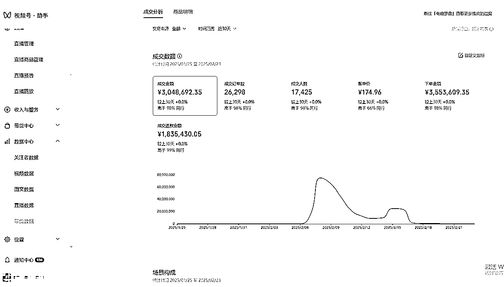
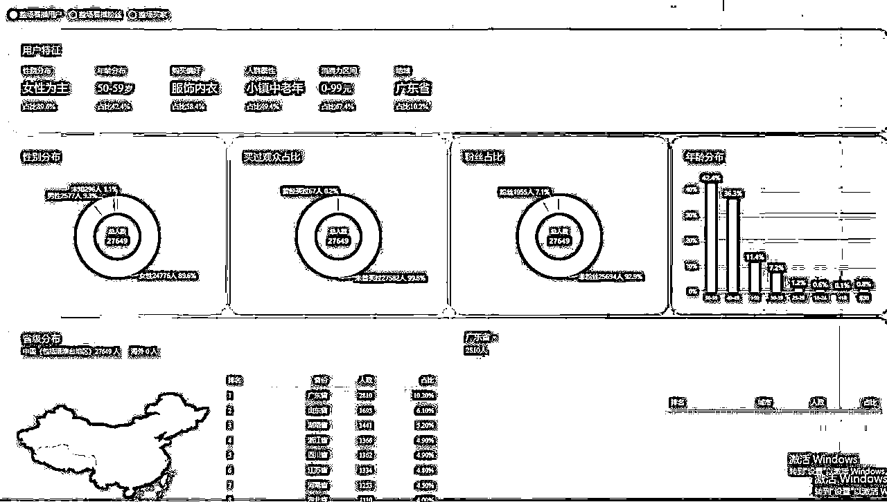
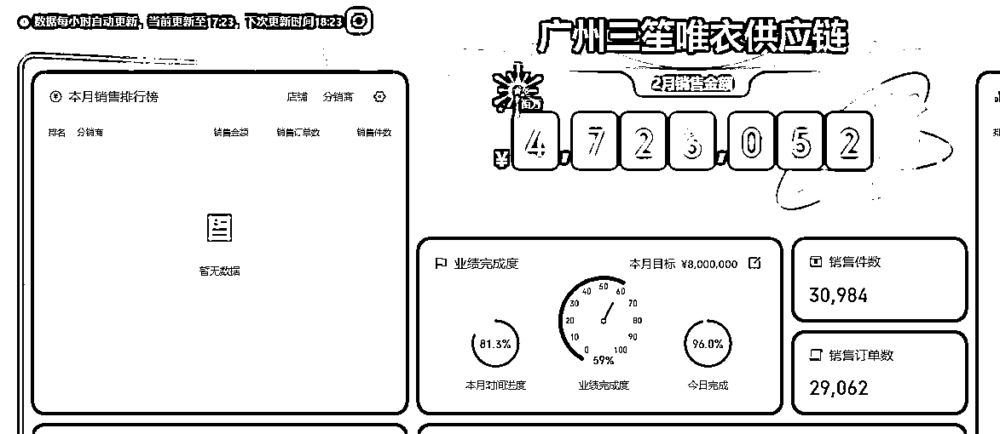
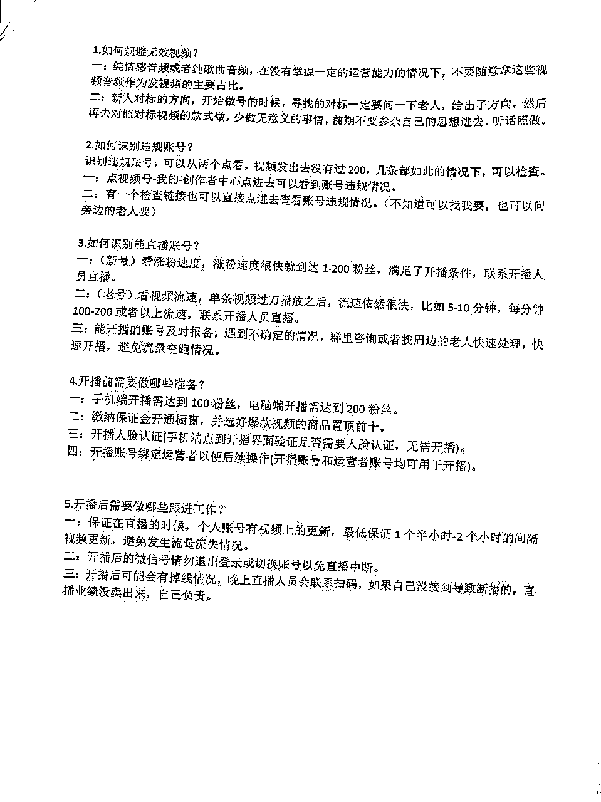
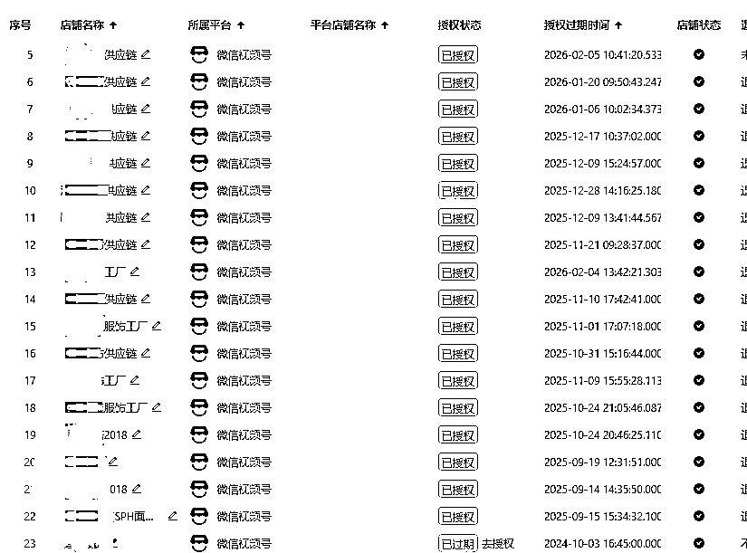
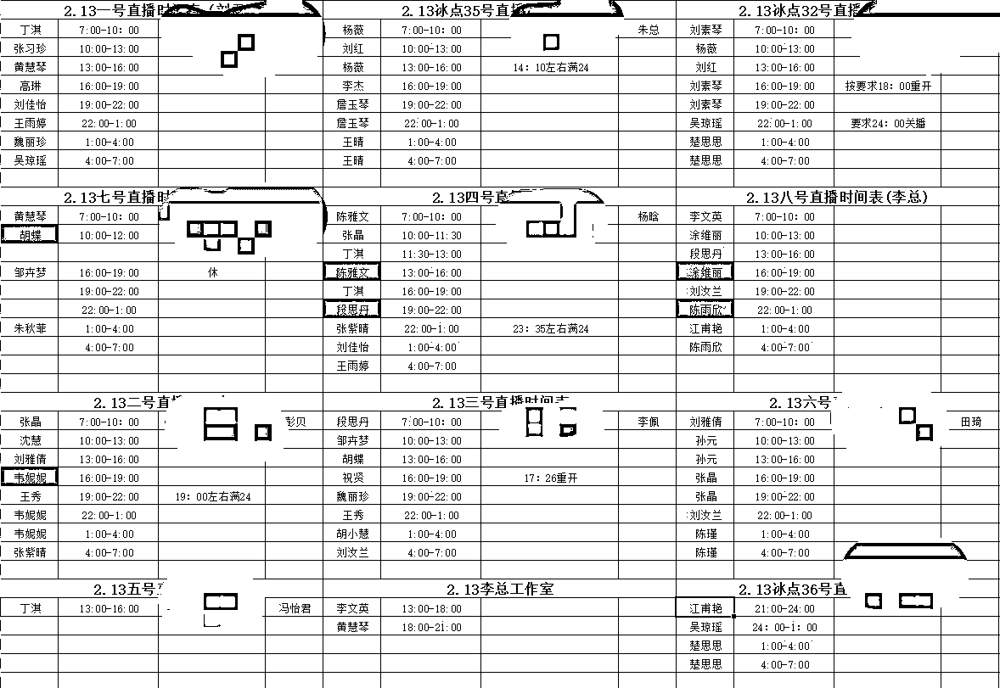
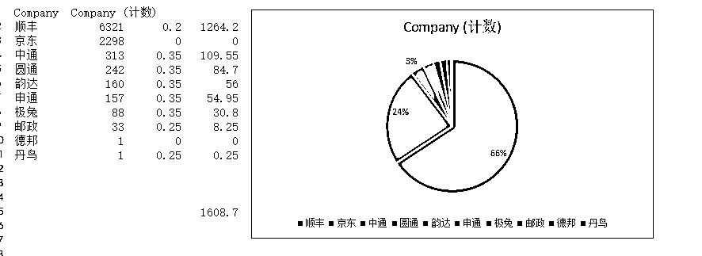
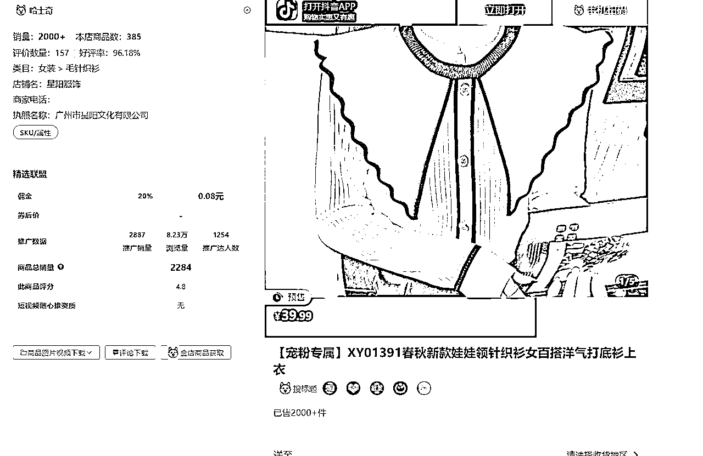

# 视频号中老年女装赛道运营实操经验分享

> 来源：[https://sanshenghui.feishu.cn/docx/F8XndUeftoslqmx1DYicPVpMnNd](https://sanshenghui.feishu.cn/docx/F8XndUeftoslqmx1DYicPVpMnNd)

开始做这个视频号中老年女装赛道源于，我有个学员叫大周（也是坤哥有篇帖子的主角），他在22年下半年找我测试下女装自己发货的尝试性如何。

因为我就在广州大源，家里也是做服装档口的！他当时做的是快手服装的混剪，一个月GMV干到1000w左右，我只是给他测试下拿货发货，因为拍单发货受到限制（涉及解密订单，搞不好要进去），我记得短短一个半月，差不多发了8000件，这还只是给了几个店铺的订单，大部分还是在带别人的货，后来广州10月份不是口罩原因封了，再后来口罩原因就快递都停摆了！就没办法去测试了！时间线到了23年，有个朋友叫我回去武汉一起合伙搞，当时手上做的快手的无人直播，也因为违规的原因和自己团队的原因导致项目直接噶了！

当时武汉办公室已经租了，人员也招了，手上缺项目了，慌的一逼，刚好大周和我都是武汉的，知道我回来武汉，直接在楼上租了办公室，说要不试试我的这个项目，说干就干呗！

还有个关键人物，就是都抖音女装赛道混剪做到了100w粉的冲哥（Nora），请冲哥坐镇公司2个月，10个人学，出了一个人！这也就是梦开始了！

那个时候开始是做快手和抖音，但是这个赛道已经很拥挤了，我们后手的完全做不下去，抖音和快手已经对我们这种混剪的限流（低质量内容）！于是在23年10月份的时候武汉扛不住了，就撤了混剪团队，搬到了孝感这个小地方（节省开支，孝感有现成的办公场地和设置，人员也便宜），又开始折腾了，武汉就只留下了投流的团队！

23年11月份开始有起色，其实后面总结了下23年差不多已经亏了160w左右了（所以说，哪有那么简单，每一步感觉都是绝路，其中一个合伙人中途也退出了，因为看不到希望）

一直到去年24年5月才爆，期间也踩了很多坑，做过快手，做过混剪，换过好多场地，亏过很多钱，感谢秀儿邀请，今天，就和大家详细聊聊，希望能够有几个点能对各位老师有帮助！

开始之前想说句，其实这个项目没有想象的高大上，就是一个拼人力的项目（我是这么认为）技术含量很低，管理含量很高！

主要拼管理水平，但是我管理水平真的很垃圾，超过10个人了，我就不行了，那就选择跟人合伙了！

人嘛，要自知！知道自己擅长什么，不擅长什么！然后找到互补的人！这是很重要的。

【这个是年初自然流 ，最好的一个账号，这个账号差不多撸了300wGMV左右了】

# 一、我为什么会选择视频号中老年女装

## 视频号中老年女装情况

当初选择中老年就是退货率低，人群单纯（原谅我用这个词）目前也开始逐渐年轻化，从我们23年的40岁以上用户为主，到现在30岁以上用户都有了，用户也开始接受在微信上购物了！至少从GMV上反馈，和微信给的数据，确实购物人群变多了！

【偷偷的说下，很多视频号中老年用户，不会退款，找不到订单入口，购买了会忘记！除非产品特别垃圾，不然一般也不会怎么退！总之他们的可支配收入，比年轻人高多了！】

目前视频号没有数据工具，相当于灯下黑，女装因为退货率高，其他行业的不愿意碰，同行做女装的又看不到我们的账号，或者也在做这种模式！

## 我的项目玩法介绍

这个很简单，就是堆量，我们自营400+账号的矩阵，每天就是一个账号发5~6条混剪女装视频，漏斗状的筛选账号，有个基本的指标！那个账号视频爆发后，剪辑组通知直播组准备直播间，开始日不落直播！只要流量不断，直播不下播！

爆款从来不是技术，爆款是运气，运气就是概率

用数量对抗概率，去覆盖足够多的可能性，

用大基数，去对抗概率！只要账号够多，总会有爆发的账号的！

视频剪辑的模版，就是很简单的图片变成视频！加点转场！

# 二、快速起量的秘诀在于矩阵玩法

## 400+矩阵号如何高效运营

1.  一个人分配20~30个账号，4~5人为一个小组，给固定的剪辑模版，让小组长去带！

1.  我们会收集当季的各个平台的爆款服装产品，爆款音频，爆款图片！

1.  批量混剪（其实现在可以用工具去替代，但是我们还是选择人工去剪辑，大家可以考虑下为啥），整个视频无非是文案，音频，视频组成，文案我们会定期收集中老年喜欢的文案，音频也会收集整理或者对标的整理，视频就是爆款服装图片组成的！（比如年尾的红色的衣服，我们全是剪辑红色的，只要是红色的就行）

1.  剪辑组的做好视频，监控好数据，只要手上的账号播放数据出现异常值！这个是剪辑组人手一份的！

给大家看下我们团队的sop供大家参考

1.  出现数据爆发的账号，立即通知直播组去做安排直播间，安排直播人员！

1.  店铺组开始把准备好的店铺给直播的账号准备链接！

1.  供应链公司开始找货源，找工厂，拍单！有现货的就去拿货，没有现货的去做货或者去拍单！

1.  店铺组处理客服，售后，保证及时发货和售后！

## 24小时接力直播,如何做到人效最大化

我们有个中台的角色，就是负责协调剪辑组和直播组的事情！会在最短时间内去协调解决账号开播人脸认证，直播间的排班表，人员的配置安排！

我们是一个账号8个主播，一个主播播3个小时！基本上一个主播每天最少是播2场，6个小时！

# 三、团队管理有多重要?

## 20个剪辑的工作分配与考核

一个剪辑20个账号，一个账号每天发布5~6条视频！

当月所剪辑的账号成交了100w以上，200w，500w都有阶梯奖金！销冠有月度奖金！

奖励和激励是不一样的，好的激励政策可以赛马出来一些真正能打的小伙伴。

其实相对简单，就是小组赛马，比如这个月剪辑组有1w奖金，最高的那个组分这个奖金！这个也不会设立的很夸张，就是他们努力下就可以够的到！

## 40个主播的选拔标准与培训方案

我们直播是口播形式，基本口齿伶俐，形象ok就行，基本招人都会有3天的培训试播，会给一个固定3~4分钟的话术，你开始练，至少能把这些练会才可以。

面试环节：

基本面试也说了，就是广撒网，前期就靠人事在当地招聘，优先选择之前做过销售的，小地方电话销售还是有很多的，再加上人推荐人，宝妈带宝妈，人还是好找的！从最开始来者不拒，到后面也慢慢的提高招人条件了！小地方人也不多，不挑到挑选也需要一个过程。

现在也和学校合作，找些学生在培训。

【租用学校的直播间，在孝感的圈友，应该知道是哪里了】

培训环节：

培训就是老带新模式，先克服对镜头的恐惧感！至少我给的文案，能清晰完整的对着镜头练出来！这个时间短的话3天左右，长的话一周，一周不行，直接PASS!他不适合这个角色！

也不能完全只靠文案去读，要加上自己口头话的表达和基本的情绪力在里面！

平台直播的规则解读和讲解，要知道了解那些能说，那些不能说，比如极限词违规！服装材质不符，虚假承诺等等！

后面的就是主播每周的交流，持续的培训改进了，找优秀的主播给其他主播分享！

试岗环节：

我们账号足够多，直接小号先试播，其实这一步也是训练克服镜头恐惧感，还有他说出来的文案，会不会触发违规！我们的流量基本全是短视频的，所以对主播的要求没有那么高，男孩子也可以去直播！我们有个百万直播就是男孩子！

正式上岗：

上述条件满足了，基本就是大量的练习，提高熟练度。

## 高人员流失率下的储备策略

4线城市，其实流失率没有那么高，还有就是，整体我们剪辑和主播都是宝妈女性，他们是相对稳定的，也不会怎么流失，在平均薪资3000的地方，能每个月拿6000，其实流失很少了！

人才储备是一直也做的，就是复制这个模式，去周边县城，只要人工成本符合我们预期，就可以招人！还有就是和学校合作，让学校出人才，培养他们，适应我们的岗位！

## 我踩过的那些人员管理的坑

其实管理我不擅长，我主要负责的是整体规划和技术对接，资源对接！我做到0~1，然后1~10的管理，这个就有我合伙人去负责，管理是个大学问。

1.  因为主播全是女性，前期管理真的是乱的，后面直接打散，分组，用小组制度去管理，剪辑部和主播部负责人只需要管理小组长就可以了，小组之间也可以互相交流和老带新！

1.  年尾时候又优化了一批人，同时激励制度的建立，让他们的付出至少能得到回报！

1.  各个部门的轮岗，协调，至少让部门负责人知道另外的部门在做啥，而不是啥都没去做！比如：剪辑组账号爆了，要直播组安排直播，但是直播组又满员，这个时候就得去协调，说明为什么不给你播的原因，而是给他播！

1.  不要盲目的扩张，不要盲目的扩张！尤其是直播这个行业，忙起来是真的忙，闲下来真的很闲，因为订单是波动性质的！能用兼职解决，就不要找全职，比如仓库打包，拿货这些！比如直播，我们最开始主播只有几个，还找外面的人代播，稳定后才去扩主播，招人！

1.  协调各个人员的关系，人少的时候，可能是自己上，但是一旦上人了，你只要负责盯着，其余的得放心交给下面的人去做，如果你是公司天花板，那么离倒闭就不远了！

# 四、数据背后的真相

## 70%退货率下如何保证盈利

永远记住羊毛出在羊身上，70%的退货率，但是我们基本都是70%以上的利润，3~4倍加价去出售，没办法，我们有流量！来对抗如此高的退货率！

由于运费险和兴趣电商的兴起，导致女装从30%左右的退货率飙升到80%退货率，有些产品甚至90%退货率！因为产品都是批发市场提供的，我们没办法去改变！只能从发货和其他部分去做差异化！

1.  砍掉代发的模式，自己搭建仓库，自己去拿货发货！因为你叫供应链给你代发，你都不知道他发的啥产品，有没有检查！比如你客单价是150元，你至少让消费者感知他差不多值这个价格！

1.  不要去省不该省的钱，我们全部用气泡袋去发货，因为客单价在哪里，直接提高耗材成本，4个兼职阿姨给我们整理退货的衣服，质检衣服！

1.  只要有产品卖的超过100件，就找工厂去打版估价（我可以不做货，但是我要知道这个的出厂成本）。再去和档口做对比，看怎么拿划算！因为档口会承担部分退货，我们自己做货就自己承担！然后就去计算做货比例，比如买了1000件，可能我只会做300~400件货先发！本身产品就有60%的利润，做货后差不多有70%利润！

1.  保持店铺分值，尽量在约定的时间内发完，实在发不了就做物流轨迹，然后电话通知客户丢件退款给客户！不让店铺违规罚款！

1.  这个可能比较恶心了哈，风险转移，部分实在拿不到的货，直接去拼多多上拍单了发货，客户退，再退回给拼多多商家（一般不这么做，除非是真没办法了）---不建议大家这样做！！！

1.  因为基本的财务逻辑还是有的，固定成本是可以大致估算出来的，比如人工，场地等等开支！利润只要我们做到能覆盖开支就是赚的！把营业额拉上去，人工和场地其实没有增加，但是利润也增加了！

1.  我们前端有400多个账号在测款，在对标爆发的同行账号，所以基本上卖爆的款可能同一时间就那么些款，我只要找到这个供应链，我就可以不用担心货发不出去了！

1.  整条链路完成后，然后去扣里面的每个细节优化利润出来！例如，我们退货还有返点回来，平均一单反个3毛左右！比如有些地区快递发件是有返点的，一单反2毛，最多50w封顶！！！（这是商务局的政策，你们可以问问你们当地的，这个我是问的天门的快递政策）

1.  再比如我们目前主播已经60人左右的团队了，很自然的就可以接同行的代播业务，可以开始接单了！最好的结果是直播部门可以自负盈亏！

说了这么多，其实只要营业额做大，利润足够高，其实很多东西都可以去覆盖住了！

## 资金周转的关键节点控制

创业者最重要的几个因素的排序是，现金流->利润->规模->品牌->情怀！

以前有个品牌梦，14年创业失败，才知道你那个不叫品牌，你那个只是个商标！

从此以后只谈利润，不谈品牌，不聊情怀！

现金流尤其重要，现在基本都是自有资金在运转，还没有缺资金的情况出现，店铺回款周期也就30天左右，一个月做500wGMV只需要150w左右的货款出来，并且随着做的深入，很多档口工厂也愿意月结算（当然我们大部分还是现金结算的）。退货可以退给供货商，部分做货，自己控制好库存就行了！

比如一个单款买了1000件，可能我们只会做个300件左右，用15天的预售去，不断的把退货重新发出！减少库存积压！

还有部分产品是供应商提供，他们愿意100%，50%退货，那么我们就直接拿货发货就行了，退货了退回供应商！

我用现金拿货，退货回去供应商也是退回现金给我！

我们做的真的不大，而且利润拉高了，资金周转其实还好！

## 如何判断一个品是否值得重点投放

能白嫖，坚决不付费！目前0付费推广，没有任何付费投放！（还没到要付费的那个点）

从产品角度来说，一个品爆了，他的退货率低，利润还可以，这个品就可以加大去做，全部的账号开始混剪这个品或者类似的品！

有些品我们坚决不会去碰，比如去年的羽绒服，棉服这些，我们就没有做，我们只做了毛衣，针织！

这里有些类目我们为何不碰，这都是踩坑踩出来的经验，就因为我们没去碰羽绒服避免了去年年底的风波！

这里给各位科普下，夏天不碰连衣裙，冬天不碰羽绒服！全年不碰网红款！

但凡挑身材的，容错率低的款式，坚决不要碰！做不好就翻车了！这不是我们这种玩家玩得！

因为我们没有开发能力的，我们只是拿货卖货的！我们没办法从源头控制品质，没有网红得粘性，做好自己能把控的就够了！女装市场足够大的！

## 从选品到定价的利润计算方法

简单粗暴，基本都是淘宝，抖音，快手上爆的品，我们直接搬运过来混剪！

定价直接是3~4倍加价，没办法退货率太高，只能提高利润去覆盖！

直接以图搜图，找到对应的供货商。

举例：抖音的这款针织衫（点击查看链接），售价39.9元。

以图搜图，找到有这个款的档口。

你可以看到很多20，23元的拿货价格的，那么中间就有了利润差。

不要选择最高的，不要选择最低的，相信一分钱一分货的道理，适中就好，不然品退，会导致自己店铺挂掉。

计算公式：成本*3+10+折扣优惠=前端销售价格（这个只是很粗放的计算方式了，不同的品会有细分这里只是举例）

其实很简单对吧，成本就直接档口供应商那边要，3倍是因为退货率这些加上了，10元组成是人工+快递费+耗材+运费险。折扣优惠，比如直播要发20元优惠券等等！

这个是自己给自己店铺带货的计算公式，如果给达人开佣金，就会再次计算下，总之保证自己的利润为主！

# 五、入局必须要注意的几个关键点

## 最低启动资金是多少

个人感觉其实最低来算的话，1w以内就可以启动，因为前期就是基建的投入和时间的投入，比如去弄10个视频号认证的（这个亲戚朋友都可以帮你搞定）！一个手机2个微信视频号！那就需要5部手机！一台剪辑的电脑就可以做了！

直播自己如果会就自己播，自己不会就找代播，我们带出来的朋友就家里办公，他媳妇和小姨子直播，忙不过来就叫我们代播！一样的道理！

我们最开始也是代播和自己直播开始的！因为账号爆发我们没办法预估，只要足够多，爆发的概率就大！

市面上也有卖或者租用账号，然后直接刷粉200粉，然后开播，微付费就做！

我们不行，账号太多，这样是一笔很大的开支，反正要养号，直接发布作品，基本上只要有账号爆发了，200粉，几分钟的事情，我们基本不去做刷粉的动作，省钱么！

来个总结：

1.  2个账号一个手机，二手的安卓，400快就够了！10个账号就是400*5=2000元

1.  一台剪辑的电脑，一个人一天可以产出100+视频，利用AI或者RPA，我估计可以一天一个人产出2000条都不是问题（有这方面的大哥，或者能开发的大哥，联系下，我们又需求），电脑就4000元

1.  人力前期自己做，这个不用算了

1.  要刷粉的话，200粉差不多50~100元（我们刷好久了，不知道市场价格，可以问问那些服务商）

1.  账号爆发，找代播基本40~50元一个小时，一天24小时算，1200元（这个是基于你账号爆发了，去找代播）当然你自己直播，那这个就可以省去了

1.  账号爆发，服装基本佣金在30%，例如客单在100元，你每成交一单就可以拿30元佣金，比如你一场日不落直播，买了30000元，用最高的退货率80%计算，你的利润就是30000*（1-80%）*30%=1800元,想想如果退货率是60%，佣金是40%呢！

说完个人创业者，再说团队想做这个怎么搞

只要满足下面几个条件，你愿意尝试，就可以做了

1.  34线城市，人工成本足够低！有自己的办公场地，有自己其他主线的项目！

1.  在当地有一定的人头资源（因为你要开视频号，直播你要能找到人扫脸开播）

1.  最开始安排2个人去跑这个项目就行，跑通了，就可以放大！

服装电商现在就是个苦逼的事情，我更多的是劝大家慎重！

## 供应链对接经验分享

1.  所有沟通必须文字确定，比如供应链说100%可以退，那就打字确认，他说的退货率，你能接受就合作，不能接受就换其他的！

1.  不要去找最低价格的供应链，服装买的是图片，一个款几个供应商有货，但是最低的不一定是质量好的啊，你要看下质量，选性价比最高的！

1.  不要因为供应商可以月结，就把自己绑定住了，在自己资金充足的情况下，现金拿货！（这样才能长久，供应商不对，可以直接说，不用那么多顾虑）

1.  合理的预估价格，不行就打版做货，你会发现你成本又降低了，服装从来不缺工厂做货！

1.  我们快递是两个点发货，一个是湖北我们可以做到1.8（包人工）广州是快递1.9（不包人工），最低成本去做，因为是产业带，人不够就找兼职，人够就自己发，坚决的人工的弹性！

1.  就说这几个重要的点把，其实里面挺多小细节！（不然我们也不会直接广州，天门搞几个产业带的发货点的）

## 团队搭建的节奏把控

先跑完最小的MVP,然后根据自己的情况去放大，这个每个人的节奏都不一样的！我们23年做这个项目，亏了一年才勉强跑出来，很多一起的都坚持不下去了，这个真说不准，因为每个人的资源都不一样！

## 资金链断裂风险防范

这个我们是拿货方，如果相对应我们做不下去，会裁员或者放弃这个项目，目前我们做的小！

预留了2个月的员工场地的开支在账户上！

出现风险会及时止损！

* * *

最后说句，好像有2年多没在生财冒泡了，一直潜水，真是觉得没做出什么成绩，不好意思在生财上发帖子！

现在总算跑出点数据了，有点盈利，就趁这次，给大家写写视频号这个项目！

感谢生财有术给的这次机会！感谢各位星友的时间！

这个项目已经做了存在3年了，只是在不同的平台中流转，我也无法判定能做多久，但是在有限的时间内，尽可能的拿到利润，然后为下一次准备好充足的弹药，就够了！

有任何问题，欢迎评论区留言，

我一定会掰开揉碎和大家讲清楚！！