# 关于做陪跑更好了解学员的情况的一个好方法

> 来源：[https://rlwxa0zgke.feishu.cn/docx/G5sydTm3GoeiVaxc0UWcAL9Tn3a](https://rlwxa0zgke.feishu.cn/docx/G5sydTm3GoeiVaxc0UWcAL9Tn3a)

前言：在以前的陪跑过程中，教练想要了解学员的后台的数据情况，一个常用的方法就是通过电脑远程访问

但是实际不用这么麻烦，油管官方给了一个非常便利的渠道。就是通过授权的方式来访问其他频道的数据，下面的相关操作。

1、访问频道后台，找到【设置】

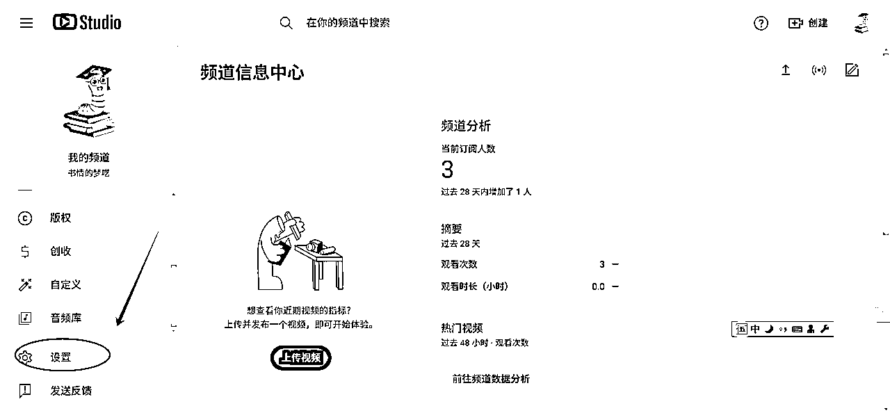

2、点【设置】后会出现设置页面，再选择【权限】，接着再选择【邀请】

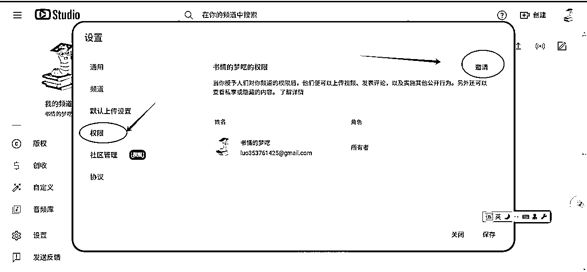

3、填邀请人信息

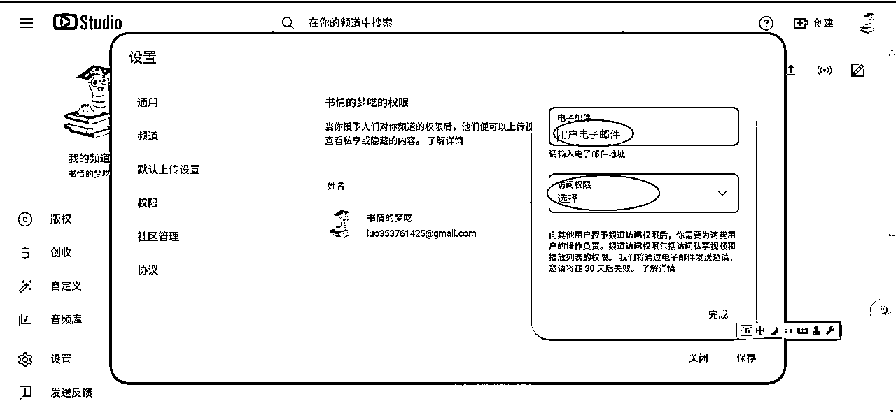

重点在访问权限怎么理解，如下图有好几个选项

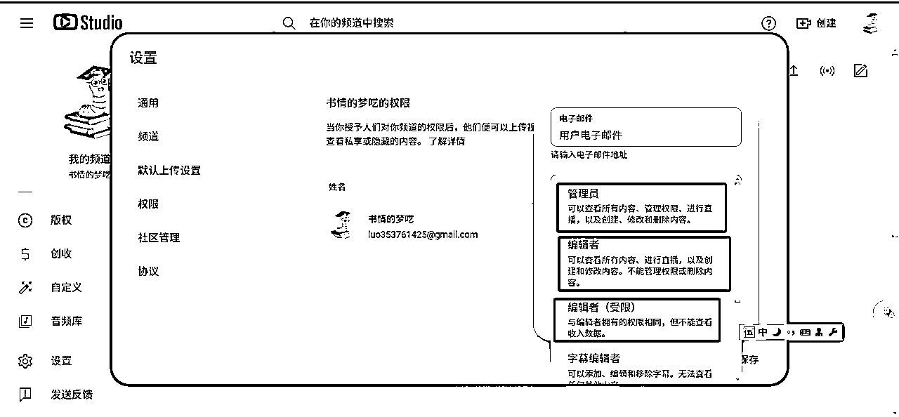

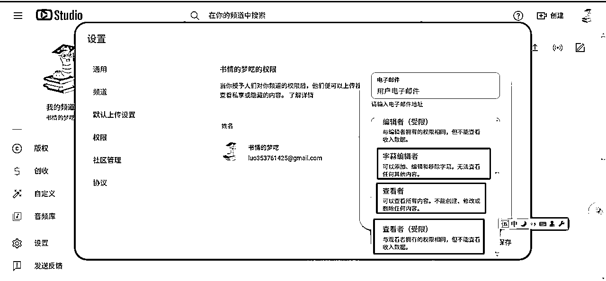

## 频道权限角色类型

一般来说分析学员的频道，选择查看者权限就够了，查看者可看到收入情况，也方便对频道收入的情况给出建议

一个小细节说明下：注意点了完成后，要点保存，邮件才会发送

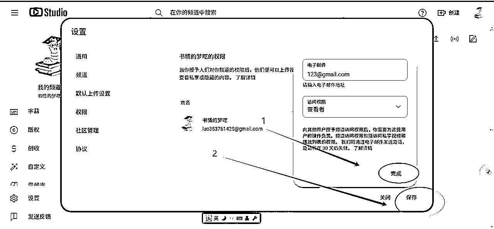

被邀请方要留意gmail邮箱，点下接受就好了，页面会进行一个跳转

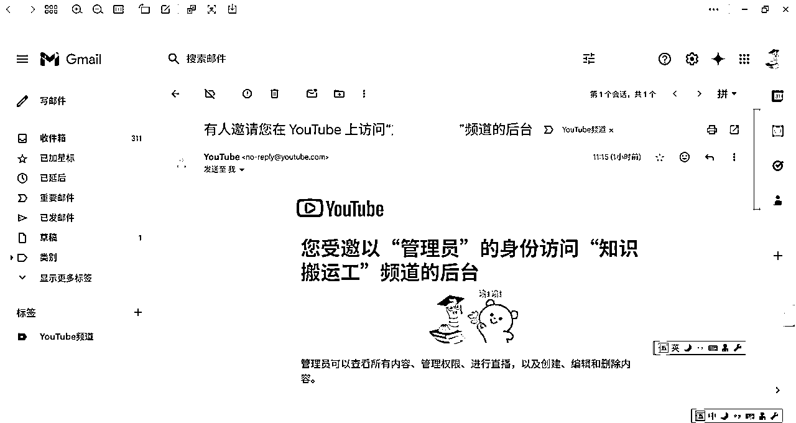

页面跳转后如下图，就完成了，此时，你点切换频道就可以跳到邀请方的频道页面了

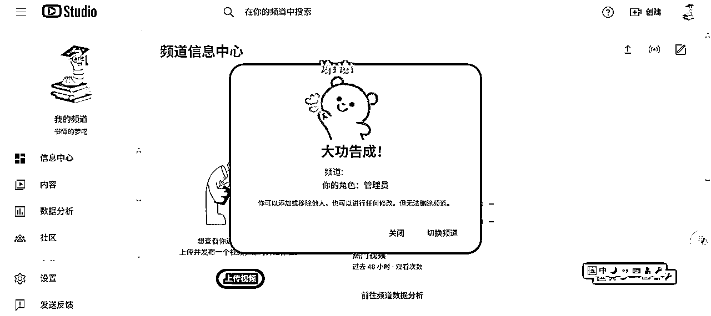

如果学员较多，一个方式就是如下图，新建一个标签，通过这里进入不同学员的频道后台

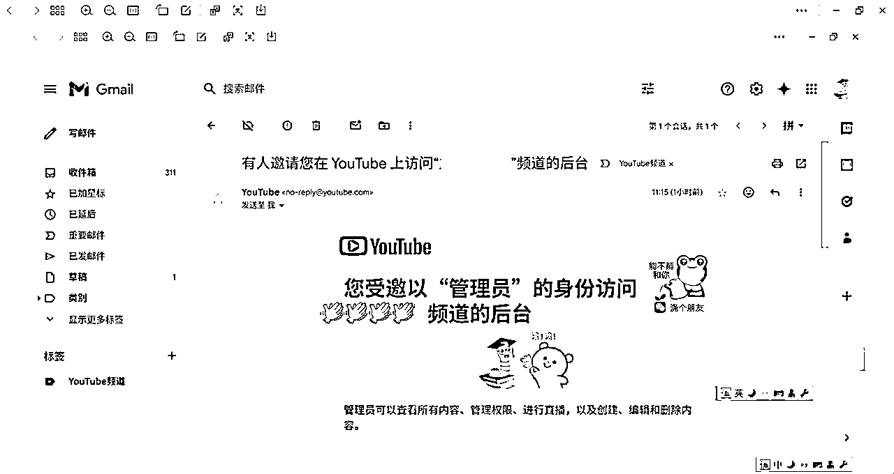

补充之前填过的一个坑，我并没有卖频道的细节，现在补充下这个知识

卖频道的网站 https://flippa.com/buy/media-communities/youtube

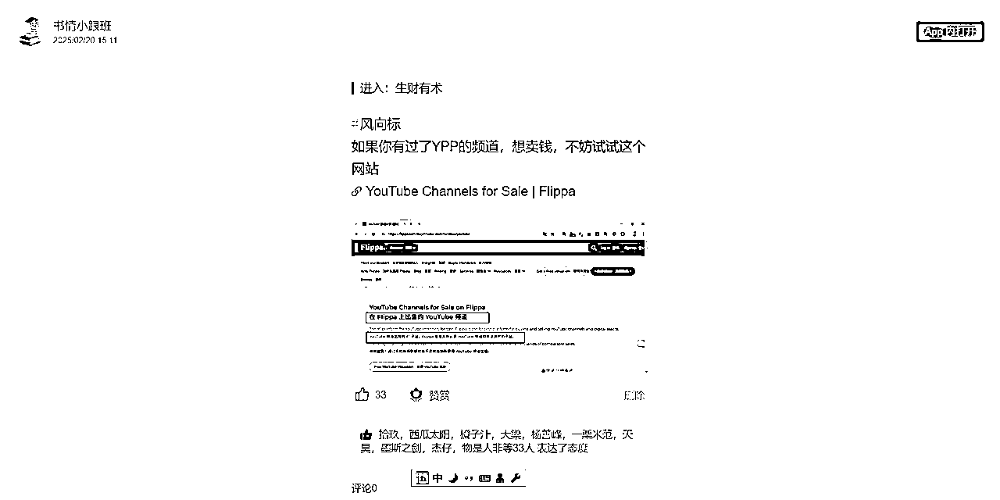

关于账号买卖，这就涉及到另一个知识点，如下图 ，这个设置页面不一样了，为啥会这样？因为这是一个品牌账号

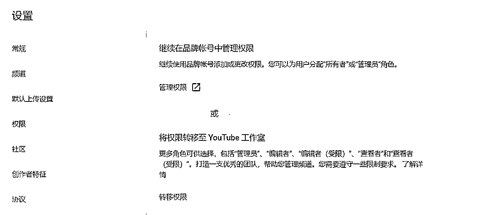

这里就要解释下什么是品牌账号了，所谓品牌账号你也可以理解为商业频道

官方解释：品牌账号是为您的企业或品牌设置的 Google 账号，可用于某些 Google 服务

这里要澄清一个概念：个人账号不支持买卖，对应YouTube工作室，支持买卖的是品牌账号

见如下的内容，我会做出解释

## 针对频道权限和品牌账号的委托限制

#### 针对频道权限的限制

#### 针对品牌账号的限制

上述的内容有两个点：

1、针对频道权限的限制

2、针对品牌账号的限制

1、针对频道权限的限制

所有者：无限制。可以执行删除频道以及管理直播和实时聊天等操作无法将所有权转让给其他用户

注意我要加粗的部分，也就是前面说的个人账号不能进行买卖

2、针对品牌账号的限制

主要所有者 无限制 通过设置主要所有者来判定频道的归谁，

具体操作如下，我们还是回到这个页面

我们点红色圈圈，圈住的地方，点一下，会进入一个新的页面

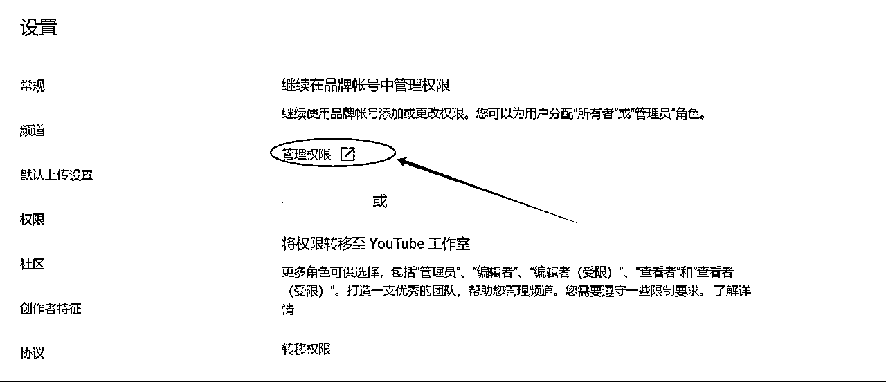

这个时候，点邀请，注意这个邀请跟前面说的邀请不是同一个东西

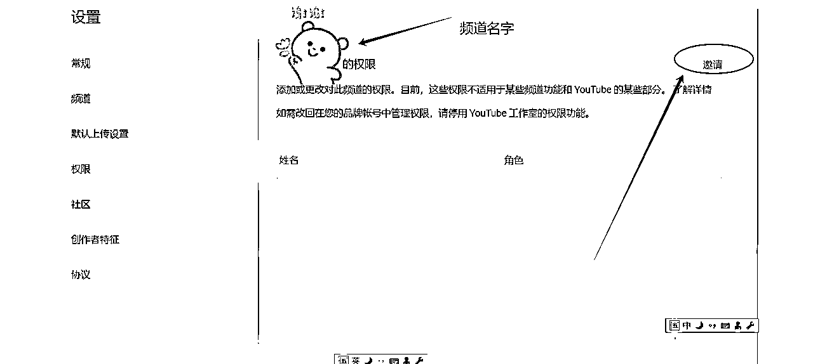

点邀请后，你会看到一个新的页面，如下图

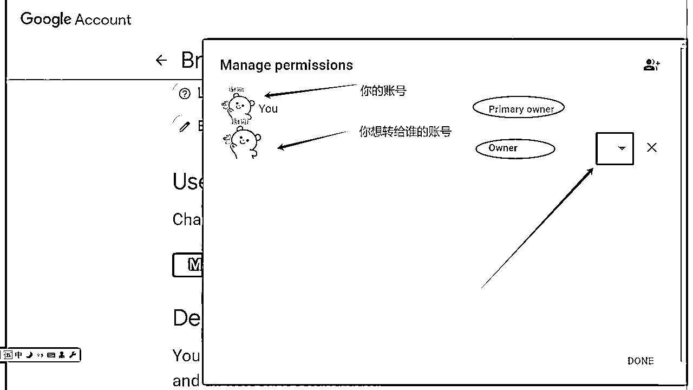

注意我的红色箭头，有一个下拉，下拉会看到，如下，注意这里要选 Primary owner

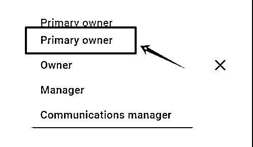

当你把对方选了 Primary owner，同时自己这个 Primary owner 就可以删除了，一旦删除，那么这个频道就归对方所有了。

以上，如有表达错误之处欢迎一起交流探讨

官方文档

通过频道权限添加或移除对您的 YouTube 频道的访问权限

从品牌账号用户访问权限改为使用频道权限