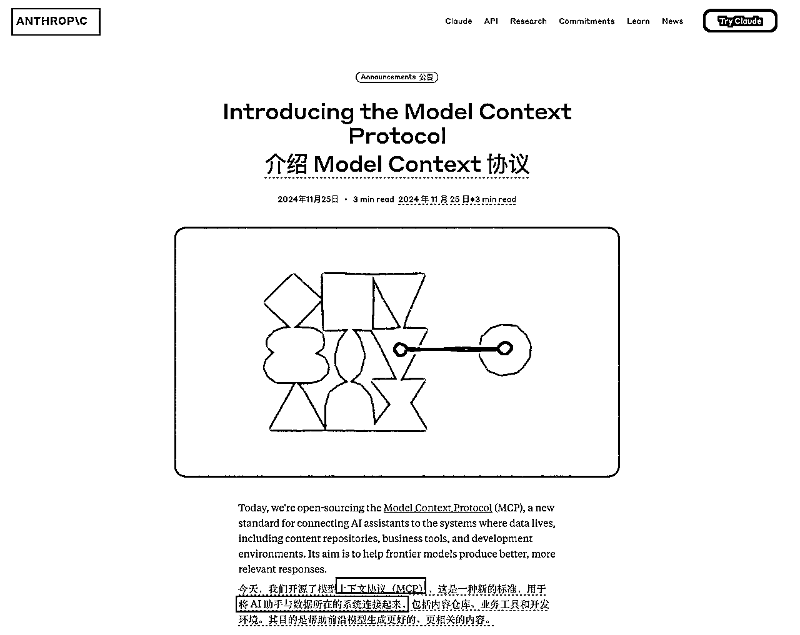

# 一篇文章搞懂MCP

> 来源：[https://pk0zg2jkji.feishu.cn/docx/GAGFdqAL2oBfzJxFrASc8ewUn1b](https://pk0zg2jkji.feishu.cn/docx/GAGFdqAL2oBfzJxFrASc8ewUn1b)

## 1、MCP 是什么

### 1.1 官方定义

MCP 全称是 Model Context Protocol ，模型上下文协议。是由 Claude 母公司 anthropic 开源的一种新标准，用于将 AI 助手与数据所在的系统连接起来，目的是帮助前沿模型生成更好的、更相关的内容。



从官网对 MCP 的解释，我们可以 get 到两个点：

1、MCP 的作用是将 AI 助手与数据所在的系统连接起来

2、MCP 的目的是帮助大模型生成更好的、更相关的内容。

那怎么样理解上面这两个点呢？下面和平通过例子来帮助大家理解：

### 1.2 案例解释

#### 1.2.1 案例1

比如我现在想要提取某个爆款视频的文案，一种方法是去找那些文案提取工具，另一种方法就是求助 AI ，大模型天然适合总结归纳。

我们把爆款视频的链接丢到腾讯元宝中去看看他能不能帮我们提取出来


你会发现腾讯元宝压根提取不出来


但是我们把大模型换成豆包再试一下，同样的提示词豆包很快就给我提取出来了


如果现在腾讯元宝想要和豆包一样支持提取视频文案，那么它就要做定制化开发，其他的大模型厂商像 kimi、通义千问、文心一言如果也想支持提取视频文案，那么都要在定制化开发一遍。

那么有了 MCP 之后，就可以基于 MCP 协议开发一个能够提取视频文案的 Server ，各家大模型都支持 MCP 协议，然后统一接入这个提取视频文件的 Server 就可以了，就不用再重复投入资源造无意义的轮子了。

所以官网说：

MCP 的作用是将 AI 助手与数据所在的系统连接起来

这里的 「AI 助手」你可以理解成各种大模型，比如 Claude、DeepSeek、ChatGPT

这里的「数据所在的系统」比如抖音的视频文案数据库

现在有一个基于 MCP 协议提供的一个支持提取视频文案的 Server ，其他的大模型如果想拥有这项能力，那么只要基于 MCP 协议接入即可，这不就是完成了 官方说的 AI 助手与数据所在的系统连接起来。

#### 1.2.2 案例2

现在有个需求，就是把上周卖的最好的三个产品做成图表，通过邮件发送给老板

这个需求相信通过自然语言跟任何一个大模型沟通，他都没办法一次性帮助你去完成。但是有了 MCP 协议之后，一切都不一样了，我们可以基于 MCP 协议开发两个 Server:

Server1，他是专门连接销售数据系统，然后查询数据，最后生成图表

Server2，专门连接邮件系统，发送邮件

等你用自然语言把需求输入到大模型的输入框，大模型就可以分析出你的意图，你要找“上周卖的最好的三个产品”，那就需要去查销售数据，你要“发邮件给老板”，那就要有能发送邮件的服务提供支持才可以

最后一看正好有两个 Server 能够满足你的要求，那么大模型就会调用这两个 Server 完成你的需求。

这两个 Server 就好像大模型的手和脚，没有 MCP 协议之前的大模型就好像只有大脑，会思考，但是无法行动。

有了 MCP 协议之后，大模型能思考，也能行动，就真的好像你的数字分身。

## 2、MCP 实战

### 2.1 用自然语言操作本机电脑文件

官方的 MCP Server 集合：

https://github.com/modelcontextprotocol/servers

我们就以这个文件系统的 MCP Server 为例


点击进去我们可以了解这个 MCP Server 有哪些功能，能帮我干什么事情


下面我就来使用一下这个 MCP

1、打开 Cursor，点击右上角设置按钮，打开 Cursor Settings (我用的 cursor 版本是0.46)


2、点击 MCP ，选择添加 MCP Server，具体要添加哪些信息，我们要回到 github 去看


3、回到 github 往下滑，我们去看一下这个 MCP Server 的配置信息


下面逐个来解释一下上面配置的意思

```
"mcpServers": {
  "filesystem": {              // MCP Server 服务的名字
    "command": "npx",          // 使用Node.js执行工具
    "args": [                  // 启动参数组合
      "-y",                    // 自动确认安装提示
      "@modelcontextprotocol/server-filesystem", // 官方文件系统服务器包
      "/Users/username/Desktop",       // 允许访问的第一个目录
      "/path/to/other/allowed/dir"     // 允许访问的第二个目录
    ]
  }
}
```

因为这个 filesystem 的 MCP 服务是用 NodeJS 开发的，所以我们本地需要安装一下 Node 环境，才能执行

下载地址：

https://nodejs.org/zh-cn


安装过程很简单，一直下一步就可以了，安装好了以后，在命令行检查一下是否安装成功，如果出现版本号，证明安装成功


4、把 JSON 串转化成命令行

因为 cursor 0.46 版本要填入的是命令，所以我们需要把上面的配置转化成命令


```
// 原配置
"mcpServers": {
  "filesystem": {              // MCP Server 服务的名字
    "command": "npx",          // 使用Node.js执行工具
    "args": [                  // 启动参数组合
      "-y",                    // 自动确认安装提示
      "@modelcontextprotocol/server-filesystem", // 官方文件系统服务器包
      "/Users/username/Desktop",       // 允许访问的第一个目录
      "/path/to/other/allowed/dir"     // 允许访问的第二个目录
    ]
  }
}

// 填入 curosr 中的配置
npx -y @modelcontextprotocol/server-filesystem /Users/hepingfly/Downloads/test

/Users/hepingfly/Downloads/test  这里改成你要允许 cursor 访问你计算机中的哪个目录
```


5、实际测试 MCP


6、注意大模型在执行过程中回找你要查看的权限，点 ACCEPT


7、执行结果，发现大模型用 agent 得到的结果，和我们在命令行自己查看的结果完全一致


也就是说借助这个 MCP Server ，我们使用自然语言和大模型交互，就能够让他帮助我们读写文件、删除目录，等等这个 MCP Server 能对文件所做的操作


## 3、 好用的 MCP 服务

BrowserTools MCP 浏览器工具 MCP

这个应用程序通过 MCP 协议，可以借助 AI 功能，通过 Chrome 扩展程序捕获和分析浏览器数据。这样能够大大提高我们开发前端页面的效率

地址：

https://github.com/AgentDeskAI/browser-tools-mcp

实操：

1、先安装 Chrome 插件

直接下滑页面，找到「v1.2.0 BrowserToolsMCP Chrome Extension」点击即可下载


2、解压插件，chrome 浏览器选择扩展程序 - 管理扩展程序


3、打开开发者模式，直接把解压后的文件夹拖进来


这样我们插件就安装好了，然后我们来安装 MCP 服务

4、安装 MCP

一直往下滑，有一个安装文档

地址：

https://browsertools.agentdesk.ai/installation


往下翻，有教你怎么在 cursor 中配置的

就是这串命令

```
npx @agentdeskai/browser-tools-mcp@1.2.0
```


把它配置到我们的 cursor 中


绿灯代表服务配置成功


然后在电脑终端中，运行这样命令

```
npx @agentdeskai/browser-tools-server@1.2.0
```


总结一下有三件事情要做

*   Chrome 中安装浏览器插件

*   Cursor 中安装 MCP 服务

*   命令行终端执行命令

我们来使用一下：

按下键盘 F12 打开控制面板，然后选中一个 div ，把 cursor 切换到 agent 模式，我们问一下 cursor 我选中的这块有什么作用


Cursor 就会调用 agent 去把答案告诉我们


这样在开发前端的时候就可以无缝与 AI 进行沟通，极大的提高的效率

## 4、MCP 工具大全

地址：

这是一个 MCP 工具聚合的网站，收录了 2000 多种 MCP Server，可以根据自己的需要来选择


使用方式：

找到自己感兴趣的服务点击进去


然后点 github 头像，进入到 github 中


往下翻就可以找到我们上面介绍的命令，然后按照我们上面的方法，配置到 cursor 中就可以了


熟练之后，安装一个 MCP 工具到 Cursor 中也就是十几秒的时间