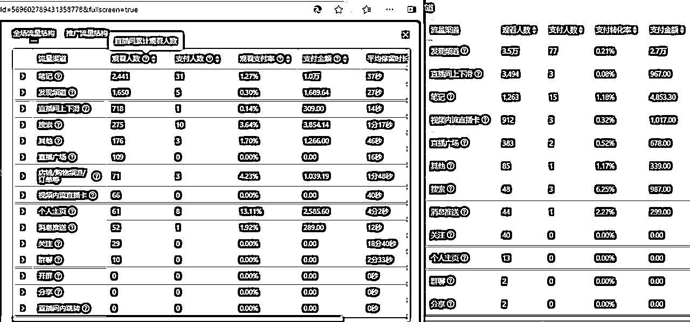

# 小红书高客单自然流店播实操指南

> 来源：[https://j8anz3fdss.feishu.cn/docx/GI6sde3TBo4b21x5mKHcVQ5WnKF](https://j8anz3fdss.feishu.cn/docx/GI6sde3TBo4b21x5mKHcVQ5WnKF)

哈喽大家好，我是李谢谢，先祝各位新年快乐

去年12月份的时候我们小红书起了一个自然流/直播/新号

直播端用了7天的时间起号成功，利润也提了一个档

今天来给大家分享一下我们的玩法

我觉得和现在一些主流玩法是有很大差别的，也算过年的时候自己在家做个复盘

* * *

我们之前起过一个号，走的是一个传统路线

几个月的时间做号做笔记，做爆文测爆款，后面有权重挂车，然后开直播，付费投流等等

这种玩法本质上其实没毛病，我觉得是一种特别稳妥的方法

我在上篇文章有写，感兴趣的朋友们可以看下

但是在快节奏的今天，如果花费几个月的时间才起了一个号

我觉得也有些太慢了，竞争力真的很低，而且现在的商家号是真的挺难起的

时间就是钱，更希望做的是野蛮生长，快速迭代优化，杀出重围

那如果想做到这些事，其实会有一些问题

纯新号没有笔记怎么付费投直播间？

一个新号一天只能发一篇啊！发多了会被限流?

纯直播上来就开播怎么播？流量从哪里来？

...

并且在这个过程中衍生了各种各样的想法，如果这里我当初要XXX，XX结果是否就会不一样了呢？

...

怀抱着诸多质疑以及各种各样的想法，去年年底开始了一次全新的尝试

把想法印证在了这次新号起号，从而有了现在特别多的收获

付费到自然的转型：

# 一. 店铺基础搭建

## 1.1 店铺基础搭建

### 1.1.1 商品图片

#### （1）首图核心要素

小红书没有什么商城流量，尤其最近主页商城下架以后更没了

但是并不代表你可以随便放一张图片，还是需要你具备一定的美商

尤其是越高的客单价越需要你具备这个技能

*   低客单：价格+痛点（9CM增高，比如过年就是发货时间等等）+福利（下单即送）

*   高客单：场景化+高级感

不是说低客单价它就不需要高级感，我觉得 高级感＆美商 是环绕在每个小红书商品身上的

当然要不要过度去P，实物和图片有太大差别也是很麻烦的

#### （2）测试数据

*   我一般把图片放在直播间5-7号位，3天为周期观察

*   不开直播的可以投乘风去测，点击率低于8%淘汰，具体参考所在行业平均值

PS：一切的数据都是要以一定的量为基础，否则过高过低没有任何意义

#### （3）尺寸

3：4竖图（平台推荐比例），大多数出现笔记爆款了以后会把笔记主图放在商品首图

我用的都是1：1，原因是因为和别的平台做统一，这样就不要单独花精力去做图了

还有就是3：4的图有白边，强迫症看了表示受不了

如果有些品类3：4这个比例很适合你（比如裤子衣服），但是你可能都是1：1的图

可以找个AI软件做扩图就好了，扩图这个东西洗素材真的很方便

### 1.1.2 详情页

#### （1）详情页结构框架

每个品类都不一样，包括一些品牌都有自己的设计风格，但是我觉得大概会有以下几种特点

*   整体模版可复制，可批量化（不太可能每个新品都做一个新模版）

*   固定位品牌调性和品牌特点展现

*   穿搭场景/细节展示（举例：拍一些产品结合场景的美图+产品细节的一些图）

*   产品痛点（举例：矮个子福音，无痛增高7CM！还在熬夜！你的皮肤正在求救！）

*   解决方案/产品特性（举例：后跟增高/采用了什么什么技术/XX因子修复暗沉美白等等）

*   图文演示（举例：可以实操展示/对比/等等增强信任感）

*   材质证明/尺码表（举例：真皮检测证明/防甲醛检测证明/工厂实拍等等）

*   解决疑虑/促销逼单（举例：限量款库存还有XXXX/赠品还有XXX/我是什么官方等等）

#### （2）详情页文案如何写？

禁止废话，很多都是一闪即逝的东西，客户没那么多时间留在上面的

*   场景化：锁定用户高频场景 比如：鞋子好看改成穿搭图展示

*   数字化：找到产品的可量化参数 比如：鞋子显高又舒适可以改成实测显高5cm，久走2万步不磨脚！

### 1.1.3 标题搜索词优化

#### （1）搜索词如何挖掘

*   外部工具

灰豚/5118等等都可以，哪个便宜用哪个

*   内部工具

第一个就是小红书搜索框下拉词，如搜索老爹鞋自动联想长尾词

第二个就是千帆经营 - 搜索运营当中去找，有时候商机中心里面也可以看看核心词

第三个就是乘风投搜索词的时候可以看下都有哪些词

#### （2）标题如何写

*   标题公式建议

可以加一些场景词，因为我个人想法如果加一些场景词有助于后续我乘风搜索投场景，这种穿搭投场景出

单比较好，或者找到一些蓝海词我觉得投搜索都会事半功倍一些

我个人大部分都是：

品类词+属性词+人群词+场景词+补一些搜索词+货号（方便找）

示例：早春连衣裙女2025新款小个子收腰显瘦约会斩男裙

### 1.1.4 店铺装修及活动设置

#### （1）店铺装修

小红书不像抖音淘宝店铺有很多的地方需要去设计图片，他可以说什么都没有

千帆后台搜装修工具，就是写个标题就完事了，可以写一些分类优惠这种帮助引导客户购买

#### （2）活动设置

*   官方活动我建议都去参加，每个链接都报进去，报进去以后链接就有活动标识，是享受一些平台流量位的，如最近的春节乐市集，早春衣橱，然后直播间做贴片和它呼应下

*   做优惠卷我一般都是直播间做卷+全网自动推广券，做两个重复的，因为直播间我需要靠卷做关注数据，但是全网的卷是不能在直播间发的，还有些粉丝卷复购卷等等可以根据自己需要配置

（卷不可复制，每次都需要新建）

#### （3）店铺任务

*   在首页当中你可以看到笔记经营和店播经营 完成笔记经营得笔记流量，完成店铺经营拿流量卡只能用在直播间

*   笔记经营周和月发布的任务都是很基础的，建议大家都要去完成，每月月初更新等级 V3（0-1000GMV）/ V4（1000-1万GMV）/ V5（1万-10万）/ V6（10万-100万）

*   店铺经营拿的是流量卡，我个人感觉这个流量有一点点泛，优先级比较低，越是前期的越要珍惜机会，因为你只需要很少的GMV就可以拿很多流量，还有不要一起用，一张一张用，新号不建议用，会泛上加泛

补充：链接优化S单

销量为1和销量为1000的链接转化差别很大，新店前期我建议你需要补一些单量和一些评论，无论是高客单或者低客单都需要，并且我建议有条评论补一个：比价了全平台还是这里性价比高

链接肯定会越做越好，投放成本也越来越低，出单了以后记得不要歪楼，及时清评论做维护

绑定商品以后买后评价是会出现在评论区且不可删除

一些跑量视频的评论可以找些群，花几块钱异地评论一下，注意他们的评论就应该是直播间问的最多的问题

# 二. 账号基础搭建

### 2.1 店铺账号和直播账号

（本章节适用品牌账号，如果个人账号可以不需要）

店铺账号就是后续需要做自然流笔记内容+店铺所在账号

这个账号是主账号，是唯一的，是需要慢慢耕耘的

比如官方号，你会发现他就是做品宣

（大多数的账号即便有粉丝基础也会在别的号开播就是为了规避风险）

你想在这样一个刚创建的官方号上面一天发20个视频，一个星期开播

抛开新号不谈，如果做不成风险是很大的，对很多品牌而言，店铺是很珍贵的

但是你又不想有风险，你又迫不及待的想立刻赚钱怎么办？

所以这个时候你需要一些直播账号帮你去承担风险，并且可以粗暴一些试各种各样的玩法

即便最后封了或者流量不行也不会影响你店铺账号，更不会影响你店铺，等于有个planB

小红书商城流量很低，做1.2个店铺足够

后续思路就是多开一些直播号围绕这1.2个店铺去卖，并且一定要做矩阵，后面会说

### 2.2 为什么小红书新号直播启动慢？

其中有个最重要的点就是新号没有素材去投，纯直播很难度过冷启动

抖音可以千川投本地，投本地测素材和账号发布没关系，不影响账号

而小红书为保护用户体验，乘风压根就没有这个功能

这个真的很不友好但是又在情理之中

试想一下现在抖音发展了几年的商家手里得有多少视频？

我们有6个抖音号，一个号一天拍10条左右，最晚的也做一年半了...

这些要是大家都能放开了发，确实对小红书的内容环境影响不好

### 2.3 为什么一定要短期发那么多视频？

有个很重要的原因就是我很想测试一下抖音的方法在小红书行不行

有一天我在小红书刷到一个垂直的百货，我就想抖音已有的垂直视频批量应用在小红书

靠品来驱动内容，做火力密集覆盖，视频成本也不高

其次本来我就有很多视频在等着做测试，筛选下来几万个肯定是有的

如果小红书也可以应用抖音那套垂直模式

这样就可以内容平齐，省了很多成本

还有就是时间问题

比如换款的时候需要搭新计划吧，正常一天发一条或者两条灵活性太低了

我可能一个计划搭5个视频要等5天，还不算淘汰的视频，并且还有很多款式等着测试

所以快速测试，快速迭代就是一个很迫切的需求

这个是我们的需求，不同的情况可能有不同的需求，因你自己的情况去制定

### 2.4 直播账号基础搭建

粉丝基础：需要有一定的粉丝基础，否则没有办法承受前期批量发那么多视频

内容形式：笔记/视频

发布时间：一天10-20（我建议10个左右，这个数量刚好）直播前一个星期左右发够200-300个素材

乘风投流：后续投流的账户和店铺账号一个

营业执照：可以用一个，也可以不用

专业号：开企业号，后续需要被店铺账号绑定

账号形式：付费为主，主直播间成交

直播平台：千帆后台哪里不可登录，需要直播管理平台登录

### 2.5 店铺账号基础搭建

粉丝基础：无（新号）

内容形式：笔记/视频

发布时间：一天一篇，慢慢的一天两篇

乘风投流：店铺账号主账号

营业执照：可以用一个，也可以不用

专业号：开企业号

账号形式：自然流为主，主笔记图文成交

# 三. 直播间应该怎么做

## 3.1 做一个60分的直播间

要承认自己的局限性

作为一个商家自播

你受到货盘/主播/设计/品牌/供应链/甚至城市等等各种各样的因素就是有局限性的

你需要找到一个适合你自己的方案

比如你在一个四线城市，主播都招不到，你还要一个自然流主播帮你拉到月销千万？

比如你货盘跟屎一样，都没有百万的货你说我们目标这个月卖千万？

...

一定要承认自己的局限性

事实上在小红书，大多数人能做个60分的直播间就已经很好了

做个60分的直播间，然后可以做10个60分的直播间

## 3.2 直播间核心逻辑

你想做自然流（笔记/直播间推流）起，那你就要接受他的不稳定

你想做付费起，那你就要接受他的利润降低

但是小红书有一个本身的问题

就是付费不能稳定放量/以及小红书的池子目前不是特别大

（其实最简单的办法你可以看直播热榜，我估算30万热度大概卖4000-5000/h，不知道准不准）

### 3.2.1 付费直播间的优缺点

首先利润点低的本身就不适合做付费，比如我自己，所以才会去追逐自然流

其次按道理来说付费直播间的优点应该是拿量，但是高客单我发现是不能稳定放量的

并不是我出让了这个投产他就可以给我量的

可能付费有些时段不稳定，是正常的，要从整体看

比如受到当时主播的状态/直播间情况/大盘等等...

但是乘风这个东西给我的感觉是这个工具就不稳定

比如笔记进来个人买了，然后尺码不对，退了重新买，这个时候计划显示出了两单

在高客单的情况下，这个计划下一秒会呼呼跑，是控制不住的跑

以及莫名有段时间就会空跑，严重的情况下直播间进的人都看不到

我能理解有些时段竞争力强，千展变高，但是我个人觉得算法还是不太完善

他和跑飞了还有直播间没有承接住，性质是不同的

说完平台再说自己，我个人觉得高客单人们决策周期较长，还有平台消费习惯

大多数会流失到淘宝以及别的平台

比如看到鞋子，看到这个价格，可能更多的年轻人第一反应回去识货比下价

毕竟小红书在现阶段人们的认知上，她还不算是一个购物平台

客户的一个决策周期，本身就有特别多的变数从而影响（量）

所以你的价格一定要有优势，或者要有福利，主播一定要记得宣导

### 3.2.2 自然流直播的优缺点

优点利润高，缺点不稳定

有两种自然流直播间的方式：

一种是主播做数据提高直播间自然流占比/一种是笔记做内容爆了引流直播间

这两种方法都可以做自然流直播间

今天主要讲的是主播做数据提高直播间自然流占比

但是当我选择这种方法，且笔记做纯垂直视频去付费的时候

我会发现一个明显的缺点

就是没有笔记转化（我觉得是因为我都是纯垂直视频的原因，后面会聊）

自然流直播间，你的自然流就是别人的付费

当别人出价降到足够低是可以抢你的量的

笔记带来的自然流肯定相对来说比直播间的自然流稳定一些，精准的多

但是笔记对商家而言是没有办法稳定爆量的

尤其商家号，你等笔记爆你要饿死

商家不是买手，商家流量核心在于品，但是品是不稳定的

买手的流量核心在于人，人可以稳定下去且能表现出更多的形式

最近我们有很多个视频违规，原因是视频中模特说第一人称，判定虚假人设

### 3.2.3 三驾马车

所以其实你会发现，现在都是有各种各样的问题

这就是60分的直播间，剩下40分的缺憾

我们不能说单一的去做自然流或者付费，这样我觉得都是不可取的

所以到最后一个正常的直播间生态应该是

自然流直播间为主+笔记（内容）流量+付费为辅

对我们而言纯付费是不可取的，因为利润跟不上，纯自然流和纯笔记也是不可取的，因为不稳定

直播间一定要做一个自然流（主播+货品）的生态

笔记（图文）内容本身也是要做好+买手端流量（买手种草商家拔草，A种B收）

付费为辅，前期修正直播间人群后期补量，以及推进商品端付费

## 3.3 自然流直播间怎么做

我觉得整个直播间整体的流速他没有抖音那种大开大合，比如我违规了当场你看进线就没了等等

我觉得小红书的整体都很慢，你现在的动作是影响你下一个小时两个小时甚至是下一场的

在直播间当中自然流量和商业流量是协同关系，而非对立关系

自然流直播间，本质是通过付费引导你的自然流量，前期打付费让精准流量通过成交修正直播间模型

但是一定要注意引导自然流渠道成交（发现/直播间上下滑）（如右图）付费（如左图）

再通过微付费来撬动更大的杠杆，最终降低整体流量成本

如果你付费打多了就变成付费直播间了

### 3.3.1 直播间封面点击率（这玩意现在优先级很高）

平台给了你这么多流量，连进直播间都做不到

不说数据以及下一场推流问题，自己想想也亏，这个事情又不难

怎么做笔记封面就怎么做直播间封面，大多数人一开始的封面都是笔记爆款主图

2025.1.17开始小红书仅展示静态封面，不再展示动态封面了，并且可以实时更换封面

我认为这个数值其实可以从侧面反应直播间货品的一个状态的

比如你用了一个爆款封面，然后你发现一开始是不错的，后续慢慢的下降

从侧面反应你的货品状态也是在下降的，所以这个时候你单纯的去更换直播封面不如尝试更换货品

封面是需要视觉冲击力（如多品多组合）+差异化记忆点（如增高）+用户点击即得利益（如抽奖送）

做好了以后可以乘风批量去投做测试，点击率低于3%应该都是会提示要修改的

标题强化用户即得利益：[人群] 专属 [限时福利]！现在点击领取 [具体利益/买一送N]

利益点排列优先级：

价格折扣＞独家赠品＞明星同款＞限时稀缺

### 3.3.2 加粉数据

粉丝即权重，粉丝即正义

这里要注意一个事情，加粉最好用的工具应该就是秒杀

但是如果你是关联账号（即非店铺账号）你是用不了秒杀功能的

你需要做直播间关注卷，如果你做了直播间关注卷建议也做全渠道卷一起

然后配合直播间主播去做宣导，东西你前期可以不买，但是关注一定要先点下

比如关注的宝宝们是可以有买一送一的

或者你可以福袋发品用来关注都是可以的

前期这个数据很重要

这个数据中后期也可以用来判断你的品是否进行衰退

### 3.3.3 60分的主播

小红书做自然流远远没有抖音那么卷

小红书可以60分的货品+60分的主播就可以做到很好

60分的主播是什么样的水平，就是【随时可被替代】且说话正常的小白

当然长的好看一些，聪明一些就更好了

如何让刚招到的小白短时间提到60分

这个时候你需要给她一个固定的框架来按照你的节奏走

总体框架（当然我这个框架是鞋子的）

需要话术：憋单话术+塑品话术+踢单话术

最后把流程标准化体系化

开播憋单这个流程大概在5-7分钟

因为小红书开播的流速就在这个时间段，10分钟有点太久了

可以根据流速进行调整，综合下来我觉得这个时间段刚好

开价以后进入塑品的阶段，塑品大概5分钟或者可以更久

然后通过库存福利等优惠进行踢单，中间塑品的时候可以让中控偶尔帮你促单

（比如XXX还有多少时间结束，比如还有多少时间发货等）

（塑品的时间一定要长一些，尤其高客单决策周期真的很长，你逼单是没用的）

有些小红书直播间没有场控甚至都没有中控

希望主播充当一个人工客服的角色，这样就省个人效

我实测有中控帮忙带节奏投产可以提很多，也会影响到主播整体的状态

最好有一个，可以话不要那么密，然后一天的时间和运营轮换

憋单到开价大概7分钟左右，塑品大概5分钟左右，踢单大概2分钟左右

大概是15分钟结束，之后全部是塑品+踢单

以后无论再播多久就不用憋了，只憋开播就行

在憋就不是60分的主播了

其实这个流程是挺慢的，你会发现憋单才7分钟

剩下的几乎都是塑品，而且后面都不憋了

为什么只憋开播后面就不憋了？

（1）人群问题

大多数人都是年轻人，套路已经很熟了

一开始拉了一些很厉害的自然流主播过来，延续抖音的节奏，我最后发现是反作用，很多人不吃这一套

其实这个问题的最终答案还是主播和货品不行

（2）最重要的问题人效

小红书直播平台电商环境也没有那么充裕，你招几个自然流厉害的主播播一天这个人效太炸裂了

就算你找厉害的自然流主播她GMV也不能跨越阶级式增长，还不如找一些小白主播播一天

（3）品

品肯定是重要因素，品牌影响力确实没那么好，你说要是生财有术下一期减2999，肯定能把人憋住

（4）主播

60分的主播可能大多数都是小白，也不能要求特别高，核心就是塑品的话术讲好就可以

你让她像抖音憋个20分钟她也做不好，更做不像，强行去做这件事是反作用

你如果真的受不了你就想一下她的工资

（5）开播的自然流

这个逻辑是我不管你憋的好不好，你开播是不是一定有自然流

你只要憋了哪怕有一点用，是不是也有助于你后续推流

最起码憋的时候看不见这个链接别人也会多待几秒吧，憋的多肯定越来越好，数据也越来越好

你哪怕做的数据不多，你也比不做强一些

开播的时候一开始没有转化是正常的，慢慢的后面有成交，直播间有模型，以后开播就会有转化

开播人群也会更加精准，做好积累/数据/成交/递增，肯定会越来越好的

且一定要注意自然流渠道成交

### 3.3.4 直播时长

要固定时长开播+固定时长直播

首先你每次直播发预告，如果你做不到是会违规的

小红书笔记和直播间违规，有事的都很严重，没事的都是隐限流，这三天数据都不好

直播时长真的是一个非常重要的指标，很迎合平台发展，且很容易被人忽略

且自然流直播间每日需要做数据递增，直播时长就是最简单做数据递增的办法

小红书千帆后台是有GMV以及直播时长考核，做到以后有大额流量卷奖励

我建议前期几天每天打底4个小时，调整节奏以及测品还有优化主播间

数据稳定了（指的是出单）直播间时间可以加到12个小时（两个主播3+3）

时长到12的时候就可以快速积累数据了（粉丝数据以及成交数据）

最后你想卷一点就早上6点到晚上12点，不卷一点就早上9点到晚上12点

其实我建议到凌晨1点，24-1点这个数据挺好的

且我不建议店播休息，如果真的要休息，休星期一到星期三

### 3.3.5 单量/停留

单量其实是个很重要的点，你会发现千帆店铺排名，直播数据考核都会有这个

但是有的商家就是硬性条件，比如我都是高客单，我天生就是没有办法把单量做好，或者去做过款这种

你可以看到大部分卖的好的商家可能客单价都在100-200左右，我觉得这个价位很好

但是很多纯高客单流量也很好，所以我觉得这是个综合因素，而非决定因素

停留就发福袋就好了，东西贵就发的久一些，东西便宜就发的时间少一些

发了福袋停留是会明显改善的，一分钟太短五分钟太长，我觉的最好的时间是三分钟，但是小红书没有

# 四. 自然流直播间下的乘风投流

## 4.1 小红书/抖音的区别

在讲到投流之前，其实特别想分享的一个就是小红书＆抖音的区别

抖音给我的感觉是这样的（尤其全域）

投素材 → 出单 → 出了几单你发现投产真好 → 看投产是挣钱的 → 于是预算拉满干 → 最后倒闭

结果就是投产无敌，退货70，算账亏成狗（别问我为什么有这样的想法）

他很像到了一个阶段就开始给你推送大妈/羊毛党/看了就买，买了就退这些人

这些人就像固定化的公式（NPC），是会在某个阶段插入你的计划中，表面繁华

但是小红书不一样

你可以清晰的发现这些人是有决策，是去对比，她是真的有决策比价这样的一个过程

最起码你发现她是一个正常的人

她对这个商品真的有正常的购买需求，她收到以后真的会对商品本身而给你反馈

但是这并不代表小红书的乘风商业投流体系很完善，它依然有各种各样的问题

不过没关系，已经很好了，最起码你不会感觉有人在骗你推广费

## 4.2 笔记种草

店铺账号在做一些商业化的内容是很难去突破一个自然流量

这个时候需要一个很重要的工具来花钱帮你突破：种草

前期的时候你在素材铺到差不多，就可以开始去聚光种草，靠花钱去筛选素材，而不是等自然流

聚光笔记种草做广告组

一个广告组下面5条计划，1条计划比如8个视频（觉得多就少一点），一个广告组300块钱

跑出量的时候计划组预算会自动倾斜给跑量视频

也就是说一个广告组300块钱可以测试，一个广告组40个视频，大概搭5个广告组就可以测完

就是1500块钱就知道那些视频值得做

为什么乘风不做这件事，乘风没有广告组！！！

用乘风这样的话成本就会高很多，1条计划5-8个视频，你可能要搭25个计划

一个计划最低300预算，一共7500，这个种草很容易跑飞的

你可以这段时间花点钱，通过种草测试那些笔记后续可以投，然后优化拍摄

包括在下一章素材的时候会说到一个视频和图文的理解

我真的很建议有些不错的图文或者视频留一些预算长期投种草做深耕

这样的话素材竞争力会更强，拿量会更猛一些

## 4.3 自然流直播间下的乘风投流

这个情况下他的作用，就是帮助前期修正模型，以及后期补量，还有商品端做收割

以下投流方式仅代表个人：

前期的时候你已经通过聚光种草会筛选出一批视频，这些视频拿去在乘风投

我建议前期一组视频搭自定义定向+通投智能，因为我会觉得定向人群有点窄

你基本上定向能出单，通投智能一定可以的，而且视频现已经圈了人群，没必要放那么死

尤其是前期

中期的标志就是出现跑量视频，可以3-5天维度筛选

不行就直接删除换新的一批，如果你视频特别多淘汰就快点

淘汰标准根据自己行业均值定，但是要注意参考加购值，这个指标我觉得可能会容易忽略

及时维护评论区，以及需要及时更换内容标题

比如有的运动鞋是四季都可以穿的，那你12月份发的还是冬天标题可以改成春天再试试

后期跑量视频堆了一些以后，记得去投搜索，要埋一些搜索内容进文案，要不然不太好投

这个时候跑量视频多搭一些计划，比如搜索+基础定向+人群等等都可以

搜索计划可以多搭一些，比如上游词，下游词，品牌词等等

比如卖雪地靴，可以搭建一些堆堆袜和鲨鱼裤这种

投搜索的时候批量模版上传有BUG，你需要在出价那一栏随便写一个大于0的数字

前期高客单以出单为主，注意直播间做数据以及自然流渠道成交

后期我建议你拉高投产限制付费，因为高客单出单真的很容易飞

而且你也不需要那么多的付费成交，他只是个辅助作用

自然流的核心就需要少投

当然如果你签了年框有付费压力，后期的选择也很多，主要看你的选择以及利润

自然流直播间高投产会给商品端兜底，商品端以跑量为主

商品的付费我觉得就是收割的作用，收割买手以及直播中的加购，投的时候做好利益引导

商品端要做好心理准备，它的投产肯定是比直播间低的

高客单不太可能通过纯 垂 直 内 容 直接买的，概率很低

是纯！垂！直！内！容！的视频

这里需要解释下，我认为高客单视频肯定会比笔记输出的内容更多，更容易帮助客户做决策

但是纯垂直内容没有什么决策点，应该是种草+收割视频内容会更容易商品端出单

纯垂直内容太粗暴了，毫无种草逻辑都是收割，但是这种视频真的很适合做火力覆盖

所以各有利弊还是看自己适合那种

如果你号不多，后期可以在直播账号铺一些笔记图文素材，减少垂直视频产出

如果你像我们一开始有店铺账号一直在发图文，后期就多投一点图文

我建议视频素材不要先挂车不要当天投放，可以跑两天自然流在挂车

你上来就投，会发现商业流量介入以后就没自然了

不是说非要去种草了才能投，我们直投新的视频也可以出单

但是投了种草的视频，有了一些基础数据会更好的帮助你做转化，降低成本

# 五. 素材+飞书Deepseek

## 5.1 素材（视频还是图文）

一开始新号想短时间开播，前期需要发大量的素材（要不然你没东西投）

现在很多品牌起号的时候大量发视频，是因为抖音时代他本身就遗留了很多视频

我有很多所以我选择先发视频

纯垂直视频很适合引流直播间，批量粗暴引流到直播间强转化

其实图文还是视频，说到底本质都是内容问题

如果非要选一个，现在我觉得笔记更容易沉淀，适合长期持有

而视频更适合短期爆发，早起起号

|  | 视频 | 笔记 |
| 优势 | 1\. 沉浸感强：动态展示产品使用/教程/场景，增强用户代入感和沉浸感 2\. 算法偏爱：可以提高用户在平台逗留时长，数据更好，所以平台流量扶持视频，曝光机会更高 3\. 长停留时间：用户观看时长提升，间接提高内容权重 | 1\. 制作门槛低：无需专业设备，手机+滤镜即可完成 2\. 信息密度高：文字+图片快速传递核心卖点，适合干货类内容 3\. 长尾流量稳定：优质图文可被长期搜索，SEO友好 |
| 劣势 | 1\. 制作成本高：需拍摄、剪辑、甚至配音，耗时耗力 2\. 数据压力：用户耐心有限，内容需要不断打磨 3\. 信息碎片化：重点信息易被忽略，需反复强调 | 1\. 互动率偏低：静态内容较难激发用户情绪 2\. 同质化严重：大量模板化图文易审美疲劳 3\. 平台流量倾斜弱：视频优先推荐，图文需更依赖关键词优化 |
| 用户需求 | 33%的用户更喜欢视频 理由最多的是丰富性更强 | 46%的用户会喜欢笔记 理由最多的是可以直观的得到她想要的答案 |
| 长期/短期 | 短期爆发还是很高的 | 遇事不决小红书，平台特性导致搜索流量真的很大，又便宜又精准，所以从长期来看，你是没有办法放弃笔记的 |
| 客单价 | 犹豫不决 视频会有更多的信息点来解决她的疑虑，提高她的兴趣，适合高客单 | 及时决策 适合低客单价 |
| 付费 | 从短期看，短到0-1刚发的那种 视频短期会更容易拿量，更容易跑出去，所以更容易起号 | 从长远看，远到100-1000 同等千赞的情况下，笔记比视频千展更低，且后续更容易拿搜索的量，所以后面投产更高，笔记更适合长期投资 |
|  |  |  |

高客单做付费，前期笔记（图文/视频）都是没有信服力的，这个时候转化就很差

但是你随着越投，然后投产会越来越好

因为它整体的丰富性（评论点赞等等）会更强，这样客户从众心里会更强，信服力就会更高

但是你在度过这个转化很差的时期就可以靠直播间去度过，直播间自然流把投产拉高

给笔记更多的付费时间用来成长，中和下来，你既能赚钱也不影响笔记成长

所以直播间高投产既有短期利益，也有笔记长期利益

最后我更倾向的核心是以品来驱动内容，做垂直类视频展示品就可以

这样可以批量做素材，快速更新快速迭代

当然你得品类首先要适合这个方法

如果我去做内容的视频比如种草类视频或者软广的视频，这样首先量就不够

我更愿意把内容精力放在店铺号图文上面，做长周期的事情

与其自己去做软广种草类视频，不如叫达人去做视频，后期乘风投达人做收割效果更好

## 5.2 素材产出（人员）

我不知道有没有人看到过一个关于影视飓风TIM说的一个招聘要求

就是他说招聘的时候更会看中摄影剪辑的一个共情能力

比如摄像拍的一坨屎然后扔给剪辑他会有多大压力等等

就是我觉得这个能力真的是非常需要的

大多数的时候团队从运营到剪辑摄像没办法统一的原因是：沟通和理解

或者说缺个桥梁 - 编导

比如数据不好，运营说是内容有问题/内容不好

这句话真的是个超泛的一句话

内容哪里有问题？

是脚本有问题？

还是灯光有问题？

还是色差有问题？

还是款式问题？

还是场景有问题？

...

大多数运营告诉摄像内容有问题，其实摄像根本不知道哪里有问题

他根本不知道业务需要什么，以及也不理解为什么要这么做

所以我觉得这个人在入职之前可以有几天进到业务一线

去了解业务本身的需求以及面对什么样的人群，后面沟通会好的多

他要理解业务在做什么，怎么做可以帮助这个业务

还有很多公司现在把剪辑摄像都安排成了一个人

这个我觉得对这个人来说心力特别容易消耗，而且产出太低

总的来说就是希望项目做好，并不是做个项目，哪怕多给些人效先做没关系

## 5.3 品＆素材

形式：我们更多的是品来驱动内容，垂直展现，量大管饱，快速迭代

对于直播端账号，我觉得泛流量内容对我来说是没用的

要承认自己局限性，做内容这件事就是不适合大多数商家号做

专业的人做专业的事情，应该让本身就擅长内容的买手去种

商家号直接割就行，做A种B收，水下单子铺开，爆款种的很快的

选品：选品这件事，以鞋子举例，我说的选品是从0-1开发，设计-找厂打样等等

就是小红书有些玩家，做一些穿搭博主火了，然后就去搞了个独立品牌，做个XX主理人

搞独立品牌你去贴市面上的爆款我觉得压力就已经有了

但是最怕的就是去做开发，去做0-1，是设计到打样的0-1，这个压力真的太大了

我觉得在低于月100万的GMV下，你只需要把流量的事情搞明白就好

品就直接跟爆款就行，什么火就抄什么，到不了这个数就不要动脑子

你是品牌就别的平台卖的火拿过来直接就拍素材套模版就行

我觉得这个逻辑真的适合很多品类

先抄后超，抄能抄的好已经能活的很好了

到超这个阶段还有很长的路要走

PS：小红书真的有很大机会在某个领域做心智种草

我不知道最近大家有没有发现小红书给直播间新户补贴力度很大，新客专享卷8折，最高补60

这个卷就可以保证同等情况，大概率你直播间商品是全！网！最！低！我们基本都是直接-60

10个里面有7个有卷，所以你的货盘天然有优势

## 5.3 文案内容/Deepseek

用完飞书+Deepseek，我都对抖音改观了

这是我自己经常在用的两个模版，一个是提取链接修改文案，一个是材质方面输出

直接把材料信息每天发多少视频，就复制多少行，自己在修改修改，真的很实用

我用的这两个都是很适合我自己的业务

也是给大家抛砖引玉，可以结合自己的业务做一个自己的（已开编辑权限）

模版一：链接模版（放链接进第二列即可）

模版二：材质模版（放材质颜色这些即可）（偏德训鞋方面）（材质我随便从网上复制的）

文案7直出，展开如下：

【🔥春季穿搭新顶流！这双德训鞋把「松弛感」焊在脚上了！】

春天的风一吹

脚上的Vomero 18就成了「会呼吸的时尚单品」！

✨功能性拉满的「松弛美学」

▫️弹力网布鞋面自带空气感，脚趾像在云端蹦迪

▫️弧形橡胶大底+上翘摇杆设计，走路带风还稳如老狗

▫️专治各种「暴走两万步」的都市特种兵

🎨把春天穿在脚上的配色心机

→【奶油白+大地棕】配浅色牛仔裤+oversize衬衫= Cleanfit本命

→【幻影灰+霓虹橙】搭同色系卫衣+鲨鱼裤= 运动博主出街模板

→【雾霾蓝+冰川银】配西装阔腿裤= 通勤也能当都市丽人

💡懒人穿搭公式：

1️⃣ 瑜伽裤+长袜+德训鞋= 时髦感不用硬拗

2️⃣ 碎花裙+牛仔外套+德训鞋= 春日氛围拿捏

3️⃣ 工装裤+短T+德训鞋= 美式复古拿铁女孩

⚠️重点提醒：

这双鞋的网布会呼吸！会呼吸！会呼吸！

春夏季穿去露营/踏青/Citywalk

脚底生风还能收获200%回头率

👉现在知道博主们的「松弛感街拍」秘密了吧？

评论区交出你的春日配色方案

抽3位送同款穿搭攻略！💨

#春季穿搭 #德训鞋 #cleanfit日常 #运动鞋推荐 #Vomero18

为什么会有穿搭公式，因为有时候真的不知道拍什么可以提供思路

我觉得AI直出一些穿搭类的图文还是挺困难的，更多的是弥补盲区，协助创作

有时候还能作为大脑指引拍摄，做一些批量创作，效果真的很好

# 六. 结尾

本文到这里就结束了，希望这篇文章对你有所帮助

过年写到现在，零零散散写的特别多，这应该是目前我写过最多字的文章

最近我意识到再不发2月份就要过完了，到3月可能又有新的想法，就写不完了

应该写的很全面，觉得有用的朋友们可以点个赞给个鼓励

如果大家有什么问题欢迎随时链接交流

小红书2025的商业化闭环已经很明显了，直播这件事肯定是闭环当中很重要的一个点

推荐每个朋友都可以去尝试下

感谢朋友们观看

再次祝好