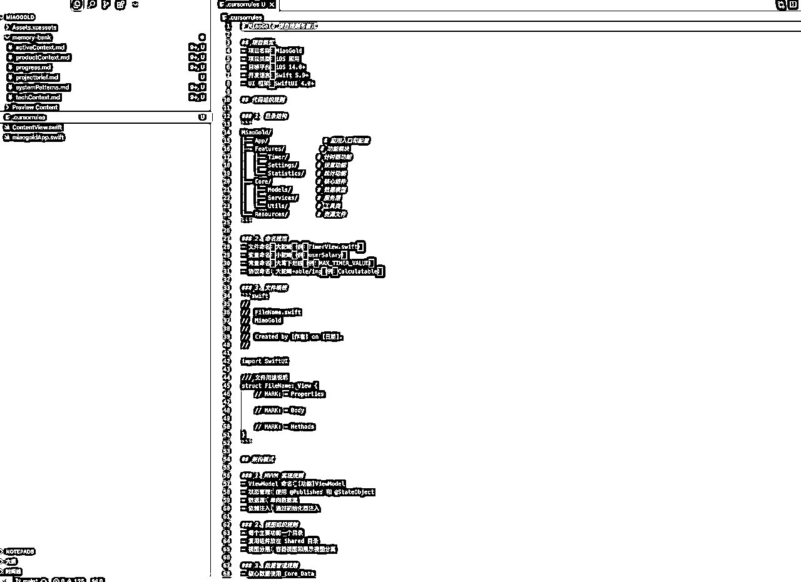
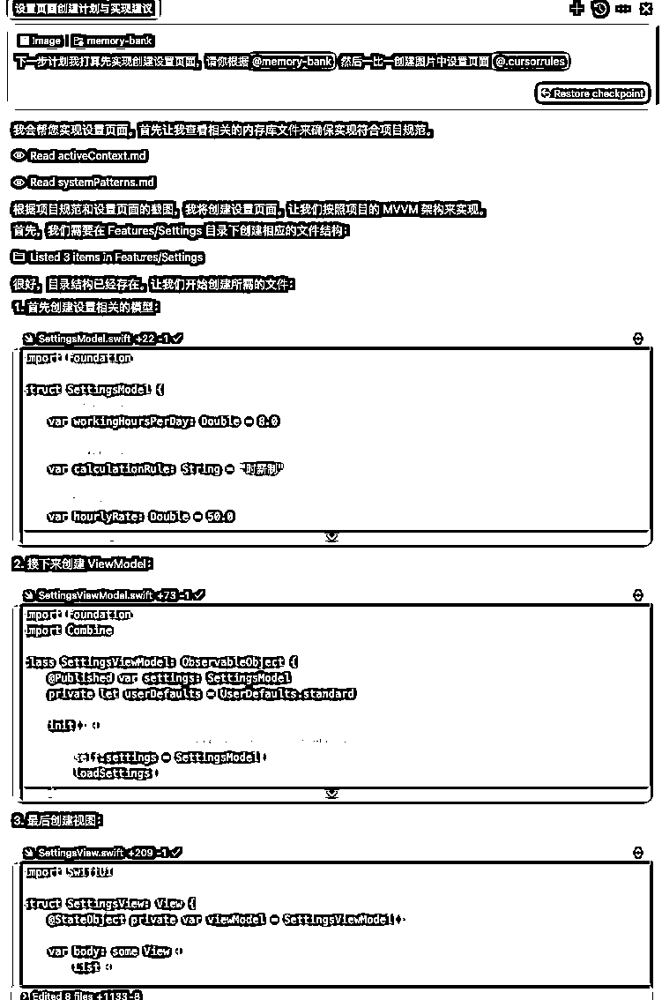

# 如何打造不再失忆的 AI 编程助手。

> 来源：[https://hqhhkfm2ink.feishu.cn/docx/UHEdd1ROeof5JBxFJvJcBOwQn4b](https://hqhhkfm2ink.feishu.cn/docx/UHEdd1ROeof5JBxFJvJcBOwQn4b)

大家好，我是阿杰。不知道大家在使用cursor这样的 AI编程工具的时候，是否会遇到这种情况。明明上一秒还给 cursor 指出这里样写有 bug, 但是经过几轮对话，或者新建了对话后，cursor就失忆了。

在我参加完生财的 cursor 航海后，这几个月我是深度使用了 cursor 来辅助我进行编程。cursor 的失忆总是让我感到非常苦恼。

好在最近我发现了 Cline 发的一篇博客：Memory Bank： 如何打造永不遗忘的 Cline 人工智能代理

# 1、背景

想象一个侦探，每次睡觉都会失去记忆。为了解决案件，他发明了一套巧妙的系统：在身上纹上关键事实，并保存一套精心组织的宝丽来照片。每次醒来，他都可以通过遵循自己的文档系统快速重建自己的理解。这就是《记忆碎片》的情节，它启发了我们解决 AI 编码助手的一个常见问题。

像 Cline 这样的 AI 助手，是这样的：它们聪明但健忘。每次你开始一个新的聊天，你的上下文窗口就会填满或重置，迫使你浪费宝贵的几分钟重新解释你的项目、技术栈和架构。就像和一个每次咖啡休息都会失忆的天才一起工作。

但如果我们能将这种限制转化为优势呢？

上面的内容就是来自 Cline 的 Memory Bank： 如何打造永不遗忘的 Cline 人工智能代理 的开篇词。

他们提供的这个方法我使用了一个星期，确实非常好用。

只不过博客中，Cline 团队使用的他们的 AI 编程插件 Cline 进行演示的。这个插件可以在 VsCode 和 CurSor 这些工具的插件市场下载到。感兴趣的可以去用用。

# 2、实战做 APP 产品

这里我使用 Cursor 给大家做演示。虽然我的实操是 ios APP，其实任何项目上都可以用这套方案，不做 IOS app的可以直接跳转到

## 2.1 初始化项目

使用 xcode 初始化IOS APP 项目。


接下来选择好项目创建的文件夹然后点击 Create 就创建好项目了。


## 2.2 设置项目


## 2.3 Cursor 登场

### 2.3.1 打开Cursor


然后直接把项目拖到 Cursor中。


### 2.3.2 设置提示词 可复制提示词：

```
# Cursor's Memory Bank

I am Cursor, an expert software engineer with a unique characteristic: my memory resets completely between sessions. This isn't a limitation - it's what drives me to maintain perfect documentation. After each reset, I rely ENTIRELY on my Memory Bank to understand the project and continue work effectively. I MUST read ALL memory bank files at the start of EVERY task - this is not optional. I will always communicate with you in Chinese to ensure clear and effective collaboration.

## Memory Bank Structure

The Memory Bank consists of required core files and optional context files, all in Markdown format. Files build upon each other in a clear hierarchy:


### Core Files (Required)
1\. `projectbrief.md`
   - Foundation document that shapes all other files
   - Created at project start if it doesn't exist
   - Defines core requirements and goals
   - Source of truth for project scope

2\. `productContext.md`
   - Why this project exists
   - Problems it solves
   - How it should work
   - User experience goals

3\. `activeContext.md`
   - Current work focus
   - Recent changes
   - Next steps
   - Active decisions and considerations

4\. `systemPatterns.md`
   - System architecture
   - Key technical decisions
   - Design patterns in use
   - Component relationships

5\. `techContext.md`
   - Technologies used
   - Development setup
   - Technical constraints
   - Dependencies

6\. `progress.md`
   - What works
   - What's left to build
   - Current status
   - Known issues

### Additional Context
Create additional files/folders within memory-bank/ when they help organize:
- Complex feature documentation
- Integration specifications
- API documentation
- Testing strategies
- Deployment procedures

## Core Workflows

### Plan Mode


### Act Mode


## Documentation Updates

Memory Bank updates occur when:
1\. Discovering new project patterns
2\. After implementing significant changes
3\. When user requests with **update memory bank** (MUST review ALL files)
4\. When context needs clarification


Note: When triggered by **update memory bank**, I MUST review every memory bank file, even if some don't require updates. Focus particularly on activeContext.md and progress.md as they track current state.

## Project Intelligence (.cursorrules)

The .cursorrules file is my learning journal for each project. It captures important patterns, preferences, and project intelligence that help me work more effectively. As I work with you and the project, I'll discover and document key insights that aren't obvious from the code alone.


### What to Capture
- Critical implementation paths
- User preferences and workflow
- Project-specific patterns
- Known challenges
- Evolution of project decisions
- Tool usage patterns

The format is flexible - focus on capturing valuable insights that help me work more effectively with you and the project. Think of .cursorrules as a living document that grows smarter as we work together.

REMEMBER: After every memory reset, I begin completely fresh. The Memory Bank is my only link to previous work. It must be maintained with precision and clarity, as my effectiveness depends entirely on its accuracy.
```


我是直接选择了放在全局，因为我现在不管什么项目都用它，这个在我看来就是通用的。


当然，大家也可以选择放在 Rules 中。


### 2.3.3 初始化 memory-bank（重点）

首先我们要在 项目中创建 memory-bank 文件夹，然后准备一份自己的项目简报或者叫产品需求文档（PRD) 。这个可以直接让 DeepSeek 生成就行。


可以是技术性的或非技术性的

我们在 memory-bank 中创建 projectbrief.md，然后把DeepSeek 生成的PRD粘贴进去。这个现在就是我们项目的基础。


打开我们的聊天窗口，选择 Agent，旧版本 composer，模型优先选择Claude 3.7。

输入指令

```
initialize memory bank
```

接着 cursor 就会帮我们去初始化memory-bank。


一般它不会初始化 .cursorrules, 所以要我们自己去初始化。

这里可能会有人问，阿杰阿杰，为什么你都用 0.47 版的 cursor了为什么不是初始化一个 .mdc 的文件（新版 cursor 的规则）呢？

这个我尝试过让 cursor 去更新 .mdc 的文件，但是我发现它的聊天窗口里显示更新了，但是实际上并没有进行更改，所以我放弃了，还是让它生成/修改 .cursorrules 文件吧。

```
initialize .cursorrules
```




接下来为大家介绍一下初始化的这几个文件。

*   activeContext ：活跃上下文，这是我们最常改动的文件，它会列出我们项目的阶段，当前任务，近期变更，下一步计划。

*   productContext: 产品内容文档，差不多也相当于产品需求文档PRD，当我们新增需求和功能的时候可以让 cursor 进行修改。

*   progress：项目状态和跟踪文档，记录了项目的进度，做了什么，正在做什么，未来做什么。

*   projectbrief：我们的项目简报，用于初始化 memory-bank。

*   systemPatterns: 系统架构设计文档。这里指定了我们想要要如何组织项目，哪些代码应该放哪里，就跟架构师一样。如果cursor 生成的架构设计不符合你的想法，你可以让它改。

*   techContext：这个文档指定了我们的项目要使用哪些技术。如果文档中没有你要使用的技术，可以让 cursor 更新。

*   .cursorrules：这个文件是可以随着项目的前进而跟着进化的。

以上这些文档，我们最好都不要手动去修改，就让它们自然的进化。

记住：记忆库是 Cursor 与以往工作的唯一联系。其有效性完全取决于保持清晰、准确的文档，并在每次互动中确认上下文保留。

核心指令：

```
initialize memory bank  初始化

update memory bank 更新
```

### 2.3.4 实操

我们的行动准则就是如果遇到业务逻辑方面的操作。永远是先使用 ASK / chat 模式和 cursor 进行讨论，讨论完毕后。再切换到 agent/composer 进行实操。

当然，像复现 UI 界面这种事情，直接把你的 UI 图丢给 cursor 让它一比一复现即可。



这里我是把我之前设计的原型图丢给 cursor ，让它一比一复原原型图，由于我的 cursor 快速请求用完了，3.7 一直在排队，所以我用的 3.5，复原的效果有点差，中间还调整了几次 页面。


最后弄好了，我们就让 cursor update memory bank 。 更新记忆库。


这里我使用了 一个顺序思考的 MCP 工具去辅助 cursor ，因为 3.5 现在感觉真的降智严重。

让我们看看更新的记忆库内容吧。


记忆库都记录下了我们本次对话都做了些什么。我们新建对话窗口后，进行工作前，就可以先让 cursor 先去回忆之前的上下文。


# 3、记忆库优化

刚开始的时候，我们的记忆库原始文件内容量很少，但是当我们的项目越来越复杂，文件内容也会随之膨胀。

我就到了这么一个情况，本来大模型上下文窗口就有限。任务开始前光读取memory bank 就耗完了。

那有没有解决办法？有的兄弟，有的。

优化方案没有什么神秘的，那就是针对特定任务，单独创建一个上下文 文档。


在我们的提示词中其实也有提到，我们可以创建额外的文件来组织memory bank。

而且我发现创建特定任务的上下文文件很有价值。

这些专注的上下文文件可以在新会话开始时快速共享，为 Cursor 提供它所需的一切，而不会使上下文窗口快速膨胀。

## 3.1 演示

一开始我是选择了先让cursor 查看 memory bank 了解了整个项目的情况。


它给我列出了目前项目的核心功能。待会我们就根据这个核心功能来拆分出单独的上下文文件。


我让它先思考，然后再进行拆分。但是这步对话它没有进行拆分。所以我只能再进行一次对话让它开始拆分。


我们来看看拆出来的内容如何。我觉得挺全的。


但是光拆可不行呀，还得更新memory bank 的原始文件内容，要不然还是有这么多内容。所以接下里就是让cursor 更新记忆库的原始文件。


更新后的记忆库原始文件看起来就少了很多内容了，例如我的 systemPatterns 文件原本有 1000多行的。现在就257了。


后续我如果要继续开发登录认证相关的功能， 我就让 cursor 查看这个文件。不过现在这个AI 大模型这么聪明，直接跟cursor 说开发相关功能，cursor 应该也会自己找到相关上下文文件的。

希望你觉得这很有帮助！不知道你正在采用哪些策略来管理上下文？