# YouTube 六次转赛道-开通高级YPP复盘帖

> 来源：[https://lcnqe9bq2wgy.feishu.cn/docx/ZskYddLKyoni8mxPzSIcIvvCnOe](https://lcnqe9bq2wgy.feishu.cn/docx/ZskYddLKyoni8mxPzSIcIvvCnOe)

# 一、背景介绍

大家好，我是六只猫，一个探索生财的新手，去年11月份加入生财后赶上了12月份的YouTube航海，深耕YouTube项目至今，在这2个多月的时间里，不管是技能还是认知都得到了极大的提升，因为是All in，玩的赛道也比较多，达人秀、AI猫猫故事、动物示警、国风美女走秀、Reddit故事号、解说号都玩过，目前在深耕故事号和解说号两个方向，在@方波妮 教练和@Gary 曹教练的带领下，有两个账号达到了高级YPP的条件，算是突破了YouTube项目的第一个门槛，正在向更多努力。

在项目落地实操的过程中，我也踩过不少坑，遇到了不少卡点，也有过不少的焦虑，秉持着“越分享越幸运”的理念，我记录下了自己实操的心路历程及经验，希望能对大家有所帮助。

# 二、YouTube项目心路分享

为什么会选择YouTube项目来深耕呢，主要是因为亦仁老大关于YouTube Shorts项目的超级标，加上Ai赋能，内容制作的门槛对于我这个新手来说降低不少，包括平台对Shorts的流量倾斜，让我决定躬身入局放手一搏。

## 1、生财大航海达标初级YPP

在航海入局的过程中，通过航海手册和大佬们的精华帖指导，我的第一个账号在起步阶段几乎没有遇到大的卡点，走得相对比较顺利，通过对标模仿，利用Ai赋能制作Ai猫猫的故事，一般在15-20天油管会给账号一大波推流，第11个作品从千播万播突破到了一百万，一周后发布的视频跑到了三百万播放，一举成为万粉博主，凭借这个视频开通了初级YPP，详细实操之前写过一篇帖子，不过多赘述，感兴趣的可以看看：https://t.zsxq.com/KA2QQ。

感悟1：入局一个项目，航海手册和生财精华帖能解决90%的问题，不能解决的再试试油管、豆包、GPT、B站、公众号等等，试过之后还是没法解决就及时#举手，永远跟有结果的人学习，卡点停留太久会非常耗费心力。

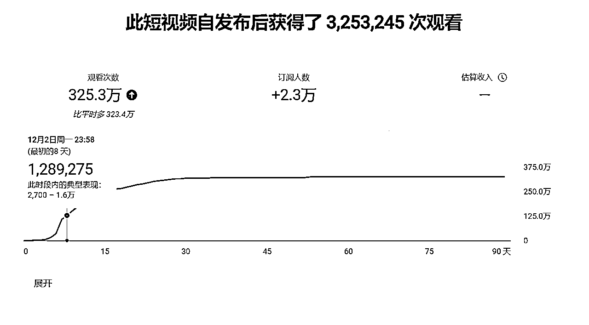

## 2、生财私教陪跑达标高级YPP

由于做Ai猫猫故事对我来说需要花的时间和精力太多，一个视频从文生图、图生视频、再到剪辑的过程至少要花3-4小时，因为使用的是共享账号，用起来非常拥挤，效率很低，遇上排队、抽卡不顺利需要的时间就更长，所以决定放弃Ai路线，走老马教练分享的故事号路线，咔咔一顿发，因为老马教练说过，故事号千播万播是常态，下图是我这个账号故事号的数据，比较吻合，所以心态也还好。

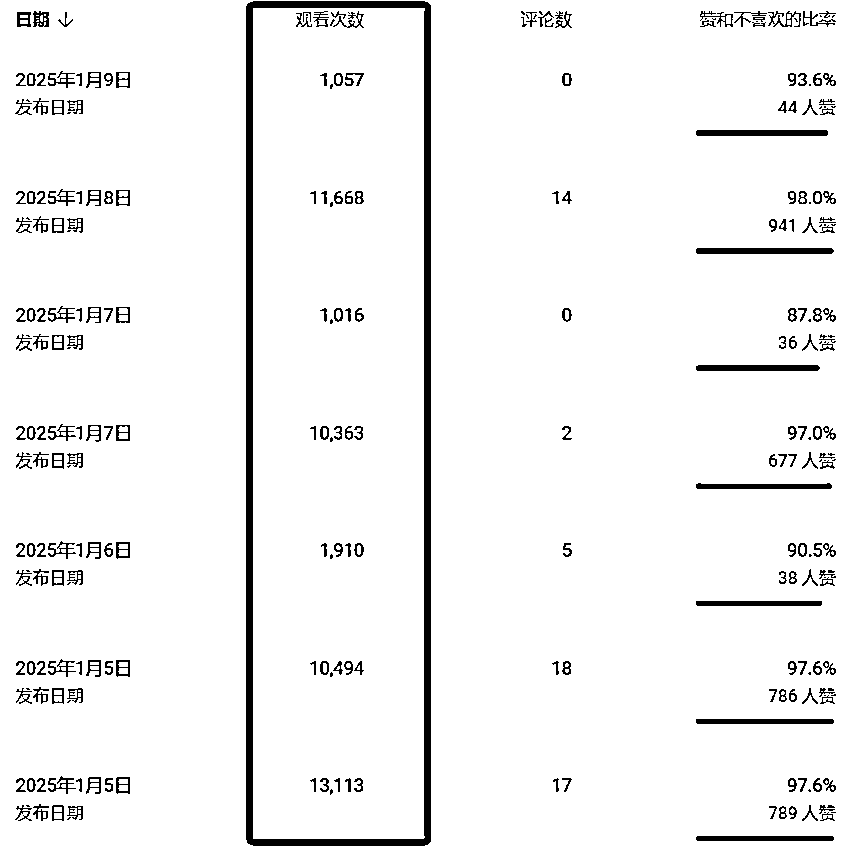

紧接着又看上了达人秀，经不住流量的诱惑，又一头转向Ai赛道，一顿操作猛如虎，数据不过一万五🤣，又回到了时间、效率的痛点上，抽卡不顺利，Ai使用不丝滑，对比评估了一下，这流量差不多还是故事号引入发达国家人群更有前途，又开始了故事号……

再紧接着，动物示警赛道来了，制作时间成本又低了，又扎进了动物示警赛道，千播万播出不了爆款……

因为参加了生财YouTube私教陪跑，预约了波妮教练的一对一指导，在教练的指导下，还是决定重回Ai猫猫赛道冲一下高级YPP，因为这个账号的订阅人数很大部分是靠Ai猫猫积累的，所以重回赛道后流量有一定的上涨，最终在私教陪跑教练分享的新玩法的加持下，达到了高级YPP的条件。

感悟2：赛道转变不要过于频繁，从我的数据来看转赛道是可行的，需要过渡期，但是过多地转换会导致订阅人数下滑，用户画像不一致，很难出爆款。

关于Ai学习焦虑

我在学习使用Ai的过程中，总觉得时间非常不够用，非常焦虑，之前学习Ai会陷入误区：好像要把每个软件学透才算是会用，创作过程一定要用到Ai才叫进了Ai这个圈子。但是Ai只是工具，我觉得重点在于拓宽认知，再去选择自己需要的去学。通过B站、公众号、推特混进Ai的圈子，根据自己的需求学习《通往 AGI 之路》知识库，拓宽认知之后再去针对性地学习能更大程度地节约时间和成本。

## 3、高级YPP申诉成功-复盘总结

坐等开通高级YPP的时候，收到了即将中止资格的通知。

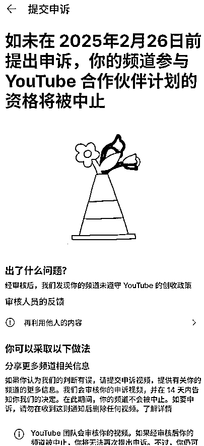

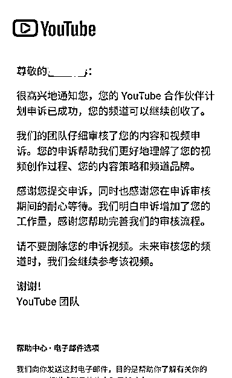

在@方波妮 教练的精华帖：https://t.zsxq.com/Z3yJe 指引下一步一步完成了申诉材料，因为飞书录屏遇到了问题，视频录制我使用的OBS，只需要添加一个视频采集和一个显示器采集然后录制就行了，申诉后大概5个小时后收到申诉成功的邮件，下面贴出我的申诉文案，可以参考参考，主要还是展示了内容制作的历史记录、历史工作文件夹、操作流程、Ai作图网站的后台记录。

## 申诉文案参考：

尊敬的YouTube内容审核管理员你们好，我是一名中国的YouTube频道所有者。我的频道名称是：XXXX。我的频道主要内容方向是使用各类Ai工具创作一些有趣、有教育意义的短视频内容。（展示频道内容、频道链接（是自己频道主页“更多”里面的链接），缓慢滑动页面）但是内容审核员反馈我的视频内容没有明显的原创特征，可能是改自其他来源中的内容，未增加有意义的原创评论、实质性修改或教育或娱乐价值。这个理由与我秉持的原创及利他的创作理念相悖。这让我感觉到很沮丧。所以我制作了这期视频来澄清。（展示违规通知的内容）

我的频道一共有70个视频，以短视频为主，短视频主要分为了两个大的部分：一个部分是制作关于猫咪故事的有教育意义的短视频，一个部分是制作炫酷变身融合的娱乐性视频。我会将这两个主要部分的内容制作过程进行详细讲解。（展示频道内容，缓慢滑动）

第一部分是猫咪故事短视频，这里展示了我所有短视频的创作的工作文件夹，每一个文件夹都包含了视频脚本、视频分镜图以及分镜视频。（简单展示文件夹及个别文件夹内详细内容）这个视频是我播放量最高的短视频，文件夹展示了故事脚本，所有的分镜图片以及分镜视频。（展示最高播放量的文件夹详细内容），制作视频脚本我会用到ChatGPT，这里是使用ChatGpt辅助写分镜脚本的页面（展示chatgpt对话页面），视频分镜图我会用到DallE，（演示将脚本提示词发给DallE，展示一两个出图过程），按照这样的步骤得到所有的视频分镜图。视频分镜我会用到runway、即梦、可灵等Ai工具（可以展示一些网站首页截图）。我这里使用即梦进行分镜视频的制作（展示一个图生视频的过程），将所有的图片使用即梦做出分镜视频，这样就会得到所有的分镜视频（可以展示即梦后台做视频记录，还有所有分镜视频的文件夹）。最后放入CapCut中进行剪辑（展示Capcut），调整视频片段的长度，增加相应的文字，增加背景填充，导入音频，最后在YouTube平台进行发布。（这里在剪辑软件里面就简单展示一下操作，不需要很细致）

第二部分是炫酷的变身秀娱乐视频，这里展示了我所有短视频的创作的工作文件夹，每一个文件夹都包含了视频分镜图以及分镜视频。（简单展示文件夹及个别详细内容）我会使用Chatgpt辅助我生成图片的提示词，这是GPT生成提示词的界面（展示chatgpt对话页面），然后文档也展示了所有分镜图的提示词（因为所有的提示词我都保留在飞书文档，所有展示了飞书文档），接着我会使用Comfyui进行图片的生成（展示Comfyui工作流，我用的是liblib.Al，展示Comfyui作一张图的过程），这是我使用Comfyui做图的后台记录（liblib.Al作图后台有记录，展示comfyui作图后台记录），里面展示了我作图的历史记录，然后我就可以得到所有的分镜图片。然后我会使用即梦Ai的关键帧功能制作变身融合的效果（展示即梦做视频过程，演示一个），最后得到所有的分镜视频（文件夹展示），同样使用capcut进行视频的剪辑，加入一些特效、转场，导入音频，然后导出视频，在平台发送。（同第一个部分）

频道的其他视频也是通过以上方式创作（这里要说明整个频道都是这样制作的，不针对某一个视频，展示频道所有视频），在这里展示了我所有短视频的创作的工作文件夹，每一个文件夹都包含了视频脚本、视频分镜图以及分镜视频。这是capcut剪辑的草稿箱（capcut的草稿箱）。

我深知抄袭的可耻的，会损害所有优秀创作者的利益、扰乱社会秩序，所以我一直坚持内容的原创性，这个澄清视频也是我的原创，就像我的其他视频一样，我希望我的每一个视频都能为他人提供价值，我希望YouTube审查小组能够重新审查我的视频内容。你们和观众的认可是我制作视频最大的动力，谢谢。

感悟3：视频制作过程中一定要形成自己的文件夹和知识库，将用到的提示词、文稿、脚本记录好，遇到申诉的情况可以快速找到资料来自证。

# 三、reddit故事号、解说号实操步骤分享

## 1、爆款视频文案获取

用这个网站可以一次性免费下载三个视频的文案https://member.downsub.com/multi-downloader

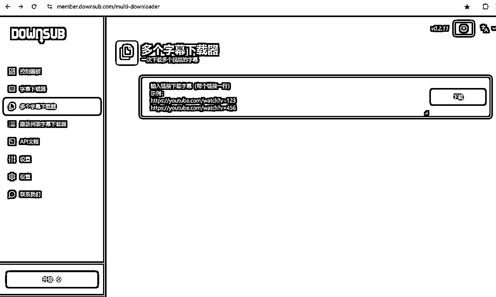

## 2、Ai爆款文案复刻（飞书多维表格+DeepSeek）

文案复刻我用了两种方法，一种是用ChatGPT，另一种是使用飞书多维表格+DeepSeek实现多文案自动复刻，并进行关键词的提取，灵感来自于生财圈友@小查 的帖子，https://t.zsxq.com/ZDf6U，有详细讲到怎么搭建。

因为爆款视频文案获取的网站下载的TXT文档排版乱，没有标点，会影响Ai理解和改写，还可能存在用词不正确的情况，所以我会使用飞书多维表格+DeepSeek对文案先进行整理，再进行改写。（提示词仅供参考，可以根据DeepSeek的思考过程来优化提示词）

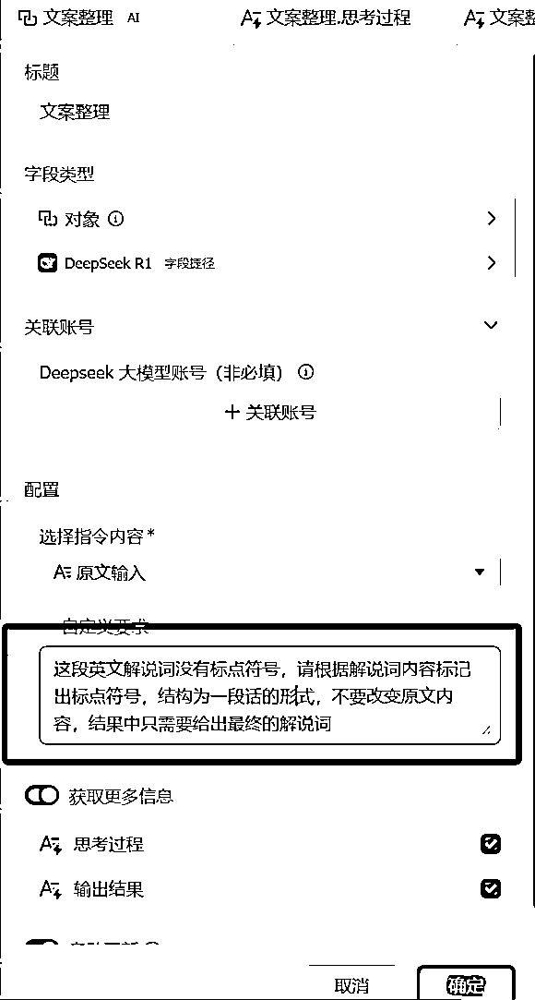

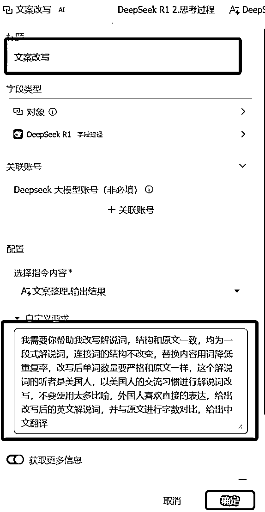

因为我这个表格是用来做解说号的，就涉及到视频素材的收集，所以我又加了一列，用于文案关键词的提取，这样有助于在其他视频平台直接使用提示词搜索视频素材，如果生成的提示词不满意，可以点击刷新重新生成。

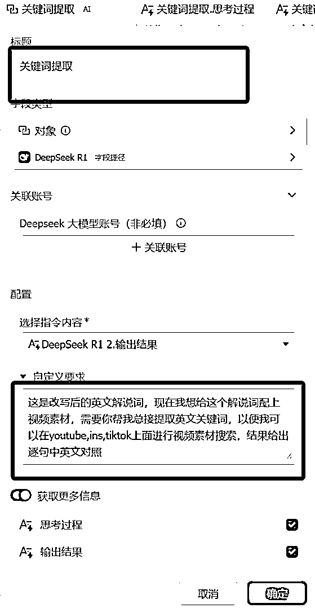

## 3、逼真的文案配音

配音工具有很多，大家可以根据自己的需求选择，故事号对配音要求要高一些，我主要使用elevenlabs进行配音，分享一下这个工具的使用心得。Ai配音我遇到过两个问题。

一个问题是没有情感，Ai味扑面而来，这种情况在elevenlabs中可以通过以下方法来调整：

*   降低稳定性来增强情感；

*   将文稿中语气需要加强的单词用大写进行表述；

*   在恰当的位置增加感叹号、问号、停顿符号。

后面这两个方法可以直接把压力给到GPT或者DeepSeek，在文稿改写的同时给出要求，以下是我文稿改写的提示词，大家可以参考：

帮我改写故事，分别给出英文版和中文版，改写规则如下:

1、保留原文稿标题

2、核心词汇、关键词汇、情绪用词使用大写字母表述，叙述时语气加重的单词使用大写进行表述

3、改写后文稿的字词与原文稿字词重复率不高于20%

4、改写后文稿的字数<原文稿字数x1.1，改写后文稿的英语单词尽可能控制在300-350个

5、保留:人称关系、核心事件

6、语言:简练句式清晰主干，符合美国人的语句表达习惯

7、在原文稿的基础上完善故事逻辑、补充细节、心理动态描写等

配音的另一个问题是分贝调高后不可避免地有电流噪声，针对这个问题我在卡兹克的群里得到了答案，音频生成后使用Au对音频进行降噪处理，推荐一个公众号：化工加（化工狗仅剩的价值体现），能够免费下载以下领域的软件，还附带安装教程，Au可以直接在这里下载安装。

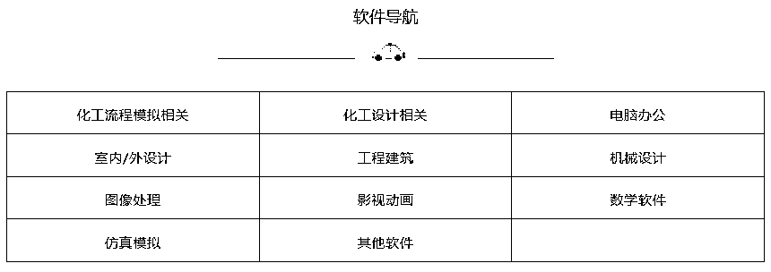

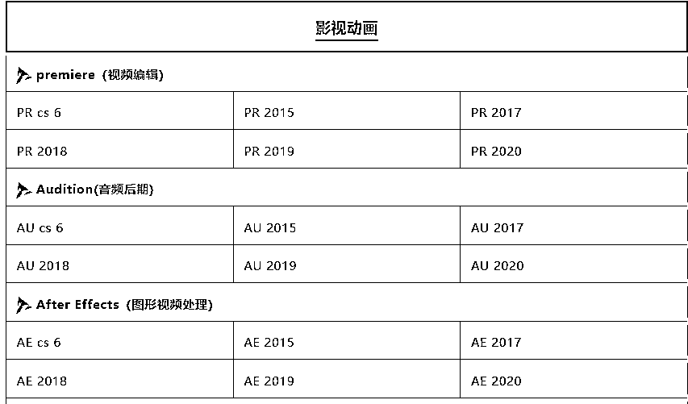

我使用Au只用到了三个功能，调高音量分贝、加速音频和降噪。

步骤如下：

*   将音频直接拖入Au界面。

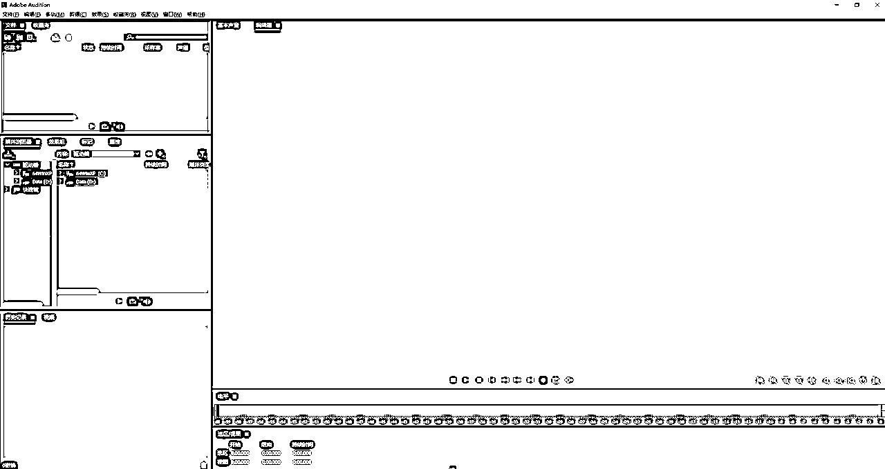

*   加大音频音量，鼠标长按调整振幅，往左拖动为减小振幅，减小音量，往左拖动就是加大音量。

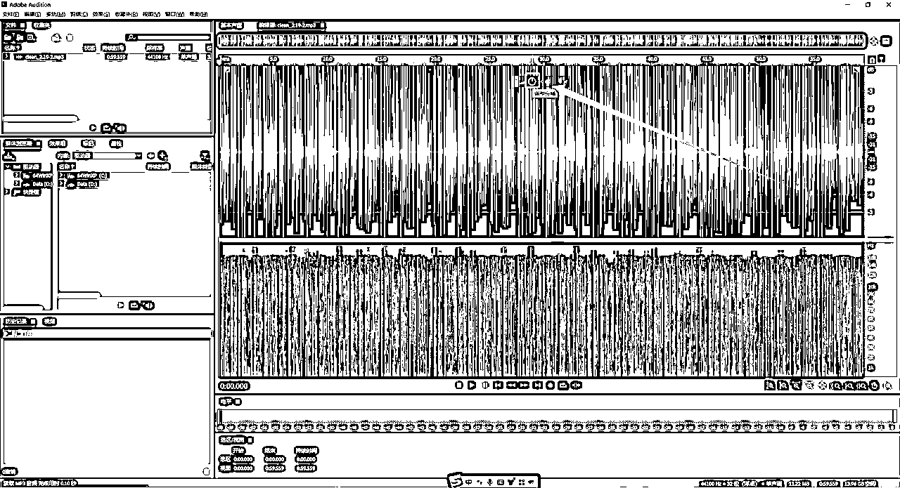

*   依次选择效果、时间与变调、伸缩与变调处理即可进入音频速度调整的界面，可以直接把时间改到自己想要的值，也可以修改伸缩比例，加速到58%（仅供参考，与电脑性能有关）剪映能够完整识别字幕，自定义好了之后系统会自动将设置设定为默认，意思是之后处理其他音频可以直接点应用即可。

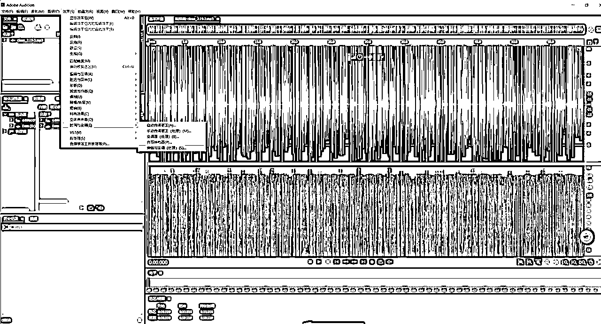

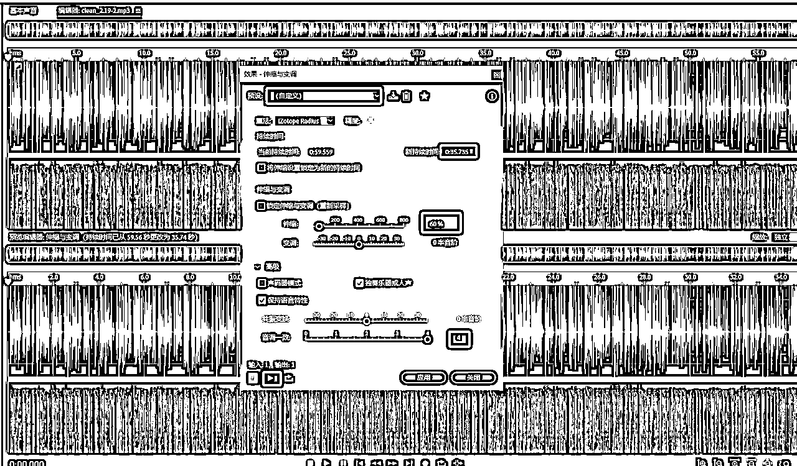

*   降噪操作，按照下图依次选择，进入自动降噪界面，调整幅度、噪声量等指标，试听找到最适合的参数应用，自定义好了之后系统会自动将设置设定为默认。所以处理一个音频的时间成本仅需30s。

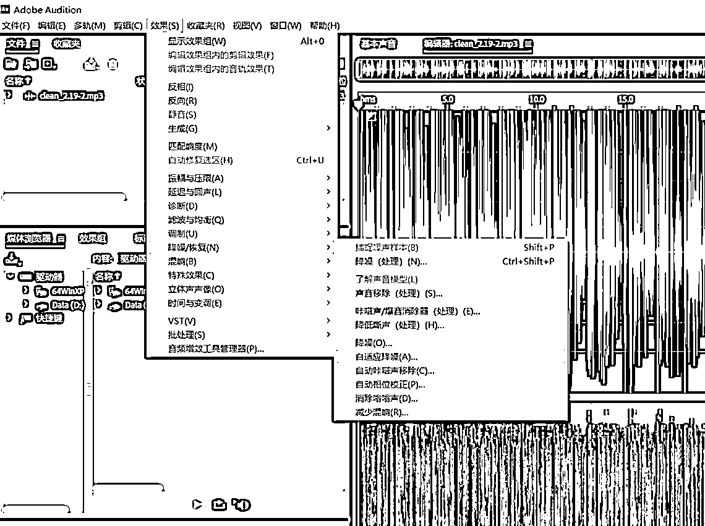

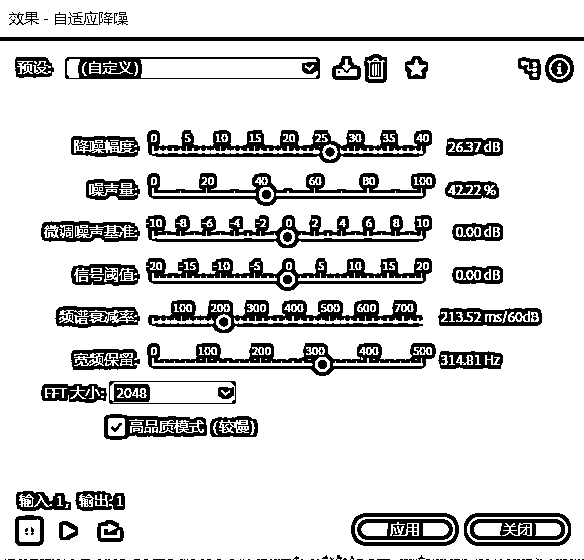

## 4、解说号视频素材的获取

解说视频素材的获取老马教练还有生财圈友也都分享过，我是逆练，主要通过Google搜图和关键词搜索来寻找素材。

*   Google搜图：使用老马教练分享的视频关键帧提取工具提取图片，然后在Google浏览器里搜图。

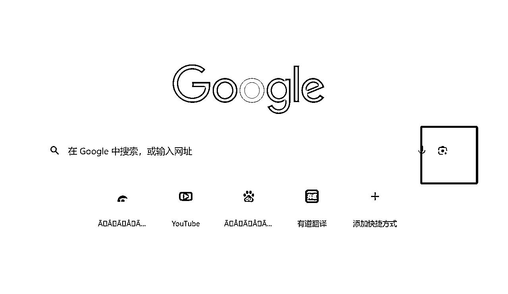

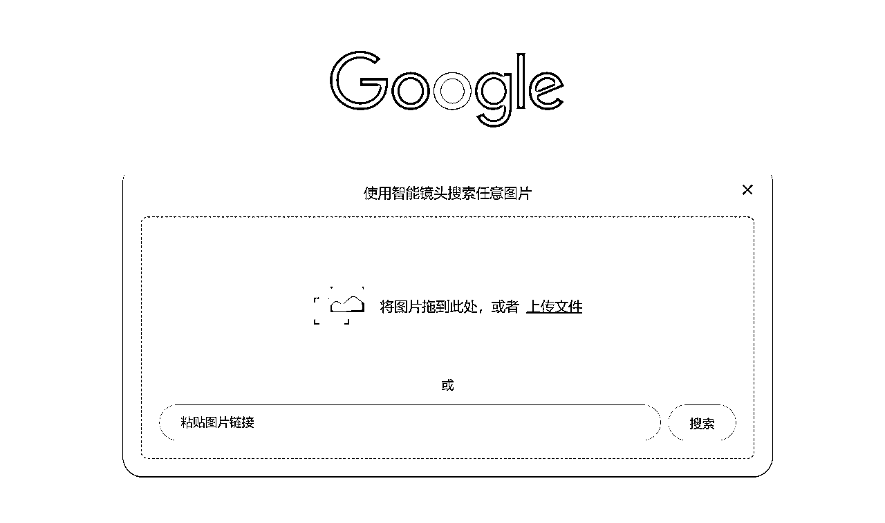

*   关键词搜索：这就用到了上面飞书+DeepSeek提取到的关键词了，我习惯在TikTok进行搜索，直接将提取到的关键词复制进TikTok搜索，大概率都能搜到原视频或者一些相关的视频，然后你会发现新大陆（YouTube很多对标账号的素材、灵感都来自于TikTok，TikTok遇到好的账号可以关注一下，说不定以后原创用得上呢）。

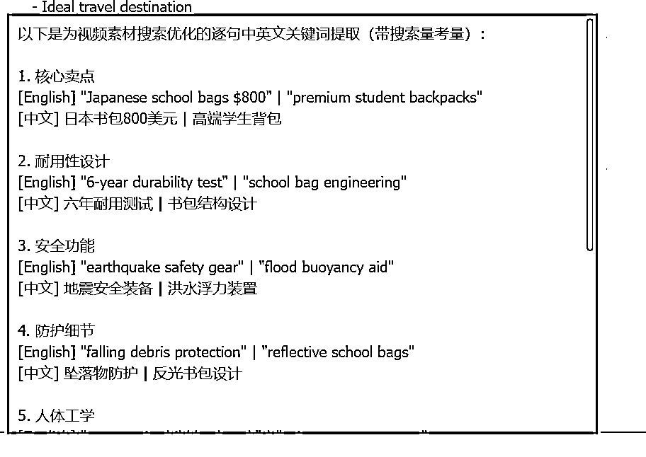

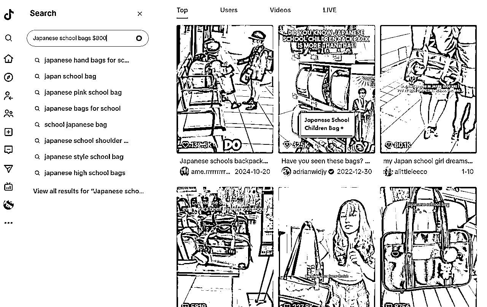

## 5、视频下载工具分享

*   专门下载TikTok视频的网站：https://musicaldown.com/en

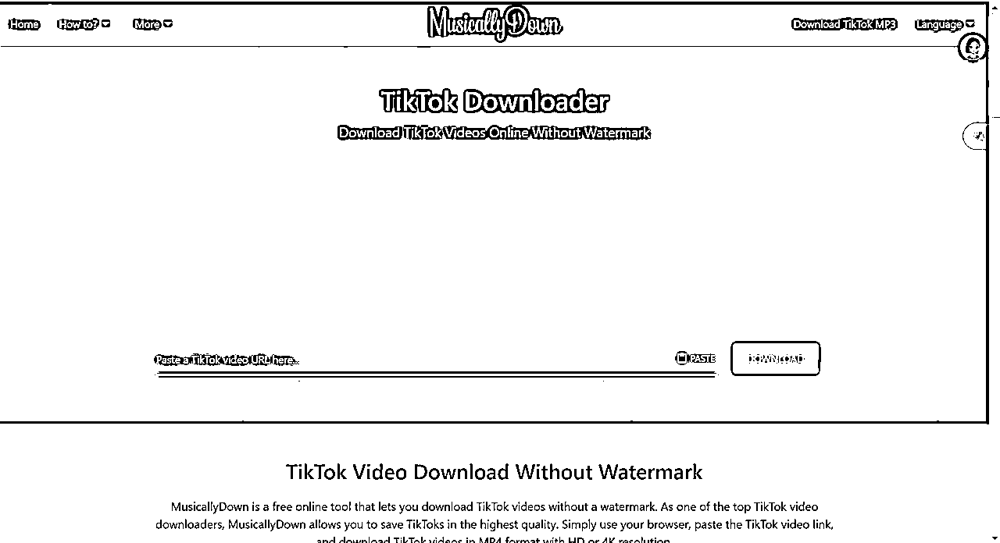

*   多网站视频下载的软件：

这里特地分享一个我发现的视频下载的小工具，因为故事号涉及到批量下载，可能使用哼哼猫更好，但是解说号是单个素材寻找和下载，这个软件可以将你复制的链接直接点击粘贴就可以自动解析下载，批量一次性最多10个。网址：https://snapany.com/zh

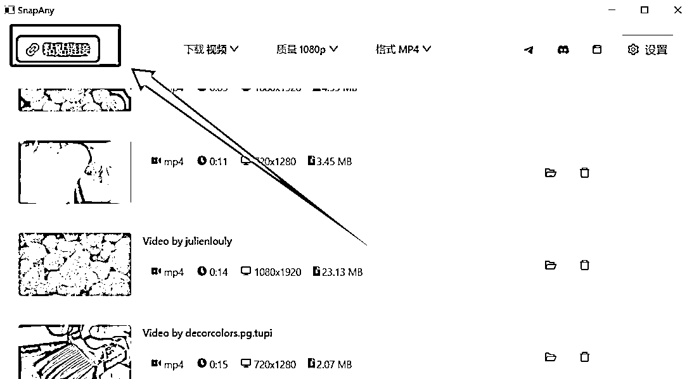

感悟4：故事号、解说号肯定没有Ai达人秀之类的视频爆量快，但是是一个可以持续深耕的赛道，相比Ai类更持久。里面涉及到可以深耕的东西还很多，特别是理解海外文化，说实话，我现在还不能判断我改写后的文案是好还是不好，只能通过数据反馈，长期去感受什么样的表达方式外国人更喜欢，包括一些外国人讲的一些俚语等等。故事号一定要多留意评论区，多互动，有可能会从他们的评论中得到优化的灵感。

# 四、总结和感谢

YouTube项目是一个值得深耕的项目，感谢生财提供的平台和机会，感谢生财上YouTube相关的所有帖子的作者，通过这些帖子打开了我的认知，感谢生财YouTube私教陪跑，让我在短短两个多月开通高级YPP。

感谢七天老师@七天@生财有术、方波妮教练@方波妮和Gary教练@Gary对文章的指导！

很庆幸能够和圈友们一起向同一个目标前进，希望能和更多地圈友一起努力，2025猛猛干！