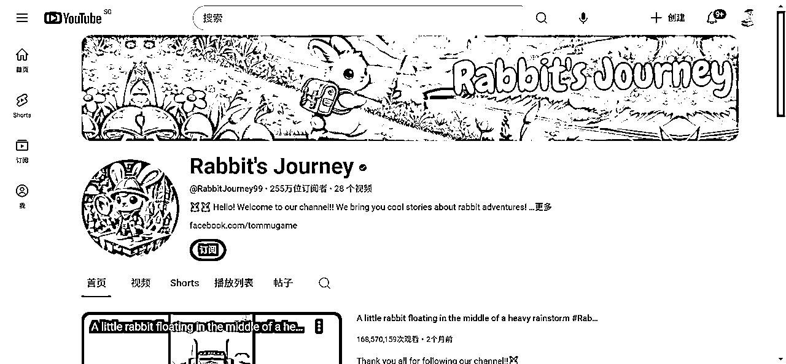
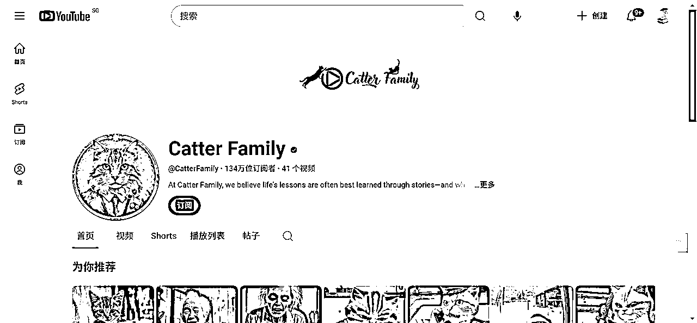
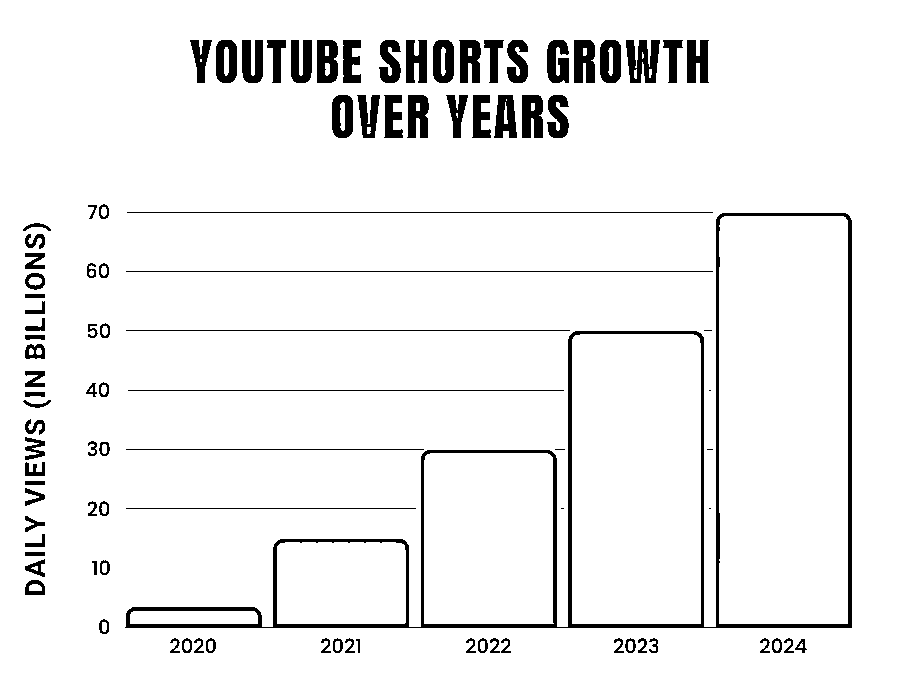

# YouTube赚钱：我该做长片还是做短片？

> 来源：[https://rlwxa0zgke.feishu.cn/docx/HlLIdY9mOoDKirxssnXc4TaFnud](https://rlwxa0zgke.feishu.cn/docx/HlLIdY9mOoDKirxssnXc4TaFnud)

### 1、短片比长片更容易，同时可以更快的获得正反馈，可以先从短片开始

短片比长篇更容易上手。对于刚开始接触YouTube，想在YouTube上赚钱的人来说，短片无疑是一个很好的开始。这个理由就足够了，因为刚开始时难度较大，我们需要降低起步的门槛，所以先做短片是个不错的选择。

从另一个角度来看，做视频要从开始开始，对于突破自己的舒适区来说，从阻力最小处开始，而短片相对于长片阻力就相对而言小很多，阻力小自然也就更容易行动，或者说更容易持续下去了。

另外的话，短片更容易获得正反馈，为什么这么说？对于某一类人，他们是直接上来就是抄爆款的，这里给出一个csv文档

爆款的Shorts视频分两类：1、全平台的爆款视频 2、单一关键字的爆款视频

1、全平台的爆款视频

说明一下，这里所谓全平台的爆款视频其实是针对于你频道的爆款视频，你订阅的频道更有可能出现在你的Shorts页面上

2、单一关键字的爆款视频

这种情况是，在 1、全平台的爆款视频 的基础上，针对于特定的关键词，进行更为精准的搜索出来的结果

综上来说：强烈建议先从Shorts开始，直接去追爆款，成功复制成功

1、先在YouTube全平台去找异常值

2、通过单一关键词去找足够多的对标账号

3、关注这些做的好的对标账号复制模仿，基于人性不变，爆火过的内容还会爆火

4、当一个赛道做塌了，观众审美疲劳了，平台不推了，那么就重复1、先在YouTube全平台去找异常值的一个的过程

### 2、短片是很好的训练工具，日更/日多更

短片是一个很好的训练工具。它能够实现日更甚至日多更，为什么要尽可能保持高频率的更新呢？因为这样可以形成一个从生产到反馈、学习、改进、复盘的闭环，帮助你快速进步。学习的闭环要小而快速，短片正好符合这样的训练目的。

### 3、短片播放量比长片更大

短片的播放量往往会比长片更大。这一点其实和前面提到的两个因素密切相关。当你进行创作训练时，肯定不希望自己辛苦制作的视频发布后，却没有任何播放量和反馈，这样你就无法判断自己做得对不对，也不知道哪些地方需要改进。

通常情况下，如果你能做到日更甚至日多更，总会有一些视频能够快速获得播放量，甚至收获点赞。运气好的话，还能得到一些有价值的反馈。

有一句话，数量推死质量，你做一个质量很好的视频花费的成本相当大，但是你做的短片时间少，数量多，这些数量中总有一些“幸运儿”，有些频道因为一两个爆款也就达成了一个初步阶段的目标，也就是所谓的YPP。

从整体来看，短片的播放量往往会比长片大得多，甚至可能高出10倍、20倍。这种快速的反馈能让你及时感受到自己的努力得到了回应，对新手来说，这种正向反馈非常重要，它能帮助你建立信心，让你相信自己做的事情是有价值的。

同样的过亿的播放量在短片中也更常见

分享4个播放量过亿的频道

1、Paws of Courage

www.youtube.com/@PawsofCourage-f7b

2、Duck's Quest

3、Rabbit's Journey

4、Catter Family

### 4、短片播放量波动巨大

短片的播放量波动非常大，这一点可能让很多新手感到困惑和难以理解。这种波动是什么意思呢？简单来说，同一个视频的播放量可能会相差100倍甚至更多。

举个例子，你今天发布了一个视频，可能只有5个播放量，你觉得不满意，过两天删掉重发，结果播放量可能就变成了500甚至5000。有趣的是，这个视频的内容其实没有任何改动。这就是短片播放量的一个显著特征——存在巨大的波动性。

这里解释一点，关于频道视频被限流的话题，只要不是0播，你就可以认为没有被限流，如果长期0播，那么就要找原因。一般情况往往是往往是跟节点有关系，比如说免费节点，节点是其中一个原因。

短片流量的波动并不意味着短片没有一个客观的质量评价体系。相对于长片来说，由于短片的供给量非常大，从官方给出的数据来看，自从AI能生成视频后，在YouTube平台的视频数量极具上升，我们可以从这个网址 2025 年 YouTube 统计数据：关键见解和趋势 得出一些资讯

用户每天观看 YouTube 内容的时间超过 1 亿小时

*   YouTube 观看时间的 70% 来自移动设备

*   YouTube Shorts 每日观看次数超过 50 亿次

全球 89.5% 的 YouTube 访问量来自移动和智能手机设备

*   70% 的美国用户通过智能手机访问 YouTube

*   40.9% 的 YouTube 观看时间发生在移动设备上

*   。。。。

我把关注点停留在下面的这张图，从图中我们可以得出一个结论，那就是Shorts数量涨得很猛

尽管YouTube按照其短片推送的算法，努力让质量较高的短片获得更多播放量，但从整个YouTube平台，Shorts的数量会越来越多，同时在移动端看的人占到大多数，这就会引发一个问题——停留短。

在移动端，人的习惯不用说是用手来进行滑动的，那么具体某一个视频的播放量是1000还是10万又或者是1000W，存在某种“随机性”——注意，这里的“随机”是打引号的。

YouTube的推荐策略很显然是采用赛马机制，那么在最初始的赛马中，你的视频被最初始看你的观众滑走了，这就造成了你视频很少播放的假现，但是，当你把原Shorts视频删了，再说，你突然惊喜的发现，视频还是那个视频，怎么观看次数就增加了呢？这也就是幻觉之一了。

值得说明一点的是，Shorts你是可以删了重发，可以这样做，但是不要上瘾，所谓上瘾，这里举一个例子，你打算只做10个Shorts，这10个Shorts，你发了删，删了发，就不做新视频了，这是非常不推荐的，你跟YouTubeg玩躲猫猫的做法不可取。

我为什么知道会有这么一个骚操作？原因很简单，因为还真就有人问过我能不能这么做。。。

短片讲究的是群狼战术，你需要小步快跑，不断前进，大量生产短片。因此，对于一个专门做短片的频道来说，日更甚至都不能算是一个极格的标准，你应该努力做到日多更，用这种密集的更新来弥补单个短片视频播放量的波动。只有这样，才能保持你频道每天播放量的相对稳定，并不断成长。这是短片频道与长篇频道的显著差别。

### 5、短片频道也有挺赚钱的

还是回到这个图，长视频你想要有过亿的观看次数其实不容易的,短片是有机会的，长视频对于一些新手，刚做频道的人来说，直接上去做长视频很大程度上在数据上不如短片。

### 6、可以长短都做，可以只做其一

其实不必在长短之间非要做出一个选择。你可以交替生产，既做长片又做短片，或者开始时只做短片，等到你掌握了所有技术后，再开始做长篇。

又或者，如果你做长篇一段时间后感觉没有起色，调整形式来专注做短片也没有问题。不要认为形式的选择是一个频道的生死问题。

但是，如果你在同一个频道里既有长篇又有短篇，我会建议你在同一个内容方向上保持一致。在这里就不得不提一个非常出名的人，如下图

我们可以看到他最早期是做游戏主播，他在不断的找方向，不断的尝试，慢慢找出了自己的风格。

我要补充的是，不建议删视频，如果你确实觉得碍眼，你可以设置私享，我在一份YouTube的官方文档给出了相关的理由。

在YouTube的推荐算法，有一个项是观看历史记录，观看历史记录会影响搜索，同样也会影响观众的首页推荐，我就知道有一个人，说要换赛道，一家伙把原来频道视频全部删了，他视频相关的关联信息全没了，这就是不懂YouTube官方的推荐算法做的，在我看来不明智的行为。

设置私享做得精细一点，那就是慢慢设置，以减少其因为视频影响带来的推荐影响，很多时候，人与人的差距是在一点点的小细节上慢慢拉开的，每个小细节多做1%，那么也许整体上，你就你别人多15%，20%甚至更多。

把频道视频全删了所造成的推荐影响有多大，不建议去尝试，除非你是真不打算长期经营，仅仅是想测试下那倒也无妨，或是像MrBeast一样，原来的视频留着，反而有人好奇他最早期做的视频是什么从而因为猎奇去看他最早一期的视频

从下图可知，他最早的视频带来了 2914W次的播放

关于YouTube 的搜索排名系统的说明

每分钟都有超过 500 小时的内容上传到 YouTube，如果没有人帮助您对所有视频进行分类，您几乎不可能找到所需的内容。

YouTube 的搜索排名系统就是这样做的，它通过对大量视频进行排序，找出与您的搜索查询最相关、最有用的结果，并以有助于您找到所需内容的方式呈现这些结果。

在 YouTube 搜索中，我们优先考虑三个主要因素来提供最佳搜索结果：相关性、参与度和质量。

根据搜索类型的不同，这三个要素的重要性也不同。为了评估相关性，我们会考虑很多因素，例如标题、标签、描述和视频内容与搜索查询的匹配程度。

参与信号是确定相关性的重要方法。我们会综合用户的参与信号，例如，我们可能会查看特定查询的特定视频的观看时间，以确定其他用户是否认为该视频与查询相关。

最后，在质量方面，我们的系统旨在识别信号，帮助确定哪些频道在特定主题上展示了专业性、权威性和可信度。

YouTube 不接受为在有机搜索结果中获得更好的位置而支付的费用，我们也不会对谷歌拥有的内容比第三方创作者的内容给予更优惠的待遇。

除了这三大要素外，我们还努力使搜索结果与每个用户相关，如果您开启了搜索和观看历史记录，我们还可能会考虑您的搜索和观看历史记录。

这就是为什么您的搜索结果可能与其他用户相同查询的搜索结果不同。下图是一些并排示例，显示了用户的类似搜索如何会因这些因素而有所不同。

每个用户的搜索结果可能不同。例如，如果用户观看大量体育视频并搜索 “板球”，我们可能会推荐板球运动视频，而不是有蟋蟀的自然视频。

官方文档链接

### 7、同一频道的短片长片必须是同一内容方向可以只做横屏，或只做竖屏，忘记长短

很多人都会纠结一个问题：到底该拍横屏还是竖屏？特别是当我们不确定最终剪辑出来的片子是3分钟以下还是3分钟以上的时候。

我的建议是，别太纠结这个问题。关键在于你的内容适合以什么方式呈现。

比如说，如果你的内容是访谈类、对话类，或者是户外运动、远足、登山等场景，这些通常更适合用横屏来展现画面。那你就大胆地选择横屏。反过来，如果你的内容本身就更适合竖屏的呈现方式，那就选择竖屏。

你只需要选择一种特定的形式来呈现你的内容，无论它是长是短，无论它被称为YouTube短片还是抖音中视频，这些都不重要。你可以专注于内容本身，而不必被形式束缚。毕竟，这个世界上有足够多的人喜欢看短片，也有足够多的人偏爱长片。

同样，讨厌竖屏的人很多，但只喜欢横屏视频的人也有几千万甚至数以亿计。所以，你不需要讨好所有人、所有平台，而是要根据自己的具体情况做出决定。

### 8、如果你要做个人IP，考虑后续更方向商业化动作强烈建议做长篇

前面我说了很多，观点似乎都指向做短片，其实这是侧重点不同，我给出一个图，也就是我在2023年关注的一个做长视频博主给的收益图，如下

他是做个人IP的，他的播放次数不如一些短片的博主多，我们可以对比短片的收益图，从图中可以得知，2.9亿的播放收益 $15 317.04

总结来说，做短片就要博爆款，不管是过YPP也好，还是说要赚钱，只有爆款才能赚到钱。

在之前分享 中有一段

对于越来越多的人来说，看电视就是看 YouTube。观众平均每天在电视上观看超过 10 亿小时的 YouTube 内容，现在电视已成为美国 YouTube 观看的主要设备。

我们的智能电视增长也吸引了新的广告商，我们继续引入在大屏幕上特别有效的格式，如二维码和暂停广告。我们的订阅服务也势头强劲：YouTube TV 拥有超过 800 万订阅者。

短片还是长片，其实是场景不同，如果是在移动智能设置上，出门自然是随身带着手机，这是很容易想到的事，但是如果是在家里，其实人更偏向于看长片。

当然因素非常多，比如像我，我就基本不看短片，或者说看得少，我更习惯于看长片，不管是短片，还是长篇都有赚到钱的人，短片有赚钱的，长片也有赚钱的，我衷心祝福那个赚钱的会是你。