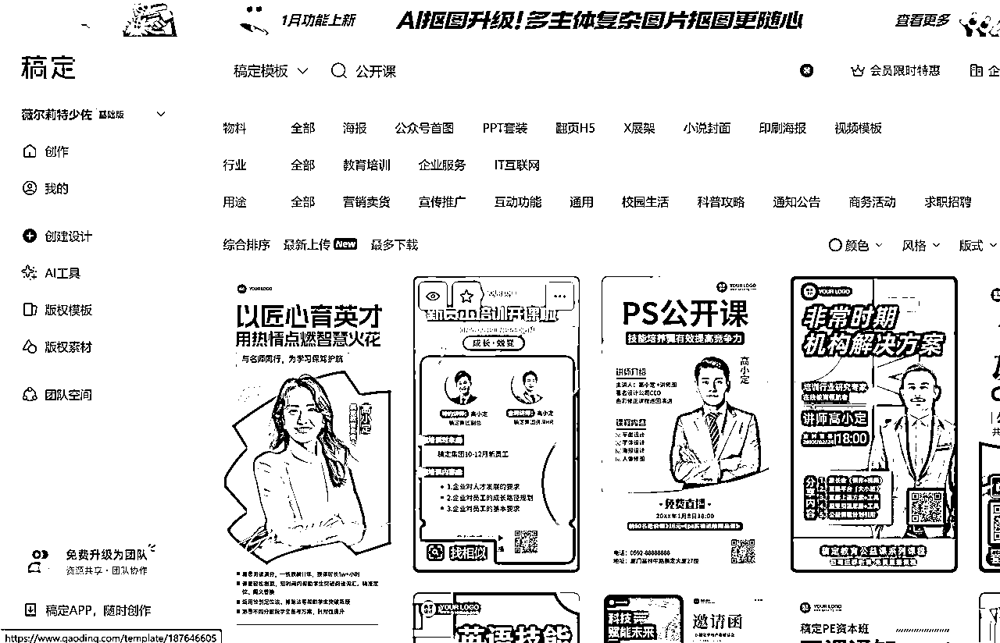
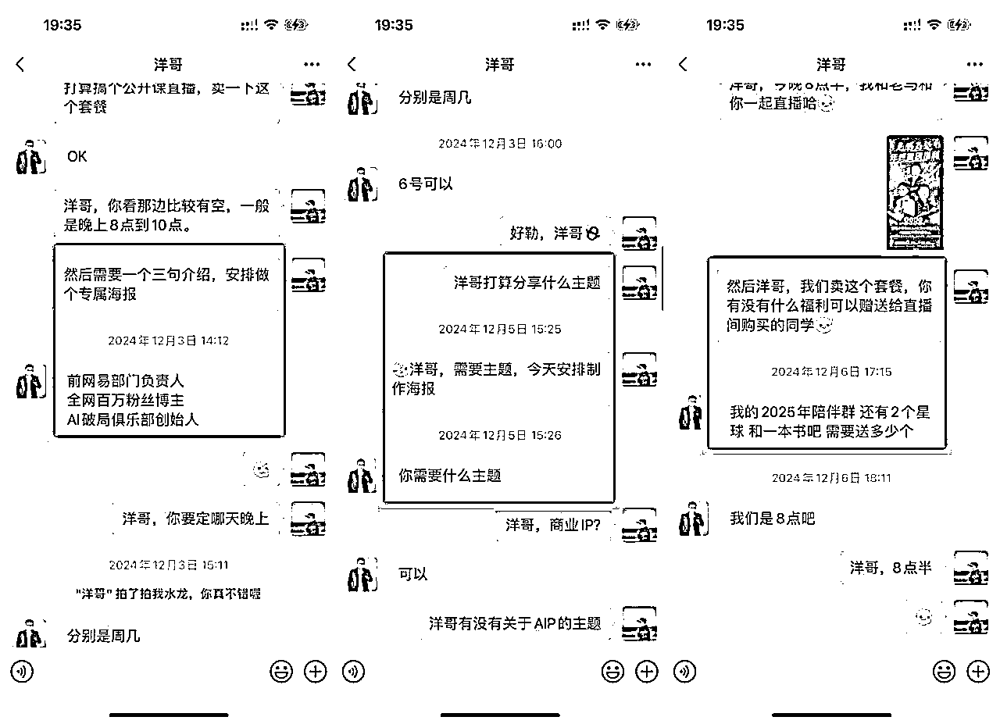
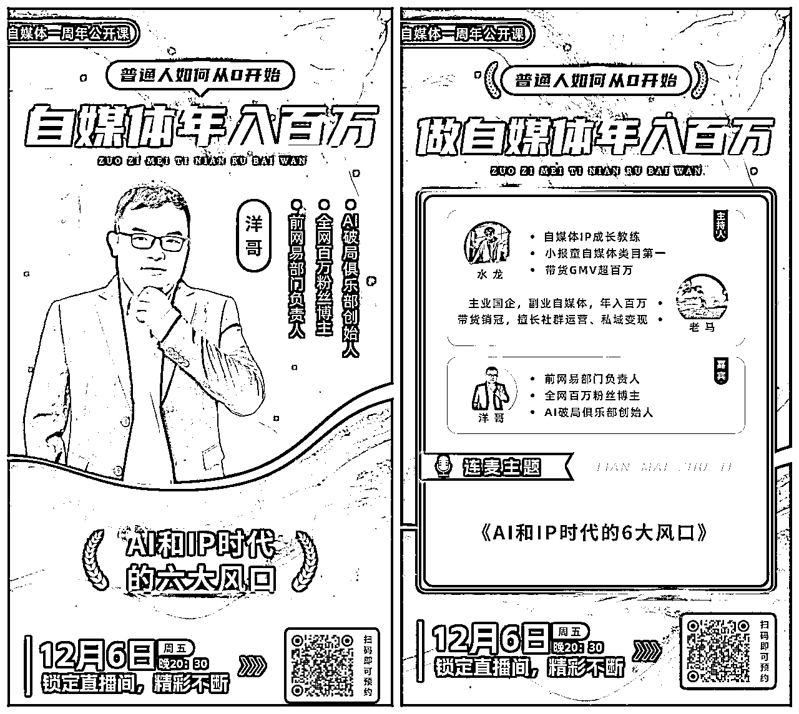
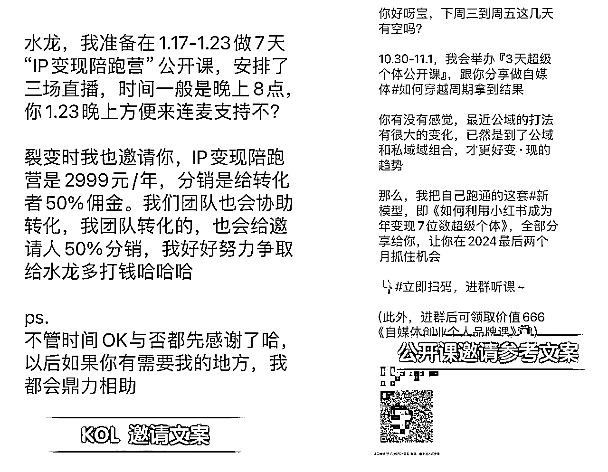
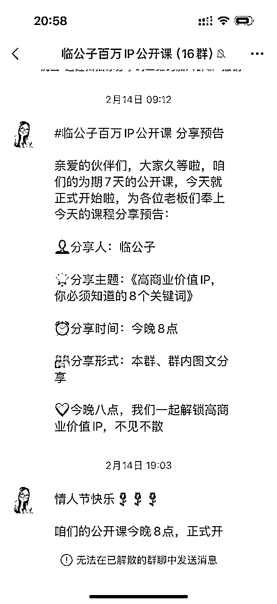
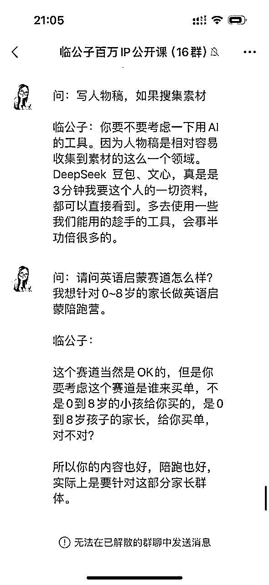
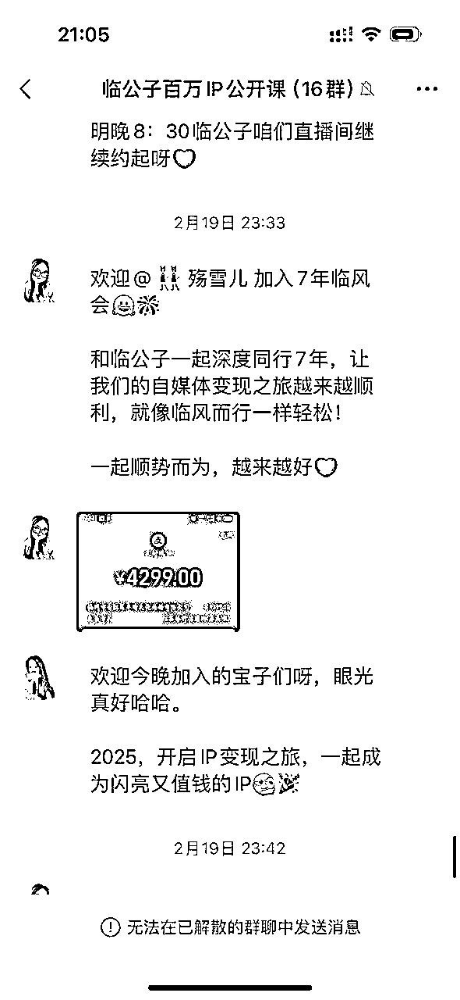
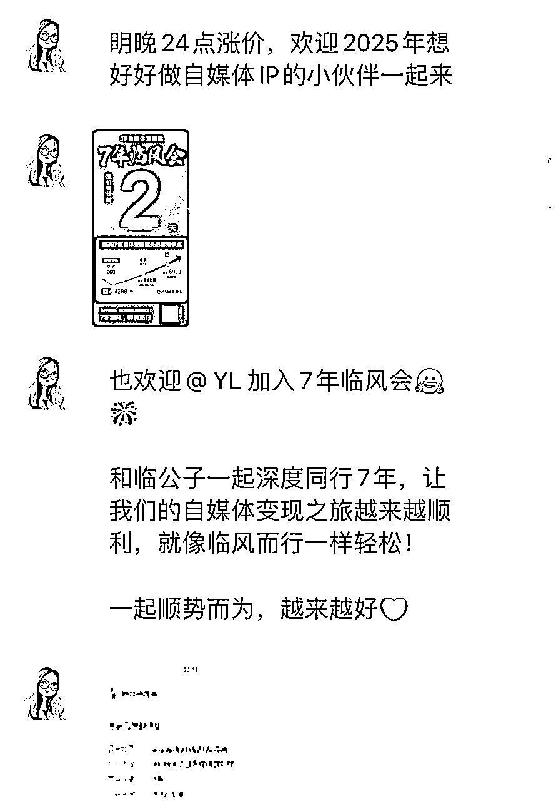

# 水龙|一人公司群发售SOP

> 来源：[https://ie5wfc519n.feishu.cn/docx/Hmp6dt97voG32ex6GgOcCGkrn4e](https://ie5wfc519n.feishu.cn/docx/Hmp6dt97voG32ex6GgOcCGkrn4e)

私域裂变是做自媒体的必备能力，过去一年，我通过十几场私域发售活动，私域从1000裂变到如今2万多，变现也有大几十万，可以说私域发售是IP要获得高变现的必备能力。

最近一对一咨询，关于发售咨询比较多，所以，我根据自己过往做活动的经验，总结一套可参考的标准发售模板，方便大家去设计自己的私域发售活动。

一套完整的产品发售流程，分为准备期、预热期、发售期，三个阶段，围绕不同的发售目标，我们可以进行相关环节的设计。

我以常见的公开课发售为例，给大家设计整套流程，其他类型的发售逻辑，都是一样的。

## 一、准备期：明确目标

### 1、课程海报设计

1.  海报文案参考模板（以水龙为例）

主标题：自媒体变现公开课

副标题：带你赚到自媒体的第一百块钱

讲师介绍：

自媒体IP成长教练

小报童平台付费订阅自媒体类目第一作者

自媒体带货年入100万+

课程时间：XX月XX号到XX月XX号每晚点

授课形式：

专属微信群直播教学。

课程安排：

第一天：

教你创建一个自己的知识付费产品，重点讲解小报童平台赚钱逻辑，带你全面熟悉小报童的所有功能

第二天：

学会分销赚钱，赚到自媒体的第一百块钱，带你解锁小报童分销实战高级玩法，通过分销激活自己的朋友圈和社群，实现做自媒体能有睡后收入。

第三天：

学会个人操盘发售，公开水龙通过小报童发售10天赚10万+的秘密，带你解锁小报童低客单发售逻辑，只用一招，快速提升自己的IP势能。

1.  海报设计

没设计预算或者比较着急，可以直接用稿定设计或其他在线设计平台，直接套模板设计出自己的课程海报。

有预算的，直接花钱请专业设计设计师设计出精美的课程海报。

* * *

### 2、群公告设计

1.  公开课邀新大佬群（直接写清楚奖励）

参考样板

感谢信任，欢迎加入大佬群，本次公开课完整奖励如下：

基础奖励：

邀请1个人进群 领取《订阅3500+，GMV超10万的保姆级小报童发售教程》PDF文件

邀请10个人进群 奖励自媒体专栏一份，可转赠

邀请30个进群 奖励价值199元的自媒体创业社群一个，可自卖或者续费一年

邀请50个人或以上进群 奖励价值399元的新个体俱乐部一个，可自卖或者续费一年

邀请榜奖励：

第一名 288元

第二名 188元

第三名 88元

前三名除了奖金之外将获得水龙公众号和朋友圈的名片推荐一次。

第6-10名 18.88元

1.  公开课课程群公告

欢迎来到由水龙主讲的《XXX实战变现》三天公开课👏👏

进群必知事项：

1、进群，必须添加群主微信，领取本次老师准备的教学专栏（免费领取），本次上课必用的，一定要去领取！

2、6月1号之前处于进人阶段，禁言，但可以自己邀请朋友进来一起学习，参与邀请的，老师额外准备了重磅福利。

邀请奖励：

邀请1个人进群 领取《订阅3500+，GMV超10万的保姆级小报童发售教程》PDF文件

邀请10个人进群 奖励自媒体专栏一份，可转赠

邀请30个进群 奖励价值199元的自媒体创业社群一个，可自卖或者续费一年

邀请50个人或以上进群 奖励价值399元的新个体俱乐部一个，可自卖或者续费一年

#邀新奖励加群主微信领取

——⏰公开课安排⏰——

6月1号晚8点：

讲透小报童赚钱逻辑，带你全面熟悉小报童的所有功能，带你学会创建一个自己的赚钱专栏

6月2号晚8点：

解锁小报童分销实战高级玩法，通过分销激活自己的朋友圈和社群，实现睡后收入，带你真正轻松赚到自媒体的第100块钱。

6月3号晚8点：

公开水龙小报童发售3500+订阅的秘密，带你解锁小报童低客单发售逻辑，只用一招，快速提升自己的IP势能。

上课形式：微信群直播

———🔔重要信息🔔———

1⃣ 保持群内得体的互动很重要哦~

2⃣ 保持群内不乱加不乱发的边界感也很重要~

同时，建议可以置顶本群，以免错过重要消息！！！

公开课直播#没有回放⏰，请大家珍惜此次机会。

要点：公开课的要点是引导裂变，获取私域，沉淀倒自己的微信上，追求长期转化价值

### 3、邀约嘉宾直播站台（非必须，有则更好）

1.  确定直播站台嘉宾

一般分享嘉宾是圈内知名人物，比自己势能更高的，可以从自己购买的高客单产品主理人选择，另外一种就是从自己的学员中成绩突出，效果明显的有限选择

1.  确定直播时间，分享主题，制作嘉宾海报

以我邀请洋哥为例：

获取信息之后，制作成嘉宾海报，方便给KOL进行朋友圈提前宣传（两张海报款式参考如下）

### 4、内容课件准备

1.  公众号销售信/IP短视频

个人IP故事的文章是必须写的，也可以制作十年体类型的短视频，主要目的是让进群人员，可以不限次地快速了解到主理人，加强信任。

1.  快速准备公开课干货内容分享

公开课课件第一种形式是可以从自己过往的付费课件提取部分内容进行分享，第二种形式，可以让自己成绩比较好的学员，进行一个故事干货经验分享，一般需要准备5到7篇分享稿。

1.  直播连麦和嘉宾高效互动技巧

和嘉宾连麦，要带入采访者的角色，向嘉宾提问题，提前了解嘉宾经历，准备好问题，避免临时尬场。

常用的提问结构：

1、嘉宾背景和经历

可以简单介绍一下你自己吗？让直播间的观众能够了解一下您。

有什么特殊的经历或者人影响你走上了目前这条道路，并且取到这个成绩？

在你的领域中，你认为最具挑战性的工作是什么？你是如何克服困难的？

能分享一些你在创业生涯中的重要经验或教训，特别想分享给观众的？

你是如何持续和发展自己的知识和技能的？是否有一些特别的技巧。

2、行业见解

你认为当前行业的主要趋势是什么？有那些正在变化的引起了你的注意？

你是如何看待当前市场和同行竞争的？

你对行业未来发展的趋势有那些预测，你认为未来会有那些重要的变化？

是否有一些你认为不被大众注意但很重要的行业问题，你愿意分享一下吗？

3、发展经验和成长动力

你是如何抓住每一次机会，实现个人跃迁的？

你追求成功的动力是什么？是什么激励你不断努力和追求卓越的？

你是如何设定长期和短期目标，以保持你的动力的？

是否有一些书或者资源对你影响很大，是特别想分享给观众的？

你有没有关于激励和动力的座右铭是特别想分享给观众的？

……

### 5、常用辅助的助理角色

1.  靠谱有耐心的人，帮你建群，分配群

群二维码发给邀新的KOL（记得提前做好KOL拉群指引），发群二维码给KOL

建群之后，要设置好群名、群公告、设置群管理员、禁止群名称、群昵称（避免进群的人乱改群名）

可用微友群活码，设置：不可重复进群（需要会员，自己看是否需要）

建立社群、管理社群（禁言）、收集素材、发放奖励等

1.  水军，给你带动分销气氛以及维护社群整体环境

水军一般是从你的社群、你的合伙人、平时跟你关系好挑出来的，他们可以给帮你引导问答，提问准备好问题

1.  福利官，核对邀约人数，形成排行榜、发放奖励

### 6、文案和海报准备

1.  收集朋友圈发圈文案

可以通过红包奖励的方式刺激KOL将自己写得比较好的文案发到分销群里，刺激其他KOL也进行发圈动作。

1.  提前准备学员加入海报（营造成交气氛）

1.  涨价倒计时海报（参考）

## 二、预热期：造势蓄力

### 1、私域流量激活

*   原有社群裂变：可以让自己原有的社群进入KOL群，快速拉新和裂变。

*   1对1私聊邀约：针对潜在用户发送个性化邀请，一定要私聊邀请，别直接群发（如“看到你经常XXX，这次公开课有xx福利别错过”）。

*   朋友圈宣传邀约：可以在朋友圈邀请KOL和公开课用户，邀请群用户的。（邀请公开课要用短文案）

### 2、悬念制造

*   倒计时海报：每天释放课程亮点（如“揭秘百万大V的写作心法”）。

*   直播预告：提前预告公开课时间，强调“限时免费”或“仅开放XXXX名额”。

* * *

## 三、发售期：转化逼单

以临公子的公开课发售为例：

### 1、社群氛围营造

*   开群引导：领资料+V，沉淀私域

*   广告制止：不和用户发生冲突，但要保证社群整体良好环境。

*   预告分享：让用户提前了解内容，制造用户期待和拉场观。

*   答疑解惑：回答用户问题的干货同步分享社群，展示主理人专业能力，加强信任。

*   讲解产品：嘉宾一轮分享结束以后，可以推出自己要转化的产品的介绍。

### 2、社群转化成交

*   晒单成交：晒购买截图，刺激潜在用户购买欲望。

*   嘉宾限时赠品：通过展示不同嘉宾限时赠品，刺激下单。

*   学员接龙：鼓励已报名学员在群内接龙，制造从众效应。

*   实时答疑：团队在群内快速响应问题，打消顾虑（如“课程是否适合小白？”）。

*   限时促销：倒计时+名额递减（如“最后1小时！还剩15个早鸟名额”）。

### 3、私域追单

*   针对犹豫用户：可以发送专属优惠券或1对1语音沟通，解决个性化问题。

*   朋友圈刷屏：团队统一发布学员好评、报名盛况截图，强化信任。

* * *

### 最后关键提醒：

*   信任是核心：避免过度营销，用真实案例和专业度打动用户。

*   紧迫感设计：限时、限量、专属福利缺一不可。

*   闭环思维：从吸引到交付，每个环节都要为下一阶段铺垫。