# Youtube低成本24小时直播间脚本

> 来源：[https://hol8i53djq.feishu.cn/docx/IXSudQaXZo8b2fxXSgBcSZCMnLe](https://hol8i53djq.feishu.cn/docx/IXSudQaXZo8b2fxXSgBcSZCMnLe)

# YouTube直播收益

YouTube shorts播放量包括推荐量呢，都是非常的牛皮，但是呢，大家有没有发现一个问题就是单价普遍来说比较低，并且呢经常会跑到印度。我从YouTube starts之后呢也开始做短视频当然短视频长视频就是横版的那种长视频也在做，有的号推荐量起来之后呢就可以开直播了，开直播呢第1种我想使用的办法呢，星球里边已经有小伙伴分享了，就是在本地电脑上面安装obs，然后直接推流进行直播。这种方式虽然简单。但是呢，你的机场流量要足够，如果购买机场一个月就几百个G的话，大概可以撑个一天两天。第1天时测了一下，播了一下午，大概用了300个g的机场流量。所以这种还是不划算的，最方便的就是购买一个海外服务器，不限流量的那种。配置不需要太高，一个g的内存，甚至一个核心就够用。


目前测试下来的直播收益还不错，千次0.7。这个单价呢，是以横版长视频直播的单价。如果是竖版视频，可能没有这么高。竖版视频的单价目前我这边还没有出来，等出来之后补上。

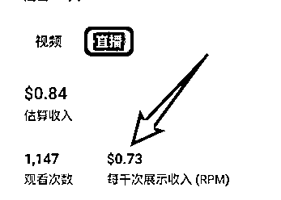

这几个月呢，先后又开通了两三个号的YPP，视频推流起来真的是超级牛量也是上得非常快，那这个时候呢，就建议大家直接开直播了。开直播的形式呢非常简单，把你之前的视频，然后如果是短视频的话，就拼成一个长视频，大概拼成一个小时左右的视频，其实就可以24小时直播了，当然这个视频的长短的你个人来定。

# 直播教程开始

## 1.购买海外服务器

第1步呢，就是你需要有一个海外的服务器，哪个国家都可以，那我这边呢是选择了一个比较小众的云服务器莱卡云-。我这边选择是一个美国的服务器，两个核心一个g的内存流量没有说限制。

当然你选择哪一个云服务器商的都是没有任何问题的，因为我之前在莱卡云注册过，他的支付方式也比较简单，微信支付宝都可以，你像海外有一些vps是需要用海外信用卡的，很多人可能都没有。

莱卡云官网-优秀云计算服务提供商

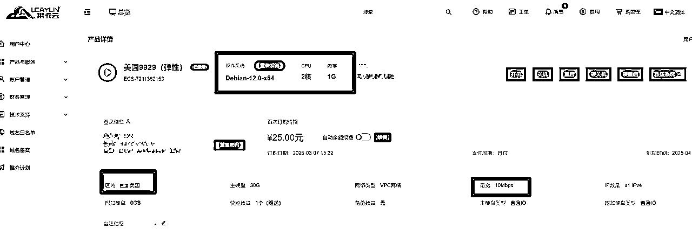

当然选择其他，比如说香港的韩国的都是可以的。

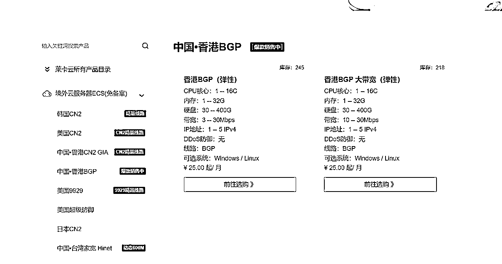

## 第2步能用到一些脚本。

同时呢，你要会用ai工具，比如说豆包Kimi deepseek。在你搭建的过程中遇到任何问题，可以快速的帮你解决。

这个脚本呢，作者也有一个网站，大家可以点击进去，也是写的非常详细，但是有一些地方呢，要根据你自己选择的服务器要做一些调整。

FFmpeg循环推流脚本lala.im

还需要用到一些电脑的ssh的工具，我这边呢使用的windows的是Mobaxterm.这个软件呢，大家也可以搜索到，我这边呢提供了一个绿色免费版。

软件链接：https://pan.quark.cn/s/a7c1d5dcce6c

搭建过程呢，其实非常简单。第1步呢，ssh登陆服务器，

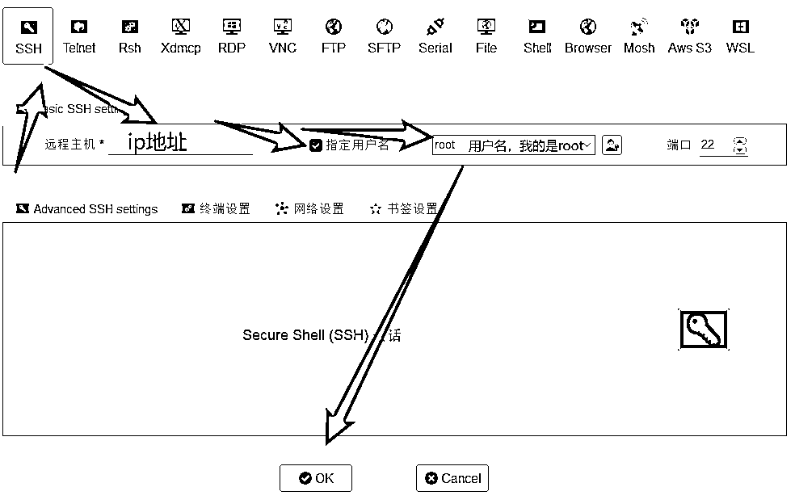

进入之后呢，左边就会显示你服务器所有的文件默认的话它进入的是root目录，

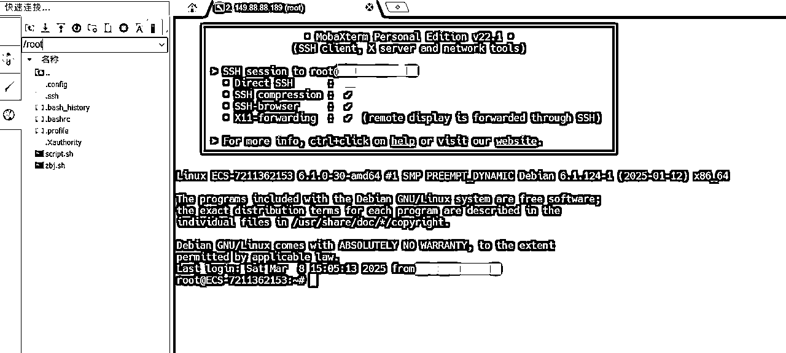

我们把root删除掉，按回车就可以进入vps的主目录，就可以看到有一个home。

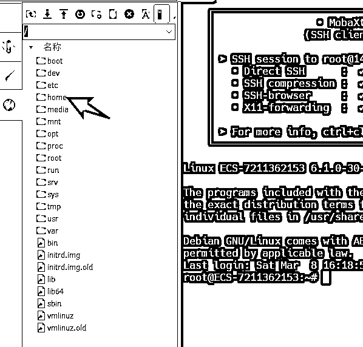

我们双击后在里边创建一个文件夹，名字随意。我这里就随便写了一个xh（循环的意思）


在新建的文件夹xh的目录下面，再创建一个文件夹，我创建的名字是video。当然这个名字也是你自己随意可以起名字的。用于放你要循环24小时播放的视频。


而video文件夹里边就是要放你想要24小时直播的视频，这个视频呢，你可以一个一个上传，它会按照顺序一个一个的来循环播放，进行推流24小时直播那我这边测试了一下我买的这个服务器他只能带得动720分辨率的视频，1080p的话，cpu占用和内存占用比较高。

上传视频的话，直接点击上传的这个图标，选择我们的视频，它就可以直接上传到我们的服务器里边了，上传可能会慢一点，所以一次文件不要太大，大概两2-3g的话是可以的，大的话可能它中间会中断。

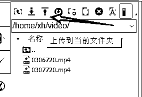

以上的这些准备工作呢就准备完了，下面呢就开始脚本搭建了。

# 3.脚本搭建。

搭建的时候呢，最好你把。作者给你提供的那个脚本发给ai同时也把你vps是的系统也发给ai。然后让他做一个调整，这样的话就更简单一点。

脚本原作者 FFmpeg循环推流脚本lala.im 就是黑框框的那一部分，从头复制到尾发给ai。

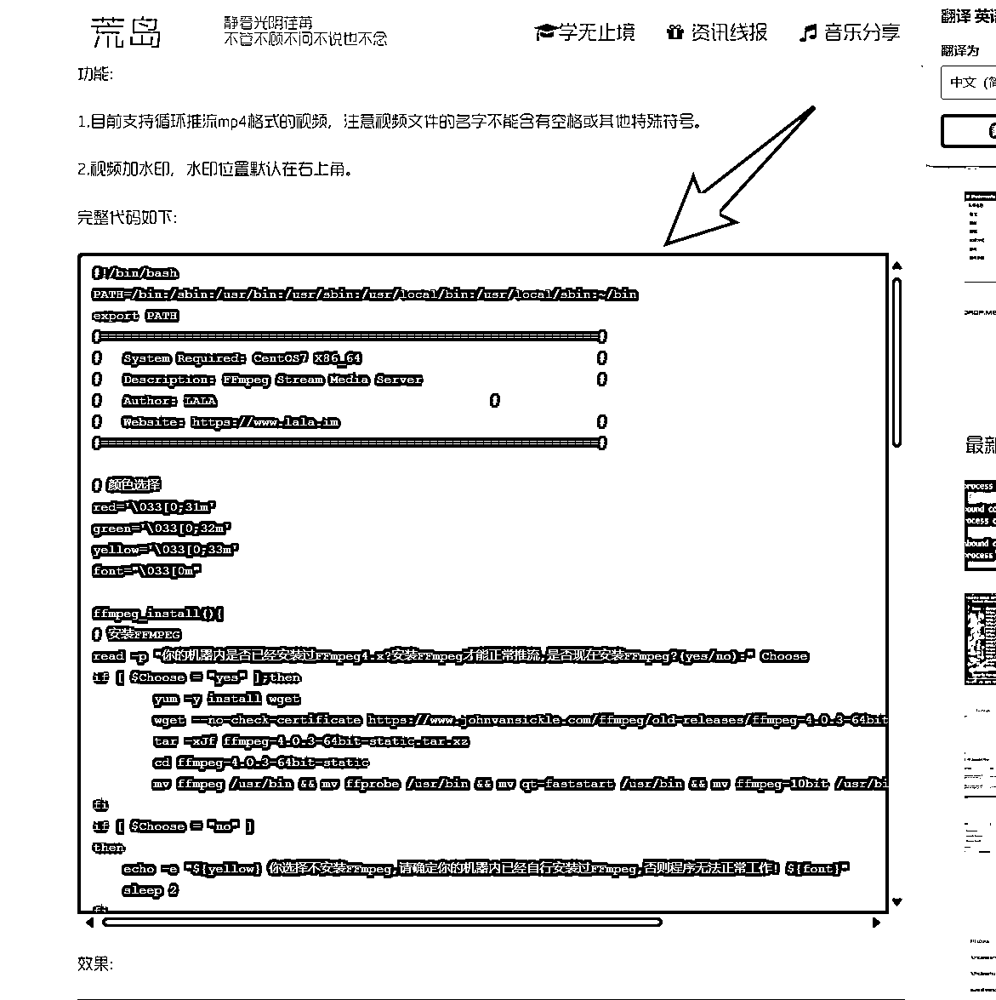

这样ai会根据你vps的系统版本，然后进行一个调整。会一步一步的告诉你怎么做，我用的是deep seek。

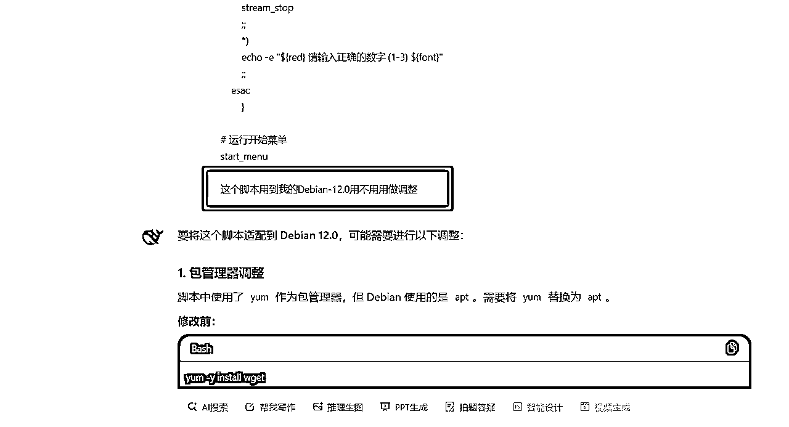

### 其实呢就需要安装两个工具，一个是screen，第2个是FFmpeg

Ai会直接告诉你运行哪些代码，你直接复制下来，粘贴到代码区

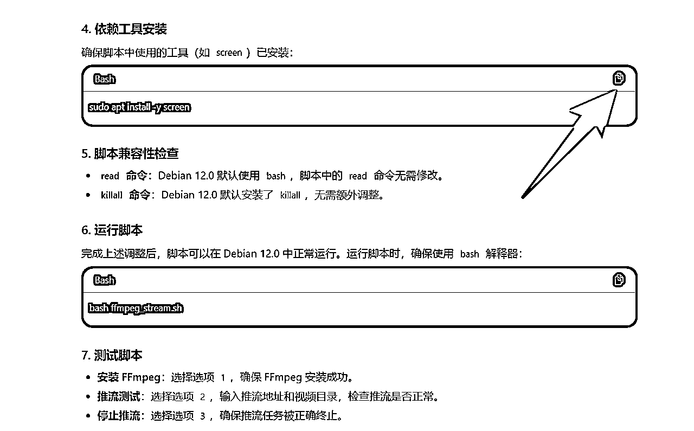

就是复制，然后粘贴进来按回车。之后的话这个区域会进行跑码下载一些东西，不用管他。

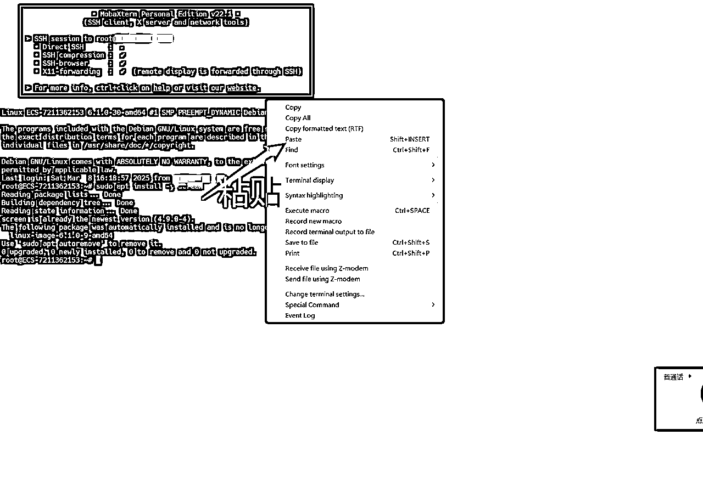

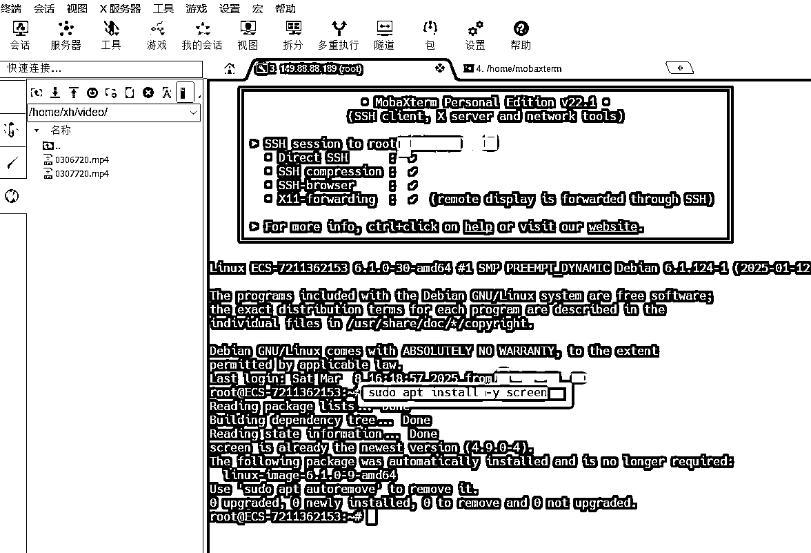

安装过程中出错了，你就直接复制，发给ai ai就会告诉你如何去调整，

下面说一下搭建的过程，

#### 第1步呢就是创建一个新的屏幕，

创建完这个之后呢，它相当于是24小时开机的一个小屏幕，保证直播要一直在线，复制代码粘贴 按回车键

```
screen -S stream
```


#### 第2步然后我们cd到我们创建的第1个文件夹我这边的是xh。

```
cd /home/xh   #xh是你自己前面创建的文件夹名字 我的是xh
```


#### 第3步安装脚本

复制 ai调整过的那个代码。或者是如果你用的服务器或者是也用的Debian-12.0-x64的话，也可以复制我的现成的代码都是可以直接用的。

图片里面的这个代码就是我让ai给我调整过的，

（优化版））

```
#!/bin/bash
PATH=/bin:/sbin:/usr/bin:/usr/sbin:/usr/local/bin:/usr/local/sbin:~/bin
export PATH

# 颜色定义
red='\033[0;31m'
green='\033[0;32m'
yellow='\033[0;33m'
font="\033[0m"

ffmpeg_install(){
    echo -e "${yellow}Checking FFmpeg installation...${font}"
    if ! command -v ffmpeg &> /dev/null; then
        echo -e "${green}Installing FFmpeg...${font}"
        sudo apt update
        sudo apt install -y ffmpeg
        echo -e "${green}FFmpeg installed!${font}"
    else
        echo -e "${yellow}FFmpeg already installed${font}"
    fi
}

stream_start(){
    # 推流参数验证
    read -p "输入RTMP推流地址 (rtmp://): " rtmp
    if [[ ! $rtmp =~ ^rtmp:// ]]; then
        echo -e "${red}地址必须以rtmp://开头${font}"
        exit 1
    fi

    read -p "输入视频目录 (绝对路径): " folder
    if [ ! -d "$folder" ]; then
        echo -e "${red}目录不存在${font}"
        exit 1
    fi

    # 编码参数配置
    frame_rate=24  # 根据实际视频设置
    GOP=$(( frame_rate * 2 ))  # 2秒关键帧间隔

    video_params=(
        -c:v libx264
        -b:v 2500k
        -maxrate 2500k
        -bufsize 5000k
        -preset veryfast
        -tune zerolatency
        -g $GOP
        -r $frame_rate
        -x264-params "nal-hrd=cbr:force-cfr=1:keyint=$GOP:min-keyint=$GOP"
    )

    audio_params=(
        -c:a aac
        -b:a 128k
        -strict -2
        -ar 44100
    )

    # 水印处理
    read -p "添加水印? (yes/no): " watermark
    if [ "$watermark" = "yes" ]; then
        read -p "水印图片路径: " image
        if [ ! -f "$image" ]; then
            echo -e "${red}水印文件不存在${font}"
            exit 1
        fi
        filter="-filter_complex overlay=W-w-30:30"
    fi

    echo -e "${green}推流启动中... ${yellow}(Ctrl+C 停止)${font}"

    while true; do
        for video in "$folder"/*.mp4; do
            [ ! -f "$video" ] && continue

            # 构建命令
            cmd=(ffmpeg -re -i "$video")
            [ "$watermark" = "yes" ] && cmd+=(-i "$image" $filter)
            cmd+=(
                "${video_params[@]}"
                "${audio_params[@]}"
                -f flv "$rtmp"
            )

            echo -e "${yellow}推送: $(basename "$video")${font}"
            "${cmd[@]}" || break
        done
    done
}

stream_stop(){
    pkill -f "ffmpeg.*rtmp"
    echo -e "${yellow}已终止推流进程${font}"
}

# 主菜单
main_menu(){
    clear
    echo -e "${yellow}=== FFmpeg直播控制中心 ==="
    echo "1\. 安装FFmpeg"
    echo "2\. 开始推流"
    echo "3\. 停止推流"
    echo "4\. 退出"
    read -p "选择操作 (1-4): " choice

    case $choice in
        1) ffmpeg_install ;;
        2) stream_start ;;
        3) stream_stop ;;
        4) exit 0 ;;
        *) echo -e "${red}无效选项${font}"; sleep 1; main_menu ;;
    esac
}

main_menu
```

可以复制版本，https://www.wenxiaobai.com/share/chat/89f3642a-f351-4b49-b030-880effed3227

```
#!/bin/bash
PATH=/bin:/sbin:/usr/bin:/usr/sbin:/usr/local/bin:/usr/local/sbin:~/bin
export PATH
#=================================================================#
#   System Required: Debian 12.0                                  #
#   Description: FFmpeg Stream Media Server                       #
#   Author: LALA                                    #
#   Website: https://www.lala.im                                  #
#=================================================================#

# 颜色选择
red='\033[0;31m'
green='\033[0;32m'
yellow='\033[0;33m'
font="\033[0m"

ffmpeg_install(){
    read -p "你的机器内是否已经安装过FFmpeg4.x?安装FFmpeg才能正常推流,是否现在安装FFmpeg?(yes/no):" Choose
    if [ $Choose = "yes" ];then
        sudo apt update
        sudo apt install -y ffmpeg
    fi
    if [ $Choose = "no" ]
    then
        echo -e "${yellow} 你选择不安装FFmpeg,请确定你的机器内已经自行安装过FFmpeg,否则程序无法正常工作! ${font}"
        sleep 2
    fi
}

stream_start(){
    read -p "输入你的推流地址和推流码(rtmp协议):" rtmp
    if [[ $rtmp =~ "rtmp://" ]];then
        echo -e "${green} 推流地址输入正确,程序将进行下一步操作. ${font}"
        sleep 2
    else  
        echo -e "${red} 你输入的地址不合法,请重新运行程序并输入! ${font}"
        exit 1
    fi 

    read -p "输入你的视频存放目录 (格式仅支持mp4,并且要绝对路径,例如/opt/video):" folder
    read -p "是否需要为视频添加水印?水印位置默认在右上方,需要较好CPU支持(yes/no):" watermark
    if [ $watermark = "yes" ];then
        read -p "输入你的水印图片存放绝对路径,例如/opt/image/watermark.jpg (格式支持jpg/png/bmp):" image
        echo -e "${yellow} 添加水印完成,程序将开始推流. ${font}"
        while true
        do
            cd $folder
            for video in $(ls *.mp4)
            do
                ffmpeg -re -i "$video" -i "$image" -filter_complex overlay=W-w-5:5 -c:v libx264 -c:a aac -b:a 192k -strict -2 -f flv ${rtmp}
            done
        done
    fi
    if [ $watermark = "no" ]
    then
        echo -e "${yellow} 你选择不添加水印,程序将开始推流. ${font}"
        while true
        do
            cd $folder
            for video in $(ls *.mp4)
            do
                ffmpeg -re -i "$video" -c:v copy -c:a aac -b:a 192k -strict -2 -f flv ${rtmp}
            done
        done
    fi
}

stream_stop(){
    screen -S stream -X quit
    killall ffmpeg
}

echo -e "${yellow} Debian 12.0 FFmpeg无人值守循环推流 For LALA.IM ${font}"
echo -e "${red} 请确定此脚本目前是在screen窗口内运行的! ${font}"
echo -e "${green} 1.安装FFmpeg (机器要安装FFmpeg才能正常推流) ${font}"
echo -e "${green} 2.开始无人值守循环推流 ${font}"
echo -e "${green} 3.停止推流 ${font}"
start_menu(){
    read -p "请输入数字(1-3),选择你要进行的操作:" num
    case "$num" in
        1)
        ffmpeg_install
        ;;
        2)
        stream_start
        ;;
        3)
        stream_stop
        ;;
        *)
        echo -e "${red} 请输入正确的数字 (1-3) ${font}"
        ;;
    esac
}

start_menu
```

复制完这个代码之后呢，直接粘贴到代码区域，按回车就行。

代码最下方的显示的非常详细，第1步，他说必须要在一个新的screen里边，第2步你要安装ffmpeg。这个的，因为我们前面都已经安装过了。没有安装的话，你按照它的提示安装一下，它这个脚本里边也是自带一个 ffmpeg的安装的，如果没有有安装按1。


因为我前面已经安装过了，所以这边呢就不需要了，我就输入2，回车，


然后我们就去找我们油管的Rtmp协议的网址和密钥。在油管右上方点击创建，然后再点击开始直播，我们就可以看到有一个直播网址和直播码，直播网址我们复制下来 ，这个油管的网址应该都是一样的，重要的是这个直播码是每个直播间的唯一的代码，也不要泄露。


复制好以后呢，改成下方的格式，这种直播方式呢，不只是可以用于油管，包括b站等等，只要你能拿到直播网址和直播码的这些平台只要允许这种以素材形式直播的方式的平台，都是可以用的。

```
rtmp://x.rtmp.youtube.com/live2/XXX-XXX  #后面的XXX-XXX。就是你的直播码。直播网址跟直播码中间有一个斜杠。
```

之后呢，把我们做好的这个格式的直播地址和直播码的粘贴到我们的代码区域。


粘贴之后按回车它会让你输入以视频存放的位置，这个视频存放的位置呢，我们在之前就已经创建好了。

```
/home/xh/video  #根据你自己的视频文件目录填写。
```

然后我把这个目录也粘贴到代码区域，按回车，如果这一切配置正常的话，你就可以看到，已经开始推流直播了。

此时你就可以关闭你现在电脑上的ssh的工具也没有关系，直播是不会断的。

当然也有可能到这一步的话会报错，你把报错的内容发给ai，然后ai会告诉你具体的怎么去做。

开了一个直播之后，我发现我买的这个服务器cpu只占用了4%，内存只占用了0.2 g, 如果你想多开几个直播的话，后面我再研究一下看怎么搞。


# 总结

预祝大家都可以在油管呢拿到一桶金，总体来说我目前这几个月开通的账号大概就是一个月左右开通的，当然也有一些废号，背后呢就是你更新了好多个视频之后呢，发现它的播放量都很一般，好像没有推流的意思，那。这个时候呢，这些号呢，有的就被遗弃了，所以。嗯总体来说也跟运气有关，或者说跟你号的体质有关。只要能开通vip的，只要推流比较大的，就可以大胆的去开直播，希望呢这个直播教程可以给到大家一些帮助。