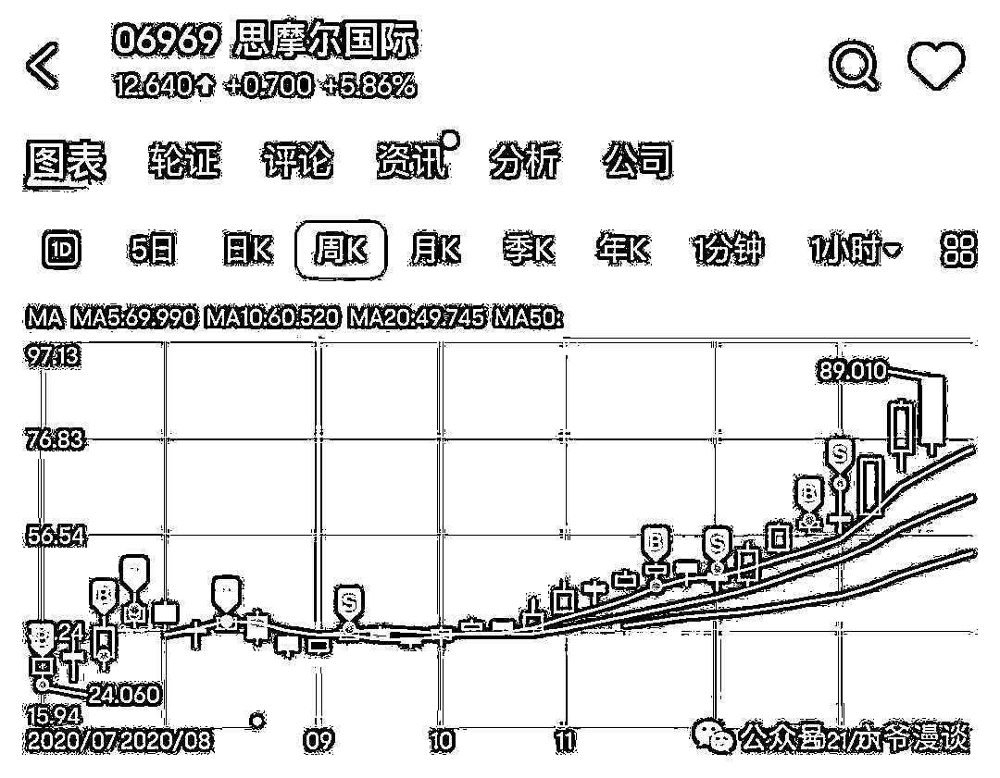
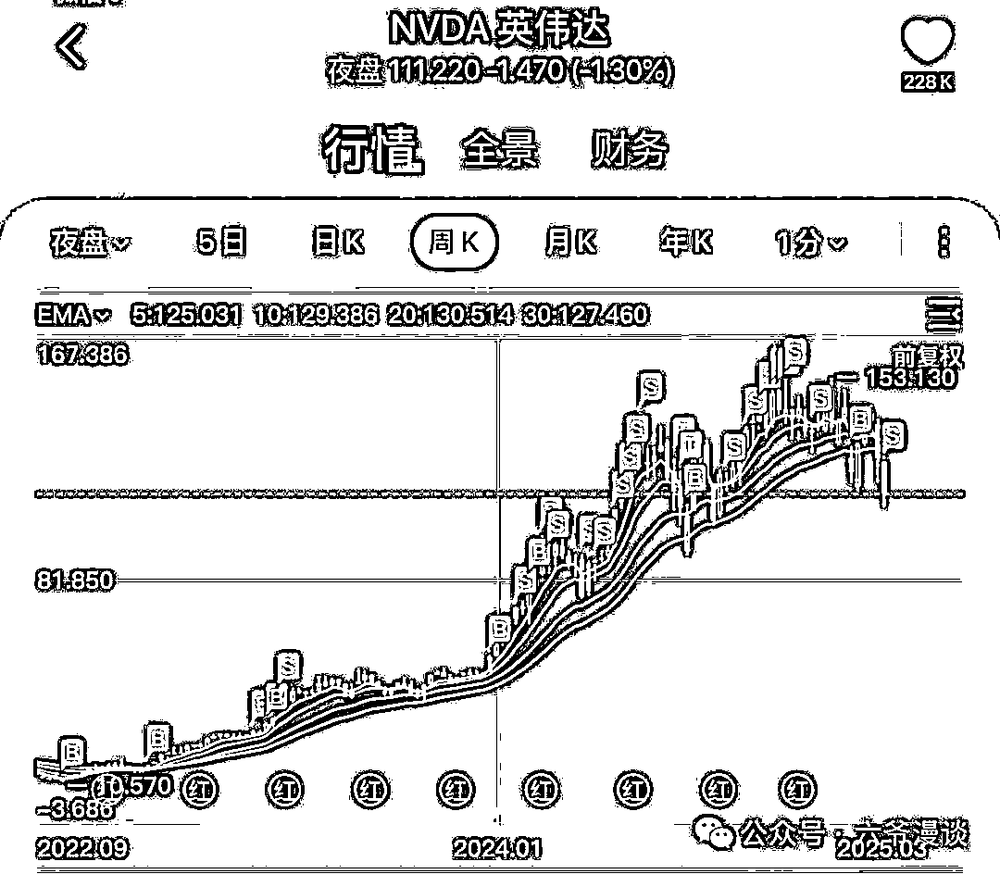

# 赚到千万后，我们应该干些什么？

> 来源：[https://w14d2rljqk.feishu.cn/docx/IkL3dLSeEoIKafxjZRPcAGqknke](https://w14d2rljqk.feishu.cn/docx/IkL3dLSeEoIKafxjZRPcAGqknke)

上上周五听闻拼多多前同事买彩票爆赚600万后果断离职，无独有偶，上周五又听闻腾讯前同事离职贴说赚到两千万。

这些还蛮刺激打工人神经的，毕竟一夜暴富这种故事发生在身边，很难不羡慕嫉妒恨啊。

文章最后再聊怎么赚到千万。

作为过来人，更想聊聊赚到千万后，应该干些什么。

暴富后会面临非常多重要的人生决策，提供一些思路供大家参考借鉴。

1，保住胜利果实。

毫无疑问这个肯定是最重要的，这些年我见过了很多很多一轮游的，从几十到上千万，甚至几千万，最后又全部亏回去。

凭运气赚来的钱，最后都凭实力亏回去。

及时落袋为安非常重要。

2，保持冷静，不要冲动。

别飘，千万别飘！不要冲动，多给自己一些时间冷静思考。

3，要不要离职/脱产

这个是取决于你的现在是什么工作，如果是一份年薪还不错的大厂工作，我觉得可以不离职。

如果回到20年，让我再选一次，我应该会留大厂继续卷，当然投资也不会落下。

裸辞后，经历了一波熊市，回撤不少，这轮牛市确实有些畏手畏脚。

稳定的收入来源是你投资上敢打敢拼的底气。

而且社会认同很大程度是来源于职业身份，灵活就业其实不是很受待见。

最后就是不上班，可能会失去目标和节奏，工作日也很难找到朋友一起玩耍，一个人待着容易空虚、甚至抑郁。

还是得给自己找个事干。

比如我，还是保持一定的更新文章频率，也有一批社群朋友。

4，要不要买房

这个要看在哪个城市，如果是二三线，花个300、400W能买到很不错甚至市中心的房子了。

一线的话，千万还是有些不够看。

郊区远大新都700多W，市区老破小300多W，核心地段老破小都500、600W，而市区不错的次新都得800W+了。

花一部分钱，毫无压力同时也不降低生活品质的话，其实可以考虑。

上次聊买房还是24年年初，当时让大家《再等一等》。

现在可以看起来了，现在房价算是相对低位。

但是买房+辞职后剩余资金不多，那真没必要买。

房子的投资回报并不高，租售比能有2%的都算高的了，而且房价也很难再有前些年几倍的涨幅。

所以租房其实会更划算，利息都能cover住租金了。

5，以后怎么做投资

还是看这次投资成功路径以后是否有可复制性。

虽然路径依赖容易形成经验主义，但是在熟悉的领域继续深耕，会更得心应手。

比如通过抓住十倍股赚了一波大的，那继续寻找下一个十倍股即可。

但是如果是通过高杠杆大赚了一波，我个人还是建议切换到更稳定的投资风格上。

毕竟常在河边走，哪能不湿鞋。

6，要不要消费升级？

适当的贪图享乐还是可以的，多去体验，把自己以前买不起、住不起、消费不起的都去体验体验。

不过很多体验完之后，你可能会发现，好像也就这样。

我就是这种感觉，可能这就是山猪吃不了细糠，也可能是祛魅了，毕竟祛魅的最好方式就是拥有。

7，要不要让家里人/亲戚知道

当然是不让他们知道了，暴富还是很让人嫉妒的啊！

同时也避免面临七大姑八大姨的各种理由的借钱以及不借钱被道德绑架，被指责"忘本"、"冷血"。

# 聊聊怎么赚到大钱。

大家可能更感兴趣这个。

这些方式是基于我私人微信几万大厂员工的经历，以及我的观察来总结的，具有一定局限性，不一定适用所有人，毕竟这些人已经是最优秀的一批人了。

1，买彩票

虽然这也是一种方式，但是概率是千万分之几，我觉得完全没有可复制性。

2，创业

前些年可能还容易一些，这几年难度很大。

这块我自己也翻过一些跟头，比如23年做了相亲小程序，凉凉。23年底做的AI网站，虽然上车早，但是最后还是迫于各种压力，下线了。

也认识不少创业大佬，不过成功的屈指可数。

3，自媒体

自媒体还是相对算是比较容易点，不少跟我一届(16年毕业)，甚至比我小几届的朋友已经是百万大V了(抖音、B站)。

只要你敢于在互联网上表达自己，能忍受一些不和谐的声音，坚持下来并不断改进，还是很大概率能获得一批粉丝的。

4，投资-港股/中概股

中概股过去两年非常惨，很多中概股先是翻了十倍，然后脚斩，回到起点。

比如B站从十几块涨到150多，又跌回10块不到。 很多人牛市亏钱，还是底部不敢买，高位不断追高。

而那些基本面改善，焕发第二春，重新受到资本追捧的股票都有几倍的涨幅。

比如小米，21-23年从36跌到了8块，又从8块涨到了58.7块，7倍的涨幅。

又比如泡泡玛特(10倍)、阿里(一个月50%)、老铺黄金(15倍)、毛戈平(2倍)。

这些中概股我身边都不少朋友参与其中获利，比如星球群大佬靠泡泡玛特赚了上百万、另外个大佬靠小米赚了几百、群主靠毛戈平赚了上百万、买房群大佬靠阿里赚到了2KW。

5，投资-美股

抓住美股这波牛市，也赚不少。十几倍的英伟达、将近8倍的meta(Facebook)、纳斯达克都几十的涨幅。

6，投资-web3

web3财富效应更夸张，比如腾讯应届生就是靠特朗普币赚到了2KW。

不过这种机会还是比较难抓住的。

相对比较容易的是大饼，24年年初3W，最高到过快11W，现在8W多，依旧有一倍多的涨幅。

但是资本市场是非常残酷的，财富不会凭空产生，只会转移。

币圈每个暴富的背后是无数人的爆仓。

7，靠员工期权暴富

有不少朋友靠期权实现暴富，比如拼多多、虾皮、英伟达的员工，他们很早就加入了这些公司，拿了不少期权，跟着公司成长，最终暴富。

工作年限久，拿的期权可能更多些。

像一些外企比如英伟达，应届入职也持股，认识好几个应届英伟达的朋友，年纪轻轻就大几百万资产了。

想通过这个路径实现暴富，还是需要一定眼光的。

多数公司上不了市，期权终究只是一张废纸。

8，在大厂打工

这个应该是最容易的方式了，跟我一届的很多小伙伴，靠着自己的不断努力，成为组里的骨干甚至是组长、总监。

现在也是年薪大几百万了。

所以大厂工作这个方式，我觉得依旧是非常好的实现财富跃迁的方式。

说了这么多，都是一些我自己的想法，不一定对，希望能够对大家有所启发。

关于投资的一些思考，并不是让大家现在去买股票，投资风险还是非常高的，一定要谨慎再谨慎！

最后赚钱不应该是人生的唯一目标，有钱没钱不都一样过么，选择自己想要的即可。

欢迎关注，一起交流。