# 7天把亦仁发的风向标跑通了，赚了1000块

> 来源：[https://sxdb3vfjo5y.feishu.cn/docx/JFUvdicv1ovQPgxhqlGcM108n2e](https://sxdb3vfjo5y.feishu.cn/docx/JFUvdicv1ovQPgxhqlGcM108n2e)

爆款视频手绘漫剪这个项目，最早是上个月底听我媳妇说起的，她刷到后觉得挺喜欢，也比较看好，想业余时间没事做一做。

后来看到亦仁发了风向标，我也开始尝试，7天跑通有了1000+的变现，接下来给大家分享一下操作这个项目的一些过程，还有外面399课程都没有的思路和技巧。

# 项目实操过程

刚开始我媳妇说的时候，我没在意，她自己折腾了几天，发了10来个视频，小爆了一个，涨够100粉开通了创作者分成，但是收益很少，最多一天只有几块钱，还时不时因为去重不到位掉原创，掉广告。

后来看到生财，亦仁老大竟然发了这个风向标，我还跑去跟我媳妇开玩笑说：你跟生财的老板有同样的眼光呀！

因为得到亦仁的认可，我决定也研究一下这个项目，发现不用花太多时间，一个视频也就是20分钟就能搞定，就开始陪我媳妇一起做。

12号我发了第一个视频，就爆了100万播放，没收益，因为新号没开广告分成。

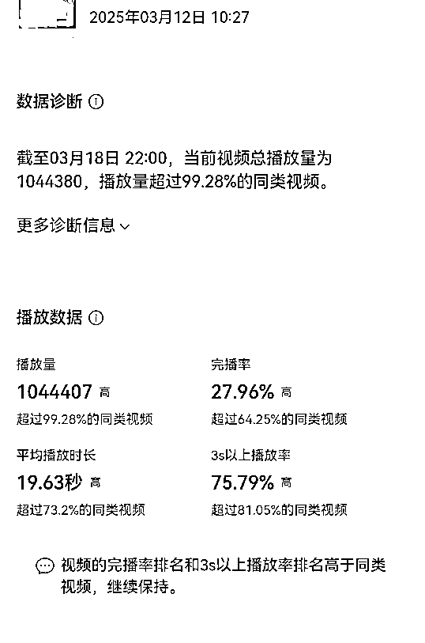

但是成功起号了，靠这条视频就涨了1000+粉，为了尽快开通广告功能，当天我陆续又发了三四个。

本来视频号是需要发够10个视频才能开通创作者分成的，但如果你的作品原创度好比较优质涨粉快的话，它可能会提前邀请你加入。

所以第二天我就开通了创作者分成。

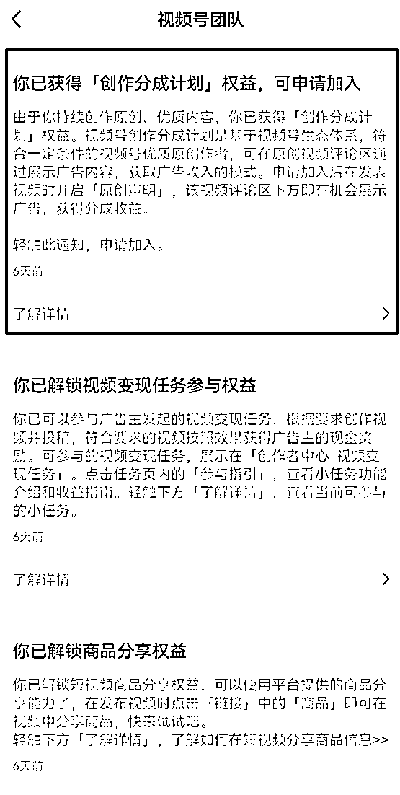

后续每天抽半小时左右做一两个视频，中间也有原创审核不过，掉广告等等小情况，也在持续优化创作过程。

第四天，出了一条大爆款，一天跑了1000多万播放，10万+赞，单天涨了1万粉。

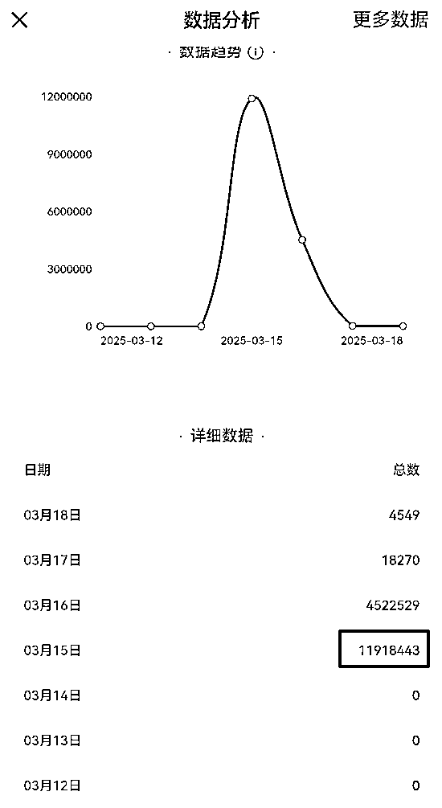

还没等高兴太早，第一个坑出现了。

晚上看账号爆了，刚想说这条终于有广告的时候，发现视频号官方弹出了出镜人提示。

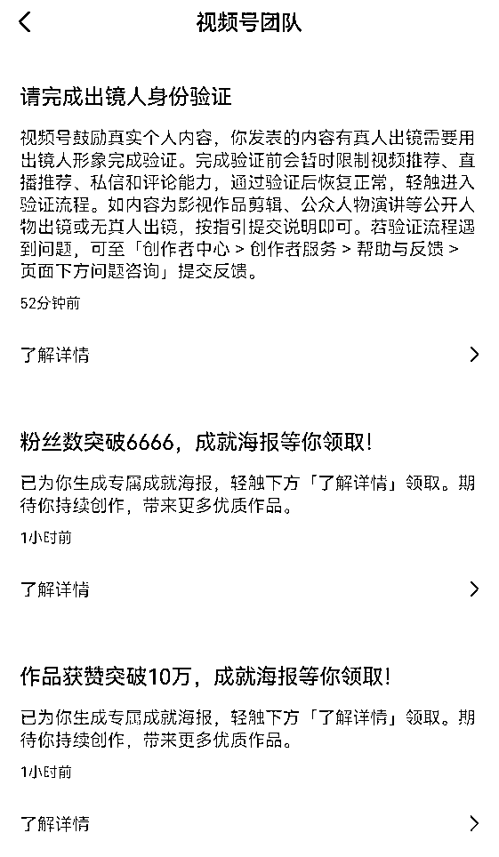

因为我之前做过视频号带货，身份证都已经被实名了，一个身份证最多只能实名2个视频号。

所以这个号就没有实名，开通创作者的时候也没要求实名。

但一旦剪辑的视频里有别人的真人出镜画面，在爆了以后就很容易弹出镜人身份验证。

找了很多方法，还扒了一下生财往期的视频号分成计划手册，把能找到的方法挨个都尝试了一下。

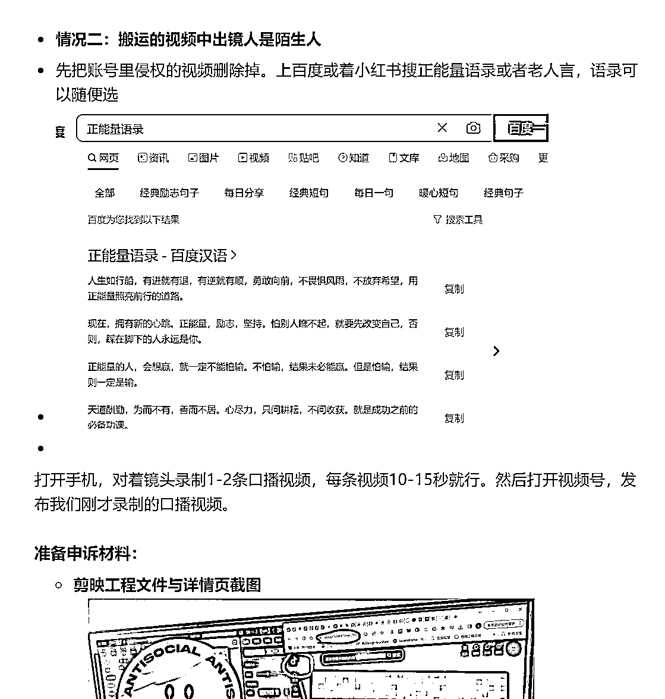

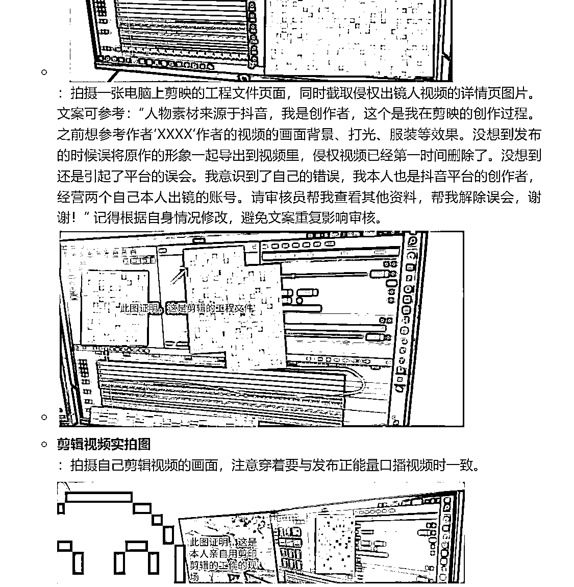

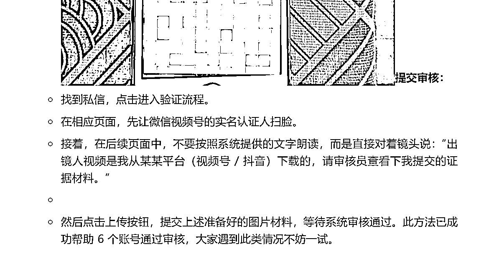

没辙，解决不了，基本都是过时的方法了，审核全都给我打回了。

系统已经记录了那个出镜人的视频，即使把视频删除，在验证的时候仍然要求按照那个视频出镜人来拍视频验证。

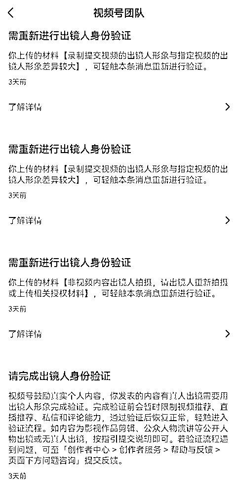

这个验证过不了，账号的所有收入权益也都被取消了，被打入冷宫30天。

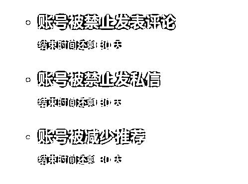

那条爆款的广告也不知道什么时候掉的，虽然违规后还一直在爆，但是没广告也就没收益了。

最终收益只有300+，通过后面的比例计算，大概只算到七八百万播放的收益吧，至少有一半是浪费掉的。

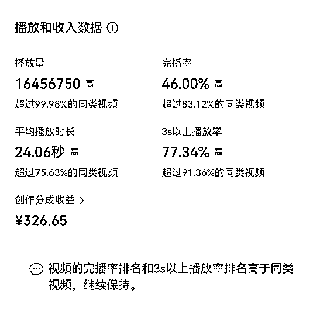

这期间，我又找了一个做视频号其他赛道的朋友咨询了一下，也是没有办法，如果不是自己认识的人出镜，基本上出来提示就废了。

只能等30天违规到期之后，看看能不能恢复了，不然只能注销账号。

有第一个爆款的时候，我又起了一个新号，也是发了两个视频，就爆了。

很快满了100粉，但因为10条视频卡着暂时开不了创作者分成。

这时候我就打算投机取巧一下，用第一个账号给这个小号开授权，发非原创快速起号。

因为我刷了一些同行，发现新号即使不标原创，也是有流量扶持的，很容易爆。

所以这样可以做一份视频发在两个号上，然后等那个号够10条标准了，开通了创作者，再给它做原创，可以节省时间。

果然，这样又发了2条原创，三四条非原创（拿之前发过的视频发的），账号就被邀请开通创作者分成了。

这一次赶紧找家人的身份证实名上了。

结果第二天，视频号又预判了我的小技俩。

提示因为作品原创度不够，暂时把创作者分成功能关闭了，需要再发布10条原创优质作品，才能再开通。

对，授权了也不行，只能再单独给这个账号做新的视频了。

这是第二个坑，算是浪费了一些时间。

我有点不信邪，继续做。

这次我直接用我媳妇的账号发了，新作品，又爆。

这次六百万播放，总算是稳定收益了。

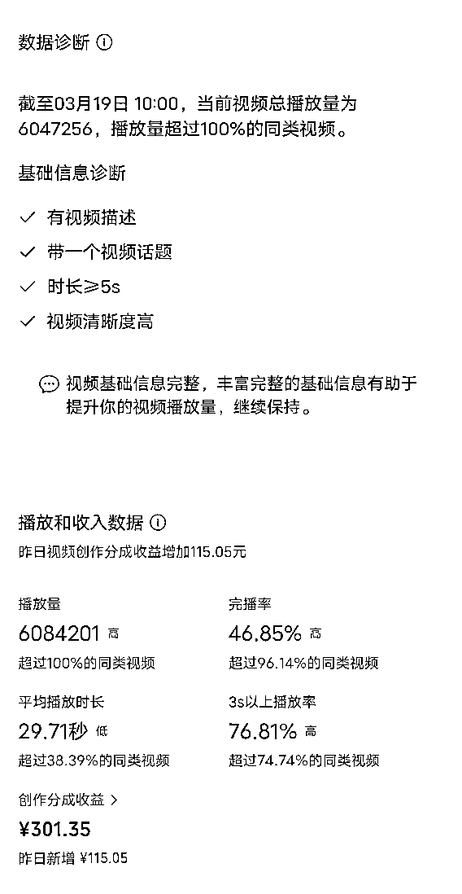

又用我媳妇的身份证又认证了一个老的小号，再发，继续爆。

几个号总共加起来，目前大概有1000左右的收益吧。

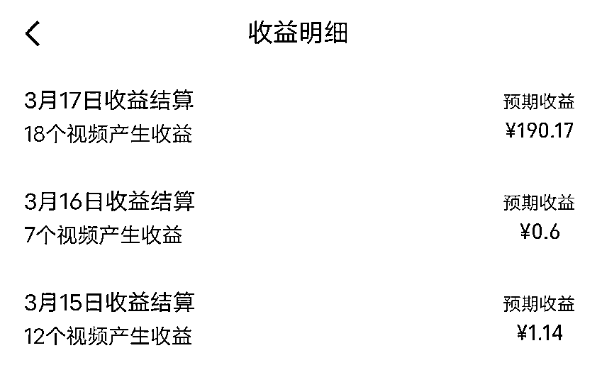

感慨，就这样一个小项目，也是几番波折才能见到收益的。

接下来从四个步骤来跟大家分享一下这几天的实战经验，总结下为什么我发的视频爆款率比较高的原因。

（这几天基本上每天都能有一个爆款，隔一天一大爆（万赞以上）。

# 实操关键攻略

## 一、爆款视频选材

### 1、找10万赞以上的爆款素材

视频号创作者分成的广告单价不高，大概一万播放只有0.5元。

我看之前的手册写的是一万播放1元，现在应该是不如以前高了，平均200万播放才有100元左右的收益。

所以虽然这类视频普遍数据很好，但我们要追求的是大爆款，像10万+赞那种视频，才会有比较高的收益。

所以找素材的时候，就要找10万赞以上的。

因为视频号广告收益是在评论区，所以可以尽量找评论比较多的爆款视频。

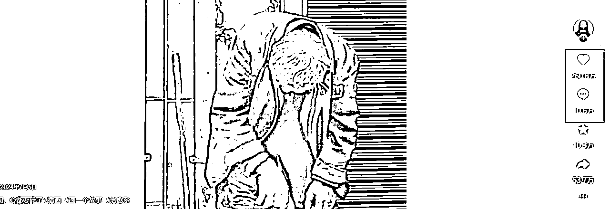

### 2、跨平台找素材

视频号上10万赞，大概是1000万左右的播放量，所以很多人都已经刷到过了。

你再重复发同一个素材，就很难再有大爆款了。

所以要尽量找视频号上还没怎么火过的，但其他平台火过的爆款视频。

我基本都是在小红书和抖音上刷，刷到以后看看视频号上有没有同行视频大爆过的。

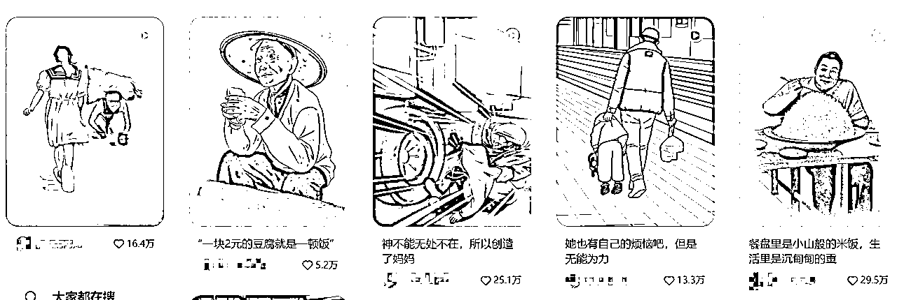

有就不做了，没有就做。

如果有小爆的，看看对方画的水平，剪辑得如何，确定能比他画得好，剪得好，也可以做。

总之我的逻辑是，不看视频号的同行，尽量比他们早，比他们好。

### 3、跨赛道找素材

做这个项目的底层逻辑，其实是借势创作，借爆款视频的势，二创加上漫画，用一种新的形式来呈现。

爆款视频都是符合人性的，所以爆过的可能还会再爆。

一种形式爆过了，换一种新的形式，还可能再爆。

所以，不要找同赛道的素材，可以找跨赛道的素材。

比如做情感混剪的，做故事混剪的，做娱乐混剪的等等。

找他们做过的大爆款，然后加上手绘漫画，重新剪一遍，就可以了。

跟上一条逻辑类似，别盯同行，盯新的爆款素材。

## 二、制作手绘漫画

### 1、作图工具

作图的AI工具，不用那么复杂的，即梦可灵啥的还需要积分或会员。

我们直接用豆包就行，免费，不限次，想做多少做多少。

### 2、万能提示词逻辑

豆包可以解析图片，所以喜欢什么样的插画，直接丢给豆包，问问它用什么样的提示词才能画出这样的手绘漫画。

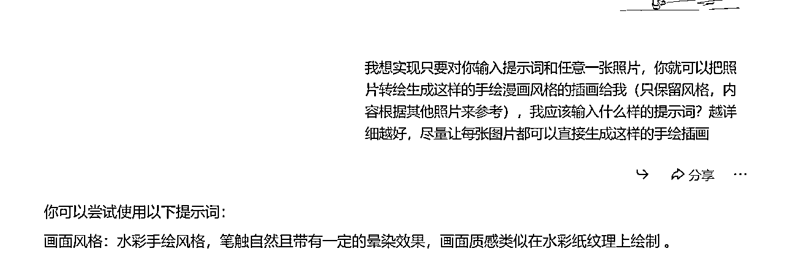

掌握了这个技巧，大部分风格的插画都能搞得定。

实在不好画的，再去即梦生成一下，再回来豆包用同样的风格渲染一下就行了。

比如我找了张插画，豆包给了我这样一个提示词：

请将这张照片转绘成具备下列特点的插画

画面风格：水彩手绘风格，笔触自然且带有一定的晕染效果，画面质感类似在水彩纸纹理上绘制 。

人物：以简洁、圆润的线条勾勒人物轮廓，保留人物主要特征，面部表情简单但生动 ，比如用简单的圆形、弧线表示眼睛、嘴巴等。

色彩：整体色调柔和温暖，饱和度适中，颜色过渡自然，类似浅米色背景搭配低饱和度的人物服装颜色。

构图：保持画面简洁，突出主体人物，人物动作自然，如有背景，背景元素简单不复杂。

### 3、作图流程

有了提示词以后，用豆包的图像生成，选上真实定格图片的截图作为参考图，选个合适的比例就行了。

如果第一次生成的不够准确，可以跟豆包详细描述一下画面里有什么，有时候图片不够清晰的话，就需要加上描述。

不合适再抽两次卡，有局部不满意的地方，点击图片，只用“局部重绘”功能修改一下就好。

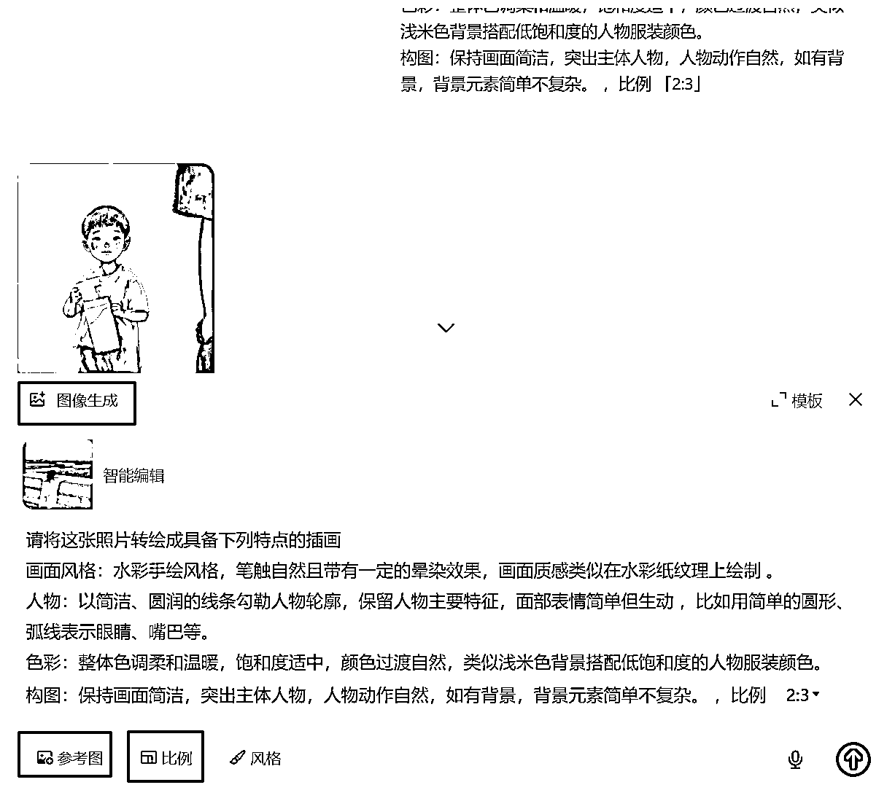

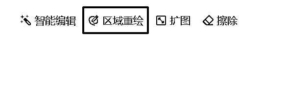

生成的漫画是这样的，还不错吧？

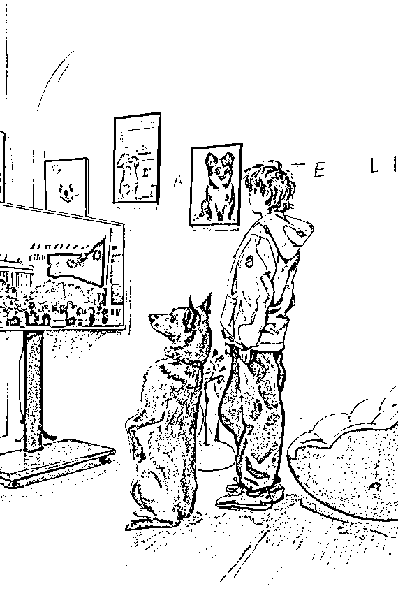

喜欢其他风格的插画，或者想做更个性的画面，只要有参考图，就能用这一套方法，形成你自己的专属提示词和专属风格。

## 三、剪辑素材

最开始我们也是用市面上常用的混剪去重技巧，但时不时就会有原创不合格，原创审核不过，甚至开始有收益了后面又掉广告的情况。

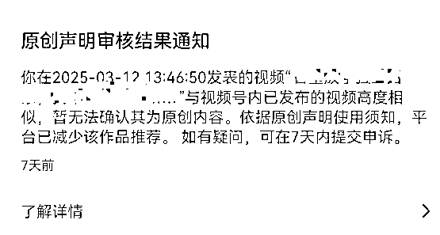

最后我用了这个方法，再也没出现过掉原创的问题。

正所谓，真诚才是最大的套路。

去重效果最好的方式，就是不去重，哈哈。

找到爆款视频素材以后，去抖音直接查找该素材的原视频。

如果找不到原视频的，就找一版最干净的素材。

最好是没有字幕，没有加任何效果的视频。这个视频没有赞数限制，只要干净就行，越干净越好。

然后把它用去水印软件下载下来。这里不会的自己去搜轻抖小程序就行了。

下载下来以后，直接用这个原视频，导入到剪映里面，对照着参考的爆款混剪视频，自己重新剪一遍。

爆款用哪一截画面，你就用哪一截，

爆款用什么背景音乐，你就用什么背景音乐，

爆款加什么字幕，你就加什么字幕，

爆款用什么转场效果，你就用什么转场效果。

一些细节，剪辑水平高的，可以自己适当发挥发挥，让视频更加出彩。

但如果你不能确定自己可以比爆款参考视频剪得更好，那就完全模仿爆款视频的来。

然后末尾加上手绘漫画，用关键帧做一些动态效果，卡上点背景音乐，就好了。

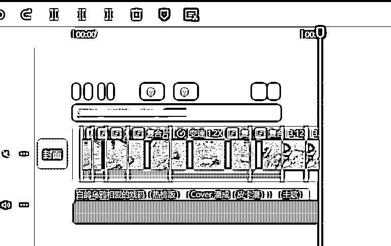

这样做出来的视频，在内核上相当于是你自己独立拿原视频二创剪辑的，只不过参考的爆款视频的情节和逻辑。

何况还比爆款视频（非同赛道）多了手绘漫画，所以原创度绝对是没问题的，完全不需要担心去重有没有做到位，也不会影响视频的观感和流畅度。

（之前我也试过直接拿跨赛道的爆款视频去重后，加上漫画，直接发。但偶尔还是会有原创过不了的问题。）

## 四、发布评论

视频发布后，自己先评论一下，可以找爆款视频下面比较有争议点或点赞讨论度比较高的复制过来。

自己不方便说的，用其他微信小号评。热议评论多起来以后，视频才会更爆。

而且广告在评论区，更多人打开评论区，广告收益才会越高。

# 其他

### 1、实名认证+原创+侵删与健康提示

账号起号成功，开通创作者后，一定要尽快实名。

目前测试，实名了的号，视频爆了过了千粉以后，也可能会跳出再次让你实名认证。

这时候扫脸再认证一下就行，不会影响流量。

但如果没实名的号，爆了以后，没准什么时候就出审核提示了。

创作者分成是视频号给原创作者的变现方式，所以做这个必须得做好原创度。原创度不好没收益不说，还不一定什么时候就给把广告功能给关了。

也不需要买粉刷量什么的，按照上面的步骤好好做，基本上10篇以内必涨到100粉了。反正也要发10条内容的。

另外要长久健康的持续做好一个号，拿到稳定收益。基本上这一类创作者都会加上侵删提示，如果比较有争议的视频，也可以在视频里加上一些说明。比如”素材来源于网络，非不良引导，勿过度解析“等一类的说明。

尽量健康运营下去，收益才比较稳定。

### 2、项目底层逻辑变种

前面说过，这个项目的底层逻辑是借爆款视频的势，很多混剪类的视频都是这个逻辑。

爆款视频可能不容易做，但爆过的视频都已经经过市场验证，拿来二创，爆款率就会大大增加。

手绘漫画做得人多了可能会厌倦，不再火了。

但爆款视频一直都会有，每天都在产生。有源源不断的素材，应该可以一直做，只是换不同的形式而已。

比如这种正能量混剪、西格玛男人燃剪

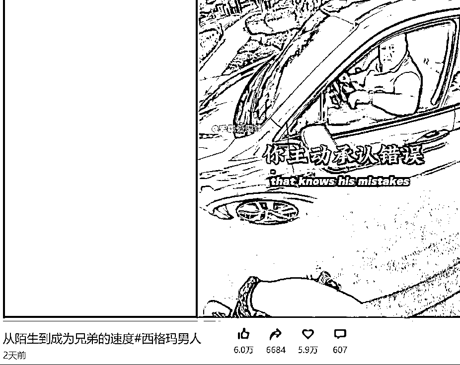

儿时回忆混剪：

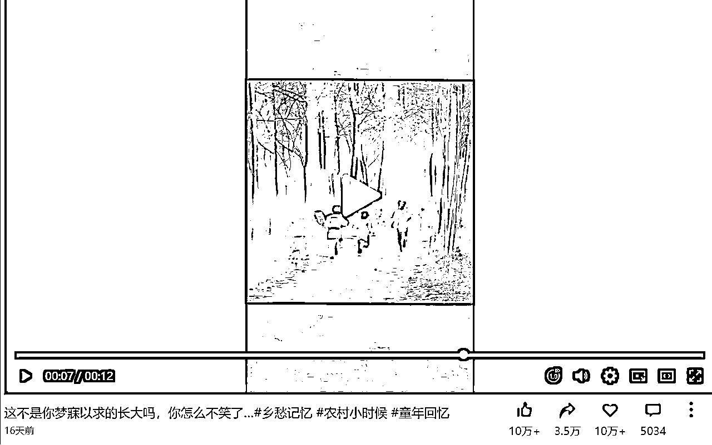

吃瓜混剪：

娱乐搞笑解说：

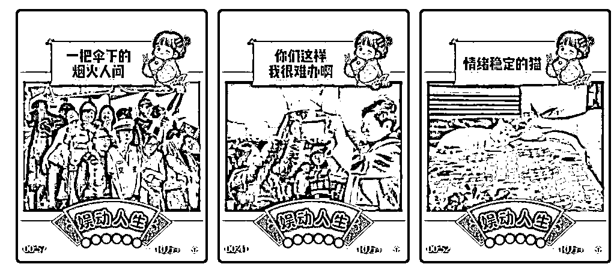

真人出镜爆款视频解说：

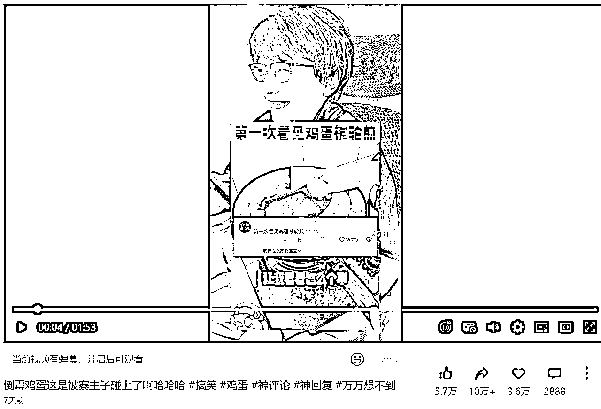

借爆款热门视频的势，二创自己的内容，单号既有做大的可能（目前看到有同行一个号月入几万的），也可以多号矩阵放大收益。

分享出来目前的一点点实操经验，希望能帮助大家少踩一些坑，一起生财有术！