# 00后副业小白月1.7W，AI写作高客单细分之PPT专项（上）

> 来源：[https://hjue9evklt.feishu.cn/docx/JP7VdLVQGonCNFxuCPzcdk7qnhf](https://hjue9evklt.feishu.cn/docx/JP7VdLVQGonCNFxuCPzcdk7qnhf)

Hi大家好，我是Livia

00年 | ENFP乐观小太阳 | 终身学习

毕业做一年销售迷茫无方向 → 实现自由职业AI写作月纯利润1.7W

AI写作高客单细分题材之一，独家PPT技巧

# 本帖定位

观察到社群里关于『AI+PPT制作』的内容较少（大多聚焦文字类创作）

我整理了一份自己的PPT变现路径：

从初期接5元/页的低价单

到通过AI提效后，淘宝黑奴店都能实现单页100元（他们实际收客户400元/页）

本篇内容：《从零到一：PPT+AI光速接单指南（小白必看！）》

▷ 下篇预告：《从5元到400元的PPT真实路径：AI提效全流程拆解》

希望能帮想实践AI+PPT项目的朋友少走弯路

# Livia的项目概述及重点提示

背景

双非国贸文科生，毕业后进入外贸行业，却困于流水线式工作，深感职业天花板

兼职探索中偶然接触到「生财有术」三天体验卡，被社群里可复用非空谈的项目实操路径吸引

评估多个项目后决定入局AI写作赛道

项目成长路径

*   第1个月：学习生财航海手册，淘宝代写起步，月入4k

*   第2个月：依旧淘宝接单，但技术迭代客单价提升，月入8k

*   第3个月：链接海盐团队指导，跑通「流量+SOP」闭环，单月收入翻倍至1.7w

*   现状：多平台分发，收入持续指数增长...

放张我的部分订单记录吧（每次都会详细的记录单价和时间看是否还有提速空间）

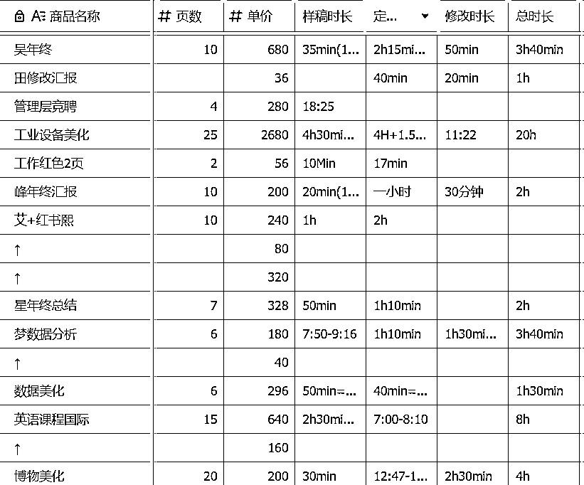

重要提示！！！

接一单淘宝赚100/页看似稳妥，但大佬们自主引流客单价直接翻几倍

原因？我没及时做流量

一个例子（以1000块钱的订单为例）

自主引流VS平台

*   闲鱼自己引流，你的收入 = +1000

*   淘宝被动接单，你的收入 = +1000*提成点，≤400（0.4是很高的了！）

1000和1000*0.4哪个更值得你算算就知道啊！

这边建议大家尝试接单两周后就可以去做流量了，不要沉溺！不要做黑奴！

获取流量的详细链路

关于流量，我直接推荐大家去看bu懂老师的全链条经验贴

里面包含了完整的自主引流策略，让你摆脱平台依赖，实现收入质的飞跃

流量端做到月GMV17w的大佬，快去学！！！

https://scys.com/articleDetail/xq_topic/4848282444142428

# 1 AI工具使用的底层逻辑

本节内容全部摘自Cheese海盐芝士老师的开源教程，结合我个人经验选了几个常用的提示词

想要学习最全面的提示词底层逻辑，建议全篇学习以下教程

我入局AI写作就是学习海盐老师的经验贴，地表最强，主页还有很多，强推！！！

https://scys.com/articleDetail/xq_topic/4844284125554258

## 1.1 核心使用方法

### 1.1.1 角色扮演法：让AI“装专业”

核心逻辑：告诉AI“你现在是XX专家”，限定它的回答风格和知识范围。

模板参考：

你是一名[XX领域]的[资深专家/金牌销售]

请用[专业/通俗]语言

完成以下任务：[具体需求]

避坑指南：角色越具体，效果越好（如“10年经验的宠物营养师”＞“营养师”）。

案例：角色扮演法写耳机评测

需求：写一篇小白能看懂的蓝牙耳机评测

Prompt设计：

你是一名耳机测评博主，有3年拆解500款耳机的经验，擅长用比喻让小白理解技术参数。

请用“手机拍照对比”的方式，解释【降噪深度30dB】和【蓝牙5.3协议】的实际体验差异。

### 1.1.2 原子任务法：把大象装冰箱分三步

核心逻辑：大任务拆成不可再分的小步骤，让AI逐个击破。

先造标题，再搭框架，最后填内容。

模板参考：

任务：写一篇《如何选蓝牙耳机》的知乎文

拆解：

1.生成10个吸引小白的标题

2.列出文章五大核心知识点

3.为每个知识点配真实案例

案例：原子任务法做母婴号涨粉计划

需求：制定小红书母婴号1个月涨粉1W策略

任务拆解：

1.  角色设定： “你是有5年经验的母婴运营总监，擅长用争议话题获客。”

1.  原子任务：

生成10个0-1岁宝妈必看选题

设计3个引发互动的标题句式

列出拍摄必备道具

制定日更排期表（含热点借势节点）

### 1.1.3 任务拆解：教AI一步步思考

核心逻辑：复杂任务必须分阶段处理，避免AI“一口吃撑”。

AI像小学生，一次只能解一道题，别让它做奥数卷子。

模板参考：

请按以下步骤处理：

① 分析用户需求中的关键词

② 结合XX行业痛点列举3个解决方案

③ 用表格对比方案优缺点

④ 给出具体执行步骤

案例：任务拆解法写行业报告

需求：分析2024年智能手表市场趋势

分步指令：

① 列出智能手表三大核心消费群体

② 统计京东/天猫销量TOP10品牌的定价区间

③ 用SWOT分析法对比华为Watch GT4和Apple Watch S9

④ 预测2024年技术突破方向

小白技巧：每步生成后追加“请用小学生能听懂的话总结结论”。

## 1.2 细节使用方法

### 技巧1 语义清晰明确

基于自然语言处理中的歧义消除原理，减少AI的意图猜测成本，提升响应准确性。

如果你说“帮我找点资料”，它可能不知道你要“论文参考文献”还是“短视频素材”

描述越具体（比如限定时间、类型、用途），它越不会跑偏。

提示词示例：

【任务】

请提供2023年新能源汽车行业PDF格式市场分析报告

（含市场规模、竞争格局及趋势预测）

用于学术论文参考文献

需附中英文权威机构来源及三年数据图表

### 技巧2 避免冗余

注意力机制模型（如Transformer）对长文本的冗余信息敏感，简洁输入可降低噪声干扰。

如果输入里夹杂着“那个…其实…可能…”，它会分不清重点

一个提示词并不是字数越多，效果越好

### 技巧3 正向示例

通过模式匹配机制，示例能引导模型学习输出格式和内容标准。

AI需要参考答案格式，比如你说：“像这样写：1.背景 2.方法 3.结论”

它就能秒懂你要的学术八股文结构，而不是自由发挥成散文。

可以投喂文本格式/文本风格/计算具体方式等示例

提示词示例

【任务】

请按以下学术结构撰写：

1.背景：简述研究问题及现状，引用2-3篇关键文献

2.方法：明确说明实验设计、数据来源及分析方法

3.结论：用“本研究首次发现...”句式总结成果，并指出实践价值

【参考示例】

1.背景：基于Smith的供需理论，当前社区医疗资源...

2.方法：采用分层抽样法，收集2020-2022年三甲医院门诊数据...

3.结论：首次证实资源配置效率与患者满意度呈显著正相关

### 技巧4 投喂素材

基于上下文学习的检索增强生成（RAG），输入素材直接影响输出相关性。

给AI塞参考资料就像考试前划重点

如果你给它10篇区块链论文，它输出的内容会比只问“区块链是什么”专业10倍

和技巧3是差不多，但是投喂素材比技巧3投喂正向案例要泛~

### 技巧5 限定字数/分点数

通过显示token限制和logit_bias技术控制输出长度和格式。

用硬性指标框住AI的脑洞，比如要求“分三点回答，每点不超过50字”

分点它可以做得很好，字数有时候它计算的很不准确，可以多次生成

提示词示例

【任务】

CHATGPT和DEEPSEEK哪个好用？

请从3个不同的维度分析并给我一个结论

每点不超过50字

### 技巧6 让他自我检查

利用迭代推理（chain-of-thought）弥补单次生成的信息遗漏。

AI像急着交卷的学生，经常漏写“解”字

让它自己复查一遍，相当于考完试提醒：“再检查下姓名学号填了吗？”

质问就对了，“你看看，这对吗？”“你确定吗？“他很会反思自我滴~

## 1.3 看看你有没有学会呀

### 以下提示词运用了哪些技巧？

【角色】PPT设计大师，具有三十年行业经验

【任务】

帮我把附件1表格设计成10页PPT的数据分析内容，给我PPT设计大纲。

三个版本的不同方案

【要求】

1.文件是采购经理的年终汇报总结，需要用到图表

2.数据分析需要体现24年比23年进步的地方

3.文字分析部分需要分成3点

【示例】

附件2是我之前的数据分析过程拆解，请学习

### 答案~

【角色】（角色法）PPT设计大师，具有三十年行业经验

【任务】

帮我把附件1表格设计成10页（字数/页数限定）PPT的数据分析内容，给我PPT设计大纲。

三个版本的不同方案

【要求】

1.文件是采购经理的年终汇报总结，需要用到图表

2.数据分析需要体现24年比23年进步的地方（具体描述）

3.文字分析部分需要分成3点（分点法）

【示例】

附件2（投喂素材正向示例）是我之前的数据分析过程拆解，请学习

# 2 微软PPT 还是 WPS PPT？

关于用WPS还是OFFICE的争论一直很多，到底选啥？

#### 2.1 一句话总结

*   设计党：咬牙上Office，专业功能无可替代

*   新手党：闭眼选WPS，免费够用，AI辅助很香

*   生财人：结合使用！

#### 2.2 具体对比

# 3 AI PPT 一键生成工具使用方法

以下为推荐的两个主流好用的一键生成AI PPT工具：

具体使用方法如下：

## 3.1 AI PPT

### 第一步：访问官网

访问官网 https://www.aippt.cn/

点击【开始智能生成】按钮

### 第二步：输出你的需求

#### 方式一、输入提示词

这种情况客户只给你一个主题或者简单任务，那么直接选择AI智能生成，他会根据你的主题先生成大纲，再根据大纲丰富每一页的内容

具体操作步骤：

1.选择「AI智能生成」模式

2.输入提示词强化需求

以一份医学PPT为例

请生成医疗行业专业风格的PPT，

包含病例影像识别、药物分子模拟、智能问诊三个应用场景，需要5张数据图表

#### 方式二、投喂素材文档

直接上传word\pdf\txt等文档格式需要开会员

如果不想开会员，可以把需要生成的内容用其他AI生成markdown格式再输入

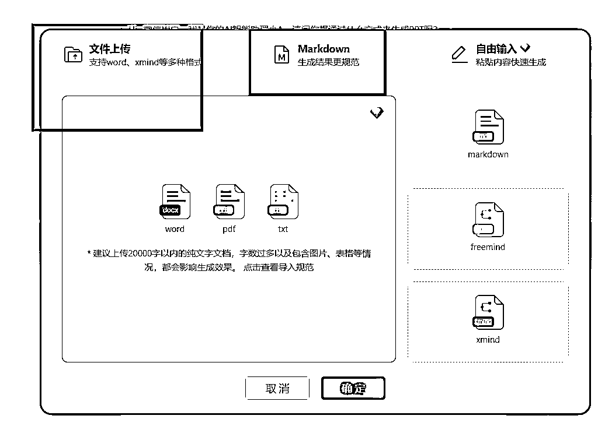

### 第三步：修改大纲

输入刚才的提示词后系统会跳出如下界面

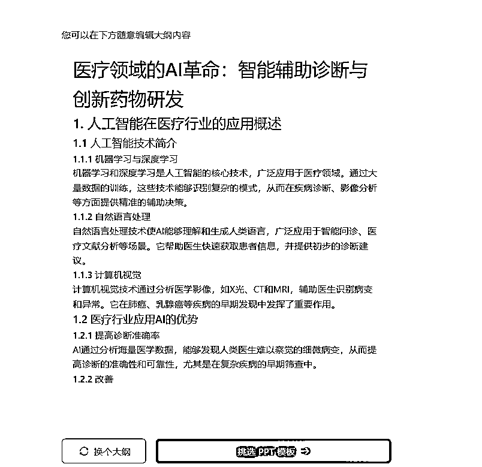

若大纲有需要修改的地方可以点击如下按钮进行修改

任意内容双击便会跳出来编辑窗口，修改调整即可

### 第四步：挑选模板

点击【挑选PPT模板】

点击这个箭头小标可以选更多模板

展开后模板风格里面可以选择颜色、应用场景、职业

也可以选择右上角的更多按钮

我们是医学注意的就可以直接搜索关键词“医学”

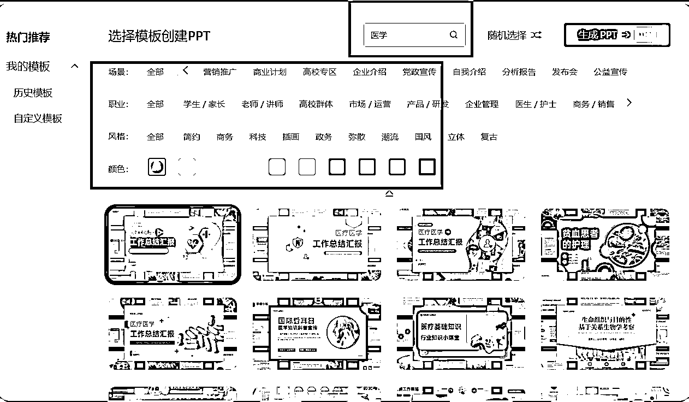

### 第五步：模板点击编辑，调整内容

右下角点【去编辑】人工检查内容修改

进入后是这样的界面

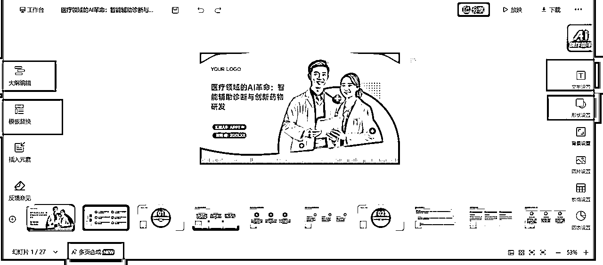

具体常用的编辑板块如下：

#### 1.大纲编辑

每一板块都可以点进去编辑

也可以在下方点击垃圾桶图表删除

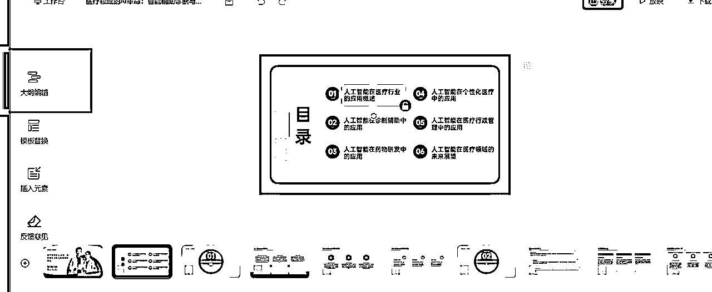

#### 2.模板替换

编辑后发现模板不合适还可以再修改

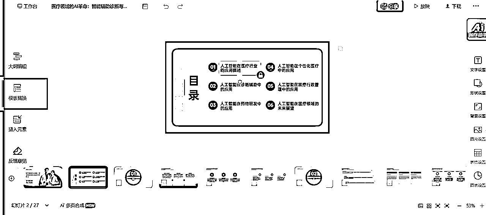

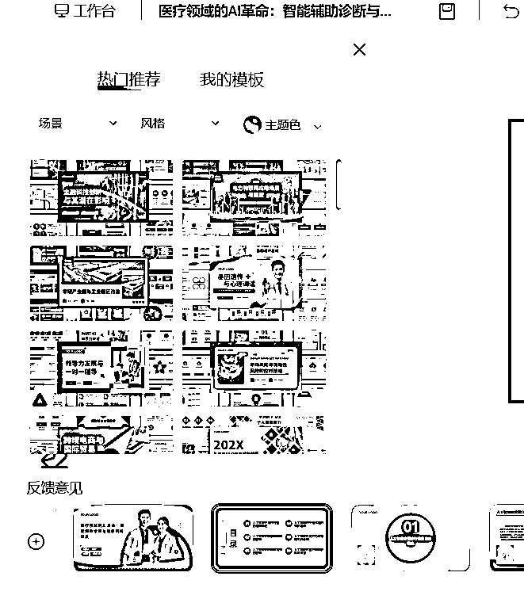

#### 3.插入元素

可以插入文本、形状、图片、素材、表格等元素

#### 4.多页合成

点击【多页合成】后选择需要合并的幻灯片进行合并

此功能需要付费哦

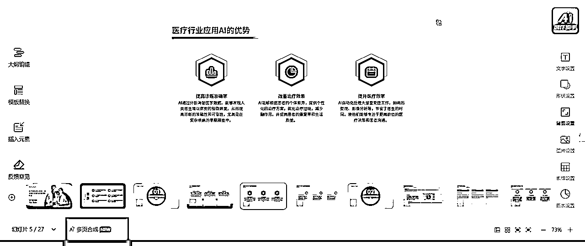

#### 5.细节字号、形状、图表

点击右侧编辑栏编辑即可

### 第六步：导出文件

点击右上角下载即可导出文件，AIPPT导出需要付费

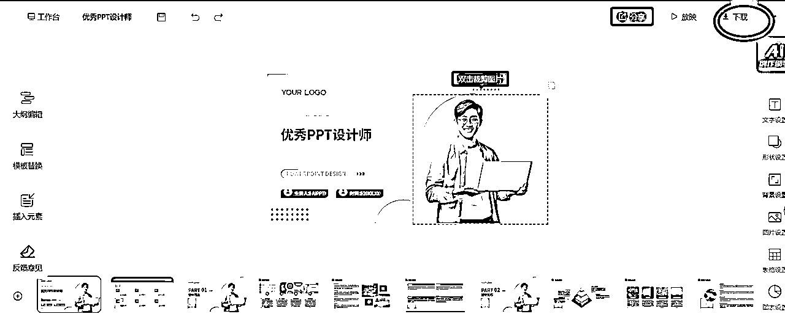

## 3.2 WPSAI

### 第一步：打开界面

AIPPT的功能建议买日租套餐

WPS 超级会员+WPS AI PPT的组合套餐哦，1元/天

单买有些功能实现不了

点击左下角的【灵犀】打开AI+PPT的界面

### 第二步：点击AIPPT

接入R1模式和联网搜索，让内容更加智能化

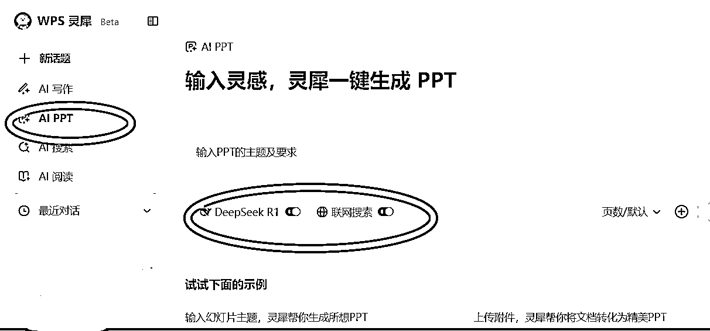

### 第三步：输入需求

在对话框内输入需求，可以添加文件附件和页数要求

还是以以上的医学PPT为例

选择Deepseek-R1深度思考模式，加入联网搜索

同时输入提示词

以一份医学PPT为例

请生成医疗行业专业风格的PPT，

包含病例影像识别、药物分子模拟、智能问诊三个应用场景，需要5张数据图表

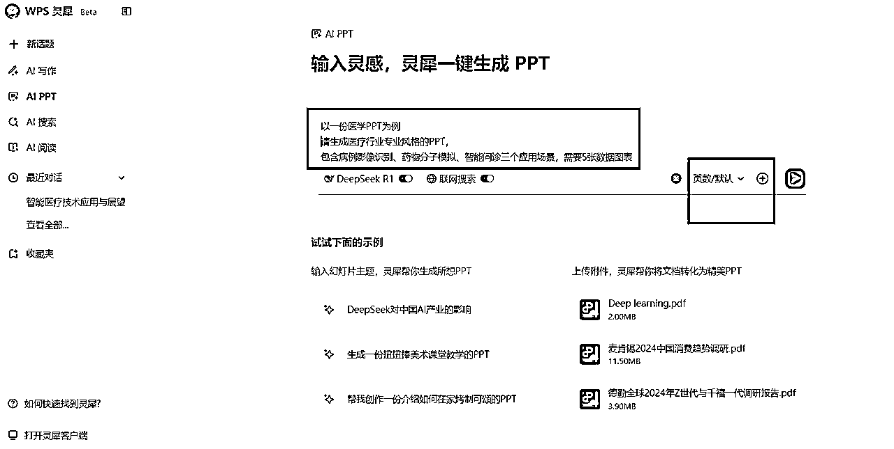

### 第四步：选择适合的模板，点击生成

生成后在左下角点击“选择模板”

（这个按钮模板有限，等下进去可以换）

然后点击“生成PPT”按钮

### 第五步：选择模板

在生成PPT的页面结束后，可以再替换右侧模板

或者上传模板识别

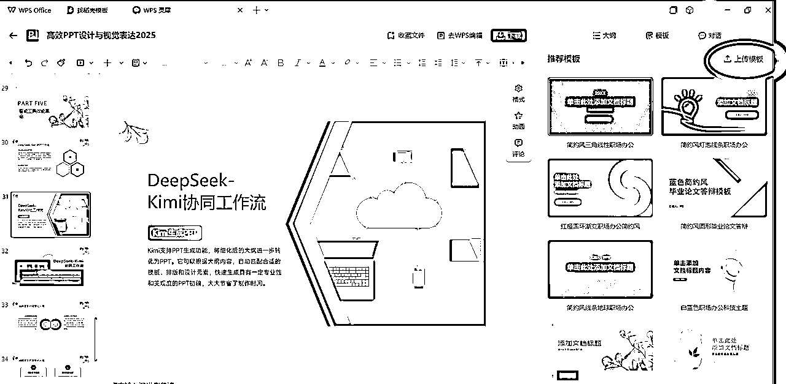

### 第六步：人工编辑

一般这个时候的质量还是不行的，可以点击【去WPS编辑】

这个版面就和WPS的PPT版面很像

#### 1.字体

编辑字体颜色等点【开始】

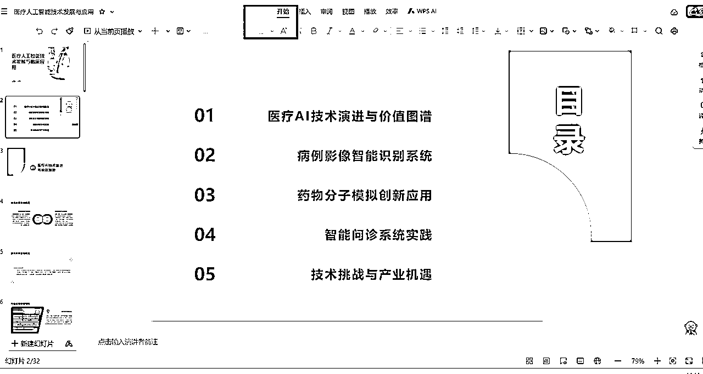

#### 2.插入图表

点击【插入】可以编辑图表、关系图等

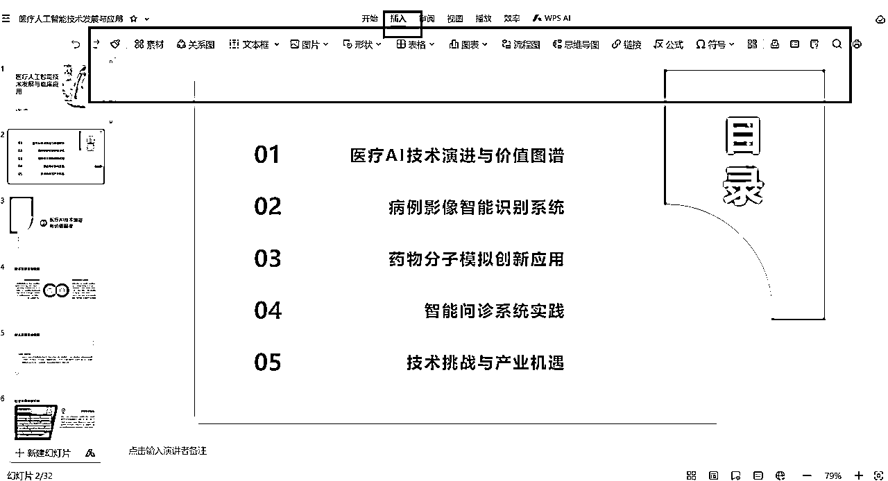

# 4 PPT基础结构认知

## 4.1 结构页：PPT的骨架设计

结构页是PPT的导航系统，需同时满足信息传递与视觉引导功能。

其中包含了封面页/结尾页/目录页/章节页

以下为年终总结常见模板示例

### 4.1.1 封面页：PPT的“脸面”

（黄金3秒法则）

核心目标：3秒传递主题、主讲人、风格基调

设计技巧：

提取官网透明背景Logo放右上角

副标题字号≤主标题的70%

### 4.1.2 目录页：PPT的“地图”

核心目标：清晰展示3-5个内容模块及其逻辑关系

优化方案：

用数字图标+关键词

在目录底部添加与章节页呼应的渐变线条

### 4.1.3 章节页：PPT的“路标”

核心目标：提示内容切换，强化逻辑分段

要素设计：

延续封面字体/配色（保持视觉统一）

当前章节序号放大至页面1/3高度

章节名称≤8个字

### 4.1.4 结尾页：PPT的“收官”

核心目标：优雅收尾，强化观众记忆点。

内容类型选择：

感谢型：复制封面页版式，替换文字为“感谢聆听”

金句型：引用论文结论句，用毛笔字体+红色渐变

互动型：添加二维码

## 4.2 内容页：PPT的血肉填充

内容页的核心任务是信息高效传达，需同时满足逻辑清晰与视觉舒适的双重需求。

标题层级：主标题（24pt）+副标题（18pt）+正文（14pt）

呼吸感留白：页面四周预留10%-15%空白区域，图文间距≥1cm，避免视觉压迫

### 4.2.1 常规型内容页

章节归属 + 小标题 + 正文内容

### 4.2.2 非常规型内容页

整个页面只有几个字 + 配图

# 5 新手用AIPPT接单红/黑榜

## 5.1 新手红榜

### 5.1.1 纯文科答辩PPT

#### 理论分析

文科PPT的核心是把观点理清楚，模板直接交给AI搞定！

反正不用改图表调代码，小白冲就完事了！

步骤

1/ 内容整理：把长文里的观点提炼出来

答辩内容拆成小标题+关键词

比如“研究背景→案例→结论”，丢给AI自动分点，不用纠结实验数据或代码~

2/ 设计偷懒：模板直接用！

文科PPT不用搞复杂配图！

AI生成的纯色模板+微软雅黑字体，直接白底黑字都OK

反正老师只看你逻辑顺不顺，样式选AIPPT里面基本的学术模板就可以

3/ 逻辑检查：重点！重点！

AI生成后一定要看标题有没有贴切论文本身！

（“发现问题→分析原因→解决对策”）自己捋一遍顺不顺，答辩时老师爱问这个

#### 案例拆解

现在以【省域入境旅游服务贸易竞争力研究】这份文件作为样稿案例，利用WPSAI，给大家做一个案例拆解

##### 第一步：浏览文章内容

打开论文文档，重点看三个部分：

✅ 目录结构

✅ 研究方法

✅ 现状、问题、策略等主要观点

##### 第二步：AI大纲生成

1.  打开DeepSeek对话框，输入提示词指令：

【任务】

我的答辩文章题目为《XXX》，需要你为我生成一份PPT设计大纲，XX页

【结构要求】

封面页

目录页

正文页（根据正文实际内容设计）

总结页

致谢页

【要求】...

1.  操作技巧： 点击回形针上传论文PDF 关闭右上角的"联网搜索"开关 模式选择"深度思考R1"

1.  保存结果： 将生成的大纲复制到Word，命名为"初版大纲_V1" 用黄色高亮标记需要调整的章节

##### 第三步：内容填充

大纲生成好了，需要根据大纲匹配上原文相应的内容，直接投喂以下提示词

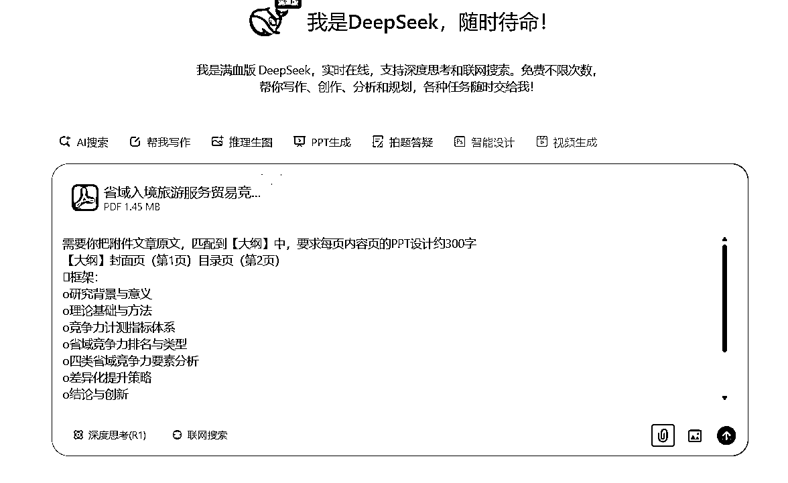

生成后把内容复制到文档内存起来，可以命名PPT详细内容设计

##### 第四步：打开WPS AIPPT

打开WPS → 新建「演示文档」→ 点击顶部工具栏「WPS 灵犀」→ 选择「AI PPT」

（点击回形针上传论文+前两步的Word大纲）

如提示词让他生成匹配主题的PPT

我的答辩题目《XXX》，请根据附件生成20页PPT：

风格：学术严谨但不死板

##### 第五步：选模板

等待生成

*   进度条显示时不要关闭窗口（约等待2分钟）

*   初次生成后点击「选择模板」可生成模板备选

点击生成PPT，并挑选上方合适的模板即可

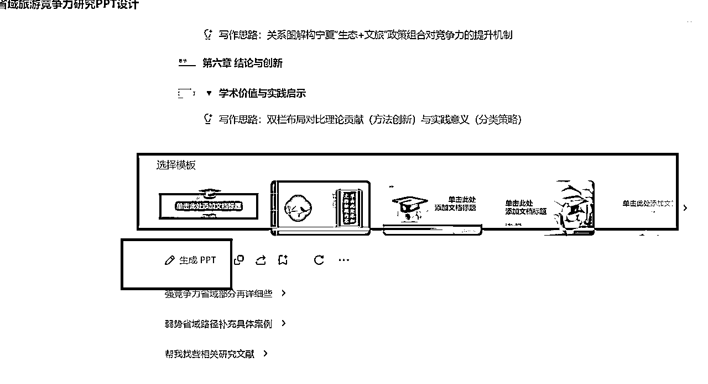

答辩主题优选风格：冷色系如蓝色绿色+ 大部分的白底

##### 第六步：检查编辑后下载

### 5.1.2 低需求场景 PPT

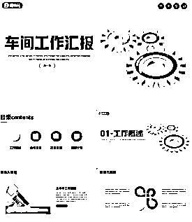

这类客户可以理解为"职场PPT急救人群"。

一位干了二十年的车间老师傅，突然被要求用PPT汇报技术经验。

他平时连电脑开关机都不熟练，更别说做PPT了。

这时候他只能赶紧向外求助可能是淘宝代做，也可能是AI自动生成的PPT。

但基本AIPPT他们也不是很熟悉如何使用的，我们就捡信息差的漏啦！！！

## 5.2 新手黑榜单

### 5.2.1 急单

风险点：客户要求几个小时就要完成，这类订单表面看时间短报酬高，客户给了加急费，实际藏着很大的不确定风险。

具体问题：

我们用AI工具生成初稿后，经常发现某些页面需要手动调整比如特殊图表/复杂排版。

这时候如果连PPT基础操作都不熟练，光是调整字体对齐都要花半小时，更别说处理客户中途新增的要求。

对PPT软件基础不扎实的人来说不友好

### 5.2.2 纯美化

风险点：客户发来的PPT已经是有完整内容和模板的半成品，要求"优化得更高大上"

客户心理误区：认为"不就是调个颜色换张图"

但是实际可能涉及：

*   重新设计20页的图标体系

*   统一全文档的字体间距

*   调整50处图文混排的对齐

收费难题：客户看到成品后常会说："这和原来的差不多啊"，特别是当原稿本身不算太差时，他们根本意识不到背后200多处细节调整，最后钱和时间都没有了

### 5.2.3 包含复杂动画的

为什么AI工具搞不定？

AI生成的动画只有"淡入淡出"或"左右飞入"这类基础动作。比如客户想要「用动画画出建筑结构」，AI只能让整个图片突然出现，做不到「从地基→墙体→屋顶」分层建造的效果。

踩坑案例：

之前我接了个儿童教育PPT订单，客户要求「字母A变成苹果的动画」。AI只能让字母消失后苹果出现，而客户想要的是字母A的横杆慢慢弯曲成苹果轮廓。结果花了3小时研究动画路径工具，最后客户退钱了。

避坑：

有些客户会发来参考视频说："就要这种效果"，但其实视频里的动画是用专业影视软件制作的，一定要提前问清楚动画细节。

### 5.2.4 数据分析类

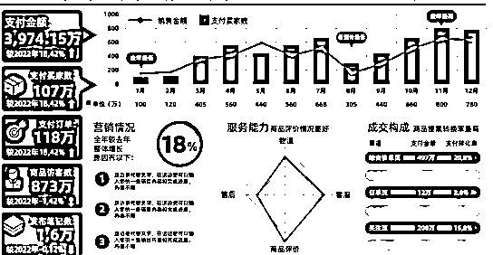

案例解析：

"问卷结果有300份，需要统计成饼图柱状图"

为什么进新手黑榜？

1 AI变"复读机"风险

当客户发来包含678条销售记录的Excel时：

AI只会把数据转成文字："7月销量最高达230万，环比增长12%"

实际需要的是：

整理数据删除无效条目

用折线图对比6-7月趋势

在图表旁标注重点数据

2 客户预期错位

客户觉得："你不是AI生成很快的吗？"

实际上：

数据有错误时，比如合计金额≠明细相加，AI不会提示

需要制作组合图表，比如柱状图+折线图双坐标，AI只会生成分开的两个图

如果客户中途要求修改数据源，所有图表都要手动重调

# 6 想接高价单前泼个冷水：只用AIPPT做不了高价单

社交媒体网络上的很多营销号把它们宣传得天花乱坠：

"只需给一个标题，就能生成精美PPT"？？？

但实际使用后你会发现，这些工具存在不少问题：

## 6.1 内容质量问题

生成的文字内容往往"假大空"，客户很容易质疑"我为什么不自己用AI生成"

这一块如何提高质量直接跳转底层逻辑复习一下，学习怎么用提示词生成优质内容

## 6.2 模板与内容不匹配

AI很难保证生成的内容与选择的模板风格一致

比如美容美业也是一个很常见且热门的行业，客户需要做PPT的时候，AIPPT的模板库不够用了

若我们用别的风格硬凑，通常客户都会不满意

## 6.3 后期调整浪费时间

它导出的字体非常小，后期调整修改反而增加了工作量

在我接单初期PPT不熟悉，全都用AIPPT生成，客户反馈字很小需要全部重新调整

非常浪费时间

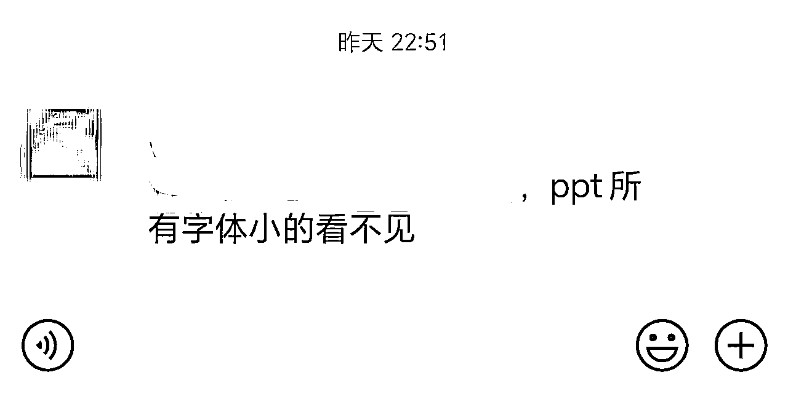

## 核心观点

美观是“放大器”，内容才是“声源”

表面美观的PPT若缺乏核心逻辑，观众只会记住画面而非观点，本末倒置！

AIPPT这类软件内容质量问题堪忧，建议高价单用更好的提示词来生成详实的观点内容

# 下一期揭秘如何具体制作高价单~

# 尾声

以上就是全部的经验分享，感恩AI写作，让我这样的普通文科生短期内实现自由办公

#### 致谢：

生财社群指路——迷茫中指引赛道

海盐团队带练——帮我将卡点逐一击破

AI时代的希望——人人皆有翻盘的机会

如果你现在仍然困顿于自己并不喜欢的那份工作中，

希望我的这篇小帖能够给到大家希望和启发。

我这样毫无背景的普通人，尚能借AI之翼挣破枷锁，你定能找到属于自己的破局点！