# 一个好玩又能赚钱的音乐游戏赛道分享

> 来源：[https://hez86518tv.feishu.cn/docx/KKvZd5zwAoHVQlxWgTrc2tgJnWc](https://hez86518tv.feishu.cn/docx/KKvZd5zwAoHVQlxWgTrc2tgJnWc)

| 版本 | 更新描述 | 作者 | 更新日期 |
| V1.0 | 新建文档 | 科学羊 | 2024-12-25 |
| V1.1 | 优化内容 | 科学羊 | 2025-03-02 |

大家好，我是科学羊，公众号专栏日更作者，知名报社签约编辑、海外内容创业实践者、游戏视频创作者。

本期给大家继续介绍一个非常好玩的赛道，简单说就是游戏+动画。有点像以前流行的音乐盒子。

不过今天谈的这个稍微有点门槛和创意。详细点说，就是通过自己设计游戏音乐+油管爆款视频进行组合。

副标题：RipXDAW Music Made Race

废话不多，先看对标，我给大家进行技术拆解！

# 一、前言

## 1.1 简介

赛道面向群体：海外、国内

面向平台：油管 + TikTok + 抖音

创作内容：音乐游戏+动画视频

游戏名称：midi-playground

视频方式：short TK YT

面向群体：儿童、青少年、爱音乐的人士

变现方式：广告收益、奖励机制

需要涉及领域：

1、热爱游戏的玩家

2、热爱音乐或者对音乐感兴趣的人士

3、了解音乐.mid文件

4、基本的视频剪辑技术

5、懂得github开源代码，修改代码（非必要）

先看下这几个账号，

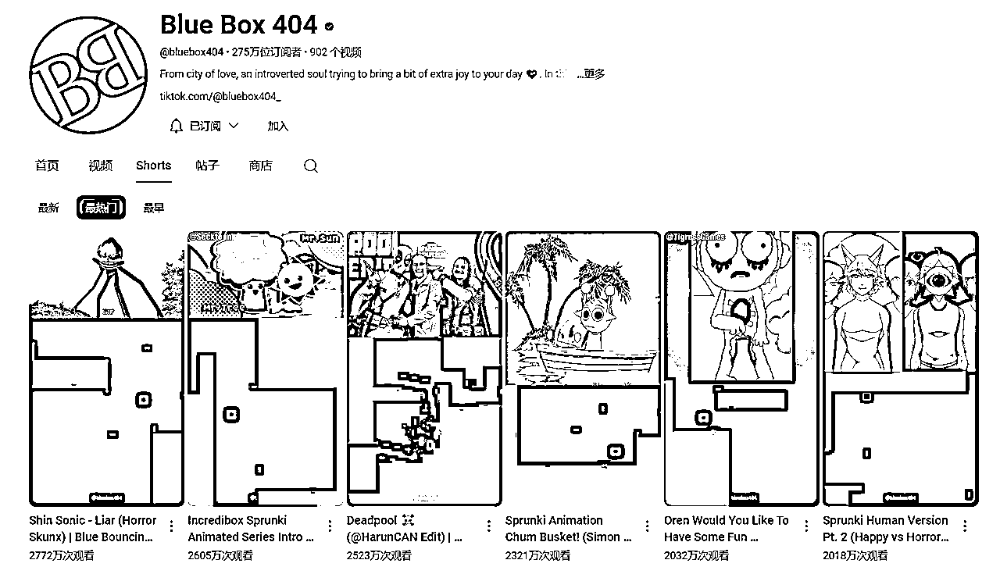

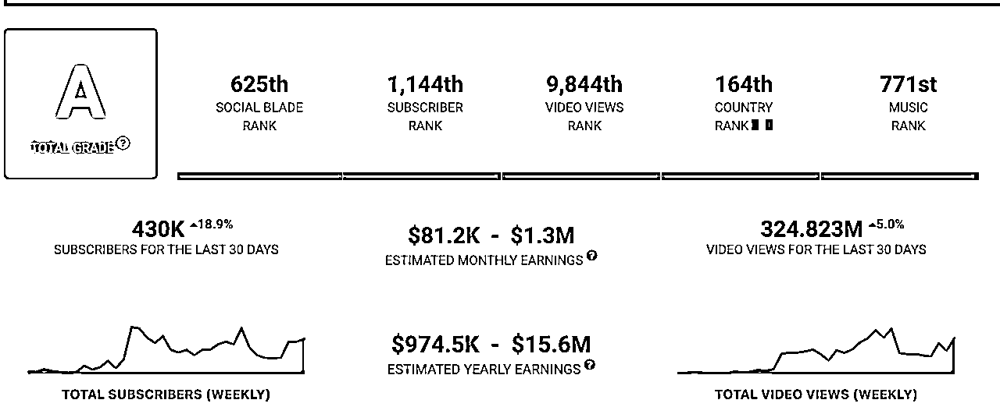

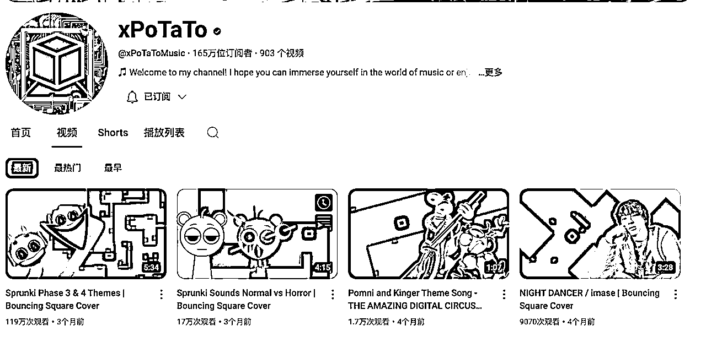

## 1.2对标链接

节选，

🔗https://www.youtube.com/@bluebox404/shorts

https://www.youtube.com/@xPoTaToMusic/videos

## 1.3 技术拆解与分析

这个赛道主要包含两大部分，第一部分就是上半部分区域的动画部分，第二部分就i是下半部分的游戏音乐部分。

其中上半部分大家可以去搜索「油管爆款视频」来剪辑，不过一定要二创，如果直接搬运可能会过不了审核。二创的方法就是讲故事，增加一些音频或者贴图素材，或者混剪。

当然，如果你自己可以制作最好！

而下半部分，一定一定是要原创，就是自己找音乐素材，然后自己在游戏里面规划玩法。

好，基本的简介说完了，看下对标基本都懂，接下来我们来分享这里面的技术。

## 1.4 为什么要分享这个赛道？

我觉得这个赛道很有特点，比较有门槛，要是你一步步做好了肯定很不错。尤其是对做音乐的人来说真的是很好的一个赛道选择。另外对于新手做模仿二创也是一个不错的选择，虽然有难度，但是不那么卷。

# 二、游戏安装与操作

## 2.1 游戏安装

### 方法一：源码

游戏仓库地址🔗：https://github.com/quasar098/midi-playground/tree/master

### 方法二：源码文件包

如果不方便下载，我放了源文件，大家下载，在cmd，输入 python main.py即可运行

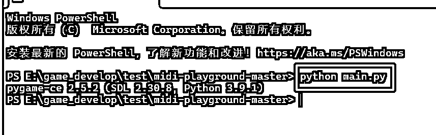

### 方法三：免安装包

直接下载免安装的即可，

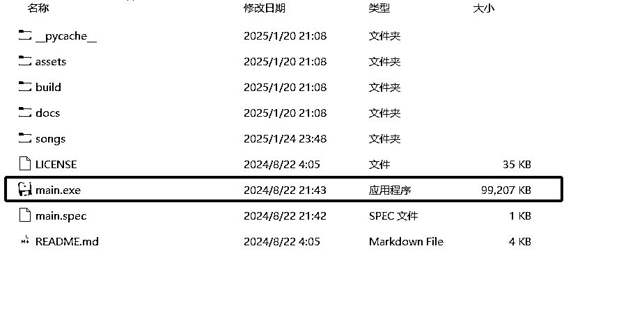

直接双击运行mian.exe即可！

不过大家注意，这三种方法各有优势，如果你用第一或者第二种的话可以修改源码，定制自己的产品。而第三种方法可能只能用，没法改。

## 2.2 游戏玩法

说明：本次我们以第三种方法下载的为例

### 第一步：启动游戏

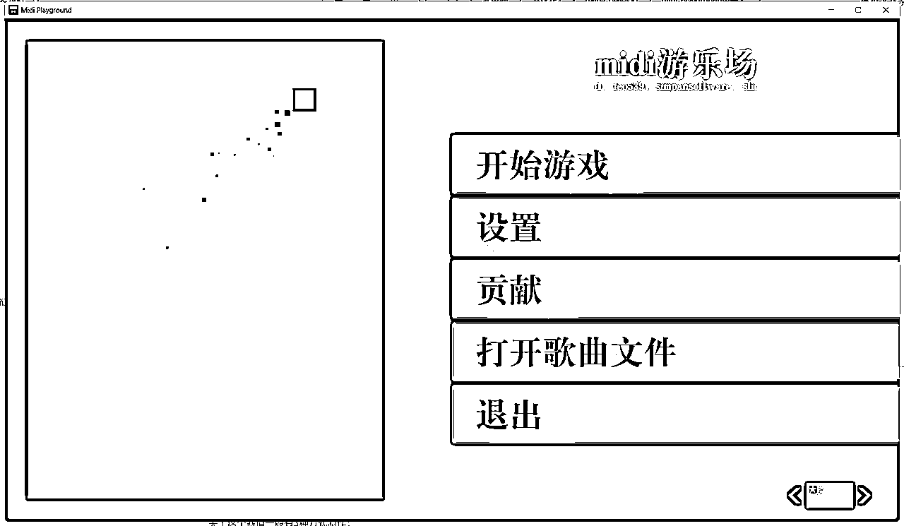

### 第二步：开始游戏，选择需要的音乐

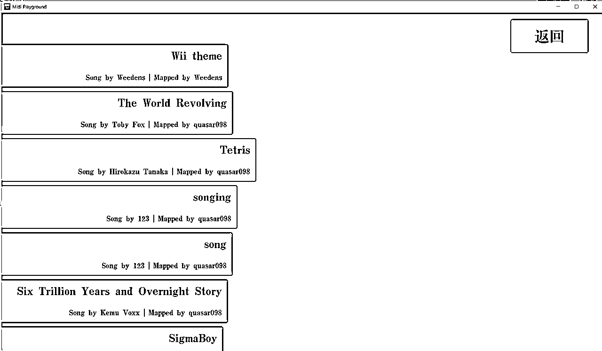

### 第三步：选择好音乐，开始游戏。

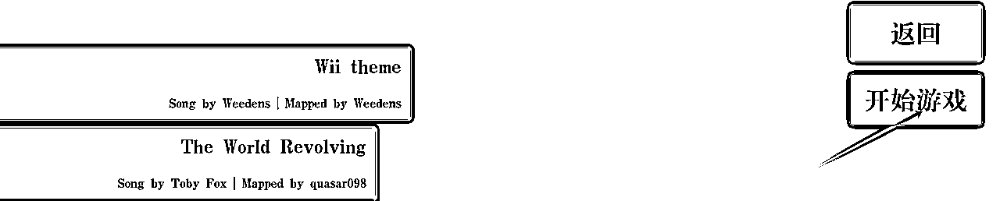

等待片刻后会自动加载

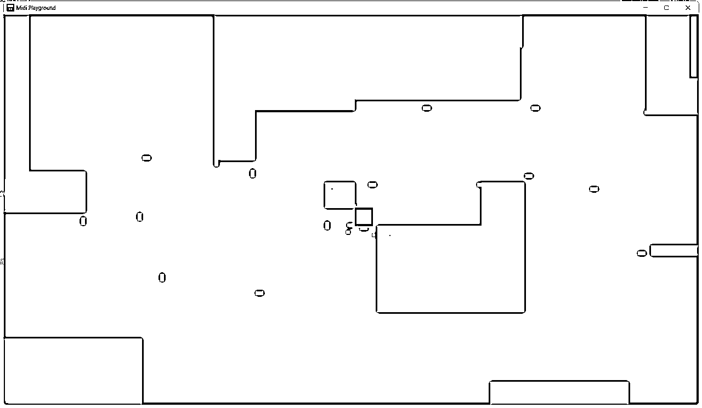

## 2.3 修改配置

这里可以修改游戏的模式以及小球的样式等等，如果你懂源码，可以自定义修改。

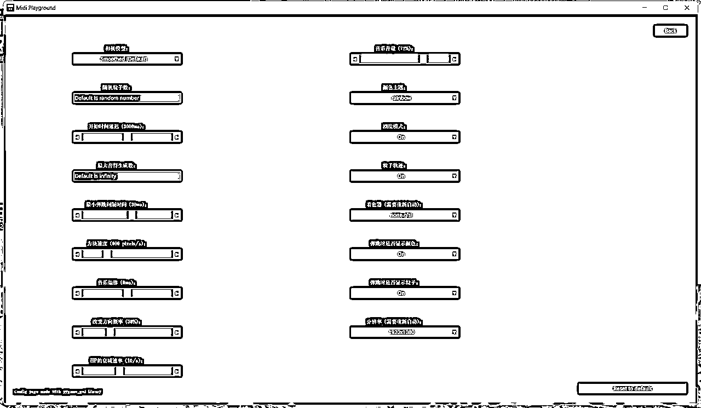

## 2.5 如何更换音乐

进入游戏根目录，选择songs

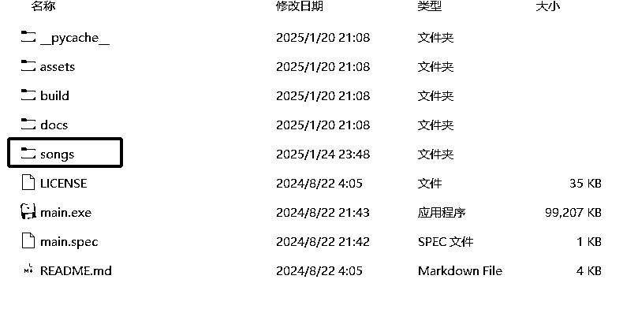

打开songs目录

以下就是歌曲文件

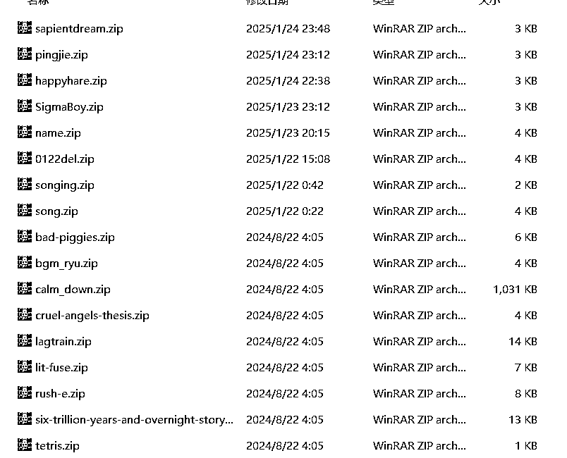

我们随便解压一个文件看看，里面包含一个音符.mid文件和json文件

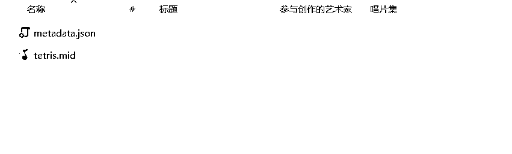

Json文件就是音乐的详细信息

```
{"name": "Tetris", "author": "Hirokazu Tanaka", "mapper": "quasar098", "audio_file": "tetris.mid", "song_file": "tetris.mid", "version": 1}
```

所以大家在更换音乐的时候就是处理好你要的音乐音符.mid，和Json文件一起打包zip放在这个文件夹即可！

# 二、视频处理SOP

这个赛道最重要的就是处理音乐问题，因为你的音乐代表的你创作的唯一性。

## 第一步：赛道音乐选择

关于这个赛道一般有3种方式制作：

第一种：找原创流行音乐，或者节奏感较强、或近期爆火的音乐

第二种：找到有油管里做好的爆款案例

第三种：用AI软件自己设计音乐（需要有音乐功底的人）

以下步骤为第二种的操作方法

## 第二步：音乐提取

下载你需要的音乐或者视频，导入剪映，分离音频，然后导出mp3格式。可以用uvr5或者剪映之类的先提取自己需要的声部。

## 第三步：音频删减

下载RipX DAW，链接https://hitnmix.com/


打开RipX DAW软件，导入你所分离的音频MP3。一般1min以内的几十秒就处理好了，时间较久的至少也要等几分钟。

打开后如下图所示

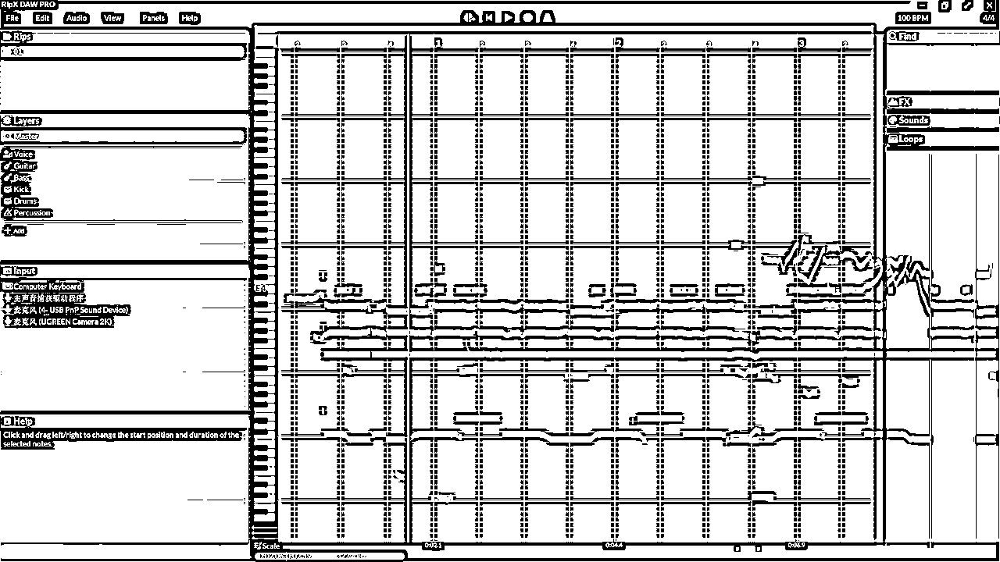

接下来，就是删减不需要的音乐，只保留主旋律音乐。如果是那别人的爆款视频可以考虑只保留“叮叮叮”的声音。如下图所示，删掉声音很轻很低的位置。如果自己不确定可以点击音道自己审查，直到符合你的预期。

注意：先把自己不需要的声部删，如果只要人声，就保留这个voice

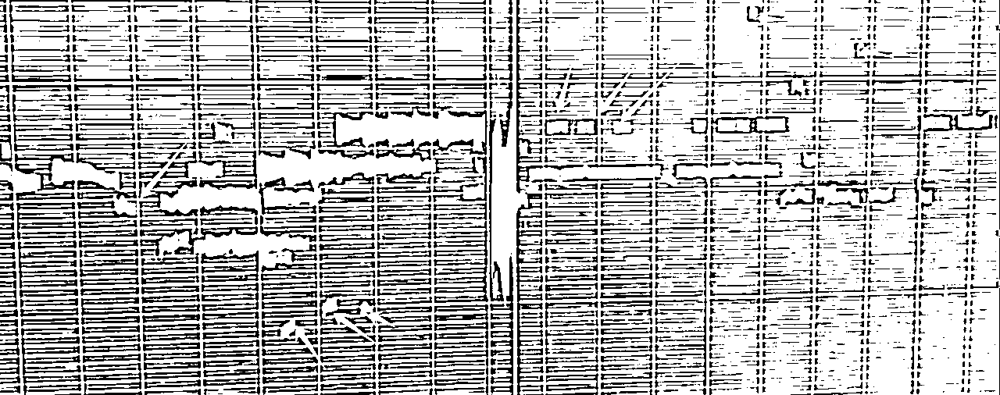

按照自己的需求做出来差不多是这样子的。

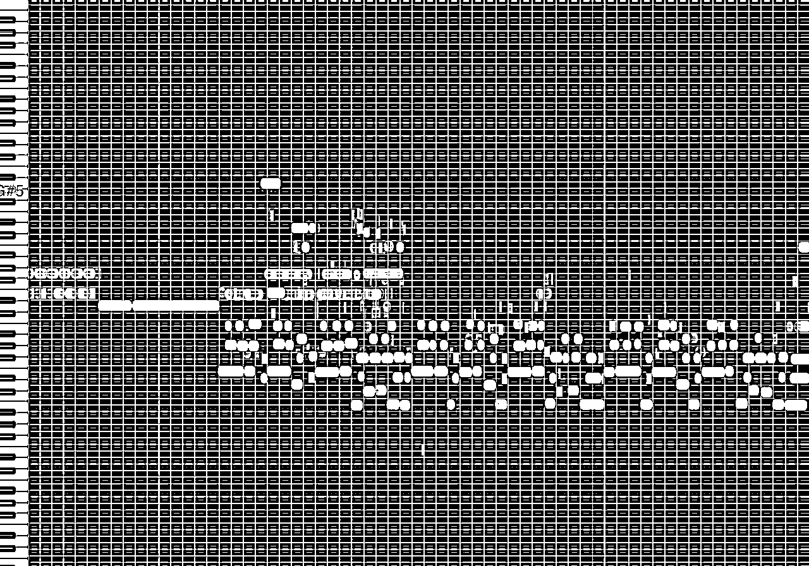

导出 Export成.mid格式的音乐

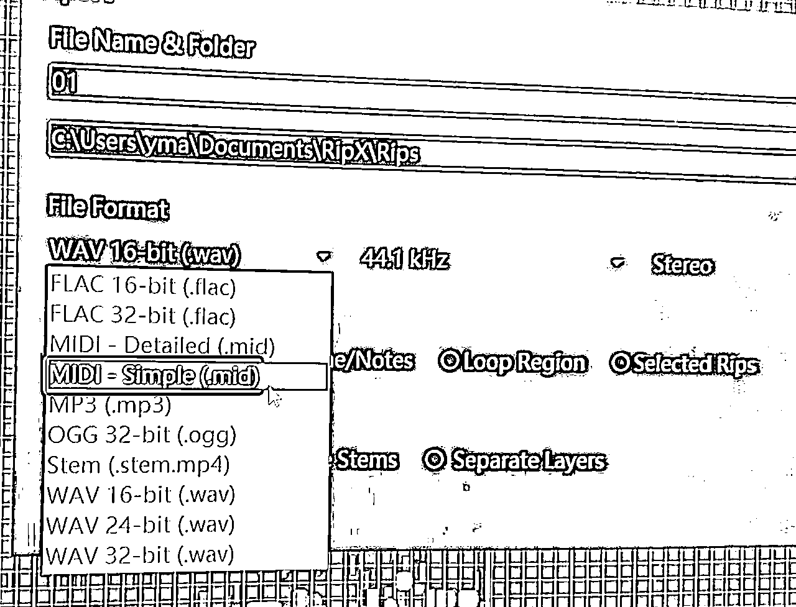

## 第四步：增加自定义音道，如”铛铛铛”

打开网站：https://signal.vercel.app/edit，并打开你刚才到出来的midi文件

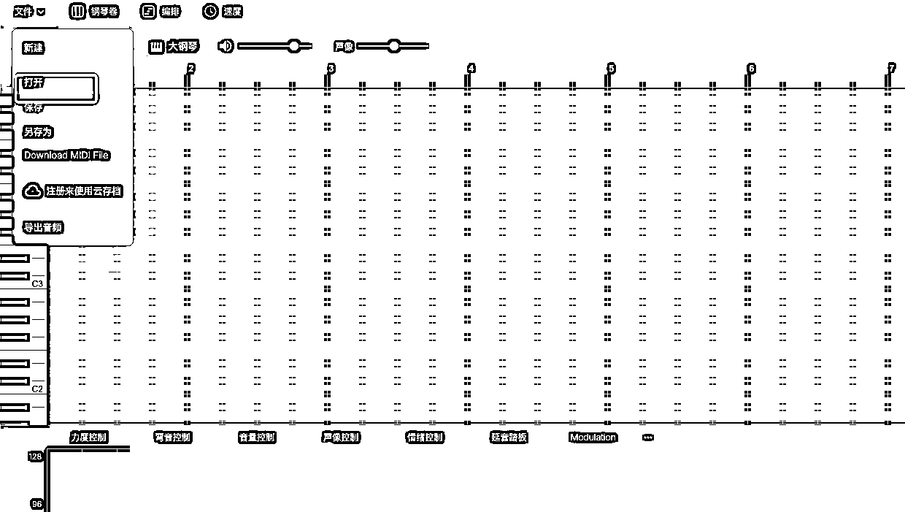

打开之后会显示这样的界面，左边是音轨，右边蓝色的他自动生成的乐器，你需要做的就是将这个蓝色地方做调整，直到满足你的需求。（下图不是很好的处理效果，暂时忽略）

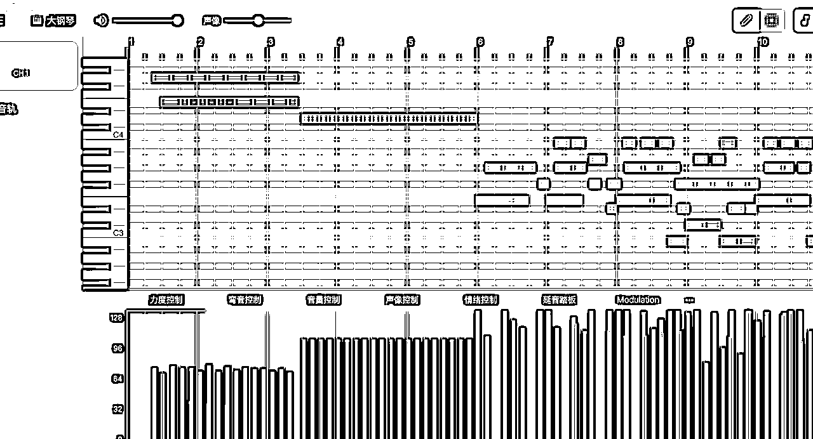

处理完成之后保存导出最终的 mid文件。注意还需要导出一份mp3格式的文件。其中mid格式的文件就直接打包成游戏所识别的压缩包，供游戏使用，而mp3格式的文件后期需要与原视频合并。

## 第五步：游戏后端处理

如下图所示，将mid文件和音乐信息脚本等一起打包为songing.zip放在游戏根目录的song文件夹。


完成之后打开游戏进行测试，如果效果可以就可以直接录制⏺️。

## 第六步：合并音乐

将第四步导出的mp3格式的音乐与原视频一起导入剪映，注意一定要匹配音符，然后一起导出最终版本的MP3格式的文件。

## 第七步：视频合成

重新打开剪映，新建一个页面，这里要导入三个文件：

1、将最终的MP3导入（合成的）；

2、游戏录制的画面导入（关闭原声）；

3、原视频匹配的位置导入（关闭原声）；

将3个文件做好匹配，然后一起导出即可！

# 三、运营与剪辑

## 3.1 素材从哪里找

动画直接拿他的剪就好

https://www.youtube.com/@CartoonGamesYT

# 四、效果分享

以下是我自己尝试组合的作品，请大家欣赏～

## 4.1 BeamNG + 音乐块

之前我分享过关于BeamNG游戏赛道的文章，大家如果对这个游戏不大熟，也可以二创别人的爆款+组合自己的游戏小球来实现。

如果不熟BNG的人可以访问：

## 4.2 节奏盒子 + 音乐块

## 4.3 知名动画 + 音乐块

ok，这个大家可以自行去查对标账号，有很多类似的场景！

暂时先分享到这里，以上，谢谢～