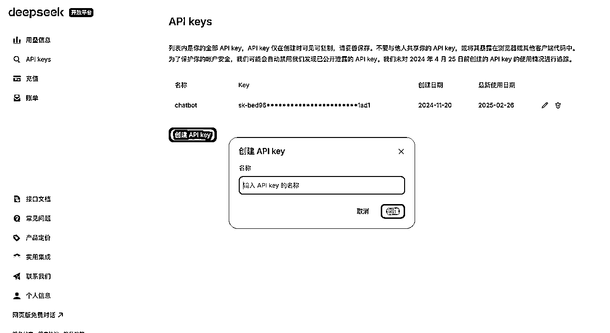

# 零代码+零基础+全AI：28天搭建塔罗付费站复盘

> 来源：[https://ojox2l5smt.feishu.cn/docx/KYNKdfJhzo8Gcmx2B7BcW2CCn0e](https://ojox2l5smt.feishu.cn/docx/KYNKdfJhzo8Gcmx2B7BcW2CCn0e)

#### 一、项目背景

2024年12，参加了生财有术的Cursor航海活动后，对于0代码实现网页非常感兴趣，希望打造一款属于自己的网页产品，我当时选择了塔罗的赛道练手。过程中踩了无数坑，但看到网站上线的那一刻，我觉得一切都值得了！我的网站叫 Tarot Whisper，可以在线抽牌，提供详细的解读功能～而且我还设计了付费会员功能，会员可以解锁更多玩法。页面设计也很用心，大家可以戳链接玩玩看：https://www.tarotwhisper.top/（以下就是我的主页啦，制作不易希望大家多多支持！）


为什么是塔罗牌？首先，塔罗牌作为一种古老的心灵工具，近年来在年轻人中逐渐流行，我身边有非常多的朋友，每年都要花大价钱算运势，所以我定价是9.9/月不限制次数！收到好多大家的正反馈好开心呀～


在社交媒体上，塔罗牌解读视频和文章常常获得高关注度。其次，塔罗牌市场的需求明确，许多用户愿意为个性化的解读和高质量的卡牌设计付费。我个人对塔罗牌充满兴趣，这种兴趣与商业价值的结合，让我看到了一个值得探索的机会。

作为一个零基础的技术小白，我的目标很简单：用最低的成本和最短的时间，打造一款能够落地的塔罗牌网页产品。从0到1开发这个网站的过程虽然很难，但也让我学到了很多。AI工具和零代码平台正在彻底改变技术创业的门槛！希望我的经历能告诉大家，只要敢尝试，就会有无限可能！也希望这个塔罗网站能为大家带来一些神秘的力量和指引~

#### 二、竞品调研与市场分析

##### 竞品调研方案

在开始项目之前，我对国内外多个塔罗牌网站进行了深入调研，其中Astrology是我重点参考的竞品之一。该网站提供了丰富的塔罗牌解读服务，但其每月8美元的会员费用较高，且国内用户访问受限。结合其他竞品的分析，我总结了塔罗牌网站的常见功能与用户体验，并找到了差异化切入点。

用户体验方面，竞品普遍存在以下问题：

*   卡牌交互不精美：许多网站的解读体验感较差。

*   付费门槛高：高级解读服务价格较高，普通用户难以持续消费。

*   访问限制：部分国外网站对国内用户不友好，访问速度慢或无法访问。

以Astrology为例，其优点在于功能全面、解读专业，但缺点也很明显：

*   价格高：每月8美元的会员费用对普通用户来说是一笔不小的开销。

*   本地化不足：网站主要面向欧美用户，缺乏对国内用户的文化适配。

*   技术门槛高：解读服务依赖人工占卜师，成本高且效率低。 基于竞品分析，我确定了以下差异化切入点：

*   全AI分析：通过AI技术实现个性化解读，降低人工成本，提高效率。

*   低门槛付费：采用单次付费或低价会员模式，吸引更多用户尝试。

*   本地化优化：针对国内用户的文化习惯和语言习惯进行优化，提升用户体验。

*   网页形式：无需下载，不占用手机内存，降低用户使用成本。

##### 对标品，每个月变现数据，流量来源如何查看？

大家可以尝试Semrush，Semrush 是一个功能强大的流量分析和 SEO 工具，支持流量来源分析和关键词研究。输入你想要分析的网站就可以查看数据了，如图：


1.  网站流量表现

*   自然搜索流量（Organic Traffic）： 每月约 111.6万（1.1M）访客，较之前下降了 2.5%。 这个自然流量是网站的主要流量来源，说明网站在搜索引擎上的表现还不错。

*   关键词覆盖（Keywords）： 网站覆盖了 438,820 个自然关键词，其中大部分可能是与占星术、星座相关的长尾关键词。

1.  流量来源分析

*   按国家分布：

*   美国（US）：占比最高，约 35% 的流量，月访问量 39.6万（396K），关键词覆盖 186K。

*   印度（IN）：占比 26%，月访问量 28.7万（287.2K），关键词覆盖 17.7K。

*   英国（UK）：占比 8.5%，月访问量 9.5万（95.3K），关键词覆盖 39.9K。

*   其他国家：占比 30%，月访问量 33.8万（337.9K）。

1.  网站权威性

*   权威分数（Authority Score）： 网站的权威分数为 59，说明它在行业内有一定影响力，但仍有提升空间。

*   反向链接（Backlinks）： 网站拥有 95.89万（958.9K） 反向链接，引用域名 16.2K，这些链接对网站的SEO排名贡献较大。

1.  变现潜力分析

基于这些数据，可以推测网站的变现能力：

1.  广告收入：

*   每月超 111万访客，如果通过广告联盟（如 Google AdSense）进行变现，按每千次展示收入（CPM）约 $5-$15 估算：

*   月收入范围：$5,000 - $15,000（约人民币 3.5万 - 10.5万）。

1.  付费服务或订阅：

*   如果网站提供占星术相关的付费内容、咨询服务或订阅，则可以通过高质量用户（如美国用户）进一步提升收入。

1.  电商或合作推广：

*   可通过星座周边产品、电商合作或联盟营销（Affiliate Marketing）增加收入。

1.  网站流量趋势

从右下角的趋势图可以看出：

*   网站流量在 2020年左右达到峰值，随后出现明显下降，尤其是最近几年（2022-2024年）。

*   这可能与市场竞争加剧、SEO策略变化或内容更新频率下降有关。

#### 三、打破技术恐惧：零代码工具的选择与使用

第一次玩代码的感受就是要快速实操小项目，累计一点小小的成就感！不要害怕什么都不会什么都不懂，可以参考cursor航海！感受一下一行代码也不写，2小时完整成一个网页插件的爽感！2小时发布第一个“像素魔术师”网站的快乐！（需要魔法🪄打开）https://pixel-magician.vercel.app/

##### Cursor魔法时刻：

###### 🌟小白版：一句话Prompt生成网页、Readme文档

```
找一个你喜欢的网页排版参考，发给cursor（如果你想好要什么样的排版，没有也行）
输入提示词：请帮我创建一个名为‘Tarot Whisper’的神秘塔罗牌网页，包含每日塔罗牌、每日爱情塔罗牌、是/否塔罗牌和深度解读三张牌阵功能，帮助用户洞悉运势、捕捉情感机遇、快速解惑并解读人生轨迹，主视觉采用暗色调星空背景，整体风格请参考apple这类顶级的互联网设计师的设计。请帮我梳理一份需求文档，什么技术来完成它？（如果你什么也不知道，可以和AI探讨，最前期就是看他输出然后学习）
```


###### 🌟经验版：实现一个真正的会员支付系统

虽然小白版的一句话非常好用，但是一旦项目开始变大，你可以看不懂代码，但是所有的流程逻辑，路由结构必须要自己清晰，否则后续的改代码就会出现很多问题！（踩坑很多次，不知道代码被cursor修改到哪里去了！）

💗 学会做一个产品经理应该做的事！（四步走）

第一、先梳理你的项目流程，每个功能模块，都要有一个详细的流程图。

以我的会员支付流程为例，先和Claude 探讨流程设计（探讨了好几版），可以让他给你输出可视化版本的。因为我是个人，没有办法直接接入微信或者支付宝（必须要注册企业），所以用了爱发电平台（同为个人的小白可以参考，后续商业化的部分会详细介绍）


第二，支付系统会需要用数据库存储付费用户信息，学会提前进行表结构设计。把需求发给cursor，让他帮你设计就好了！Prompt：“请帮我根据上述流程图设计一个表结构，我只需要完成基础的mvp功能，而且我使用的免费版数据库有额度限制，希望可以用到最小的存储空间。”

```
-- 激活码表 (activation_codes)
CREATE TABLE activation_codes (
    code VARCHAR PRIMARY KEY,         -- 激活码
    created_at TIMESTAMP DEFAULT NOW(),
    current_token VARCHAR,            -- 当前有效token
    token_expires_at TIMESTAMP,       -- token过期时间
    membership_expires_at TIMESTAMP,  -- 会员过期时间
    order_id VARCHAR UNIQUE           -- 关联订单号
```

第三，把设计好的流程图和数据库表结构放在README文档中发给curosr，Prompt：“请根据流程图和表结构生成前后端的路由结构，要求保持代码“高内聚低耦合”的编程方式，并给出前后端的接口文件标注！”（非常重要，我第一次写的时候不知道接口用来干嘛的，后面前后端连接的时候看了很久！提前规划好，后面就水到渠成！）

```
完整项目结构（后端举例）:

/src
├── app/
│   ├── api/                    # API路由
│   │   ├── activation/         # 激活相关
│   │   │   └── verify/        # 验证激活码
│   │   │       └── route.ts
│   │   ├── payment/           # 支付相关
│   │   │   ├── create-order/  # 创建订单
│   │   │   │   └── route.ts
│   │   │   ├── check-status/  # 查询状态
│   │   │   │   └── route.ts
│   │   │   └── webhook/      # 接收回调
│   │   │       └── route.ts
│   │   └── maintenance/       # 维护相关
│   │       └── cleanup/       # 数据清理
│   │           └── route.ts
│   └── ...                    # 其他页面组件
│
├── lib/                        # 工具库
│   ├── api/                   # API客户端
│   │   └── afdian.ts         # 爱发电API
│   ├── supabase/             # 数据库
│   │   └── client.ts         # Supabase客户端
│   ├── utils/                # 工具函数
│   │   ├── activation.ts     # 激活码
│   │   └── token.ts         # Token处理
│   └── types/                # 类型定义
│       ├── api.ts           # API类型
│       └── database.ts      # 数据库类型
│
└── .github/                   # GitHub配置
    └── workflows/            # GitHub Actions
        └── cleanup.yml      # 清理任务

```

第四，讨论你的主体设计和前端交互流程

每个项目不一样，可以探讨的很多，比如用户体验设计，视觉设计等，如下：

```
一、支付模块设计：

1、主体设计：
在spread/page.tsx页面
输入问题后 →
【大型塔罗牌浮现】(磨砂玻璃效果) public/images/payment/card-bg.jpg
塔罗牌可以优雅地翻转，显示不同的内容面

2、交互流程：

    进入页面（spread/page.tsx）
    ↓
    抽取3张牌(展示牌面)
    ↓
    输入个人问题
    ↓
【未激活状态】
    [塔罗牌正面显示]
         "您的问题已经唤醒了塔罗的力量..."（
         使用更高级的金色系：
                主色：#FFD700 (金色)
                过渡色：#FFF1B4 (浅金)
                文字阴影：更柔和的金色光晕
        //✨ 获得专属AI塔罗师解读
        //✨ 深入分析牌阵能量关联
        //✨ 提供个性化时间线指引
         [开启解读之旅] 按钮

    【点击后塔罗牌翻转，背面分为上下两部分：】
        上部分：✨ 我已有启示密钥（激活码输入框） [确认] 按钮（支持回车键）
        下部分：✨ 获取启示密钥（跳转爱发电）

3、视觉细节：
    使用烫金风格的字体
    加入星光粒子特效
    按钮使用半透明渐变效果
    加入柔和的光芒动画
```


##### 即梦AI+Stable Diffusion：自动生成塔罗牌

首先，直接告诉Claude / GPT /Deepseek，帮忙生成塔罗牌的提示词（图一）。所有卡牌保持你要的风格（参考提示词放在下面了）

然后，复制提示词到Monica，可以直接用Stable Diffusion3.5 （尝试下来最好用，但是需要额度）如（图二），以此类推就可以得到78张塔罗牌！

最后，如果你没有Monica会员，可以用即梦AI：https://jimeng.jianying.com/，每天有免费的额度。（图三）


```
[基础风格设定]
(masterpiece, best quality, ultra detailed:1.4),
中世纪神秘主义艺术风格,
垂直构图(2:3比例),
(borderless design:1.6), (no frame:1.6), (full illustration:1.5),
ornate mystical symbolism,
ethereal lighting,
神秘而充满力量的氛围,
(金箔装饰细节:1.2)

[力量牌核心元素]
(女性与狮子的和谐场景:1.6),
标准塔罗牌构图, 垂直对称布局,
(strength and courage scene:1.5)

[关键符号元素]
- (优雅的女性形象:1.6), 白色长裙
- (威武的金色狮子:1.6), 温顺姿态
- (无限符号∞光环:1.5), 女性头顶
- (盛开的红玫瑰花环:1.4), 环绕装饰
- (神圣光芒:1.4), 背景氛围
- (魔法能量流动:1.3), 氛围渲染

[色彩与材质]
- (纯白与金色主色调:1.5)
- (玫瑰红点缀:1.4)
- (柔和的光晕效果:1.4)
- (丝绸般的布料质感:1.3)
- (狮子毛发的金色光泽:1.3)
- (玫瑰花瓣的细腻质地:1.2)

[人物与生物描述]
- (优雅从容的女性:1.5)
- (平和坚定的表情:1.4)
- (温顺的狮子形象:1.6)
- (和谐的互动姿态:1.4)
- (抚摸狮子的温柔动作:1.3)

[场景氛围]
- (神圣庄严的背景:1.5)
- (柔和的光芒氛围:1.5)
- (力量与温柔并存:1.4)
- (神秘能量流动:1.4)

[场景细节]
- (飘逸的长裙褶皱:1.5)
- (狮子鬃毛的细节:1.4)
- (玫瑰花瓣的层次:1.4)
- (无限符号的光芒:1.4)
- (能量光束的流动:1.3)
- (金色装饰细节:1.3)

[象征元素布局]
- 上方：无限符号光环
- 中心：女性与狮子
- 周围：玫瑰花环
- 背景：神圣光芒
- 点缀：能量流动效果

Negative prompt:
(frame:1.8), (border:1.8), (framed:1.8), (bordered:1.8),
(card frame:1.8), (tarot border:1.8),
(low quality, worst quality, bad anatomy:1.4),
(missing woman:1.6), (missing lion:1.6),
(aggressive lion:1.5), (modern clothing:1.4),
text, watermark, signature,
cartoon, anime, 3d, sketch, digital art,
blurry, grainy, modern elements,
futuristic elements, sci-fi elements,
violent scenes, aggressive poses,
casual clothing, urban settings

Steps: 50
CFG scale: 8
Sampler: DPM++ SDE Karras
Size: 768x1152
Restore faces: True

```

#### 四、技术实现：从0到1搭建塔罗牌网站

##### DeepSeek API接入：构建智能问答模块

###### 普通版：基础问答功能的实现

登陆https://platform.deepseek.com/，找到充值，可以选择自定义充值（1块也可以），最近又恢复可以充值了，之前关了好久。


点击API keys，选择创建一个key，输入一个名字比如：chatbot，就会生成一个API key。找到图片中的【接口文档】打开，然后把信息告诉cursor。他就会自动帮你编写。

```
promopt：
调用deepseek 的接口，相关的文档如下：
@https://api-docs.deepseek.com/zh-cn/guides/multi_round_chat （复制

API key是：（刚才创建的API key）
并且保证这个API不要与他人共享，或将其暴露在浏览器或其他客户端代码中。
```



如果你调用deepseek之后要部署到vercel平台（不仅自己可以用，也要让别人可以用），需要告诉cursor帮你处理跨域问题。如果你不知道什么是跨域可以直接问cursor，他会给你解答。

1.  什么是跨域：

*   当网页从一个域名的网页去请求另一个域名的资源时，就会发生跨域

*   比如：从 tarotwhisper.top 请求 api.deepseek.com 的数据

1.  为什么本地开发没问题：

*   localhost:3000/spread 页面

*   localhost:3000/api/chat 接口

*   都是同一个域名(localhost)，所以不存在跨域

1.  生产环境为什么会有问题：

*   www.tarotwhisper.top/spread 页面

*   api.deepseek.com 接口

*   不同域名，浏览器出于安全考虑会阻止请求

部署的时候要配置环境变量，API key，和跨域的URL，千万不要忘！不然会部署失败。Preview部署使用临时域名，环境变量可能没有正确加载。


（之前真的是纯小白，啥都不知道，现在回头看轻舟已过万重山！）

###### 进阶版：流式传输与流式渲染优化

<h7>🌟Vercel 免费版的超时限制</h7>

因为我写了一个提示词比较长，整个响应过程超过了40s。cursor的免费版函数执行时间10s，而且用户等待时间过长体验感会很差，学到的解决方案是：

前后端都可以让cursor实现流式传输，可以增强用户体验感！并且在项目设置中打开流式传输！这样的免费版本的持续时间限制也会变成60s，对我来说就够用了！学会阅读平台文档很重要，一开始完全是自己摸石头过河，一定要打开平台的开关（cursor一直发现不了这个点，我研究了很久，在绝望中摸石头！）

### 普通模式 vs 流式传输

想象你要买10杯奶茶：

#### 普通模式

1.  店员说：请等10分钟，全部做好一起给你

1.  你：干等10分钟，期间什么都做不了

1.  结果：如果10分钟内没做完，你会生气离开（504超时错误）

#### 流式传输

1.  店员说：每做好1杯就先给你1杯

1.  你：边喝边等，随时知道进度

1.  结果：即使总时间超过10分钟，但因为持续有输出，你不会离开


##### Playwright自动化生成卡牌解读

<h7>🎉批量生成塔罗牌解读内容</h7>

特别想和大家分享Playwright技术！因为用起来真的非常爽！看着电脑自动操作帮你打工，如果是有搭建自己的工作流能跑起来就更完美了！因为塔罗牌的78张卡牌真的非常多，我人工生成完图片感觉都快死了，所以解读内容我就采用了自动化的技术，解读内容是78*3太多啦！

给大家看一下我的抽牌解读界面：


## Playwright自动化脚本

1.  启动调试模式的Chrome：

"/Applications/Google Chrome.app/Contents/MacOS/Google Chrome" --remote-debugging-port=9222

1.  登录Monica并打开GPT-4o聊天页面

1.  运行生成脚本：

cd scripts/generate-readings

npx ts-node ./generate.ts

1.  生成的内容会保存在：

scripts/generate-readings/output/tarot-readings.json

##### Supabase实战：数据库搭建


*   登陆https://supabase.com，创建一个你的项目。

*   找到project settings，点击DATA API，就可以获得你需要的所有API key，然后发给cursor（学会一个API调用，提示词就可以举一反三啦）

*   将之前规划好的表结构，发给cursor。把cursor生成的SQL 语句，粘贴到SQL Editor（左边栏第三个）的空白处，点击run，就可以看到表结构被正确创建了。


##### Postman测试方案：数据库API调试超好用方案！

自己生成测试用例错误太多了！不好用！一直模拟失败！

直接下载一个 Postman https://www.postman.com/downloads/，让curosr指导你测试就好了！非常简单而且一遍过。可以验证数据库写入是否正确。


#### 五、域名与服务器配置

<h7>Namesilo注册实操：$1.88首年优惠码获取指南</h7>

*   登陆注册：https://www.namesilo.com/

*   选择一个你要的域名搜索（因为vercel自动生成的域名没法在国内访问，我就买了一个）

*   找一个便宜的支付就可以啦支持支付宝！一年才$1.88！


 <h7>

<h7>Cloudflare解析设置</h7>

*   域名解析与CDN加速配置

我们可以把互联网想象成送信的邮局，Cloudflare就像个超级快递员：

📦 加速原理：

就像快递员知道所有小路，总能找到不堵车的路线（智能路由），让网站内容像坐火箭一样快到达你的手机/电脑

🔒 加密原理：

当网站给你发消息时，Cloudflare会给消息装进带密码锁的盒子（SSL加密），只有你的浏览器有钥匙能打开，坏人即使偷看到也看不懂内容

🌍 实际效果对比：

💡 小知识：Cloudflare在全球有285个"快递中转站"（数据中心），中国用户访问时会自动选择最近的站点（比如香港/东京），就像你去超市总会选离家最近的那个~

1.  打开Vercel官网 → 进入项目 → Settings → Domains

1.  输入你的域名（如：www.example.com）→ 点击"Add"

1.  此时会显示需要添加的CNAME记录（类似：cname.vercel-dns.com）


进入CDN控制台 → 域名管理 → 添加域名

*   加速域名：填写 www.example.com


1.  点击「添加记录」：

*   类型：选择 CNAME

*   主机记录：填写 www（如果想用根域名则填@）

*   记录值：粘贴Vercel提供的CNAME地址

1.  等待10分钟生效（像寄信需要时间）


#### 六、商业化与用户运营

##### 爱发电集成方案：用Webhook实现付费

*   为什么选择爱发电平台？

因为是个人，无法接入支付宝和微信支付（需要申请一些执照）但你又想实现商业化怎么办呢？这是个好地方！缺点是仅限国内访问哦！但MVP测试完全够用了！

https://afdian.com/album/248b4bb2c9b111e9a9bb52540025c377/92aa33b68b4a11e8aa6952540025c377


*   如何接入爱发电平台 ？

首先创建一个爱发电账号，选择设置-售卖商品-上架商品


然后商品创建完成，你就可以获得一个链接，让cursor将你的付费页面和这个url链接。


如果你想批量提供一次性的兑换码，可以在商品链接里添加随机回复，（我没有用这个）因为我是会员有时间限制，这个不合适，我还需要调用数据库自动生成激活码。


设置wehook链接，API接口文档发给cursor：https://afdian.com/p/9c65d9cc617011ed81c352540025c377


本地测试可以使用https://dashboard.ngrok.com/ +postman ，返回成功“200”的话这个支付链接就设置好啦！每当你有订单的时候wehook把订单消息传递给你，你在数据库生成一个激活码，用户自行查看激活码！整个付费会员模块就完成啦！（欢迎来购买试试）


# wehook和api的区别

爱发电提供了webhook和api两种方式为开发者提供便利。 webhook功能需要配置好url，每当有订单时，会请求配置的url；API功能需要开发者通过token生成sign签名，主动请求接口查询历史订单

Webhook（网络钩子）：

*   就像是一个自动通知系统

*   平台主动"推送"消息给你

*   好比快递员自动给你发短信

*   不需要你主动去查询

*   实时性很强

🕵️ API（应用程序接口）：

*   就像是你主动去询问信息

*   需要你自己发起请求

*   好比你主动去快递站查询包裹

*   你要主动发送请求

*   灵活但不那么实时

举个生活中的例子：

*   Webhook：快递员自动发短信通知你

*   API：你自己打电话问快递员"我的包裹到哪了"

#### 七、营销推广与用户增长

1.  内容营销策略

*   如何通过社交媒体吸引目标用户 （很失败） 发布了小红书！但是账号权重太低啦需要持续发布！运营和增长我觉得需要另外的持续学习！有大佬给一点指导吗！欢迎交流～希望这次航海可以学到相关经验～（打算去AI自媒体！有没有一起的小伙伴～） 32 乔木的AI灵感宇宙发布了一篇小红书笔记，快来看吧！ 😆 FTu7F2QjLh3WeQF 😆 http://xhslink.com/a/wJQ6bj7b2a46，复制本条信息，打开【小红书】App查看精彩内容！

1.  SEO优化与流量获取 （待完成）

*   网站SEO的基础优化技巧

*   如何通过关键词获取自然流量

1.  用户反馈与迭代优化 （待完成）

*   如何收集用户反馈并改进产品

*   持续迭代的重要性</h7>