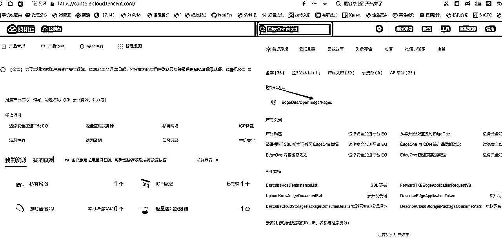

# 分享个好东西，无需服务器和编程经验，教你用 搭建Deepseek搭建一个自己的网站（从搭建到发布，完整教程）

> 来源：[https://b121w2zgwyx.feishu.cn/docx/Kr7UdQgAgoV8Wrx8uHQcvo4Cn0g](https://b121w2zgwyx.feishu.cn/docx/Kr7UdQgAgoV8Wrx8uHQcvo4Cn0g)

DeepSeek现在很普及了。大家都知道，DeepSeek R1 在代码和推理上很厉害。所以有很多人都尝试用它做编程，写些小玩意儿，反馈也都不错。

但是，程序并不是搞定了编程就完事了，还有很多底层的东西，普通人要想介入，还是有一定难度的。

就比如说今天我要说的网站搭建；不是说代码写了就好了，一个正常运行的网站，还需要涉及域名，服务器等等一些东西，你才能在网页上看到网站的展现；

所以！今天，我要给不是程序员，却想轻松搭建网站的朋友，介绍两个神器，教你轻松搭建属于自己的网站！

# 一、环境部署

如果不是程序员，可能看到这个就觉得一头雾水，似乎是一个很麻烦的东西。不过！今天我给大家介绍个工具腾讯云的EdgeOne Pages，只需简单几步就能搞定网站运行所需的东西了。

## 1、首先打开腾讯云

https://cloud.tencent.com/ 登录一下，没账号的注册一下。

## 2、搜索一下资源 “EdgeOne pages”

如图所示在搜索框输入EdgeOne pages， 就可以找到入口，点击进入：

## 3、连接 Git 仓库

首次访问时，需要点击页面上的“立即开通”。

然后部署 Web 应用程序（网站）的第一步是连接您的 Git 仓库。这一步可以让环境与代码直接关联，后续会拉取git仓库的代码自动部署。

绑定 Github：在控制台页面，点击“绑定 Github”以链接您的仓库。

授权 Github：授予 EdgeOne 访问您仓库的权限。这一步会跳转github，如果您还没有github需要注册一下账号，这里有个点需要耐心，那就是国内打开github比较慢，而且不稳定。打不开的多试几次。如果会科学上网的话，会好很多。

选择仓库：选择您要部署的仓库或授权所有仓库。

## 4、创建项目

授权成功之后，我点击创建项目

如果你已经有自己的代码，可以选择自己的代码部署，不过我们作为小白用户，基本是空仓库了，我们可以直接选择模板创建，我这里选择Vue项目，因为这个是比较主流的前端框架。小白用户不用管它是啥，直接选就对了！

EdgeOne会选择vue模版代码，自动创建github仓库和项目，这里我们起个名字，我就叫 vue-mywebsite吧，然后点击立即创建。

项目就会自己开始构建和部署了。等待出现下面的页面，部署就成功了，我们可以点击预览

点击预览，然后点击里面的链接

这就是我们部署的网站了

# 二、网站开发

到前面一步，我们网站虽然好了，可是这又不是我要的页面，那怎么办呢？那当然是要让我们的DeepSeek出场啦，如果大家是知道AI编程的，其实不用我说，大家肯定就知道要用Cursor来完成代码了。

但是Cursor收费呀！我今天要推荐给大家的是字节刚发布的国内可用的AI编程工具，它搭载了Deepseek模型，目前属于开发版 ，完全免费。

## 1、下载Trae工具

https://www.trae.com.cn/

https://www.trae.ai/ （哎呀，做到后面的时候发现国内版真的太难用了，还不完善，建议试试国际版，也是免费，就是注册需要魔法）

点击立即下载，去下载安装工具，安装完成，打开工具，第一次运行，需要选择配色 和导入配置啥的，随便选都行，我因为安装过了没法再截图了。

然后，第一次打开还会要求登录，大家跳转登录，没账号的直接手机号注册，都很简单。

## 2、拉取我们部署的项目

前面环境部署的时候，其实已经有了基础的代码了，在我们github的仓库里，我们进入进入EdgeOne我们之前创建的项目里面点击这个main 这个地方

然后进入github的项目地址，我们按照如下指示复制一下仓库地址

接着打开 Trae工具，选择克隆git仓库

然后将前面复制的地址添入输入框中，然后点击那个地址，如图：

接着，选择一下你项目要保存的本地目录完成之后，工具会自动拉取项目代码，拉取完成，点击打开即可

对了，工具提示是否信任的时候，都选信任就行了。

## 3、正式开发

到此为止，开发准备工作已经完毕了，接下来我教大家做个示例的简单站点。比如说，我现在需要做一个漂亮的个人名片网站；

我也不知道要怎么做，总之就让AI自由发挥吧！我们进入Trae的Builder模式，输入以下内容：

这是一个vue模版项目，我叫陈序员大康，我需要做一个 个人介绍名片的网页，现在需要你帮我构思一下这个页面的大体结构包括文案的设计，以下是我个人的介绍，请你根据这些信息，帮我设计主页=== 10年程序员，爱好看书，还有音乐，目前正在研究AI，主要研究AI+RPA如何给我们打工的。目前开发了许多自动化工具备受大家喜爱；并且创建了 个 AI+自动化的交流群，欢迎大家加入；===

我们选择 deepseek R1模型

对了 Chat 模式和Builder模式的区别就是，Builder模式可以直接帮你写代码，chat就是聊天的方式告诉你；

我们看到工具已经初步进行了开发：

选择接受，就是接受AI的本次修改，选择拒绝就是废弃AI的修改，我们选择接受。

接下来就是预览和各种优化修改了，总之就是有报错就扔给它，它就会给你改，哪里不满意就告诉它。

## 4、补充最新方案，刚发现的，推荐大家试试

# 三、自动发布与预览

正常呢，我们开发时，最好是搭建node.js 环境，这样比较便捷。如果不懂的话，一样的，可以在工具里直接问AI，让它教你。

我现在要说的是，如果实在是懒得折腾的话。可以直接将改好的代码，部署到我们前面腾讯云的环境上进行查看；

## 1、新建钩子

如图所示进入你的EdgeOne项目，按如下创建一个钩子

## 2、将钩子配置到github

我们点击复制刚才创建的钩子api

然后进入我们的github项目

然后把我们复制的api地址添入下面的输入框中，点击Add webhook

这两步的操作的意思就是，将项目的部署跟我们代码库的变更做绑定。只要我们代码变更了，就会触发腾讯云的EdgeOne自动发布项目，我们通过之前的预览地址就能看到页面变化了；

## 3、测试和预览

接下来回到我们的工具里面的本地修改，将我们刚刚的修改同步到github上，打开Trae

在消息框输入，本次修改的内容，然后点击提交和推送，代码就会推送到github。如果只是点击提交，则只是保存到本地。如果需要直接部署到EdgeOne上面，就选择提交和推送。

然后等待一些时间，看到这个运行中，说明部署成功，我们去预览一下

看，一个简单的单页面网站就做好啦：

页面很简陋，大家可以用AI进一步调优。

## 4、绑定域名

由于EdgeOne的域名访问是有时效的，如果大家需要长期使用的情况，建议买一个域名，然后绑定域名，这样你的网站就可以一直公开访问了。

# 四、特别补充说明

由于我有比较深入的尝试了一下Trae的国内版，目前的效果不是很理想，一方面很慢，一方面写的都是问题；大家了解了解就是了。我的页面是由Trae的国际版做的，因为国际版用的claude 3.5。能力还是会更强的。

所以我建议，有条件的用AI写代码时，首选Cursor，还有windsurf也行。

实在不行，也得用Trae的国际版；纯小白用国内版是搞不出来页面的......