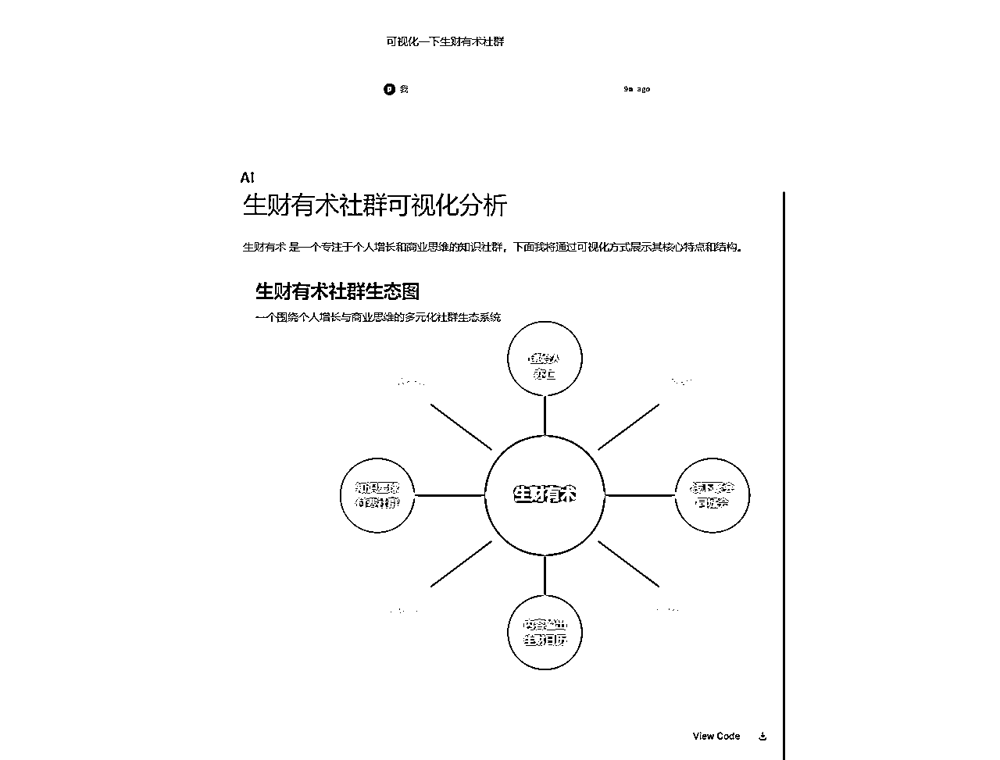
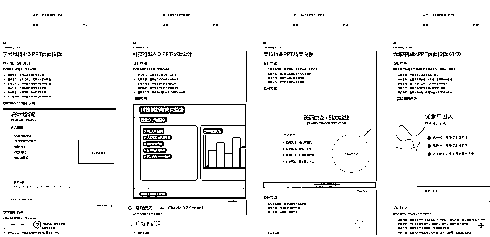
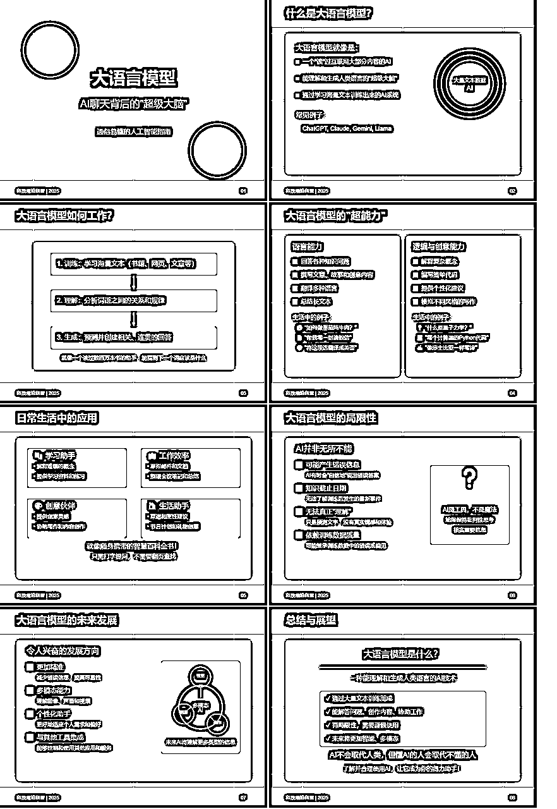
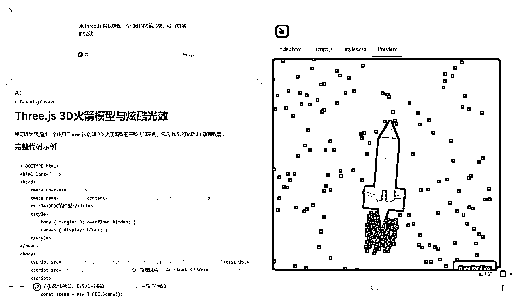
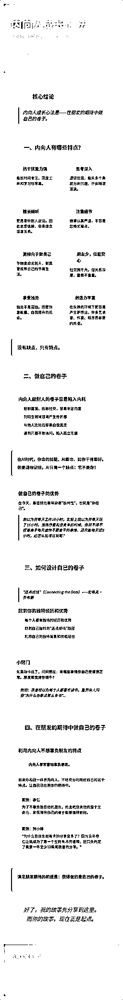
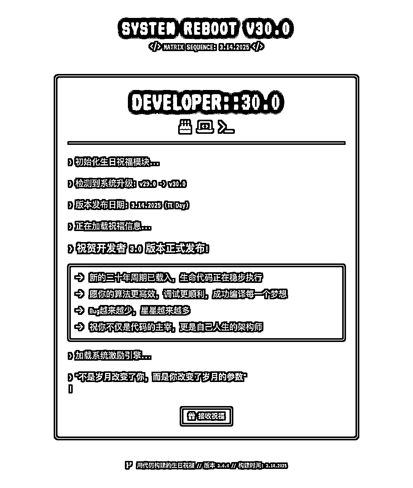
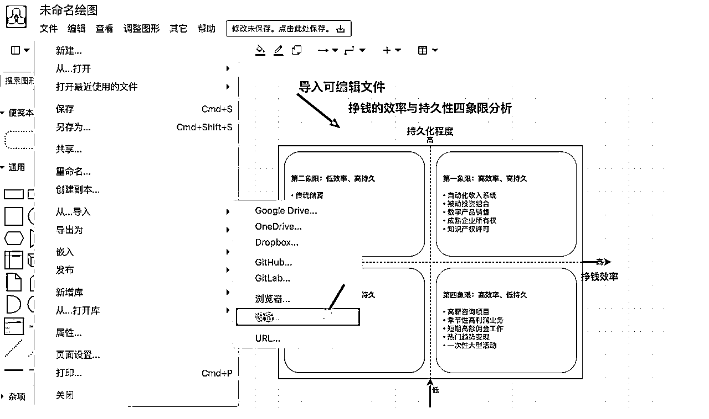

# Claude 3.7 画图的几个例子

> 来源：[https://vo2ca68sdm.feishu.cn/docx/KuMadvdMdoE33LxEhxicWeQ9n3d](https://vo2ca68sdm.feishu.cn/docx/KuMadvdMdoE33LxEhxicWeQ9n3d)

Claude 3.7 的画图能力可谓是一骑绝尘。这篇文章会分享一下我收集整理以及自己挖掘到的各种使用 Claude 3.7 提示词进行可视化的例子。

说明一下，这里的画图能力并不是像 midjourney/SD 一样“画”一幅画，而是用基于 SVG/HTML/XML 等文本编码的方式进行图表绘制。

## 最简单的指令：可视化xxx

```
可视化（物品、概念、书籍、电影...）
```

可以说是说最简单最基础的指令了：



### Flowith 画布分支

可以基于当前内容进行分支编辑，对比看看不同prompt带来的改进：


### 使用 Inkscape 编辑 SVG

这里提一句，画的 SVG 可以用 https://inkscape.org/ （免费开源，win/mac 可用）进行编辑：


### 使用 PPT 编辑 SVG

还可以导入到 PPT 里进行编辑：


## 基于 SVG 模板制作 PPT

### 制作模板

```
请你创建一个4：3的页面模板，模拟PPT，遵循设计的最佳实践。
```

先制作一个模板（16：9也可以，不过画布显示不太友好我就改成4：3了）：


### 更改模板风格

可以基于模板进行变种：



### 基于模板制作 PPT

然后挑选一个喜欢的模板开始制作：

```
基于这个模板，生成一个8页的PPT，内容是像普通用户介绍一下大语言模型，内容要生动有趣浅显易懂。
```



```
用这个模板帮我生成一个 8 页的 PPT，介绍一下道德经。
```


还记得吗？我们可以直接在 PPT 内加载并转换成可编辑的形状：


## 基于 Three.js 绘制 3D 图

### 画一个火箭

```
用 three.js 帮我绘制一个 3d 的火箭形象，要有炫酷的光效
```



### 画一个动态视角的城堡

```
绘制一个城堡，并且视角动态变化
```


### Three.js + Runway 制作视频

还有这个玩法，但是我没试过，贴在这里留给感兴趣的人。

## 构建基于 HTML 的可视化卡片

### 普通版本

```
用html帮我生成一个手册，介绍一下常见的prompt编写技巧。可以用cdn，界面要现代化，遵循UIUX的最佳实践，使用响应式布局。
```

### 附带上下文版本

找了一篇小排老师的文章，生成效果如下：



### 构建生日卡片

```
请为一位即将在 3 月 14 日迎来 30 岁生日的程序员生成一段可独立运行、可直接保存为 HTML 文件并在浏览器中打开的页面代码，作为独一无二的生日祝福。页面应包括以下要求与元素：

1\. 风格与主题：
   • 整体使用黑客帝国 (The Matrix) 风格的 UI/UX 设计，突出「神秘感」、「矩阵风」和「未来科技感」。
   • 使用 Tailwind CSS 和 Font Awesome 的 CDN。
   • 在视觉上呈现黑暗背景搭配绿色或荧光色系，突出高对比度，保持良好可读性和访问性。

2\. 内容要点：
   • 明确表达「30 岁生日」以及「3 月 14 日」这两个核心信息，并设计以「程序员」身份为主题的祝福文案。
   • 可以添加合适的自定义文案，突出独特的祝福氛围。
   • 参考黑客帝国风格，可在合适位置插入一些霓虹灯、未来感的元素或字符雨 (Matrix Rain) 效果等。

3\. 结构与技术细节：
   • 使用语义化的 HTML 标签（header、main、footer 等）；若有必要，可使用少量 JavaScript 提升交互。
   • 通过 Tailwind CSS 的实用类 (utility-first classes) 完成主要的样式控制，不必冗余自写 CSS。
   • 集成 Font Awesome（可添加适合主题的图标，如编程相关或酷炫科技图标）。
   • 需包含完整的示例 HTML 结构（、、、），包括 meta viewport 等必需标签，确保在现代浏览器和移动端浏览体验良好。

4\. 设计与交互：
   • 界面适配多端设备（PC/移动端）。
   • 页面内可以简单地展示个人信息、生日祝福文字、主题装饰等；如需插入动画或特效，可在代码中简要说明其作用。

5\. 交付形式：
   • 最终输出应当是一段可直接复制到本地并命名为「birthday.html」后打开即能运行的完整静态页面代码。
   • 如有额外的解释，可以附在注释中，或在输出生成完后附加写简要说明。

根据以上要求，请生成符合黑客帝国主题、体现「30 岁」「3 月 14 日生日」信息，且带有 Tailwind CSS 与 Font Awesome CDN，具有独特祝福文案、可直接运行的完整静态 HTML 页面代码。

```



## 构建 DrawIO 可以解析的 XML

### 四象限

这个也是来源于日推。

```
写一个关于挣钱的效率和持久化程度的四象限整理 xml，结果以可在线编辑的 drawio 格式输出！
```

把生成的内容保存成 xml 文件，然后用 drawio 打开：



## 基于 HTML 构建手写风格可视化笔记

### 可视化笔记

这个prompt的来源是日本的一个推友，在中文自媒体圈子我还没有看到有人在用：


原始 prompt：

# グラフィックレコーディング風インフォグラフィック変換プロンプト

## 目的

以下の内容を、超一流デザイナーが作成したような、日本語で完璧なグラフィックレコーディング風のHTMLインフォグラフィックに変換してください。情報設計とビジュアルデザインの両面で最高水準を目指します

手書き風の図形やアイコンを活用して内容を視覚的に表現します。

## デザイン仕様

### 1\. カラースキーム

### 2\. グラフィックレコーディング要素

*   左上から右へ、上から下へと情報を順次配置

*   日本語の手書き風フォントの使用（Yomogi, Zen Kurenaido, Kaisei Decol）

*   手描き風の囲み線、矢印、バナー、吹き出し

*   テキストと視覚要素（アイコン、シンプルな図形）の組み合わせ

*   キーワードの強調（色付き下線、マーカー効果）

*   関連する概念を線や矢印で接続

*   絵文字やアイコンを効果的に配置（

*   など） 3\. タイポグラフィ タイトル：32px、グラデーション効果、太字 サブタイトル：16px、#475569 セクション見出し：18px、#1e40af、アイコン付き - 本文：14px、#334155、行間1.4 - フォント指定： ```html