# 宠物取名网站的思考和分析

> 来源：[https://p76vqogctb.feishu.cn/docx/RMRYdGSlQoEN0mxzct0cY7bFnlc](https://p76vqogctb.feishu.cn/docx/RMRYdGSlQoEN0mxzct0cY7bFnlc)

# 开篇

这篇笔记是接续我加入生财的圈子后发的第一个帖子的后续。当时纪钟老师在评论区问了我几个问题：

刚加入就能分享真的太棒了，但是比起一个好的 idea，我们更要关注的是自己要打造一套怎样的商业模式，这里强烈安利小排老师的这篇文章，市面上有宠物取名的应用吗？用户体量如何？他们的变现方式是怎样的？AI 在其中起到的作用是功能？噱头？还是效率？期待看到你更多的思考和输出～

我确实当时没有想这么深入，只觉得要快速上手做一些什么事情出来。以便我能更快和更好的融入这种创业者的模式。于是就有了这一次的探索和总结分享出来。

# 国内外宠物取名相关的网站

1.  宠物名字产生器 https://www.namechef.co/cn/name-generator/pet/ 。

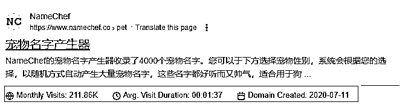

四年前创建的一个网站，是工具类的网站。目前的月访问量是2千多。主要靠广告来赚钱，

每月的广告利润大概估算：

除宠物名字可以生成外，还可以生成其他类型的名字，例如：中文名，日文名，韩文名，英文名，游戏名，账号名等。

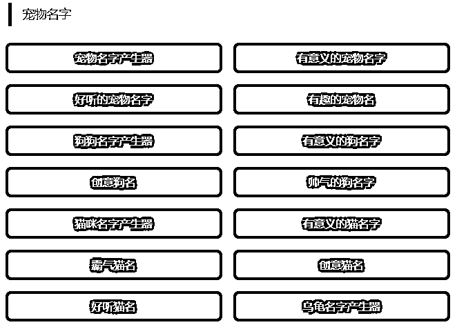

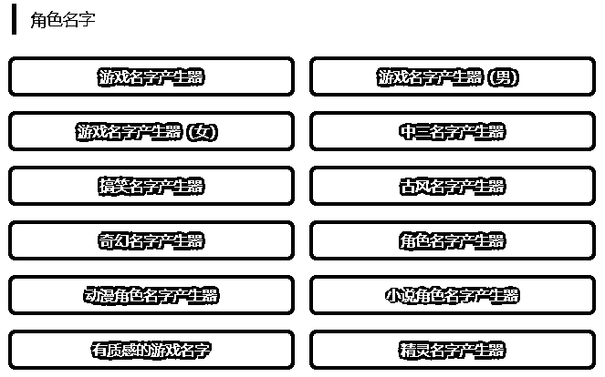

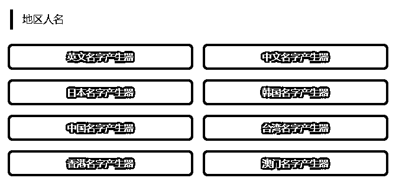

按这个流量和收入来看，年收入在5338元，扣除服务器和相关的运维成本费用后几乎不盈利。

1.  PureCalculators:Calculators for students, professionals, and researchers to advance your research and career.

这本身是一个做各种计算器的工具类网站，也提供了给宠物取名的功能。网站本身也是靠使用计算器的用户浏览广告来获取收益的。

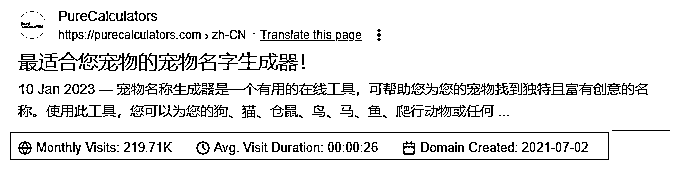

其年收入和上面的网站差不多。

1.  www.randomlists.com

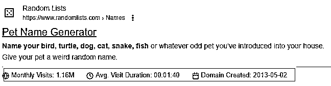

各种随机生成系列的网站，提供了给宠物生成名字的功能。但只可以随机生成，无法按照自定义进行个性化设置。适用于不想动脑筋，不需要有个性化的用户和场景，主打一个有的使用场景。

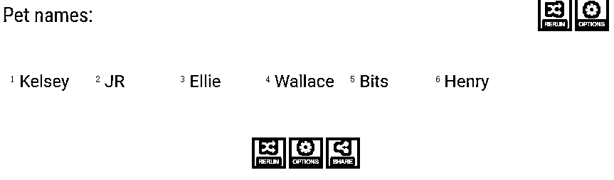

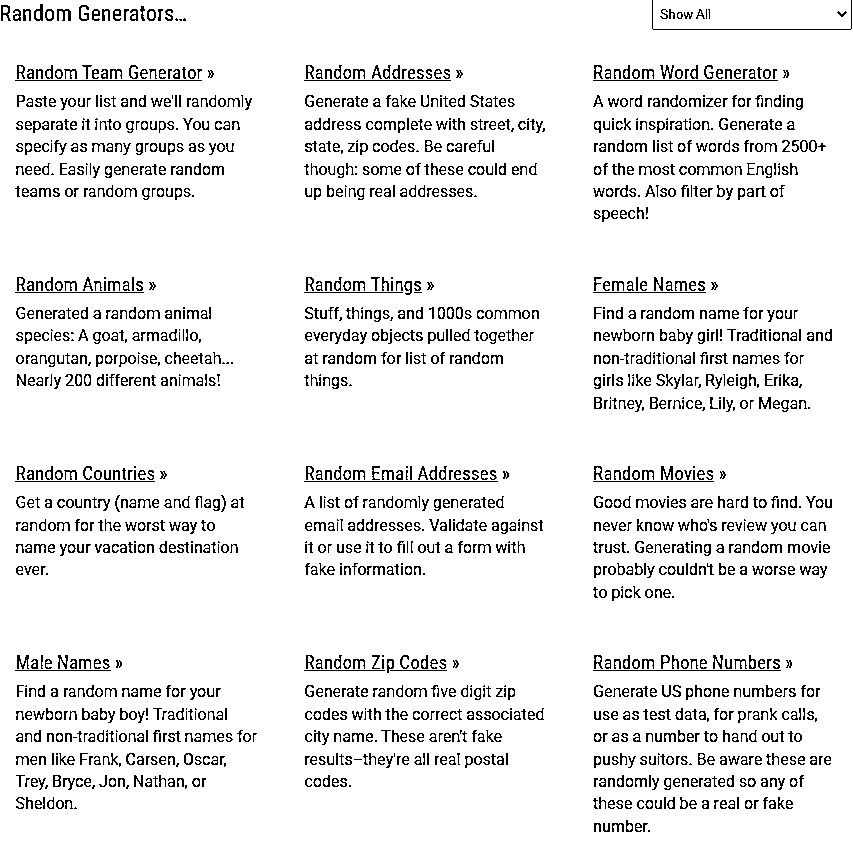

还可以随机生成小孩名字，邮箱地址，GIFs 等其他功能，靠广告来赚取收益。

1.  https://www.fantasynamegenerators.com/

网站创建的时间比较早，流量也还不错。

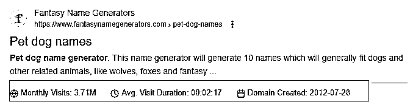

网站内容分析：

有各种名字的生成，书名，桥名、人名，动物名等，相当于一个名字类的百科全书。除此之外还有一些小工具提供了生成例如：icon，

这个网站开始要转型做一些工具来获取更多的流量来增加额外的收入：

https://rollforfantasy.com/tools/flag-creator.php， https://rollforfantasy.com/tools/map-creator.php。

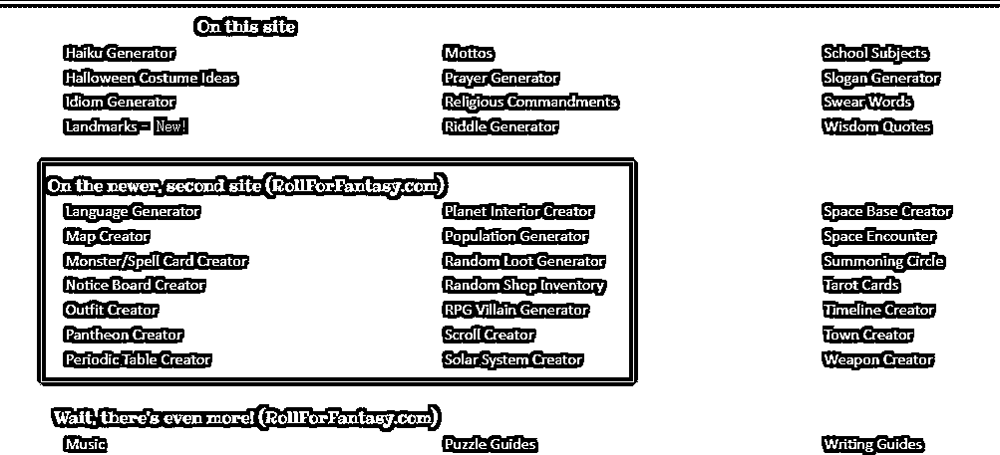

大概算一下流量和收入：

1.  https://www.yeschat.ai/

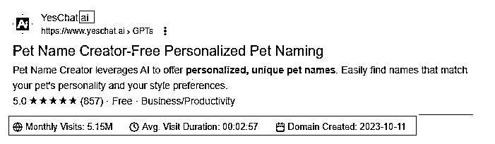

这个网站本质上是一个AI工具类的网站，提供了AI 协作助手功能。用户通过注册账号和订阅会员服务来使用提供的各种功能。

会员的订阅费用如下，不确定是否赚钱还是不赚钱。借助AI的热值网站流量还是挺高的。目前没有接广告。

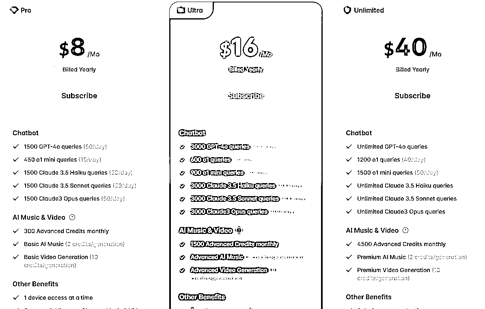

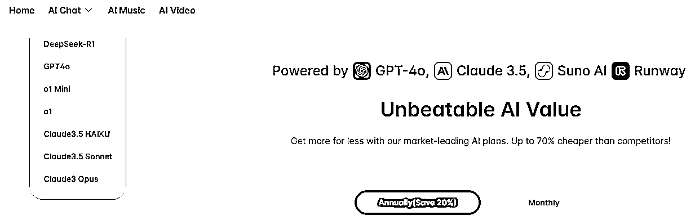

1.  https://www.petplace.com/

为什么这个网站要在这里提到呢？最重要的一点是它提供了一个pet insurance comparsion. 我想这个是在国内暂时没有的功能。应该是一个可能的新风向。

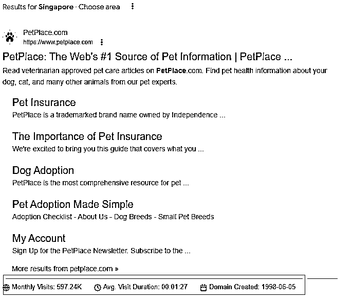

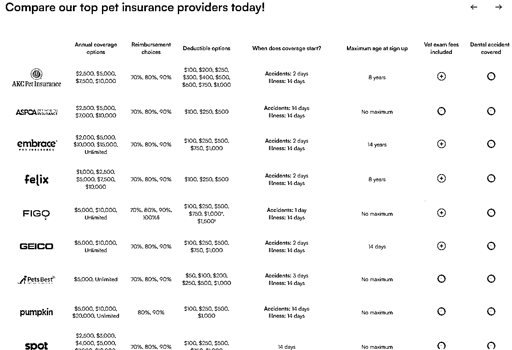

网站的访问量不算高。网站目前没有接广告。收入应该是靠卖保险来赚钱。无法预估。

# 宠物类型网站的盈利模式

这里面又有几种不同的模式，下面分别来说一下：

## 宠物电商

### 波奇网或者跨境电商独立站

这类网站主要是通过销售商品来赚钱，不属于我所在的赛道，不在进行具体分析。

## AI 工具类的网站

### www.yeschat.AI

这种类型的网站主要是买会员订阅服务费来赚钱，给宠物取名属于AI工具的内容输出范畴。现在有比较多的人在这个赛道在做了。其实是在买AI工具。

## 工具类网站

通过对这类网站的内容探索和流量分析来看，给宠物取名只是网站的一个吸引用户访问的途径，免费使用，毕竟取名字的功能不是刚需或高频的需求。而其他类型的免费的功能也是同样的逻辑，来吸引更多的用户使用网站从而增流来赚取广告费收入。

# 总结

当我再次深入拜读了刘小排老师的《AI编程赛道第一课：Build a business , not an App》文章后并对照我的分析后发现跟我之前预想的完全不一样。虽然这些分析可能还只是非常肤浅和表面的解读。但我觉得我仍旧学习到了不一样的东西：

1.  当你有一个想法的时候要学会分析和判断是否值得做。 这些方法已经包括在亦仁大佬的文章《如何判断一个项目值不值得做？》，需要更深入学习和思考并运用起来。

1.  你的产品是否能赚钱和你能做出来一个产品是完全不同的两回事。我们不能仅仅从技术层面去考虑项目或者产品的可行性。

1.  继续跟刘老师的这篇文章来实践尝试《AI编程赛道第一课：Build a business , not an App》。

1.  通过收集相关数据和分析整个过程给了我更多的思考和了解如何对一个项目进行拆解和分析。算是为三月份的航海提前储备了信心。