# AI评测：清华VS北大DeepSeek干货，谁更硬核？（附资料下载）

> 来源：[https://w91h2gmtrn.feishu.cn/docx/KzqedUUa5o7y70xreJscKN3OnqY](https://w91h2gmtrn.feishu.cn/docx/KzqedUUa5o7y70xreJscKN3OnqY)

大家好，我是乔帮主。随着DeepSeek大火，清华大学推出了5个关于DeepSeek主题的实践干货，这可是市面上90%的人都不知道的宝藏级干货。内容价值，甩一些所谓DeepSeek付费课程几条街。

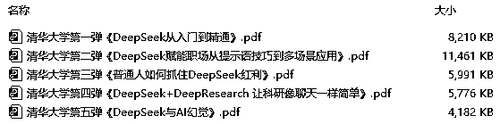

（文末可自行下载此资料包）

有意思的是，然后北京大学也不甘落后，最近也推出了2个关于DeepSeek主题的实践干货（每个干货都有100页PPT），也不知道北大是不是跟清华杠上了。

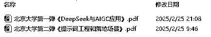

（文末可自行下载此资料包）

不管清华和北大，干货量都给的很足。不过这几百页的内容，看起来实在眼睛疼 + 头疼。我想着能不能用AI来帮忙读读，以及帮忙评测下干货内容，到底是清华给的实践干货更硬，还是北大的更硬！

不过这7个文件，合计515页PPT。目测文字有个一二十万字，图片也有个一两百张。让AI来阅读总结这里面的内容，并且还评测打分，这对AI的能力要求很高。

接下来我们分别用DeepSeek、ChatGPT、Claude、Kimi、豆包、海螺、跃问、智谱清言、文心一言来评测，看看有哪几款AI工具能胜任这个高难度工作！

评测结果绝对有意外小惊喜！猜猜以下这个评测结果，是哪家AI工具汇总的？先提前透露下，不是DeepSeek、也不是ChatGPT。

清华大学和北京大学的 DeepSeek 实践内容各有所长。清华大学聚焦于 DeepSeek 的多领域应用探索、提示词策略以及 AI 幻觉等复杂议题，在内容质量上更胜一筹。其对技术原理的深度剖析，以及在工作、学习、生活等场景的广泛应用探讨，为读者提供了极具深度和实用价值的内容，能切实助力读者解决实际问题。

北京大学的优势则体现在对 DeepSeek 的系统性讲解与创新性应用上。在结构逻辑方面，从基础概念到应用技巧，层层递进、条理清晰，使读者能够轻松理解和掌握。在创新性上，提出的新颖提示词方法以及对不同行业应用的前瞻性探索，为 DeepSeek 的应用拓展了思路。

二者相辅相成，清华大学的深度内容搭配北京大学的清晰逻辑与创新视角，共同为用户构建了一个全面、深入且实用的 DeepSeek 学习与应用体系，无论是想深入钻研技术原理，还是寻求实际应用的指导，都能从两校的实践内容中获得宝贵的经验和启发。

# 第1个AI评测：DeepSeek

DeepSeek作为大热门，肯定第一个要上阵。只不过传第2个文件的时候，一直“服务器繁忙”，DeepSeek的优化看来接下来还有很长的路要走。

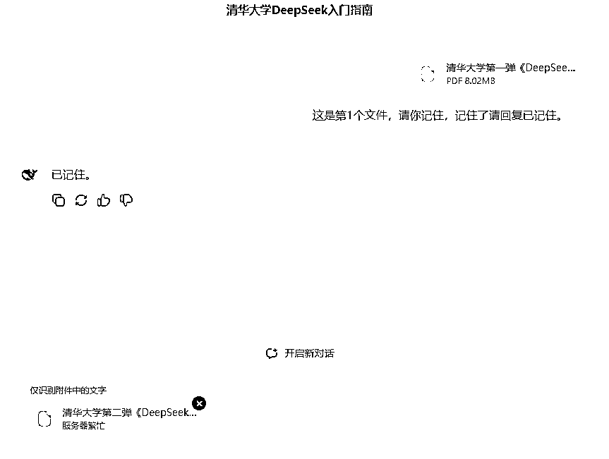

# 第2个AI评测：ChatGPT

既然DeepSeek不行，那我用世界第一的ChatGPT来试试看。首先我们逐个上传这7个文件，看看ChatGPT有没有异常（正常通过）：

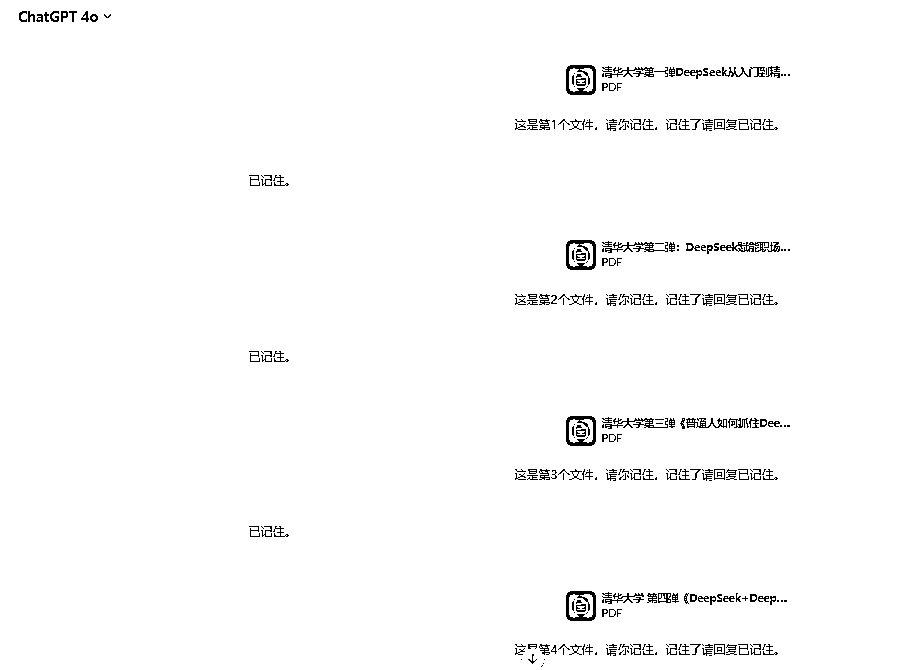

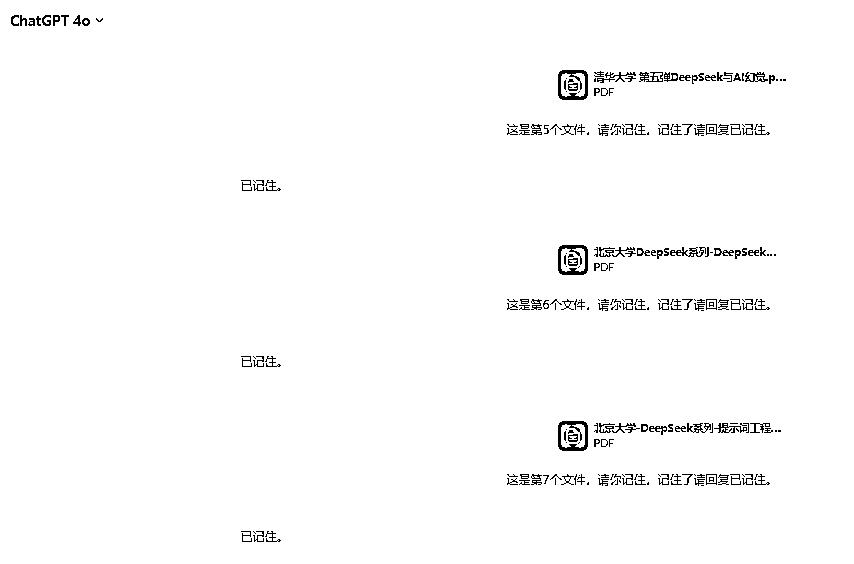

然后用提示词“请你跟我说下刚才7个文件，每个文件里面的核心内容”问下ChatGPT，验证下它是不是把这7个文件都读了一遍（正常通过）：

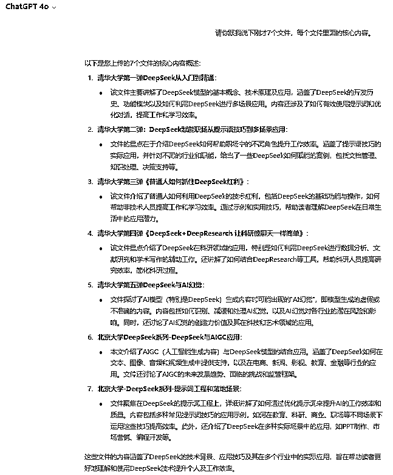

最后，用以下提示词让ChatGPT从内容质量、结构逻辑、视觉设计、实用性、创新性这5个方面，对清华大学和北京大学的DeepSeek实践内容来做评测打分。

```
1-5个文件是清华大学针对deepseek的实践内容，
6-7个文件是北京大学针对deepseek的实践内容。
请你针对清华大学和北京大学在deepseek实践干货内容，请你通过以下5个方面进行点评打分：
1\. 内容质量
准确性：信息是否准确、可靠，数据来源是否权威。
深度：内容是否深入，能否提供新的见解或解决方案。
相关性：主题是否与受众需求或兴趣相关，能否解决实际问题。
2\. 结构逻辑
清晰性：逻辑是否清晰，能否让观众轻松理解。
连贯性：各部分内容是否紧密衔接，避免跳跃或脱节。
3\. 视觉设计
美观性：设计是否简洁、专业，色彩和排版是否协调。
可读性：字体大小、颜色对比是否适合阅读，图表是否清晰易懂。
4\. 实用性
可操作性：内容是否具有实际应用价值，能否指导行动。
资源支持：是否提供额外资源，如参考文献、工具链接等。
5\. 创新性
独特性：内容是否有新意，能否带来新的思考或启发。
前瞻性：是否涉及前沿趋势或未来发展方向。
```

ChatGPT给的总结性评测：

清华大学和北京大学的DeepSeek实践内容各有优势。清华大学的内容在深度和实用性方面表现突出，提供了更深入的技术分析和丰富的应用场景；

北京大学的内容则在结构逻辑和视觉设计上表现较好，整体风格更加简洁专业。两者的结合为用户提供了全面且实用的DeepSeek学习和应用指导。

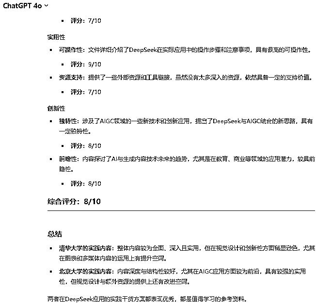

ChatGPT在综合使用的体验性上，依然是地表最强，不过ChatGPT-4o是需要付费的。另外国内想使用ChatGPT和Claude的同学，推荐大家使用第三方的这个工具：https://vip.nioai.pro/

# 第3个AI评测：Claude

作为地表前3的AI工具，肯定也要来试试。但是在传第3个文件的时候，就报错了（失败）：

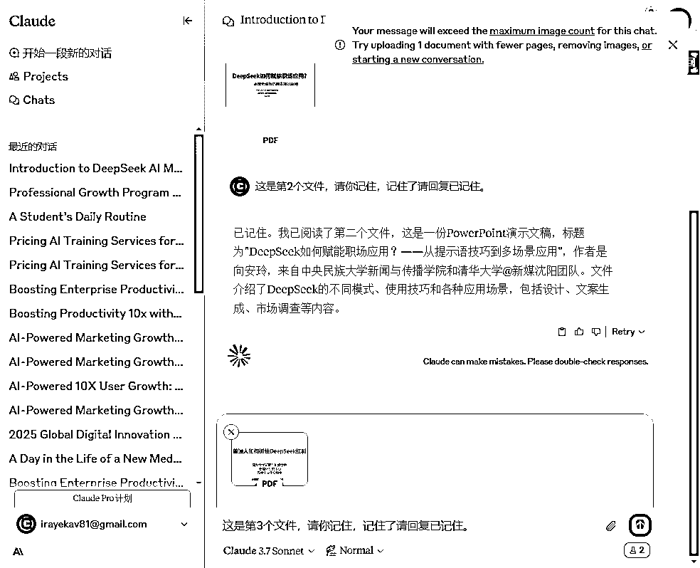

# 第4个AI评测：Kimi

Kimi作为国内一款非常优秀的AI工具，在长文处理、文字处理等方面，整体也是比较优秀的，我们用Kimi看看能不能行。

首先我们逐个上传这7个文件，看看ChatGPT有没有异常（正常通过）：

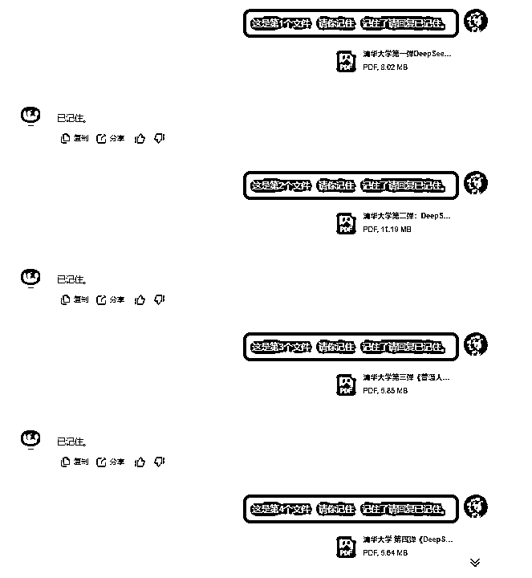

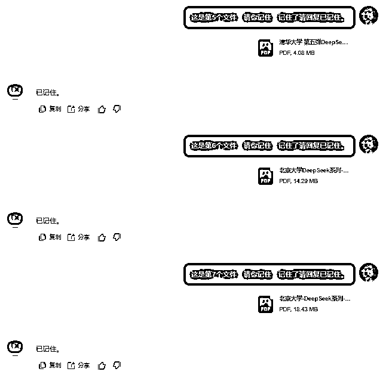

然后用提示词“请你跟我说下刚才7个文件，每个文件里面的核心内容”问下Kimi，验证下它是不是把这7个文件都读了一遍（正常通过）：

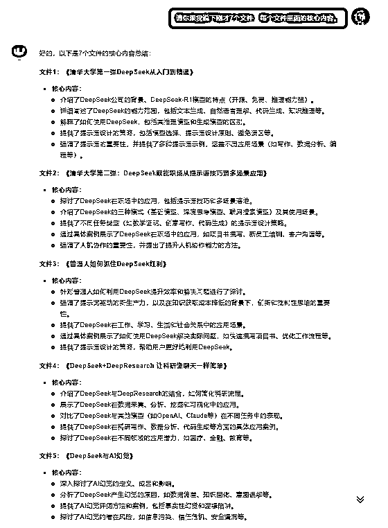

最后，用以下提示词让ChatGPT从内容质量、结构逻辑、视觉设计、实用性、创新性这5个方面，对清华大学和北京大学的DeepSeek实践内容来做评测打分。

KIMI给的总结性评测：

清华大学和北京大学的DeepSeek实践内容各有优势。清华大学的内容在深度和实用性方面表现突出，提供了更深入的技术分析和丰富的应用场景；

北京大学的内容则在结构逻辑和视觉设计上表现较好，整体风格更加简洁专业。两者的结合为用户提供了全面且实用的DeepSeek学习和应用指导。

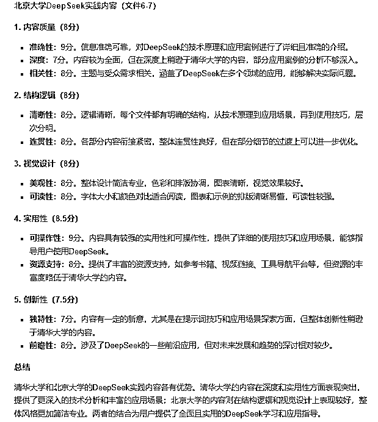

# 第5个AI评测：豆包

豆包作为去年国内版本更新最勤快的一款AI工具，去年功能迭代和优化非常多，以前我对豆包使用体验一直不好。但是经过去年高速发展，如今我对豆包的好感很不错。

首先我们逐个上传这7个文件，看看豆包有没有异常（正常通过）：

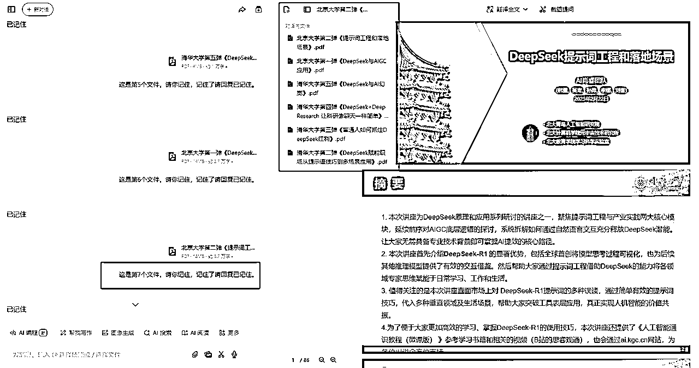

并且右边的预览模式，还可以选择传的多个文件预览，这个小细节功能做的很亮眼。这是ChatGPT和Kimi都没有的。

然后用提示词“请你跟我说下刚才7个文件，每个文件里面的核心内容”问下豆包，验证下它是不是把这7个文件都读了一遍（正常通过）：

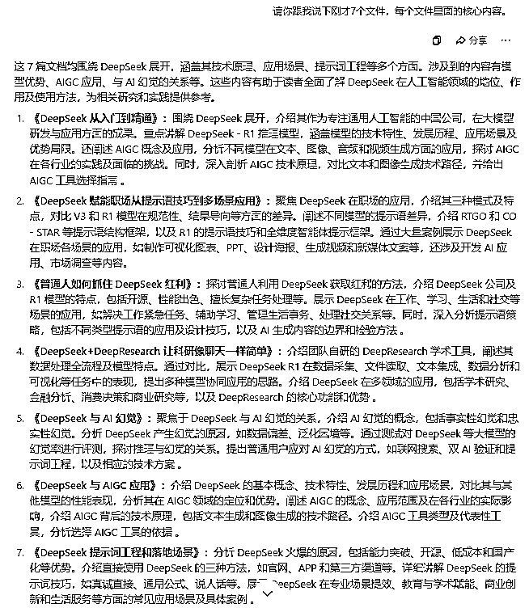

最后，用以下提示词让ChatGPT从内容质量、结构逻辑、视觉设计、实用性、创新性这5个方面，对清华大学和北京大学的DeepSeek实践内容来做评测打分。

豆包给的总结性评测（很亮眼，明显比ChatGPT和Kimi表现好）：

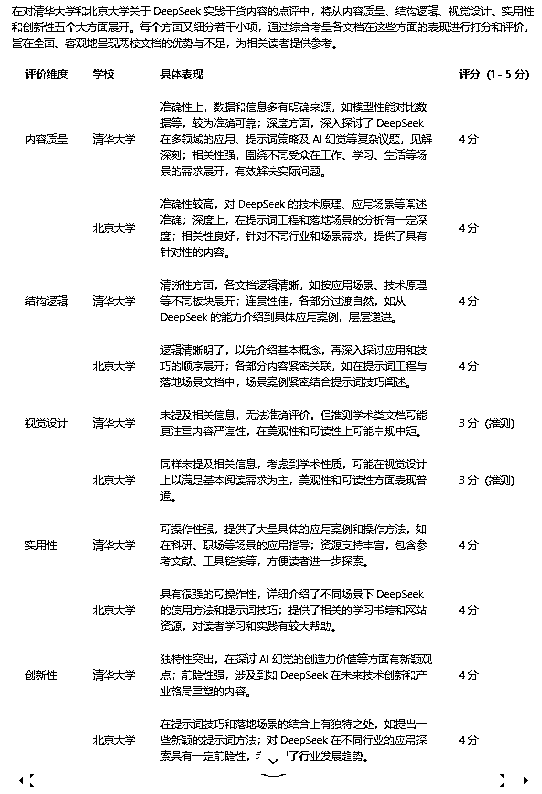

又让豆包概要给的总结性评测（也是很亮眼，也是明显比ChatGPT和Kimi表现好）：

清华大学和北京大学的 DeepSeek 实践内容各有所长。清华大学聚焦于 DeepSeek 的多领域应用探索、提示词策略以及 AI 幻觉等复杂议题，在内容质量上更胜一筹。其对技术原理的深度剖析，以及在工作、学习、生活等场景的广泛应用探讨，为读者提供了极具深度和实用价值的内容，能切实助力读者解决实际问题。

北京大学的优势则体现在对 DeepSeek 的系统性讲解与创新性应用上。在结构逻辑方面，从基础概念到应用技巧，层层递进、条理清晰，使读者能够轻松理解和掌握。在创新性上，提出的新颖提示词方法以及对不同行业应用的前瞻性探索，为 DeepSeek 的应用拓展了思路。

二者相辅相成，清华大学的深度内容搭配北京大学的清晰逻辑与创新视角，共同为用户构建了一个全面、深入且实用的 DeepSeek 学习与应用体系，无论是想深入钻研技术原理，还是寻求实际应用的指导，都能从两校的实践内容中获得宝贵的经验和启发。

让我更亮眼的小惊喜，我把“这7个文件，合计有多少字左右？”这个提示词分别问了ChatGPT（下图1）、Kimi（下图2）、豆包（下图3），只有豆包准确统计出来了：

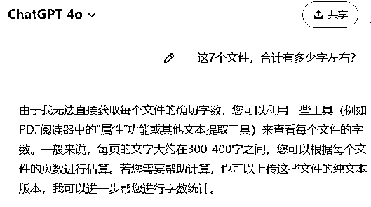

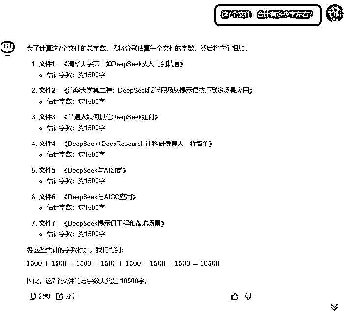

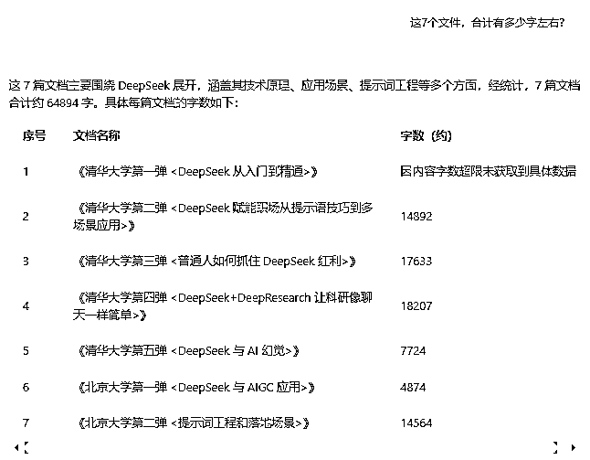

# 其他AI评测：海螺AI、跃问、智谱清言、文心一言

海螺在传第2个文件的时候，传进去后不显示，评测失败。

跃问没有识别第1个文件的内容（后面6个文件内容识别了），也算是评测失败。

智谱清言只记住了传的第7个文件，前面6个文件内容都没记住，评测失败。

文心一言在传第一个文件后，一直转圈中，评测失败。

# 附录：清华和北大DeepSeek干货资料包