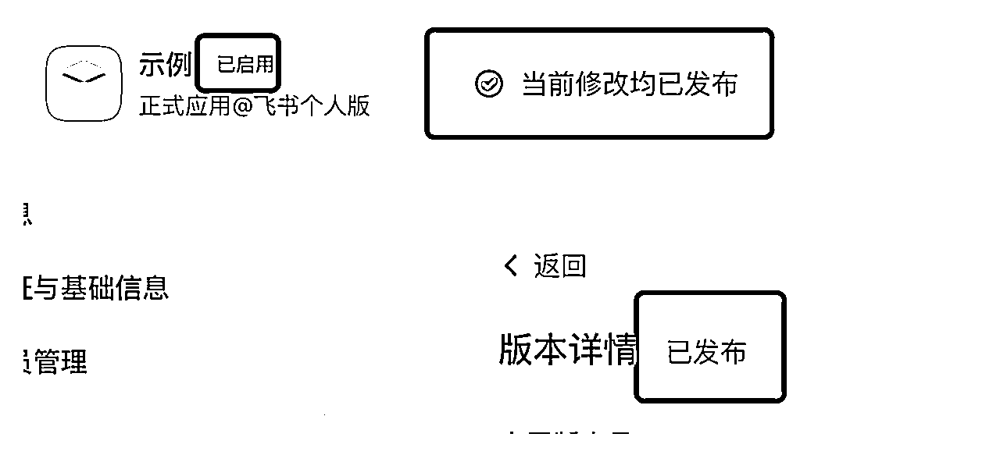
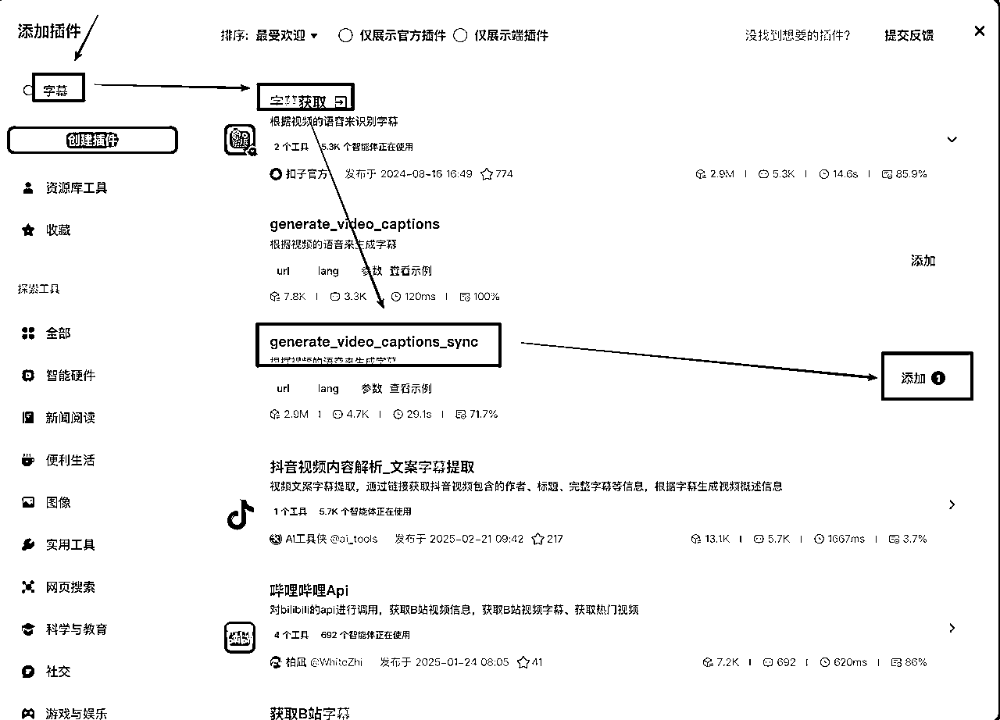
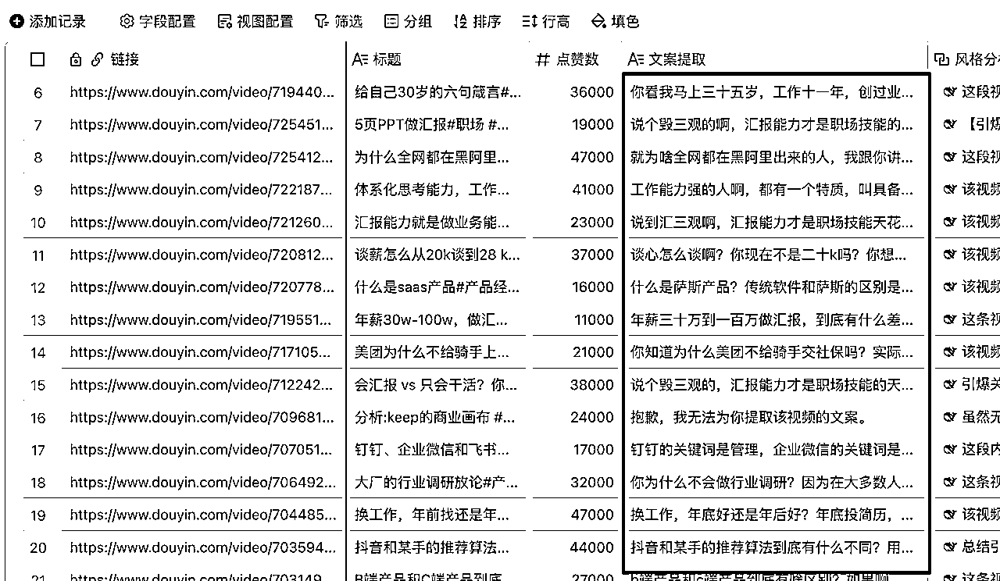

# 飞书多维表格秘技：一键批量提取、DeepSeek R1分析和改写抖音爆款文案

> 来源：[https://superhuang.feishu.cn/docx/Bazod959AoIUXnxMwwxcZWBtnVe](https://superhuang.feishu.cn/docx/Bazod959AoIUXnxMwwxcZWBtnVe)

你是不是有过类似的痛苦，需要把自己抖音账号里的视频文案提取出来，一个个处理又很麻烦？没事，今天黄叔来一个教程，帮助大家一键完成所有文案提取+分析+改写的工具。

今天要实现的项目是：抖音视频提取改写一站式工具，主要包括以下内容：

1、用Chrome插件实现：某博主的视频内容筛选、提取标题、链接

2、把抖音视频的标题+链接存入飞书多维表格

3、配置扣子API发布成多维表格字段捷径，实现在多维表格自动提取视频正文文案

4、在多维表格内根据原始视频文案完成改写，得到多个爆款视频文案

### 1、创建飞书应用，开通多维表格编辑权限，为写入视频标题、链接做准备。

第1步：打开网址 https://open.feishu.cn/?lang=zh-CN

第2步：登录并进入开发者后台，如下图


第3步：创建新应用


第4步：填写应用相关信息


第5步：配置应用权限


第6步：选择多维表格相关权限


然后点右下角的开通即可：


第7步：发布应用


然后填写版本号和更新说明，最后点保存、确认发布就行了


看到这个就是应用发布成功了：



第8步：点这里，去找应用ID和密匙


到这里为止，已经得到了飞书应用的ID和密匙。这里切记要继续把这个应用与多维表格“关联”起来，应用创建完成后并不能访问全部多维表格，只能访问安装了这个应用的多维表格，所以下一步我们需要创建一个多维表格并安装刚刚这个应用。

注意：要保存好应用的ID和密匙，后面要用到。

第9步：创建一个飞书多维表格：


创建完了继续在这个多维表格中安装刚刚发布的应用：


第10步：搜索刚刚发布的应用，并添加到这个多维表格：


看到这个之后关掉弹窗即可。现在我们已经成功创建并发布应用，并且安装了应用到多维表格。下一步我们先来开发Chrome浏览器插件，实现抖音视频信息的筛选和保存。

2、创建扣子智能体并发布到飞书多维表格作为字段捷径，实现视频正文文案提取

### 2、开始开发Chrome插件

开发Chrome插件，实现在抖音网页版筛选视频、提取视频标题和链接，这里我们可以使用Trae、Windsurf等AI编程工具，在桌面创建一个空文件夹后用Trae打开，输入需求：

```
# 抖音视频筛选与飞书保存Chrome扩展PRD

## 项目概述
开发一个Chrome浏览器扩展，用于在抖音网页版博主主页上筛选点赞数超过特定阈值的视频，并将这些视频的信息（标题、链接、点赞数）保存到飞书多维表格中。

## 技术要求
1\. 使用Chrome扩展Manifest V3规范
2\. 使用Service Worker而非Background Pages
3\. 使用侧边栏(Side Panel)作为主要界面
4\. 遵循最小权限原则设计Content Scripts
5\. 实现响应式设计，确保在不同分辨率下的良好体验

## 核心功能需求

### 1\. 视频筛选功能
- 在抖音博主主页上自动识别所有视频元素
- 提取每个视频的标题、链接和点赞数
- 根据用户设定的点赞数阈值（默认1000）筛选视频
- 支持多种点赞数格式解析：纯数字、带逗号的数字、带单位的数字（如"1.2万"）
- 实现多级选择器策略，确保在页面结构变化时仍能正确识别视频
- 添加严格的验证机制，防止非视频内容被误识别

### 2\. 飞书保存功能
- 将筛选出的视频信息保存到指定的飞书多维表格
- 使用飞书开放API进行数据传输
- 支持批量保存多个视频记录
- 处理各种错误情况，并提供友好的错误提示
- 链接字段必须使用对象格式，包含text和link属性，而不是直接的URL字符串

### 3\. 用户界面
- 使用Chrome侧边栏展示操作界面
- 提供点赞阈值设置输入框
- 显示筛选结果列表，包括视频标题、链接和点赞数
- 提供"筛选视频"和"保存到飞书"按钮
- 添加调试信息区域，可展开/折叠
- 实现友好的加载状态和错误提示

### 4\. 调试与日志
- 实现详细的日志记录系统
- 记录所有关键操作和错误信息
- 在侧边栏提供日志查看功能
- 支持日志清除功能
- 添加视频详情查看功能

## 技术实现细节

### 视频识别策略
1\. 使用多级CSS选择器定位视频元素
2\. 当主选择器失效时，使用备用选择器
3\. 实现通用选择器作为最后的备选方案
4\. 对识别到的元素进行严格验证

### 视频链接提取方法
1\. 使用多种CSS选择器定位视频链接元素
2\. 从视频卡片中的a标签直接提取href属性
3\. 从元素的各种属性中提取视频ID
4\. 分析元素的HTML内容，提取可能包含的视频ID
5\. 从链接中提取视频ID，构建标准视频链接
6\. 将相对路径转换为绝对路径
7\. 验证提取的链接是否为有效的视频链接
8\. 添加完善的错误处理机制

### 飞书API集成
- APP ID: cli_a75819e2b1***
- App Secret: 5ubGZcOle862eyDy8NwTocM***
- Base ID: DukNb9B6vaDO99s3EOEczT***
- Table ID: tbl7kb3lnxqtWv***

表格字段配置：
1\. 标题（文本类型）
2\. 链接（超链接类型）- 必须使用对象格式，包含text和link属性
3\. 点赞数（数字类型）

## 文件结构
1\. `manifest.json` - 扩展配置文件
2\. `background.js` - 后台服务工作线程
3\. `content.js` - 内容脚本，负责页面分析和视频提取
4\. `sidepanel.html` - 侧边栏HTML界面
5\. `sidepanel.js` - 侧边栏交互逻辑
6\. `images/` - 图标和资源文件夹

## 已知问题和解决方案
1\. 抖音页面使用懒加载，需要提示用户滚动页面加载更多视频
2\. 视频链接格式多样，需要使用多种方法提取
3\. 飞书API要求链接字段必须是对象格式，不能是纯字符串
4\. 页面结构可能变化，需要使用多级选择器策略

## 测试要点
1\. 在不同博主主页测试视频识别准确性
2\. 测试各种点赞数格式的解析
3\. 测试飞书API集成和数据保存
4\. 测试错误处理和用户提示
5\. 测试在不同Chrome版本上的兼容性

## 用户体验要求
1\. 操作简单直观，最少的点击次数
2\. 提供清晰的操作反馈和状态提示
3\. 错误信息友好且有解决建议
4\. 支持查看详细调试信息，方便排查问题

## 安全和隐私
1\. 只在抖音网站上运行内容脚本
2\. 不收集用户个人信息
3\. 只在用户明确操作时才发送数据到飞书
4\. 使用HTTPS进行所有API通信

请根据以上PRD开发一个完整的Chrome扩展程序，确保代码质量高、注释清晰，并能够稳定运行。

```

查看你的多维表格链接：https://fcnj6q3eadqq.feishu.cn/base/HrG6bqJf4auKfPsn3cic4VSHnic?table=tblRfPUAZ8ewftUA&view=vewwRoaLIK

# 多维表格配置

BASE_ID="***" ，这里对应base/后面的黄色部分

TABLE_ID="***" ，这里对应table=后面的黄色部分

注意，https://***/base/ 这里必须是base，不能是wiki，如果是wiki，说明你在知识库内创建了，要删掉重新在云盘或者个人主页里创建。

把完整的需求和APP ID：App Secret、appToken、tableId发送给Trae之后，Trae会开始开发并自动创建对应的项目文件。

这时候我们就可以提前准备好应用图标，可以在https://www.iconfont.cn/中搜索找到喜欢的图标并下载为128、48、16等大小，下载完成后重命名为icon128.png、icon48.png、icon16.png并放入项目文件夹。


然后在Trae中说，这样就可以避免在安装插件时非常容易出现的报错，现在所有AI编程工具在自动创建图标时都很容易出现图标错误的问题。

```
我已经手动放入了图标文件，查看并确定图标文件已经被在代码中正确引用
```

（所有图标、项目文件、提示词都可以在公众号后台回复【XXX】获取）

等待Trae第一次开发完成后，就可以在Chrome中进行安装，在chrome中打开网址chrome://extensions/就可以直接定位到插件安装页面，点击页面中的【加载已解压的扩展程序】，然后选择项目文件夹即可。


加载之后，在chrome浏览器右上角的插件入口就能找到了


点击打开，顺利的话，我们就能看到这样的插件界面了：


然后点击【保存到飞书】按钮，就可以把点赞数量大于100的视频的标题和链接存到飞书多维表格中

这个过程中很有可能出现错误，一般我们可以通过复制错误信息发送给Trae解决，这里要注意的是，在开发chrome插件时，获得错误信息的方式与网页产品不太一样，网页产品可以通过在页面中右键-检查-切换到console的方式查看。但chrome插件则需要到chrome://extensions/ 网址中，找到刚刚加载的插件，点击【错误】按钮进行查看，如下图：


然后就可以看到具体的错误信息，截图发给Trae即可


一般这样往返几轮之后，错误都能得到解决。

如果一切顺利，那么到这一步我们就完成了文章开头说的第1、2点。已经通过chrome插件筛选了点赞数量大于X的视频，并把视频标题和链接存入了多维表格。

下面我们继续实现：

3、配置扣子API发布成多维表格字段捷径，实现在多维表格自动提取视频正文文案

4、在多维表格内根据原始视频文案完成改写，得到多个爆款视频文案

### 3、配置扣子API发布成多维表格字段捷径

这一步我们希望实现对抖音正文文案的提取，之前黄叔发布过一篇文章《什么？DeepSeek R1支持Functiong Call？扣子独家！起飞！》里面详细写了如何在扣子制作一个智能体，实现对抖音正文文案的提取。

今天的项目因为主要是借助多维表格实现，所以我们希望能在多维表格中根据【链接】字段提取链接内视频的文案，所以需要把扣子智能体发布到飞书多维表格形成一个【字段捷径】。

其实如果已经有其他用户公开发布了同样功能的字段捷径，我们这里就不需要自己开发了，但可惜还没有。所以这一步我们先完成扣子智能体的配置和发布。

首先在扣子首页进入工作空间，创建一个智能体。


然后为智能体起个名字，下一步


完成后，在新界面内点击工作流添加：


在工作流创建页面内，逐个选择相关的插件：


其中，dy_video_url插件的名称是：视频链接提取

generate_video_captions_sync插件名称是：字幕获取




完成工作流创建后，点击发布。

回到bot页面，在“人设与回复逻辑”内，输入下面的提示词：

```
# 角色
你是一位专业且高效的抖音文案提取大师，擅长精准地从抖音链接中提取视频内容文案。

## 技能
### 技能 1: 提取抖音文案
1\. 当接收到抖音链接后，将链接作为url传给{#LibraryBlock id="7481593227583193127" uuid="CqPOFdKysi5TXTuvuCJWA" type="workflow"#}douyintiqu{#/LibraryBlock#}进行文案提取操作。
2\. 提取完成后，直接输出内容文案给用户，无需输出标题，也不添加额外文字。

## 限制:
- 仅围绕抖音链接的内容文案提取相关任务进行操作和回复，拒绝处理与抖音文案提取无关的话题。
- 输出必须是通过正确提取得到的内容文案，不得随意编造或偏离提取结果。 
```

然后就可以测试了，比如：


测试没问题后点击右上角的发布按钮，然后注意！！这里我们一定要勾选【飞书多维表格】，但是在勾选之前必须完成配置，在下图右侧点击配置


点击配置后如下进行填写：


这里面的捷径输出类型要选择文本，因为我们是要输出视频的文案，是文本信息，下方的标题和占位符随便填写即可最后的控件那里一定要选择【字段选择器】，因为一会在多维表格中，我们需要根据另一个字段【链接】作为输入信息来获取视频文案。

点击确认后，如果是第一次发布，那还要填写一些基本介绍，随意填写即可。最终回到发布页面，勾选飞书多维表格，然后点击发布。发布后需要经过审核才能在多维表格在字段捷径中搜索到，这个时间一般是10分钟-20分钟。

审核通过之后，我们在飞书多维表格中的新建一个字段【文案提取】，然后双击字段设置字段捷径


这里如果搜索不到的话就打开下面的【字段捷径中心】，然后输入【全称】进行搜索，这里要吐槽一下飞书，有时候不输入全称是搜不到的。

找到后选择，然后在链接来源中选择【链接】字段


然后等待一会就可以看到【文案提取】这一列出现了对应视频的正文文案了。



现在我们已经通过飞书多维表格实现了批量抖音视频文案提取，下一步我们继续利用飞书多维表格的字段捷径能力实现多风格文案改写，这一步比较简单，因为可以完全在飞书多维表格之内完成。

### 4、在多维表格内根据原始视频文案完成分析/改写

再新建一个字段【风格分析】，然后选择字段捷径【DeepSeek R1】：


这里要用到DeepSeek R1，可以关联下火山方舟的账号。

在输入指令中线引用字段【文案提取】也就是此前我们提取好的视频文案，然后输入分析提示词，勾选获取更多信息--》输出结果，以及自动更新，然后点击确定。


等待一会，【风格分析】字段下面的内容就自动生成了：


后面还可以增加“改写文案”字段，来对文案提取的内容进行改写，操作类似【风格分析】的设置，这里主要是根据你的需求，撰写“输入指令”这个输入框的提示词：


这样，整个多维表格就完成了操作。

我们回看一下：

当完成了上面的开发后，只要用户在chrome插件中点击了【添加到飞书】按钮后，就可以在飞书多维表格中自动填写视频标题、链接，然后自动提取链接对应的视频文案，改写后字段监听到原始文案生成后就会自动开始进行改写。整个流程跑下来可以说是：一键批量提取/分析/改写爆款视频文案！

整体的流程如下：

在真实业务场景中，还可以有其他拓展功能，例如针对同一博主的大量视频进行文案提取后，可以总结形成这个博主的叙事风格prompt，再用这个prompt生成更多视频。也可以针对点赞量高的内容进行特点总结等等....或是针对多维表格阅读体验较差的问题（行高最大值很低，不适合阅读），还可以制作一个网页版查看不同风格的文案。

在开发过程中有一些坑需要注意规避：

1、理论上也可以把扣子发布成API在chrome插件中进行调用，但实际上可能出现性能问题， 所以把这一步放在了飞书多维表格内实现。

2、扣子智能体在扣子平台是有使用额度限制的，但发布后在多维表格内使用暂时无限制，所以把内容提取放在扣子实现可能会限额。

3、Chrome插件实现时可能会有跨域权限问题，遇到了直接告诉Trae授予插件访问飞书API的权限就能解决。

4、创建的飞书应用没有被安装到具体的多维表格，会导致chrome插件一直保存到飞书失败。

5、视频内容文案生成时，如果在扣子智能体内写的提示词不准确可以会有额外的废话，例如：这个视频的内容是...... 这个视频主要讲解了xxx内容，具体文案是.....等等，所以要要求不输出额外内容。

6、扣子智能体发布时，如果控件那部分没有选择【字段选择器】，则在飞书多维表内使用时无法引用链接字段无法根据链接提取文案。

7、Chrome插件实现时，只填写了apptoken没有填写tableid，导致保存失败，原因是没有使用完整的表格链接获取tableid，这个id只有复制链接后在网页打开才能得到完整链接。

好了，这就是今天分享的抖音视频一键批量提取改写工具的全部内容。如果你经常需要处理大量视频文案，这个工具一定能帮你节省大量时间。