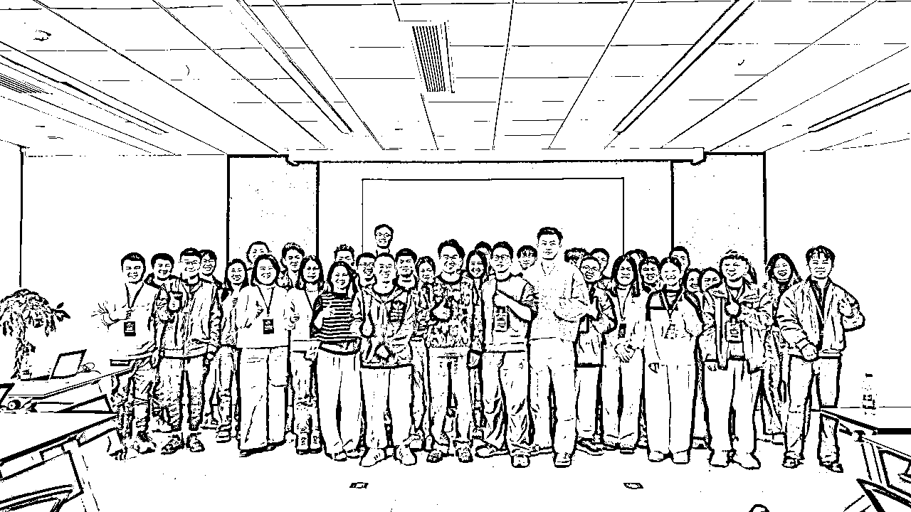

# 从孤军奋战到抱团突围：我在生财联合办公的两周蜕变之旅

> 来源：[https://fbp2pkeqe6.feishu.cn/docx/TZ2SdH7tQodmuBxtdQxcxPE3n6c](https://fbp2pkeqe6.feishu.cn/docx/TZ2SdH7tQodmuBxtdQxcxPE3n6c)

大家好，我是飞扬，是首批入驻生财联合办公空间的圈友之一。转眼在联合办公已经两周了，这两周我收获满满，迫不及待想和大家分享。首先要特别感谢亦仁老师和许老师搭建了这样一个办公空间，让这么多创业者能够聚在一起并肩奋斗。这两周的办公体验，让我深刻感受到一个好的环境对个人成长的影响，也让我收获了许多创业上的启发。今天，我想分享一下这段时间的感受，也希望能帮助更多考虑加入联合办公空间的朋友。

"一个人可以走得很快，但一群人才能走得更远。"

两周前，我从一名独自在家、效率低下的自由职业者，变成了一个被高手环绕、干劲十足的创业者。这一切的转变，都源于我加入了生财有术联合办公空间。

## 【背景故事】从星巴克到联合办公

我是一名自由职业创业者，去年一直在家办公，总觉得效率提不起来。那时候为了专心点儿，我经常跑去星巴克，买杯咖啡坐一天。在星巴克的确比在家专注一些，可毕竟周围没有同频的人，一直都是自己带着线上团队埋头苦干，效率提升有限，项目也没有明显增长。

星巴克也不是完美的办公室，人来人往聊天打电话，各种噪音难免，有些需要专注的工作很容易被打断。在家也好、星巴克也好，都算不上理想的工作环境，效率一般般。

正在我琢磨还有什么办法能改善工作状态的时候，恰好看到了亦仁老师在星球里发了个帖子：生财有术要开放线下联合办公空间！我当时一看就心动了——这可是为我们这些孤军奋战的创业者量身定做的机会。不仅能拥有安静高效的办公环境，还能和一群同频的圈友一起交流，说不定还有机会偶遇亦仁老师，当面听他指点一二呢！我想都没想就立刻报名了。报名后其实心里还有点打鼓：申请的大佬应该会很多，我会不会面试不过？去了新的环境，能不能融入，和大家处得来吗？幸运的是，许老师面试聊过之后很快就通知我通过了！当时别提多高兴。现在入驻两周，我无比庆幸自己当初秒报了名——事实证明，这是我今年最正确的决定。再次由衷感谢亦仁老师和许老师提供了这么棒的空间，让我们这些创业者得以齐聚一堂抱团奋斗。

加入联合办公这两周，我的工作效率提升了至少50%，每天能完成的任务量是在家办公时的近两倍。下面我就从以下几个方面聊聊我的体验和收获。

## 联合办公如何从根本上解决了我的3大创业痛点

痛点一：效率低下与注意力分散

在家工作或星巴克时，我常被各种干扰打断思路，效率始终提不上来。联合办公空间提供了专注的工作环境，周围都是认真工作的人，形成了强大的"心理暗示"，让我自然进入高效工作状态，专注度提升50%以上。

痛点二：创业孤独感与缺乏反馈

以前独自创业时，没人分享成功喜悦，也没人理解失败沮丧，遇到问题只能自己憋着。在联合办公空间，我找到了"组织"，有人会为我的进步鼓掌，遇到挫折时有人拍拍肩膀说"我也经历过"，这种被理解、被支持的感觉无可替代。

痛点三：缺乏专业指导与资源

之前遇到业务难题只能自己摸索或求助于网络资料。现在有许老师、婧婧姐等导师级人物随时指点，一句点拨就能让我少走弯路。许老师关于团队管理和客户转介绍的建议，直接解决了我项目中的核心问题。

## 【效率飞跃】工作效率飞升

入驻联合办公空间后，我真切体会到环境对一个人的影响有多大！在这里，一个好的办公环境和氛围让我整个人的状态都不一样了。大家都在忙着创业搞项目，一走进办公室就能感受到浓厚的“搞钱”氛围。每个人都埋头认真工作，耳边经常响起的是键盘的清脆敲击声。看到有些圈友干脆卷到晚上十二点才离开，我哪还有偷懒的念头，跟着一起卷起来就对了！在这种环境熏陶下，我的专注力和动力都提升了不少，工作效率自然而然就上来了。

常常不知不觉就专注了好几个小时。而且联合办公的氛围积极又上进，大家你追我赶地干劲十足，感染得我每天都充满动力，恨不得多干点、多学点才不虚度。这种自发的驱动力，是在家时很难有的体验。

专注度提升秘诀：

我发现在这里工作有个奇妙的"心理暗示"——当你抬头看到周围都是专注工作的人，你的大脑会自动进入"工作模式"，注意力更容易集中，干扰因素大大减少。

## 【人脉宝藏】人与人的链接让我成长

除了工作氛围，联合办公另一个让我受益巨大的，是这里“人与人”的链接，这里汇聚了各行各业的创业者，大家可以随时交流碰撞创意。而且许老师、婧婧姐，贝拉等大佬导师级人物也在我们身边指导。

一句点拨胜过万字攻略：

许老师只是随口一点拨，往往就能让我少走好多弯路、节省大量时间。身边高手如云，我每天都在疯狂汲取新知识。比如，有一次聊天中，许老师帮我指出了我在团队管理和合伙人分钱模式上的一些问题，还教了我怎么放大我的项目规模；婧婧姐则分享了她在建立和维护人脉关系方面的宝贵经验；还有贝拉，给我们传授了关于个人 IP 运营、写出爆款文章的干货。这些干货让我大开眼界。

圈层差异化优势：

普通共享办公只提供物理空间，而生财联合办公提供的是一个完整的创业生态系统——你不仅有办公桌，更有随时可以请教的创业导师、可以合作的优质伙伴，以及源源不断的创业灵感和资源。

社交技巧进阶：

婧婧姐教给我一个实用技巧——"先记住别人的名字和项目"。我开始在微信备注的描述功能建立"圈友档案"，记录每位新认识朋友的自我介绍和特长。这个小习惯让我快速建立起了自己的人脉网络，也让别人感受到了被重视。

## 如何在两周内建立高质量人脉并获得实质性帮助

我在联合办公空间短短两周内就建立了有价值的人脉网络，这不是偶然，而是有方法可循：

1.  主动出击策略：采用婧婧姐教的社交法则，准备好破冰问题，你好，圈友我是xxx，我在做xxx的，我看你的介绍您是做xxx，我也挺感兴趣，方便加个微信多交流吗？每天主动认识至少一位新圈友

1.  价值先行原则：见面前先了解对方项目，思考能提供什么帮助，见面时先提供价值再寻求帮助

1.  建立人脉档案：在微信备注的描述中记录每位新认识朋友的自我介绍和特长，建立"圈友档案"

1.  参与集体活动：积极参加每周五的分享会和其他交流活动，快速融入联合办公大家庭

1.  实质性合作案例：通过与鲈鱼老师的健身搭档关系，获得了AI提示词模板和健身指导；与其他圈友在项目引流方面互相借鉴，实现了流量提升

## 【社交进阶】如何从社恐到成为组长，我的人脉拓展之旅

在联合办公，我结识了很多志同道合的新朋友，包括各行各业的圈友，生财办公室的圈友，当然也包括一直在线上仰慕的许老师本人。让我惊喜的是，我还找到了一位健身搭档@鲈鱼！鲈鱼老师是个特别自律的小伙子，坚持健身 5 年了。他涉猎过漫展、家政、Web3 等多个领域，现在专注在 AI+应用方向。和他一块儿锻炼、聊天，我受益匪浅。他手把手教我怎么更好地使用 AI 提示词，还大方地分享给我一份涵盖各行业的 AI 提示词模板大全，以及好多 AI 工具的窍门。更厉害的是，他在健身和健康饮食方面也很有经验，经常指导我合理饮食、科学锻炼。鲈鱼老师给我推荐了一个叫“训记”的宝藏健身 App，跟着上面的教程制定训练计划。每天早上和鲈鱼老师约着健身，我渐渐改掉了熬夜的坏习惯，作息规律了，精神状态也更好了——工作效率提高是水到渠成的事。

除了鲈鱼老师，我们这一组还有不少优秀的小伙伴，比如做海外独立站的@彩笺，深耕 AI 短视频出海赛道的@小星球，研究 AI 写作的@小雪，做 AI 聊天记录可视化的@林悦己，还有折腾 AI 软件和 AI 视频的 Tiger、铁铁等等，大家各有所长，每次聊起来都收获颇丰。我也通过联合办公认识了许多生财圈内的朋友，比如婧婧姐、雪姨、Sky 哥知行、瓜斯、七天、秀儿、欢欢，小鱼、瑞瑞、彩虹、张子安等等之前只在圈子里听说过的朋友，也都线下见到了。

和一群优秀的创业者在一起这种“既独立又抱团”的感觉非常奇妙：我们各自努力把自己的项目做好，同时又乐于互相帮助、分享经验，谁碰到难题了，其他人都会出谋划策。

## 【能力爆发】这些创业干货让我少走了3年弯路

短短两周的时间，我觉得自己的成长速度堪比过去几个月。在许老师的指导下，我学到了很多宝贵的创业心得，这些都是在其他环境很难获得的一手经验。举个例子，许老师强调我一定要勇于表达和输出，多在圈子里分享自己的想法和成果。“你不发声，别人就不知道你的存在，就算你再厉害，没人听说过也没用。”这句话让我印象很深。所以这段时间我主动在群里分享了一些自己的项目进展和思考，慢慢地也有更多圈友开始了解我、认可我了。

📊 联合办公两周学到的核心创业思维：

在业务方面，许老师给我的点拨更是直接有效。他给一个 DeepSeek 好用的提示词，告诉我如果项目遇到卡壳的难题，不妨把问题详细描述给 DeepSeek 试试，它也许能给出一些实用的建议。抱着试试看的心态，我用 DeepSeek 问了困扰已久的业务难题，结果它的回答还真挺专业，某些方面甚至比 ChatGPT 和其他 AI 工具更精准！有了许老师分享的这个锦囊，我现在解决业务卡点的思路清晰多了，项目推进也顺利了不少。

许老师在团队管理和招聘方面也给了我很多指导。他说招聘要先看岗位产出，人效低又不稳定的可以考虑用兼职替代，但兼职流动性大，所以要多招几个人才储备着，多筛选才能找到真正适合的人。选人时他建议关注三点：是否积极主动、有没有学习能力、能否坚持长期主义。这几句话让我茅塞顿开，我赶紧记在本子上准备实践。

在创业方法论方面，许老师也倾囊相授。他说，做项目从 0 到 1 阶段，一开始就要想清楚盈利模式，别一头扎进去才发现不赚钱。还有就是多向行业里优秀的同行学习，所谓“同行是最好的老师”，找出标杆来对照，少走弯路。做项目贵在坚持，不要老是这山望着那山高，频繁换方向，而要有耐心深耕，秉持长期主义，争取做三五年还能持续见效的事。此外，创业前就该想好最好的结果和最坏的打算，特别是最差的情况自己能不能接受，想明白了再干，心里就更有底气。

印象特别深的是，有一次许老师教我如何提高项目的客户转介绍率，他总结了三个关键点：一是让客户有转介绍你的意愿——前提是他得先信任你的产品，并且通过你的产品赚到钱，有了收益自然愿意帮你推荐；二是给客户转介绍的动力——可以设计阶梯式的奖励机制，用利益驱动他多多帮你介绍新客户；三是降低客户推荐的阻力——这一点很多人忽略，其实很重要，你要把转介绍这件事变得不费劲，比如直接给客户准备好话术，只需要他说句话就能把朋友介绍给你的团队。听完我只觉醍醐灌顶，赶紧在自己的业务里引入这套裂变转介绍机制。

## 【干货推荐】许老师的创业精华帖

许老师的精华帖文章对我们这些创业者帮助太大了！涵盖如何选择合适的项目、如何放大项目、如何组建团队等经验。每读一篇都让我恍然大悟，许多困扰我的问题迎刃而解，我对自己项目的方向也更加明确了。我把学到的方法逐一应用到自己的项目上，许多以前头疼的难题现在都有了答案。

强烈给圈友们推荐一下许老师的精华帖，推荐大家仔细阅读 2 遍，读完就去实操

1.  如何选择合适的项目：3 步教你选出合适的项目，一定会对选择项目有所启发：

1.  如何放大复制你的项目：生财所有的项目都值得做两遍，第一遍是 MVP 跑通，第二遍是加杠杆放大 https://scys.com/articleDetail/xq_topic/4848155412248448

1.  如何搭建销售团队：

https://scys.com/articleDetail/xq_topic/8855485545221212

创业初期创始人指南：https://scys.com/articleDetail/xq_topic/588824155242444

在联合办公空间，我还担任了我们第 3 组的组长。这让我有机会更加直接地感受到许老师的责任心和带领能力。他对我们每一位圈友都特别上心。刚入驻那会儿，许老师就召集我们这些组长开会，让我们去收集本组圈友在项目中遇到的卡点问题，方便他一一了解，主动邀请有需要的同学找他聊天，他来帮大家解决难题。每周五，许老师还会组织分享会，有时他自己讲，有时请外部嘉宾来给我们传经送宝。通过这些活动，大家不仅学到了新知识，也更快融入了联合办公这个大家庭。作为一名写作小白，我心里由衷地感谢许老师的付出和指导，这篇帖子也是在许老师的鼓励和帮助下写作出来的。

## 【社交密码】婧婧姐的高情商人脉建设法则

要说这两周让我转变最大的，还有婧婧姐给我上的“社交思维”一课。婧婧姐在会议室给我们联创空间的圈友单独开小灶，给我们 20 多人分享他的社交关系建立和人脉维护——打造自己的高情商标签，婧婧姐的一番分享让我茅塞顿开。她对我们说：“有什么想法就大胆说出口，开口你就赢了一半，不要老怕被拒绝。主动一点并不等于打扰，只要把握好分寸，别人不会觉得你烦。”当时听完这句话，我整个人突然就通透了——以前总担心麻烦别人，很多想法埋在心里，现在想想，其实错过的机会都在犹豫中溜走了。

婧婧姐还提到，真正有价值的人脉不是你认识多少人，而是你能帮助多少人。“你能帮到的人，才是你的人脉。”这话让我开始重新思考人际关系的本质。她教我们在建立人脉时要学会先付出：主动帮助别人解决问题，多在对方面前露脸增加曝光度，不用担心对方记不住你，互动多了自然会有印象。要多虚心请教，通过持续输出价值，形成互惠互利的关系，这样建立起来的联系才长久有效。

在社交上婧婧姐同样强调长期主义，她提醒我们别急功近利，不要指望刚认识就立马从别人那得到什么好处。“先让别人看到你的价值，不论是你的产品、能力，还是给出的解决方案。把格局放长远一点，该来的都会来。”听君一席话，胜读十年书，我深刻体会到社交和做事其实是相通的——都是要踏踏实实耕耘，沉淀价值，才能获得长久的认可。

婧婧姐的社交实操三步法：

1.  主动出击： 准备3个万能破冰问题（"你是做什么项目的？""最近有什么项目进展？""有什么我能帮到你的吗？"），每天至少主动搭讪一位新圈友

1.  价值先行： 见面前先做功课了解对方项目，思考能提供什么帮助，见面时先提供价值再寻求帮助

1.  持续维护： 建立"人脉追踪表"，记录每位重要联系人的生日、爱好、近期项目，定期复盘并主动联系

## 【环境加持】一流的办公环境

聊完个人提升，再说说大家都关心的办公环境吧。生财的办公室环境可以用“豪华”来形容。咱们的办公楼坐落在杭州未来科技城 CBD 的核心地段——欧美金融城 33 楼，楼里楼外都是科技企业云集，阿里巴巴、今日头条、快手，华为、云峰基金这些大厂就在附近。

办公室的内部布置也非常舒服温馨，各种设施一应俱全。我们有敞亮的开放工位，也有安静的独立小隔间；累了想喝水，亦仁老师特意为我们这边新增了一个饮水机，倒一杯茶提提神；中午吃饭可以去茶水间用微波炉热菜，还有冰箱可以存放饮料和实物。如果需要打电话长聊，还有专门的电话亭可以保证不被打扰。同事之间临时开个小会，还可以去会议室。甚至娱乐放松都有设备——角落里摆着台球桌和乒乓球桌呢！有几次我们晚上加班脑袋转不动了，就拉上同组的朋友去打了会儿乒乓球，运动一下出出汗，回来继续码字，感觉效率又上来了。在这里工作，真的是既舒适又便利，体验一级棒。

## 【氛围加持】被一群卷王环绕是什么体验？干劲和创意源源不断！

我观察到的创业规律： 在这两周，我发现了一个有趣现象——最成功的创业者往往不是工作时间最长的人，而是最懂得"借力"的人。他们善于利用周围资源，主动寻求帮助，不纠结于自己不擅长的领域，而是找到能互补的伙伴合作。这一点让我重新思考了自己的创业方式。

环境对人的潜移默化影响： 我注意到自己的行为模式在悄然改变——以前在家工作时，我会不自觉地刷手机、看视频；而在这里，我几乎不需要靠意志力就能保持专注。这就是环境的神奇力量，当周围都是奋斗者，你自然而然就会被带动。

除了硬件环境好，这里的创业交流氛围更是无可替代的财富。我特别喜欢大家一起并肩作战的感觉。看到这么多小伙伴都在埋头苦干，我自然也不甘落后；有时候看到对面桌的朋友还在写代码，我原本想偷瞄会儿手机的心思也收了回来，继续敲键盘。大家互相带动、互相激励，一起加班“卷”的场景竟然让人有点上头。

过去我一个人在家里闷头干活，说实话难免觉得孤独。有问题只能自己憋着琢磨，去上生财论坛搜帖子、问 AI 寻求答案。而现在不一样了，在联合办公遇到卡壳的问题，可以去请教许老师，约上圈友边吃饭边讨论。一来二去，大家把各自踩过的坑、摸索的经验都分享出来，思维在碰撞中产生火花，很多问题当场就找到了解决方案。

我们相约一起吃午饭和晚饭。饭桌上大家也不闲着，会聊聊各自今天的进展、收获，有什么难题需要求助，甚至还会头脑风暴一下新点子。有好几次，听圈友们讲他们项目的引流套路，我当下就灵光一闪，想到自己项目也能借鉴类似的思路。回来赶紧在自己项目上试了一下，效果还真不错，流量有所提升！虽然我们做的项目千差万别，但营销、推广的方法是相通的。跨领域的交流让我学到了很多书本上学不到的实战技巧，也拓宽了思路。

## 我亲身经历的5个联合办公带来的意外收获和启发

在联合办公空间的两周里，我获得了一些完全出乎意料的宝贵收获，这些是我花钱都买不到的：

1.  创业思维升级 接触到许老师的长期主义思维和项目选择方法论，从0到1阶段就想清楚盈利模式，避免频繁换方向。这种思维框架的转变让我对创业有了全新认识，不再盲目追逐短期利益。

1.  高情商社交能力 学习到婧婧姐的"先付出后收获"社交法则，克服了社交恐惧，甚至成为了小组组长。以前的我在社交场合总是畏畏缩缩，现在却能主动出击，建立有价值的人脉。

1.  生活习惯改善

与鲈鱼老师一起晨练，改掉了熬夜坏习惯，作息规律了，精神状态和工作效率双双提升。这种生活方式的改变是我完全没预料到的，却实实在在改善了我的身体状况和工作表现。

1.  跨领域知识获取 通过与不同领域创业者的交流，学到了各种营销、推广的通用方法，拓宽了思路。比如AI领域的朋友教我的提示词技巧，独立站大佬分享的引流方法，这些都是我原本接触不到的知识。

1.  创业归属感 从孤军奋战到找到"组织"，获得了情感支持和认同感，这是任何物质条件都无法替代的精神财富。当我因为一个小进展而兴奋时，周围的人会真心为我鼓掌；当我遇到挫折时，有人会说"我也经历过"。这种归属感让创业路不再孤单。

## 【最后的感想】与谁同行，比要去的远方更重要

从孤独到归属的心路历程： 创业最难熬的不是失败，而是孤独。记得刚开始创业时，每天对着电脑，没人分享成功的喜悦，也没人理解失败的沮丧。那种孤军奋战的感觉，只有经历过的人才懂。

加入联合办公后，我终于找到了"组织"。当我因为一个小进展而兴奋时，周围的人会真心为我鼓掌；当我遇到挫折时，有人会拍拍我的肩膀说"我也经历过，来聊聊看怎么解决"。这种被理解、被支持的感觉，是任何物质条件都无法替代的。

创业就像一场马拉松，重要的不是你跑得多快，而是你能否坚持到终点。而有了这群并肩同行的伙伴，即使路途再艰难，也不再感到孤单。

总的来说，我真的很庆幸也很开心自己来到了生财联合办公。从刚来时的小忐忑，到如今把这里视作第二个家，我在这里收获的不只是高效工作的习惯，还有一路同行的伙伴，以及对未来创业路更足的信心。在这个环境里，我每天都在快速成长。遇到的瓶颈有人指点，取得的进步有人分享。我相信，有这样一个环境和氛围加持，我的项目一定会走得更稳更快。我也期待着未来有更多志同道合的朋友加入我们，一起在这里实现更大的成长和突破！与谁同行，比要去的远方更重要。” 在这里，我真切体会到了这句话的含义——和优秀的小伙伴一起前行，旅途不仅更加精彩，也能走得更快更远。

如果你也是一位正在寻找突破的创业者，不妨考虑加入生财联合办公这个创业加速器。这里不仅有高效的办公环境，更有一群志同道合的伙伴和宝贵的创业资源。期待与更多圈友在这里相遇，一起成长，一起实现自己的创业梦想！

## 【实战指南】想加入联合办公的圈友必看的5条建议

如果你也在考虑加入生财联合办公，我有几点小建议：

1.  主动出击：别害羞，主动认识周围的圈友，每天至少认识一个新朋友

1.  勇于分享：把自己的项目和遇到的困难说出来，你会收获意想不到的帮助

1.  做好时间规划：提前规划好每天的工作，充分利用高效的办公环境

1.  参与活动：不要错过任何分享会和交流活动，这是获取干货的绝佳机会

1.  持续输出：把在这里学到的知识及时应用到自己的项目中，形成闭环