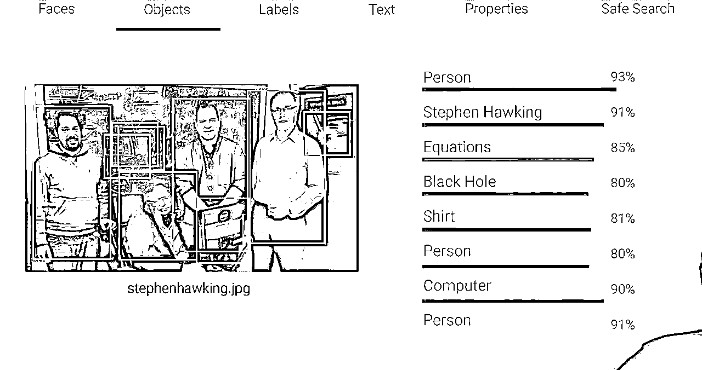
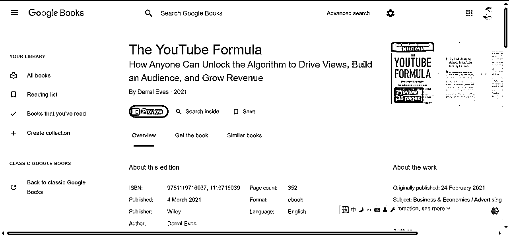
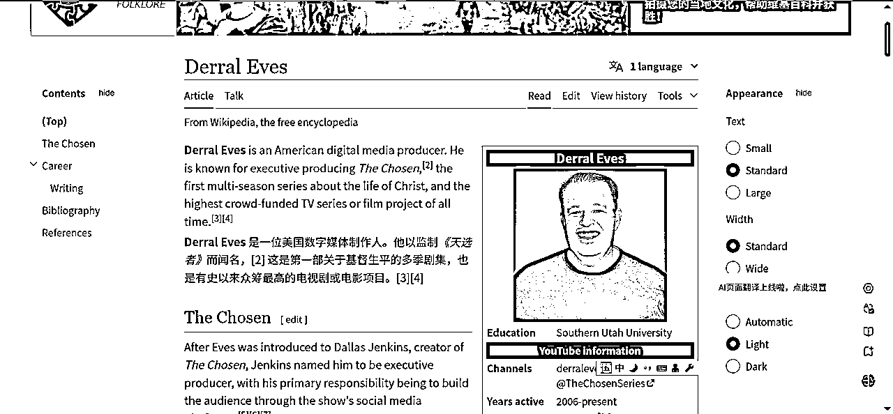
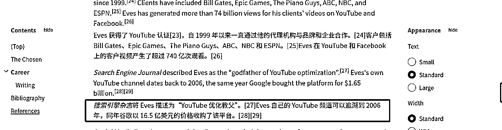
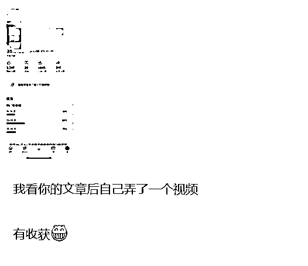
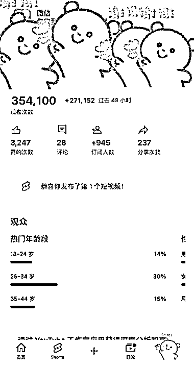
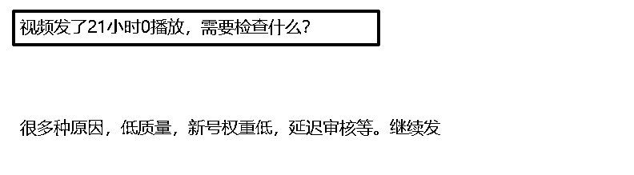
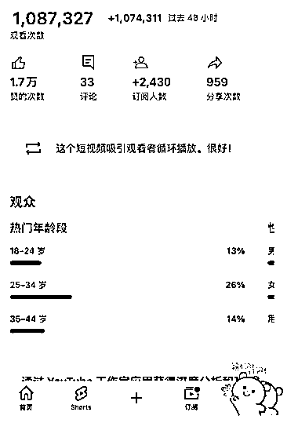

# 油管赚钱：很多人正在学习错误的知识，为什么在YouTube上养号不是一个必选项？

> 来源：[https://rlwxa0zgke.feishu.cn/docx/LGqId4GuEomWxFxB1EZcIEycnfe](https://rlwxa0zgke.feishu.cn/docx/LGqId4GuEomWxFxB1EZcIEycnfe)

在很多的关于YouTube的教程都会提到养号，在国内平台培训课都会有养号两个字，这似乎是一个不成文的规定，比如说新号注册多少天内，是几乎做不起来的，要“养号”，时间到了才能做，不然发什么作品也起不来。

其实这个也是未经证实的”传说“，忽悠小白没问题，对于我来说，我是不认可这个养号的说法的。

YouTube没有养号一说，可以说不用养号也可以，注册好账号直接发也OK。

为什么说不用养号也可以？YouTube是2005年2月14日创办的，到现在已经有20年了，这么多年来的技术沉淀，它的算法是很强大的。

比如下面的一张图，google的算法不弱的，就靠一张图就识别 Person、Stephen Hawking、Equations、Black Hole、Shirt、Person、Computer、Person

油管公式的作者

搜索引擎杂志将 Eves 描述为“YouTube 优化教父,他写的书，在我看来对于做YouTube的人是必看的，在国内做出一点成绩，然后就把国内的经验照抄在YouTube，我认为这是一个偷懒的行为，这是犯了类似于刻舟求剑的错误。

我希望在后续我能看到的关于YouTube的教程中少看到养号相关的描述, goolge（YouTube是google旗下的产品）的算法已经足够强大，不是你所谓你养号就有播放的。

Derral Eves 在书上有过这样的表述——不是油管有问题而是我的视频/内容还不够好 我确实需要把字体进行一个加粗。

【腾讯文档】 油管公式

https://docs.qq.com/doc/DRkRJUFVRZ1JSTGtZ

一般来说， 最少准备两个频道，一个频道是刷刷日常，想看啥就看啥，也包括找对标账号，另一个频道就做垂直。

在日常的账号来找对标账号，找到对标账号后，在垂直账号关注在日常账号找到的对标账号。

为什么这么做？你的垂直账号只关注对标账号，那么垂直账号的首页就只有对标账号（当然也会有其他内容，但是你对标账号的内容会更多），这样方便你抄作业。

分两个频道才是较为专业的操作，总之记住一点，你想过YPP的频道，也就是垂直的频道只关注对标。你日常的账号就是用来看找对标的。

注册好后，如果内容受观众欢迎，自然会有很多人来看，核心关键点在于你的视频的质量。

我们可以试想一下，就算你养了号，你视频做得垃圾，你做一个垃圾就因为你养了号就有人看？答案肯定不是的。

比如说，你养了号还是0播。但是别人不养号直接发播放量还是不错，那么这个养号是否有必要，这是值得质疑的。

YouTube算法是对视频做赛马机制，符合YouTube推送算法，自然会有更多的人来观看你的视频，反之，你做了一个垃圾视频，这里所谓的垃圾视频是针对观众反馈而言。

总之，你做优质视频YouTube自然会帮你推，反之，你就算是养号，你做的是垃圾视频YouTube 也不会推你的视频的。

你的视频在48小时内会给你大力推，如果你看到类似下面的页面，文字提示——【这个短视频吸引观看者循环播放。很好!】你心里就有底了。播放量是有保障的。

以上也是我一家之言

我的观点是：只要你做的视频内容是优质的，无所谓养号，反之，你就算是养号，你做垃圾视频，YouTube也不会帮你推。

后面是一些信息的补充，下次有时间，把YouTube的算法详细版再发一发

YouTube 的目标

1、预测观众想看什么

2、最大限度地提高观众的长期参与度和满意度

人工智能使用多个系统/算法

1、浏览功能:首页(个性化推荐(新的和旧的))和订阅

2、推荐视频:“接下来播放”，同类或相关

3、趋势视频:区域/社群当下关心的热点

4、通知:打开小铃铛

5、搜索:依赖元数据，观众反馈和新鲜度

这些算法，有时间再详细讲，举例说明会更好

油管如何收集用户数据？

油管（YouTube）通过多种方式收集用户数据，以便更好地推荐视频并提升用户体验。以下是一些主要的收集方法：

1.  用户行为监测:

*   每天，油管会收集大量的用户行为数据，包括观看时长、喜欢或不喜欢的视频、用户是否跳过视频以及观看的具体内容等。报告指出，油管每天从用户行为中收集约800亿个数据点。（这是之公布的一个数据，到现在不准，只会更多）

1.  视频数据分析:

*   油管还会收集与视频相关的数据，如视频的封面、标题、说明文字和字幕等信息。这些数据帮助油管理解视频内容，并在推荐算法中使用。

1.  反馈机制:

*   用户观看视频后，油管可能会向用户发放问卷调查，询问他们对视频的反馈。这帮助油管进一步了解用户的偏好。

1.  多层次的推荐算法:

*   油管使用一组复杂的算法来分析收集到的数据，从而推荐用户可能感兴趣的视频。这些算法不仅考虑用户的直接反馈，还考虑视频间的相互关系和用户的历史观看记录。

1.  安全扫描:

*   油管还利用图像识别技术（例如Cloud Vision）扫描视频封面和内容，以识别不当内容，确保平台内容的合规性和安全性。

通过这些方式，油管能够不断优化其推荐系统，提升用户的观看体验并增加用户的停留时间。

视频的原数据有哪些？

视频的原数据通常包括以下几个方面：

1.  封面图（缩略图）:

*   视频的代表性图片，吸引观众点击观看。

1.  标题:

*   视频的标题，关键信息直接影响其搜索和推荐效果。

1.  说明文字（描述）:

*   描述视频内容的文字，可以提供更多上下文，提高搜索的相关性。（这里如果自己有文字，让GPT来提炼下，放到视频说明这里。

1.  字幕:

*   视频中的文字部分，包括人工添加的字幕和自动生成的字幕，帮助理解视频内容并提高可达性。

1.  其它元数据:

*   包括上传日期、持续时间、分类标签等。

油管利用这些原数据来分析视频内容的相关性和安全性，并通过算法进行内容推荐。

如何提高视频在油管的推荐率？

要提高视频在油管上的推荐率，可以考虑以下策略：

1.  优化视频标题和描述:

*   使用吸引人且相关的关键词，以便于用户在搜索时能够找到你的视频。

1.  高质量的缩略图:

*   创建引人注目的缩略图，能够提高点击率。

1.  增加观看时间:

*   制作有趣的内容，鼓励用户观看完整个视频。YouTube倾向于推荐观看时长较长的视频。

1.  定期发布内容:

*   保持一致的发布频率，让观众知道何时可以期待新的视频。这可以帮助建立忠实的观众群体。

1.  互动性:

*   鼓励观众点赞、评论和分享你的视频，这会提高视频的参与度，从而改善推荐算法的表现。

1.  使用标签:

*   适当地使用标签，帮助油管理解你的内容并将其推荐给感兴趣的观众。

1.  关注分析数据:

*   使用YouTube分析工具监测你的视频表现，了解哪些内容受欢迎并据此调整策略。

1.  建立社区:

*   通过社交媒体、直播、问答等方式与观众互动，增强他们的参与感和忠诚度。