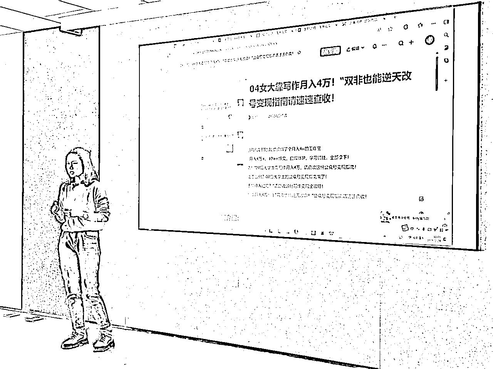

# 生财联合办公室分享会-10w+爆文操盘手贝拉，手把手诊断爆款标题，绝不是套公式那么简单！

> 来源：[https://ewtk6agpo4c.feishu.cn/docx/KPZqd0J7rog41nxbfMscZ9hxnBe](https://ewtk6agpo4c.feishu.cn/docx/KPZqd0J7rog41nxbfMscZ9hxnBe)

大家好，我是林悦己，来生财联合办公已经一周啦！联合办公就是神仙打架，太多牛批的朋友在这里，相互交流，体验感极好，尤其是周五自己赶上的第一场内部分享会！

非常感谢雪姨邀请贝拉给大家做这一次的分享会，也解答了自己——偶尔爆款，认真做的内容却无人问津的烦恼。趁着周末整理了分享会上自己记得笔记。虽然分享会是聚焦"10万+爆文标题"，但实际涵盖了从内容定位、用户分析到创作技巧的全方位策略，干货满满！

爆款内容的创作

❌不是靠运气

✅而是源于对用户的深刻理解、对创作规律的把握以及持续的实践与优化

笔记主要是几个内容

1.  文章是“产品”

1.  爆款内容如何科学诊断

1.  怎么写好爆款

1.  内容创作要以终为始，有目的的去创作

1.  热点可以蹭，但是语义得对

1.  AI提效80%，但关键因素在于“人”的20%

1.  个人IP打造的思考

## 一、重新认识内容：产品思维的应用

### 内容即产品

每一篇文章、每一条视频、每一次分享，本质上都是一个需要精心打造的"产品"。这一认知转变是内容创作的第一步突破：

*   找准产品核心：你的内容产品核心是什么？是你的个人魅力、专业技能还是独特视角？

*   价值定位：你的内容解决了用户什么问题？满足了什么需求？

*   差异化优势：在同质化严重的内容市场，你的独特之处在哪里？

思考启发：尝试像分析一款产品那样分析你最近的一篇内容。它的核心功能是什么？用户体验如何？有什么可以改进的地方？

### 用户分析：内容创作的原点

内容创作最大的误区是"自嗨"——只考虑自己想表达什么，而忽略受众真正需要什么。

我自己就是这样子，很用心的写，结果压根没人看，确实怨不得别人.....

*   精准用户画像：不要笼统地说"我的用户是25-35岁白领"，而应该具体到"工作3-5年，正面临职业瓶颈，渴望突破但又不确定方向的年轻专业人士"

*   深度需求挖掘：通过竞品评论区、社群讨论、问答平台等渠道，发掘用户真实痛点

*   认知匹配：你的内容表达方式必须符合目标用户的认知水平和表达习惯，而非自己的思维方式

实践工具：创建一个表格，横轴是你能提供的内容点，纵轴是用户可能的需求点，找出交叉最多的领域，那就是你应该重点发力的方向。

## 二、爆款内容的科学诊断

### 关键指标解读

爆款内容并非偶然，而是有迹可循的结果：

*   打开率与留存率双指标：高打开低留存说明标题党，高留存低打开说明标题乏力

*   互动深度：不只看评论数量，更要关注评论质量和深度

*   转化效果：最终是否带来了实际行动（关注、购买、分享等）

### 对标分析的正确姿势

*   选择合适的标杆：不是所有爆款都适合借鉴，找与你k相近的"可抄爆款"

*   结构化拆解：不只看"做了什么"，更要研究"为什么这样做"，这内容想让用户有什么行动？

*   取其精华：吸收核心机制，而非简单复制表面形式

洞察方法：选择3-5个行业爆款，列出它们的共同特点，这些特点很可能就是你所在领域的用户核心需求所在。

## 三、爆款标题的制胜法则

标题是内容的第一道门槛，也是决定打开率的关键因素：

### 结构设计

*   视觉跳点：关键词，前后顺序

*   层层递进：关键词并非拼凑，而是层层递进，不断让用户进入自己设置好的场域

*   情绪带动：关键词的作用之一是能让用户产生我们预期的情绪

### 心理触发

*   身份认同：让用户在看到标题时产生"这就是在说我"的感觉

*   FOMO效应（Fear Of Missing Out）：创造不看就会错过重要信息的紧迫感

*   认知闭环：提出问题同时暗示有解决方案(即你要卖的“产品/服务/其他东西”)

### 实用技巧

*   同义换新词：保持原意的同时使用新鲜表达（背后的思维是low的，但是格调得高）

*   保持IP调性：标题风格要与个人/品牌整体形象一致

*   A/B测试：准备多个标题版本进行小范围测试，选择效果最佳的正式发布

创作练习：拿出一篇普通标题的文章，尝试用10种不同方式改写标题，然后请朋友选出最想点击的一个。

## 四、内容创作的深层策略

### "以终为始"的规划思维

*   明确目标：这篇内容发布后，你希望达成什么具体效果？

*   逆向设计：从目标出发，设计每一个内容环节

*   评估机制：设定衡量成功的具体指标

### 情感连接与信任建立

*   制造阵营感：让用户感到"我们是同一类人"，建立情感共鸣

*   承诺兑现：内容中提到的每一个承诺都必须在文章中得到满足

*   模棱两可大法：在适当情况下使用开放性表述，增加适用范围

### 用户心理平衡点

*   可及性原则：内容难度要让用户觉得"努力一下我也能做到"

*   高级感体验："看不懂，但感觉有点高级"的体验能增加用户对内容的认可

*   自尊保护：避免让用户产生"我永远做不到"的挫败感

思维拓展：下次创作前，试着从用户角度问自己："看完这篇内容，我能得到什么？我会有什么感受？我能采取什么行动？"

## 五、热点借力与节点把握

### 热点运用的智慧

*   语义契合：热点与你的内容主题必须有真实关联

*   用户匹配：热点必须是核心目标用户关心的

*   及时性：把握黄金48小时

### 节点内容的特殊性

*   网感胜于能力：节点爆款更依赖对网络氛围的敏感度而非内容制作能力

*   预判准备：提前规划年度重要节点内容

*   差异化切入：在同样的节点找到不同的表达角度

## 六、AI提效与人的价值

在AI内容创作工具普及的时代，理解人与AI的分工变得尤为重要：

*   80/20原则：AI可提效80%的常规工作，人的判断决定关键的20%

*   价值区分：AI擅长逻辑和结构，人擅长情感和洞察

*   明确指令：使用AI前必须明确自己想要什么

## 七、IP打造的系统思考

### 成功IP的三要素

*   人：个人特质、专业背景、价值观（要做IP本身得强！）

*   产品：你提供的具体内容或服务

*   事件：能够放大影响力的关键节点或话题

### 持续积累的重要性

*   一致性：内容风格和价值主张保持一致

*   深度挖掘：在特定领域持续深耕

*   互动循环：通过用户反馈不断优化内容

# 结尾碎碎念

我是林悦己，这次贝拉的分享真的太绝了！

如果你也有IP文的需求，欢迎去链接贝拉喔！期待接下来更多的分享内容，不说了，我自己也去反省为啥我总自嗨了！