# 共享充电宝还能干吗？入局3个月，每月被动收入4万元。

> 来源：[https://dxdd2f1ks2a.feishu.cn/docx/Ln6JdbPdJoSHh0xI27LcnGDRnOf](https://dxdd2f1ks2a.feishu.cn/docx/Ln6JdbPdJoSHh0xI27LcnGDRnOf)

大家好，我是做了六年本地生活的老姚，从外卖、承包外卖站点、公众号拉新、到抖音本地生活。做了两年多抖音本地生活后，不知道大家有没有和我一样的苦恼，抖音规定一天一个样，事越来越多，但是毛利越来越低。我迫切的想要一个能持续稳定给我供血、提供现金流的本地业务，不求大富大贵，在重在稳定，这样我心里压力就会大大降低，后面再测试了抖音IP、供应链、餐饮培训、地摊经济等。最后在生财发现充电宝这个赛道不错，也和生财周先生聊了一下，并且通过一个月的考察周期和三个月的深度运营拿到了结果。感谢生财有术，感谢涛哥、孙策、周先生。感谢所有给我帮助的圈友们，有一些心得，想要分享给对充电宝感兴趣或者对本地这类业务感兴趣的圈友们，可以少走一些弯路，我们共同探讨、共同进步，如果能帮助大家少走一些弯路就更好了。这个我第一次写文章，文笔不佳，请多多包涵，我尽量把事情描述清楚，不耽误大家宝贵时间，会从几个角度拆解这个项目。帮助大家从零开始认识充电宝，第三、四、五是科普。，可能看起来有点枯燥，但是十分干货，如果你没有充电宝经验，相信看完的你一定有所收获。如果你有基础，核心运营思路在第六点，省时间也可以直接看第六点。但是第六点比较合适公司或者团队来做。个人做的话，重点看第九条。

1.  目前拿到的结果展示

1.  为什么选择充电宝这个赛道

1.  充电宝行业的分析，为什么选择美团充电宝（科普）

1.  充电宝行业的供应链逻辑和金融逻辑（科普）

1.  充电宝这笔账怎么算（科普）【充电宝的盈利计算公式】

1.  确定我们的核心竞争优势（偏向团队和公司运营思路）

1.  BD的成交链路

1.  达到我们的想要的最好模型【最理想的盈利模型】

1.  合适哪些人群做（有个人和公司思路）

1.  普通人怎么提升这个行业成功率

# 一、目前拿到的结果展示

我们从2023.9月底起盘，到2023年底，用了三个月左右时间就，从零做到了八万块钱左右的一个月收入的盘子。而且毛利率在55-60%之间平时流水能保持在三千上下，节假日会冲一下高峰。利润在4.5万每个月，截止目前我们投入了20万+了，预计还有几个月就可以回本，已经实现了团队的盈利和一定的正向循环，下面2024年元旦当天的截图。看起来我们的业务很顺利是不是？其实我们中间踩过了无数的坑，说起来满满的都是泪。

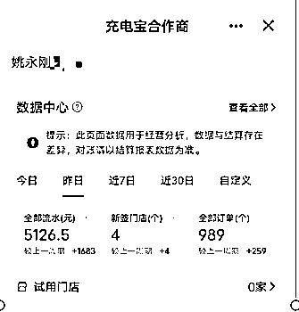

我们当时启动资金用了30万，有15万投入购买设备，有15万去当做团队运营资金。因为我们和美团申请了政策，我们15万的设备资金，后面大概撬动了60万的设备金额。并且现在基本上不用再增资金就可以继续拿机器了，运营资金主要是作为办公室开支、和给业务员放底薪和奖金作为使用。做这个业务前期肯定是会亏损的，体量还没有起来，留着预备金额要支撑到团队盈利。毕竟一台特斯拉的钱就可以开始搞这个项目，成本不算高。

而且我们总结了一套不错的打法，并且有在中山、江门、珠海、佛山、深圳做试点，也拿到了满意的结果。毕竟这个行业充电宝谁都有，重点是运营。也会在文章里无条件的分享，如果分享不够细致，圈友可以点出来问题点，我再继续补充。可能我有点知识的陷阱了，圈友问，我就不藏私的回答。

我们团队已经实现盈利，我们打算继续深耕本地共享赛道，

2024年，目标是单城盈利100W（设备钱赚回来也算盈利），和覆盖周边几个城市。

# 二、为什么选择充电宝这个赛道

一开始选择这个赛道的时候，内心也是惶恐不安，毕竟大家都说充电宝好卷，到处都是，没有机会了，手机电池只会越冲越快，电池容量只会越来越大。而且商户说，动不动就是二八分润和三七分润，怎么赚钱啊？等等焦虑的声音一直动摇这我的内心。

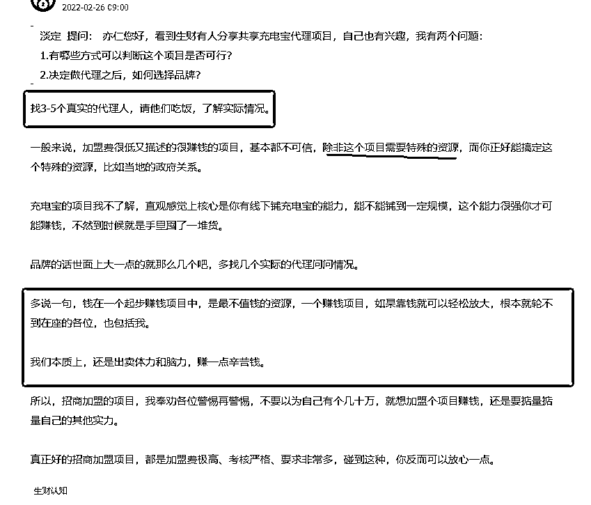

没有调查就没有发言权，我们开始了一个月的调研。我在生财里把所有的文章关于充电宝的都看了一遍，让我触动最深的还是亦仁那句找人，请他们吃饭，了解真实情况。

真发现请别人吃饭也不是一个简单的事，一开始找同城的同行了解，人家不是很乐意说，没办法就厚着脸皮继续请，后面既然同城的同行不愿意都说。

我就把周边城市的同行也请了一遍。通过不断的请教和打听，并且加上问好几个人，而且人家一开始不愿意教我，但是后面熟了，也愿意给我分享了，花了快一个月，总算把这个思路理清楚了，也明白了同行的大概运营情况。

一直听商户说，二八分成，三七分成。后面通过同行了解到。没有那么多，其实一般就是35%左右。充电宝行业里的小套路也不少。那这样看毛利确实挺高的！

并且在孙策对业务判断的基础上，写下来了对充电宝行业的五个判断逻辑。

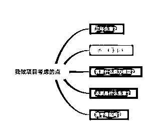

## 是否能做三年以上的生意？

充电宝这个行业2013年就开始了，爆发是在16年，现在已经是11年了。说明这不是一个短时间昙花一现的项目。

## 是否行业内很多人赚到了钱？

身边很多大中小代理商，活得都挺好，各有各的活法，都还算滋润。

## 需要什么能力模型？

需要的核心是低成本运营逻辑和设备管理能力。我自己六年本地生活经验，三年城市经理经验，我感觉这玩意我肯定能行。不行就是我在偷懒。

## 本质是什么生意？

本质是收租生意，就是我们属于线上房东。现金流非常好的一个生意。没有应收账款，毕竟三四块一个小时的充电宝，谁还要玩赊账么。

## 我亏得起吗？

这些设备都算是可移动的固定资产，又不是我投入几十万去装修，最后生意没起来就一场空。到不了我最后把设备卖给同行，打个折，也能收回来八成。怕啥！

想清楚了，就干。

# 三、充电宝行业的分析

为什么选择美团充电宝

## 1.充电宝行业的分析

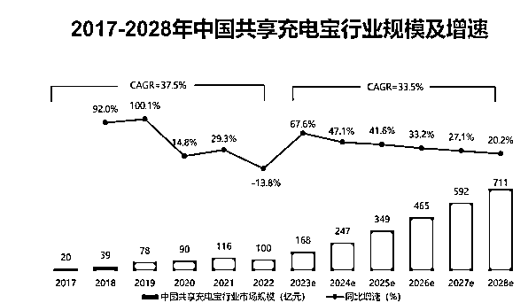

整体大盘数据是在逐年增长，消费习惯的养成。

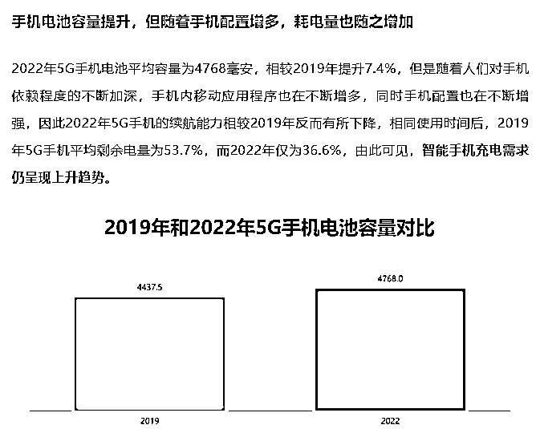

从图可以看出来，手机电池的库容量很小，但是手机性能的消耗量和增加的APP等消耗量在增加，加上这几年电池技术没有突破，也是就是我们手机充电的需求在增加。

## 2.为什么选择美团充电宝？

我们马上遇到了我们第一个问题，选择哪个品牌合作还是多品牌合作？是要多品牌还是单一品牌呢，真是让我犯了老大难了。既然如此就分析把。

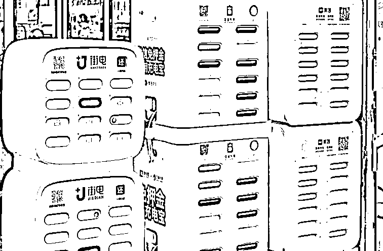

目前市面上的格局是三电一兽一团，加其他牌子的。也是除了，街电、怪兽、小电和美团以外的牌子都叫其他牌子，也就是小牌子。

街电覆盖率是最高的在我们那边，我第一个不考虑，而且是面包机，款式太老了。产品迭代不行。小电有点节节败退，在我们城市我也不考虑了。怪兽身边认识的朋友不多，风险大。

小牌子充电宝，能不能做，对新手来说难度更加大，合适做有一定体量后，辅助来做市场的工具和打一些优质场地（这个不展开说，涉及到预付款，租金等复杂财务逻辑）

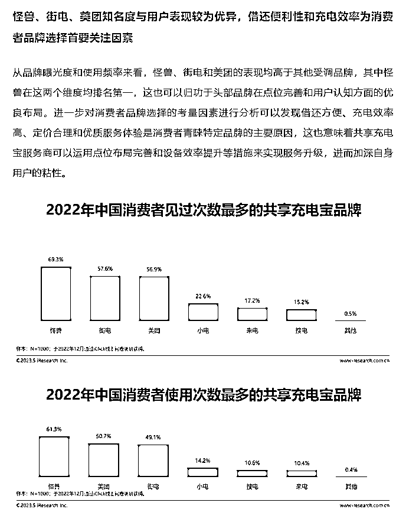

我们也结合了行业数据报告，最后还是选择了美团，因为知名度高，虹吸效应强（同样几个大品牌在一起，美团容易虹吸别人）。身边赚到钱的美团代理商朋友也比较多（不打广告，单纯就是为了自己赚钱）

又考虑到我们前期精力有限，贪多吃不透，那就全力干美团吧！生死已经看淡了，不服就是干。

# 四、充电宝行业的供应链逻辑和金融逻辑

很喜欢盗坤老师的这句话，充电宝也是，如果账都算不明白，还是别做的好。免得竹篮打水一场空。

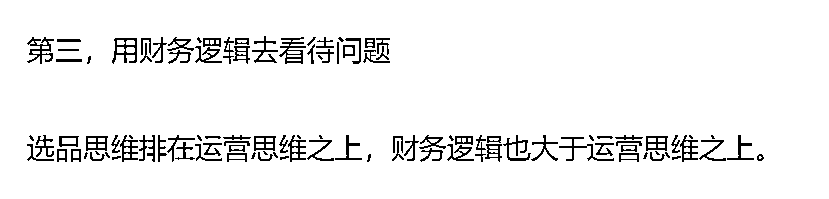

放一个我整理出来的思维导图，就会发现美团这个公司很有意思，他的整体设计是希望，每个商能够越来越好的成长起来。

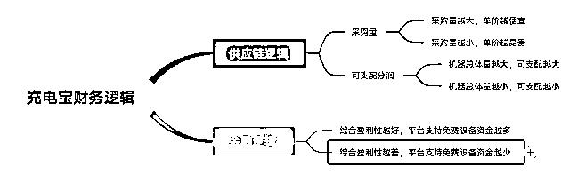

这个逻辑链路就会发现。最完美的方案就是，采购量越大，我们的单个机器采购成本越低，美团到我们手里的收益也会越高。如果在运营和管理水平没问题的情况下。美团会支持的免费设备资金会越多。就会进入一个良性循环。反之则是一个恶性循环。

接下来对美团的采购量和单价、可支配利润和金融逻辑进行一一解释。

## 1.美团的采购量和单价

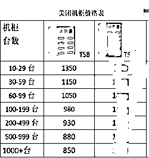

得出结论：单从八孔机器分析，为什么同样一个机柜会出现850到1350这么多的价格差异呢？是因为品牌方都希望采购方能够多购机器，然后采购的越多，机器的平均单价就会越便宜！1350-850=500，差不多会有500块钱的，一个差价空间，也就是说，如果我们在市场铺设能够满足的情况下，其实一次性在美团这边多采购充电宝，我们的整个成本是最低的，但是采购的越多市场和管理的压力也就是越大。

## 2.可支配利润

什么是可支配利润？就是不管你赚钱还是亏钱，只要出流水，美团都抽走它的部分，因为你用了人家的品牌，剩下的给你，可支配利润=自己利润+给商户分润

美团的星级从一星到五星分别给到代理商的利润是百分之92到80%之间

1星 80%基础+0总流水奖励 30台以下

2星 80%基础+3%总流水奖励 30-199台

3星 80%基础+6%总流水奖励 30-199台

4星80%基础+9%总流水奖励 200-699台

5星80%基础+12%总流水奖励 1000台及以上

大部分代理商只要正常做，都能做到三星，但是是到手百分之86左右就是一点的话，能达到四星的百分之89，非常努力的五星代理商，大概是可以做到92%。

## 3.金融逻辑

充电宝这个行业是本身没有金融杠杆的，但是美团为了扶持代理商，他们出了金融政策，我们可以把它理解为是有一个金融属性的一个产品，它是可以上一些金融杠杆的。

美团这边会针对你的商的情况，如果你本身的流水和毛利比较OK，他会让你去继续拿设备，并且是无息借给你的，可以分期12个月或者是24个月。他们会从你本身的流水里扣除货款金额

也就是说，如果你在运营能力足够强的情况下，前期你只需要投入一部分小额资金，然后就可以滚动出来一定的数据，后续通过跟美团进行二次分期，三次分期。自己在小额跟投很少的资金就可以完成空手套白狼了，可以理解为美团免费支持了很多机器给你，让你去创业，而且是免息的。

结论：这个生意模型就可以看得很明白了，就是我们能不能通过自身的运营能力和管理能力迅速的扑出去，那么多的设备，并且让这些设备产生一定的流水和提成。这也决定了，我们能不能用美团的金融杠杆属性为我们自己赋能，也就是我们前期可能只投入了三十万块钱，但是我们自身的运营能力和管理能力特别强，我们可以通过一定的金融杠杆把它提高到200万。

# 五、充电宝这笔账怎么算？【充电宝的盈利计算公式】

充电宝，第一要素是回本，把成本收回来。充电宝收回来，只要运营和管理能力正常的水平下，差不多一年收回来成本。第二，别让机器流失，丢失了损失的都是自己的钱。

营收-商家分成-品牌分成=实际所得

实际所得-运营成本-设备分摊成本=盈亏

营收：就是充电宝流水，我们可以控制每个小时收1-6块。

商家分成：就是我们实际分给商家的钱，这个我们可以控制

品牌分成：根据美团的星级分，美团给的不同价格

实际所得：营收-商家分成-品牌分成

运营成本：包括办公室、人员工资、奖金等

设备分摊成本：购买设备单价*数量/12，因为我们都是按照12个月回本周期来算的。就/12。

也就是你可能这一年会比较难受，但是你这一年回本动作完成了之后，第二年你基本上就是躺平的收入了，所以说这个模型也是能玩的！

# 六、确定我们的核心竞争优势（偏向团队和公司运营思路）

差异化竞争是没办法做了，毕竟充电宝都是标品，大家都有，只能做总成本领先。而且前面我基本上把市面上所有的打法研究了一遍。走的弯路会少了很多。也少了很多跌宕起伏。主要是前面一个半月熬过去就好了。

办公室在市中心附近，成本一定要便宜，而且面积在100平方左右，作为一个仓库和偶尔开开会就行了。成本最好控制在1500-2500之间。下面是我们满满登登的一角

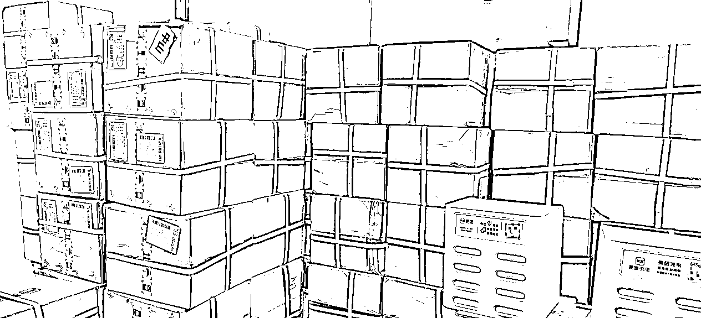

我们采取的策略是bd（也就是业务员）社会化，这个是我们在跟抖音的打交道过程中学会的一种思路，并且把它应用在充电宝里面！

就是简单来说BD（也就是业务员）采用有责底薪的情况。在这个过程中还发生过一个去派出所的故事。因为我们一个业务主管，没有描述清楚我们的的工资方案，最后一个BD做了十天，没有拿到一分钱，然后不归还我们的机器，然后我们就报警了，最后闹腾到了警察局，我们最后还是给了他几百块钱。对方也归还了机器，后面我在进来的新人，我们都会在微信上发文字给他们说清楚。这个有责底薪的问题。就避免了再出现这些情况了。

## 1.为什么选择BD社会化？

如果我们按照常规思路去招募地推业务员，我们需要付出的成本就是底薪加提成加社保，这对于一家公司来讲，成本是非常重的。而且还保不住他是来混日子的。后期也会付出大量的管理成本。而且离职后可能还会扯皮。所以要想出众，我们就必须有一个异常值，我们选择的是总成本领先。

## 2.社会BD，他们有什么痛点？有什么特征？

我们做过分析，发现其实在社会上有很多有能力的BD或者有上进心的BD，它并没有很好的变现渠道，而且他们手里面掌握着大量的商户资源，他原有的公司已经帮他进行了教育了。

## 3.怎么制定社会BD愿意玩的经济游戏

我们就通过改革，把无责底薪改为了有责底薪，我们的定义是机器收益大于60为有效门店，对有效门店，我们给他200块钱的有责底薪，一个月封顶4000,元，这里还有一个很巧的心理话术，就是我们一定要跟他暗示这个钱是特殊给到他的，让他感觉到珍惜，因为他没有别的更好的变现渠道，对我们公司来讲，相当于说我们不需要承担无责底薪和社保只需要付出，提成（有责底薪，我也可以理解为是一种提成和流水提成）那我们的运营成本就极大的降低了。

但是这种方法也有一种缺点，就是前期对招募官的招聘能力有很强的要求，他有很强的筛选能力，并且有极强的寻找简历和面试人的能力，但是优点也是显而易见的，优点就是公司的经营成本极大的下降，会很快的筛选掉那些想混日子的人。

总结：降低了混底薪的人，并且把社会剩余BD利用了起来。

## 4.怎么去招聘社会BD留才、育才

那我们怎么去快速组建一支有战斗力，并且成本比较低廉的一个地推团队呢？经过我们的一个测试，我们发现，还是要框准用户画像,我们的用户画像，他们往往有几个特征，第一点就是他们是有地推经验，或者说是快消经验，或者说是销售经验，或者互联网o too行业

他们首先是有经验的,其次，他们经常从事一线BD作业工作，有很强的这个BD作战能力。

最后就是他原来的那份工资，在当地收入水平嗯，不算高也不算低嗯，大概这样子一个情况，而且说它相对比较清闲，他每天可以拿出来的自由活动时间至少有两个小时到三个小时左右，其实这种人员在本地生活行业快消品行业里面还是蛮多的，好，既然有用户画像了。

招聘：那我们就从选材上来去进行，我们这边采取的策略是打开boss直聘，然后在上面每天把所有的招呼都打完，打200个招呼左右，大概会有十个人左右回复，十个回复的人里面，我们先加微信，线上视频面试，因为这样子，对面试官和面试者来讲都是性价比最高的， 我一般会给他们对应的一个话术。

给面试者说就是其实线上面试对你来讲，你也不用跑来跑去，而且线上我们聊得来，线下大概率也聊得来，如果线上我们沟通就觉得不合适，然后你也不用来了，这样子就节约了你的成一般面试者都能接受。

总结：我平均200个招呼，能有5-10个左右回复，加微信能有2-3个，十个微信里，面试的有七八个，七八个合适的最多只有一个，综合算下来。要1000个招呼里筛选出来一个就不错了。

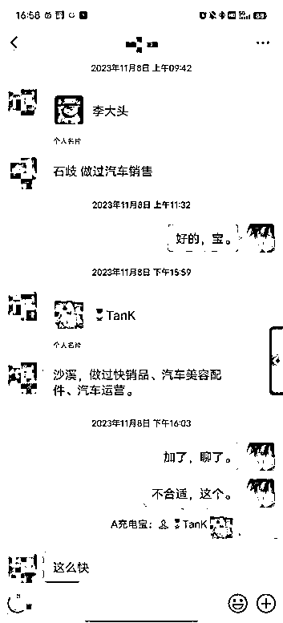

选才：面试完通过了之后，就会让他去拎包试岗，拎包的话，大概就一两天，主要是看他们的积极程度，还有靠不靠谱。不合适的是正常的，合适的才是不正常的。心态一定要放好。

育才：第一步，我首先看中的是他这个人有没有态度，因为这份工作他并不是说是特别难，只要有执行力就可以。一般我都会给他五台机器，让他去铺设完这个看人，有些人慢慢吞吞的，一天铺设一台两台的这种嗯，除非他是有行业经验，不然他大概率是很难去完

成这个动作的，同样，五台机器有些人前面两天就已经铺设完毕了

基本上前期他们的态度看到了之后，后面呢，我们就会让他去狂铺门店，看到门店就铺，看到门店就铺，大概一个BD铺到20家左右的时候，其实他已经很清楚这个区域的充电宝习惯了，哪些门店能出单？哪些门店不能出单？他心里面就会很清楚，第二步的话，我们就会引导他来总结，让他明白他想去跑什么类型的门店

总结：新人最重要的态度和跑，而不是一上来就跑到优质门店。

## 5.管理者的核心动作

管理者核心就做好两件事情就行了，第一件事情就是不断的招人，并且说是跟他们进行培养，第二件事情就是保证机器的不丢失，并且每个月可以进行总结，然后尽可能去节约BD的成长周期

心得：就是作为一个管理者，我们也要适当的跟下属提供一定的情绪价值。怎么提供情绪价值呢？多夸下面BD和管理就行了。比如，这个门店不错、比如今天新签了两家很棒，因为地推是一个辛苦活，大部分时候，大家在外面都挺受气的。多夸他们一下。他们就能开心一整天。遇到问题和需要批评的，尽可能还是小规模处理。

## 6.拿到结果

我们从上年九月底开始启动，十-十二月月份大概就招了50个BD，但其实我们付出的这个成本并不高，因为大部分BD过来干个几天，他们就走了，他们可能就觉得不合适

通过大概一两个月的这个筛选，我们就找到了有五个比较能干的bd。平均每个月也就是增长两个合适的BD。

上面哪些是整个做起来的核心。

## 7.这个过程发生的一些趣事和思考

11月的时候，我们才刚把业务模型跑通，后面就是加快速去搞就行了。大力招人，快速培训快速上岗，控制好ROI就行。

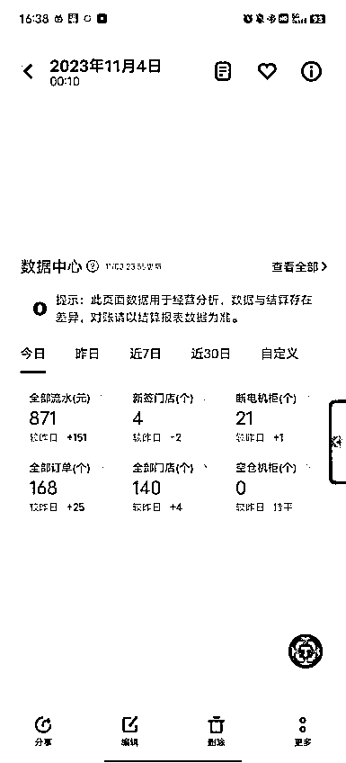

### 避免丢机

一台设备千把块成本，在算上上面机柜的充电宝一个扣款69元。那成本还是蛮重的。每天需要重点观察断电时间超过24小时的，如果超过了，就要电话里问问商户是不是遇到什么情况了。然后尽快去解决。我们出现过两次店铺倒闭然后，被卖给废品站的情况。然后我们去联系废品站找到了对方的情况。后面我也会在机器上加上贴纸。遇到丢机的话，别人可能也会主动联系我们。

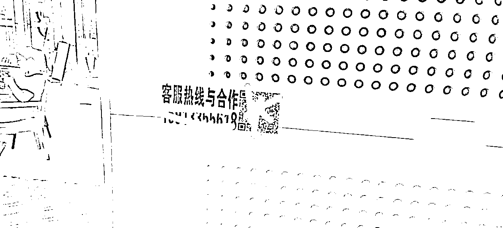

### 陪访动作

时不时要下去陪访一下BD和主管，让大家感觉到大家是在一起努力的推进这个事情的。有时候也会深夜陪访一起去装机。

### 在团队建设上犯过的错误

1.  慎重招聘同行：不要随便招聘有经验的充电宝业务员，不管是直营的还是代理的。尽量选择，社会BD里没有直接充电宝经验的人，我们的惨痛经历，那些有经验的业务员，大部分是吃了当年充电宝大红利期的人，所以他们有固定思维，现在的充电宝怎么可能有当年那么好，很难说服他们的。而且他们小心思特别多。管理起来费劲。宁可培养都不要随便要有充电宝业务的业务员。

1.  少一些团建：我们团建过三次，每次团建后，这些业务员平时没有什么联系，后面团建认识以后，就是一起吐槽，本来没事的就变得有事了。后面直接把团建改为给小礼品。避免负能量。

1.  交通成本：有辆便宜的电动汽车真香，因为很多业务来公司比较远，来回四五十公里，一般我都给他们送过去。电动车成本真低很香。开市场那三个月，我一个月跑5000公里还是市内为主！

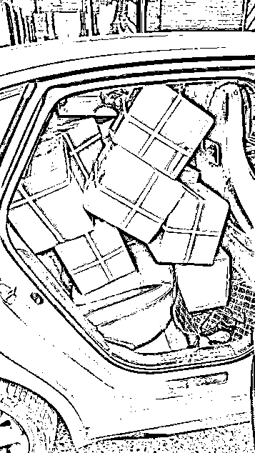

1.  团队管理，哪怕我们是有责底薪也有，有正常的管理工作。周复盘，陪访早启动等。遇到调皮捣蛋的BD和管理，也要先礼后兵，不行就手起刀落。不要拖拖拉拉。比如这个，十月进来的，一开始态度很好，后面也慢慢上轨道了。但是就开始自己认不清自己。给他说了怎么拿工资的方案，自己不认真听。其他BD都懂都拿到了。就他没拿到。然后就会找我发牢骚。对我发牢骚我是可以接受的。但是总是喜欢开会的时候，把这些情绪散播出去。给他说了很多次了。最后也是屡教不改。我犹犹豫豫给了一个多月机会，想想真的是太磨叽了。

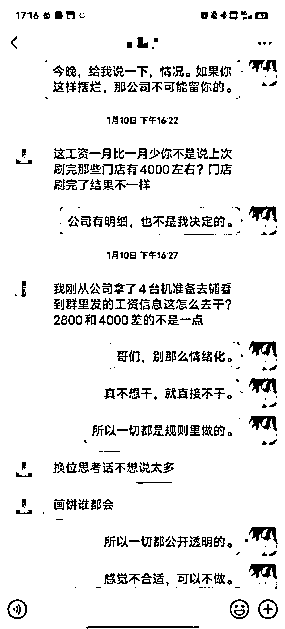

1.  100思维：充电宝这行业，最需要的就是100思维，比如不管那么多，先把100家门店铺设了再说。不管那么多先面试100个人再说。就是那么简单。

1.  长期耐心：充电宝真的一个需要有耐心的行业，我们刚开始做前面四五十家的时候，都有一些动摇了。付出了看不到什么流水提升，而且每天都感觉流水不涨的感觉挺难受的。那时候真的很难熬。多BD都好处就是，时不时某个BD会搞一些优质门店出来。前期需要一年左右的时间去熬，但是好处就是这个行业是一个确定性很高的行业。

# 七、BD的成交链路

1.  铺设量：每天BD能铺设2台设备已经是不错了。

1.  铺设场景：餐饮类、商超、酒旅、休闲、交通枢纽、医疗。大部分BD都是普通BD能完成，餐饮和商超和酒旅已经不错了。

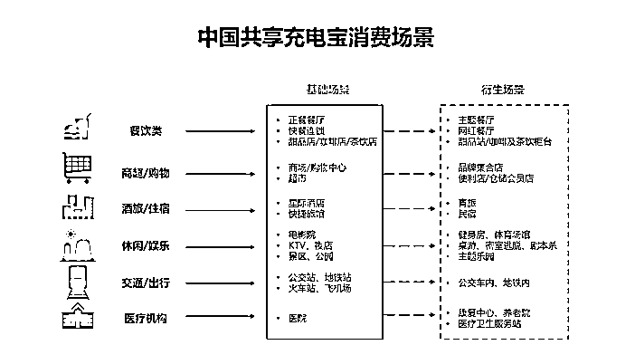

1.  BD只要正常去拜访商户，一天陌拜20个，基本上都可以成交2家。只要足够多的拜访就会有成交。充电宝机柜，我们不收商户押金成交难度比较小

1.  上单流程：商户只需要提供身份证正反面和手机号码，通过大象（美团后台）就可以完成上单

1.  大道至简，筛选商户能力 不重要，重要的事BD愿意跑单的能力。

1.  商家店里已经有很多充电宝了，为什么要多加一个美团的，如何说服并且成交？

没有别的办法，就是多刷脸给客情或者给入场费。入场费不推荐，因为成本太高了。很容易亏损。

1.  这个有区域保护吗，还是拿了货就可以满世界去铺？

充电宝行业没有任何区域保护，但是一般都是区域做比较好。因为后期还有维护成本在里面。我们区域总成本领先就很好了。

1.  BD 成交的难点都有哪些？

其实最核心的并不是成交难点，而是拜访量，只要有足够的拜访量就一定能出单。先出单，在优化。

1.  一般是如何和商家分润的？

美团里面是这样的一个逻辑100%里，美团给代理商80%剩下的0-12%根据等级，美团在进行返点政策。

我们80%里，还可以调整真分成和假分成，这个就不展开说了，反正就是给商户那里看的就是很高，实际上一般都没有。

对应话术：老板，充电宝这个基本上都是让客户用的，他们方便为主，而且本来就没有很多钱，一个月到手也就是一包中华或者两包中华啦。没所谓的。大部分老板都不会计较这个，100个里有四五个计较把。

1.  好的位置基本上都被占领了，你们怎么去开拓新的业务呢，自己有总结出一套独特的打法吗？

首先客户也分SABC等级，也就是超级头部，头部，腰部，尾部。其实对我们来说，超级头部是最坑的，因为他们太精明了。我们赚的很少很少甚至是亏全。腰部客户和头部客户才是我们的目标群里。这里的人群相对来说还好处理。并不是那么难。

怎么撬客户，两种办法，第一种用利益打动，比如更高的点数更多的入场费这种。第二种就是多去拜访，脸熟了，老板给谁赚不是赚，就好说了。

新店，放心一个城市的新店特别多。多的让我们瞠目结舌，就把新店的铺设这波吃好就非常不错了。

# 八、达到我们的想要的最好模型【最理想的盈利模型】

这样这个生意模型就很清晰了。

我们一边通过美团，无息的去拿出来大量的机器，完成产品端的供给。

我们一边通过社会剩余高质量BD的使用，完成人才的供给。

就可以把这个项目推动起来，我们通过大量拿设备，把我们单个设备的成本压到了850左右。就算我们给200块有效，门店给到BD，单机器成本也在1000左右，因为我们大规模拿机器，并且是无息的，

做了个图，可能更方便理解。

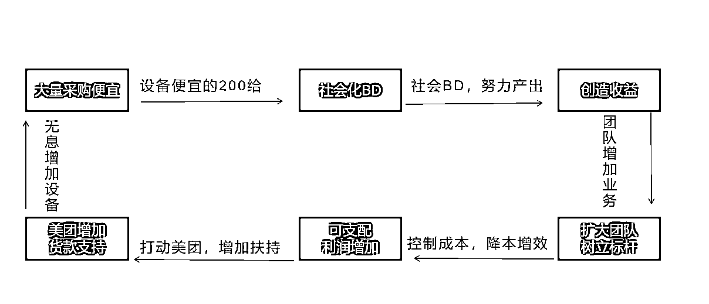

我们通过前期30万金额的投入，已经能做到，不在投入设备钱，并且通过不断优化机柜（就是把一些低产机柜撤掉，换成高产的地方），然后通过流水抵押。去换取新的机柜。团队在盈利了。目前团队一个主管+5个BD，每个月可以新增100家门店左右的水平。而且这个业务比较简单，基本的看看数据就行了。对我来说也不会浪费太多的精力。每天的管理成本在一个小时以内。

# 九、合适哪些人群做

## 个人

第一个有地推经验或者销售经验的，特别是面销的。

第二个本身就是互联网公司或者是地推公司，快消公司的员工，比如是在饿了么，美菜，等自身就拥有一定客户资源或者自己就经常做线下地推的那种。或者自己是快消品业务员，比如说青岛啤酒，哈尔滨啤酒等业务员

## 团队

第三种就是比较有资金实力或者说是，很有毅力，要做这件事情的人。比如POS机服务商、快消经销商等

充电宝这个生意可大可小。不管是十万块钱入局，还是五万块钱入局，还是1000万入局，其实都有它的不同玩法,基本上回本周期都是一年左右正常运营的情况下，超过一年的话就要考虑自己的运营打法是否有问题。基本上回本完之后，后面就可以实现接近于躺平的模式了.

充电宝，我认为它有一个非常好的一个点是什么呢？

门槛低：它适合普通人，就是首先你只要有比较强的地推能力，或者是销售能力啊，或者是你在这个城市比较熟悉。你就有可能可以做这个事情，其实比到最后就是拼谁比较勤快一些。

移动固定资产：这个产品呢，它属于一个固定资产啊，也可以理解为是一个移动的固定资产，比如说我们花个20万，我们如果去投资一个门店的话，装修的时候是特别值钱的，但是我们拆掉它的时候基本上折旧是非常厉害，但是充电宝这个东西呢，它折旧并不是特别厉害，第二个来讲就是，比如说我们在这个商家这边放了，感觉流水不太行，我们可以跟商家打个招呼，就把机器撤回来了，然后我们就放去别的商家再做测试,相对来说，整体风险是比较适合普通人去玩的。

后期交付小：基本上就是补补充电宝、弹弹宝就行了。

# 十、普通人怎么提升在这个行业成功率

第一步是对这个项目感兴趣，

第二步不是自己做项目，是找一家公司好好的上班，

第三步才是考虑做不做项目大家为什么做不起来？

特别是第二步

新人入局，充电宝行业,建议走三步

第一步，先把相关资料都给看一看，然后加几个朋友，跟他打听一下，然后判断一下自己是不是适合做这个业务

第二步，找一家公司去上班，然后认认真真的去打，至少三个月或三个月以上的工，而且在整个过程中要保证自己的业绩，在整个团队里面处于中上水平

第三步，第四个月或者是第四个月以后可以考虑自己小规模起盘子，前期起盘子也不建议规模特别大，最好就是控制在100台机器左右或者100台机器以下如果分这三步走的话。

相对来说人就不会那么有焦虑，而且对市场的感知，对整个业务线的理解就会比较熟悉，其实整个逻辑算下来的话，也就半年时间左右，其实就算轨道了，大家就可以拥有一个属于自己的小盘子了。

文章如果有不足，还望圈友指出来，如果有哪里阐述不清楚，可以点出来，我重点解锁。谢谢你的观看。感谢！