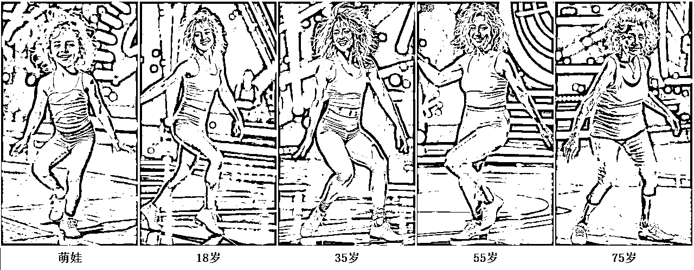
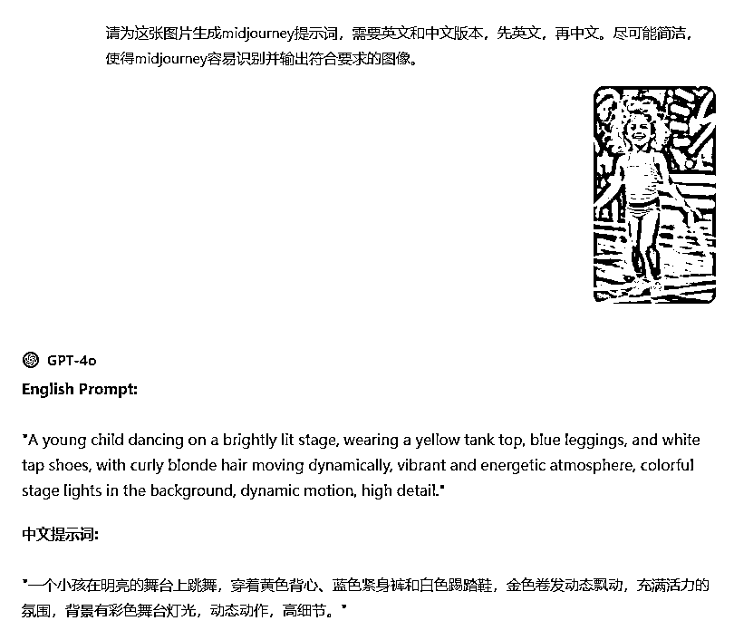
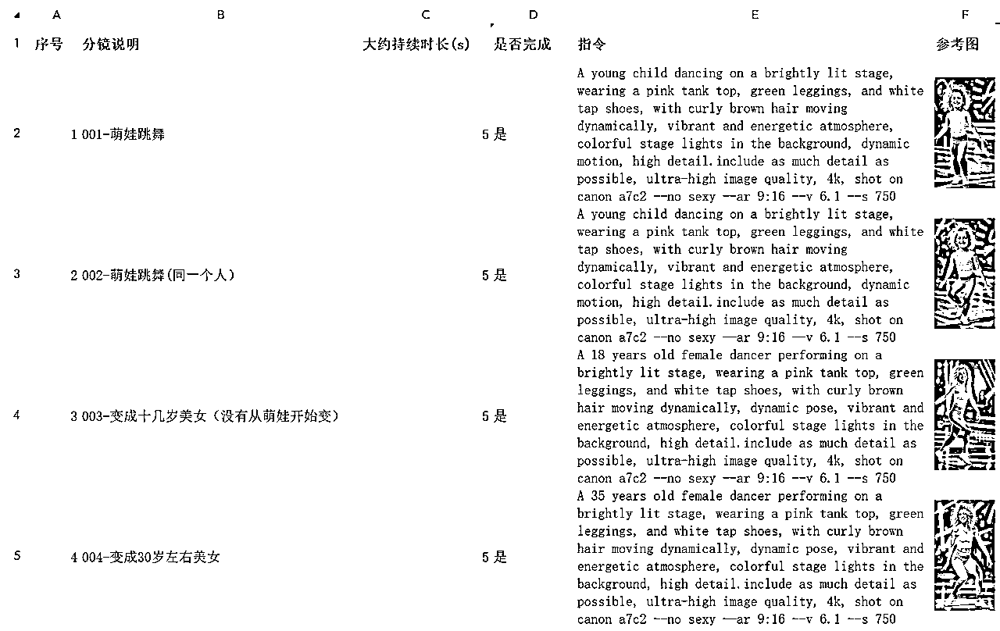
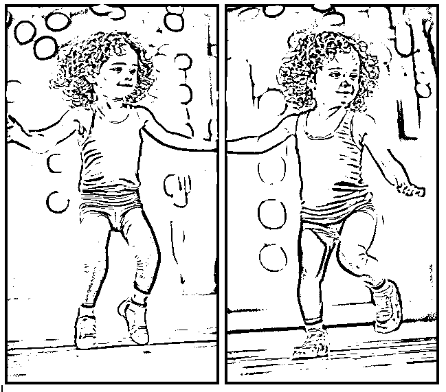
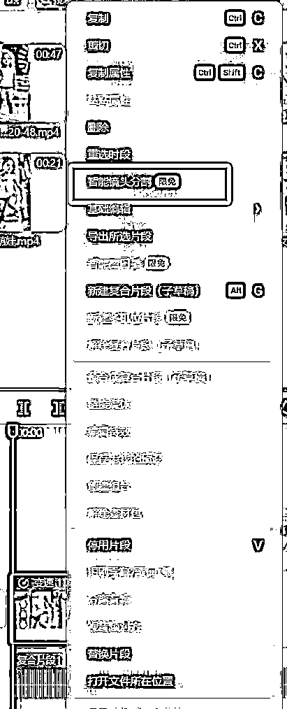

# 达人秀-X的一生【一个人从小长大变老】复刻实操教程

> 来源：[https://gpbr9zf6b9.feishu.cn/docx/DEF5dOfXgoPWkgxD74mcb5SqnUh](https://gpbr9zf6b9.feishu.cn/docx/DEF5dOfXgoPWkgxD74mcb5SqnUh)

大家好，我是浩少，加入生财不到1年的新人，之前参加过两次公众号爆文航海，拿到过还算凑合的结果，目前在做YouTube Shorts项目。

关于YouTube Shorts项目的详细信息，请参考2024年12月的航海手册，基本新手能碰到的问题都在里面了。这次我想跟各位分享一下达人秀赛道中，X的一生【一个人从小长大变老】视频的复刻方法，仅供参考。

这类视频的复刻，主要是以下几个步骤：下载对标视频、提取分镜、生成图片、生成视频、视频拼接，下面逐一介绍，希望大家根据本文档直接操作，可以成功复刻对标的视频。

# 下载对标视频

本次复刻的是一个萌娃边跳舞边变老的视频，对标视频如下：

关于视频的下载，很多圈友提供过方案，懂AI编程的用cursor写一个也可以，但下载最高分辨率的可能要研究一下yt_dlp库的相关参数。

目前我觉得比较稳定的是这个：https://yt.savetube.me/1kejjj1?id=361036481

像这种边跳舞边变身的视频，我觉得难点是生成随机又看着优雅的舞姿，以及让不同岁数的人和不同体型穿上同样的服装，别急，下文会逐个击破。

因为比较懒，我只想做跳舞场景部分的，对于AGT评委希望拿来主义。而我下载的对标视频是带水印的，市面上大部分去水印工具都是直接打马赛克，效果一言难尽。

近期一位圈友分享了个本地程序，带有AI去水印能力，测试过发现对跳舞场景的帧还是有点马赛克，但神奇的是评委部分基本看不到马赛克，太对胃口了。

去水印工具下载链接：

HitPaw Watermark Remover图片视频智能去除水印软件

链接: https://pan.baidu.com/s/1TkSjvgb_cLfS7EztXiuOZw?pwd=wsz6 提取码: wsz6

# 提取分镜

接下来就是提取分镜，经过分析，每个跳舞场景基本都是同一个年龄段跳一段，或者是从上一个年龄段跳到下一个年龄段，这基本就是用首尾帧生视频即可。

而本步骤的重点就是每个年龄段提取一张图片。大家可以采用老马教练的场景拆解工具，也可以自己看一遍视频截图，怎么方便怎么来。

生财圈友专属视频场景拆解工具.rar

链接：https://pan.baidu.com/s/1AJrJIX4DLudvbneAhMQPIA?pw...

提取码：62j4

下面是我提取的关键帧图片：

可以看到我这里提取的姿势是比较多样的，假如都是按上面75岁的那种姿势来提取，可能只能生成硬邦邦的舞姿，看上去效果就一般般了。所以这样子提取，其实是为了解决上面提到的第一个难点，通过不同的姿势，让AI出更优质的生图提示词。

# 生成图片

接下来就要生成分镜图片了，对于这种只有一个主体的图片，用MJ来反推提示词，也还可以接受，多主体的话就要慎用了。GPT-4o对应的反推能力比MJ实在强大不止几个量级，通过多次实操，确认GPT生成的提示词能在MJ能绘制出相当出色的图像。

上传图片给GPT，让其反推，参考提示词：

请为这张图片生成midjourney提示词，需要英文和中文版本，先英文，再中文。尽可能简洁，使得midjourney容易识别并输出符合要求的图像。

我本人习惯将所有分镜和对应提示词以excel方式来管理，不容易乱，关键是要保持不同岁数的角色主要特征一致，放在一起好对比。建议拷贝AI生成的提示词后，修改衣物颜色，头发颜色等，不要照搬。

因为不同岁数角色的图片给到AI反推，主要特征不一定是完全一致的，所以解决上面提到的第二个难点的关键就是，将人物要保留的特征，在不同角色的生图提示词中保持一致。

例如下图是我自己复刻的样例提示词，特征相同的是粉红色背心（pink tank top）、绿色紧身裤（green leggings）、白色踢踏鞋（white tap shoes）、卷发（curly hair，年轻时棕色、中年花白、老年全白）。

如果不是角色之间体型、身高、胸部等差别很大，其实采用Gary教练给到的即梦局部重绘方案效率更高。但我实测过，对这种场景会有很大的工作量，而且即梦的人脸好像来来去去只有那么几张，这可能也是大量日系美女变身视频的脸都差不多的原因吧。综上优化提示词更加方便。

但是优化提示词的方式也有缺陷，就是无法保证生成的背景一致，如果是追求背景一致的话，可以生成后，用即梦抠出比较满意的一个背景，再将不同图片中的角色抠到同一个背景中即可。

不过因为角色一直在跳舞，其实我自己基本都是被角色吸引，对背景的变动不是很敏感，效果还可以接受。

另外我认为生成的提示词中还有个非常重要的就是dynamic motion，这是让MJ生成随机舞姿的关键。

如果某个分镜是同一个年龄段在跳，为了生成的视频有更多舞姿，建议是生成了第一张比较喜欢的图片后，直接用V功能生成多两三次，提取不同舞姿的图片。比如第一个分镜，只有萌娃自己在跳舞，两张或者三张不同舞姿图片，基本可以保证生成的效果。

# 生成视频

在生成视频这一步，有众多方案，可能是我提示词的原因，国产如可灵、即梦，总是跳两三秒整个脸都糊掉再恢复，观感较差，实测最稳定的还是Runway。

Runway的话，在淘宝买1-3人共享账号，大概每月100出头，一次可以提交两个任务，生成效率还可以接受。

下面举例两个场景，采用Runway Gen3 Turbo：

## 场景一：萌娃跳舞（角色不变）

a girl dancing, dynamic motion, camera rotate to the left

大家可以自行测试只传一张图和用首尾帧方式，都有机会生成合格的视频，但是首尾帧在保证舞姿有较大差异方面更有优势。下面是我生成10s+8s（extend）的视频，效果还行：

## 场景二：萌娃跳成18岁（角色变了）

a girl dancing and growing, dynamic motion, camera rotate to the left

这个就必须首尾帧了，Runway实在是强大，那种平滑过渡没得说，基本抽一两次卡搞定。效果如下：

其他场景都是同理，大家多测试两三回熟悉了就OK了。

# 视频拼接

最后一步是视频拼接，用最强剪辑工具剪映解决。

主要步骤是分离对标视频的音频、分割评委场景，替换舞台场景，导出视频。

对于分割评委场景这一步，因为视频就几十秒，我会选择手动分隔场景，这样可以保证每个评委的片段不会混入对标视频的舞台画面。如果不介意不定期对标视频的舞台场景闪一下，可以采用更快捷的方法，智能镜头分割。

将对标视频拖到时间轴，右键菜单就可以看到了，目前是限免，基本30秒内能搞定。

根据对标的每个场景，替换对应的片段，调节场景的速度到满意即可。

最后导出视频清晰度选4K、勾选补分辨率、帧率60fps、勾选AI补帧，等待程序处理完补分辨率的任务后导出即可。下面是我的成品，除了最后一段变身有点慢，整体效果还能接受，供大家参考：

以上就是本次分享的所有内容，感兴趣的圈友可以实操一下，最后祝已经开通YPP的圈友条条视频大爆，预祝暂未开通YPP的圈友顺利开通！