# 闲鱼虚拟电商案例解析：单个店铺单品收益超10万，如何做到的？

> 来源：[https://riodtlbegu.feishu.cn/docx/Mc9pdf7XuoRsPhxiFaBc4DYbn4d](https://riodtlbegu.feishu.cn/docx/Mc9pdf7XuoRsPhxiFaBc4DYbn4d)

# 引言：闲鱼虚拟电商的潜力与机会

最近，我在闲鱼上发现了一个特别有意思的现象：一些虚拟商品店铺，看似不起眼，却悄悄赚得盆满钵满。竟然有店铺单店单品收益超过10万！我仔细研究了一下,结果发现了很多值得分享的细节。

平时做图时，我经常用到“搞定设计”和“创可贴”这类工具，但它们的会员功能总是让我觉得有点贵。有一次，我想试试“可画”（Canva）的会员功能，就去闲鱼上搜了一下，结果发现了一个卖“可画会员”的店铺。它的“想要数”高达2.8万，按照闲鱼的转化率估算，单品收益可能已经超过10万。这让我非常好奇，于是我开始研究类似的店铺，发现每家店铺的定价策略和销量都各有特点。

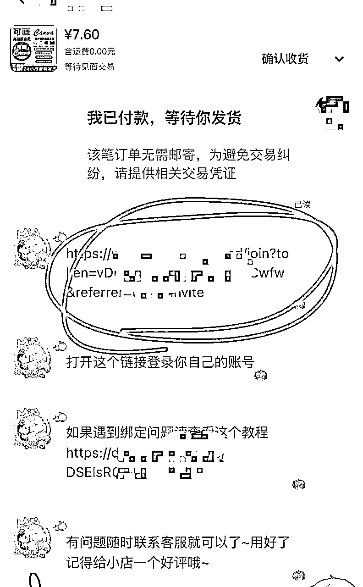

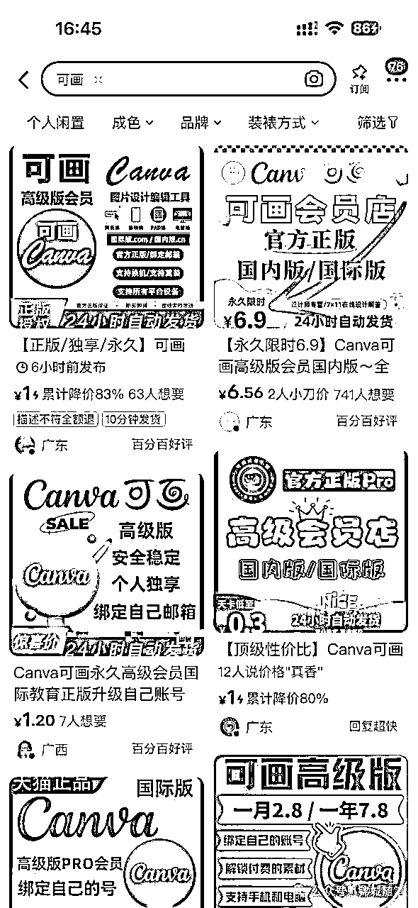

后来，我还特意去研究了一下“可画会员”的运作模式。原来，如果你加入别人的团队，就可以获得高级版会员，相当于零成本就能享受这些功能。而这些闲鱼卖家，其实就是通过团队邀请链接来操作的。

他们发给你一个链接，你加入团队后就能获得会员权限。只要团队还在，这个链接就可以无限次使用，直到团队会员失效为止。这也是为什么他们能以极低的成本卖出大量会员,相当于这个还可以配合自动发货,前期运营好,后期可以躺赚！

一个看似普通的虚拟商品，居然能带来这么高的收益？这让我忍不住深入研究了一番。今天，我就带大家一起拆解这些店铺的成功逻辑，看看他们是如何做到的。无论你是新手还是老手，这篇文章都会给你带来一些启发。

# 案例背景：五个店铺的数据对比:

为了更全面地分析，我整理了五个店铺的数据。这些店铺都在卖“可画会员”，但他们的运营策略和结果却大不相同。以下是具体的数据：

## 店铺1:

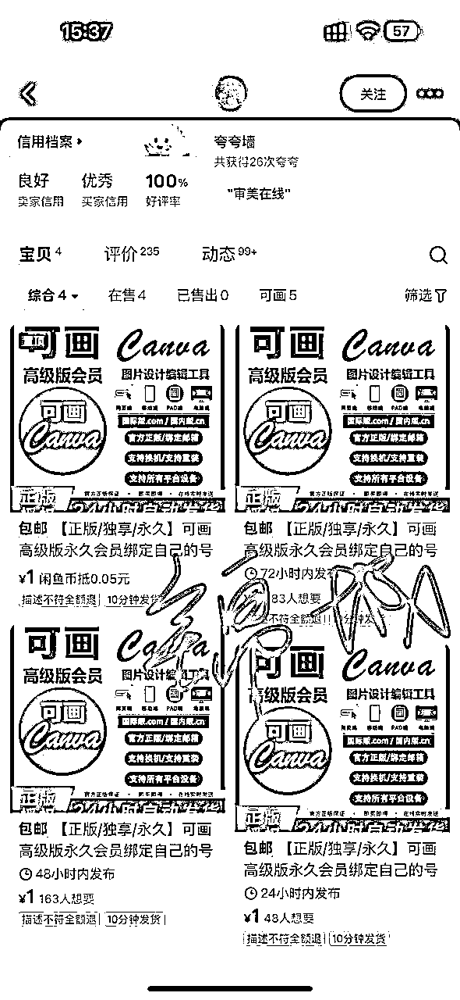

商品数量：4个

SKU定价：永久7.13元、一年6.65元、一个月4.75元、三天0.95元

想要数分别为：628、162、283、24

特点：定价较低，但“想要数”相对一般。

按照10个想要数,6个成交的话 收益大概 4500+

## 店铺2:

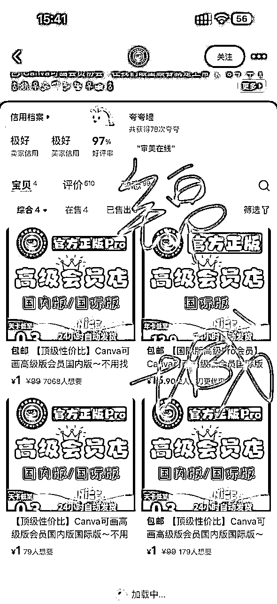

商品数量：4个

SKU定价：永久7.9元、两年5.9元、三天1元

想要数：7058、79、133、179

特点：永久版定价稍高，但“想要数”非常突出。

按照10个想要数,6个成交的话 收益大概 3.5万

## 店铺3:

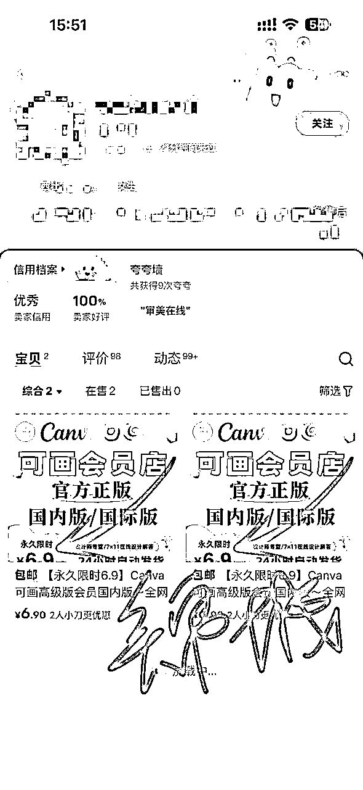

商品数量：2个

SKU定价：永久6.9元

想要数733、81

特点：只卖永久版，但“想要数”表现不错。

按照10个想要数,6个成交的话 收益大概 3400+

## 店铺4:

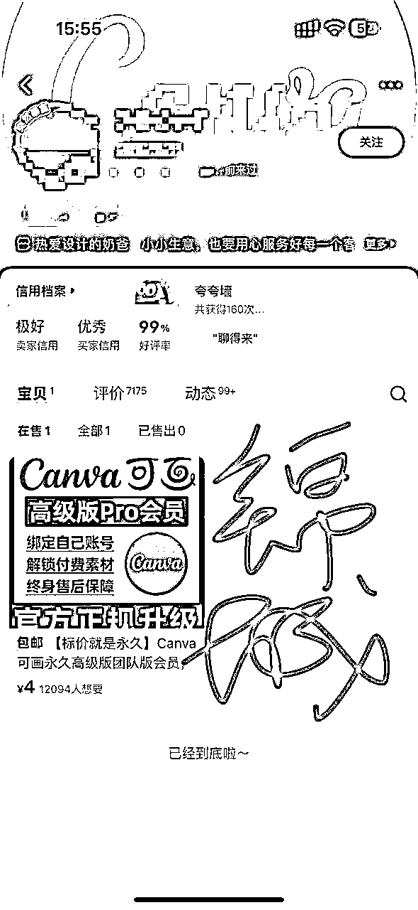

商品数量：1个

SKU定价：永久9.6元、三个月8.6、三天4元

想要数：12094

特点：及时价格比别家高很多,依然卖的非常不错

按照10个想要数,6个成交的话 收益大概 6.5万+

## 店铺5:

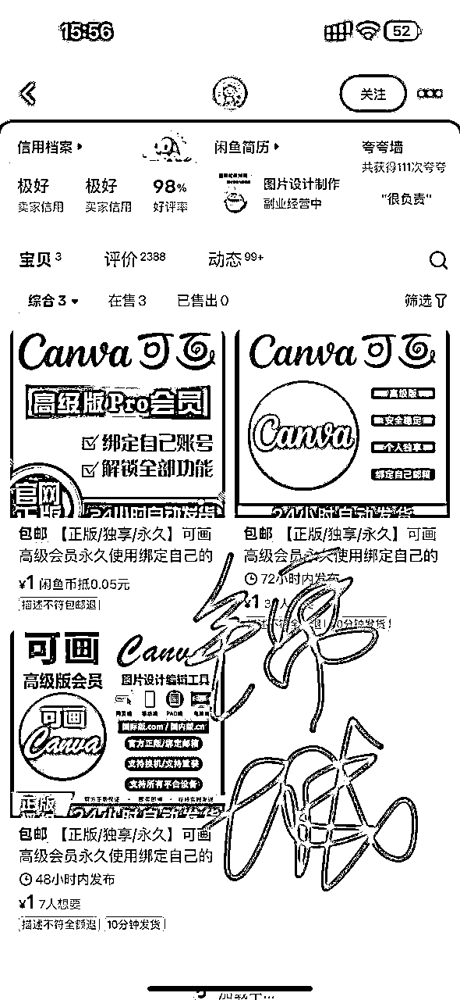

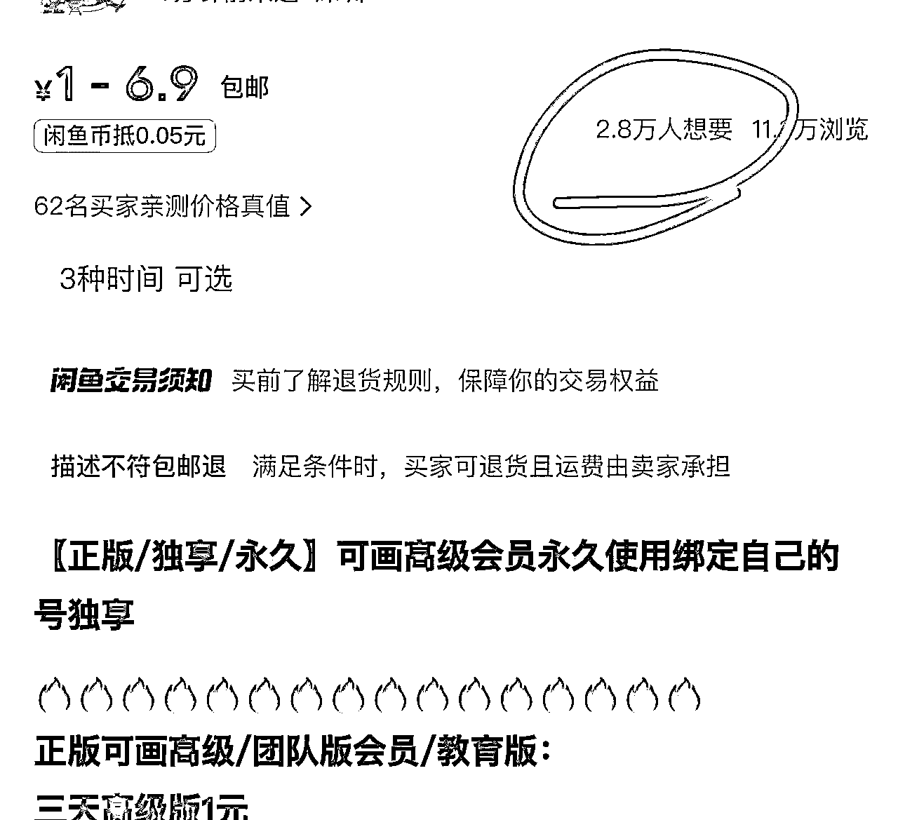

商品数量：3个

SKU定价：永久6.9元、一年6元、三天1元

想要数：6、39、28000

特点：三天1元的低价SKU吸引了大量用户，想要数最高2.8万！

按照10个想要数,6个成交的话 收益大概 11万+

当然还有其他店铺出单也是非常牛逼的,上面举例都是就卖这一个单品的店铺,别的店铺也有很多销量非常不错的。

从这些数据可以看出，店铺5的表现最为亮眼，2.8万的“想要数”直接带来了超10万的收益。那么，它是如何做到的呢？

# 成功关键：拆解店铺5的运营逻辑

##### （1）选品策略：抓住用户痛点

“可画会员”是一个刚需工具，尤其对自媒体人和设计师来说，几乎是必备的。但官网的年费一年168元，很多人觉得贵。店铺5通过低价策略，满足了用户“低成本获取高价值服务”的需求。

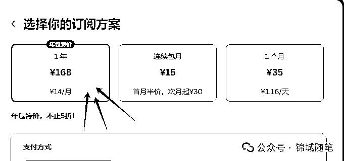

##### （2）定价技巧：低价引流，高利润转化

店铺5的定价策略非常聪明：

低价SKU：三天1元，吸引用户点击和尝试。

高利润SKU：永久6.9元，虽然价格低，但成本几乎为零，利润极高。

通过这种组合定价，店铺5既能吸引大量用户，又能实现高利润。

通过这种组合定价，店铺5既能吸引大量用户，又能实现高利润。其实，这种定价策略背后有一个很经典的消费心理：“锚定效应”。

举个例子，如果你去买奶茶，店员问你要中杯还是大杯，中杯15元，大杯18元，只差3元，大多数人都会选择大杯，因为感觉“更划算”。

同样的道理，店铺5的定价中，一年6元和永久6.9元只差0.9元，几乎可以忽略不计。这时候，用户自然会觉得“永久版更值”，哪怕他们可能只用几个月。

但实际上，这两个选项的成本几乎是一样的。这就是定价的巧妙之处：用低价SKU吸引用户点击，再用高利润SKU实现盈利。

我做过调查,这种团队的会员基本一两个月就掉了,实际上你拍1元的话,也可能一直都可以用,直到不能用位置,因为他们每天出单非常多,而且没办法判断哪个用户是哪个订单的,所以我猜测,1元和6.9元实际效果是一样的。

##### （3）流量获取：优化标题和主图

店铺5的标题通常是“可画会员永久版，低价直充，秒发”，简洁明了，直击用户需求。主图则使用了Canva的官方素材，显得专业可信。

##### （4）用户心理：制造从众效应

2.8万的“想要数”和大量的成交记录，让用户产生了一种“大家都在买，我也要买”的心理。这种从众效应进一步推动了销量的增长。随着销量越来越高，从众心理反馈也会越来越高，从而带动销量。如果两个店铺卖一样的商品，一个月销量10000，一个月销量100，你会如何选择？

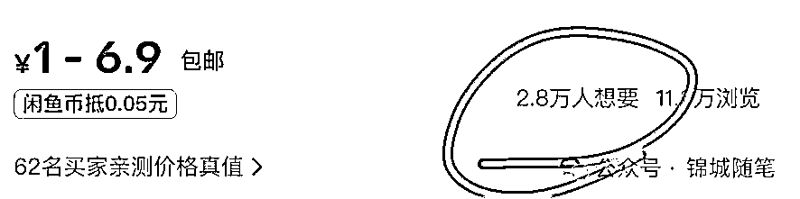

# 实操步骤：如何在闲鱼复制这个模式

如果你想在闲鱼上复制这个模式，可以按照以下步骤操作：

##### 第一步：选品

选择类似“可画会员”的高需求虚拟商品。可以通过以下方法找到潜力商品：

工具类：设计工具、办公软件、学习平台会员等。

资源类：电子书、课程、素材包等。

服务类：代充值、代注册等。

##### 第二步：上架优化

标题：突出核心卖点，比如“低价”“永久”“秒发”。

描述：详细说明商品的优势和使用方法，解决用户的疑虑,可以参考同行的商品文案,稍做修改即可

主图：使用清晰、专业的图片，抓住用户通痛点,比如可画销量高的商品主图里面会有 绑定自己的账号 安全稳定 绑定自己邮箱 支持所有平台等字眼，吸引用户点击。

##### 第三步：定价策略

低价SKU：设置一个极低的价格（如1元），吸引用户点击。

高利润SKU：设置一个高利润的价格（如永久6.9元），实现盈利。

中间利润SKU:设置一个比高利润sku稍微低一点价格的中间利润sku,让用户选择

##### 第四步：流量提升

初期推广：可以使用小黄鱼,鱼币推广,降价等

优化排名：通过更新商品内容、小黄鱼0.01等提高商品的曝光率。

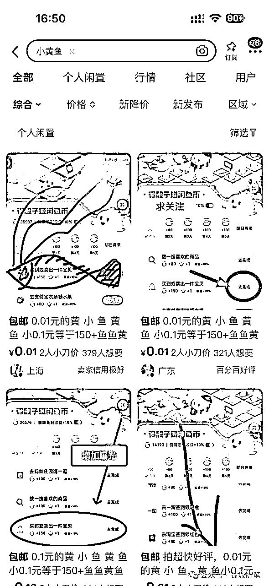

# 总结与行动建议：抓住闲鱼虚拟电商的机会

通过拆解这几个店铺的案例，我们可以看到，想做好闲鱼虚拟电商离不开选品、定价和细致的运营。如果你也想尝试做闲鱼虚拟电商的话,可以参考以下几点:

1.  选品 选品 还是选品！重要的事情说三遍

1.  注意规避违规和版权风险，确保长期运营。

1.  可以低利润,但是要长期稳定

1.  也可以选择高价商品,即使同行定价1元,你也可以定价5元10元甚至20元都可以,要勇敢定价,吃推荐流量不吃搜索流量！