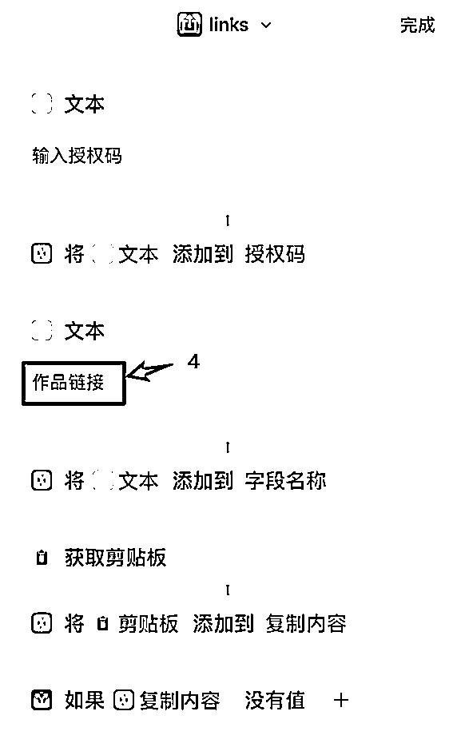

# iOS端采集链接上传多维表格

> 来源：[https://aaywqwo0zxd.feishu.cn/docx/AkPzd5kDrou91txQXKVcuafjn0b](https://aaywqwo0zxd.feishu.cn/docx/AkPzd5kDrou91txQXKVcuafjn0b)

# 获取多维表格参数

从自己的多维表格获取以下参数，教程仅供参考

# 安装ios快捷指令

https://www.icloud.com/shortcuts/967e03c6394d47f3ae885d0197900bca

（先点击此链接，然后复制到手机端safari浏览器打开）

第1步：复制快捷指令，到手机端safari浏览器打开

第2步：配置多维表格参数

token+table_id+授权码

第3步：配置超链接字段名称

将多维表格其中一列改成作品链接，格式为超链接

配置超链接字段名称时，将多维表格其中一列改成作品链接，格式为超链接

也可以修改成自己想要的名字，但快捷指令文本和多维表格字段名需要一致

比如下图的商品链接

# 设置指令触发方式

# 常见的3个使用场景

1.  闲鱼商品监测