# 深度解析小游戏出海的7种商业变现模式

> 来源：[https://d6ua7sbe4d.feishu.cn/docx/NhnWdm1qJoZd2fxBEQhcetVQnOb](https://d6ua7sbe4d.feishu.cn/docx/NhnWdm1qJoZd2fxBEQhcetVQnOb)

哈喽，各位生财的圈友:

大家好，我是七鹿，前上市科技公司产品经理，现“七只鹿”游戏联合创始人，目前专注于H5小游戏出海。

生财的朋友看到“七鹿AI”公众号发表的文章《深度解析七种H5小游戏出海商业变现模式》，说这篇适合分享给生财的朋友，七鹿受邀将这篇稍作整理分享给大家。

我从去年10月份与朋友一起开始做小游戏出海，搭建了一个AI小游戏建站工具fafafa，上了很多小游戏网站，也有一些收获，聊了很多业内朋友，眼界大开，只感叹这个行业太吸金了。

这篇文章七鹿对小游戏出海这个行业的商业模式进行了梳理，总结了小游戏出海的7个商业模式，算是对前期出海经历一个复盘思考，希望能对正在寻找项目的圈友有所帮助。

（以下正文）

* * *

得益于海外的互联网开放生态，小游戏出海玩法真的是千篇一律，除了传统了移动APP（谷歌play/appstore）、facebook小游戏营销变现外，还有discord、YouTube等小游戏平台，以及近期小游戏出海圈热捧的谷歌SEO小游戏网站模式等，让很多朋友再次看到海外小游戏的变现魔力。

哪怕不是开发者，不会开发游戏，也能通过借助AI工具，搭建自己的小游戏网站，参与海外小游戏红利，抓住一个热点小游戏，一年都可以躺着吃了。

本文试着总结目前所知的海外小游戏商业模式，朋友们结合自己的资源和擅长能力，选择合适的平台和渠道，也方便大家对海外小游戏生态的底层逻辑形成一个大概的认知，建立自己的框架。

正如我在这篇小游戏出海指南介绍的https://mp.weixin.qq.com/s/F9VYe6BNRA9WVuFd1sU7CQ

我们做小游戏站，本质上是一种套利，将在社交媒体预热未热的新游戏，搬到谷歌这个最大的流量池，套免费搜索流量的利。所以我们现在玩的站点小游戏，实质是从谷歌自然搜索搞免费流量，然后引到我们的网站套广告收入或者内购充值的差价，当然这个投入不是实打实的资金，而是你的时间成本。 这个模式跟行业有些玩家早期套tiktok的短视频红利是一样的，低价买tiktok的有游戏广告，然后引流到挂谷歌广告的游戏网站，这里核心就是找到谷歌广告CPC高于tiktok视频cpc的游戏。因此，首先要搞清楚我们所处的生态定位，就是你所处于行业的哪个位置。所以我们本质上是游戏行业的渠道一环。那渠道最关键的价值就是低买高卖，低价买入流量，高价卖出流量。

## 一、小游戏商业模式组成要素

我们先罗列出小游戏这个商业模式的各个组成要素：

流量套利模式分析框架：我们可以构建更全面的流量套利模式分析框架

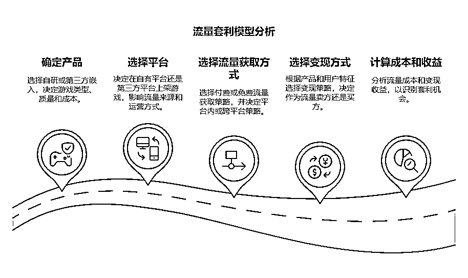

1.  确定产品 ： 选择自研或第三方嵌入，决定了游戏的类型、质量和成本。

1.  选择平台 ： 选择自有平台或第三方平台上架你的游戏，决定了流量来源和运营方式。

1.  选择流量获取方式 ： 选择付费流量或免费流量，并根据平台和你的产品特性，选择平台内或跨平台策略。

1.  选择变现方式 ： 根据产品和用户特点选择合适的变现方式，是流量贩卖方还是流量购买方。如果是流量贩卖方，那就是低成本或无成本获取流量，然后高价卖出流量。如果是流量购买方，那就是通过你的小游戏产品或资金换取平台的流量。

1.  计算成本和收益： 分析流量成本和变现收益，判断是否存在套利空间。

## 二、小游戏商业模式组成要素详解

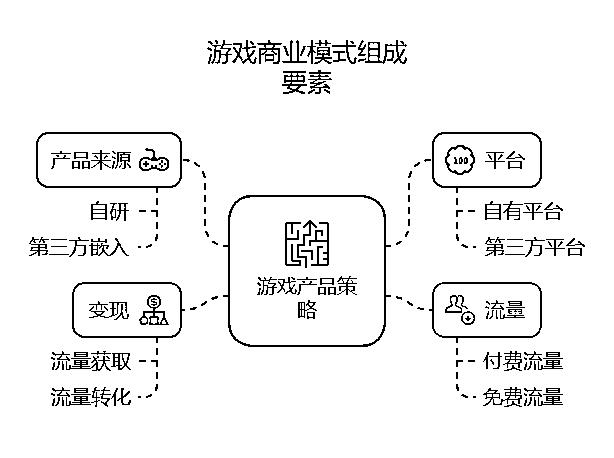

### 产品

也就是我们的小游戏来源，从哪来

自研 ： 自主开发，拥有IP和完整控制权，研发成本高但利润空间大。自研的产品形态一般有H5网站、APP、SDK、客户端等。

第三方嵌入 ： 嵌入第三方游戏（如iframe），无需研发成本，但受限于第三方游戏质量和类型。

### 平台

我们的游戏在哪里触达用户，用户在哪个地方玩，你可以发到自己的网站让用户在线玩，也可以发到app上架各应用市场让用户下载玩，还可以SDK形式上到poki、discord、youtube、Facebook 等。

*   自有平台 ： 自建网站、APP等，可控性强，变现规则灵活，但需要自行获取流量，。

*   第三方平台 ： 如Poki、Facebook Instant Games、微信小游戏等，拥有用户流量，但受平台规则限制。

*   专业游戏平台 ： Poki、CrazyGames、itch等，用户游戏意愿强。

*   移动游戏平台 ： Googlepaly、App Store、steam等，用户覆盖面广。

*   社交平台 ： TikTok、YouTube、Discord、Facebook等，用户社交属性强。

*   B2B平台：Gamedistribution、Gamemonetize等B2B平台

### 流量

就是我们的流量从哪里来，是付费的，还是免费的，是平台内还是平台外

*   付费流量 ： 广告投放、KOL推广等，可快速获取大量流量，但需要投入成本。

*   平台内投流 ： 在游戏所在平台进行广告投放，如在Poki上投Poki的广告。

*   跨平台投流 ： 在其他平台进行广告投放，将用户导流到游戏平台或自有平台，如在TikTok上投广告导流到自建游戏网站，在谷歌上投搜索流量导入到自己的网站，在paly上app广告。

*   免费流量 ： SEO、社群运营、病毒式传播等，成本较低或无需成本，但获取速度较慢。

*   平台内免费流量 (NTFI)： 依靠平台自然流量和推荐位，如Poki的新游推荐，tiktok、youtube、discord 等平台内的社交免费流量。

*   平台外免费流量 (NTFO)： 通过SEO优化自建网站，吸引谷歌搜索流量；通过社群运营在社交媒体上获取流量吸引用户到自己的网站。

### 变现

流量是变现的核心载体：

所有变现模式围绕“流量获取”与“流量转化”展开，本质是流量价值的再分配，通过流量成本与收益的差值实现盈利。

两类核心角色

*   流量贩卖方：通过低成本获取流量（如SEO、社媒引流），高价转卖给第三方（广告平台、分佣平台）赚取利差。

*   流量贩卖方的典型场景是“流量中间商”，如H5游戏通过网站广告变现，或通过联盟分佣引流用户到其他平台，本质是“流量转售”。追求低成本流量获取（SEO、病毒传播）与高溢价出售（广告、分佣）。

*   流量购买方：通过付费购买流量（如平台推广、广告投放），将用户导向自有资产（游戏、App），以用户价值（付费、广告曝光）覆盖流量成本并盈利。

*   流量购买方的典型场景是“产品驱动”，如自研游戏在Steam/YouTube买量，依赖产品本身的质量和用户付费（内购、买断）盈利。通过产品价值（游戏品质、用户粘性）覆盖流量成本，并产生超额收益。

*   b. 变现方式分类：广告、内购、买断、分佣等具体模式，均服务于上述两类角色的价值闭环。

*   广告 ： 展示广告（横幅、插页）、激励视频广告等，适合用户量大、付费意愿低的休闲游戏。适合低付费意愿的休闲游戏，开发者作为流量贩卖方，将用户注意力“卖给”广告主。还有一种可视为流量贩卖（为APP或steam平台导流）或流量购买（利用平台流量推广产品），取决于分佣关系中的主导权。

*   游戏内广告

*   平台内广告 ： 使用平台提供的广告服务，如Poki的广告SDK。或者GD（gamedistribution）的游戏内广告、谷歌的admob等

*   第三方广告 ： 使用第三方广告平台，如Google AdSense。

*   游戏外广告：网站H5小游戏的游戏外网页内广告。

*   内购 ： 游戏内道具、虚拟货币等，适合用户粘性高、付费意愿强的中重度游戏。

*   买断 ： 一次性付费购买游戏，适合品质高、内容丰富的精品游戏。

*   内购和买断适合中重度游戏，开发者作为流量购买方，需投入成本获取高价值用户。

*   分佣：自研游戏上架到GM、GD等B2B平台，获取佣金，或者你为steam游戏、app游戏下载带来分佣。

*   混合模式：例如“广告+内购”并存的游戏，可能同时扮演两种角色，需动态平衡流量价值。

*   变现核心公式

*   利润 =（用户生命周期价值 LTV - 流量获取成本 CAC）× 用户规模

*   贩卖方：LTV来自广告/分佣，CAC依赖自然流量；

*   购买方：LTV来自用户付费，CAC依赖投放效率。

*   变现策略选择

*   轻量级产品（如H5小游戏）：优先广告变现，降低CAC，依赖流量规模。

*   中重度产品：优先内购/买断，提升LTV，需精准购买高潜力用户流量。

*   若擅长低成本获客，则成为流量贩卖方（广告、分佣）；

*   若擅长产品运营，则成为流量购买方（内购、买断）。

*   成功的变现需在流量获取效率（CAC）与用户价值挖掘（LTV）之间找到最优平衡。

## 三、模式详解

通过组合上面的要素，总结了目前出海小游戏的7个模式，并逐一拆解。

先上结论： 本质上小游戏套利的逻辑就是低成本获取流量，高收益变现，赚取差价。

*   资源匮乏团队：优先社交裂变（模式三）或SEO套利（模式六）；

*   产品技术型团队：poki等专业游戏平台套利（模式二）、B2B技术套利（模式五）；

*   资金充足团队：混合变现对冲（模式四）或跨平台付费流量（模式一）、自研移动游戏平台（模式七）。

### 模式一：跨平台付费流量套利

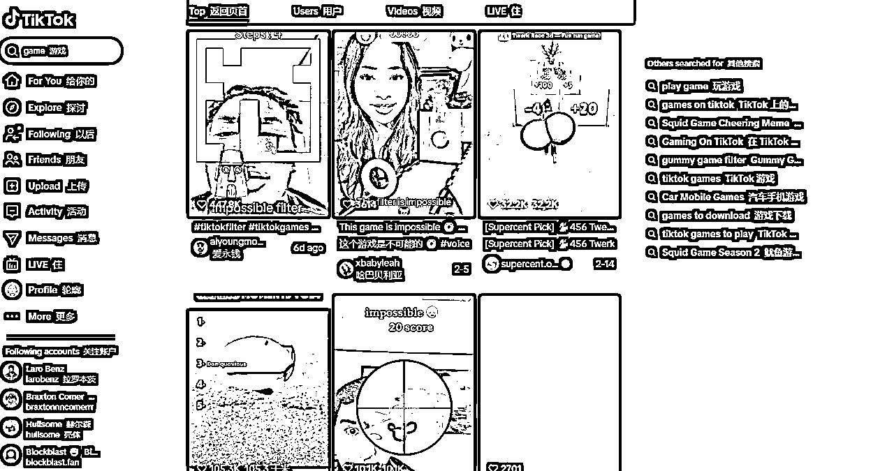

要素组合：

产品：第三方IFrame嵌入游戏

平台：自建小游戏网站

流量：TikTok付费广告

变现：自建站挂载Google AdSense（MAT，eCPM>$5）

套利逻辑：

通过TikTok短视频展示游戏亮点→用户点击广告进入自建站→广告收益覆盖流量成本。

数据验证：用户停留时间>3分钟 → 广告展示≥2次 → 单用户收益>0.02美元。

适用场景：

低成本休闲游戏，目标市场为欧美等高价值用户地区，以及新兴地区（东南亚、拉美）。

风险：

TikTok外链跳转可能被限制，需备选导流路径。

核心逻辑

该模式本质是流量成本与广告收益的差价套利，通过低成本的流量获取（TikTok广告）与高收益的广告变现（Google AdSense）之间的利差实现盈利。其核心公式为：

[ \text{单用户收益（ARPU）} > \text{单用户获取成本（CAC）} ]

关键要素拆解

低成本流量入口

TikTok广告：利用新兴市场（东南亚、拉美）用户基数大、广告竞争低的特点，以较低CPS（单次点击成本）获取用户。

内容策略：通过短视频展示游戏亮点（如魔性玩法、即时反馈），刺激用户点击外链进入自建站。

轻量级内容载体

IFrame嵌入游戏：无需自研游戏，直接嵌入第三方休闲游戏（如HTML5小游戏），降低开发成本与时间。

自建网站：作为流量中转站，仅承载游戏展示与广告位，技术门槛低且可快速迭代。

高效变现设计

广告展示优化：用户停留时间>3分钟→触发至少2次广告曝光（如插屏广告+激励视频），提升eCPM。

区域化定价：针对新兴市场用户特点，选择适配的广告类型（如激励视频）以维持高点击率（CTR）。

模式护城河

数据闭环验证：通过用户行为数据（停留时间、广告曝光频次）实时优化广告投放与网站设计，确保ROI>1。

低风险快速试错：轻资产模式（无自研游戏、依赖第三方广告平台）可快速复制到多个细分市场。

潜在风险与应对

平台政策风险：TikTok可能限制外链跳转，需备选引流路径（如私域社群、多平台分发）。

广告收益波动：新兴市场eCPM受宏观经济影响较大，需动态调整流量投放区域与游戏类型。

模式本质

该模式是“流量二道贩子”的变体：

低价采买流量：从TikTok等平台以较低CAC捕获用户注意力；

高价转售流量：通过自建站的广告位将流量“转卖”给Google AdSense广告主，赚取差价。

其核心竞争力在于流量转化效率的精细化运营，而非内容或技术壁垒，适用于短周期、高周转的“快钱”场景。

* * *

### 模式二：平台内自然流量套利

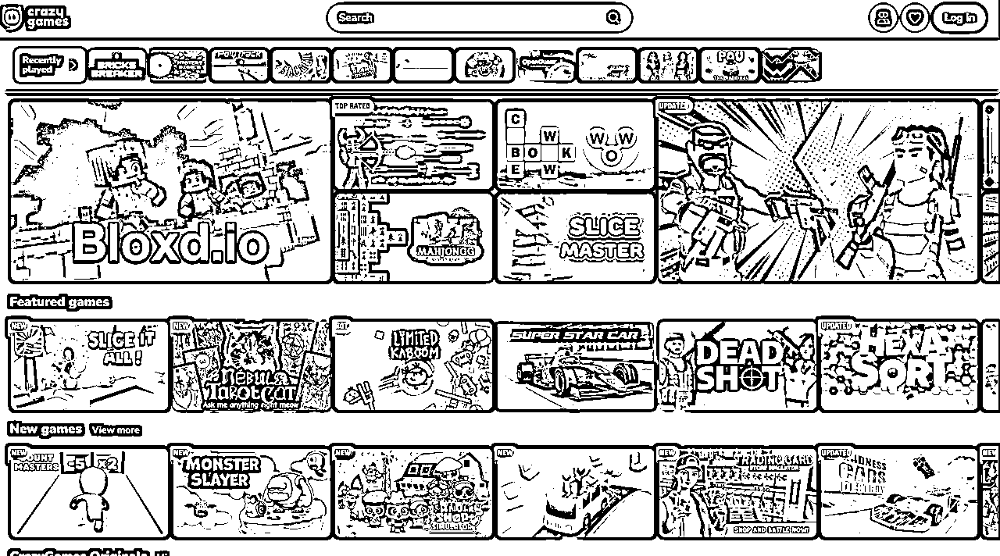

要素组合：

产品：自研自研精品H5小游戏

平台：Poki、CrazyGame、ITCH等游戏平台

流量：平台自然推荐流量

变现：内购分成或广告分成

套利逻辑：

利用Poki用户高活跃度→通过付费设计提高用户LTV→平台分成后净利润>40%。

适用场景：

欧美市场，用户付费意愿强，小游戏千次展现收入高。

风险：

需持续优化游戏留存（DAU>20%）。

* * *

模式核心逻辑

通过自研精品H5小游戏，依托海外游戏平台（如Poki、CrazyGames）的自然推荐流量，结合欧美用户高付费意愿，设计付费点或广告策略提升用户生命周期价值（LTV），利用平台分成机制（如Poki仅分30%）实现高利润率（>40%）的轻量级套利模式。

* * *

关键成功要素

产品定位

H5小游戏：开发成本低、跨平台适配性强，适合快速迭代测试用户偏好。

精品化设计：需具备轻度玩法（如解谜、休闲竞技）+ 强付费点（皮肤、道具、关卡解锁）或高广告展现频次。

流量与平台选择

平台自然流量红利：依赖Poki等平台算法推荐（类似Steam的“热门游戏”曝光），降低买量成本。

用户匹配度：瞄准欧美市场用户特征（高ARPU、对广告容忍度高），最大化千次展现收益（eCPM）。

变现效率优化

混合变现模型：内购（IAP）+ 广告（激励视频、插屏）结合，确保单用户收益（ARPU > $1）。

LTV提升策略：通过新手礼包、限时活动、社交分享奖励等设计延长用户生命周期。

* * *

风险与挑战

留存率依赖

DAU需稳定>20%：需持续优化游戏内容（如每周更新关卡、节日活动）避免用户流失。

平台流量波动：自然推荐流量受算法调整或竞品挤压风险，需多平台分发（如同步上架CrazyGames、ITCH）。

竞争与合规风险

同质化竞争：小游戏市场易被复制，需建立差异化壁垒（如IP联动、玩法微创新）。

广告合规性：需符合平台政策（如Poki对广告频次、类型的限制），避免因违规下架。

* * *

适用性与拓展性

目标市场：欧美成熟市场为主，可延伸至日韩等高付费潜力地区。

规模化路径：通过“小游戏矩阵”策略（多款游戏同步运营）分散风险，复用核心玩法模块降低开发成本。

长期价值：积累用户数据后，可向中重度游戏导流或自建独立平台（如Steam独立开发者页面）。

* * *

该模式本质是“平台流量套利+轻量产品复制”，适合具备快速开发能力、擅长数据驱动优化的团队。核心在于以低边际成本（H5开发）匹配高价值流量（平台推荐），通过精细化运营提升用户付费深度。风险点在于对平台流量和留存率的强依赖，需建立敏捷迭代机制与多平台布局以增强抗风险能力。

### 模式三：社交裂变免费流量套利

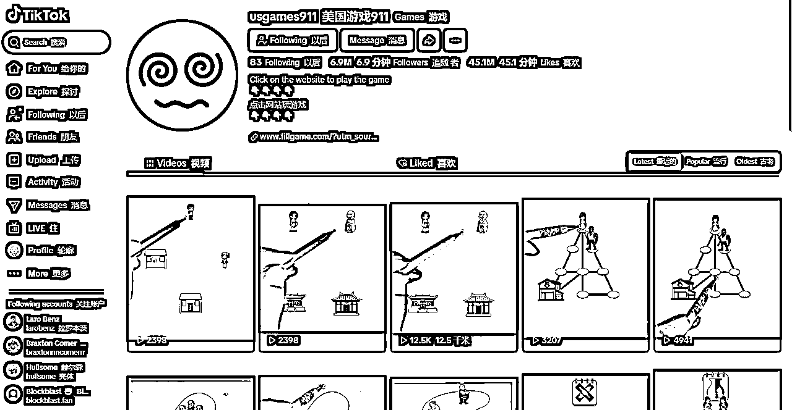

要素组合：

产品：第三方IFrame嵌入游戏，自建游戏网站

平台：Facebook、Instagram、TikTok、discord、Discord社群（PLTS）

流量：Facebook、Instagram、TikTok、discord、reddit社群运营导流至网站

变现：多种广告形式带来的综合收入

套利逻辑：

通过Discord社群等社交平台分发游戏链接→用户邀请好友解锁奖励→广告收益放大免费流量价值。

数据验证：裂变系数K>0.5（每用户带来0.5个新用户）。

适用场景：

强社交属性游戏，年轻用户群体。

风险：

依赖社群运营能力，需持续产出活动内容。

核心机制：低成本获客与流量倍增

社交裂变驱动增长：通过用户邀请好友解锁奖励的机制，将获客成本转移给用户自身，利用“以老带新”实现病毒式传播。利用用户社交价值替代广告投放成本，将获客转化为“用户邀请用户”的游戏化任务；

免费流量池运营：依赖Facebook、TikTok等社交平台的社群导流，避免付费广告成本，通过内容运营（如活动、UGC）吸引自然流量。以社群为流量中枢，整合多平台资源形成闭环，但需持续运营维系生态活力。

通过广告变现将流量快速货币化，依赖高用户活跃度与规模经济；

成功关键在于裂变机制设计、社群粘性维护与广告收益效率的平衡，本质是“用社交裂变撬动免费流量，用规模化流量换取广告收入”的流量生意。

轻量化产品与快速分发

IFrame嵌入游戏：采用轻量级第三方游戏，降低开发与维护成本，同时实现跨平台快速部署（如嵌入Discord、网站等）。技术门槛低，但需关注兼容性与用户体验。

去中心化分发：游戏链接通过社群扩散，用户既是玩家又是传播节点，形成“内容即链接”的传播路径。

变现逻辑：广告收益最大化

多元化广告组合：结合展示广告、激励视频、插屏广告等形式，适配游戏场景（如复活奖励、关卡解锁），提升广告填充率与点击率。

流量价值放大：用户增长与活跃度直接驱动广告收入增长，形成“用户规模↑→广告收益↑→活动投入↑→用户规模↑”的正向循环。

关键依赖与风险

社群运营能力：需持续输出活动、话题或内容以维持用户活跃度，否则流量易流失。例如，通过Discord频道组织比赛、更新游戏内容等。

平台政策风险：高度依赖第三方社交平台（如Facebook算法调整、Discord封禁链接），需建立多渠道流量矩阵以分散风险。

用户疲劳与留存：过度广告或重复裂变活动可能导致用户体验下降，需平衡变现与留存，例如优化广告频率、设计阶梯式奖励机制。

适用场景与边界

目标用户：年轻、高社交活跃群体（如Z世代），偏好轻量级、易分享的娱乐产品。

产品属性：强社交互动（如组队、排行榜）、低操作门槛的游戏，符合“短平快”体验需求，利于快速传播。

* * *

模式的本质

该模式是以社交关系链为杠杆，通过轻量化产品+免费社群流量+广告变现的三位一体策略，实现低成本规模扩张的流量套利模型。

* * *

### 模式四：综合游戏平台付费流量套利

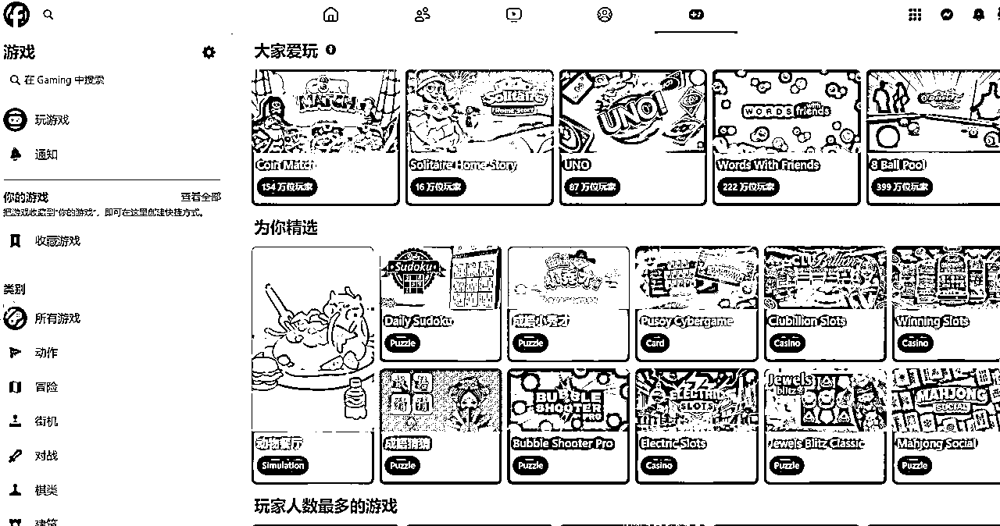

*   要素组合：

*   产品：自研轻中度游戏（PS，如模拟经营）

*   平台：Facebook Instant Games、youtube、discord等小游戏平台

*   流量：Facebook、Instagram、TikTok、discord等付费广告投放（PTFI，CPI<$0.5）

*   变现：内购（MI）+广告（MA）

*   套利逻辑：

*   付费用户贡献内购收益（ARPPU>$3）→非付费用户通过广告覆盖成本（eCPM>$8）。

*   关键指标：付费率>5%，广告展示率>70%。

*   适用场景：

*   混合变现成熟市场（如欧美）。

*   风险：

*   需平衡内购与广告体验，避免用户流失。

核心逻辑：

混合变现对冲模式的本质是通过用户分层与收益互补，在高成本、高回报的市场中构建动态平衡的盈利结构。

其核心逻辑可拆解为以下三个层面：

1.  用户价值的分层榨取

*   付费用户：瞄准欧美市场高付费意愿用户，通过深度游戏内容（如模拟经营的长线养成）设计内购点（ARPPU>$3），利用沉浸式体验促使核心用户持续付费。

*   非付费用户：通过轻度广告变现（eCPM>$8）快速回收CPI成本（<$0.5），依托小游戏平台的低启动门槛吸引泛用户，形成"广告即内容"的轻量化体验闭环。

底层逻辑：将用户群切割为"鲸鱼"（付费）与"流量"（广告）两类资产，前者贡献利润，后者承担获客成本，形成对冲机制。

* * *

1.  平台与流量套利

*   平台选择：Facebook/Youtube等小游戏平台具备"即点即玩"特性，降低用户进入门槛（PLTC策略），同时依托平台内社交关系链提升自然传播（如Discord社区裂变）。

*   流量组合：TikTok等渠道的年轻用户与Instagram家庭主妇群体形成交叉覆盖，通过自动化广告投放（PTFI）筛选高潜付费用户，实现"付费用户LTV > 广告用户CPA"的套利空间。

* * *

1.  风险对冲的动态模型

*   收益平衡公式：总收益 = (付费率×ARPPU) + (1-付费率)×广告收益/用户，当付费率>5%且广告展示率>70%时，模型可突破盈亏平衡点。

*   反脆弱设计：内购与广告形成双安全阀——当付费率下降时，通过提升广告频次（如插屏广告场景化植入）补偿收益；当广告收益波动时，依赖核心用户的内购稳定性托底。

* * *

模式创新点

*   成本转嫁机制：非付费用户通过广告变现覆盖自身获客成本，使开发者无需依赖单一用户群的付费转化。

*   体验阈值管理：采用"激励视频兑换游戏资源"等软性广告形式，将广告转化为游戏内功能模块，避免传统插屏广告的体验破坏。

* * *

成功前提与边界

*   市场选择：依赖欧美市场的高ARPPU（内购）与高eCPM（广告）双重红利，新兴市场因收益结构失衡难以复制。

*   数据驱动运营：需实时监控"付费率-广告展示率-CPI"三角关系，通过动态调整广告频次、内购定价维持模型平衡。

该模式本质是在用户价值分层的基础上，构建内购与广告的收益对冲网络，通过精准的用户生命周期管理（付费用户长线留存 vs 广告用户快速变现），实现"高成本获客-高收益回收"的正向循环。其护城河在于对用户行为数据的颗粒度把控与混合变现的精细化平衡能力。

* * *

### 模式五：B2B游戏分发分成套利

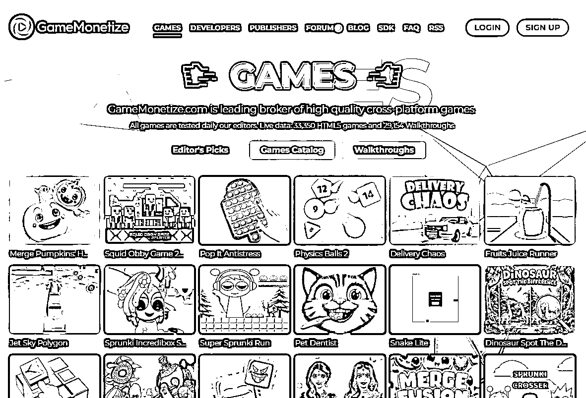

要素组合：

产品：自研定制H5小游戏

平台：SDK形式上架Gamedistrution、Gamemonetize等B端游戏分发平台/渠道

流量：B端分发平台下游的自有用户和渠道

变现：游戏广告分成收入

套利逻辑：

自研小游戏上架自GD等游戏B2B渠道分发平台，无需独自面对C端玩家获客，获取B端的流量广告分成

适用场景：

技术型团队，无C端游戏运营经验

风险：

游戏低质被B端渠道下架，B端分成收入少

核心逻辑

本质是资源整合与风险转移，通过以下路径实现套利：

产品端：聚焦轻量级H5小游戏开发，利用低成本、快速迭代的特点，降低研发投入风险。

分发端：借助B端平台（如Gamedistribution）的现有流量和渠道资源，跳过C端用户获取的高成本环节，直接触达下游用户。

变现端：通过广告分成共享收益，将市场推广和用户运营风险转移给B端平台，开发者仅需专注内容生产。

关键要素

效率驱动：以技术能力为核心，通过快速开发多款游戏形成“产品矩阵”，对冲单款游戏收入不稳定的风险。

平台依赖性：高度依赖B端平台的流量规模、分成比例和政策稳定性，属于“借船出海”策略。

轻资产运营：规避自建渠道和C端运营的固定成本，以灵活的分成模式实现轻量化盈利。

风险与挑战

内容同质化：低门槛导致大量相似游戏涌入平台，需通过差异化设计（如玩法、美术）维持竞争力。

收入天花板：广告收益受平台流量天花板和分成比例限制，需平衡开发成本与收益预期。

政策风险：平台规则变动（如下架标准、分成调整）可能直接影响收益稳定性。

适合团队：技术导向型团队，擅长快速开发且对市场敏感，但缺乏用户运营经验。

优化策略：

建立数据反馈机制，根据平台用户行为优化游戏内广告位设计（如激励视频）；

与头部B端平台深度合作，争取更高分成比例或独家资源支持；

探索“混合变现”，结合内购与广告，提升单用户价值。

该模式本质是以技术能力换取B端流量红利，通过规模化生产低成本游戏，利用平台渠道实现广告收益分成。其成功依赖于开发效率、游戏质量与平台资源的动态平衡，需在避免“低质陷阱”的同时，构建可持续的产品迭代能力。

* * *

### 模式六：搜索引擎免费流量套利

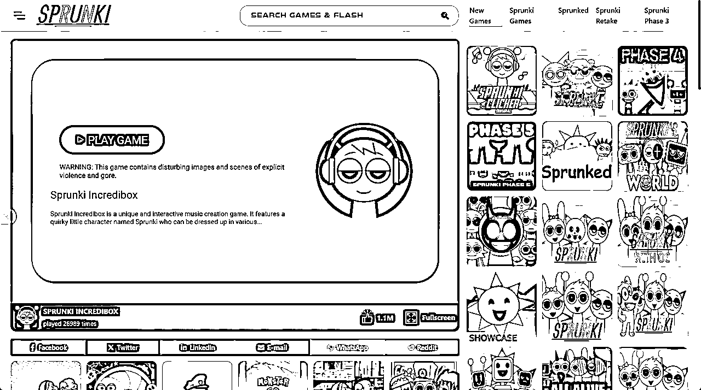

要素组合：

产品：第三方嵌入游戏（PE，如经典小游戏复刻）

平台：自建网站

流量：Google SEO自然流量

变现：Google AdSense广告

套利逻辑：

通过SEO优化获取长尾流量（如“免费玩XX游戏”）→广告收益无需分成。

数据验证：关键词排名Top 3 → 日均访问量>1万 → 月收益>$3000。

适用场景：

低成本长尾流量，目标关键词竞争度低。

风险：

SEO算法变动可能导致流量波动。

SEO流量获取时间周期长

对热门小游戏挖掘选词要求高

核心逻辑

通过低成本流量获取与高效益广告变现的差价套利，利用SEO技术精准捕获游戏搜索需求，将用户免费引流至自建网站，再通过Google AdSense广告实现收益。其本质是“内容+流量+变现”的三位一体策略，

具体拆解如下：

* * *

内容驱动：轻量化产品与长尾关键词锚定

产品选择：嵌入第三方小游戏（如经典复刻），无需开发成本，直接满足用户“免费玩XX游戏”的即时需求。

关键词布局：针对低竞争、高意图的长尾词（如“免费在线俄罗斯方块”），通过大量页面覆盖细分需求，形成流量池聚合效应。

流量获取：SEO爆款游戏红利的规模化收割

低成本入口：避开头部热门词竞争，专注新词和新游戏词、低竞争热词优化，降低SEO难度与时间成本。

规模效应：单一页面流量虽小，但海量页面叠加可达到日均过万的访问量，且流量稳定性较高。

变现闭环：广告收益的无缝转化

零分成模式：自建网站直接对接AdSense，无需与平台或开发者分润，最大化单位流量价值。

用户意图匹配：搜索长尾词的用户目的明确（“免费玩”），广告点击率（CTR）与转化率（RPM）较高。

* * *

核心能力：

数据化选词：挖掘低竞争、高搜索量的关键游戏词（工具如Ahrefs、SEMrush）。

SEO执行效率：快速批量生成页面，优化加载速度、移动适配等排名因素。

内容合规性：确保游戏版权合法（如开源复刻或授权嵌入），规避法律风险。

风险对冲：

流量分散化：覆盖多品类游戏，避免单一关键词依赖。

算法应对：持续监控排名波动，调整技术策略（如优化核心页面的E-A-T指标）。

* * *

模式本质

“低边际成本下的流量规模经济”：

成本端：通过标准化模板批量生成游戏页面，边际成本趋近于零。

收益端：长尾流量通过广告变现的规模效应，形成稳定现金流。

护城河：SEO技术壁垒（如站群架构、外链策略）与长尾词库的积累。

适用边界

短期：适合快速测试关键词并迭代优化的小团队（1-3人）。

长期：需转向品牌化（如垂直游戏门户）或多元化变现（联运、会员订阅），以降低SEO依赖。

* * *

该模式本质是技术驱动的流量套利，核心在于以极低的内容生产成本，规模化捕获细分搜索需求，并通过广告将流量高效变现。其成功依赖于精准的SEO执行能力与长尾市场的持续挖掘，但需警惕算法变化与竞争加剧带来的系统性风险。最终，从“套利”到“壁垒”的升级，需通过数据积累与生态扩展实现可持续增长。

* * *

### 模式七：移动游戏平台自运营

要素组合：

产品：自研精品小游戏

平台：上架到google play或App Store、steam

流量：移动平台付费流量或平台内自然流量

变现：游戏买断、内购、游戏内广告

套利逻辑：

通过平台内或跨平台付费投流，引导用户下载APP或客户端，投流费用低于内购和广告收入

数据验证：ROI持平，投流成本低于用户内购收入。

适用场景：

精品游戏，开发周期，有一定开发成本，竞争力强，预期收益高。

风险：

依赖平台内和跨平台广告投放的素材和资金实力。

* * *

产品驱动的精细化运营

*   核心逻辑：以精品小游戏为核心竞争力，通过高完成度的玩法、用户体验和轻度化设计，满足移动端用户碎片化娱乐需求。

*   关键支撑：研发团队需具备快速迭代能力和对市场趋势的敏感度，确保产品在玩法创新、美术表现或社交属性上形成差异化优势，从而在平台海量内容中脱颖而出。

* * *

数据导向的流量-变现闭环

*   核心逻辑：通过跨平台付费投流+自然流量组合，构建“低成本获客-高价值变现”的盈利模型。

*   流量端：利用Google Ads、Apple Search Ads等平台内投放工具，或跨平台（如社交媒体、视频平台）广告精准触达目标用户，结合平台算法推荐的自然流量，形成流量矩阵。

*   变现端：采用混合变现模式（买断制+内购+IAA），平衡用户付费意愿与广告干扰度，最大化用户生命周期价值（LTV）。

*   关键验证指标：ROI >1，即单用户获取成本（CAC）低于其贡献收入（LTV），需通过A/B测试持续优化广告素材、投放策略及游戏内付费设计。

* * *

平台依赖与风险对冲

*   核心逻辑：依附主流分发平台（如App Store、Steam）的流量红利，同时需应对平台规则变化和竞争加剧的风险。

*   机会：借助平台庞大的用户基数和成熟的支付体系，降低独立发行的技术门槛与渠道成本。

*   风险对冲：通过多平台分发（移动+PC）、自有社群运营（如Discord）和IP衍生内容，分散对单一平台的依赖，增强用户粘性与品牌抗风险能力。

该模式的本质是：以精品化游戏为杠杆，撬动平台流量与用户付费潜力，通过数据驱动的流量投放和混合变现设计，实现用户获取成本与收益的动态平衡。其成功依赖于产品创新力、投放效率与平台生态红利的深度结合，但对团队的资金储备、快速迭代能力和长线运营能力提出较高要求。

## 五、结论

#### 模式本质：流量价值的时空差博弈

海外小游戏套利的底层逻辑是“流量搬运工”的升级版——通过捕捉不同平台、用户群体、市场阶段的流量价值差，完成“低价采购-高效转化-高价售出”的闭环。

例如：

*   时间差套利：在TikTok热点爆发前通过SEO布局关键词（如《Stumble Guys》火爆前抢占"fall guys alternative"搜索流量）

*   空间差套利：将东南亚廉价流量通过广告设计转化为欧美高eCPM收益

*   认知差套利：利用信息不对称将国内成熟玩法（如合成大西瓜）本地化后投放新兴市场

#### 团队适配公式

选择模式需匹配团队基因，可用“资源-能力-风险”三角模型决策：

#### 最佳实践路径

*   新人首选：模式六（SEO）构建长期被动收入，入门门槛低，快速感受海外流量生态

*   进阶路线：模式三（TikTok+AdSense）快速验证现金流

*   避免“重产品轻流量”：先跑通流量-变现闭环再优化游戏品质

*   拒绝“多模式并行”：专注单点突破，ROI>1.5后再扩张

#### 冷启动三步走

STEP 1：定位测试

*   用Google Trends+Ahrefs验证目标游戏/市场的搜索热度与竞争度

*   制作MVP原型：1款游戏+5个SEO页面/1组TikTok素材，测试CTR>2%

STEP 2：模式跑通

*   选择单渠道单模式（如专注Poki平台自然流量）验证PMF

*   关键指标达标：用户停留时间>3分钟/广告展示率>60%

STEP 3：矩阵复制

*   横向拓展：同模式多游戏（如SEO站群）

*   纵向延伸：混合模式组合（如SEO+Discord裂变）

#### 风险

*   流量端：建立3:2:1流量结构（30%付费流量/20%社交流量/50%自然流量）

*   变现端：采用“基础广告收益+内购增量+分佣托底”的三层变现保障

*   合规端：定期检测内容版权，避免游戏素材侵权

#### 未来趋势预警

*   平台规则收紧：Google对低质SEO站的EEAT审查、SEO算法更新、移动游戏平台账号审查、TikTok外链跳转限制

*   技术变量：Web3.0小游戏（Token激励）、AIGC自动生成游戏代码

*   市场迁移：关注中东、非洲、拉美等新兴市场的流量洼地

写在最后：

* * *

出海小游戏的蓝海仍在，但窗口期稍纵即逝。

找准自己的最佳生态位，用最小MVP验证模式，感受海外开放生态下的流量套利威力。

在干中学，而不是学了再干，没有资金，没有团队那就从最简化的免费SEO和社媒模式开始，用时间换空间，在实践当中积累资本。

如上文所说，模式三：社交裂变免费流量套利和模式六：搜索引擎免费流量套利，这两个模式启动成本低，流量红利大，套利的收益空间也很大，如果有圈友也在尝试挖掘AI出海的方向，小游戏绝对是你值得尝试的一个赛道。

给大家看下小游戏网站案例（部分站点由小游戏AI建站工具fafafa.ai 搭建），感受下爆款小游戏词流量冲击：

https://jujutsuinfinite.com 去年11月上线的新站，12月访问量12万。

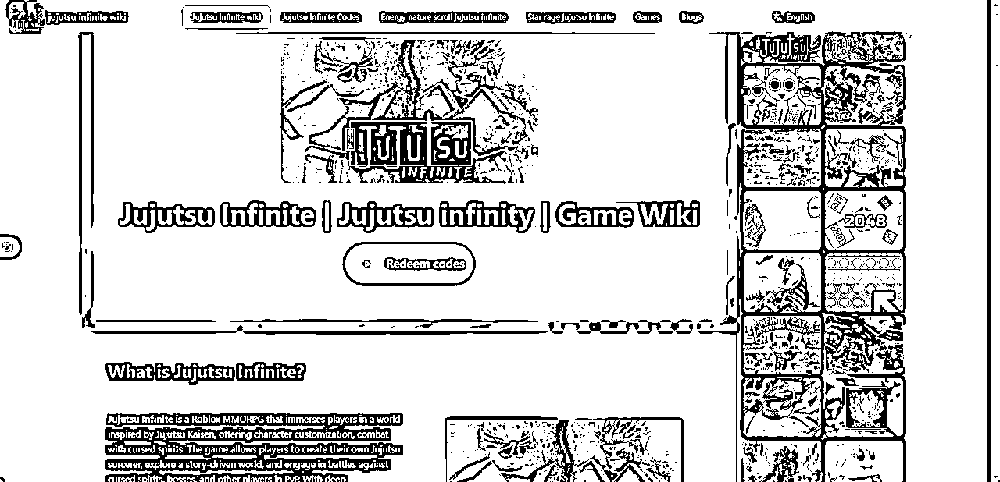

https://escaperoad2.io/ 去年10月上线，12月小游戏开始爆火，1个月访问量冲到接近6万。

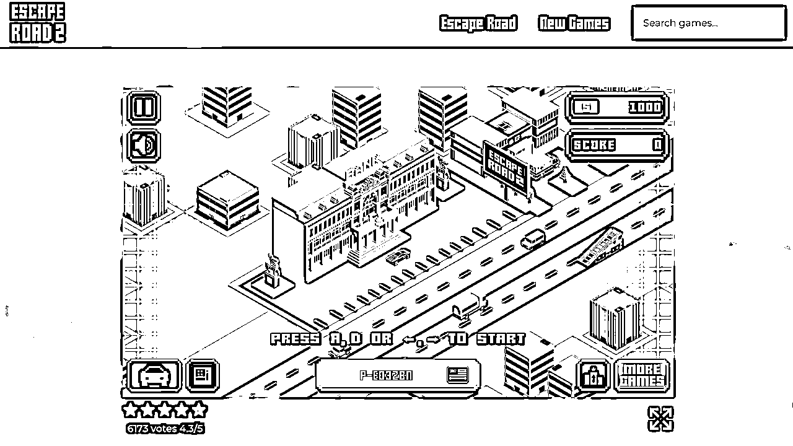

游戏盒子站：https://blockbreakergame.online 这也是新词热词游戏盒子站。

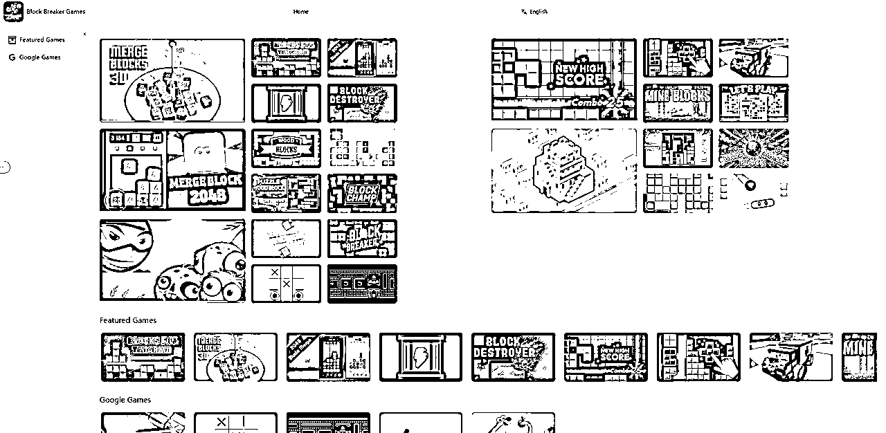

全文完。

欢迎留言交流！