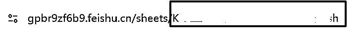
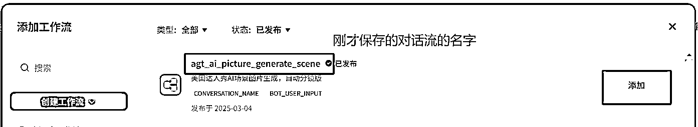

# 解放双手，任何人都可以复刻的高效AI视频制作工作流

> 来源：[https://gpbr9zf6b9.feishu.cn/docx/BVU0dMDPfoL3NkxPLYucg5LWnxf](https://gpbr9zf6b9.feishu.cn/docx/BVU0dMDPfoL3NkxPLYucg5LWnxf)

大家好，我是Jiahao，目前在Gary和方波妮教练的指导下，在努力成为一位优秀YouTuber的路上。经过一个多月的实战陪跑，已开通两个YPP，更多YPP正在路上。

之前看到优秀圈友香君高效制作优质视频的精华帖，深受启发，于是尝试在香君的思路基础上，实现制作AI视频的自动化工作流。值得高兴的是，由于站在巨人的肩膀上，我把它做出来了，因此斗胆在此向各位大神分享一下我的思路，还望大家不吝赐教。

在本文的末尾，我会分享自己开发的基于Runway的图生视频RPA工具，感兴趣的赶紧用起来，解放双手吧！

# 最终实现的效果

我目前在做AI达人秀赛道的Shorts，撇开复刻爆款，制作这类视频的流程是设计分镜 --> 分镜生成关键帧 --> 关键帧生成视频 --> 拼接视频。

这个流程里，其实有很多环节都可以上自动化，只是目前以我的能力未能全部串在一起。最终我能实现的效果是除了某些分镜图片PS，以及图生视频的审核需要人工介入，其他都实现了自动化处理。

其实不仅是AI达人秀，很多其他赛道，只要能基本实现标准化动作的，都可以考虑上自动化的方案，让自己的时间花在更重要的事情上。希望本文可以给大家一些启发。

# 方案概述

本方案主要使用coze（扣子）、影刀（RPA）、豆包、Monica、Runway、飞书。

*   coze：实现达人秀场景设计并自动生成多张备选分镜图片；

*   影刀：实现自动操作提供web界面客户端的工具，如Monica、Runway（不是不想用API，而是API太贵）；

*   豆包：与coze同为字节旗下产品，能与coze完美集成，偶尔生成的图片不满意可单独使用来补充一下（有人说豆包生图的质量不行，但亲测发现其实只要提示词写得好，豆包也很好用的）；

*   Monica：一个AI集成器，可以随意调用GPT、Claude、Gemini等大模型，我主要使用claude为我生成首尾帧图生视频的过渡关键词；

*   Runway：图生视频，主打一个便宜，除了动作幅度较大的场景，整体质量也还不错；

*   飞书：存储通过coze生成的场景和对应分镜图片，方便管理。

# 工作流实现过程

下面的过程有一些代码和提示词比较长，有不少圈友想要复制，请点击此链接，已全部整理出来：

不要一看觉得好像很复杂不想搞，想想你后续要花费的手动一段一段提示词去生图浪费的时间和那种心灰意冷，下决心一次性解决它！

因咨询量很大，精力上兼顾不到远程协助调试，请大家严格按照文档来操作，100%成功的，感谢理解。

下图是我整个工作流的目录架构：


001是存放达人秀场景设计+自动生成分镜图片的工程，这一步需要人工介入审核图片、必要的P图（一个最终视频为一个工程，也就是说，如果你现在要做一个视频，这个视频有4个分镜，那么你就在001目录下面，创建一个代表视频的目录，例如“视频1”，然后将这4个分镜的图片拖进去这个目录。下面002-005都是一样，举例如下图）；


002是已经确定了分镜图片，但是未生成首尾帧图生视频提示词的工程，这一步由影刀去处理；

003是已经生成了图生视频提示词，等待生成分镜视频的工程，这一步由影刀去处理；

004是已经生成了多个备选分镜视频的工程，这一步需要人工介入挑选视频；

005是已经确定了分镜视频的工程，这一步就是给剪映输出成品；

以上只要能自动化的，都会执行完成后，自动将对应的工程拷贝到下一个工作流节点的目录，因为我自己有购买华为云服务器（之前比较便宜一年才200多块钱），所以自动化部分我基本都是放到服务器上跑，通过百度网盘进行同步。如果有多一台笔记本，也可以用同样的思路去处理。

## 达人秀场景设计+自动生成分镜

这块实现起来最复杂，得稍微懂点技术，有过工作流搭建经验的也很容易学会。本来想做出来以后也直接分享给大家直接用，可是这玩意是谁开发用谁的额度，这就不现实了，所以教大家自己去尝试搭建。

整体的实现思路是我给定一种动物，由coze自动调用豆包生成几个分镜的文生图提示词，并且自动拆分分镜提示词，每个分镜生成4张备选图片，最后保存到飞书表格中。

飞书表格中的效果，这个环节执行完成后会自动生成一行记录，包括备选的标题、场景提示词、每个场景的备选图片链接：


没有使用过扣子的圈友，请按照下面的步骤一个一个来执行，是100%能通的。

### 创建图片生成工作流

在下图的入口创建一个工作流：


我的工作流节点如下，其实很简单。


如何增加节点呢？在界面的下方，有个添加节点按钮，按照所需点击对应的节点就会自动加入到当前的画布中。


#### 开始节点

开始节点，接受拆分场景后的提示词数组，并且对每个场景自动生成4张备选图片。配置如下（点击这个开始节点，右侧会自动出现配置窗体）：


BOT_USER_INPUT：默认有的，不用管，设置为非必填；

prompt_array：多个分镜的提示词数组，变量类型选择Array<string>，设置为必填，不需要默认值；</string>

concurrent_count：并发执行的线程数，变量类型选择Integer，设置为必填，默认值设置为4，这个效率已经可以了，设置太大了会报错；

batch_count：每个场景生成的图片数，变量类型选择Integer，设置为必填，默认值设置为4，我的经验是4张图片已经足够了，很偶尔才有不满足的；

*下面其他节点参数的设置都类似，为节省篇幅，参考我的截图配置即可，重点的我会单独拎出来讲。

#### 批处理节点

这个节点用于批量做任务，在此处就是批量生成图片，具体的逻辑是对于提示词数组里面的每一段提示词，各生成4张图片。批处理节点自带一个批处理体，生成图片的节点就在批处理体中。

点击批处理节点（不是批处理体节点），参数填写如下（注意，输出部分的参数，完成批处理体后才会出现）：


点击批处理体，让批处理体处于高亮状态，这时候再点击添加节点-->图像生成，效果就是这样：


点击图像生成节点，参数填写如下：


#### 结束节点

结束节点代表当前工作流的终结，并且会对外输出工作流处理的相关结果，在这里其实就是将所有批处理生成的图片输出，方便其他工作流调用。请注意，这里图片输出将会是url的形式，类似这样：https://s.coze.cn/t/HDV4yEYolZQ/。


#### 试运行并发布

配置完一个工作流后，需要测试一下运行是否正常，coze自带有强大的试运行功能，当场验证是否跑通。点击画布下方的试运行按钮，如果是想看每一个节点的输入和输出，还可以再点击试运行左边的那个扳手图标即可。


可以看到当前在执行的节点，会有动态的虚线标识：


运行完成后，点击结束节点的展开结果链接，就能看到图片生成的结果了。


试运行成功了，接下来就要点击右上角的发布按钮，只有发布后的工作流才能被其他如对话流等调用。


### 创建全流程对话流

这个对话流，就是智能体的核心，它将场景设计和自动生成分镜图片（刚才的图片生成工作流）串在一起，最后将结果输出到飞书表格中。

在下图的入口创建一个对话流：


下面是我们本次用到的对话流全貌，其实也就9个节点，不复杂的。

请注意，下面每一个节点在开始设置参数之前，先将上一个节点与其连接起来，方法是上一个节点右侧那个圆点，拖动到本节点的左侧圆点。

连接起来代表了这两个节点联动，上一个节点的输入、输出参数都可以再下一个节点里面找得到了，否则就可能出现想设置某个参数时没有可选项。


#### 开始节点

这个节点用于接受用户输入要求，比如要求场景中包含人和兔子，后续都可以直接在智能体中交互。


#### 变量设置节点

这个节点是代码类型的，用于设置一些固定参数，我主要用来设置飞书表格的token和sheet_id，意思就是写到哪个飞书表格，写到表格中的哪个表单。


上图中的代码，点击“在IDE中编辑”，设置语言为python，粘贴以下代码：

```
import json
async def main(args: Args) -> Output:
    ret: Output = {
        "spreadsheet_token": "你的飞书表格spreadsheet_token",
        "sheet_id": "你的飞书表格sheet_id"
    }
    return ret
```

那么上面代码的飞书表格spreadsheet_token和sheet_id如何获得呢？别急，照着下面做就解决了。

首先在自己的飞书文档创建一个表格：

切记不要到知识库里创建（知识库创建的电子表格，链接中会有/wiki/这样的文字，不过如果还是创建了也有解决方案，见下方描述），创建之后，不要在表单里面自己添加N行，顶多就是自己整一行标题，运行成功后飞书会自己添加新的行。


在表格视图，点击右上方的复制链接按钮：


将复制的链接粘贴到chrome地址栏打开该表格，地址中的最后一段便是spreadsheet_token，记录下来（下图这个就是正确的非知识库版本的电子表格，地址栏中有/sheets/字样）：



如果下图这种带有/wiki/字样的，就是知识库创建的电子表格，快速获取的方法为 曹教练发现，具体做法是先复制链接，chrome打开一个新标签页，按F12调出开发者工具（可能会在下方或右侧，不要紧），点击Network标签，再把链接复制到地址栏回车，在Network标签下面的筛选输入框输入"spreadsheet_token"，如下图复制对应的token值即可：


接下来要获取sheet_id，这个可以在画布中临时添加飞书电子表格插件来实现（获取完删掉该插件节点即可）：


点击上图的添加后，画布中就会出现下面这个节点（不需要跟任何其他节点连接，运行完拿到数据就删掉），点击它，在右侧填入刚才的spreadsheet_token：


等待一两秒钟，在下方就会出现试运行结果，从结果中提取对应的sheet_id即可。

这里请注意，第一次调用可能会出现未授权的错误，按照执行结果去飞书做一下授权，重新运行一下就可以了。

另外，这个飞书表格，记得将除了第一行以外的空行全部删除，并且保证表格有足够的列（场景数*每场景图片数+2，比如4个场景，每个场景4张图，那么要保证有4*4+2=18列），否则后面一定会出错。


#### 大模型节点

大模型节点是用来生成达人秀的分镜提示词的，这些提示词后续将会用来批量生成图片。不过，我们要提示大模型如何生成提示词，所以在用户提示词处请给出要求，大家可以参考香君的提示词自己进行改动，我这里的提示词模板也给大家分享部分（为免生成太相似的图片，需要各位自行对提示词优化调试）。

提示词写在图中的“系统提示词”或“用户提示词”都可以，但我实测是放到“用户提示词”比较好，仅供参考。


参考提示词模板：

```
你是一位专为AGT（美国达人秀）舞台创作变装表演提示词的AI助手。您的任务是生成多个连续的、相互关联的场景提示词，每组包含三个提示词。请严格遵循以下规则：

## 构图技术规格要求：

### 相机参数：

每个场景的提示词开头需自然融入以下参数：

Shot on canon a7c2, 专业摄影，4K画质，高清细节

### 画面构图：

始终保持竖屏构图，针对手机屏幕优化。

表演者占据画面高度的4/5。

所有场景均在舞台上发生。

舞台背景要求必须是明亮的蓝色系舞台灯光的相关元素、色调等，而且每个场景的舞台背景提示词必须一致。

出场人物为两位年轻女性，要求提示词必须写明“XX美女”，但只是要求脸为XX美女，其他如服饰、发型、装扮则是全球的风格都可以。

## 其他要求：

### 场景必备元素：

#### 表演者位置：

明确描述位置（左、右）。

#### 服装细节：

详细描述服装设计。

#### 灯光与特效：

包含AGT特有的舞台元素（蓝色灯光、射灯等效果）。

#### 舞台氛围：

描述背景和空间关系。

### 写作规范：

使用描述性的现在时语言。
禁止使用变化过程词汇，仅描述可见内容。
保持与原始服装的种类和颜色一致性。
包含专业摄影术语，确保单句流畅性。
在输出场景提示词之前，请为本次创意输出5个备选的吸睛的youtube爆款视频标题，包括中文版本和英文版本。
提示词部分只需要输出中文版本，即每一个场景，输出一套中文提示词，必须完整。
以markdown格式输出，直接出结果，不需要做任何解释。

## 提示词编写要求：

只能根据下方的每个场景的提示词模板，修改{}里面的内容，其他必须原封不动。

### 场景1：初始登场

#### 模板：

全身正面照，两位年轻XX美女站在闪亮的舞台中央，背景是{舞台背景说明}，左侧女性{衣着描述} {鞋子描述}{发型描述}；右侧女性{衣着描述}{鞋子描述}{发型描述}

#### 要求：

【这里请填写你对上面模板的要求，例如舞台背景可以怎么样，衣着描述可以怎么样等等，用鞋子描述的原因是为了不要生成那种半身的图】，每个角色的描述控制在130字以内。舞台背景说明跟随画面构图的要求。

### 场景2：人物转换

#### 模板：

全身正面照，{物种}{物种特征}在闪亮的舞台中央，背景是{舞台背景说明}

#### 要求：

物种可以是由使用者指定，或是自行天马行空想象，可以是【这里请填写对物种、物种特征的相关要求】等等；舞台背景说明跟随画面构图的要求。

### 场景3：视觉转换

#### 模板：

背景是{舞台背景说明}，XX美女{衣着描述}{鞋子描述}{发型描述}，{物种}{物种特征}{动作描述}，{动作关联}

#### 要求：

场景3的XX美女，在场景1中的两位美女任选一个，衣着描述、鞋子描述、发型描述必须和场景1对应选定的角色一模一样；物种及其特征必须跟场景2一模一样；动作描述是指物种所做的动作，可以任意想象；动作关联是美女和物种之间的动作上的关联，这个动作不一定是常规的，天马行空都没有问题（常规的例子：鹦鹉站在人的手上，天马行空的例子：人坐在鹦鹉身上）。允许人和动物位置对调，但如果是对调，相对于场景2的动作幅度不要太大。也允许人和动物位置不对调，但人和动物的姿势可以变动，比如人可以从站立变成下蹲，比如动物可以由站立变成咆哮等，但依然要保证动作幅度不能相对场景2变动太大。

### 场景4：人和物融合

#### 模板：

全身正面照，背景是{舞台背景说明}，XX美女站在闪亮的舞台中央{衣着描述}{鞋子描述}{发型描述}

#### 要求：

XX美女是指场景3中的美女，她的衣着描述和发型描述，要和场景3中的物种的一些特征进行融合，可以天马行空的想象，与场景3美女的衣着能形成巨大差别最佳，不允许出现将物种图案直接打印在美女的着装上。

## 输出样例：

备选标题
......

### 场景1

......

### 场景2

......

### 场景3

......

### 场景4

......

{{order_str}}
```

上面的提示词，黄底部分请自行替换一下，其他原封不动应该都能生成质量非常不错的图片，比如这样的，我个人觉得挺OK的：


#### 场景分割成字符串数组节点

这个节点是文本处理类型的，目的就是刚才让大模型生成的场景提示词，按照要求进行拆分，用于后续批量生图。


#### 去除标题部分并复制节点

这个节点是代码类型的，用于分离刚才分割的数组，标题归标题，场景归场景。


上图中的代码部分，依然是点击在IDE中编辑，选择语言python，将下面的代码粘贴进去：

```
import json
async def main(args: Args) -> Output:
    scene_array = args.params['scene_array']
    titles = scene_array[0]
    scene_array.pop(0)
    final_array = []
    for scene in scene_array:
        for i in range(4):
            final_array.append(scene)
    ret: Output = {
        "sub_array": final_array,
         "titles": titles
    }
    return ret
```

#### 图像流节点(agt_scene_picture_stream)

这个节点其实就是调用3.1.1的图片工作流，节点的类型为工作流。


#### 标题和全部图片输出为一行节点

这个节点，是将输出的标题、提示词、场景的图片输出为一个数组，便于写入到飞书电子表格，节点为代码类型。


上图中的代码部分，点击在IDE中编辑，语言选择python，粘贴以下代码：

```
import json
async def main(args: Args) -> Output:
    params = args.params
    scene_prompt = params["scene_prompt"]
    pic_array = params["pictures"]
    titles = params["titles"]
    row_array = []
    row_array.append(titles)
    row_array.append(scene_prompt)
    for i in range(len(pic_array)):
        row_array.append(pic_array[i])
    # 构建输出对象
    new_array = []
    new_array.append(row_array)
    ret: Output = {
        "sheet_rows": json.dumps(new_array)
    }
    return ret
```

#### 插入到飞书表格节点

这个节点用于将刚才的数据写入飞书电子表格，节点为插件类型。


#### 结束节点

这个节点代表对话流的终结，返回生成的场景提示词。


最后试运行并发布，就可以供智能体调用了。需要注意的是，试运行的时候需要选择一个智能体，那么可以先在浏览器保持本界面，打开一个新窗口，参照3.1.3 创建一个空白智能体。

### 创建和调用智能体

接下来我们需要创建智能体，以调用刚才设计的对话流。





系统会自动保存配置，不需要点击右上角的“发布”，因为被别人调用会消耗你自己的额度。直接在这个界面的右下角输入框进行交互即可，每次生成大概是60-70s左右。

请注意，在跟bot交互时，一定要带上“请调用工作流生成”，以防有时候它不调用工作流，就达不到想要的效果了。


遇到下图这种，点击“这里”，按提示来一次性操作即可。


因为coze本身在批处理方面有做限制，本来想做到一次性自动生成一百几十条，可惜暂时实现不了，需要手动触发。建议有条件的，用影刀结合excel表，自动去批量调用生成。

有很多圈友反馈，明明运行成功了却没能在飞书表格中查看到数据？看FAQ 4.1.3，基本就是这个问题！

回到下图这个最终生成的效果，这样的url格式，没道理一个一个去点击看图吧，太浪费时间。可是我暂时没找到更好的将图片插入飞书的方法。但是，我已经用cursor做了一个小工具，支持一键复制一行的全部url并粘贴，自动格式化和批量读图，非常直观。支持双击看大图，支持批量下载原图。这个工具在文末也会分享，有需要的自取即可。


## 生成首尾帧图生视频提示词

对于每一套创意，按照上面的方案生成后，都应该每个分镜保留一张图片，正常只需要对分镜2进行PS（推荐即梦智能画布的抠图和消除笔，具体可参考航海手册）即可（目前的提示词，分镜2是一只动物，没有其他角色，方便抠图替换掉分镜1的一个美女）。


那接下来如何生成Runway的首尾帧提示词呢？我是通过RPA + claude来生成的，其中claude是通过monica来调用。因为不是所有人都买了monica会员，这方面就各显神通了，我分享下自己的思路，另外有monica会员的圈友也可以直接用我的这个RPA程序。

本来我是打算两张两张放上去的，但一是想测试下claude能不能几张图一起来，二是想省点调用额度，于是直接扔四张图上去，让它给我生成每个分镜之间过渡的提示词。

我在monica中创建了一个智能体（这个平台智能体的能力比起coze来说只能算是个小学生作业，但也够用），给如下提示词它，后续只要上传4张图上去，智能体就会自动给生成Runway提示词了。

结合影刀，批量自动读取“002-待生成视频提示词”目录下的创意，上传图片并获取结果，保存到excel文件中。

```
你是一位精通Runway视频生成模型的专家，能够通过提问的方式帮助设计适合Runway生成的AI视频动作。请基于Runway的模型能力，仔细思考并输出中文的提示词。具体要求如下：

# 动作设计：

图片已生成，仅需设计动作，无需涉及场景、人物或服装描述。

# 简洁描述：

提示词中避免使用形容词或比喻，动作描述应简练且易于Runway模型理解。

# 默认设定：

若无额外信息，默认主体为单人。

# 动作丰富性：

设计动作应炫酷且多样化，可以适当添加一些吸引眼球的特效，避免观众审美疲劳。

# 图片数量说明：

如果我提供了1张图片，根据图片中的主体特点，设计一个表演，需要动感十足的效果，并给出提示词即可。

如果我提供了2张图片，则遵照提示词设计规范来生成提示词即可。

如果我提供了超过2张图片，则需要根据我提供的图片数量，相邻的两张之间都要按照提供2张图片的要求来输出。例如当我上传了4张图片，那么1-2、 2-3、 3-4分别按照上面的要求生成提示词，并且对于最后一张图片，根据图片中的主体特点，设计一个表演，需要动感十足的效果，并给出提示词。

# 提示词设计规范：

图1为首帧，图2为尾帧，动作设计需尽可能避免转圈。

如果是两张图的主体数量相同，其中一个主体变换（一般是人变成其他东西），我希望一定是生成超强变身+特效这样的提示词，例如图一是两个美女，图二是一个美女和一只老虎，这代表图一的其中一个美女变成了老虎，提示词可参考“美女变成一只老虎，超强变身，星光闪闪特效”这类，因为这样给观众更震撼的视觉感受，更容易让观众停留。

如果是第一张图是两个主体，第二张图是一个主体，这种情况下，我希望一定是类似合体+特效、融合+特效这样的提示词，比如第一张图是一个美女和一只老虎，第二张图是一个美女，那么说明图一的美女和老虎进行了融合，提示词可参考“美女和老虎合体，超强变身，金光闪闪特效”这类，因为这样给观众更震撼的视觉感受，更容易让观众停留。

其他情况下，请认真分析图片，结合人物、动物或其他主体在两张图的方位变化、姿势变化，设计更丝滑的过渡效果。例如图1美女在左侧、马在右侧，图2美女在右侧、马在左侧，应该生成包含“美女向右走，马向左走”之类的动作提示词，否则Runway可能生成很差的效果。

# 完整句子：

提示词需以完整句子形式呈现，避免单词+箭头的组合。

# 简洁关键：

Runway识别能力有限，提示词应简洁，仅描绘关键动作。

# 特别提醒：

不需要任何解释和分析，直接按下方输出格式输出即可，切记两张图片之间只需要一段提示词，不要分开来输出。

例如我一共提供4张图片，输出提示词的格式如下：

"## 01
提示词1，适用于图片1-2过渡

## 02
提示词2，适用于图片2-3过渡

## 03
提示词3，适用于图片3-4过渡

## 04
提示词4，适用于图片4的表演
......"
```


目前monica新用户貌似优惠力度很大，通过这个链接进去的一年才800多，如有需求的圈友可点击去注册新号试用，如要购买需12小时内完成：https://fas.st/t/3HPL5HzW


### monica创建智能体

进入monica首页，左边第二栏往下滚动到看到“探索智能体”，点进去：


记住上面自己定的智能体名字，下面影刀程序要用到。

### 影刀自动生成过渡提示词

影刀安装完成后，请记得安装chrome的影刀插件，否则程序运行不了。


影刀的运行参数如下：


#### 待生成提示词目录

这个是第3点提到的002目录，目录下方是要生成首尾帧提示词的创意，每个创意一个目录，其实就是001目录下的创意，对图片做了PS后，将该创意放到这个目录下即可。

#### 待生成视频目录

这个是第3点提到的003目录，也就是002目录的所有创意生成了首尾帧提示词后，自动迁移到的目录，跟下方生成分镜视频动作联动。

#### Monica智能体名称

这是3.2.1点创建的智能体的名称。

#### 微信路径

选择微信安装目录下的wechat.exe，这是用来在任务完成后，主动微信通知用的，像我用云服务器的，基本不关注它执行多久，执行完它就告诉我了。如果本机运行不需要通知，可以留空。

#### 微信通知人

这是指给哪个微信联系人发送执行完成的信息，请用完整的微信昵称，以防有类似名字的联系人导致尴尬。如果本机运行不需要通知，可以留空。

## 生成分镜视频

买过Runway共享账号的圈友都知道，高峰期抢资源是很痛苦的事，等待时间也不确定，就得盯着那生成按钮干着急。那怎么办呢？

我的答案是通过影刀批量处理（有钞能力的可以采用API方式），解放双手。这个工具是通用的，一会我也分享给大家。

实现思路是通过上一点生成的提示词excel文件，结合整套创意的首尾帧图片，一个一个去执行，每个分镜生成N个备选的视频并自动下载。

影刀安装完成后，请记得安装chrome的影刀插件，否则程序运行不了。


影刀的运行参数如下：


### 待生视频目录

这个就是第3点开头提到的003目录，其实也就是待处理创意的目录，这个目录下，每一套创意为一个独立文件夹，该文件夹下有4张分镜图片，并且有一个视频子目录，子目录里面有一个提示词.xlsx。


### 待审核视频目录

这是指定生成完分镜视频的创意，移动到哪个目录去。

### 每分镜生成次数

这是指每个分镜生成多少个备选视频，一般4个，能用的概率能有90%，实在不行的自己后续手动生成一下就行。

### 移动目录前等待秒数

这是为了防止视频文件未下载完成，或者是通过百度同步盘多机同步会锁定文件的情况，设置10-30s都可以。

### Runway首页等待时间

因各人用的梯子质量不一，有些比较慢的，可以设置首页等待时间长一些，以便影刀找得到创建session的入口，默认是60秒。

### 微信路径

选择微信安装目录下的wechat.exe，这是用来在任务完成后，主动微信通知用的，像我用云服务器的，基本不关注它执行多久，执行完它就告诉我了。如果本机运行不需要通知，可以留空。

### 微信通知人昵称

这是指给哪个微信联系人发送执行完成的信息，请用完整的微信昵称，以防有类似名字的联系人导致尴尬。如果本机运行不需要通知，可以留空。

## 审核视频并剪辑成品

这里就是对Runway自动生成的视频片段进行筛选，最后放到剪映里出成品，基本可以用Gary教练的模板式操作方法，此处不再赘述。

## 相关软件下载

非常感谢你阅读到这里，希望上面的工作流能为你提供到有用的信息，如果对你有帮助，请帮我点个赞投个锚点，你的支持是我持续分享的动力。下面是分享给大家的软件，请按需自取。

### 批量生成首尾帧图生视频提示词RPA工具

#### 影刀账号注册

因我的影刀是创业版账号，只要我一直是创业版，大家就可以一直使用本工具，因此请先通过以下链接注册影刀，每注册一个账号我的创业版可自动续期3-5天（https://www.winrobot360.com/share/activity?inviteUserUuid=700552019417403394）。

新注册的账号会赠送30天的创业版权限，只有创业版以上的账号才可以使用本工具，如果没有手机号可注册或实在不想注册，可以到闲鱼两块钱买一个现成的30天号。

#### 应用获取

点击下方链接，加入市场：

https://www.winrobot360.com/share/accede?inviteKey=097fee56-c747-40bf-9e3e-5f776ccae964


本机打开影刀，按照下方路径输入密码ytb2025168002获取应用：


### 批量图生视频RPA工具

#### 应用获取

点击下方链接，加入市场：

https://www.winrobot360.com/share/accede?inviteKey=097fee56-c747-40bf-9e3e-5f776ccae964


本机打开影刀，按照下方路径输入密码ytb2025168获取应用：


### 批量图片查看器

支持从飞书表格批量复制图片地址粘贴，自动格式化，自动读取图片，双击显示大图（直接如下图这样一次性选中整行的图片地址，按ctrl+c，再到图片查看器的输入框里ctrl+v）；


点选要下载的图片（每个场景找一张最满意的即可，被选上了的图片会有很粗的蓝框），点击批量下载，程序会自动根据图片的展示顺序，从001 - N 自动命名图片。


因飞书限制文件下载，请通过百度网盘下载：

链接: https://pan.baidu.com/s/107h2gSinzHQxtFf0LBN7dg?pwd=gdft 提取码: gdft

--来自百度网盘超级会员v3的分享

# FAQ（不断补充）

## coze（扣子）问题

### 插入记录到飞书电子表格出现NOTEXIST错误 @酷拉皮卡

数据格式检查过都没错，但却出现如下图的错误：


通过官方文档得知是“未找到指定的云文档”，请按照下图的方法来排查，意思就是创建在知识库里面的电子表格会有更多麻烦事，建议直接在知识库外面创建电子表格，重新获取spreadsheet_token和sheet_id即可。附官方错误码说明文档链接：https://open.feishu.cn/document/server-docs/api-call-guide/generic-error-code


### 插入记录到飞书电子表格出现（range in request is wrong, columns of value:22>range）@酷拉皮卡

出现如下图错误，检查自己创建的飞书表格的列数是不是太少，比如这个案例就是22，也就是说你想写入22列数据，但飞书表格只有不到22列，就会报错，在表格往右添加一些列即可解决。


### 插入到飞书表格节点明明运行成功，电子表格里却没有数据 @花生

问题如下图，显示是已经成功插入：


这种情况，检查电子表格，是不是自己创建了很多空行，再滚动到最下方，就能找到你插入的数据了，解决方案是除了第一行标题外，其他行全部删掉即可。

### 调用智能体出现莫名的输出、或调试对话流时，生图对话流报一串数字错误 @沈瑾瑜

问题如下图：


像上面这两张图的问题，请记住当时创建智能体的几步：创建图片工作流-->创建对话流-->创建智能体。调用智能体的时候出错，那就往上一层去打开对话流试运行，又发现是图片工作流报错了再往上一层打开工作流试运行，这样一步一步排查就能找到问题点。最终发现是免费版原因，买个专业版充10块钱就能用一阵子了。

## 影刀问题

### 影刀批量图生视频工具运行没有去Runway官网而直接往微信发消息结束 @啵啵鱼华华

这种情况应该是因为影刀的chrome插件没有安装，请参考3.3的说明，安装chrome的插件即可。如果确认安装了，也可以看看影刀运行结束的窗口的日志按钮，看看有没有错误日志再排查。

