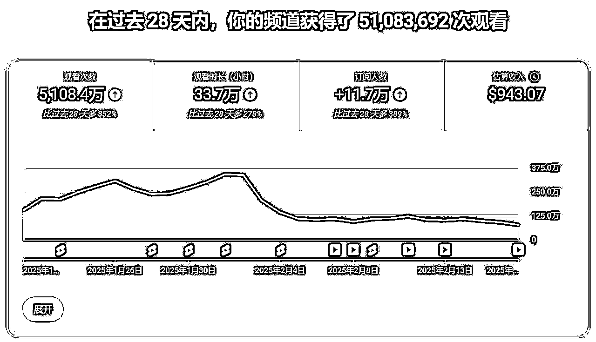
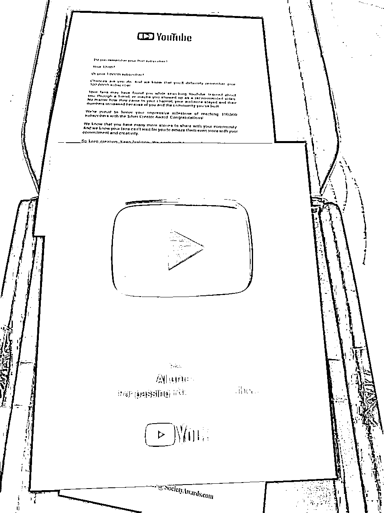
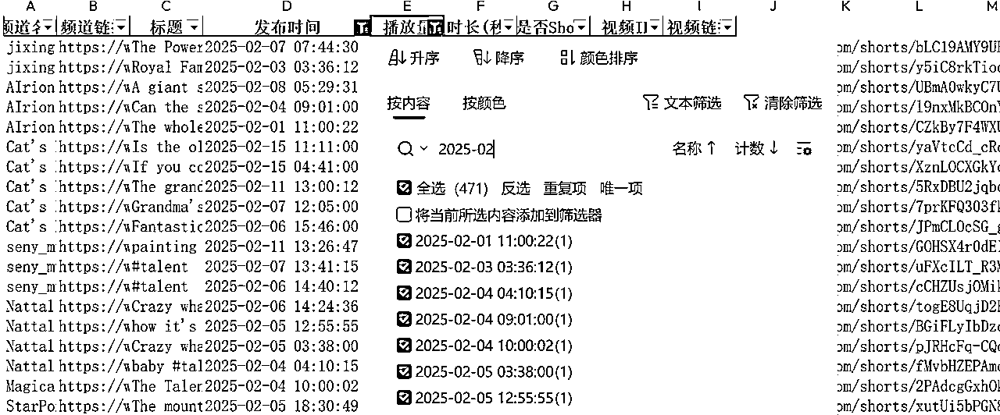
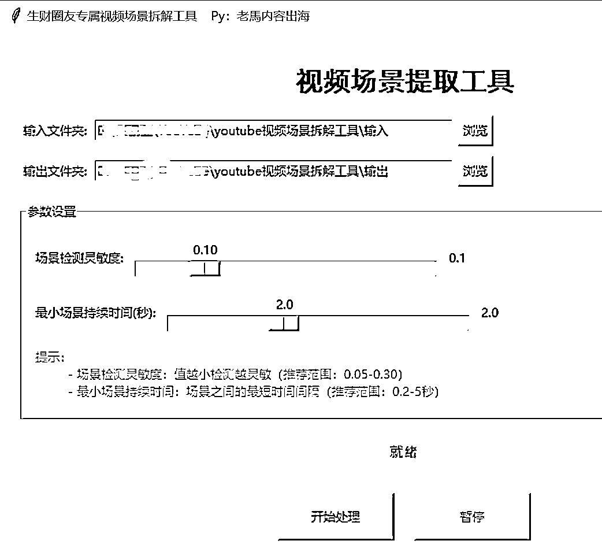
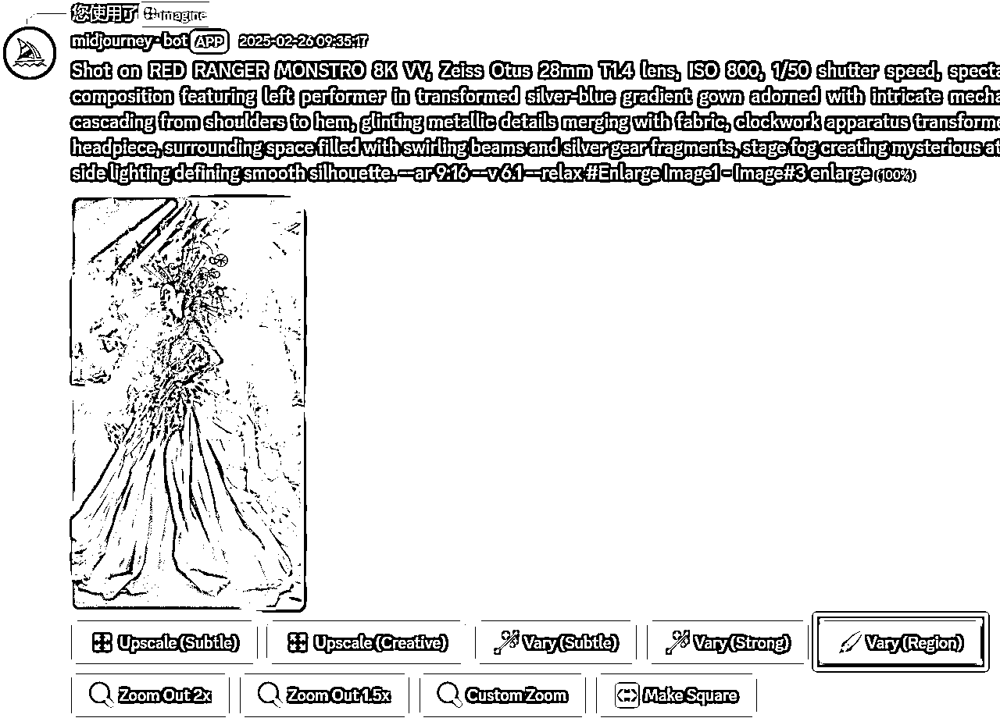
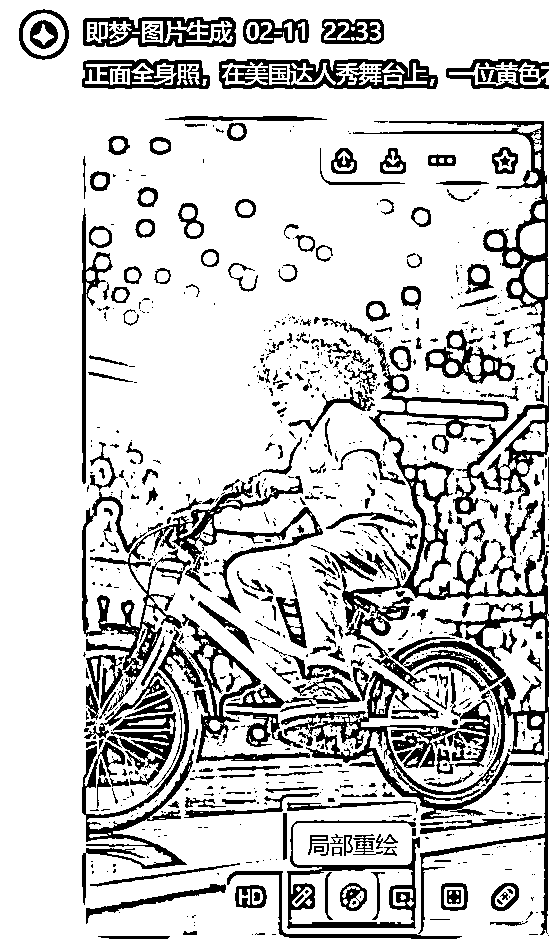
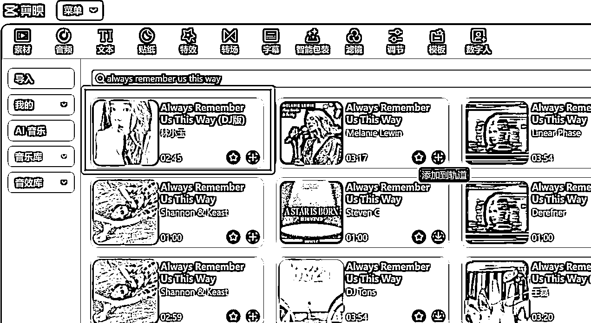
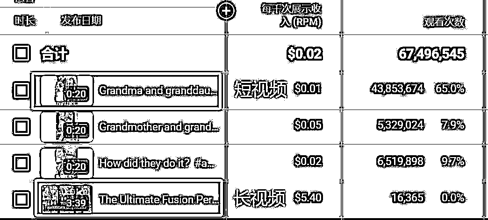
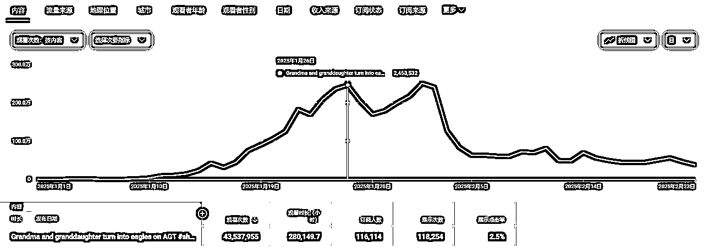
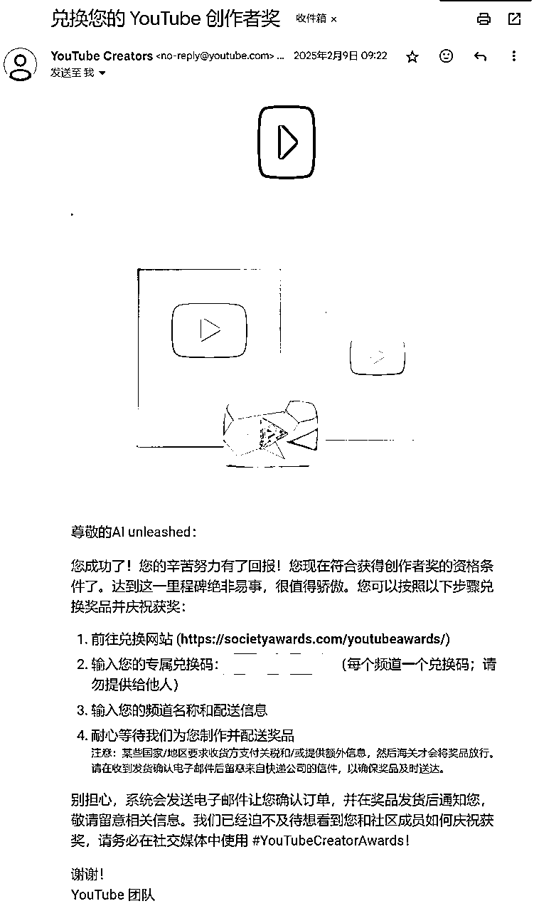

# 2个月拿到YouTube的YPP和银奖牌

> 来源：[https://p7pqvd4m3c.feishu.cn/docx/NsdjdAagDo9x9sxhrv3crml6nUc](https://p7pqvd4m3c.feishu.cn/docx/NsdjdAagDo9x9sxhrv3crml6nUc)

# 一、引言

大家好，我是花生，来生财2年多，一直想在生财找个副业，缓解一下生活压力，因为时间精力有限，尝试了好多次航海都没做起来。

直到去年亦仁老大开始写超级标，说到"宝宝巴士靠把自己的视频上传到YouTube，一年获得的广告分成是多少你知道吗？ 5000 万美金"（传送门），瞬间产生了极大的兴趣。去年12月的时候看到生财有航海，果断加入航海。

说下目前的成绩，一个半月开通ypp，开通后20多天，900刀，意外收获了YouTube的10万订阅银奖牌。

# 二、小白入门

超级标出来的时候我也是一脸懵，不知道要从哪里入手，自己也没有太多的时间去探索。后来看到@老马的帖子，还有@方波妮的实操贴，才慢慢对YouTube short项目有点了解，后面刚好有一期YouTube的航海，果断上船。再后来看到了@Gray的分享，才慢慢学会了如何去制作达人秀视频。

# 三、寻找爆款

## 1、找对标

航海手册推荐使用tag和音乐找对标，这里分享两个我找对标的方法：

1.  在YouTube的搜索栏通过tag去搜索，比如搜索"AI"，通过播放量进行筛选，找一个月和一周内数据好，一个月内播放量有百万的，一周内播放量有10万的，对这些账号进行关注。

1.  每天拿着手机在YouTube上刷刷刷，YouTube会推荐一些爆款短视频，看到浏览量高的视频就点赞关注。

## 2、采集对标视频信息和下载对标视频

推荐使用@龙教练的采集和下载工具，做成了图形化，新手操作方便，我是想自己定制一些内容，就使用cursor开发的两个python脚本，一个采集，一个下载，采集到视频信息后，会生成excel，再通过发布时间和播放量筛选自己需要的视频进行批量下载。

两个脚本放百度网盘，建议会使用python的小伙伴使用：百度网盘

# 四、复刻爆款

复刻这一块我都是手搓，实在比不上其他上了sd和自动化的圈友，视频制作这块可以去看@Gray的达人秀制作（传送门），用爆款元素组合，提高播放量。我前期很多视频也是参考@Gray的达人秀制作。

左边为对标视频（190w播放），右边为我复刻的视频（4400w播放）

## 1、场景拆解

使用老马分享的youtube视频场景拆解工具，把视频的关键帧都拆解下来。

## 2、生成图片

把关键帧拿到midjourney中，进行关键词提取，生成新的图片，自己根据感觉选择合适的图片

图片中的动作要精准，这样图片做好了，视频的动作也比较流畅。

有些场景可以用mj或者即梦的局部修改，达到只修改局部的效果

## 3、生成视频

再拿图片放到runway中进行首尾帧生成视频。效果不理想的，微调下提示词。航海手册很详细，可以去翻看一下，这里就不细讲了。

这里需要注意的是：动作变动的幅度比较大，才能更能吸引人的眼球，所以前期生成图片的视频，才会有左右交换位置的视频。

## 4、剪辑

使用剪映剪辑，变身的视频分4段视频，中间插播评委的视频，直接在剪映音乐里搜索对标账号的音乐，我使用的是剪映里的音乐，没有版权提示，没有版权提示就直接用了

# 五、实战陪跑感受：坚持与挫折

复刻爆款的过程中，有时候抽卡抽不到自己满意的图片或者视频，上百次的抽卡我也试过，会觉得特别烦，这时候保持平常心就好了，想着一个90分的视频做好了，可是顶得上10个60分视频，一个爆款视频相当于一个ypp。YouTube的推流是比较慢的，只要视频好，后面都会有推流，1月份的时候整个频道只有100多万的播放，等到快过年的时候才给我大量推流，其中一个视频推了4000多万的流量，一举开通ypp。

所以大家要对自己有信心，把视频的质量做好，剩下的就交给YouTube推流。

在这里要感谢一下@鱼丸，1月份的时候告诉我有一个YouTube的实战陪跑，才有了后面的成绩。

实战陪跑的氛围很好，感受到群策群力，群里的讨论大家都很积极，都一起朝着同一个目标迈进，方波妮教练和Gray教练一直冲在最前面，探索出很多新的玩法，教练每周都会直播分享和分析，群友们都很给力，每天都有新的分享，交流的氛围很好，每个人都有新的方法解决问题。

如果我没有参加这次实战陪跑，大概率是没有那么快开通ypp，有了Gray教练的一对一咨询，才知道自己有哪些不足，有了视频优化的方向。

开通ypp的过程，一路按照实战陪跑手册的步骤，顺利开通ypp，接收pin码也是，说实话，@方波妮和@Gray教练的实战陪跑手册真的特别详细，简直就是YouTube的百科全书。

按照@方波妮教练的方法，使用发布过的短视频拼接长视频，让有流量的短视频带长视频，千播收益居然是短视频的10倍以上。

# 六、开通 YPP 与收获银奖牌

1月份年前的时候刚好有两个视频小爆了一下，一下把频道的总播放量冲到了千万，达到了开通ypp的条件，当时真开心，想着终于可以收美金了。过年期间没空剪视频，就没怎么管youtube，突然发现YouTube有个视频播放量涨得很快，整个过年期间从几百万播放到三千多万，这长尾流量真爽，虽然没有发新视频，但每天都有40~50刀的收入。

过年后有一天，手机打开YouTube，突然有个弹窗，说频道订阅数超过了10万，可以获得个银奖牌，当时还有点懵，还不知道这个是什么东西，后面跟Gray教练交流才知道这个是YouTube官方给10万用户订阅的频道发的银奖牌，后面奖牌拿到手，真的特别漂亮，心情那个激动呀。

其实，如果频道达到了10万订阅，YouTube官方都会给google邮箱发一封邮件，根据提示填写频道名和地址就可以寄过来，地址要求写英文，寄过来是通过UPS寄的，到当地后会放入仓库里，打电话去问，就会转顺丰寄过来了。

# 七、总结

我是来给你们一点信心的，我真的是运气好，还有项目也好，像我这种每天只有1～2个小时，做1～2个视频的人，都能成功开通ypp，普通人多投入点时间更不用说。

现在AI越来越强，，可以AI生成文字，AI生成图片、AI生成视频、AI生成语音和音乐，用来做自媒体真是的如虎添翼，要跟上时代的潮流，想着AI如何融入到生活中，融入到商业中。

感谢生财提供YouTube航海，让我有出海赚美金的机会，感谢YouTube航海的@老马和@龙教练，提供了YouTube的方法论和各种工具。感谢这次youtube私教陪跑的@方波妮教练和@Gray教练，他们提供了很多变现方式的探索和指导，让我学到了很多，也让我在变现这块收入增加不少，感谢陪跑群里的各位小伙伴，提供了陪跑期间的加餐分享，好用的工具和方法。