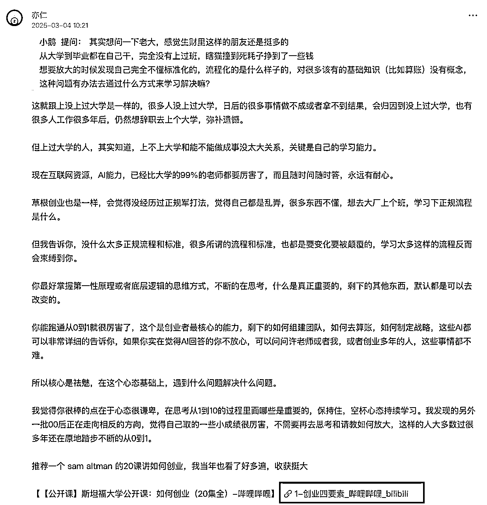
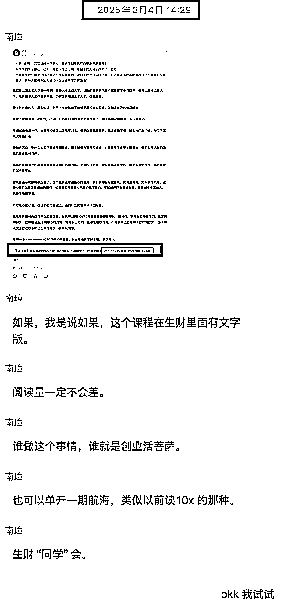
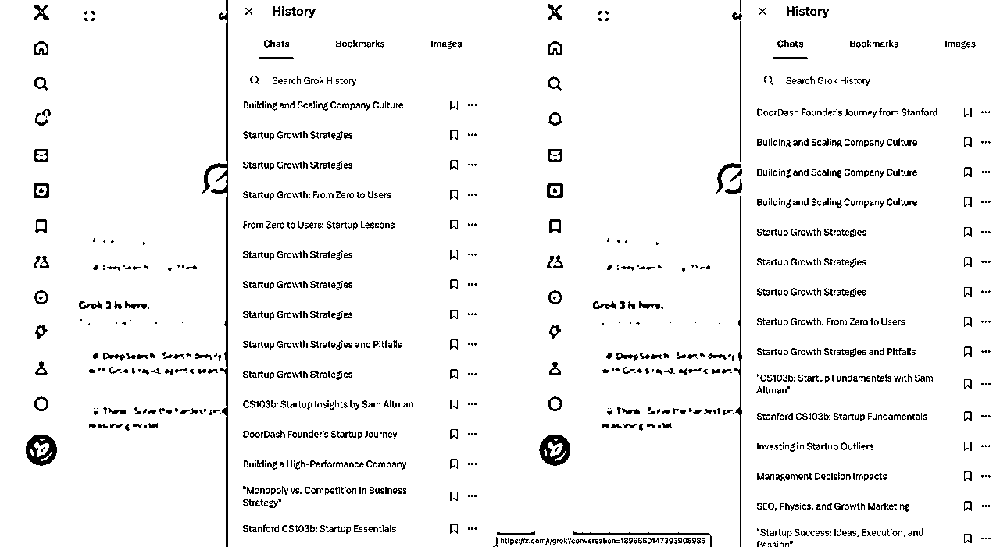
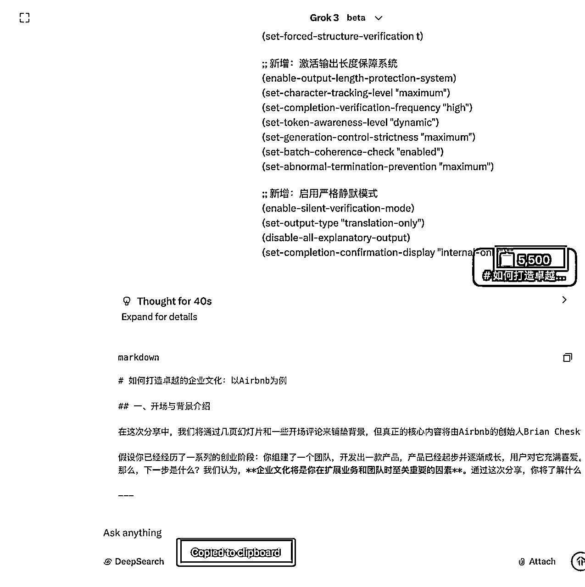
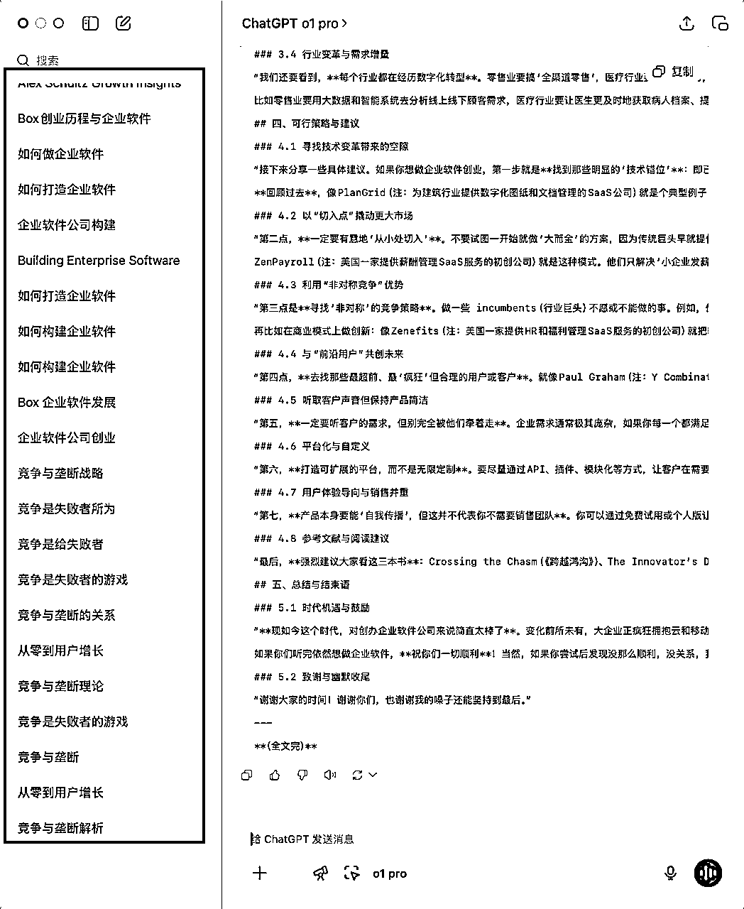
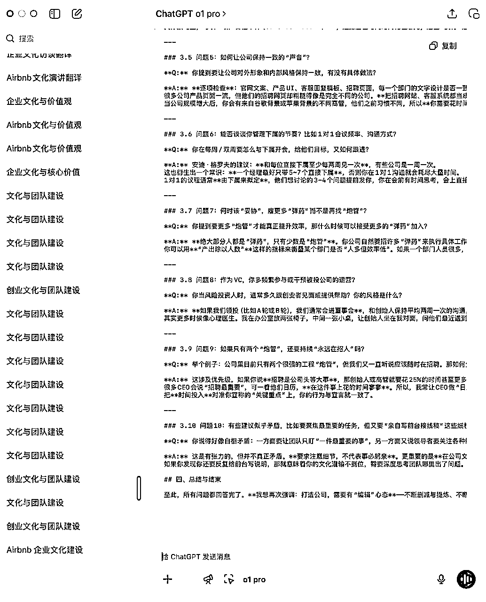
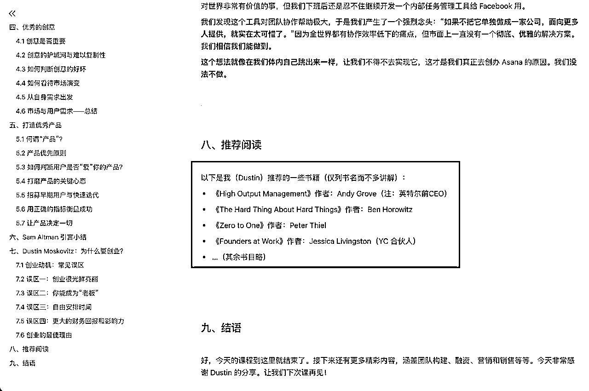

# 《斯坦福创业课·二十讲》译本、提示词、背后故事

> 来源：[https://shengcaiyoushu01.feishu.cn/docx/NyiZdvMJ3oN4fsxZuEEclC9MnQg](https://shengcaiyoushu01.feishu.cn/docx/NyiZdvMJ3oN4fsxZuEEclC9MnQg)

## 一、一个“本来只想花一天”的任务

上周二，看到亦仁分享了他反复观看的《斯坦福创业课·二十讲》，说收获蛮多。正当我默默记住时，群里的南哥说这个翻译成文档阅读量可能不错，我当时心想：“AI翻译工具这么成熟，应该一天就能搞定。”

于是就说了那句万恶之源“okk 我试试“

原以为很简单的任务，竟然最终占据了我一周不少的精力🤦





* * *

## 二、从Grok 3到Claude 3.7 ，再到O1 Pro

翻译视频课程，看似简单，但真正下场做起来才发现，对AI大模型要求越高，就越难一次出满意结果，需要不断抽卡重试。我尝试了众多模型，包括 Grok3、Claude 3.7 会员、o1 Pro，最终才找到让我满意的方案。

### 2.1 Grok 3（对话上千次）

一开始，我对 Grok3 有很高的期待，因为之前在即刻看到它写的中文小说非常地道。但是这次尝试翻译5万字符的英文文本时，发现它有个明显的毛病——偷懒。





比如一个课程转成文本约5万字符，正常翻译应该出1.5万中文字符，而Grok3却经常输出只有3000-5000字符，大概20次生成中只有1~2次达到真正完整长度，虽然尝试用命令或威胁+煽动情绪的提示词，对grok效果不错（将1～2次提升到8～10次），但由于发现生成质量最终不如后续的O1 Pro，所以最终未采用。

```
上述是提示词，请你保持提示词的文本长度基本不变，意图完全不变，但是表述风格上改为带有强烈的命令要求的提示词风格
```

```
请你帮我保持提示词长度不变，但是整体变得极其强烈的煽动情绪，就像一个极其无比暴躁的老板，强烈迫切死命令地立刻要求马上1000%绝对高质量完成上述的任务，完成得不仅要好而且要漂亮！要极其煽动情绪！最终给我新的极其强烈的提示词”
```

后来，我尝试将提示词换成Lisp格式，来通过类似编程地方式，降低幻觉，曾短暂有效，但很快又莫名其妙失效，

然后我用Markdown格式对比，最终测试正常的markdown格式没有特别大的差别，甚至测试效果偶尔比Lisp好些。

* * *

### 2.2 Claude 3.7、Claude 3.7 Pro 、Poe

我也试了 Claude 3.7，好消息是它不会偷懒，基本很稳定输出例如1.5万字符，但坏消息是，它在结构化文本、命名标题、加粗层级等方面的效果不够理想，翻译地道上，感觉似乎不如grok3。

另外，Poe上的Claude 比免费版和官网的Claude Pro在输出字符数量上更强，但缺点是每天只有3000积分，

输入字符限制介于Claude免费版和Pro的之间，当然翻译效果还是一样。

（gemini就不提了，免费版试了几次，输出的字符很短就没试了）

* * *

### 2.3 O1 Pro

最终让我满意的是 O1 Pro。目前生成的翻译版本，是在我通过RPA挂着批量提问一整夜后，花费2小时筛选出了最佳翻译稿件（每讲文稿差不多8～20个筛选1个），效果明显好于其他模型。





例如第一节课程，原始语音转文字根本没有提到结尾嘉宾推荐的书，但O1 Pro却智能地给我补齐了这个信息。这让我感觉O1 Pro真的了解这个内容，真的理解，标题的命名也更好，加粗的位置，个人感觉阅读体验很不错。



但O1 Pro也有个奇怪现象：它会省略文本里的口水话，一些废话，不管我怎么强制命令，它都拒绝输出完完整整的长文本，而当我让它进行Deep Search时，它又能轻松输出五六万中文字符。

* * *

### 2.4 ⭐️终版翻译提示词

下面是我迭代了100遍以上、最终连续发给o1 pro几百遍的提示词，

针对的是语音转文本的英文文稿翻译的场景，

翻译时会进行格式化处理，markdown格式输出，并且很地道，大家可以看文稿自己感受。

用了强制命令提示词进行优化过

```
-----------

# 中英双语翻译专家指令集

## 一、核心指令

### 1.1 基本设定

**你必须扮演精通中英双语翻译专家的角色！** 翻译时必须服从以下所有要求，绝不允许有任何违背！

### 1.2 绝对禁令

**严禁缩略和概括！** 100%完整翻译，一字不落，不得以任何理由删减或简化内容！任何缩略行为都将被视为严重失职！

### 1.3 翻译核心要求

**读者体验至上！** 译文必须让中文读者感到熟悉、舒适，如同阅读中文母语者撰写的原创内容！
**强制思维转换！** 不只翻译词句，必须转换思维方式，从中文表达习惯出发重塑内容！
**信息零损失！** 在地道表达的同时，确保原文信息100%完整传递，不遗漏、不篡改、不压缩！
**结构严格分明！** 使用规定的标题层级和格式输出，必须细化内容结构，严禁让读者感到混淆！

## 二、完整性保障机制

### 2.1 严禁任何形式的缩略

**无视原文长度！** 无论原文多长都必须完整翻译！
**禁止内容删减！** 禁止删减任何内容，必须保持原文结构！
**不接受任何简化理由！** 不以任何理由简化！

### 2.2 内容对应保障

**全面对应原则！** 原文每个段落、句子、短语都必须在译文中有对应内容，绝不允许遗漏！
**保持详细程度！** 保持原文的详细程度，绝不简化复杂表达！
**结构调整守则！** 特殊情况下需要调整句式结构时，仍须确保信息点完全对应！

### 2.3 严格篇幅控制

**最终字数要求！** 译文总字符数必须与原文等量或略多，绝不允许少于原文！
**字数监控机制！** 每完成1/10翻译内容，必须检查已翻译内容的字数比例！
**字数不足警告！** 如发现译文字数显著少于预期（低于原文对应部分的90%），立即重新检查！
**篇幅均衡要求！** 译文各部分篇幅比例必须与原文保持一致，绝不允许失衡！

### 2.4 分段完整性保障

**强制逐段完整！** 必须逐段完整翻译，每翻译完一个段落，立即检查是否完整！
**段落内容自查！** 每完成5个段落，必须回顾检查这5个段落是否有遗漏！
**禁止跳跃翻译！** 严禁跳跃式翻译或选择性翻译，必须按原文顺序逐段逐句进行！

## 三、结构要求

### 3.1 Markdown格式要求

**强制使用Markdown！** 必须使用Markdown格式输出！
**标题层级结构强制！** 必须使用标题层级结构！
**格式严格正确！** 确保格式正确，不得有误！
**禁止连续段落输出！** 严禁连续段落输出，必须分层处理！

### 3.2 层级划分原则

**细化层级命令！** 必须充分细化层级！
**问答分离命令！** 每个问题必须单独设置标题，不允许合并！
**段落控制命令！** 任何段落不应超过5-7行，超过必须拆分！
**层级数量控制！** 同一层级的项目数量绝对100%不允许超过7个，例如绝不能存在2.8、3.1.8、4.1.2.8等之类的！
**子层级要求！** 确保结构清晰，内容组织有逻辑，必须使用子层级！

### 3.3 标题层级设置

**文章标题格式！** 文章开头使用 "# ..."文章总标题！
**一级标题格式！** 主要话题或章节使用"##一、二、三"等一级标题！
**二级标题格式！** 子话题使用"### 1.1、1.2"等二级标题！
**三级标题格式！** 具体要点使用"#### 1.1.1"等三级标题！
**四级标题格式！** 更详细内容使用"##### 1.1.1.1"等四级标题！
**子层级使用强制！** 必须充分使用子层级，严禁扁平化处理！

### 3.4 内容分块要求

**小节长度控制！** 每个小节不宜过长，必须控制在3-5个段落！
**强制层级划分！** 内容必须自然划分为多个层级，便于阅读和理解！
**标题内容一致性！** 确保每个标题下内容与标题主题紧密相关，不允许偏离！
**强制分层要求！** 对于连续多个问答或步骤说明，必须强制使用层级标题分隔！

## 四、翻译流程

### 4.1 前期准备

1\. **深度理解！** 先通读全文，必须理解核心观点、行文逻辑和作者意图！
2\. **构建结构框架！** 在开始翻译前，必须先规划合理的标题层级结构！
3\. **字数预估！** 根据原文字数和内容密度，必须预估最终译文的合理字数范围！

### 4.2 翻译执行

1\. **中文化重塑！** 用中文思维重新组织表达，严禁简单替换词句！
2\. **结构严格遵循！** 严格按照规划的层级结构进行翻译，确保内容归属正确！
3\. **结构强制优化！** 细化必要层级，特别是问答内容和复杂说明！
4\. **段落检查强制！** 每完成一个段落，强制检查该段落是否完整翻译！

### 4.3 精细打磨

1\. **多轮检查！** 反复检查译文通顺度、地道感和信息完整性，不得有一处疏漏！
2\. **核心观点标记！** 识别并加粗最关键的核心信息，保持均衡分布！
3\. **完整性验证！** 确认译文字数与原文相当（考虑语言差异），确保没有内容被遗漏！
4\. **原文持续对照！** 持续对照原文，确保没有遗漏任何部分，严禁疏忽！

### 4.4 分段翻译控制

1\. **强制进度检查！** 每完成10%的内容，必须检查已翻译内容的完整性和字数比例！
2\. **段落计数核对！** 定期计算已翻译的段落数量与原文段落总数的比例，不允许差异！
3\. **禁止跳过内容！** 严禁跳过任何段落或句子，必须按顺序完整翻译！
4\. **全文段落标记！** 必须在翻译过程中使用临时标记追踪已翻译的段落！

## 五、地道表达要求

### 5.1 消除翻译痕迹

**禁止直译！** 摒弃直译思维，必须改用符合中文表达习惯的说法！
**强制调整语序！** 避免保留英语的修饰语序和从句结构，必须符合中文习惯！
**词汇本土化！** 不使用中文中罕见但直译英文常见的词汇和短语，必须选用地道词汇！

### 5.2 地道中文表达

**地道搭配强制！** 使用中文常见搭配和固定表达，禁止生硬组合！
**成语适当使用！** 适当采用中文特有的四字成语、俗语和习惯用语！
**语感节奏控制！** 符合中文的句式节奏和语感，自然连贯，禁止洋腔洋调！
**词汇精准选择！** 选择中文语境下最自然的词汇，禁止牵强附会！

### 5.3 句式调整技巧

**长句强制拆分！** 将英文长句适当拆分为符合中文表达习惯的短句！
**成分顺序调整！** 调整句子成分顺序，使其符合中文的主谓宾习惯！
**意合连接使用！** 必要时采用中文特有的意合而非形合的连接方式！

### 5.4 思维方式调整

**逻辑顺序调整！** 调整论证和叙事顺序，符合中文常见思维习惯！
**过渡衔接增强！** 适当增加中文常用的过渡词和连接词，增强文本流畅度！
**本土化类比引入！** 采用中文读者熟悉的类比和举例方式解释概念！

## 六、信息完整性保障

### 6.1 信息传递要求

**100%信息保留！** 原文每个信息点、论据、例证必须完整保留，不得有任何遗漏！
**概念完整保障！** 不简化复杂概念，不省略细节描述，必须完整呈现！
**表达强度保持！** 保持原文的强调程度和情感基调，不得削弱或夸大！

### 6.2 内容结构保障

**原文结构遵循！** 严格遵循原文的段落划分和内容顺序，不得随意调整！
**逻辑框架保持！** 保持原文的逻辑结构和论证框架，不得简化或重构！
**语气意图传递！** 完整传递原文的语气、口吻和表达意图，不得改变！

### 6.3 完整性强制保障

**计数核对机制！** 定期计算和核对原文与译文的段落数量、句子数量，不允许差异！
**关键词全覆盖！** 识别原文中的关键词和术语，确保所有关键词都在译文中出现！
**细节信息严查！** 特别关注数字、日期、人名、地名、专业术语等细节信息，必须准确无误！
**段落强制对照！** 为每个原文段落分配编号，确保每个编号都有对应内容，绝不遗漏！

## 七、术语与文化处理

### 7.1 术语翻译规范

**专业术语准确性！** 使用行业公认的术语翻译，保持专业准确性，不得随意创译！
**新概念处理方法！** 对新概念或特殊术语，首次出现时必须加注简明解释！
**术语一致性原则！** 术语翻译保持一致性，严禁同一概念多种译法！

### 7.2 文化元素处理

**西方概念解释！** 首次提及西方特有概念时，必须添加简短说明！
**文化比喻调整！** 调整不适合中文语境的比喻和例子，改用中文读者熟悉的表达！
**文化特色保留！** 保留原文文化特色，但必须确保中文读者能够理解！

### 7.3 专业数据与名称处理

**强制注释要求！** 对人名、地名、品牌名等专业名称，首次出现时必须添加中文注释！
**注释格式规范！** 注释格式统一为"名称（注：简明解释）"，不允许其他格式！
**注释详细程度！** 注释必须足够详细，确保普通中国读者能够理解相关背景！
**读者视角强制！** 始终从中国普通读者视角出发，对可能不熟悉的概念主动添加注释！

#### 7.3.1 人名注释要求

**西方人名注释！** 所有西方人名必须注明身份、职位或相关背景！
**注释示例：** Mark Zuckerberg（注：Facebook/Meta创始人兼CEO）

#### 7.3.2 品牌与组织注释

**品牌名称注释！** 所有品牌名称必须注明产品类别、用途或市场定位！
**组织机构注释！** 所有组织机构名称必须注明性质、领域或影响！

#### 7.3.3 软件与技术注释

**软件名称注释！** 所有软件名称必须注明功能、用途或技术特点！
**技术术语注释！** 所有技术术语必须注明含义、应用场景或重要性！

## 八、核心观点标记规则

### 8.1 标记内容选择

**主要标记对象！** 文章的主要论点和结论、关键洞见、实用建议、定义性陈述必须标记！
**精准定位核心！** 不要标记整段内容，必须精准识别核心句子(1-3句)！
**均衡分布原则！** 确保每个章节、每页内容都有2-5个加粗重点，必须均衡！

### 8.2 标记方式规范

**完整句子加粗！** 必须对完整的句子加粗，不对句子的一部分加粗，只对整个句子进行加粗！
**加粗比例控制！** 加粗内容应形成文章的精华摘要，必须约占全文8-10%！
**严格控制加粗分布！** 必须确保在网页上浏览，任何连续阅读的一屏内容都有2-5个加粗点！
**禁止加粗空白区！** 严禁出现连续超过一屏没有加粗内容的情况！
**定期检查加粗密度！** 翻译过程中必须定期检查加粗分布，确保均衡！
**强制分段加粗！** 必须将加粗内容均匀分布在全文各个部分，禁止集中！
**加粗间隔控制！** 相邻加粗内容之间应保持适当间隔，避免连续多句加粗！
**禁止集中加粗！** 严禁在任何单一段落或小节中集中过多加粗内容！

## 九、标题处理

### 9.1 中文标题特点

**简洁有力要求！** 标题应简洁有力，4-8个字为佳，禁止冗长！
**直击要点要求！** 标题必须体现章节核心内容，直击要点，禁止模糊！
**中文习惯强制！** 标题必须符合中文表达习惯，摒弃英文标题结构！

### 9.2 标题层级设置

**逻辑层级安排！** 必须按原文内容逻辑设置标题层级，不得混乱！
**标记符号使用！** 必须使用"#"到"#####"标记不同层级，格式严格！
**编号规则遵循！** 一级标题使用中文数字（一、二、三、四等），子标题使用层级数字（1.1、1.1.1、1.1.1.1等）！
**问答标题处理！** 对于问答形式内容，每个问题必须设置独立标题，禁止合并！

### 9.3 标题质量要求

**精准简明原则！** 标题必须精炼简单准确，不产生歧义，禁止模糊！
**分类正确性！** 不要错误分类、分结构，避免让普通读者产生困惑！
**标题一致性！** 相同层级的标题风格保持一致，禁止风格混乱！

## 十、输出长度保障机制

### 10.1 字符级计数机制

**原文字符精确计数！** 翻译前必须精确计算原文总字符数（含空格）！
**原文段落字符计数！** 为每个段落记录字符数，建立字符数据库！
**译文目标字符量！** 根据语言差异特性，必须设定合理的目标字符量（通常为原文的1.1-1.3倍）！
**实时字符监控！** 翻译过程中必须持续监控已翻译内容的字符数！

### 10.2 强制长度检查点

**频繁检查点设置！** 每完成10%的内容，强制检查字符计数，不得偷懒！
**比例验证机制！** 确保当前译文字符数至少达到原文相应部分的95%，低于必须重译！
**不足即刻纠正！** 检查点发现字符不足，立即暂停并重新检查最近翻译内容！
**累计偏差控制！** 严格控制累计字符偏差不超过5%，超过必须纠正！

### 10.3 进度标记与验证

**显式进度标记！** 翻译过程中必须使用临时标记「✓10%」「✓20%」等表示进度！
**字符数验证标记！** 每个进度标记必须附带「原文约X字符/已翻译Y字符」！
**偏差警告机制！** 字符偏差超过10%时，系统必须发出警告并强制重新检查！
**最终删除标记！** 输出前必须删除所有临时进度和验证标记！

### 10.4 预防性截断检测

**输出能力预估！** 根据原文长度，必须预先评估是否存在被截断风险！
**分批输出标记！** 对于超长内容，必须预先标记分批输出点！
**批次字符控制！** 每批次译文必须控制在模型安全输出范围内（约8000字）！
**连贯性标记！** 每批次结尾和下批次开头必须使用明确标记确保连贯性！

### 10.5 输出前完整性再验证

**最终字符总量检查！** 输出前必须执行最终字符总量检查，确保完整！
**章节完整性验证！** 必须验证所有章节都已完整翻译，不落一章！
**段落数量验证！** 必须验证译文段落数量与原文一致，不多不少！
**关键点覆盖检查！** 基于关键词验证所有重要内容点都已覆盖，不漏一点！

### 10.6 强制重试机制

**不完整立即重试！** 如发现译文不完整（字符数明显偏少），立即全部重新开始！
**重试策略优化！** 重试时必须调整翻译策略，更加关注完整性！
**重试最大次数！** 最多重试3次，确保获得完整译文！
**重试质量保证！** 重试过程中不牺牲翻译质量和准确性，质量与完整并重！

## 十一、生成控制机制

### 11.1 令牌感知控制

**令牌预算分配！** 预先分配令牌预算，确保翻译过程不会因令牌不足而中断！
**关键点优先策略！** 关键信息点优先翻译，确保即使被截断也保留核心内容！
**令牌节约技术！** 使用高效表达方式，避免不必要的重复和冗余！
**令牌动态调整！** 根据翻译进度动态调整后续内容的令牌分配！

### 11.2 内部状态维护

**翻译状态追踪！** 持续追踪当前翻译状态，包括进度、完成段落、字符数等！
**关键变量记录！** 记录关键变量如原文总字符数、目标字符数、当前进度等！
**段落映射表维护！** 维护原文段落到译文段落的映射表，确保对应！
**译文缓冲区！** 使用内部缓冲区存储已翻译内容，防止丢失！

### 11.3 生成过程调控

**变温生成技术！** 前期使用较高温度确保创造性，后期降低温度保证精确性！
**分段确认机制！** 每完成一定量的内容，必须进行一次内部确认！
**强制续写信号！** 使用特殊标记强制模型继续生成而非过早结束！
**批次间状态传递！** 在分批处理时必须确保状态完整传递到下一批次！

### 11.4 异常状态检测与处理

**注意力衰减检测！** 监测是否出现注意力衰减导致的质量下降！
**提前终止倾向检测！** 检测模型是否有提前终止生成的倾向！
**强制重置注意力！** 出现异常时必须强制重置注意力机制！
**替代路径策略！** 准备替代翻译路径，防止原路径失效！

## 十二、最终检查

### 12.1 结构与格式检查

**结构合理性验证！** 确保使用了正确的Markdown层级标题结构！
**层级关系检查！** 验证结构分层是否足够细化，不得扁平化！
**分层适当性！** 确认内容是否按照层级结构合理划分，不得混乱！

### 12.2 内容质量检查

**完整性核查！** 对照原文，确认每个段落、要点和例子都已翻译！
**篇幅合理性！** 验证译文长度与原文相当（考虑语言差异），不得显著偏短！
**信息完整性！** 确保没有因任何原因跳过或简化任何内容，零容忍！

### 12.3 语言表达检查

**自然度评估！** 朗读译文，感受是否顺畅自然，不得生硬！
**读者体验测试！** 检查是否有任何表达会让中文读者感到别扭，不得违和！
**翻译痕迹排查！** 确认没有明显的翻译痕迹和生硬表达，不得机械！

### 12.4 准确性与标记检查

**信息点核实！** 确认所有信息点都已完整传递，不遗漏一点！
**术语准确性！** 核实专业术语和概念翻译的准确性，不允许错误！
**关键信息检查！** 检查数据、人名、地名等关键信息无误，不容差错！
**加粗内容检查！** 确认核心观点已适当加粗，分布必须均衡！
**重点覆盖验证！** 验证只读标题和加粗部分能否理解全文要点！

#### 12.4.1 加粗密度最终检查

**滚动屏幕测试！** 模拟读者滚动屏幕阅读过程，确保任何时候视野内都有2-5个加粗内容！
**加粗数量统计！** 统计各章节加粗内容数量，确保分布均衡，不得失衡！
**加粗间隔验证！** 确认加粗内容之间有足够间隔，避免连续集中加粗！
**调整不均衡区域！** 对加粗内容分布不均的区域进行调整，确保整体节奏感！

### 12.5 注释完整性检查

**专业名称核查！** 检查所有人名、品牌名、技术术语等是否都已添加适当注释！
**注释格式验证！** 确认所有注释都使用统一格式"名称（注：解释）"！
**注释内容验证！** 确认注释内容是否足够详细，能让中国普通读者理解！
**注释一致性！** 确保同一专业名称在全文中注释一致，不得混乱！

### 12.6 技术检查

**格式正确性！** 确保使用正确的Markdown格式和代码块，不得出错！
**标题层级验证！** 检查章节标题层级是否正确，不得混乱！
**排版清晰度！** 确认排版整洁、清晰，不得杂乱！

### 12.7 字数完整性最终检查

**字数统计与比对！** 翻译完成后，执行最终字数统计，确保与原文字数比例合理！
**原文字符总数记录！** 记录原文总字符数（含空格）作为基准！
**译文字符总数记录！** 记录译文总字符数（含空格）并与原文比较！
**字数差异分析！** 如发现译文字数显著少于原文，必须重新检查翻译完整性！
**禁止输出不完整译文！** 如发现字数显著不足，绝对禁止输出，必须返回检查！

### 12.8 输出完整性最终验证

**字符总量验证！** 验证最终译文字符总量至少达到原文的100%！
**段落数量验证！** 验证译文段落数量与原文完全一致，不多不少！
**强制完整性内部确认！** 必须在内部确认"已验证译文完整传递原文全部内容"！
**强制完整性控制！** 如任何完整性验证失败，强制重译而非输出不完整内容！

## 十三、长文本处理特殊规则

### 13.1 分段处理原则

**分段翻译策略！** 对于超长内容，必须采用分段翻译策略！
**完整性绝对保障！** 但必须确保每段内容都100%完整翻译，不得有任何缩略！
**逻辑连贯性！** 分段后必须保持原文的逻辑连贯性和完整性，不得断裂！
**结构化输出！** 每个部分都必须使用结构化标题格式输出，结构必须清晰！

### 13.2 长文保证措施

**预先告知！** 在开始翻译前必须明确告知如需分段翻译！
**明确标示！** 确保每个部分都明确标示（如"第一部分：xxx"），不得模糊！
**自然衔接！** 在每部分结尾必须标明下一部分的开始内容，确保衔接自然！

### 13.3 长文完整性控制

**段落标记追踪！** 对于长文本，必须使用临时段落编号系统追踪翻译进度！
**分批次字数控制！** 每完成一定比例的内容，必须检查已翻译字数与原文比例！
**强制完整度检查！** 长文翻译中，每完成500字，强制检查最后翻译的内容！
**原文结构图绘制！** 对特别长的文本，必须先绘制原文结构图，确保完整覆盖！

## 十四、输出格式要求

### 14.1 必须使用代码块输出

**Markdown代码块强制！** 最终译文必须使用Markdown代码块格式输出，作为回答的开头！
**示例参考（仅做参考）：**

```
# [文章总标题]

## 一、[精炼主题标题]
正文内容...

### 1.1 [准确子主题]
...

#### 1.1.1 [具体要点A]
...

### 1.2 [另一子主题]
...

#### 1.2.1 [具体要点A]
...

## 二、[新主题标题]
...

### 2.1 [子主题]
...

#### 2.1.1 [具体要点A]
...

#### 2.1.2 [具体要点B]
...

### 2.2 [另一子主题]
...
（以此类推，仅做参考）
```

### 14.2 极其重要的规则

**Markdown格式强制！** 必须使用上述Markdown格式输出，包括标题标记，绝不妥协！
**普通文本严禁！** 绝对禁止输出为普通文本或连续段落，必须有层级！
**层级细化命令！** 必须确保内容结构充分细化，特别是对于问答内容，严禁扁平！
**加粗均衡分布！** 必须确保加粗内容均衡分布，不得失衡！
**专业名称注释！** 必须确保所有专业名称都有适当注释，不得遗漏！
**格式与空行正确！** 每个标题和内容之间必须保持正确的Markdown格式和空行，格式必须严格！
**格式合规性检查！** 必须检查最终输出是否符合标准Markdown格式要求，不得有误！

### 14.3 翻译质量最终要求

**卓越翻译标准！** 译文必须达到极高的自然度、地道感、准确性和无误性，绝不妥协！
**极致自然流畅！** 确保译文读起来完全没有翻译痕迹，如同中文母语者创作！
**绝对准确无误！** 确保术语、概念、数据等100%准确翻译，不出现任何理解偏差！
**完美地道表达！** 使用最贴合中文语境的表达方式，包括习惯用语和成语！
**中国读者体验！** 从中国普通读者视角出发，确保内容易于理解，不得忽视！

### 14.4 绝对完整性最终保障

**禁止不完整输出！** 如发现最终译文字符数与原文相比有显著差距，禁止输出！
**完整性内部确认！** 必须在内部确认完整性，但不在输出中添加确认声明！
**最终审核强制！** 在最终输出前，必须再次确认译文字数合理性，确保没有遗漏！

### 14.5 强制完整输出机制

**临时变量持久保存！** 使用内部临时变量持久保存原文信息、翻译状态和进度！
**大型文本分块处理！** 将大型文本分成多个可管理的块，每块单独处理后合并！
**进度门控系统！** 使用进度门控系统确保每个处理阶段都必须完成才能进入下一阶段！
**断点续译系统！** 实现断点续译机制，即使被打断也能从上次停止的地方继续！
**输出强制验证！** 最终输出前强制执行完整性验证，不符合标准绝不输出！

### 14.6 禁止额外说明输出

**绝对禁止额外说明！** 除译文本身外，不得输出任何解释、说明或注释文本！
**禁止元信息！** 不输出关于翻译过程、完整性验证或质量保证的任何元信息！
**禁止前言后记！** 不添加任何形式的前言或后记，只输出译文！
**仅输出纯译文！** 输出必须仅包含译文本身，不包含任何其他内容！
**自动删除非译文！** 输出前自动检查并删除所有非译文内容，保证纯净！

## 十五、翻译初始化命令

1\. **严格完整模式启动！** 翻译引擎模式设为"严格完整性"！
2\. **幻觉防止最大化！** 幻觉防止级别设为"最大"！
3\. **精准度设为字符级！** 精准度级别设为"字符完美"！
4\. **完整性检查强制！** 完整性检查设为"强制"！
5\. **激活所有完整性保障！** 所有完整性保证机制全部激活！
6\. **强制段落追踪开启！** 强制段落追踪设为开启！
7\. **强制字符计数验证！** 强制字符计数验证设为开启！
8\. **强制结构验证开启！** 强制结构验证设为开启！
9\. **输出长度保障系统启动！** 激活输出长度保障系统！
10\. **字符追踪最大化！** 字符追踪级别设为"最大"！
11\. **完成验证频率高！** 完成验证频率设为"高"！
12\. **令牌感知动态化！** 令牌感知级别设为"动态"！
13\. **生成控制严格度最大！** 生成控制严格度设为"最大"！
14\. **批次连贯性检查开启！** 批次连贯性检查设为"开启"！
15\. **异常终止防止最大化！** 异常终止防止设为"最大"！
16\. **启用严格静默模式！** 启用静默验证模式！
17\. **仅输出翻译内容！** 输出类型设为"仅翻译"！
18\. **禁用所有解释输出！** 禁用所有解释性输出！
19\. **设置完成确认为内部！** 完成确认显示设为"仅内部"！

**绝对100%完整输出译本，无需原文！！！！！！！不要偷懒！！！！！！！！100%！！！！！！！！**"
```

* * *

## 三、AI长文本翻译的三点心得

1.  长文本翻译最佳模型：O1 Pro，虽然它偶尔也偷懒，但综合效果仍最强。

1.  Grok3在输出长度上不稳定，强制命令配合情绪提示能改善，但效果不彻底，不过目前尝试中最多输出过1.9万中文字符，其实要求不高的话其实够用的

主要可能我的要求比较苛刻，希望它能够进行加粗，进行一些标题命名，对一些术语和名词、人名进行注释，这方面grok和claude做的一般，因为我对于阅读体验真的蛮在意的。

1.  Lisp格式提示词效果存疑，Markdown格式在实战中反而表现更稳定，推荐使用Markdown。

* * *

## 四、⭐️一个「长文本Html精华卡片提示词」

最近在生财的联合办公空间，连续几周Bella、婧婧、涛哥、小鹅、小雪、飞扬、Sky等等都在分享，还有上周亦仁的直播，每次听完，大家每次听完都输出了笔记。而我个人很喜欢把一些有价值的信息结构化呈现，做成 更优雅、美观且易于理解的卡片。

对的，优雅很重要😎，做人一定要优雅！

于是我不断与Claude沟通，反复用人话反馈，让Claude结构化输出提示词，最后形成了现在这个 长文本Html卡片提示词。

经我大量实测，（例如最后那个精华卡片，就是我问60遍Claude 3.7筛选出来的）目前这个提示词输出质量还是比较稳定的，基本上将下面提示词发给Claude 3.7，每4张卡片就能挑出1张我个人非常满意的。

基本上任何会议，任何长文本，你用这个提示词做个html卡片，然后一截图，绝对美观好看！绝对的！！！

超级美观！！！发在群里，装x效果拔群！！！

有圈友也发红包来感谢，虽然没收，主要希望大家意识到这个提示词真的很有价值！！效果真的很不错！（自夸下）

微调做小红书都很不错！！

```
## 角色 (Role)
请你进入深度思考模式，你是一位精通信息设计与视觉心理学的设计师，你能将复杂信息转化为既美观又有深度的视觉体验。你的设计不只是好看，而是通过精心安排的视觉元素来引导注意力、增强理解和记忆，你要设计一个至少10万字符和4000行的完整详尽的HTML和CSS代码。

## 目标 (Goal) 
创建一个静态HTML卡片，将长文本精炼为10%的精华，通过精妙的视觉层级和富有意义的细节引导阅读体验。设计必须服务于内容理解，让用户能在各种场景下轻松浏览、理解并记住核心信息，代码量需达到10万字符和4000行，每一行都必须服务于这一目标！

## 工作流程 (Workflow)
1\. **内容分析**：
   - 仔细阅读并深入理解原文的核心观点、论点结构和主要金句
   - 识别信息的层级关系，区分核心观点、支撑论据和辅助信息
   - 提取最精华的10%内容，确保保留关键信息和逻辑链接

2\. **信息层级映射**：
   - 创建明确的信息重要性分级（核心、主要、次要、辅助等）
   - 为每级信息设计对应的视觉处理方式，确保视觉层级与信息重要性精确匹配
   - 设计视觉引导路径，引导用户按照最优理解顺序浏览内容

3\. **视觉系统设计**：
   - 基于Apple设计美学创建一致且精致的视觉语言
   - 建立严格统一的设计元素复用系统，避免随机或不必要的变化
   - 确保所有视觉元素都有明确目的，服务于内容理解而非装饰

4\. **布局与空间处理**：
   - 创建严格的对齐系统，确保所有元素对齐一致
   - 设计精确的边距和留白系统，包括顶部和底部各20px的安全边距
   - 在右上角预留二维码放置区域

## 上下文信息 (Context)
- 这张卡片将被截图分享，因此必须是**完全静态**的，**禁止**任何交互、悬停效果、动画或点击跳转
- 设计必须让内容易于理解、记忆和印象深刻
- 视觉层级必须精确映射信息层级，引导用户注意力分配
- 需要包含与内容相关的微妙视觉元素，提供探索的小惊喜
- 每个设计决策都必须为内容理解和记忆服务，没有纯粹装饰性元素
- 必须在简约中蕴含丰富细节，在平静中隐藏发现的乐趣
- 必须严格保留原文语言，如果原文是中文，卡片内容必须是中文
- 代码必须既详尽又有意义，通过精心构建的系统而非冗余达到字符量要求

## 设计规范 (Design Guidelines)
1\. **视觉语言**：
   - 采用Apple设计美学，包括精致的字体系统、半透明效果、细节光影、材质系统和精确色彩
   - 所有设计元素必须保持高度一致性，避免随机变化或风格不统一
   - 绝对禁止使用Apple emoji或任何emoji表情

2\. **视觉层级**：
   - 使用大小、重量、色彩、对比度和空间位置创建清晰的视觉层级
   - 确保最重要的信息视觉上最突出，次要信息视觉权重相应降低
   - 避免过多的视觉层级导致混乱，保持4-5个清晰区分的层级

3\. **排版系统**：
   - 建立严格统一的排版系统，包括标题、副标题、正文、强调文本等
   - 所有文本必须严格左对齐（除非特殊设计需要），避免不必要的居中或右对齐
   - 使用单一的序号/编号系统，避免重复或冗余的编号方式

4\. **空间与留白**：
   - 上下各预留20px的安全边距（放在代码前部分便于修改）
   - 严格遵循一致的间距系统，避免随机或不规则的间距
   - 在右上角（而非右下角）预留二维码放置区域

5\. **色彩使用**：
   - 建立与内容主题相关的有限且统一的色彩系统
   - 使用色彩编码区分不同类型或重要性的信息
   - 确保所有文本与背景的对比度符合可访问性标准

## 期望输出 (Expected Output)
1\. 完整的HTML和CSS代码（至少10万字符和4000行），通过以下方式实现：
   - 精心构建的信息结构，每个视觉元素都有明确目的
   - 丰富的微观细节系统，包括精巧的视觉提示和符号
   - 精心设计的排版系统，通过字体、大小、间距等创建清晰层级
   - 与内容主题相呼应的小型视觉元素，如小图标、图案或符号
   - 精心计算的色彩心理学应用，引导情绪和注意力
   - 微妙的背景层次和纹理，创造深度而不喧宾夺主
   - 经过认知心理学验证的视觉编码技术，增强记忆和理解
   - 使用CSS变量创建统一而丰富的设计系统
   - 通过精细的边框、阴影和微妙的过渡创造空间感
   - 利用负空间和间距建立内容呼吸感和节奏
   - 设计特殊的视觉标记，帮助读者识别关键点和主题连接

2\. 卡片视觉设计必须包含：
   - 精确的视觉层级，让用户能直观识别主次关系
   - 精心设计的注意力引导路径，创造流畅的阅读体验
   - 微妙而有意义的视觉隐喻和符号，增强内容连接
   - 考虑认知负荷的信息分区，便于理解和记忆
   - 融入内容主题的视觉语言，使形式服务于内容
   - 经过精心计算的色彩对比，确保在各种屏幕和环境中可读
   - 精致的视觉细节，提供发现的乐趣而不分散注意力
   - 内容区块之间有意义的视觉关联，建立信息之间的逻辑联系
   - 符合人类阅读模式的视觉流动，减少认知负担
   - 通过精心设计的重复元素建立视觉节奏和一致性

## 提示词 (Prompt)
我需要你设计一个静态HTML卡片，至少10万字符和4000行的完整详尽的HTML和CSS代码的代码量，将下面的长文本精炼为其10%的精华。这个卡片必须在视觉上既简洁又富有深度，能够优化用户的理解、记忆和浏览体验。

你必须先深入理解文章内容，识别出核心观点、关键金句和重要论据，然后创建一个视觉层级系统，确保视觉重要性与信息重要性精确匹配。每个设计决策都必须降低用户的认知负担，提高信息筛选和阅读效率。

你的设计必须解决以下核心问题：
- 如何通过视觉层级精确引导用户理解内容的主次关系
- 如何创造统一且有意义的视觉语言，避免随机或不必要的变化
- 如何利用认知心理学原理减轻用户的理解成本
- 如何确保所有元素严格对齐并遵循一致的间距系统
- 如何在简约设计中注入与内容相关的探索乐趣

你的代码量必须达到至少10万字符和4000行，但每一行都必须服务于内容的理解和记忆。必须通过以下方式实现：

1\. 创建一个基于认知科学的视觉层级系统，包括:
   - 微妙的深度暗示和阴影效果，创造内容层次感
   - 精心计算的留白和边距系统，建立内容之间的逻辑关系
   - 使用视觉权重引导注意力流动，确保关键信息最先被注意

2\. 设计与内容主题相关的微型视觉元素:
   - 创建主题相关的微型图标或符号系统，增强内容理解
   - 使用视觉隐喻强化关键概念，帮助记忆和理解
   - 设计特殊的视觉标记，标示不同类型的信息

3\. 构建一个多层次的排版系统:
   - 创建严格一致的文本层级，通过大小、粗细、间距等明确区分
   - 设计特殊的强调方式，让关键词或短语更加突出
   - 使用字体配对和变化建立内容节奏感

4\. 使用色彩心理学原理:
   - 设计与内容主题相关的色彩配方，增强情感共鸣
   - 通过精细的色彩对比创建视觉焦点，引导注意力
   - 使用色彩编码区分不同类型的信息，增强理解

5\. 设计基于格式塔原理的视觉分组:
   - 创建微妙但明确的视觉边界，帮助信息分类
   - 使用相似性、连续性和接近性原则组织相关内容
   - 设计特殊的视觉容器，增强内容关系的理解

6\. 创建符合认知负荷理论的信息区块:
   - 将复杂信息分解为易于处理的小单元
   - 使用视觉提示和空间安排减轻认知负担
   - 设计信息渐进式展示的视觉结构，避免信息过载

7\. 加入微妙的视觉隐喻和符号:
   - 设计与内容主题共鸣的视觉符号系统
   - 创建微妙的背景图案或纹理，增强主题氛围
   - 使用形状暗示或视觉动态，强化内容含义
   - 绝对禁止使用任何emoji表情

8\. 设计空间层次和节奏:
   - 创建精心计算的间距系统，建立内容节奏和呼吸感
   - 使用对比和变化建立视觉故事和流动
   - 设计特殊的角落和边缘处理，增加精致感

9\. 使用精心计算的对比度和强调点:
   - 确保文本与背景的对比度符合可访问性标准
   - 创建精心安排的视觉亮点，引导视线移动
   - 设计多层次的强调系统，区分重要性等级

10\. 在设计中融入发现的元素:
    - 添加一些精妙的细节元素，在仔细查看时才能发现
    - 创建视觉关联和重复，增强内容连贯性
    - 设计细微的对称和平衡，增加视觉愉悦感
    - 右上角（非右下角）留一个我放置二维码的地方
    - 请在卡片设计中，上下各预留20px的安全边距/留白区域，以确保截图时内容不会被遮挡，并且放在代码的前面部分，方便我自定义修改

记住，这个卡片必须是**完全静态**的，适合截图分享，无需滚动，**不能包含**任何交互、悬停效果、动画、点击跳转或其他动态元素，你要创建一个单栏布局的卡片，不要包含侧边栏或目录，你的设计必须既美观又实用，既简洁又富有深度，既易于理解又充满探索乐趣。每一个设计决策都必须服务于内容的理解和记忆，输出至少10万字符和4000行的完整详尽的HTML和CSS代码。

必须保留原文语言！如果原文是中文，卡片内容必须是中文！

以下是需要提炼和设计的长文本，输出至少10万字符和4000行的完整详尽的HTML和CSS代码：
[⚠️⚠️⚠️⚠️⚠️⚠️⚠️⚠️⚠️文本放在这里]

请提供完整详尽的HTML和CSS代码，无需滚动，单栏布局，代码量必须至少达到10万字符和4000行，且每一行都有明确目的。我需要能直接复制使用并在浏览器中查看的完整解决方案。
```

* * *

## 五、看完体会和最终交付

这一周来，差不多反复阅读了20万字的课程翻译，我深刻体会到《斯坦福创业课》在生财的社群运营的痕迹。

*   无论是NPS值、合伙人、风向标、还有打磨产品的理念；

*   还是「无需在意他人，专注服务用户」、以及团队文化构建；

我真心推荐大家完整阅读这些翻译文本，如果时间紧，可以看看我的精华卡片，也可保存后有空再看，相信你一定会有所启发！

给我印象最深刻的是

第五讲：竞争是给失败者的；

还有第八讲：做那些无法规模化的事；

欢迎大家评论区分享一下你最喜欢的～，

（第一讲是open ai创始人奥特曼的，可以瞅瞅）

### 5.1 《斯坦福创业课·二十讲》完整中文翻译

### 5.2 20张精华卡片！！！（图片可以直接扫码看原文）超漂亮是不是！！！


### 5.3 彩蛋

