# DY提取软件使用教程

> 来源：[https://da6r699qsri.feishu.cn/docx/NyrcdYjecoq0lsxRkeucHmDSnwd](https://da6r699qsri.feishu.cn/docx/NyrcdYjecoq0lsxRkeucHmDSnwd)

#### 欢迎使用江湖数据，江湖工具箱，DY提取软件，属于DY数据分析软件，

#### 这款软件与外部那种专门取别人作品的软件性质不一样，我们主要数据分析用，

#### 软件核心目的帮助创作者分析对手的作品数据如何曝光率高，如何更好的制作原创质量高的作品。

#### 软件数据全部来自DY网页公开数据，广受DY创作者青睐。

#### 这款软件看似复杂，用久了非常顺手，我们将一直持续更新，为您创造更好的数据分析与价值。

* * *

* * *

* * *

# 常见问题讲解：

<h8>问：为什么我提取主页作品总是只能提取18个，19个，20个，21个作品，不是这个主页全部作品？</h8> <h8>答1：你需要在软件内浏览器扫码登录，不要直接点击浏览器，点击提取页面的【登录DY】</h8> <h8>答2：检查是否勾选了，新作品提醒模式，如果勾选了他只提取第一页作品。</h8> <h8>问：为什么我提取作品的时候，进度条显示已获取作品很多，但是达标作品很少，甚至达标作品0。</h8> <h8>答：因为你设置了筛选条件，条件不达标的作品，不会加入作品列表，也不会计数在内。</h8> <h8>问：为什么下载作品，作品列表，下载状态显示失效，没有下载成功？</h8> <h8>答1：因为官网限制，提取后半个小时内必须下载完成，否则下载链接会失效。</h8> <h8>答2：因为官网限制，一定时间内限制下载流量，会导致这个作品下载成功那个作品下载失败。</h8>

### 问：为什么下载一个视频很慢很慢，即使我开通了极速下载器也很慢？

#### 答：检查是否保存到了U盘或者移动硬盘，一定要将保存路径设置在电脑磁盘，机械与固态硬盘，固态硬盘优先，因为U盘与部分移动硬盘每秒写入速度慢，达不到软件要求。

# 主页提取数据教程

## 1.添加主页地址

### 电脑端网页获取主页地址方式

首先在浏览器打开DY官网，找到你需要获取数据的作品点击作品头像进入主页，然后再浏览器地址栏复制网址即可，下图演示：按照图顺序看，

图1是作品，鼠标左键点击进入看到的是作品

图2是作者头像，在点击他的头像。

图3点击他的昵称，浏览器会跳转到他的主页。

图4将浏览器地址栏的所有字符复制即可，这个就是主页地址。

关于地址怎么发送到电脑端，你可以在电脑登录微信，

手机发送到微信的文件传输助手，电脑端微信文件传输助手就可以同步消息。

图1：

图2：

图3：

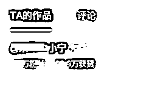

图4：

### 手机端获取主页地址方式

打开DY APP 找到你要提取作品，按照下方图片顺序操作：

图1：从作品点击作者头像进入他的主页。

图2：进入主页后右上角有3个小点点点击他，箭头指向的。

图3：点击分享主页，会弹出下拉框。

图4：点击复制连接即可，这样主页地址就复制到了。

关于地址怎么发送到电脑端，你可以在电脑登录微信，

手机发送到微信的文件传输助手，电脑端微信文件传输助手就可以同步消息。

图1：

图2：

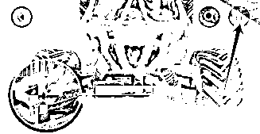

图3：

图4：

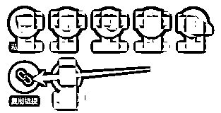

### 添加主页教程视频

### 表内数据

#### 选择框：

用于提取，删除，修改之类的操作，

最顶部的选择框，是操作列表列的全部选择框用途，可全选，选不选。

#### 序号：

是根据你的添加顺序自动生成，

#### 作者信息数据：

全部来自网页公开数据，这里不讲解。

#### 本地视频作品数量 与 本地图文作品数量 与 本地喜欢作品数量：

是你提取下载的数据，识别方式，是根据你设置的目录，只要目录你在开始使用软件不去变更，作品数据不删除，他都会记录在内，例如你保存了10个作品，目录没有变，删除了其中一个作品，然后每次打开自动取寻找这个标题的作品是否存在，如果存在就自增1，你删除的那一个没有找到，最后显示的是本地存在9个作品。

#### 备注：

添加主页后，自动显示默认，你可以手动修改，右键修改 或者 批量修改。

添加时间：添加主页后自动生成当前添加时间，以你本地电脑时间为准，不是网络时间。

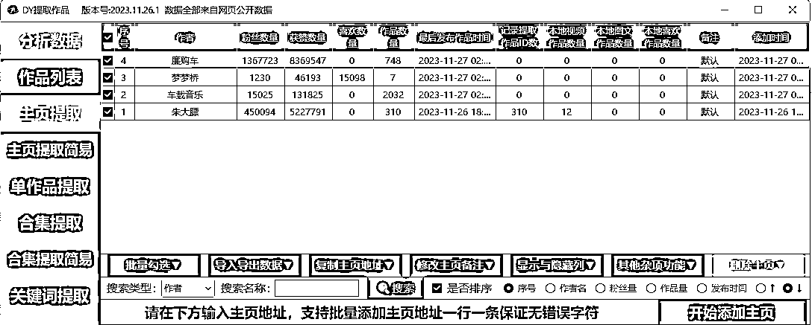

### 列表右键功能

当你在主页列表随便一个作者主页一行，鼠标右键，会弹出菜单，这里有单独作者主页的功能。

#### 向上移动：

当点击后选择的作者会自动上升一位。

#### 向下移动：

当点击后选择的作者会自动下降一位。

#### 清零记录提取作品数量：

是记录作品ID的数量，清空后归零，他和主页提取的未记录作品ID相关。

#### 复制全部记录作品ID：

就是已经记录的当前作者你所提取到的作品ID，如果清零了就复制不到了。

#### 打开本地数据目录：

是打开作者信息记录的文件，如果下载设置你不改变作品保存目录也在这里。

#### 复制主页地址：

是这个作者的DY主页网址，复制后在浏览器粘贴上去即可打开。

#### 复制作者昵称：

是复制作者的昵称，这个没有什么好讲的。

#### 删除当前作者主页：

是在当前列表删除这个作者，本地作者信息自动删除掉，作品数据不会删除。

#### 修改主页备注信息：

这个用于分类，因为你们每个做的领域不一样，有的人做了好几个领域，

例如：动漫，小说，沙雕动画，可以备注每个作者是哪个分类的，

用途：可以批量勾选指定备注分类的，保存作品时可以按照备注目录保存，当提取作品时，作品自动添加主页备注。

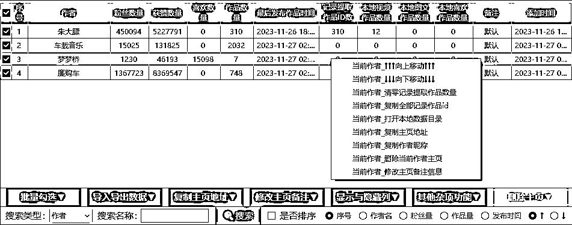

### 批量勾选▼

批量勾选按钮点击后会弹出一个菜单，选项，主页批量勾选只有备注，这就是上面说的分类批量勾选，

如果你有1000个主页 有3种分类：动漫，小说，沙雕动画，点击哪个就勾选哪个备注的全部主页。

需要注意的是：在勾选的时候不会去掉之前的勾选，请提前先去掉列表所有勾选，

点击序号两个字的签名的总选择框就会去掉全部勾选或者全部勾选。

### 导入导出数据▼

#### 导入导出的作品数据TXT：

导出的TXT数据支持导入，Excel表格数据不支持导入。

#### 导出作品列表全部数据TXT：

导出的是主页列表全部主页数据，用于大数据分析，JSON格式。

#### 导出作品列表勾选数据TXT：

导出的是主页列表勾选主页数据，用于大数据分析，JSON格式。

#### 导出列表全部数据Excel表格：

导出的是主页列表全部主页数据，用于Excel表格查看数据。

#### 导出列表勾选数据Excel表格：

导出的是主页列表勾选主页数据，用于Excel表格查看数据。

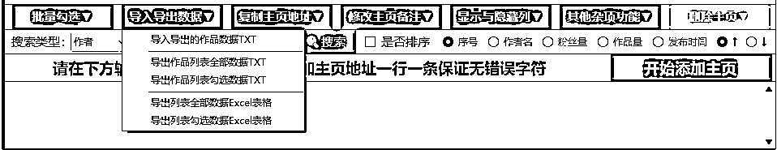

### 复制主页地址▼

#### 复制全部主页地址：

复制的是主页列表全部作者的主页网址。

#### 复制勾选主页地址：

复制的是主页列表勾选作者的主页网址。

### 修改主页备注▼

#### 修改全部主页备注：

当点击后会弹出图2，输入新的备注信息，点击确定，全部主页的备注就变成了输入的。

#### 修改勾选主页备注：

当点击后会弹出图2，输入新的备注信息，点击确定，勾选主页的备注就变成了输入的。

小提示：如果修改单个主页备注可以列表右键修改。

图1

图2

### 显示与隐藏列▼

#### 显示与隐藏列：

当你点击后弹出的菜单，是主页列表对应的 每一列，

去掉前面的勾选，这个列就隐藏。

勾选前面的勾选，这个列就显示。

用途：减少不需要显示的列，显示你需要的数据。

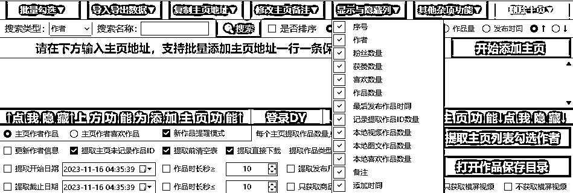

### 其他杂项功能▼

#### 重新加载本地文档,作者信息与作品数量：

有的时候你删除了某个作品，列表不会自动刷新，你可以点击这个按钮。

#### 网络更新列表信息对比报告：

点击后软件自动去更新作者信息，并不是去提取作品，然后会出现新数据与老数据对比报告。

#### 打开作者对比报告：

如果存在新旧报告，会展示出来供你参考。

#### 清零全部记录提取作品ID数量：

这个是列表全部主页作者清空记录提取作品ID。

#### 清零勾选记录提取作品ID数量：

这个是列表勾选主页作者清空记录提取作品ID。

### 删除主页▼

### 删除全部主页：

这个用途是删除主页列表全部作者数据，和本地保存的作者信息，不会删除作品数据。

### 删除勾选主页：

这个用途是删除主页列表勾选作者数据，和本地保存的作者信息，不会删除作品数据。

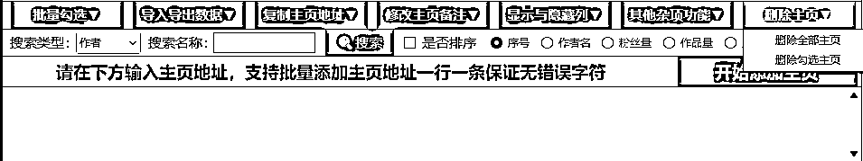

### 搜索类型与搜索名称

### 搜索作者：

当你输入搜索名称后，点击搜索按钮，软件自动寻找你搜索的作者名称模糊搜索。

### 搜索备注：

当你输入搜索名称后，点击搜索按钮，软件自动寻找你搜索的备注名称模糊搜索。

### 搜索作者与搜索备注都是模糊搜索：

举例：列表有江湖数据工具箱的作者或备注，输入江湖两字即可搜索到，搜索到的自动拉篮勾选。

### 排序列表

当勾选是否排序，根据你所选择的，自动排序，

左右面箭头：

↑代表从小到大的顺序(升序)

↓代表从大到小的顺序(降序)

## 2.隐藏显示添加主页 与 登录DY 与 隐藏显示提取主页

下图三个红色框框是按钮

最左边是隐藏添加主页功能，可以自己点击尝试，用途：不需要用的时候隐藏上看列表看的更多。

中间的按钮登录DY，点击后会弹出软件内置浏览器，自动打开DY官网，

你扫码登录后，等待几秒会自动弹出登录成功。

最右边是隐藏提取主页功能，可以自己点击尝试，用途：不需要用的时候隐藏上看列表看的更多。

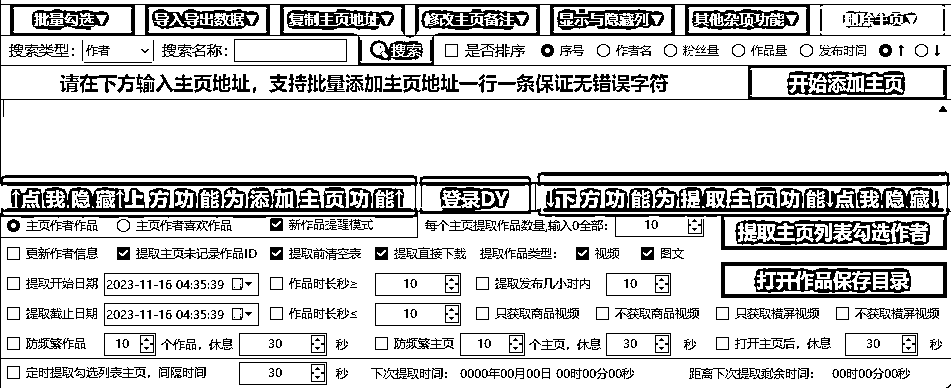

## 3.主页提取作品数据

### 主页提取教程视频

提取主页作品最为关键的如果你不登录，可能获取不到全部作品，上图的按钮点击后进入网页扫码登录，

注意必须是软件内的浏览器登录才可以。

### 主页作者喜欢作品

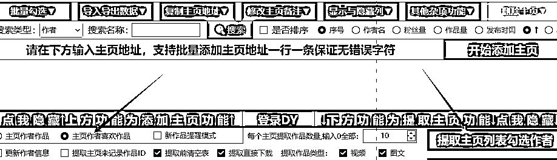

如果你添加的作者，他的喜欢作品是公开的，可以获取，不是公开的无法获取到，

勾选上图这个单选框，点击开始提取就可以获取了，操作方式和主页作品提取方式一样。

### 新作品提醒模式

当勾选新作品提醒模式，

软件自动勾选主页作者作品与提取主页未记录作品id,你可以勾选，提取直接下载，提取作品类型，为条件，

定时间隔时间为例如有10个主页循环完休息多少秒，

然后再勾选定时提取勾选列表主页，就可以实现全自动新作品提醒模式了，软件不要关闭要开着才可以。

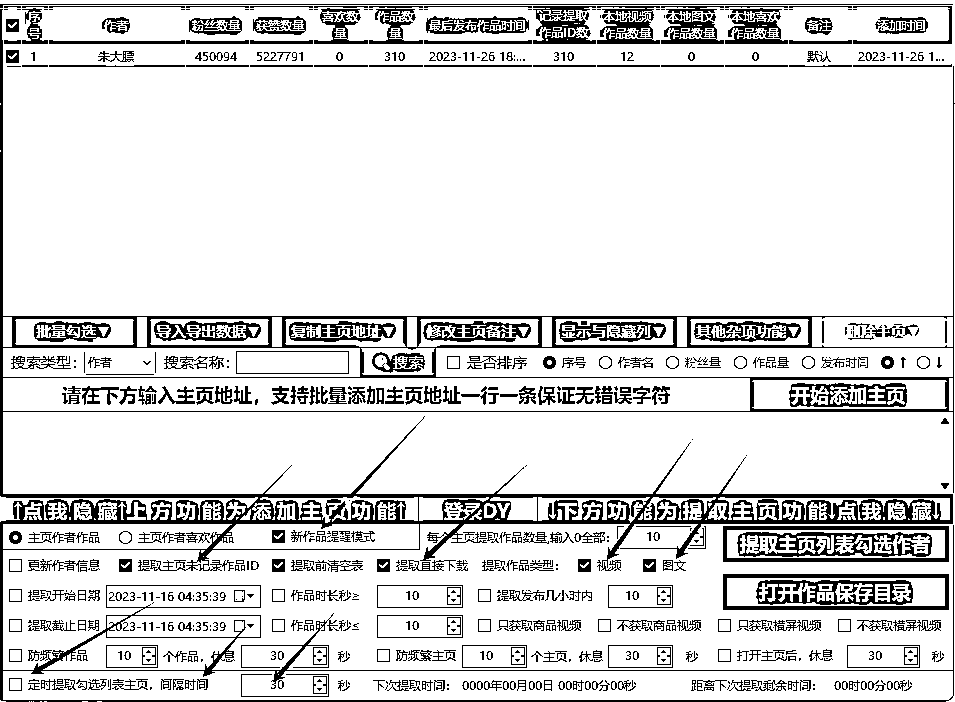

### 微信推送消息，推送新作品发布消息

在软件设置，新作品消息推送微信设置里，最下方有教程，你可以根据教程设置微信Webhook地址。

设置完成后，最好点击发送测试消息，看看是否能正常推送消息，如果能正常推送即可。

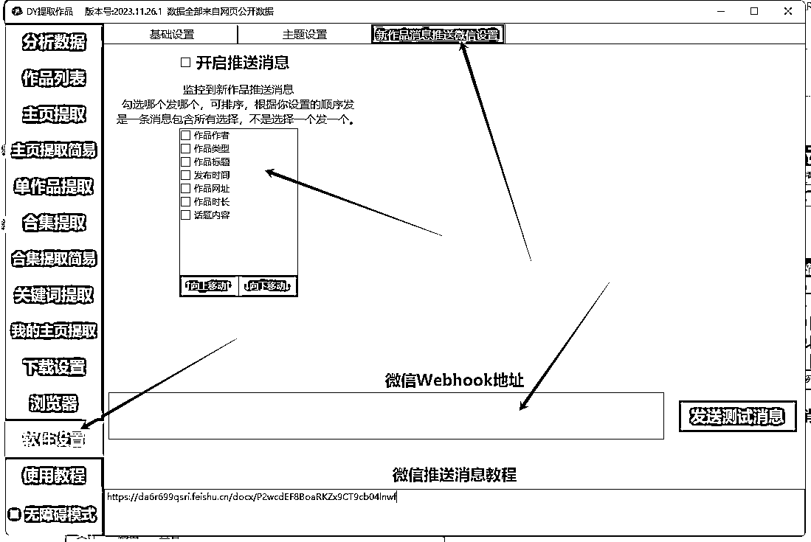

### 主页提取筛选条件与其他功能讲解。

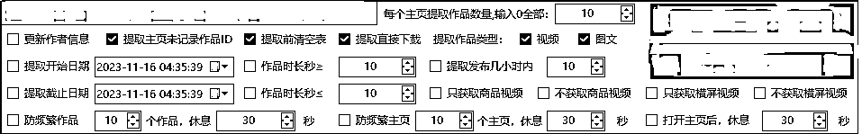

#### 提取作品数据数量

每个主页提取作品数量，输入0为全部，如果你设置10，那么每个主页只提取前10个作品，这10个作品就是他主页最新或者带置顶的作品。

例如：你的主页列表有10个主页全部勾选了，然后设置的10，那么这10个主页每个主页提取10个作品。

#### 更新作者信息

勾选后每次提取主页数据的时候，主页列表的数据会跟着实时更新。

#### 提取主页未记录作品ID

勾选后，只提取未被记录下来的作品ID

例如 ：

第一次提取的时候提取了全部作品，已经记录了全部ID

第二次提取的时候，之前被记录的作品ID不会被提取到，

用途：方便记录每次提取，只提取你没有记录的作品ID的作品。

#### 提取前清空表

提取前清空表，是指当你点击开始提取，软件自动将作品列表的全部数据清空，只记录本次提取的作品数据。

#### 提取直接下载

提取直接下载在勾选后，当你开始提取，自动跟随下载，不勾选不会下载。

#### 提取作品类型

当勾选视频与图文的选择框后，开始提取就会提取到视频与图文，

去掉视频勾选，只勾选图文只提取图文作品。

去掉图文勾选，只勾选视频只提取视频作品。

软件自动保留互补，不会出现一个不选的情况。

例如你把视频去掉了，又把图文去掉了，自动勾选视频，自动补一个，防止没有能达标的条件。

#### 提取开始日期 与 提取截止日期

提取开始日期是指，作品发布日期的最早时间

提取截止日期是指，作品发布日期的最晚时间

这两个选项，可以同时勾选，可以单独勾选。

举例： 同时勾选

设置开始日期：2023年8月8日08:08:08

设置截止日期：2023年9月9日09:09:09

达标作品只有在2023年8月8日08时08分08秒之后发布的作品才算达标这一项，精确到秒，

达标作品只有在2023年9月9日09时09分09秒之前发布的作品才算达标这一项，精确到秒，

以上这两个条件同时达标才算达标的作品。

没有达标作品发布日期2023年8月8日08时08分07秒。

达标作品发布日期2023年8月8日08时08分09秒。

达标作品发布日期2023年9月9日09时09分08秒。

没有达标作品发布日期2023年9月9日09时09分10秒。

举例： 只勾选开始日期

开始日期：2023年8月8日08:08:08

达标作品只有在2023年8月8日08时08分08秒之后发布的作品才算达标这一项，精确到秒，

当满足开始日期的条件就算达标。

没有达标作品发布日期2023年8月8日08时08分07秒。

达标作品发布日期2023年8月8日08时08分09秒。

举例： 只勾选截止日期

设置截止日期：2023年9月9日09:09:09

达标作品只有在2023年9月9日09时09分09秒之前发布的作品才算达标这一项，精确到秒，

当满足截止日期的条件就算达标。

达标作品发布日期2023年9月9日09时09分08秒。

没有达标作品发布日期2023年9月9日09时09分10秒。

#### 作品时长秒≥≤

作品时长秒≥ 全名称：作品时长秒大于等于【？】秒

作品时长秒≤ 全名称：作品时长秒小于等于【？】秒

这个筛选条件用途：只筛选视频作品的作品时间，不会筛选图片，图片直接达标。

#### 提取发布几小时内

例如上图如果勾选的情况下，现在开始提取的时间是上午11点整，

只有当前时间凌晨1点整以后发布的作品时间才算达标。

#### 只获取商品视频 与 不获取商品视频

勾选只获取商品视频，除了商品视频，不带商品【购物车】的作品都不算达标。

勾选不获取商品视频，作品是商品视频，都不算达标。

#### 只获取横屏视频 与 不获取横屏视频

勾选只获取横屏视频，除了横屏视频，不是横屏视频的作品都不算达标。

勾选不获取横屏视频，作品是横屏视频，都不算达标。

#### 防频繁作品N个作品，休息N秒

当勾选后，在提取过程中，按照上图设置来讲，

每提取10个作品，软件自动休息30秒，然后继续提取，以此类推。。。

用途：有的时候会出现频繁访问的事情，这样会减少频繁，尤其定时提取。

#### 防频繁主页N个主页，休息N秒

当勾选后，在提取过程中，按照上图设置来讲，

每提取10个主页，软件自动休息30秒，然后继续提取，以此类推。。。

用途：有的时候会出现频繁访问的事情，这样会减少频繁，尤其定时提取。

#### 打开主页后，休息N秒

当勾选后，在提取过程中，按照上图设置来讲，

当软件自动打开浏览器访问主页的时候，开始休息30秒软件不会有任何操作，

这个功能用途你可以在软件的浏览器上修改发布日期，请看下图：

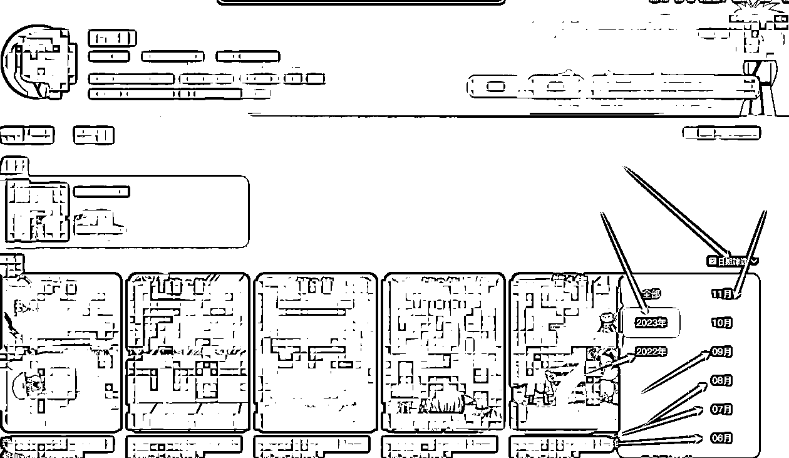

#### 定时提取勾选列表主页

勾选这个选项后，然后定时自动点击开始提取按钮，方便你获取最新作品数据。

间隔时间是指，当开始定时后，软件内部自动计时，

也会显示在上面下次提取时间与距离下次提取剩余时间。

需要注意的是，列表没有勾选，开启定时提取是没效果的。

* * *

# 主页简易提取数据教程【新手推荐】

这个是提取主页简易版本，不需要添加主页，将主页地址一行一条放入文本框，

点击开始提取主页作品就可以，没有任何筛选条件，适合小白刚使用软件。

提取完成后，作品数据会自动进入作品列表，请到作品列表查看。

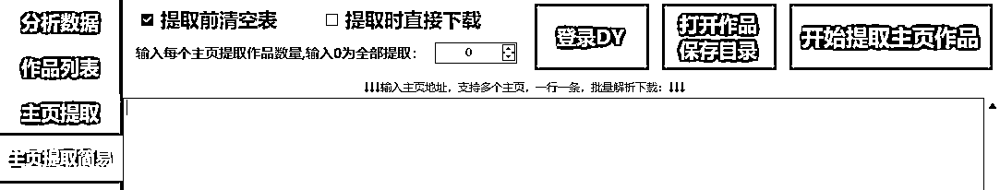

* * *

# 单作品提取数据教程

## 1.单作品提取数据教程

### 提取单作品数据

在文本框输入你准备好的作品地址，一行一条，然后点击开始提取作品即可。

提取完成后，作品数据会自动进入作品列表，请到作品列表查看。

## 2.单作品提取数据功能讲解：

### 单作品提取数据功能讲解：

### 提取前清空表：

是指当你点击开始提取，软件自动将作品列表的全部数据清空，只记录本次提取的作品数据。

### 提取直接下载：

在勾选后，当你开始提取，自动跟随下载，不勾选不会下载。

### 只获取商品视频：

勾选只获取商品视频，除了商品视频，不带商品【购物车】的作品不算达标。

### 不获取商品视频：

勾选不获取商品视频，作品是商品视频，都不算达标。

### 只获取横屏视频：

勾选只获取横屏视频，除了横屏视频，不是横屏视频的作品不算达标。

### 不获取横屏视频：

勾选不获取横屏视频，作品是横屏视频，都不算达标。

### 作品时长秒≥≤

作品时长秒≥ 全名称：作品时长秒大于等于【？】秒

作品时长秒≤ 全名称：作品时长秒小于等于【？】秒

这个筛选条件用途：只筛选视频作品的作品时间，不会筛选图片，图片直接达标。

### 防频繁作品N个作品，休息N秒

当勾选后，在提取过程中，按照上图设置来讲，

每提取10个作品，软件自动休息30秒，然后继续提取，以此类推。。。

用途：有的时候会出现频繁访问的事情，这样会减少频繁，尤其定时提取。

* * *

# 合集提取数据教程

## 1.添加合集地址

### 电脑端网页获取合集作品地址方式

首先在浏览器打开DY官网，找到你需要获取数据的合集作品然后再浏览器地址栏复制网址即可

提示：合集中任意一个作品地址即可，软件自动找到合集主页。

下图演示：按照图顺序看，

图1是作品地址，必须找到带合集的作品。

图2将浏览器地址栏的所有字符复制即可，这个就是主页地址。

关于地址怎么发送到电脑端，你可以在电脑登录微信，

手机发送到微信的文件传输助手，电脑端微信文件传输助手就可以同步消息。

图1：

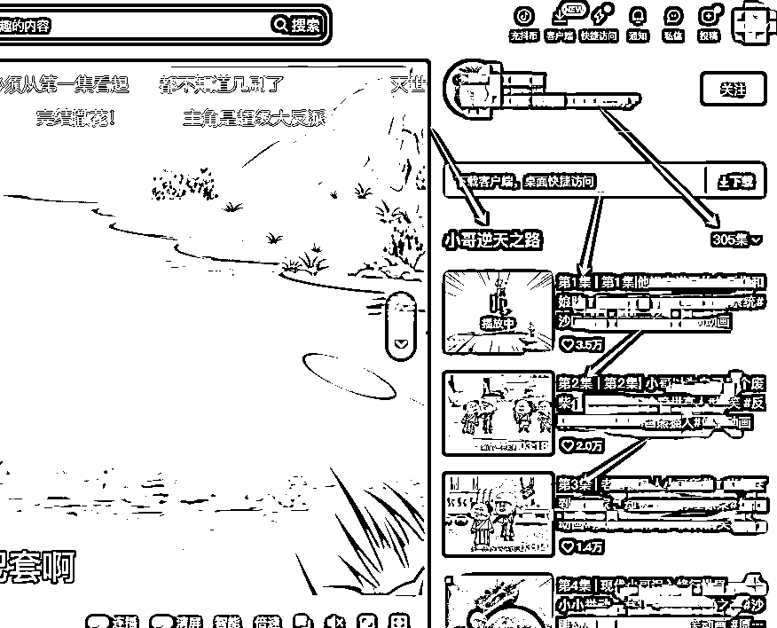

图2：

### 手机端获取合集作品地址方式

打开DY APP 找到你要提取合集作品，按照下方图片顺序操作：

图1：在作品点击分享按钮，会弹出下拉框。

图2：在下拉框点击复制链接即可。

关于地址怎么发送到电脑端，你可以在电脑登录微信，

手机发送到微信的文件传输助手，电脑端微信文件传输助手就可以同步消息。

图1：

图2：

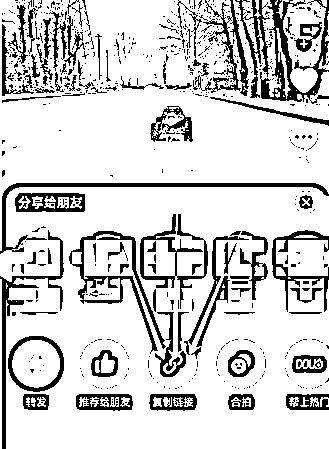

### 添加合集地址到合集列表

#### 图1：

将自己复制到的作品带合集的地址，放入文本框，点击开始添加合集主页。

图1：

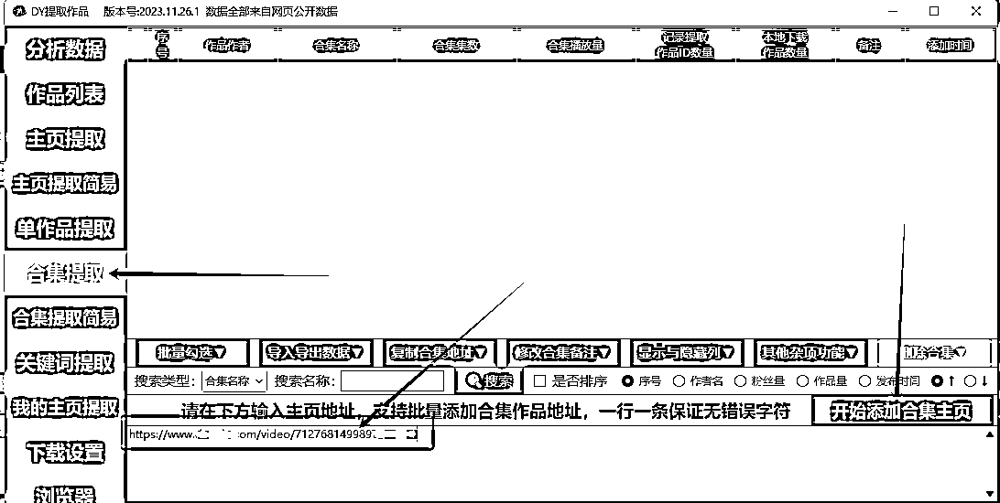

#### 图2：添加成功

点击开始添加合集主页后，等待几秒会弹出添加合集主页结果，图2为添加成功。

#### 图3：合集主页列表已经存在这个合集

点击开始添加合集主页后，等待几秒会弹出添加合集主页结果，图3为列表存在地址。

#### 图4：添加失败与超时地址

点击开始添加合集主页后，等待几秒会弹出添加合集主页结果，图4为添加失败与超时，

这种情况下要检查自己输入的地址是不是正确的，如果是正确的再次进行添加。

图2：

图3：

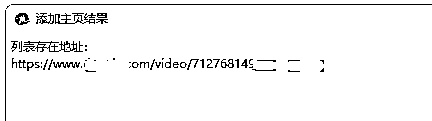

图4：

### 表内数据

#### 选择框：

用于提取，删除，修改之类的操作，

最顶部的选择框，是操作列表列的全部选择框用途，可全选，选不选。

#### 序号：

是根据你的添加顺序自动生成，

#### 合集信息数据：

全部来自网页公开数据，这里不讲解。

#### 本地下载作品数量 ：

是你提取下载的数据，识别方式，是根据你设置的目录，只要目录你在开始使用软件不去变更，作品数据不删除，他都会记录在内，例如你保存了10个作品，目录没有变，删除了其中一个作品，然后每次打开自动取寻找这个标题的作品是否存在，如果存在就自增1，你删除的那一个没有找到，最后显示的是本地存在9个作品。

#### 备注：

添加合集主页后，自动显示默认，你可以手动修改，右键修改 或者 批量修改。

#### 添加时间：

添加主页后自动生成当前添加时间，以你本地电脑时间为准，不是网络时间。

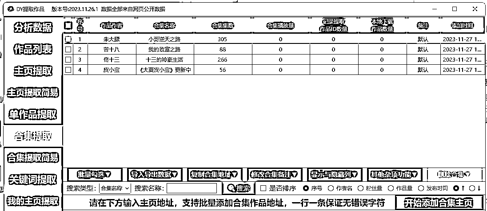

### 列表右键功能

当你在主页列表随便一个作者主页一行，鼠标右键，会弹出菜单，这里有单独合集主页的功能。

#### 复制全部记录作品ID：

就是已经记录的当前作者你所提取到的作品ID，如果清零了就复制不到了。

#### 清零记录提取作品数量：

是记录作品ID的数量，清空后归零，他和合集提取的未记录作品ID相关。

#### 复制主页地址：

是这个作品的合集主页网址，复制后在浏览器粘贴上去即可打开。

#### 删除合集主页：

是在当前列表删除这个合集主页，本地合集主页信息自动删除掉，作品数据不会删除。

#### 修改合集备注信息：

这个用于分类，因为你们每个做的领域不一样，有的人做了好几个领域，

例如：动漫，小说，沙雕动画，可以备注每个作者是哪个分类的，

用途：可以批量勾选指定备注分类的，保存作品时可以按照备注目录保存，当提取作品时，作品自动添加合集备注。

### 批量勾选▼

批量勾选按钮点击后会弹出一个菜单，选项，合集批量勾选只有备注，这就是上面说的分类批量勾选，

如果你有1000个合集主页 有3种分类：动漫，小说，沙雕动画，点击哪个就勾选哪个备注的全部合集。

需要注意的是：在勾选的时候不会去掉之前的勾选，请提前先去掉列表所有勾选，

点击序号两个字的签名的总选择框就会去掉全部勾选或者全部勾选。

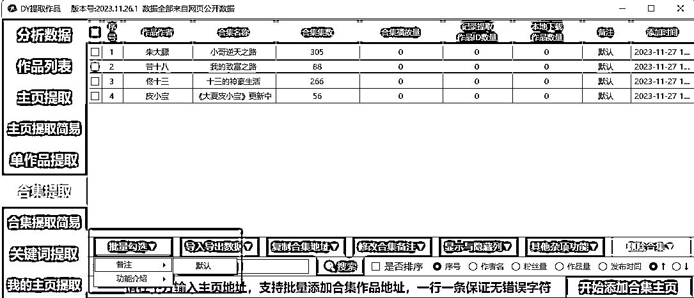

### 导入导出数据▼

#### 导入导出的作品数据TXT：

导出的TXT数据支持导入，Excel表格数据不支持导入。

#### 导出作品列表全部数据TXT：

导出的是合集列表全部合集数据，用于大数据分析，JSON格式。

#### 导出作品列表勾选数据TXT：

导出的是合集列表勾选合集数据，用于大数据分析，JSON格式。

#### 导出列表全部数据Excel表格：

导出的是合集列表全部合集数据，用于Excel表格查看数据。

#### 导出列表勾选数据Excel表格：

导出的是合集列表勾选合集数据，用于Excel表格查看数据。

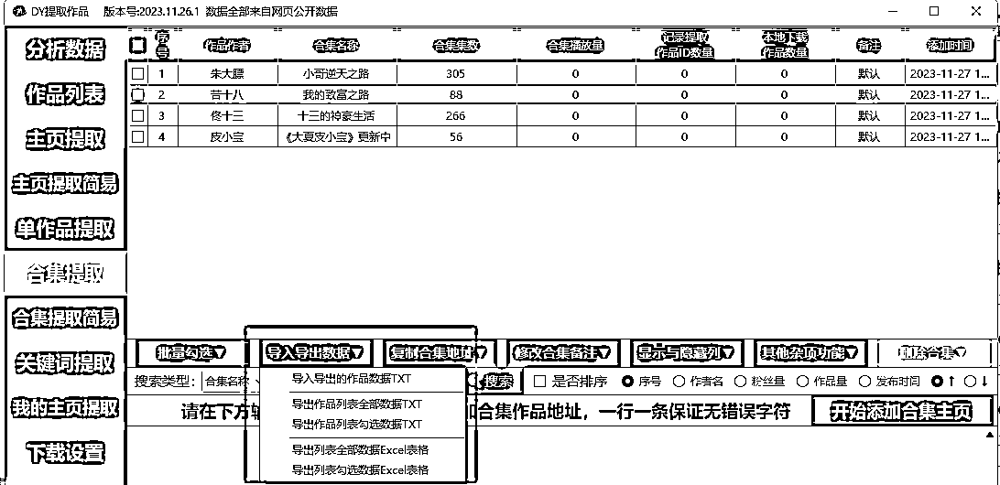

### 复制合集地址▼

#### 复制全部合集地址：

复制的是合集列表全部合集的合集主页网址。

#### 复制勾选合集地址：

复制的是合集列表勾选合集的合集主页网址。

### 修改合集备注▼

#### 修改全部合集主页备注：

当点击后会弹出图2，输入新的备注信息，点击确定，全部合集的备注就变成了输入的。

#### 修改勾选合集主页备注：

当点击后会弹出图2，输入新的备注信息，点击确定，勾选合集的备注就变成了输入的。

小提示：如果修改单个合集备注可以列表右键修改。

图1

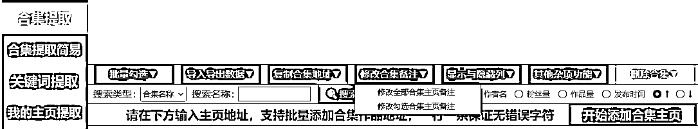

图2

### 显示与隐藏列▼

#### 显示与隐藏列：

当你点击后弹出的菜单，是合集主页列表对应的 每一列，

去掉前面的勾选，这个列就隐藏。

勾选前面的勾选，这个列就显示。

用途：减少不需要显示的列，显示你需要的数据。

### 其他杂项功能▼

#### 重新加载本地文档,合集作者信息与作品数量：

有的时候你删除了某个作品，列表不会自动刷新，你可以点击这个按钮。

#### 清零全部记录提取作品ID数量：

这个是列表全部合集主页清空记录提取作品ID。

#### 清零勾选记录提取作品ID数量：

这个是列表勾选合集主页清空记录提取作品ID。

### 删除合集▼

### 删除全部合集主页：

这个用途是删除合集列表全部合集数据，和本地保存的合集信息，不会删除作品数据。

### 删除勾选合集主页：

这个用途是删除合集列表勾选合集数据，和本地保存的合集信息，不会删除作品数据。

* * *

### 搜索类型与搜索名称

### 搜索合集名称：

当你输入搜索名称后，点击搜索按钮，软件自动寻找你搜索的合集名称模糊搜索。

### 搜索作者：

当你输入搜索名称后，点击搜索按钮，软件自动寻找你搜索的作者名称模糊搜索。

### 搜索备注：

当你输入搜索名称后，点击搜索按钮，软件自动寻找你搜索的备注名称模糊搜索。

### 搜索合集名称 或 作者 或 搜索备注都是模糊搜索：

举例：列表有江湖数据工具箱的合集名称或作者或备注，输入江湖两字即可搜索到，搜索到的自动拉篮勾选。

### 排序列表

当勾选是否排序，根据你所选择的，自动排序，

左右面箭头：

↑代表从小到大的顺序(升序)

↓代表从大到小的顺序(降序)

## 2.隐藏显示添加合集 与 登录DY 与 隐藏显示提取合集

下图三个红色框框是按钮

最左边是隐藏添加合集功能，可以自己点击尝试，用途：不需要用的时候隐藏上看列表看的更多。

中间的按钮登录DY，点击后会弹出软件内置浏览器，自动打开DY官网，

你扫码登录后，等待几秒会自动弹出登录成功。

最右边是隐藏提取合集功能，可以自己点击尝试，用途：不需要用的时候隐藏上看列表看的更多。

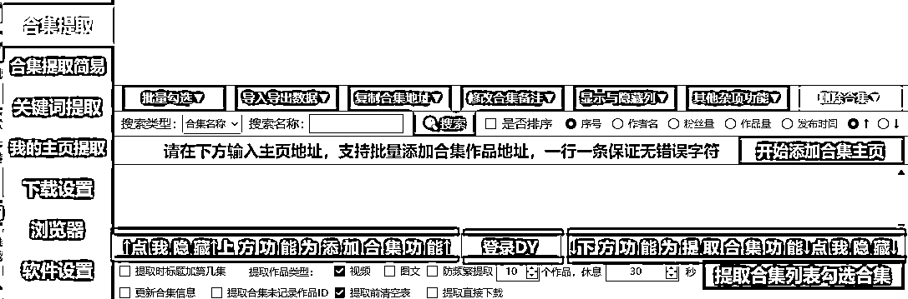

## 3.合集提取作品数据

### 合集提取教程

#### 图1：

在合集列表勾选要提取的合集，在点击提取合集列表勾选合集，此时软件已经开始提取。

#### 图2：

开始提取后，软件下方会出现当前提取进度，获取到作品数量，与达标作品数量，达标作品数量为最终进入作品列表的数据，如果出现不一致，说明你勾选了筛选条件达标的只有这些。

#### 图3：

看弹出的提取结果达标作品56个，合集信息显示的集数也是56代表全部提取到，也全部记录了，如果下次你提取勾选提取合集未记录作品ID，记录的不会提取到。

图1：

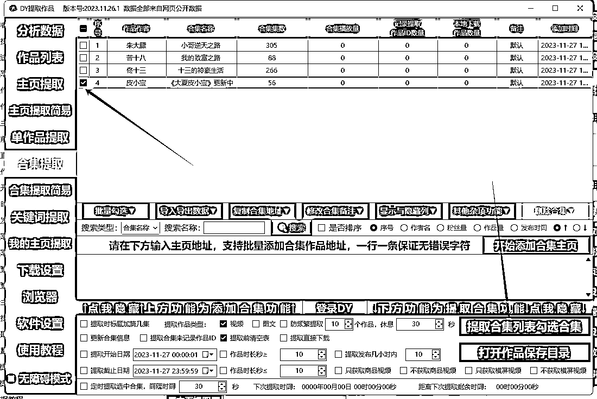

图2：

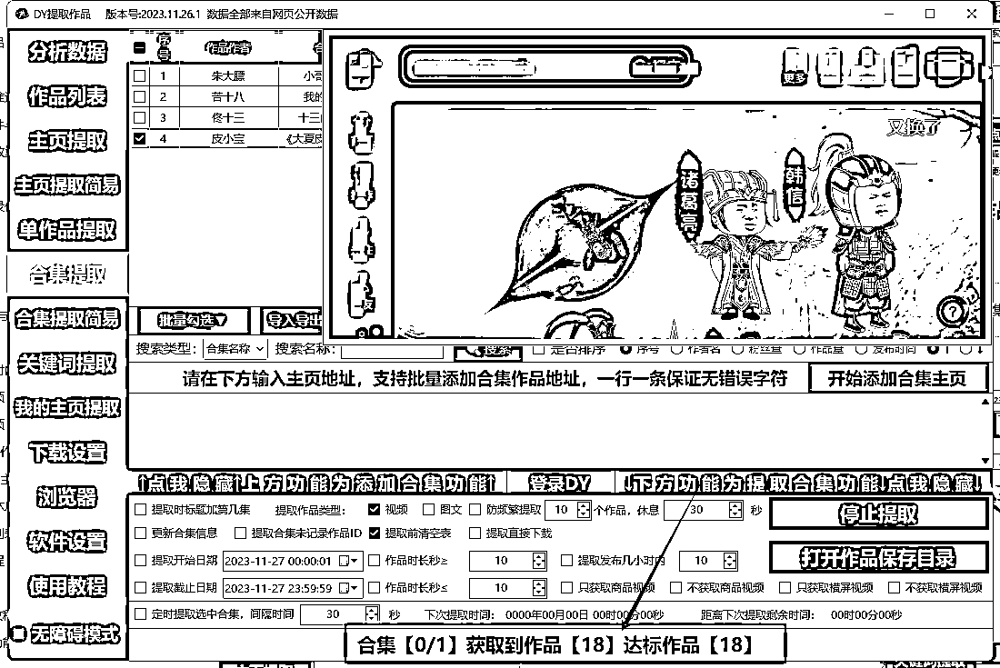

图3：

### 合集提取筛选条件与其他功能讲解。

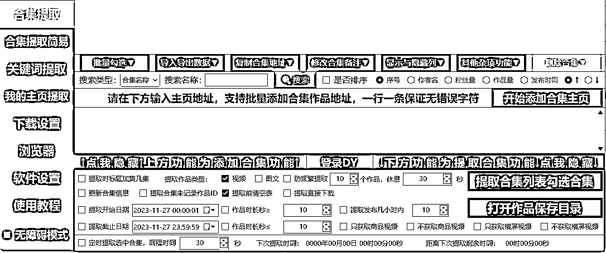

#### 提取时标题加第几集

勾选后自动在作品标题增加集数。

#### 提取作品类型

当勾选视频与图文的选择框后，开始提取就会提取到视频与图文，

去掉视频勾选，只勾选图文只提取图文作品。

去掉图文勾选，只勾选视频只提取视频作品。

软件自动保留互补，不会出现一个不选的情况。

例如你把视频去掉了，又把图文去掉了，自动勾选视频，自动补一个，防止没有能达标的条件。

#### 防频繁作品N个作品，休息N秒

当勾选后，在提取过程中，按照上图设置来讲，

每提取10个作品，软件自动休息30秒，然后继续提取，以此类推。。。

用途：有的时候会出现频繁访问的事情，这样会减少频繁，尤其定时提取。

#### 更新合集信息

勾选后每次提取合集数据的时候，合集列表的数据会跟着实时更新。

#### 提取合集未记录作品ID

勾选后，只提取未被记录下来的作品ID

例如 ：

第一次提取的时候提取了全部作品，已经记录了全部ID

第二次提取的时候，之前被记录的作品ID不会被提取到，

用途：方便记录每次提取，只提取你没有记录的作品ID的作品。

#### 提取前清空表

提取前清空表，是指当你点击开始提取，软件自动将作品列表的全部数据清空，只记录本次提取的作品数据。

#### 提取直接下载

提取直接下载在勾选后，当你开始提取，自动跟随下载，不勾选不会下载。

#### 提取开始日期 与 提取截止日期

提取开始日期是指，作品发布日期的最早时间

提取截止日期是指，作品发布日期的最晚时间

这两个选项，可以同时勾选，可以单独勾选。

举例： 同时勾选

设置开始日期：2023年8月8日08:08:08

设置截止日期：2023年9月9日09:09:09

达标作品只有在2023年8月8日08时08分08秒之后发布的作品才算达标这一项，精确到秒，

达标作品只有在2023年9月9日09时09分09秒之前发布的作品才算达标这一项，精确到秒，

以上这两个条件同时达标才算达标的作品。

没有达标作品发布日期2023年8月8日08时08分07秒。

达标作品发布日期2023年8月8日08时08分09秒。

达标作品发布日期2023年9月9日09时09分08秒。

没有达标作品发布日期2023年9月9日09时09分10秒。

举例： 只勾选开始日期

开始日期：2023年8月8日08:08:08

达标作品只有在2023年8月8日08时08分08秒之后发布的作品才算达标这一项，精确到秒，

当满足开始日期的条件就算达标。

没有达标作品发布日期2023年8月8日08时08分07秒。

达标作品发布日期2023年8月8日08时08分09秒。

举例： 只勾选截止日期

设置截止日期：2023年9月9日09:09:09

达标作品只有在2023年9月9日09时09分09秒之前发布的作品才算达标这一项，精确到秒，

当满足截止日期的条件就算达标。

达标作品发布日期2023年9月9日09时09分08秒。

没有达标作品发布日期2023年9月9日09时09分10秒。

#### 作品时长秒≥≤

作品时长秒≥ 全名称：作品时长秒大于等于【？】秒

作品时长秒≤ 全名称：作品时长秒小于等于【？】秒

这个筛选条件用途：只筛选视频作品的作品时间，不会筛选图片，图片直接达标。

#### 提取发布几小时内

例如上图如果勾选的情况下，现在开始提取的时间是上午11点整，

只有当前时间凌晨1点整以后发布的作品时间才算达标。

#### 只获取商品视频 与 不获取商品视频

勾选只获取商品视频，除了商品视频，不带商品【购物车】的作品都不算达标。

勾选不获取商品视频，作品是商品视频，都不算达标。

#### 只获取横屏视频 与 不获取横屏视频

勾选只获取横屏视频，除了横屏视频，不是横屏视频的作品都不算达标。

勾选不获取横屏视频，作品是横屏视频，都不算达标。

#### 定时提取勾选列表合集

勾选这个选项后，然后定时自动点击开始提取按钮，方便你获取最新作品数据。

间隔时间是指，当开始定时后，软件内部自动计时，

也会显示在上面下次提取时间与距离下次提取剩余时间。

需要注意的是，列表没有勾选，开启定时提取是没效果的。

* * *

# 合集简易提取数据教程【新手推荐】

这个是提取合集简易版本，不需要添加合集，将带合集的作品地址一行一条放入文本框，

点击开始提取个护作品就可以，没有任何筛选条件，适合小白刚使用软件。

提取完成后，作品数据会自动进入作品列表，请到作品列表查看。

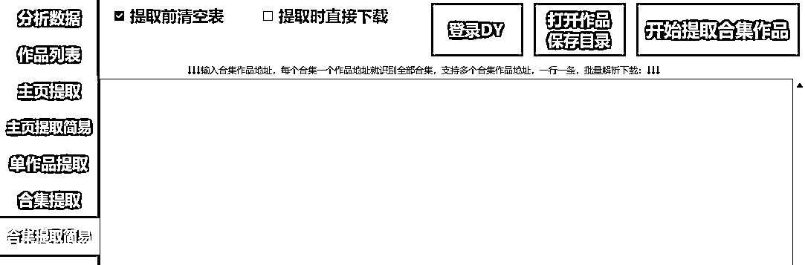

* * *

# 关键词提取数据教程

## 关键词提取数据教程

在左侧文本框内输入你要搜索的关键词，一行一条，然后设置好自己需要筛选的条件，如果不筛选直接点击开始提取关键词按钮，软件就会开始提取。

#### 特别需要注意：DY官网要求必须登录才有多个作品数据，请点击登录DY扫码登录。

## 关键词提取筛选条件讲解。

#### 提取作品数据数量

每个关键词提取作品数量，输入0为全部，官网给多少提取多少，如果你设置10，那么每个关键词只提取前10个作品，这10个作品不一定是这个关键词最新作品，需要设置网页选择排序。

例如：你输入10个关键词，然后设置的10，那么这10个关键词每个关键词提取10个作品。

#### 提取作品类型

当勾选视频与图文的选择框后，开始提取就会提取到视频与图文，

去掉视频勾选，只勾选图文只提取图文作品。

去掉图文勾选，只勾选视频只提取视频作品。

软件自动保留互补，不会出现一个不选的情况。

例如你把视频去掉了，又把图文去掉了，自动勾选视频，自动补一个，防止没有能达标的条件。

#### 提取前清空表

提取前清空表，是指当你点击开始提取，软件自动将作品列表的全部数据清空，只记录本次提取的作品数据。

#### 提取直接下载

提取直接下载在勾选后，当你开始提取，自动跟随下载，不勾选不会下载。

#### 提取发布几小时内

例如上图如果勾选的情况下，现在开始提取的时间是上午11点整，

只有当前时间凌晨1点整以后发布的作品时间才算达标。

#### 只获取商品视频 与 不获取商品视频

勾选只获取商品视频，除了商品视频，不带商品【购物车】的作品都不算达标。

勾选不获取商品视频，作品是商品视频，都不算达标。

#### 只获取横屏视频 与 不获取横屏视频

勾选只获取横屏视频，除了横屏视频，不是横屏视频的作品都不算达标。

勾选不获取横屏视频，作品是横屏视频，都不算达标。

#### 提取开始日期 与 提取截止日期

提取开始日期是指，作品发布日期的最早时间

提取截止日期是指，作品发布日期的最晚时间

这两个选项，可以同时勾选，可以单独勾选。

举例： 同时勾选

设置开始日期：2023年8月8日08:08:08

设置截止日期：2023年9月9日09:09:09

达标作品只有在2023年8月8日08时08分08秒之后发布的作品才算达标这一项，精确到秒，

达标作品只有在2023年9月9日09时09分09秒之前发布的作品才算达标这一项，精确到秒，

以上这两个条件同时达标才算达标的作品。

没有达标作品发布日期2023年8月8日08时08分07秒。

达标作品发布日期2023年8月8日08时08分09秒。

达标作品发布日期2023年9月9日09时09分08秒。

没有达标作品发布日期2023年9月9日09时09分10秒。

举例： 只勾选开始日期

开始日期：2023年8月8日08:08:08

达标作品只有在2023年8月8日08时08分08秒之后发布的作品才算达标这一项，精确到秒，

当满足开始日期的条件就算达标。

没有达标作品发布日期2023年8月8日08时08分07秒。

达标作品发布日期2023年8月8日08时08分09秒。

举例： 只勾选截止日期

设置截止日期：2023年9月9日09:09:09

达标作品只有在2023年9月9日09时09分09秒之前发布的作品才算达标这一项，精确到秒，

当满足截止日期的条件就算达标。

达标作品发布日期2023年9月9日09时09分08秒。

没有达标作品发布日期2023年9月9日09时09分10秒。

#### 作品时长秒≥≤

作品时长秒≥ 全名称：作品时长秒大于等于【？】秒

作品时长秒≤ 全名称：作品时长秒小于等于【？】秒

这个筛选条件用途：只筛选视频作品的作品时间，不会筛选图片，图片直接达标。

#### 防频繁作品N个作品，休息N秒

当勾选后，在提取过程中，按照上图设置来讲，

每提取10个作品，软件自动休息30秒，然后继续提取，以此类推。。。

用途：有的时候会出现频繁访问的事情，这样会减少频繁，尤其定时提取。

#### 网页选择排序依据

网页选择排序依据，是你选择某一项后，软件运行时自动在网页选择排序类型。

具体可以打开关键词网页自己看看。

#### 网页选择发布时间

网页选择发布时间，是你选择某一项后，软件运行时自动在网页选择你设置的发布时间。

具体可以打开关键词网页自己看看。

#### 定时提取关键词

勾选这个选项后，然后定时自动点击开始提取按钮，方便你获取最新作品数据。

间隔时间是指，当开始定时后，软件内部自动计时，

也会显示在上面下次提取时间与距离下次提取剩余时间。

需要注意的是，没有关键词，开启定时提取是没效果的。

* * *

# 话题提取教程

1.获取话题网址

* * *

# 我的主页提取数据教程

## 我的关注主页地址提取

### 步骤1：

先点击登录DY，不登录软件无法获取到你的主页信息。

### 步骤2：

点击开始提取我的关注作者主页地址，过了N秒后提取完成后，你关注的主页地址会展示在文本框内。

### 图2：

开始提取时软件状态，图中已经提取到自己关注的100个作者地址。

### 图3：

提取完会弹出提取结果，提取结果获取到128条作者地址，正好我的关注也是128条，完全正确。

图1：

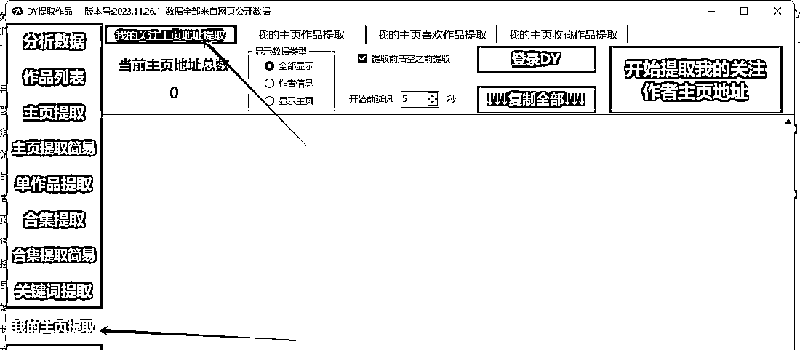

图2：

图3：

## 我的主页作品提取

### 步骤1：

先点击登录DY，不登录软件无法获取到你的主页信息。

### 步骤2：

点击开始提取我的作品，过了N秒后提取完成后，你的作品会添加到作品列表内。

### 图2：

开始提取时软件状态，因为我的作品比较少只有4个所以我裁图不到提取过程。

### 图3：

提取完会弹出提取结果，提取结果获取到4个作品，我的作品也是4个，完全正确。

图1：

图2：

图3：

## 我的主页喜欢作品提取

### 步骤1：

先点击登录DY，不登录软件无法获取到你的主页信息。

### 步骤2：

点击开始提取我的作品，过了N秒后提取完成后，你的喜欢作品会添加到作品列表内。

### 图2：

开始提取时软件状态，已经提取到了52个喜欢作品。

### 图3：

提取完会弹出提取结果，提取结果获取到117个作品，我的喜欢作品也是117个，完全正确。

图1：

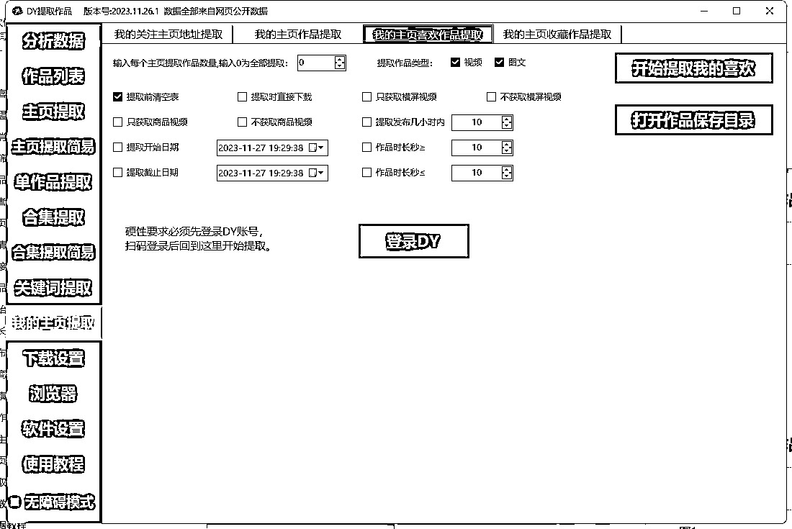

图2：

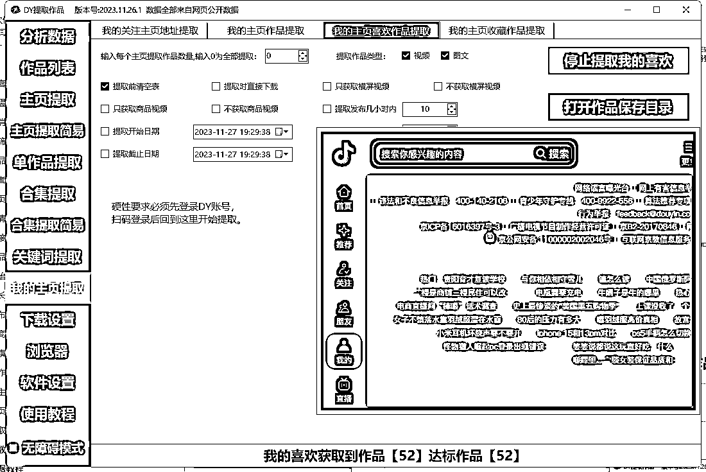

图3：

## 我的主页收藏作品提取

### 步骤1：

先点击登录DY，不登录软件无法获取到你的主页信息。

### 步骤2：

点击开始提取我的收藏，过了N秒后提取完成后，你的收藏作品会添加到作品列表内。

### 图2：

开始提取时软件状态，已经提取到了9个作品。

### 图3：

提取完会弹出提取结果，提取结果获取到15个作品，我的收藏作品也是15个，完全正确。

图1：

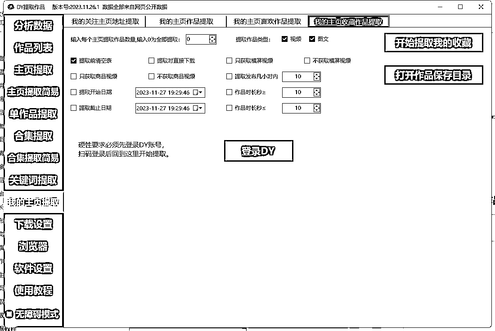

图2：

图3：

* * *

# 作品列表教程

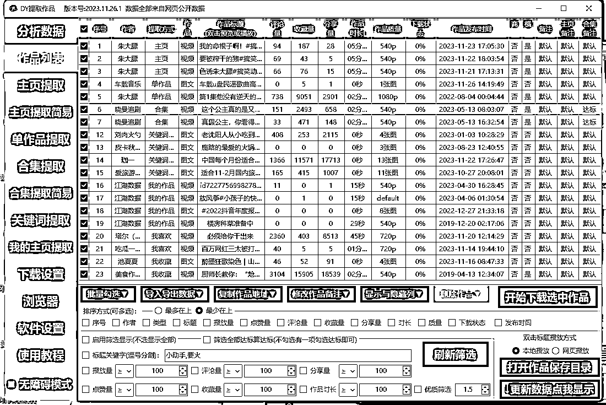

## 表内数据

#### 选择框：

用于提取，删除，修改之类的操作，

最顶部的选择框，是操作列表列的全部选择框用途，可全选，选不选。

#### 序号：

是根据你的添加顺序自动生成，

#### 提取方式：

每个提取方式加入到作品列表的作品数据，都会记录是根据哪个方式提取到的作品数据。

#### 作品类型：

只有视频与图文，显示该作品数据是什么类型的。

#### 作品数据：

全部来自网页公开数据，这里不讲解。

#### 商品：

如果这个作品是商品类型带购物车的，显示是，不是商品类型，显示否。

#### 横屏：在手机端看可点击全屏观看

如果这个作品是横屏类型的，显示是，不是横屏类型，显示否。

#### 备注：

是单独在作品列表单独给这个作品备注，也可以在下方按钮批量备注。

#### 主页备注：

是在主页提取作品数据时，如果你提取的主页做了主页备注，那么这个作品加入作品列表会自动带上主页备注。

#### 合集备注：

是在合集提取作品数据时，如果你提取的合集做了合集备注，那么这个作品加入作品列表会自动带上合集备注。

## 批量勾选▼

单击批量勾选会弹出菜单，有多种勾选方式：

### 注意：勾选不会清空当前列表所勾选。

#### 作者昵称勾选：

选择作者昵称后，软件自动展示根据你提取方式得到的作者昵称，进行分类勾选。

全部作者选择勾选，是列表全部的作者昵称，

例如这个作者昵称列表有10个作品，你选择了会全部勾选上。

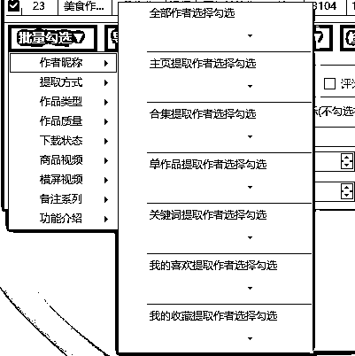

#### 提取方式勾选：

提取方式勾选，根据你选择的提取方式会全部勾选上。

这里关键词使用下拉框，如果有关键词的会展示，选择即勾选，

图中我使用了两个关键词，如果我选择了美食这个关键词，

作品立马会勾选上所有是关键词提取 关键词为美食的作品。

#### 作品类型勾选：

作品类型，只有两种：视频作品 与 图文作品，点击即可勾选全部这个类型的作品。

#### 作品质量勾选：

作品质量勾选会根据作品列表存在的质量进行显示，点击某个质量就会勾选全部这个质量的作品。

#### 下载状态勾选：

下载状态会显示列表全部的状态，可以进行点击勾选所需的。

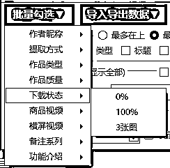

#### 商品视频勾选：

商品视频勾选，共两个选项可以根据所需进行勾选。

#### 横屏视频勾选：

横屏视频勾选，共两个选项可以根据所需进行勾选。

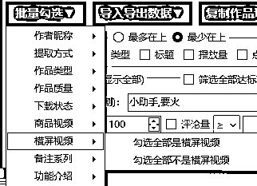

#### 备注系列勾选：

备注系列，点击下拉框可以看到指定的备注点击即可勾选指定备注作品。

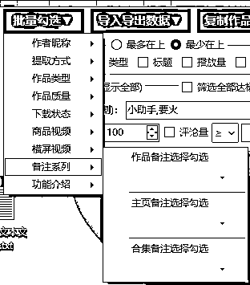

## 导入导出数据▼

#### 导入导出的作品数据TXT：

导出的TXT数据支持导入，Excel表格数据不支持导入。

#### 导出作品列表全部数据TXT：

导出的是作品列表全部作品数据，用于大数据分析，JSON格式。

#### 导出作品列表勾选数据TXT：

导出的是作品列表勾选作品数据，用于大数据分析，JSON格式。

#### 导出列表全部数据Excel表格：

导出的是作品列表全部作品数据，用于Excel表格查看数据。

#### 导出列表勾选数据Excel表格：

导出的是作品列表勾选作品数据，用于Excel表格查看数据。

## 复制作品地址▼

#### 全部复制作品地址：

复制的是作品列表全部作品网址。

#### 勾选复制作品地址：

复制的是作品列表勾选的作品网址。

#### 全部复制作品主页：

复制的是作品列表全部作品主页网址，自动去除重复主页网址，同样主页网址，只保留一个。

#### 勾选复制作品主页：

复制的是作品列表勾选的作品主页网址，自动去除重复主页网址，同样主页网址，只保留一个。

## 修改主页备注▼

#### 全部修改作品备注：

当点击后会弹出图2，输入新的备注信息，点击确定，全部作品的备注就变成了输入的。

#### 勾选修改作品备注：

当点击后会弹出图2，输入新的备注信息，点击确定，勾选作品的备注就变成了输入的。

小提示：如果修改单个作品备注可以列表右键修改。

主页备注与合集备注不支持在此页面修改，跟随你提取类型定制的备注。

图1：

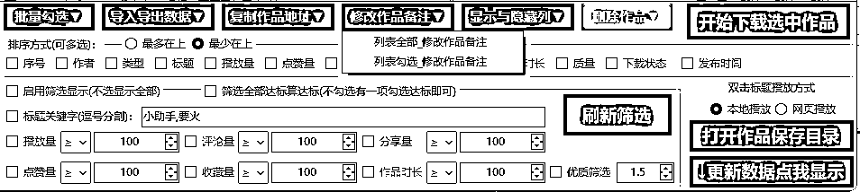

图2：

## 显示与隐藏列▼

#### 显示与隐藏列：

当你点击后弹出的菜单，是主页列表对应的 每一列，

去掉前面的勾选，这个列就隐藏。

勾选前面的勾选，这个列就显示。

用途：减少不需要显示的列，显示你需要的数据。

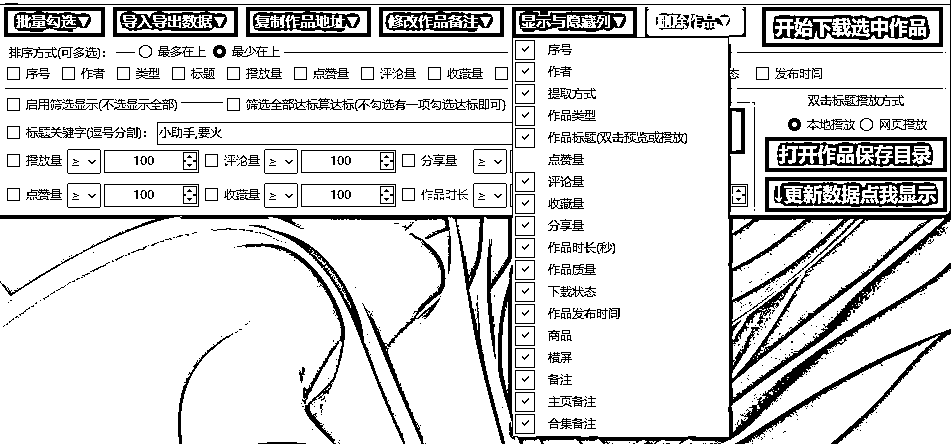

## 删除作品▼

### 删除列表全部作品：

这个用途是删除作品列表全部作品数据，和本地保存的作品信息，不会删除作品文件。

### 删除列表勾选作品：

这个用途是删除作品列表勾选作者数据，和本地保存的作品信息，不会删除作品文件。

## 排序列表

当勾选排序选择框任意一个后软件会排序列表数据，根据选择排序。

#### 最多在上：

代表从多到少的顺序(降序)

#### 最少在上：

代表从少到多的顺序(升序)

#### 排序是全自动，每次列表增加或减少数据会自动排序显示。

## 筛选显示

#### 图1：

必须勾选才会触发所有筛选条件，才会生效，达标条件与不达标条件，进行筛选显示在作品列表。

#### 图2：

不勾选的情况下你所设置的条件，有一项达标，就显示这个作品数据在列表中。

勾选的情况下你所设置的条件，必须全部达标，才显示这个作品数据在列表中。

图3：

#### 筛选是全自动，每次列表增加或减少数据会自动筛选显示，

#### 当你更换条件可能不会触发筛选，需要点击刷新筛选按钮。

图1：

图2：

图3：

## 双击标题播放方式

#### 当你勾选本地播放：

双击作品列表标题列的指定作品如果本地存在作品，就在本地播放，

如果没有自动打开浏览器在网页播放。

图文作品不会本地播放，直接会去网页播放。

#### 当你勾选网页播放：

双击作品列表标题列的指定作品软件自动打开浏览器在网页播放。

#### 小提示：有一些电脑没有默认浏览器双击不会有反应，或被杀毒软件拦截，也是一样没有反应。

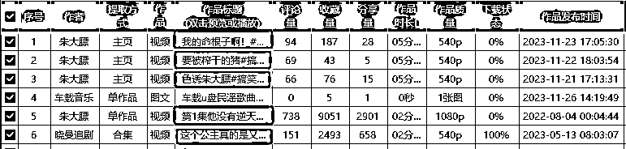

## 作品更新数据

#### 请看图1：

这里的按钮点击后会出现图2的控件，是更新作品数据用的，

按照你所需定期更新作品的数据，进行数据分析。

#### 开始更新数据

设置好条件后，点击列表勾选更新数据按钮即可开始自动更新数据。

完成后会提示完成更新多少条作品数据。

图1：

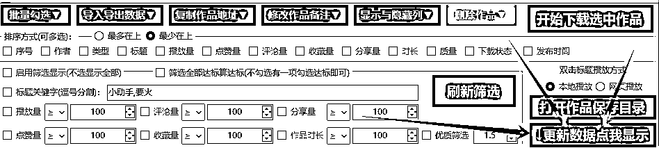

图2：

图3：

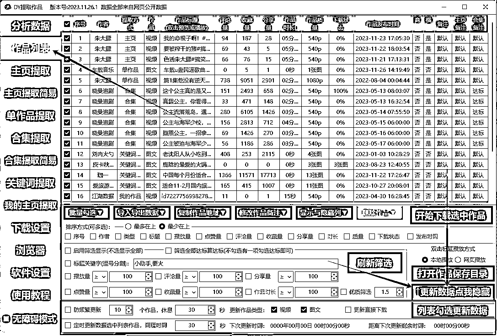

### 作品更新→防频繁

当勾选后，在更新过程中，按照上图设置来讲，

每更新10个作品，软件自动休息30秒，然后继续更新，以此类推。。。

用途：有的时候会出现频繁访问的事情，这样会减少频繁，尤其定时更新。

### 作品更新→更新作品类型

当勾选视频与图文的选择框后，开始更新就会更新视频与图文，

去掉视频勾选，只勾选图文只更新图文作品。

去掉图文勾选，只勾选视频只更新视频作品。

软件自动保留互补，不会出现一个不选的情况。

例如你把视频去掉了，又把图文去掉了，自动勾选视频，自动补一个，防止没有能达标的条件。

### 作品更新→更新直接下载

更新直接下载在勾选后，当你开始更新，自动跟随下载，不勾选不会下载，只更新数据。

### 作品更新→定时更新作品数据

勾选这个选项后，然后定时自动点击开始更新按钮，方便你获取最新作品数据。

间隔时间是指，当开始定时后，软件内部自动计时，

也会显示在上面下次更新时间与距离下次更新剩余时间。

需要注意的是，列表没有勾选作品数据，开启定时更新是没效果的。

* * *

# 下载设置教程

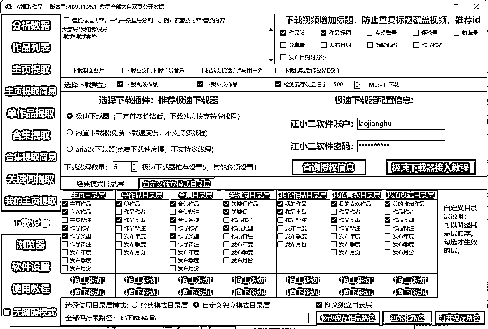

## 替换作品标题内容

当勾选替换标题内容后，每当保存作品数据时，会根据你设置的条件进行替换。

#### 举例：

#### 作品标题为：

江湖工具箱是分析作品数据的软件

#### 你想替换的标题其中一些文字为：

是分析作品

#### 替换成：

是最好的一款分析作品

#### 在文本框内输入内容为：

是分析作品*是最好的一款分析作品

#### 保存作品时标题就会替换成：

江湖工具箱是最好的一款分析作品数据的软件

#### 需要注意必须拿*当分隔符，这个是标识。

## 作品增加标题

这里是设置保存作品标题：

最低勾选一种，否则没有标题，自动补作品id。

标题编码：

当勾选标题编码后，自动在你所勾选的标题选项，增加编码，

正常增加编码是选项汉字转拼音的头一位，具体增加什么编码可以自己尝试。

## 下载封面图片

勾选后，如果作品有封面图片直接下载。

## 下载图文时下载背景音乐

作品如果是图文作品，存在背景音乐，勾选后直接下载。

## 标题去除话题#与用户@

获取到的作品数据标题中有些作品带#与@内容，勾选后可去除。

## 下载视频后修改MD5值

勾选后，更换MD5值，具体可百度：MD5值是什么。

## 选择下载类型

#### 用户问：

为什么会存在选择下载类型这个功能，提取时已经筛选视频或图文，这不多余吗？

#### 工程师答：

很多时候用户的习惯是提取时勾选视频与图文，选择下载类型是下载筛选的最后一道工序。

#### 勾选下载视频作品 与 下载图文作品：

下载任务中：全部会达标，因为只有视频作品与图文作品。

#### 勾选下载视频作品 没有勾选下载图文作品：

下载任务中：会下载视频作品，图文作品不会下载。

#### 勾选下载图文作品 没有勾选下载视频作品：

下载任务中：会下载图文作品，视频作品不会下载。

## 检测储存硬盘低于？MB停止下载

这个功能默认勾选，当你设置的根路径所在硬盘，低于你设置的值，停止下载，防止硬盘满。

## 选择下载插件：【推荐极速下载器】

极速下载器（三方付费价格低，下载速度快支持多线程）一个月9.68元

内置下载器(免费下载速度慢，不支持多线程)

aria2c下载器(免费下载速度慢，不支持多线程)

## 极速下载器设置【用户必看】

#### 首先点击红色按钮去看对接教程，教程需要注意，第一步必须下载江小二工具箱。

购买完极速下载器，回到软件填写江小二工具箱的用户名与密码，

点击查询，授权日期是大于你当前时间即可使用极速下载器功能，

先勾选极速下载器，图1。

在设置下载线程数量：推荐设置5，图2。这样就可以极速下载了。

图1：

我这里演示的时间：2023年11月28日06:13:31，可能你看教程的时间大于现在时间，具体以你的查询为准。

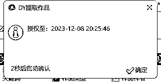

图2：

## 下载线程数量【用户必看】

内置下载器与aria2c下载器请设置【1】，这两个不支持多线程。

如果使用极速下载器可以设置1以上，支持多线程下载，速度超快。

## 经典模式目录层

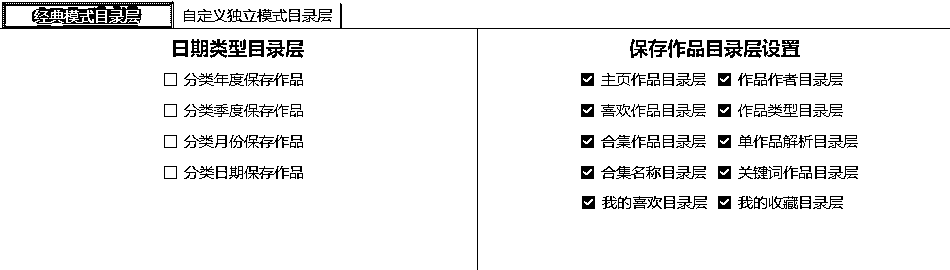

#### 这个是给老用户保留的，新用户直接使用自定义独立模式目录层。

## 自定义独立模式目录层【用户必看】

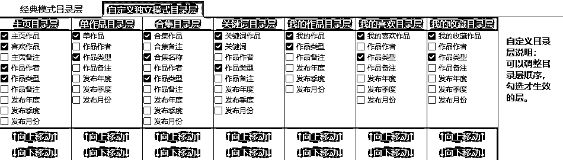

自定义独立模式目录层，是指你可以设置文件夹的层数，勾选哪个就多了哪一层。

#### 举例：关键词目录层

按照上图勾选，现在出现的目录结构是这样的，

设置的跟目录：D:\保存作品\

作品关键词是：美食

作品作者是：老江湖牛逼

作品类型是：视频

作品标题是：测试标题.mp4

D:\保存作品\关键词作品\美食\视频作品\测试标题.mp4

#### 举例:根据下方图1 跟目录，关键词，作品作者，作品类型，作品标题，不都变。

目录结果为：D:\保存作品\关键词作品\美食\老江湖牛逼\视频作品\测试标题.mp4

#### 举例:根据下方图2 跟目录，关键词，作品作者，作品类型，作品标题，不都变。

目录结果为：D:\保存作品\关键词作品\老江湖牛逼\视频作品\美食\测试标题.mp4

#### 需要注意看：图1 与 图2 的目录层顺序变化了

#### 保存作品目录的文件夹顺序也会重新创建。只介绍关键词，其他请举一反三。

图1：

图2：

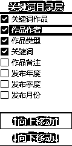

## 选择使用目录层模式

#### 如果你是新用户直接勾选自定义独立模式目录层，经典模式目录层是给老用户保留的。

## 图文独立目录层

#### 不勾选图文独立目录：

所有下载的图文作品，图片，音乐，封面，都保存在一个文件夹，不会创建独立文件夹。

#### 勾选图文独立目录层：

每个图文作品下载的图片，音乐，封面，都会按照你所设置的作品标题创建一个文件夹保存在里面。

图1：就是创建的文件夹。

图2：是文件夹内容。

图1：

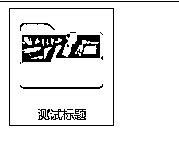

图2：

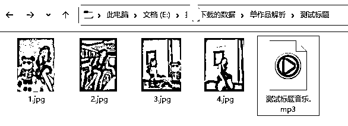

## 全部保存跟路径【用户必看】

这个根路径，是你下载的作品数据，保存的最终目录以他为最顶端目录。

#### 修改保存作品路径：

点击可自由修改你要设置的路径。

#### 初始化路径：

点击后软件会自动更改为：软件默认的路径。

#### 打开保存路径：

点击后打开你当前的保存路径。

* * *

# 浏览器教程

浏览器是自动打开的，当提取作品数据或者其他使用软件内置浏览器的时候，会在这里显示，

如果你在提取主页或者单作品的时候，浏览器正常会跟着你的页面走，如果你需要显示软件内的最大化浏览器，就进入这里，浏览器页面也会跟随进入这里。

#### 下方视频介绍浏览器可在每个界面进行方法与移动的效果：

小提示：

在浏览器的边界点击拖动就是移动，

在浏览器的边界出现的小圆点，鼠标放上点击可放大拉伸大小。

* * *

# 软件设置教程

#### 基本设置：

#### 最小化隐藏任务栏：

当勾选后，软件窗口最小化，电脑任务栏不会显示软件，会到右下角显示。

#### 删除浏览器本地缓存文件：

点击后删除浏览器全部缓存文件，有的时候打不开网页或者卡顿，点击即可。

#### 删除浏览器所有Cookie(登录信息)：

只删除登录信息，不删除缓存数据。

#### 登录DY 登录DY(ies) 登录DY(v) ：

有时候网络问题打不开官网可以选择 后面两个。

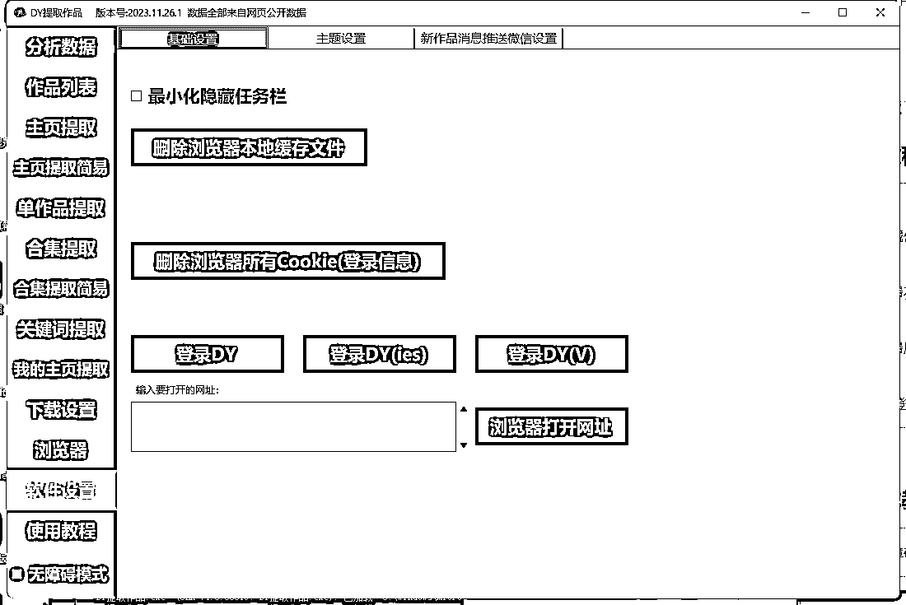

#### 主题设置：

软件使用默认主题，你可以选择暗夜主题，或者自定义自己设置看着舒服的颜色。

每个颜色最左面都有标注，是什么位置的颜色，与字体颜色。

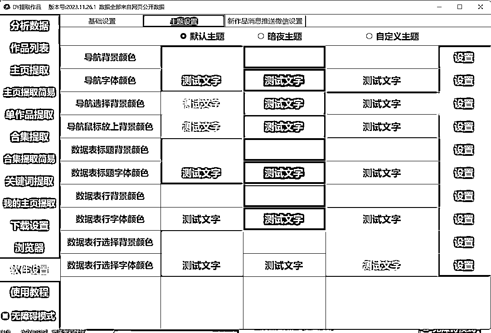

# 无障碍模式教程

当勾选无障碍模式，所有筛选条件都不会生效，只要提取到的作品数据，全部进入作品列表。

