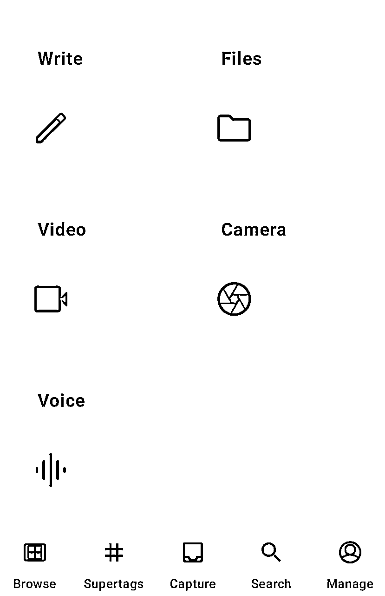
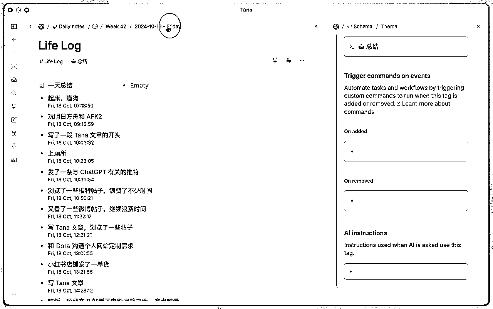
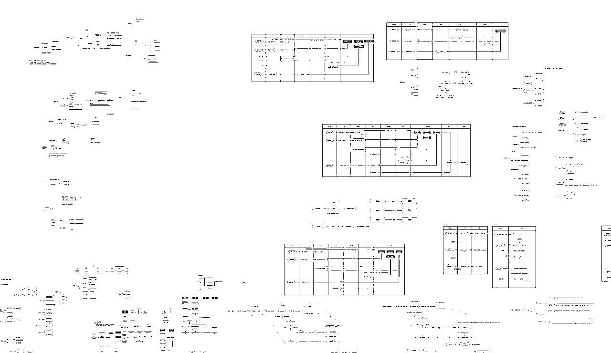

# AI提效工具调研小记

> 来源：[https://jkq1wag4vg.feishu.cn/docx/TZHWdhZ1CoKJWYxMqxNcFfXRnqb](https://jkq1wag4vg.feishu.cn/docx/TZHWdhZ1CoKJWYxMqxNcFfXRnqb)

DeepSeek的爆发式增长标志着AI工具进入"算力民主化"新阶段，AI的使用率变得越来越高，这时候到底是一种技术和信息平权，还是更快速的加大认知差距？

据调查显示，全国AI工具渗透率只有11.3%，其中北上广深杭用户占比78%。区域性差异很大。

不管怎么说，AI的确是变得越来越好用了，就我自己来说，上一次这么大批量的调研和使用AI工具，还是半年前。过个年，发现突然变天了，有很多新奇的功能和新奇的工具，用起来真不错。

## 提效工具测评

这两周用过二十种左右的各种AI工具，专门针对生成式AI和笔记知识库类，挑5个还不错的，简要介绍下

为何选这两类呢？

## 推理型AI：

推理功能，可以有效的帮我们整合信息，而且通过展示推理过程，激发我们更全面的思考问题

同时也能弥补大脑认知偏差，人脑不比计算机，不支持内存扩容，工作记忆空间很小，一般只有4-7个单位容量，很容易认知负载，进而出现思维漏洞和认知偏差，推理型AI可以有效弥补。

## 笔记APP：

针对知识工作者来说，笔记就是我们的第二个大脑，我们无法把所有东西，都存在脑中。强行存储会导致认知负载，降低思维效率。那么一个使用更方便的笔记app，可有效地降低我们的认知负荷。再搭配AI功能，直接把笔记也当作知识库使用。

下面提到的，前三个是推理型AI，后两是笔记类APP，我讲分别讲下，各自有什么特色。

### 1\. 腾讯元宝：国民级AI入口

推理型AI的主力应用，最近deepseek很火，但官网总是繁忙，然后各种第三方替代都出来了。用了不少，比如

本地ollama部署，受限于显卡，非满血版回答质量一般

cherryStudio，无手机端。

chatbox，我用的时候非满血版，且联网功能差。

felo，需要科学上网。

360纳米搜索，挺不错。元宝出来后我就不用它了。

### 2\. 秘塔AI：知识工作者的瑞士军刀

主要用于专业信息分析。元宝有个问题是联网搜索内容，主要来源是腾讯系的东西，有失偏颇。

秘塔AI，搜索内容会包含专业的论文，期刊等，信息质量杠杠的。

而且最近还出来个Shallow Research，所谓deep research的简化版，但效果已经很不错了，回答问题，会分为三步，1，先简单判断需要哪些资料，2，进行检索，3，归纳总结。也就是图片里的先想后搜。

对我来说，主要作为元宝的补充。之前秘塔AI不支持多轮对话，现在上线了追问，作为主力应用也是可以的。

### 3\. Grok3：推理能力的珠穆朗玛峰

核心在于突破限制，可以随意问各种问题，比如国际局势。以及限制级内容生成。支持多模态，可生成图片，视频

另外就是直接有deepsearch，回答问题，跟秘塔AI类似，也是分三步。推理路线更清晰，给人更多启发。

对我来说，也是作为元宝的补充。

注：这个需要科学上网才能访问。

### 4\. Tana：知识管理的后起之秀

这个工具是前两天AI交流会，一个00后介绍的，初看跟workflowy有点像，也就是大纲类笔记，每一行都是一个节点(node，block)，

实际使用起来，界面清爽简洁，但其实功能非常丰富。这个软件功能很强大，学习曲线有点陡峭，深度使用的话，还需要了解编程里的面向对象思想，这里的核心对象就是节点。缺点是不支持markdown。

但其实可以很快上手，而且有几个非常明显的优点。最主要，就是一键输入，一键提取。有什么想法随时记。

1，快速输入，手机输入。不论电脑还是手机，都支持弹出个简单的框，直接输入，打上一个标签即可。会自动根据标签进行规整，而且所有内容都带有默认元数据，比如created_time，便于精准检索。

2，一键提取。既支持直接精准的检索，类似ES的query功能。也支持AI问答，精准给出答案，比如问一天总结，直接列出分别有什么。

个人感觉比notion，workflowy好用。

notion太复杂了，而且飞书基本可以替代。

workflowy，之前简单使用感受是，只有树状结构，强行让人结构化的感觉，不自由。

详细使用指南可参考：https://sspai.com/post/93555

### 5\. Get笔记：信息处理的神经重构

罗振宇公司新出的产品，搭配deepseek，自动带AI知识库功能，可以基于笔记或自创的知识库进行问答。

如果不喜欢用tana的，建议这个软件做主力应用也可以。可以替代flomo。

对我来说是补充，补充的点在于，tana毕竟国外的产品，有时候手机端记录不能及时同步。这时候手机端先用get笔记及时记录一些想法灵感，到电脑端，再进行整理到tana或者飞书都可以。

### Logseq：开源社区的逆袭样本

功能很强大，也是大纲类笔记，同时支持markdown。我没深入使用，直观感受就是输入和提取，不如tana便捷。

我看上的是卡片记忆功能，比如记人名，记一些知识点。跟背单词软件一样，便于记忆。这是它独特的优势。

### Miro：清爽易用的白板工具

miro是个简单易用的大白板，没有任何限制，可以随意连线，便于发散思维与整理思路。

不论是思维导图，大纲图，泳道图什么的都没问题。如下图，什么东西都可以放一块，思考和整理的自由度非常大。

相比飞书的白板，以及国产版broadmix，最主要还是用起来顺手，界面清爽，没有迟滞感。

当然除了上面的应用外，飞书不用说了，还必然是主力软件，是信息『集中营』，最终输出我一般都放飞书。

以上主要从我的使用角度做个简单分享，抛砖引玉。希望对你有启发。