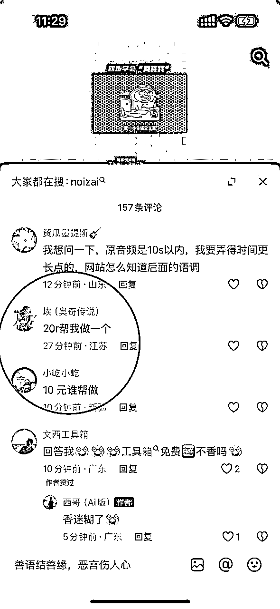
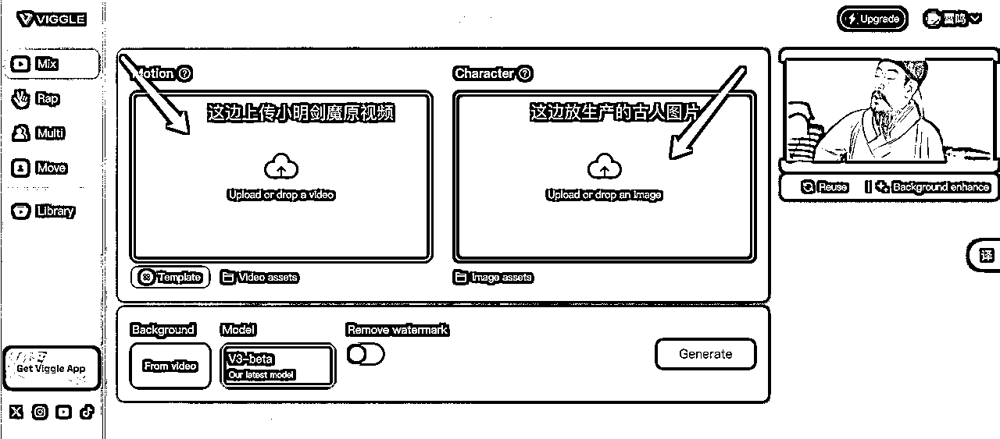
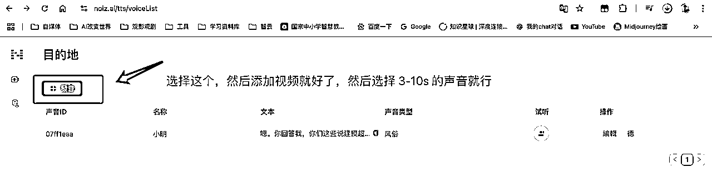

# 历史人物复活骂人 AI 视频制作教程

> 来源：[https://st2uphf6p5.feishu.cn/docx/OkTodNDRoo9J6VxG6hWcjXyKnVd](https://st2uphf6p5.feishu.cn/docx/OkTodNDRoo9J6VxG6hWcjXyKnVd)

hello，大家好，我是雷鸣哥，最近这个历史人物复活骂人的视频彻底火了，人民网，都在发，很多官媒也在发。

回答我，look at my eyes，tell me why，why baby，回答我。

哪里需求，哪里有就商业化，甚至有人付钱代做。

话不多说直接上教程

一、准备工作

1、小明剑魔原始的视频，可以去抖音下载一下原始的小明剑魔视频，我是好人，我就给大家准备好了

2、视频导入剪映提取他的音频后续有用

3、一张你想换脸的历史人物照片，最好是正面的，可以使用即梦AI 生成（记住这个核心提示词：古代仿唐寅人物画，【苏轼】半身像，正面对着镜头）

二、需要用的用具

1、https://viggle.ai/login AI 视频换脸工具（需要科学上网），每天可以免费用 5 次

2、https://noiz.ai/landing 想让人物说的话，需要克隆一下小明剑魔的声音，点击右边新建声音，然后上传小明剑魔的声音。截取大概 10 s 左右的声音

3、DeepSeek，如下提示词可以参考：

你咋不说你写字用羊毫呢?长锋羊毫呢?那我问你，我写《兰亭》，我线条会不会松，线条会不会松，我用羊毫怎么出尖啊?我没尖怎么搞，回答我!我线条会不会松?你回答我，你们这些说用羊毫写字的狗，回答我，look at my eyes,tell me,why?why?baby why啊，我线条会不会松?我写的字比你少吗?我是书圣还是你是书圣?我写字能入木三分，是不是了?说话!

上面是，我给你一段爆款文案，是扮演王義之骂人的。现在请你扮演苏轼，用同样的句式写一段骂人不用 AI 的文案，注意原文中的“回答我”和英文要保留。

写好之后上传到刚才的声音克隆软件中，选择克隆的声音，然后点击生成语音。

4、剪映，打开剪映，最把开始生成好的视频拉进来，删除原音轨，然后把克隆的声音拉进来，选择对口型就搞定了。（部分同学可能对口型需要验证人脸，这个时候就需要大家把原音轨拉进来，然后两个音轨混合剪辑一下了）

中间遇到问题，也欢迎随时来问～