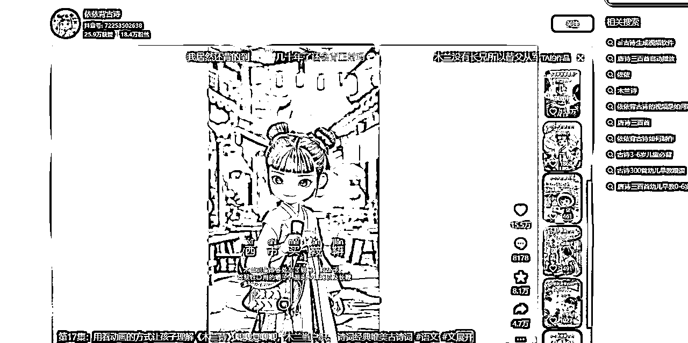
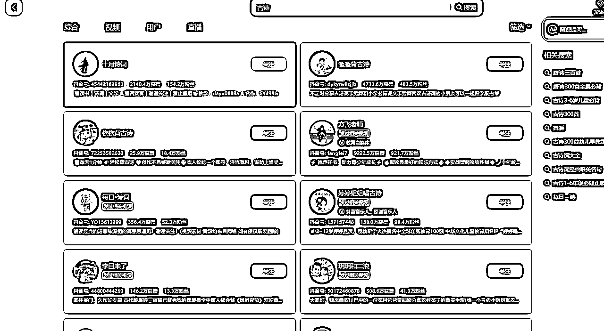
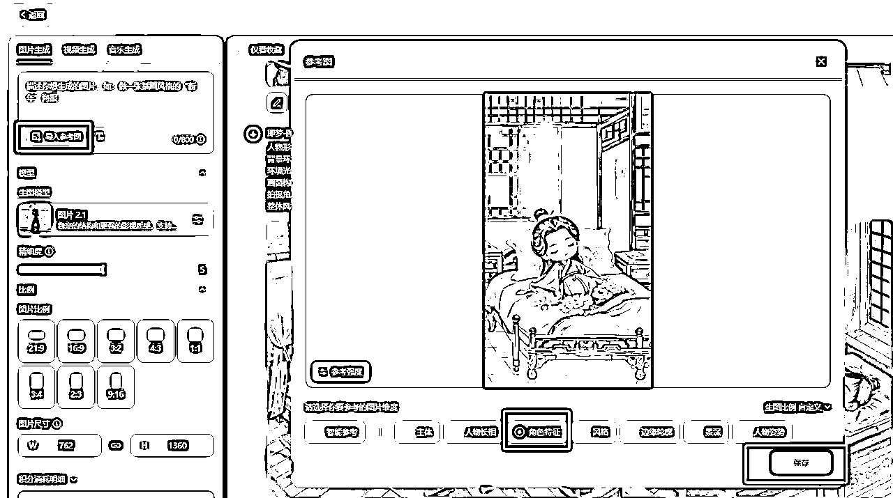
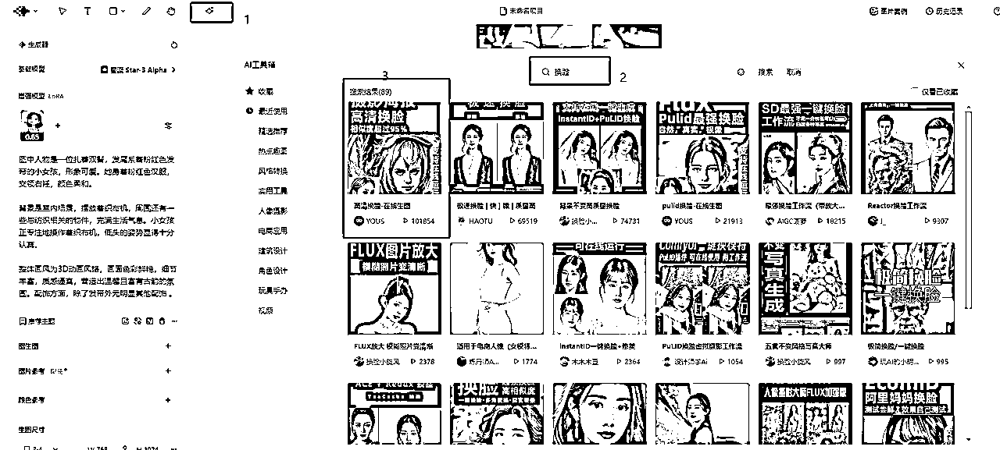
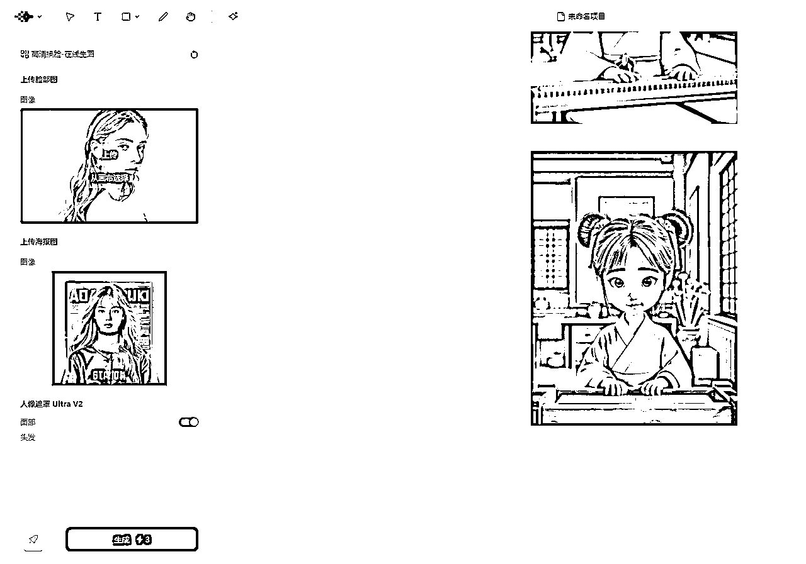

# 30分钟做一个AI古诗词视频教程

> 来源：[https://yf4niapxuw.feishu.cn/docx/OnSVdSr3so1AkTxPBZlcBLZBnmL](https://yf4niapxuw.feishu.cn/docx/OnSVdSr3so1AkTxPBZlcBLZBnmL)

你好呀，我是云珞。

今天我分享一个AI古诗词视频的方法。

AI古诗词做得比较好的博主是依依背古诗，46个视频，18.4万粉丝。

真人背古诗词赛道早已有了，以前没有AI，我们无法闯入这个赛道，现在有了AI，我们也可以做了。

## AI古诗词视频变现方式

简单来说，AI古诗词视频变现就是通过制作好看、有趣的古诗词视频来赚钱，具体方法有以下几种：

### 1\. 平台赚钱

把视频发到抖音、快手、小红书这些平台，平台会根据你的视频播放量、点赞数给你分广告钱。

### 2\. 卖东西

在视频里推荐古诗词相关的书、文具或者摆件，观众点击购买，你就能拿到佣金。

### 3\. 接广告

粉丝多了，就有品牌找你合作，让你在视频里打广告，或者直接给你钱让你做定制视频。

### 4\. 卖知识

把粉丝引导到微信公众号或者微信群，卖古诗词学习资料或者开付费课程，比如教孩子怎么学古诗词。

### 5\. 卖版权

如果你的视频做得特别好，可以卖给教育机构或者出版社，也可以帮他们定制视频，收一笔钱。

### 6\. 教别人做视频

如果你会做AI古诗词视频，可以教别人，收学费或者卖教程。

### 7\. 卖创意产品

结合古诗词主题，做些有创意的东西，比如书签、摆件，通过电商平台卖出去。

总之，就是用视频吸引人，然后通过各种方式把流量变成钱。

## 视频和文字教程

## 第一步：使用DeepSeek生成AI绘画提示词

1.  打开DeepSeek，输入你想要生成古诗词视频的主题或关键词。

提示词1：

请帮我把孟浩然《春晓》这首诗，每一句诗分别翻译成大白话，再根据大白话联想画面，转换成符合指定格式的AI绘画提示词。也就是说，你要将抽象的诗句转化为具体的画面元素，同时保持各部分之间的连贯性，风格的一致性。提示词需要包括人物形象、背景环境、环境光线、画面构图、拍摄角度，主角是Q版儿童形象，整体画风为 3D 动画风格，画面色彩鲜艳，细节丰富，质感逼真，营造出温馨且富有古韵的氛围。

提示词2：

请帮我把孟浩然《春晓》这首诗，每一句诗分别翻译成大白话，再根据大白话联想画面，写下每一句诗词Q版卡通画面的AI绘画提示词。

1.  启用深度思考R1（如果提示词过于复杂或使用了“量子物理”等不相关的术语，建议关闭R1后重新生成）。

1.  获取AI绘画提示词，确保提示词简洁且符合古诗词意境。

除了用DeepSeek问，你用豆包、kimi问，也是一样的。

采纳你觉得合适的提示词就行了，不用所有提示词都采纳。

你也可以自己写提示词。

## 第二步：使用即梦生成AI视频

1.  打开即梦，输入DeepSeek生成的AI绘画提示词。

1.  生成图片：如果生成的图片不符合预期，可以多次生成，直到找到满意的效果。

如果你风格固定，你点击参考图，参考角色特征。

或者生成图片后，点击星流的星号，也就是AI工具箱，输入换脸关键词，选择高清换脸。如图所示。

1.  生成视频：点击“生成视频”按钮，无需额外输入提示词。预览生成的视频，选择效果最佳的一个。

除了即梦生成AI视频，通义万相也不错，可灵、vidu次之。

新手就用即梦，如果你想做出自己的风格，其他AI视频工具，也可以试试。

## 第三步：使用剪映编辑视频

1.  导入视频：打开剪映，导入即梦生成的AI视频。

1.  添加背景音乐：

*   在音乐素材库中搜索“春晓”或其他古诗词相关的音频。

*   选中音频后，剪掉多余的部分，确保音频与视频长度匹配。

*   如果不喜欢现成音频，可以真人配音，或使用DubbingX或TTSMAKER进行AI配音。

1.  添加字幕：

*   使用剪映的“识别字幕”功能，自动生成字幕。

*   选择“拼音体”字体，你就获得了拼音。

*   你再选择动画、字幕、卡拉OK，就有了字幕划过的效果。

1.  添加特效与转场：

*   根据视频内容，添加合适的音效、特效和转场效果，增强视频的视觉和听觉体验。

1.  导出视频：完成编辑后，导出视频，一个精美的AI古诗词视频就制作完成了。

## 小贴士：

*   多次尝试：如果第一次生成的图片或视频效果不理想，可以多次尝试，直到满意为止。

*   个性化调整：剪映提供了丰富的编辑工具，可以根据个人喜好调整视频的细节，如色调、字幕样式等。

*   创意发挥：除了古诗词，你还可以尝试其他主题，如现代诗、散文等，发挥你的创意。

## 文中提到的工具网址：

DeepSeek网址：https://www.deepseek.com/

即梦AI：https://jimeng.jianying.com/s/KlAtfoT5jlo/?t=-1

剪映免费电脑会员版链接：https://pan.quark.cn/s/5dbd3ddfbd21

星流AI：https://www.xingliu.art/

TTSMAKER：https://ttsmaker.cn/

DubbingX：https://www.dubbingx.com/

通过以上步骤，你可以在30分钟内快速制作出一个高质量的古诗词视频，既简单又高效！快去试试吧。