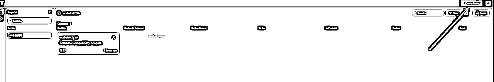

# Tempo Labs：像使用设计工具一样编辑你的前端代码

> 来源：[https://hqhhkfm2ink.feishu.cn/docx/HqwWdRfXKo25FVxA2GIc8xfHnCH](https://hqhhkfm2ink.feishu.cn/docx/HqwWdRfXKo25FVxA2GIc8xfHnCH)

# 1、介绍

今天要介绍一位新朋友：Tempo Labs

它是我在逛论坛的时候发现的一款AI 编程产品，它与其他的AI 编程产品不同的地方就是，它可以像使用设计工具那样去编辑你的前端项目，这是让我感到惊艳的。

以前你可能是使用 blot 这样的AI编程工具去初始化项目，现在我推荐你来试试这款产品。

## 1.1 功能

### 1、可视化编辑代码


### 2、生成自定义库

### 3、支持从0初始化项目/ Github 导入。


## 1.2 收费

目前来看，免费计划是够我们体验产品的。


# 2、实操

## 2.1 提示词

这次的案例我们就用 刘小排老师以前用blot.new 做过的一个案例使用的提示词。看看效果如何。

```
1\. 技术栈：用纯粹的HTML + TailwindCSS来做
2.核心功能：我要做一个运势网站，用户填入自己的姓名、选择生日，点击按钮，就可以就行运势计算。运势计算
具体算法我不管，你帮我完成，但是要算出来让用户感觉专业、有理有据、愿意付费。计算出来的运势至少要包括
运势评级、运势分数、宜、忌、理由等等。
1\. 功能区域：你要有完整的header,hero, testinoials, faq, features, pricing, how it works ,footer 区域。 网站的版权所
有人是阿杰，联系方式hahaxswl@gmail.com，其他内容需要编写得专业、真实。
4.网站文案：所有网站上的文案内容，我要求你使用中文。关于这个运势计算网站，你需要强调我们是结合东方玄
学、紫微斗数、易经、星座等等，强调中西方结合。
5.网站风格：网站配色和风格需要现代化、高级，类似于苹果官网的风格。网站需要自适应各种屏幕尺寸。
```

## 2.2 使用 Tempo Labs 创建项目

首先我们先登录 Tempo Labs。它是使用 Git Hub 账号进行登录的。所以你需要准备好一个 Git Hub 的账号。



这里可以选择创建新项目，也可以选择从Git Hub 导入（写这篇文章的时候，它还是不支持github 导入）。这里我们选择第一个 Generate New App 。


回车，开始生成。

## 2.3 工作区介绍


最左边：你可以看到聊天记录和执行流程。

中间：你可以看到项目介绍，和它为我们生成的流程图。

最右边：创建的页面。


上面的三个按钮，你可以在PRD 和 设计 还有代码之间进行切换展示。

## 2.3 在线预览页面。


在线预览地址：Vite + React + TS


看起来还是不错的。

## 2.4 上传到Github 仓库

‘


我这里之前已经和我的GitHub 建立过连接了，所以可以直接设置项目信息，如果是第一次它会先让你和Github 建立连接。这个过程很简单，基本就是下一步一直点过去就行。


给项目取个名字。我这里就叫 fortune-telling了，我们还可以选择仓库是否公开。可以就点击 Create 创建项目

接下来我们到自己的GitHub仓库去查看一下是否已经创建成功了。


我的这个项目地址：GitHub - wudi-dot12/fortune-telling

这样我们想要放到本地去使用cursor / windsurf 这些本地 AI 编程工具修改代码的时候就直接从Git Hub 把代码拉下来就好了。

## 2.5 直接编辑页面


选择你要修改的组件，然后在右边的编辑栏，可以进行操作。

我们还可以进行选择组件后，直接用AI 修改 组件。

我们选中导航栏，然后点击 Tempo Labs 提供的AI 助手，然后提出我们的需求


接下来就是等待优化完成。

好像就是按钮变圆了一些。


当我们修改了组件的时候，这里就会显示变更了哪些代码的组件，就跟我们自己在本地使用 git 是一样的。


输入本次提交信息，点击 Commit 然后再点击 push , 就可以提交到Git hub 仓库了。

