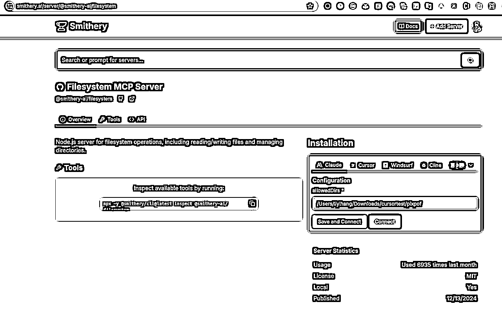
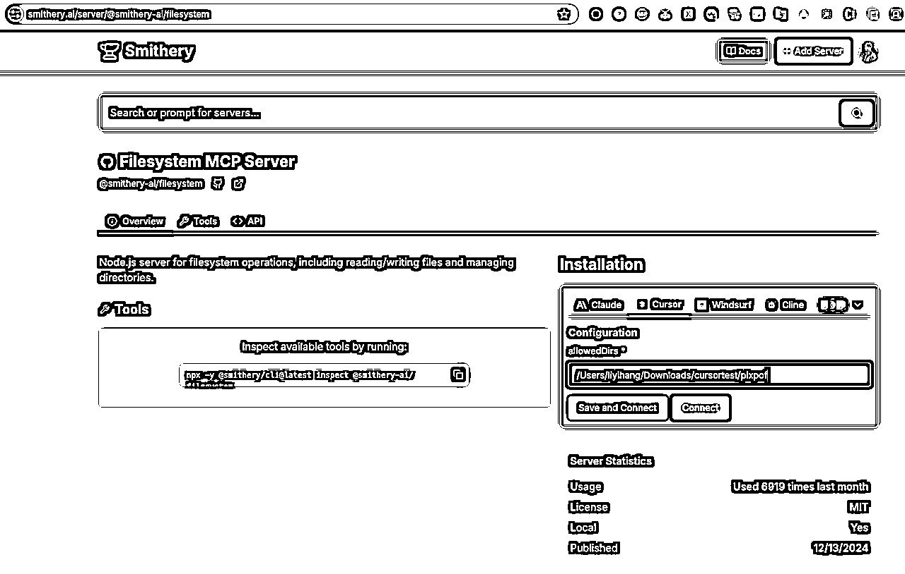
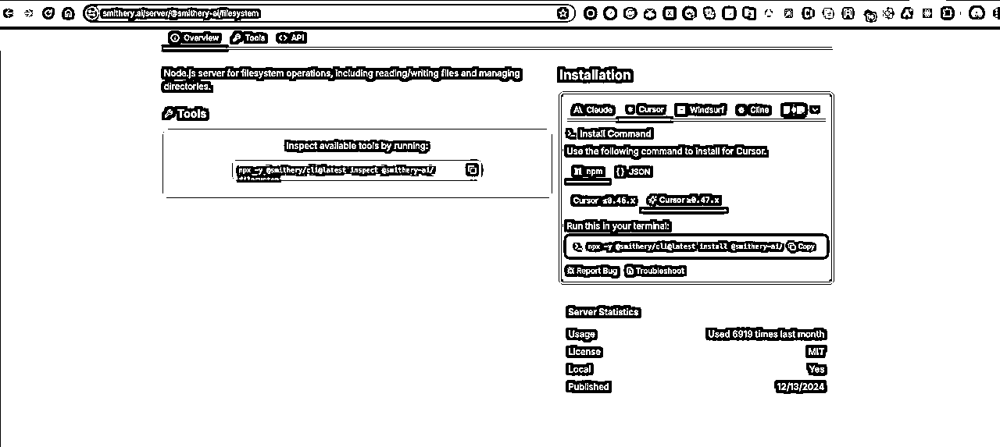
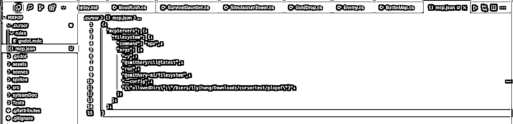
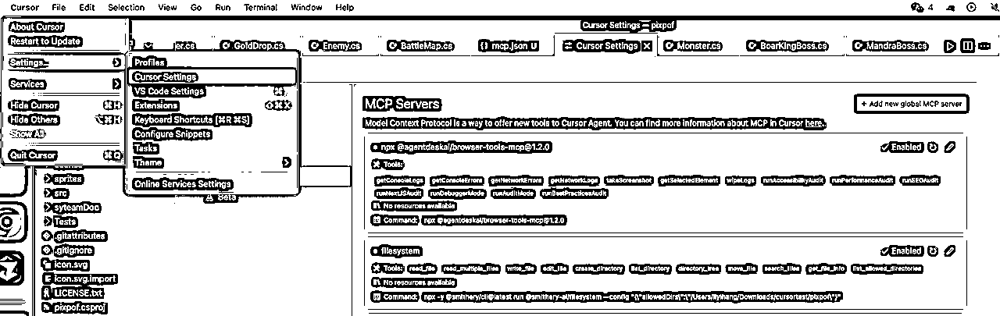
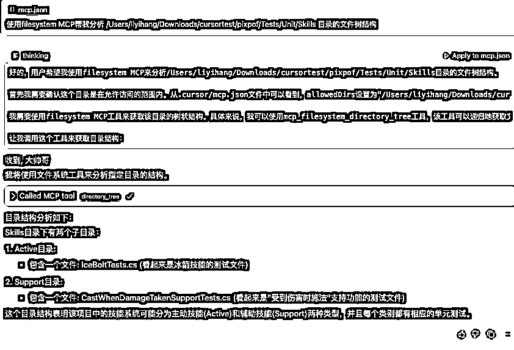

# 第11章：cursor如何使用MCP服务 - AI的"万能插头"

> 来源：[https://tcnvg4hz3lm8.feishu.cn/docx/OTIVd3OzEo7TiLxZr4AcO5OJnRh](https://tcnvg4hz3lm8.feishu.cn/docx/OTIVd3OzEo7TiLxZr4AcO5OJnRh)

第11章：cursor如何使用MCP服务 - AI的"万能插头"

想象一下，如果你的AI助手能直接查询你的数据库、浏览网页、管理GitHub仓库，甚至帮你优化前端代码...听起来像科幻电影？现在，这一切通过Cursor的MCP服务已成为现实！

一 MCP是什么？为什么它如此重要？

MCP（Model Context Protocol）是Anthropic在2024年11月推出的开放标准协议，我喜欢把它称为"AI的万能插头"。简单来说：

💡 通俗解释 ：MCP就像是AI的"超级USB接口"，让AI能够连接各种外部工具和数据源，不再是"闭门造车"的书呆子。

MCP解决了什么问题？

在MCP出现之前，AI模型就像是被关在信息孤岛上的天才：

•🔒 知识受限 ：只知道训练时学到的内容，无法获取最新信息

•🔒 工具受限 ：无法直接操作外部系统（如数据库、文件系统）

•🔒 上下文受限 ：难以维持长期对话记忆和环境状态 MCP打破了这些限制，让AI变得更"接地气"：

•🔑 实时数据访问 ：可以查询最新数据库内容、网页信息

•🔑 工具调用能力 ：能够执行文件操作、API调用等实际任务

•🔑 上下文管理 ：维护结构化的对话历史和环境状态

应用场景：MCP让AI如虎添翼

1.智能编程助手 ：不仅能看懂你的代码，还能直接访问GitHub、运行测试、查询API文档

2.数据分析专家 ：直接连接数据库，生成查询语句并执行，实时可视化结果

3.内容创作助手 ：自动抓取网页内容，整理成文章大纲，甚至帮你发布到博客

4.自动化工作流 ：帮你管理日历、发送邮件、创建任务，成为真正的"数字助理"

二 动手实践：创建你的第一个MCP会话

Cursor已经集成了丰富的MCP服务，让我们来看看如何使用这些"超能力"： 让我们通过一个简单例子，体验MCP的强大：

1\. 安装Filesystem MCP服务， Filesystem MCP：让AI读懂你的项目结构

（1 打开https://smithery.ai/server/@smithery-ai/filesystem[1] , 查看filesystem MCP详情

（2 点击cursor选项卡， 填入你允许访问的文件目录 /Users/liyihang/Downloads/cursortest/pixpof

（3 “Save and Connect”

（4 复制客户端安装命令

（5 命令行执行安装命令

npx -y @smithery/cli@latest install @smithery-ai/filesystem --client cursor --config "{\"allowedDirs\":\"/Users/liyihang/Downloads/cursortest/pixpof\""

（6 在要启动mcp服务的项目下， .cursor子目录创建mcp配置文件mcp.json （ .cursor/mcp.json ）

（7 然后查看cursor -> setting -> cursor setting -> MCP , 就能看到注册的mcp服务了，现在看到filesystem 服务已安装成功

2.使用Filesystem MCP服务

1.按下 Cmd+I (Mac) 或 Ctrl+I (Windows) 打开AI面板

2.输入以下提示词：

使用filesystem MCP帮我分析 /Users/liyihang/Downloads/cursortest/pixpof/Tests/Unit/Skills 目录的文件树结构。

💡 提示 ：MCP服务多用nodejs或python开发，需要nodejs或python执行环境，请提前安装开发环境

•node环境 推荐使用https://github.com/nvm-sh/nvm[2] nvm工具安装

•python环境 linux/mac可以使用系统自带，windows从https://www.python.org/downloads/[3] 安装

三 超实用MCP服务推荐

让我们来看看一些特别强大的MCP服务：

1\. Neon Database MCP：云数据库里的变形金刚 🤖

这货是AI界的"数据库翻译官"，能把复杂的SQL查询变成大白话！只要对它说："帮我看看上个月卖得最火的电子产品"，它就能在云端PostgreSQL数据库里翻箱倒柜，生成带折线图的销售报告。最黑科技的是——不用时自动休眠，老板再也不用担心我的云账单爆炸啦！

2\. Magic MCP：前端界的哈利波特 🧙♂️

想要一个会渐变会跳舞的按钮？只需对着IDE喊："给我来个赛博朋克风的导航栏！"，它就像挥舞魔杖般瞬间生成代码。实测连产品经理都能用它做网页，现在前端工程师的咖啡杯上都印着"警惕AI打灰机"的警示标语...

3\. Filesystem MCP：文件界的收纳狂魔 🧳

这位AI洁癖患者最爱整理你的下载文件夹。说句："把上周的猫咪表情包按品种分类"，它就能把"橘猫暴风吸入.jpg"和"布偶仙女蹲.jpg"分门别类放好，顺便删除你手滑下载的《霸道总裁爱上我》.txt（别问我怎么知道的）

4\. Browser-tools MCP：浏览器里的"内鬼" 🔍

这工具堪称程序员版的《窃听风云》，能实时监控浏览器控制台的每句"悄悄话"。当你的网页突然抽搐，它就像柯南附体，瞬间定位到哪个JS函数在搞鬼，还能自动生成带截图的bug报告——建议改名叫《论AI如何让程序员失去吵架素材》

5\. SQLite MCP：数据库菜鸟的作弊器 🐦

从此告别SQL从入门到删库！对着AI喊："给我找出所有下单三次以上的土豪客户"，它就能像老会计翻账本一样，在本地数据库里唰唰检索。最绝的是能自动生成人话版分析："王总最近买了三台镶钻空气净化器，建议推送24K金滤芯广告"

6\. Tavily MCP：搜索界的闪电侠 ⚡

当你在代码里卡壳时，这位AI情报员已经扫遍全网技术文档。比如问："SpringBoot怎么防止恋爱脑式循环依赖？"，它能从Stack Overflow、GitHub、知乎等52个渠道瞬间整理出答案，比男朋友回微信的速度快10086倍！

7\. Fetch MCP：网页收割机 🌾

想要把知乎高赞回答变成Markdown笔记？对它说："把那个10万赞的AI段子手回答薅下来！"，它就像网络剪刀手爱德华，不仅完整保留文字、图片、代码块，还能自动添加"[狗头保命]"表情包注释——建议改名叫《当代赛博文摘》

8\. GitHub MCP：聊天式代码协作 💬

通过GitHub MCP，AI可以直接执行Git操作，让代码协作变得像聊天一样简单！

9 Figma MCP：设计师与程序员的鹊桥 🌉

这工具是设计师和码农的"电子红娘"！设计师在Figma里画个按钮，AI就能自动生成带hover效果的React代码。实测连配色方案都能自动转成CSS变量，产品经理现在最爱说的话是："这个交互不用开评审会，直接让Figma MCP生成！"

四 如何找到更多MCP服务？

想探索更多强大的MCP服务？这些网站是你的"藏宝图"：

1.https://mcp.so/[4] - 官方MCP服务目录

2.https://glama.ai/mcp/servers[5] - 精选MCP服务集合

3.https://www.pulsemcp.com/[6] - 专注于数据分析的MCP服务

4.https://smithery.ai/[7] - 开发者友好的MCP工具箱

5.https://mcp.composio.dev[8] - 可组合MCP服务平台

6.https://github.com/punkpeye/awesome-mcp-servers[9] -GitHub上的MCP服务精选列表

7.https://github.com/modelcontextprotocol/servers[10] - Anthropic官方GitHub上的MCP服务精选列表

进一步学习：

1.https://modelcontextprotocol.io/[11] - MCP服务的官方网站介绍2.https://docs.cursor.com/context/model-context-protocol[12] - Cursor MCP服务的官方文档

小结：MCP改变了什么？

MCP服务彻底改变了我们与AI的交互方式：

•从封闭到开放 ：AI不再局限于训练数据，可以访问实时信息

•从被动到主动 ：AI可以主动获取所需资源，而不只是回应你的输入

•从通用到专业 ：通过专业工具扩展，AI在特定领域表现更出色

•从单一到集成 ：多种MCP服务协同工作，创造"1+1>2"的效果 下次当你遇到编程难题，不妨试试让Cursor通过MCP服务来帮你 - 你会惊讶于它能做到的事情！

💡 进阶提示 ：你甚至可以 创建自己的MCP服务 ，为AI赋予独特能力，打造专属于你的超级助手！

References

[1]: https://smithery.ai/server/@smithery-ai/filesystem

[2]: https://github.com/nvm-sh/nvm

[3]: https://www.python.org/downloads/

[4]: https://mcp.so/

[5]: https://glama.ai/mcp/servers

[6]: https://www.pulsemcp.com/

[7]: https://smithery.ai/

[8]: https://mcp.composio.dev

[9]: https://github.com/punkpeye/awesome-mcp-servers

[10]: https://github.com/modelcontextprotocol/servers

[11]: https://modelcontextprotocol.io/

[12]: https://docs.cursor.com/context/model-context-protocol