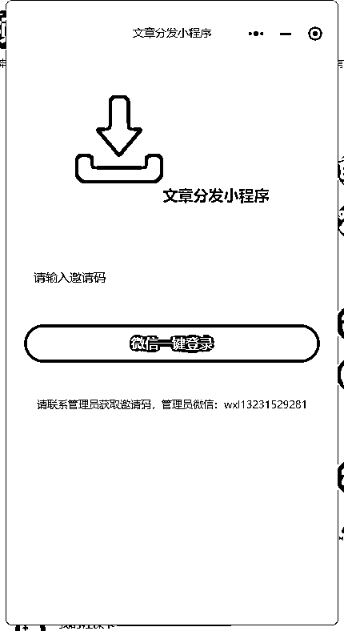
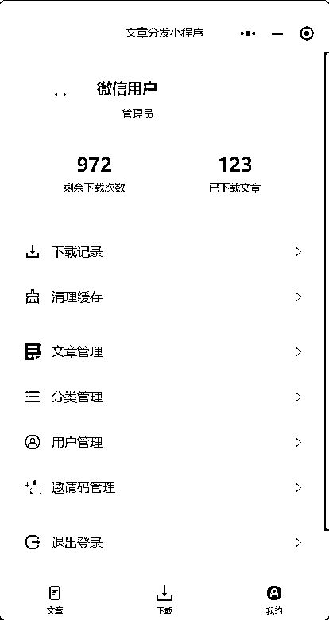
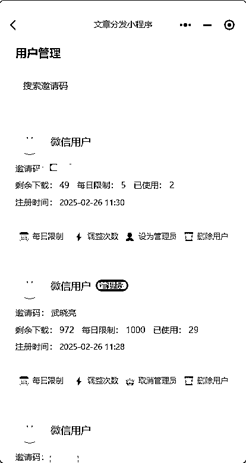
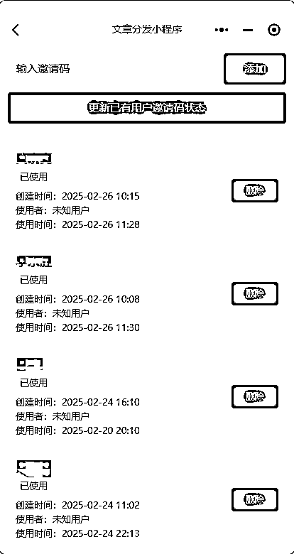

# 我使用cursor写了一个公众号代运营分发文章的小程序

> 来源：[https://si06f5z4e71.feishu.cn/docx/H4FCdSgpGoZuWZxXEeFcjVlkn6f](https://si06f5z4e71.feishu.cn/docx/H4FCdSgpGoZuWZxXEeFcjVlkn6f)

小程序想法的诞生：

我跟大家来聊一下，现在很多人都在做公众号的代运营，但是大部分人可能面临的一个问题就是分发文章，感觉好

累亚，总有不同的人在不同的时间联系你，我看到过圈友@兔子的模式分享，他们是利用团队进行了明确的分工来

做的，可能相对好一些，但是对于大部分个人做的话，会面临分发文章的问题。同样我也面临这样的问题，我接着

cursor尝试了很多次，都失败了，这种状态从开始到完成小程序第一版，一共持续了两周的时间，期间都搞得有点

抑郁，但是最终结果好的，我会在文末放上小程序的打包文件，无偿分享给圈友。关于分享我还想说的是，很感谢

稳健圈友，在他的陪伴群了，每天都会分享他个所思所想，也受益匪浅。

# 小程序的设计流程：

1.  用户领取文章，可以实现标题的复制（自动识别文档的标题），文章的复制

1.  可以控制用户的每天的下载次数，并且每天凌晨12点自动更新次数

1.  我还利用cursor实现了图片在文章中的插入：逻辑很简单，首先用影刀把每篇文章的图片链接都保存到文件里，然后将生成的文章文档和图片链接的文档将图片插入进去效果还不错。

1.  小程序还设置了邀请码，通过邀请码才能注册和登录

# 小程序源代码：

最后，希望所有圈友，在生财有术中得到自己想要的，一起生财有术！