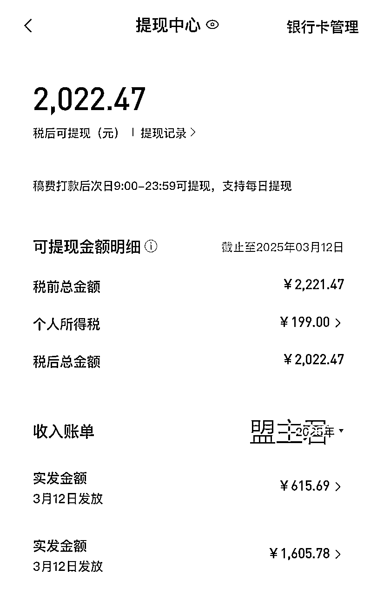
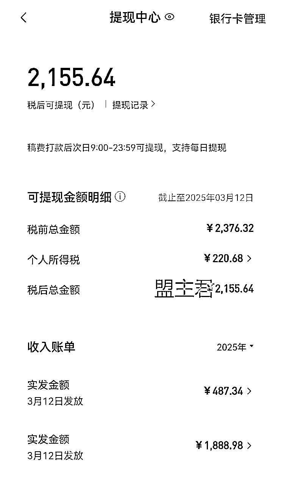
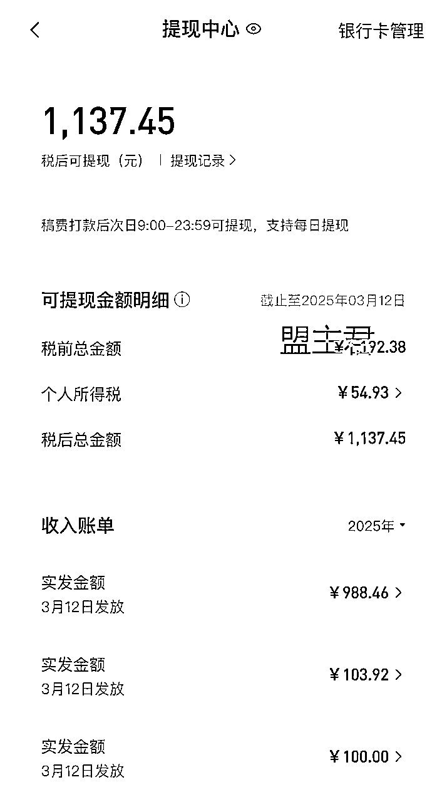
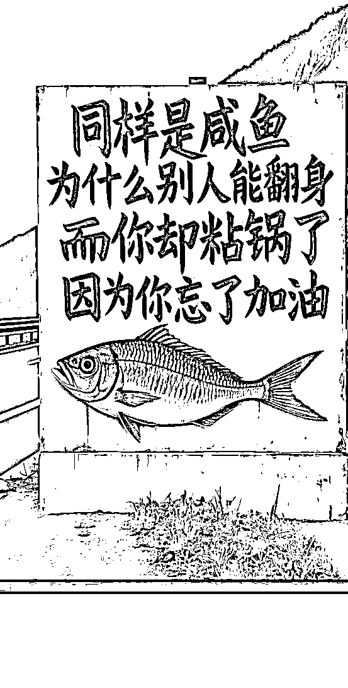
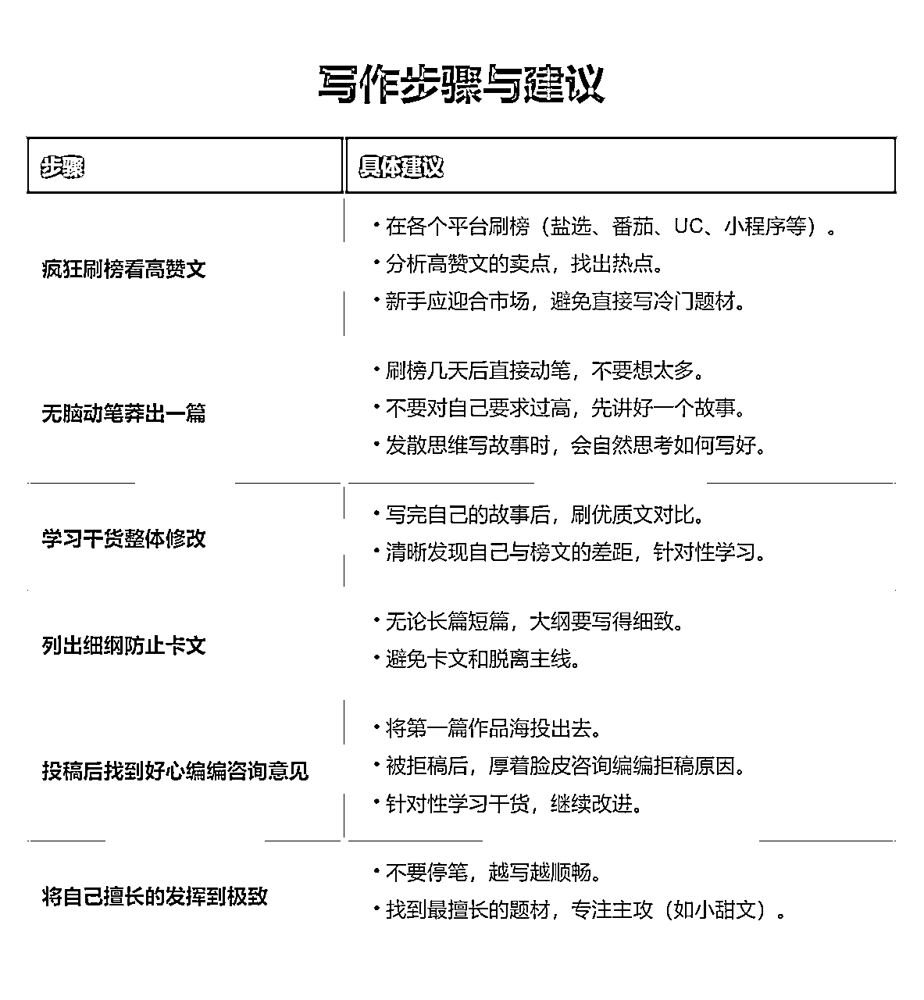
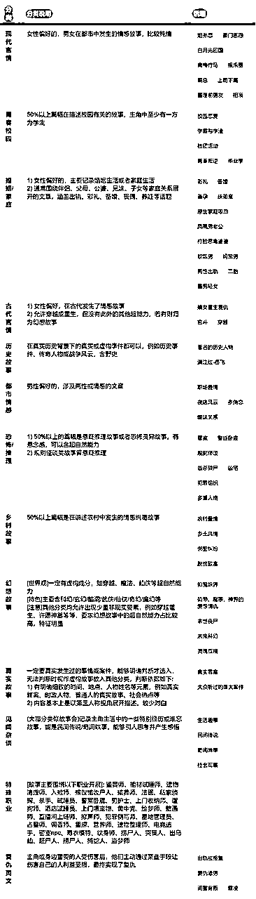
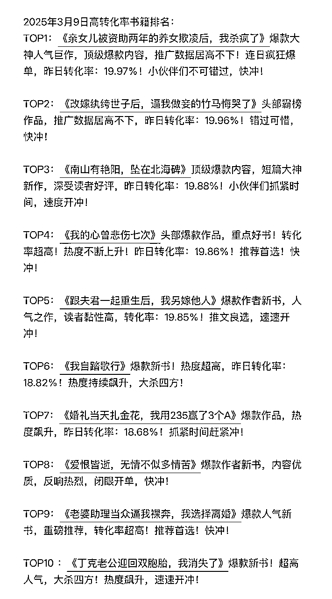
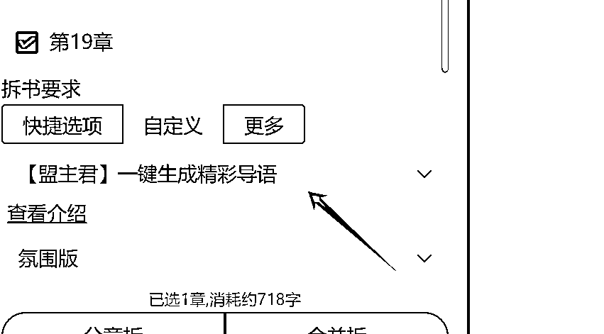
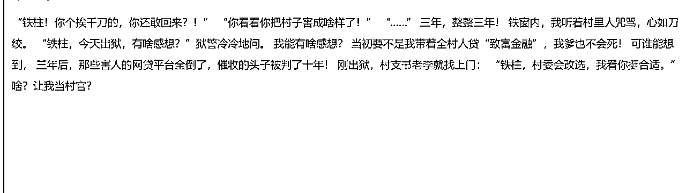
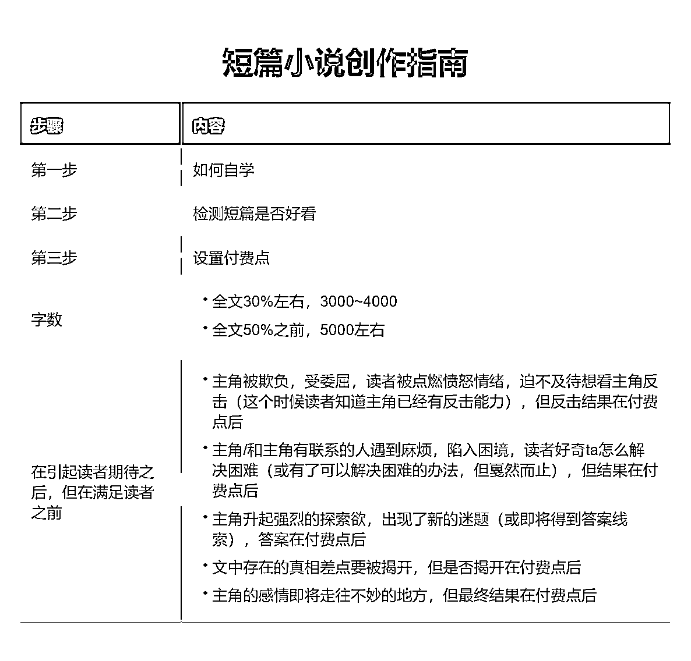

# 一起靠AI慢慢变富，掌握AI写作你就是最强王者

> 来源：[https://rcn71rsvb3w5.feishu.cn/docx/WWgldHymDoB5UuxnSMuc5nbbnMh](https://rcn71rsvb3w5.feishu.cn/docx/WWgldHymDoB5UuxnSMuc5nbbnMh)

大家好，我是盟主君，一个靠AI变现超20w+的90后创业者。

今天又来给大家报喜了。

目前三个账号的收入比较稳定，由于2月份是开年，需要处理的事情比较多，所以账号发布的文章数量只有原先的三分之一，但是长尾流量还是很惊人的，上个月稿费很多的都来自几个月前的小说文章。

很多人都在说我学习了AI，并且使用了AI来写作，来做视频，来做自媒体。但学到最后都没有得到正反馈。

同样是咸鱼，为什么你翻不了身，缺的只是加油吗？

我想应该是的，如果你没资源，还想赚钱。那你只有拼命给自己加油，让自己熬过最艰难的那段时光。

那么请看今天的分享

## 一、题材选择

### 建议扫榜，快速扫榜方式：小红书搜——知乎榜单/黑岩榜单

知乎榜单

https://www.xiaohongshu.com/user/profile/597806c46a6a69564b1f9616?xsec_token=ABITZR8iwKyBH-NU7i-1miPgZ6-RLTu11WR0EA5746Gz8=&xsec_source=pc_search

黑岩榜单

https://www.xiaohongshu.com/user/profile/63970cde000000002702a1cb?xsec_token=AByDgh78rtpmB4k_ZGFAxi57IgXF2tUj9GB7U-Kw2McPs=&xsec_source=pc_search

## 二、爆款导语【导语万能公式】

背景+结果(反转)+新冲突(钩子)

1、导语通常是三段式(个别是四段式)

第一部分:交代背景、事件

第二部分:转折，交代发展和结果【事件表象(看起来)】

第三部分:强反转，制造冲突【事件里象(真实)】

表象和里象之间的逻辑不对等，就是反转。

2、最好每一部分都是上一部分的反转，举个最简单的例子：我是个瞎子但我能看见所有人的恶念却看不见他的。

比如：我是一个“盲人”按摩师上门给女主服务，结果看到了不该看的东西！

3、情绪上，如果主角开始在低点，结尾就要上到最高点。

反之，开篇主角如果已在高点，结尾就必须掉到最低点。

高点--指上行情绪，例如名利双收、拥有爱情、实现目标、人生赢家

低点--指下行情绪，例如一无所有、爱情是假、背叛、死亡误解

注意:

导语通常是100-150字，因此每一部分在35-50字左右而知乎的首页推荐，会显示55字左右。

因此，要稍微注意下第一部分的内容，不需要太复杂，但最好是更有吸引力的情节设计。

用户口味:虐文>爽文>甜文

这也说明了难度问题，想在有限的篇幅里，把甜文写得跌宕起伏、水到渠成、又有记忆点，本身就是很难的事。

而世情和息疑更容易往虐写，从而调动读者情绪，达到共情。

复仇、虐渣、追妻火葬场，这类文，前期主角都是怎么惨怎么写，压抑、窝囊、委屈到极致，后续就形成了反差爽感。

反套路创新:古早言情套路翻新使用的情况很多，基本是男女人设对调、关系对调、情绪反转，从而形成新的情节。

娱乐圈题材和追星一样，经久不衰，自带角色滤镜和冲突。

不要妄图导语写得多么精彩艳绝，从而吸引读者。

你只需要在导语中，表现出你的TAG，从而吸引想看这类文的读者。

基本分为以下两种途径:

① 打造悬念，也就是你的第三部分和前两部分完全不挨着以至于读者想要知道，这到底是件什么事。

② 营造极致情绪，通常是用台词或者行动细节，表现出虐，甜、撩等情绪。

要想快速掌握对导语写作方法，那你请你每天在知乎看10篇小说的导语，坚持看一周，你就基本会识别什么是警察的导语了！

### 如何利用AI生成导语呢？

使用AI写作网站，选择导语生成器，它会帮你把导语生成，你只需优化就好。

生成的效果如下：

如果你不满意还可以继续修改。

## 三、设置付费点

新手手如何写好付费点？

简单来说，付费点＝期待感。

（就是你吐槽卡的一手好文的那里……)

读者只有对这篇文的后续发展有期待感，才会付费。

这和长篇的收费章节的逻辑是一样的。

要想营造期待感，关键是矛盾冲突要强烈，导语没有废话直接体现出核心梗，悬疑就要装神弄鬼欲盖弥彰，最直白一点的---发生了一件不可能发生的事。

爽文欲扬先抑，前期被欺负羞辱，而最后一句落在反击上面，甜文虐文也是，把最后那句话留着前期所铺垫的对立面，才能极大的勾起读者的兴趣。v

①付费点不能太靠后。

一般全文35%-60％的位置，就是付费点，以50％之前的位置居多，因为付费后也要有足够多的内容可以读。

具体一点，1万字的文，3k字左右，从开篇起展开的第一个短线悬念、期待就要揭开了，付费点就在这里；

其他字数以此类推。

这就要求，吸引人的点太靠近，读者会等不到。文章的前中后，都要有吸引人的点。

②结合不同题材的核心卖点＋主线，设计不同的付费点。

如果你的主线是甜文感情线，那付费点就可以是主角间感情到一定程度后的关键大迈进处；

如果是爽文，那付费点可以是一个更重要的打脸反击处．

如果是替身虐文，付费点可以是替身主角死了／离开了，开始虐男主那里。或者更早一点，一个大虐点要开始了那里。

每个题材，前面营造的期待感，刚好卡在付费的时候解开，就有付费感。

③利用八卦心理，从读者看热闹的心态入手。

就拿平时生活来说，如果别人给你说了个大八卦结果只说了一半，你心里是不是不上不下的特别想知道？举个例子，同桌跑来告诉你校长在学校门口捧着花跟结了婚的英语老师表白了，劲不劲爆，首先你会先问真的假的，然后正常人会问那英语老师怎么说，结果同桌一个劲的告诉你校门口都是人在看，还有拍视频呢，校长捧着花单膝跪地特别深情，可是你就是想知道英语老师怎么说的。

同桌说给他两块钱给你看完整版视频，一上头付了两块看完视频，付费点就是这么个意思，话只说一半，剩的那半还是最关键的一半。

## 四 写正文及标题

这一部分，我已经在 《一起靠AI写小说慢慢变富全流程版》 做过全面讲述，大家如果不懂的，可以去看看

最后我还想告诉你，我们身处AI时代，不要妄想AI为我们自动赚钱，一切还要靠你的创意和坚持，希望你能善用AI一起暴富。