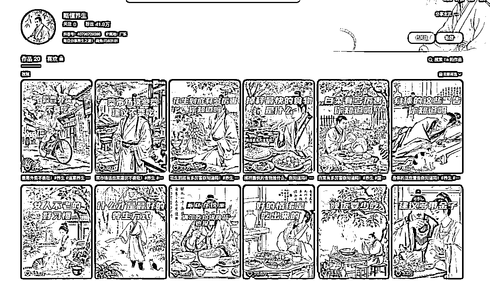
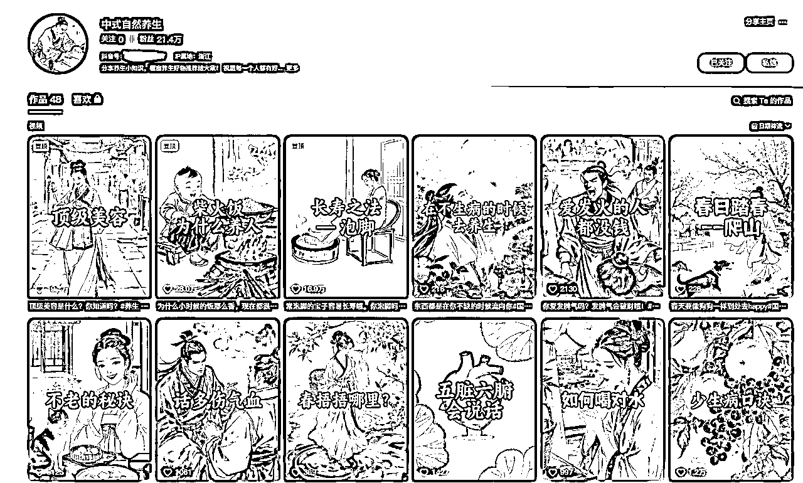
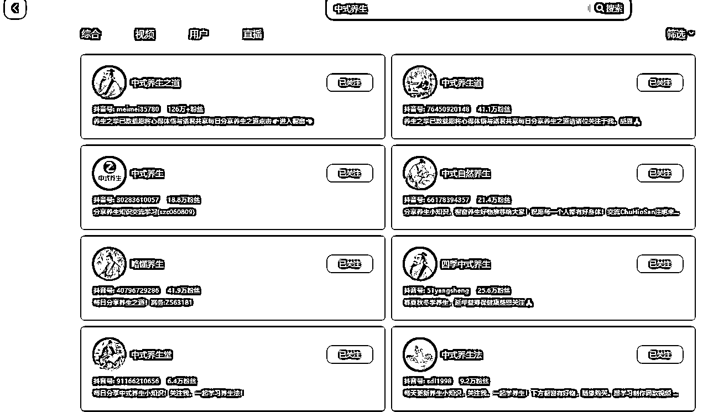
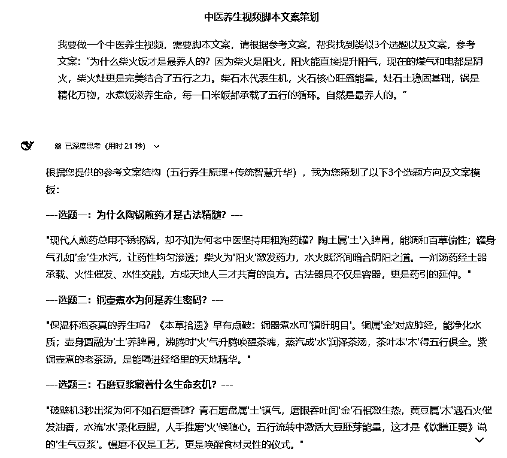
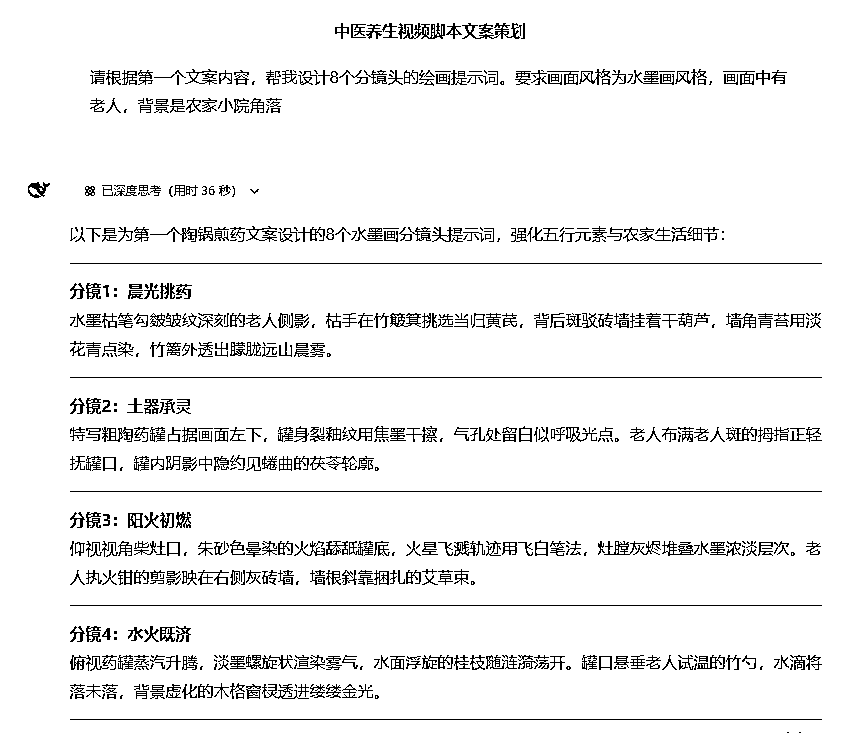
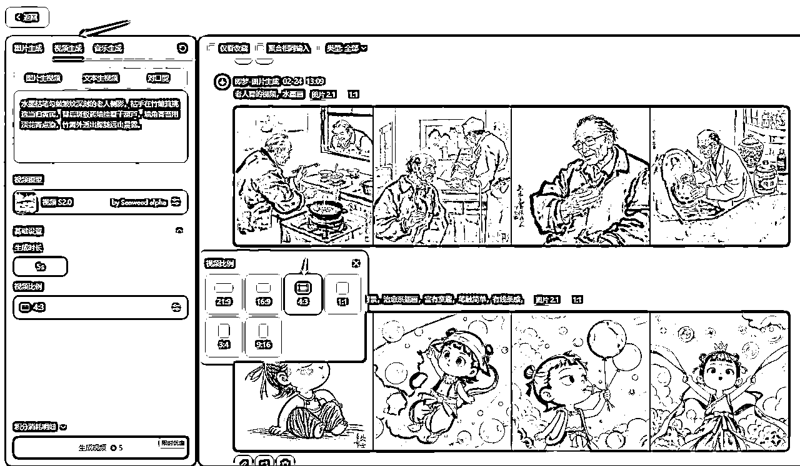
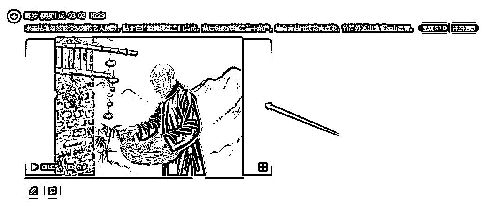
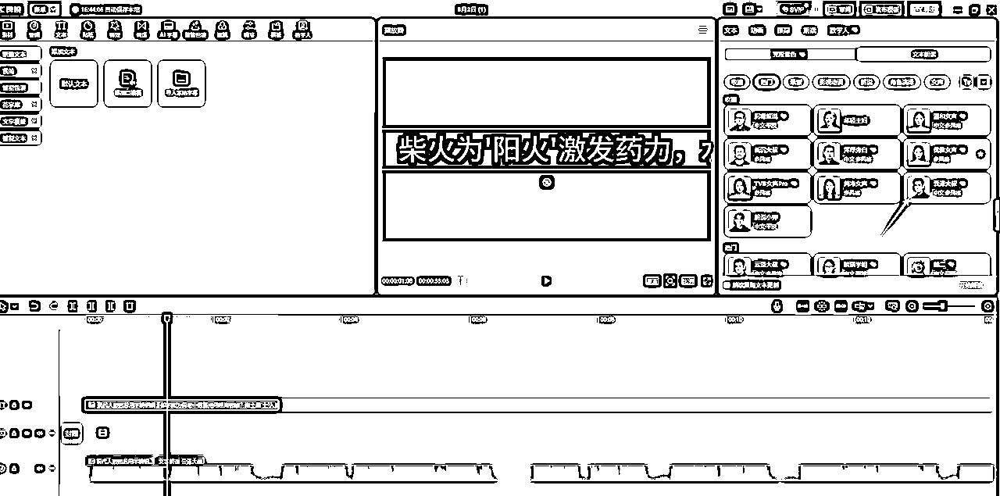

# 如何用Deepseek做养生赛道?

> 来源：[https://dmrbcelpjz.feishu.cn/docx/QTSydX29coPz8IxBj8zcyuyynAf](https://dmrbcelpjz.feishu.cn/docx/QTSydX29coPz8IxBj8zcyuyynAf)

你好，我是Longer

生财有术RPA教练

今天分享一下，最近起号很快的养生赛道。

AI做得比较好的，略懂养生，20个作品，41.9万粉丝

# 具体操作步骤：

## 第一步：用Deepseek生成视频脚本

打开Deepseek官网，官网地址：https://chat.deepseek.com/

输入以下提示词：

我要做一个中医养生视频，需要脚本文案，请根据参考文案，帮我找到类似3个选题以及文案，参考文案：“为什么柴火饭才是最养人的？因为柴火是阳火，阳火能直接提升阳气，现在的煤气和电都是阴火，柴火灶更是完美结合了五行之力。柴石木代表生机，火石核心旺盛能量，灶石土稳固基础，锅是精化万物，水煮饭滋养生命，每一口米饭都承载了五行的循环。自然是最养人的。”

## 第二步：用Deepseek生成视频分镜、画面提示词

## 第三步：用即梦生成视频画面

单个镜头生成后的效果，剩下7个镜头，以此类推是操作就行

## 第四步：剪映剪视频

### 1.生成音频

把文案复制到剪映文本，朗读,选择一个偏向老人或者大叔的

### 2.添加字幕

使用“识别字幕”生成字幕

### 3.添加字体

选择喜欢的字体，适度放大字体

### 4.添加音频

选择识别主题的音频，然后音量拉低

### 5.导出视频

完成编辑后，这样做一个养生的视频就完成了

# 变现方式

1、带货

可以带跟健康相关的品，比如维生素、黄芪、枸杞等

2、接广告

开通星图或者别人私信你让你出视频，给他佣金

3、卖号

做到10万粉+，把号卖了

4、打粉

对接后端，引流到他们私域，他们给你结算

5、收徒

简介放收徒微信，让他们主动加你给你付费