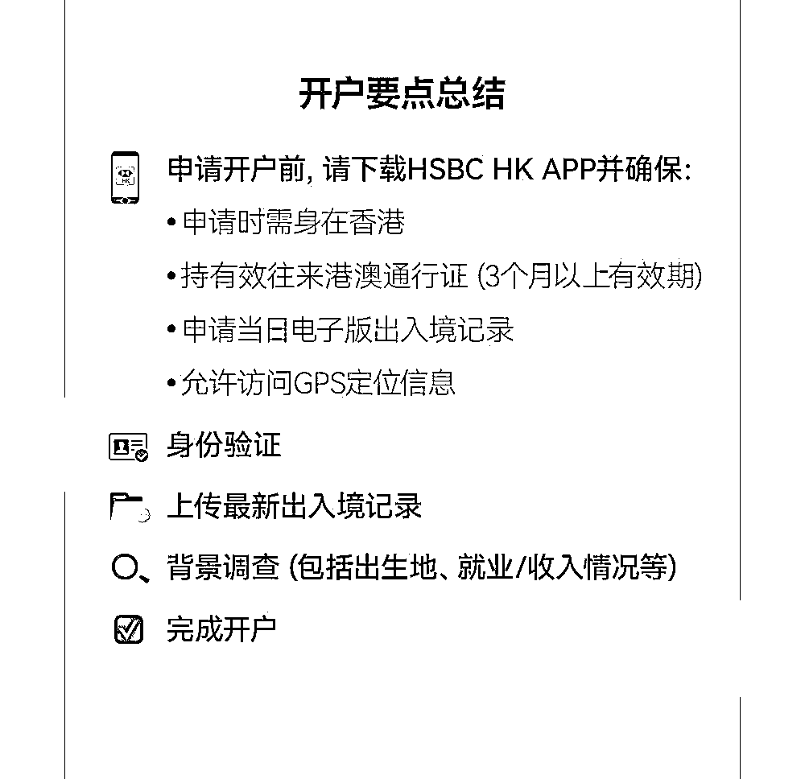
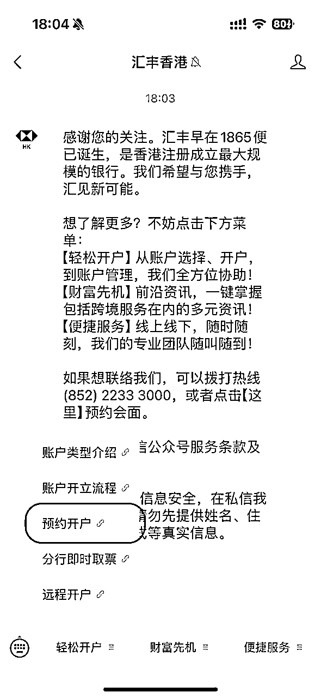

# 香港办卡攻略(动态更新中)

> 来源：[https://guui24rhwg.feishu.cn/docx/R1Wyd4ZwsoE7TVxhxs7c2kJzn4c](https://guui24rhwg.feishu.cn/docx/R1Wyd4ZwsoE7TVxhxs7c2kJzn4c)

我正在写一本小册子：《出海stripe 注册攻略》

涵盖 stripe 注册所需要的攻略，港卡/英国电话/英国公司/wise企业版/stripe开户，感兴趣请点击：https://www.getstripe.me/

# 目标银行

1.中银香港和汇丰香港（所谓的王炸组合）

*   为什么要办两个？

*   因为从大陆账户给境外账户汇款是有手续费的。但是：

*   用中国银行给中银香港本人账户汇款免费（目的：钱到境外免手续费）。

*   从中银香港汇款至香港汇丰，免费（目的：多账户分散资金）。

*   在全球的汇丰ATM取款机取当地币的现金，免手续费。（目的：方便全球游玩）

1.  虚拟银行 （nice to have)

虚拟银行的好处是开户方便，无门槛。可以用来作为资金中转、日常消费等

*   众安银行 ZA Bank

*   天星银行

*   蚂蚁银行

# 办理方式

所有以下方式的前提是，人要到香港！

1.  线上办理

汇丰、中银以及虚拟银行都是可以线上办理的，只是汇丰中银线上办理之后，实体银行卡会后续邮寄过来，并不是立刻就拿到的。

1.  线下办理

线下就能拿到卡，分为两种：

*   提前线上预约，线下办理

*   不预约，线下排队取号（也称walk in） （看运气）

# 提前准备材料

必备材料：

*   身份证

*   港澳通行证：最晚提前5个工作日办理

*   港币现金： 2000 港币；在开完汇丰和中银之后，可以提前预存进去，汇丰存 100港币，中银存 1000 港币。避免跨境汇款浪费时间。

*   如何兑换港币：

*   https://dr.leviding.com/docs/finance/prepare-cash

*   住址证明：把手机信用卡最近3个月的账单打印出来携带，线下中银开户可能需要用到，强烈建议提前准备。汇丰好像不用。

*   地址证明：以招行信用卡为例

*   https://dr.leviding.com/docs/finance/prepare-proof-of-address

*   https://www.youtube.com/watch?v=c6jyS27ZZaY

*   地址证明：水电煤账单：

*   https://www.youtube.com/watch?v=V2G4f_y5nh0

*   过关小票（过关的时候拿,一定要注意记得）

*   出入境证明文件：通过“移民局12367”小程序获取，这个不需要提前准备，到了香港才有，走到对应的流程再去下载电子文件就可以。

*   提前下载App：BOC HK中银香港App、HSBC HK汇丰香港App。导航App使用高德地图，比Google Map要方便很多。

*   开通手机漫游：一定要提前开通手机漫游（联系你手机号对应的运营商确认）

*   境外流量包：这个直接在手机营业厅App上搜索香港流量包购买就可以，一般是落地香港、消耗数据的时候生效，记得落地后打开国际漫游。

*   充电宝：线下开户排队，手机耗电快，以防万一建议携带充电宝。

建议准备：

*   英文通信地址：转成英文（拼音即可），长度有限制。当场填的时候一定注意，不能省略地址上的重要信息。因为如果当场无法下卡，后续审核通过后会把银行卡邮寄到你所填的这个英文地址。如果你地址填写漏了重要信息，可能会导致收不到卡

*   投资证明：无需纸质材料，只需要把支付宝基金账户、大A股票账户给柜员看一下即可。

*   转换插头：在香港需要过夜的朋友可以提前准备一个转换插头。

*   对于在公司工作的朋友，客户经理可能会看你的代发工资流水、纳税记录等。对于学生和自由职业者，你可以提供存款情况、自由职业收入情况（如有）等。

*   核心是体现出你是正常用户，开户之后会向汇丰存钱或者用汇丰交易，再就是你有一定经济基础。

# 线上办理

1.  汇丰银行

免排队！15分钟汇丰香港手机开户，4步轻松搞定！（内有视频）

https://mp.weixin.qq.com/s/A-q0Gw3MyQoDm6ggBBLo5g

1.  .中银香港

（如果你的名字是两个字，最好去线下办理，因为可能会被拒）

免预约免排队，中银香港可以线上开户啦！

https://mp.weixin.qq.com/s/_d8XqzRJzIA_87rF8I2KgQ

*   下载app，连接香港wifi

*   下载入境记录文件

*   开立账户，上传资料，人脸识别

*   walkin 分行 补签字

1.  虚拟银行办理

以za bank为例

*   香港境内手机app上开户，会核查出入境记录。

*   户后有一张虚拟 Visa 卡，还可以付费 25hkd 申请一张实体 Visa 卡，卡从珠海寄出

# 线下办理

## 网点选择

总得来说，选择偏远一点的网点，相对来说没有那么挤来挤去。

港人流密集区域，开户的人多，导致去开户容易被拒。

*   深水埗区、油尖旺区、九龙城区、黄大仙区、观塘区和港岛区

相对比较偏远的地方

*   葵芳分行、荃湾分行、荃湾西分行、粉岭分行、沙田分行、沙田广场分行、德辅道中分行、半岛中心分行、旺角分行、观塘分行等

早点到银行门口排队，最好在早上 8:00 之前到。

*   常规工作日为周一至周五：上午9:00-下午5:00

*   汇丰、中银周六上午营业：上午9:00-下午1:00

*   周日：休息

## 线上预约

你可以选择预约之后再去线下办理，或者不预约直接线下 walkin.

### 汇丰香港

微信公众号【汇丰香港】

预约时，如果日期无法选择，则说明当天已无号。如果没约到合适的号，也可以尝试排队取号开户。不预约无法保证排队一定能取到号，所以一般要在早上 8:00 前到分行门口排队（虽然银行 9 点才开门，但门口已经有不少人排队了）。

### 中银香港

「中银香港微服务」公众号

提前 7 天放号，最晚只能预约 7 天后的第一个工作日或者周六营业日，凌晨 12 点放号。

可以关注微信公众号「中银香港微服务」，在菜单栏中找到「我要预约」，按照提示流程预约即可：

## 办理过程

以下网点为例：

✅中国银行：元朗教育路分行

✅汇丰银行：元朗汇丰大厦分行

（比较偏的分行，9点开门，可提前15分钟选一家去排队。两家银行相隔很近，步行3分钟）

先去中银取号，再去汇丰（二楼）取号。这样就可以同时排队了。汇丰效率高，他当场教你下载什么APP（图1-3），填写哪些信息。30分钟就可以拿到卡。然后去中银，排队过程中下载APP填写资料。

### 汇丰香港

*   汇丰网点门口会有服务人员，直接告诉他你是来开银行卡的。如果当天号没有满的话，他会带你去排号。拿到号之后耐心等待就可以。

*   如果他问你开卡目的的话，你就说是投资港美股。

*   排到你之后，提前拿出身份证和港澳通行证，跟随银行工作人员到小隔间里开户。工作人员可能还会问你地址、工作、收入等信息，如实回答就行。

*   信息提交后，系统会自动审核，如果当场通过即可当场领卡。

*   如果需要进一步审核，会在 1-3 个工作日内通过邮件（你填的邮箱）通知，当收到一封「Say hello」邮件即代表审核通过，之后银行卡会以平邮/挂号信的方式寄到你填的通讯地址。

*   开好卡之后，工作人员会引导你登陆汇丰的App，你按照他的指示做就可以。

*   客户经理会给你银行卡和一张密码纸，密码纸沿封边撕开就可以看到银行卡的初始密码。接下来你就可以拿着卡和密码纸去 ATM 机修改密码了。

*   请注意，香港的银行账户，账号是账号，卡号是卡号。账号≠卡号。所以银行给你的信封，不要扔掉，里面有账号等信息。但是汇丰one 的卡号和账号是一致的，汇丰蓝狮子卡号和账号不一致。

### 中银香港

中银要严格一些，资料要求多一些

*   把预约编号给工作人员看，就会指导在app上操作，提交申请。直接问他们Wi-Fi密码，继续体验各种app秒开，效率拉满。

*   如果问你办卡原因，不要说理财，要说准备开港股和美股账户。提前准备好过往证券 app 的股票交易记录。

*   app里信息提交后，还需要往工作人员提供的邮箱发你的地址证明文件，然后就可以去窗口办理了。（app 里面填写的地址要和提供的地址证明材料上的保持一致）

*   差不多半个小时就办好，并且现场下卡了。

*   可能的情况： 由于分行没有剩余卡片，后续卡片会以平邮的方式寄到你填的通讯地址。

*   现场下卡了，拿着卡先去楼下的存款机存入 1000 港币（注意：不需要插卡，输入存款账户，把钱放进去确认即可）

*   香港这边的存、取款机不是一体机，所以存完钱还得去隔壁的取款机排队查询余额才能正式激活（不用取款）。存取款机的输入没有屏幕上的提示框，而且按钮也没有声音提醒，输入直接按顺序按按钮（大陆人很不习惯）。

*   如果你要从内地中银汇款到香港中银，请使用香港中银的外汇宝账号，切记。

# 办理master卡

其实汇丰 one和中银香港的卡都是银联的卡。办理完港卡之后，你可以在 app里面申请办理万事达卡(master)。办理这个卡的好处是万事达卡在全球范围内被广泛接受，在国内可以绑定微信支付宝进行消费。

汇丰可以办理蓝狮子卡，中银香港可以办理中银万事达扣账卡。这两张卡都可以在家申请，也是非常简单，我附上攻略：

汇丰蓝狮子

19 小猫Angel的金库发布了一篇小红书笔记，快来看吧！ 😆 TF5EUcEcC7PaAw8 😆 http://xhslink.com/a/VqR8zw1uk2R6，复制本条信息，打开【小红书】App查看精彩内容！

中银万事达扣账卡

79 小猫Angel的金库发布了一篇小红书笔记，快来看吧！ 😆 DFdZx3SYyuCi65z 😆 http://xhslink.com/a/4uoEyuCBN1R6，复制本条信息，打开【小红书】App查看精彩内容！

# 参考资料

*   超详细的香港银行开户教程

*   https://dr.leviding.com/docs/finance/bank-prepare

*   出海人去香港办银行卡注意事项和碰到的坑

*   https://www.v2ex.com/t/1074406

*   出海人去香港办银行卡最全攻略

*   https://gapis.money/blogs/hk-bank-cards-guide

*   《2024 全网最详细港卡线下开户教程！》

*   https://x.com/tychozzz/status/1865642779076124695

*   《2025 全网最详细香港虚拟银行开户教程！》

*   https://x.com/tychozzz/status/1871942591660597287

*   【汇丰/中银】人手一张香港银行卡

*   https://www.youtube.com/watch?v=Q4owivU_8cM