# 围炉夜谈：我与梁小A（书法行业）

> 来源：[https://jx8j59ahkjb.feishu.cn/docx/RHO4dbdb0ox26hxe4q1c3ZcFnif](https://jx8j59ahkjb.feishu.cn/docx/RHO4dbdb0ox26hxe4q1c3ZcFnif)

在这次讨论中，参与者分享了他们在教育行业，特别是虚拟资源销售、K12教育改革、线上教育产品设计、社群运营和个人创业领域的经验。他们强调了将课程内容质量提升到至少70分的重要性，并通过持续迭代优化来吸引用户。

讨论者指出，社群的定价策略需灵活调整以提高吸引力和转化率，并建议认真对待社群活动以实现费用返还。除了项目选择，成功还依赖于理解赚钱模式和行业成为专家。

强调了产品打磨的重要性，即提供真正有需求的、刚需的产品，能有效提升转化率和用户满意度。最后，提出了未来改进方向，包括更关注基本盘和优化产品后端交付系统，以提高整体效益。讨论涵盖了利用AI提升效率、通过社交平台销售产品和个人行业定位等多方面内容，以及对教育市场趋势的预测。

通义：https://lxblog.com/efficiency/U/bMJCP21pRX9H1wii2ajED6uox4JQKijU（电脑打开）

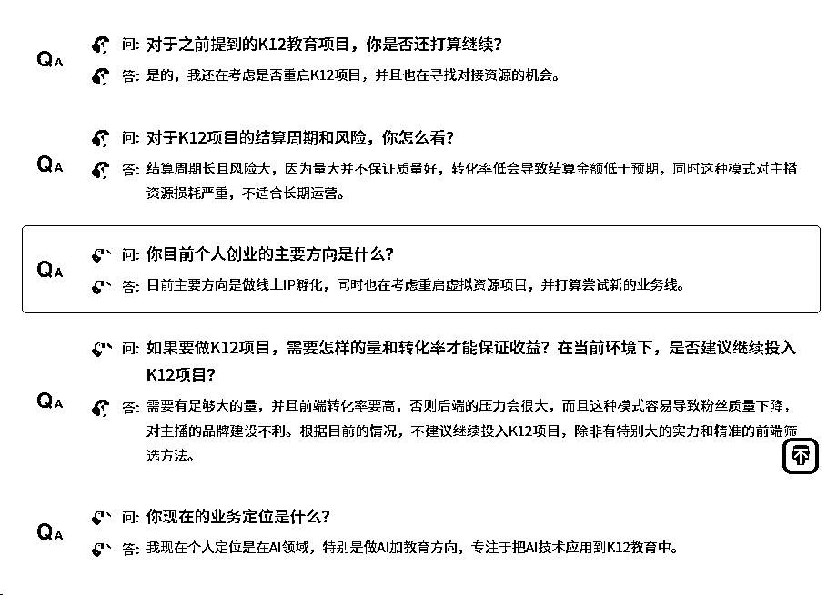

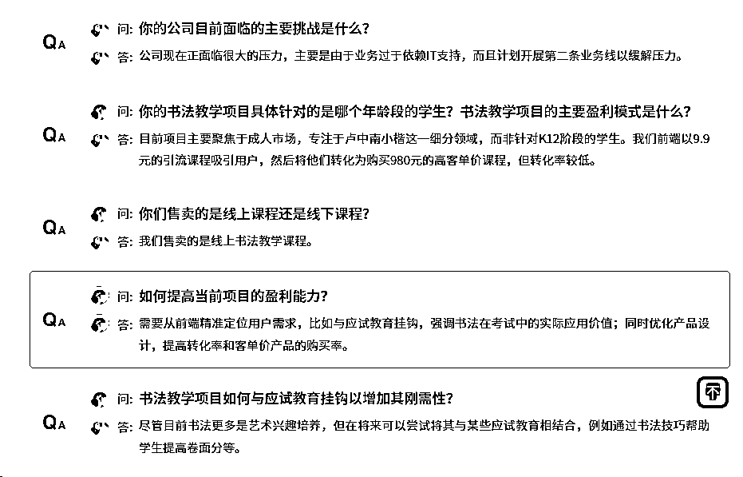

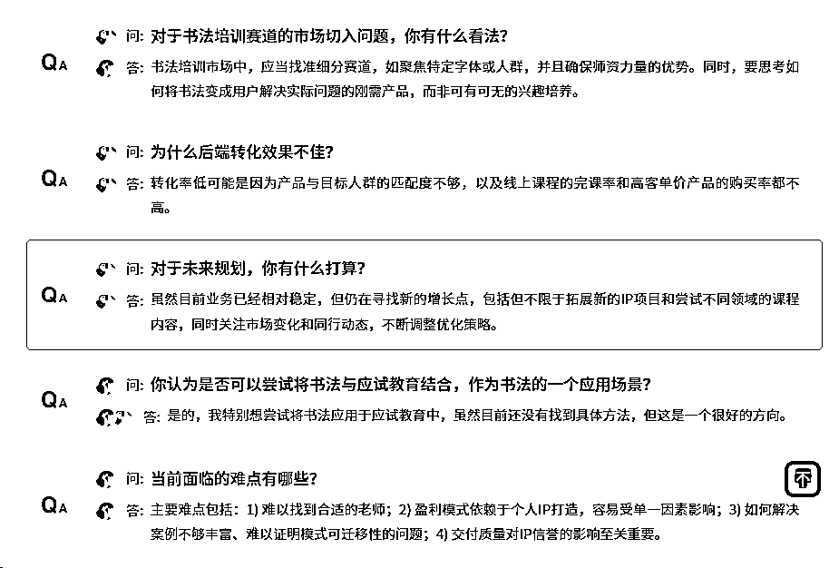

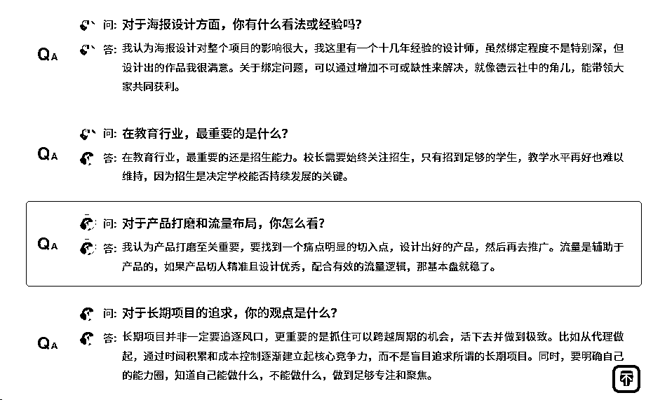

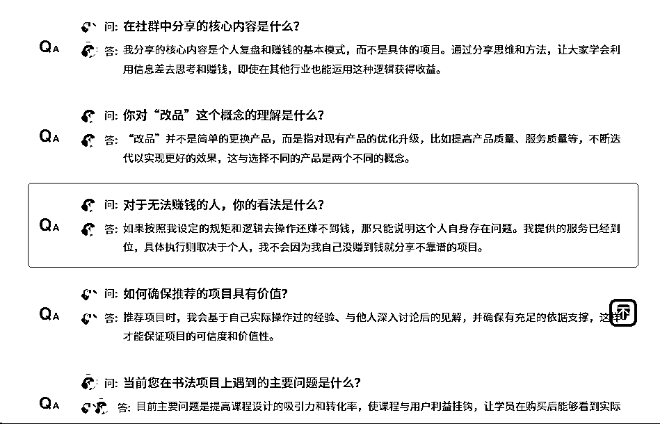

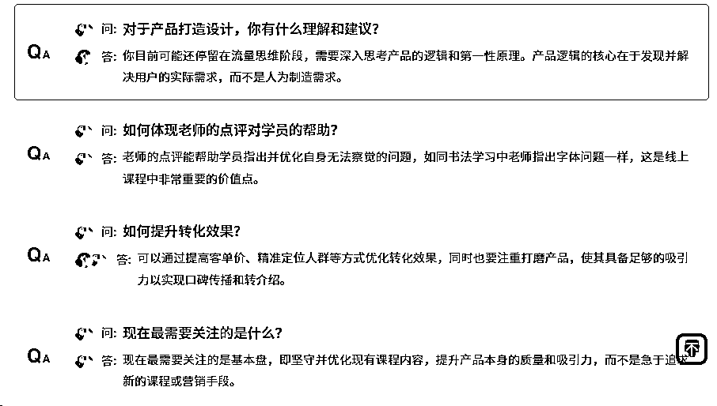

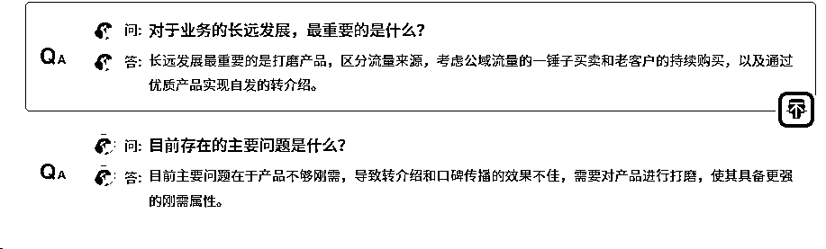

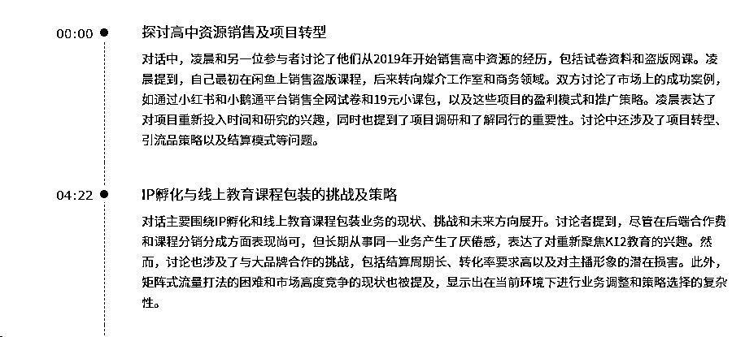

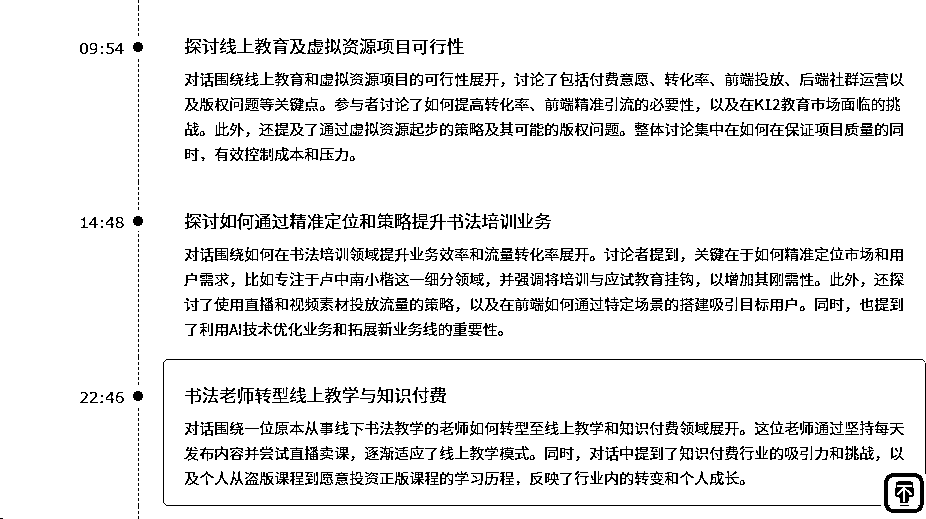

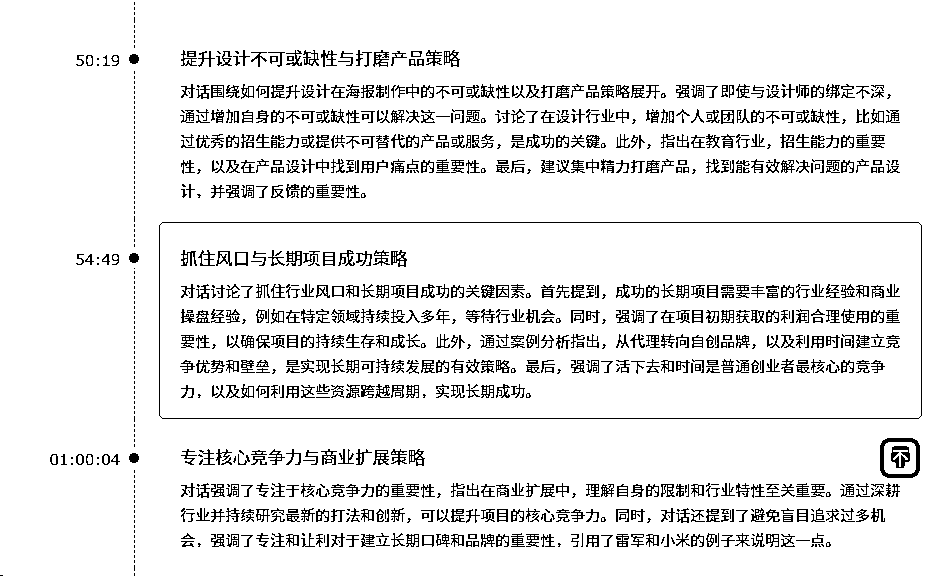

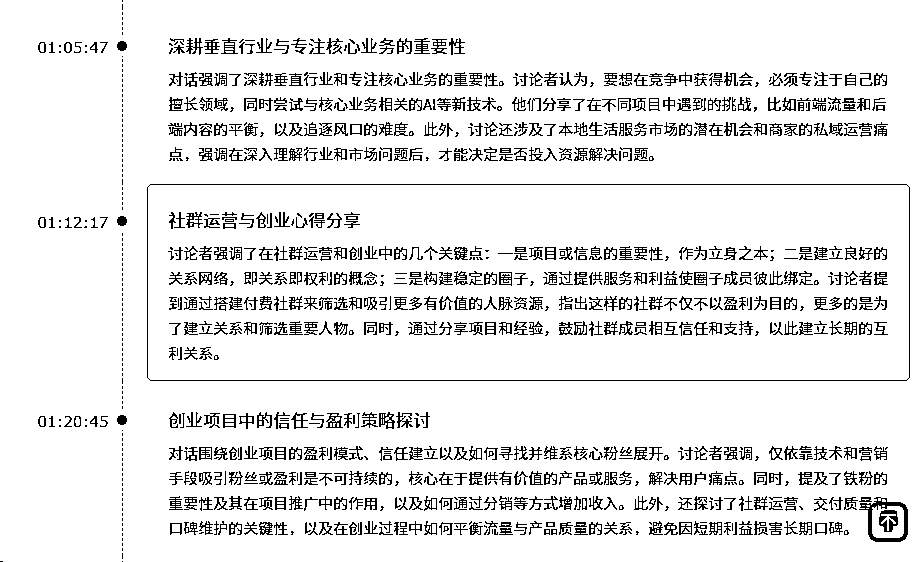

