# 5 天全流程复盘，关于京东外卖项目的「指南/避坑」

> 来源：[https://ox9k4rncex0.feishu.cn/docx/RUFidx1nNoGyZBxMIorctj56nRd](https://ox9k4rncex0.feishu.cn/docx/RUFidx1nNoGyZBxMIorctj56nRd)

# 前言

大家好，我是彻易Heawcyrt。

04年大学生，全网万粉博主，大二实现经济独立，自由职业搞钱玩家，

欢迎同频的前辈或小伙伴交流研讨。

最开始看到这个项目，是在 2 月 12 号晚上某位老板的朋友圈，内容是说：“京东要开始做外卖了，有没有认识服务商的，想合作”。那会没有当回事，只是感叹，天下苦美团饿了么久矣。现在复盘起来，当时为什么没第一时间感受到商机，大概是因为听到所谓“服务商”这个词，下意识就觉得这不是我们个体能碰的项目。

一周后，2 月 18 号下午，看到了有人发京东外卖的风向标，说在任推邦里就可以赚，要去地推，一个人是170，我开始萌生想法；晚上，还看到一些新闻号还吹说一天能过千，甚至我还看到生财里有人已经收入1w的截图。

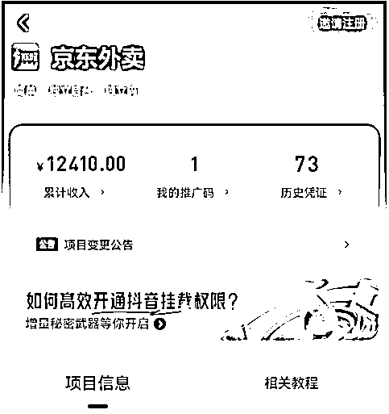

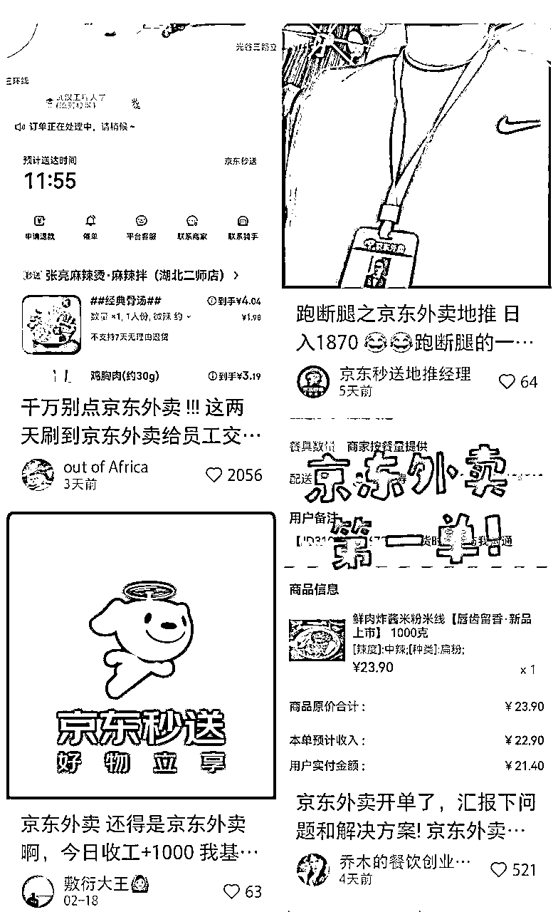

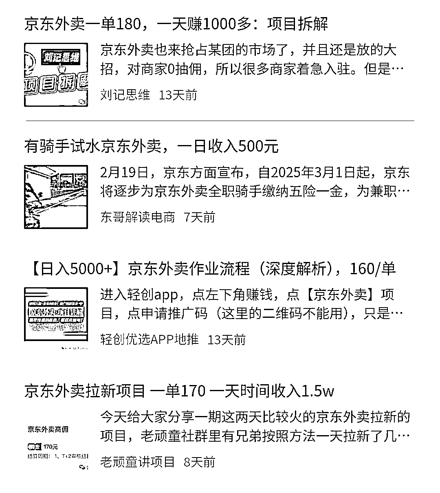

于是，我就决定入局这个项目。一方面我从来没有去地推过，可以锻炼我和各类人打交道的能力、敢于开口说话谈合作的胆量；另一方面，我还可以赚到钱，目前这是一个新平台，入驻是免费免佣金的，能多一条入驻的道路，商家没理由不去做啊。

# 一. 地推前的准备

1.  工服和工牌

1.  一个通俗易懂的SOP手册/打印件

1.  探店规划表

1.  提前线上找一些店家试水

## 1\. 工服和工牌

上拼多多或者淘宝买身工服和工牌，大概加起来也就20块钱左右，也有些特别便宜的可能就10块钱。

一定要买吗？一定，3个理由。

*   看起来就很正式，身上的“京东外卖”也会给老板更专业、更直观、更值得信任的感受；

*   这是一个水印、一个记忆点，有些老板可能在手机上看到过京东外卖，正愁不知道怎么入驻呢，看到你的水印了，会果断招呼你，我这5天几乎每天都有在马路上被招呼的情境；

*   有一家老板告诉我：“上午来了七八波小伙子搞入驻，我都不太信，感觉你是最专业的，还有工服和工牌”。

这里插播一个同行教我的理论：

如果你长得稍微成熟一点，没学生气，可以只买工牌，因为一般穿工服戴工牌的是普通员工，而只挂工牌的是区域经理。

## 2\. 一个通俗易懂的SOP手册/打印件

以下是我在地推前写的一份针对于商家的SOP手册：

👉

其作用是，在地推时，如果交流的老板们有意愿入驻，我就拿起平板演示。

如果是纸质打印的，可能会因为下雨、手汗、皱褶、丢失等等情况导致没法多次复用，所以这里更推荐电子版。

## 3\. 探店规划表

就比如这样，我是先提前确定好我要去哪个商圈，然后再在大众点评上看下所在商圈里的一些店，规划下要去哪些店，统计下来，这样到时候临走时可以看看有没有漏掉的。

## 4\. 提前线上找一些店家试水

这个相当关键！是我对象当时给的建议，也真的多亏了这个建议了！

线上去主动向一些商家推销，一方面能够测试出意愿程度，另一方面，可以看看他会重视什么问题，在意哪方面的问题，不然去线下万一来个问题你答不上来，是很降低信任度的。我最开始地推前一天（等工服工牌的快递），就在家线上和商家聊天，流程方式是：

1.  去大众点评/美团上，去找那些有线下店铺且做外卖的（符合京东外卖的规定）；

1.  美团/饿了么上，找到这家店，一般都可以私聊到商家，直接发消息要微信就好了，很多都会直接给；

1.  如果不给，问你干嘛的，怎么办？

1.  说自己是要点单，先要到微信再说；

1.  一般能在平台直接找到商户的电话号码，复制加微信即可，但一般往往都是店铺官号，非老板个人号；

1.  直接说明自己是要来推广一个新平台，帮他们赚钱，或者干脆摊牌，说自己负责京东外卖的入驻。

1.  实在不给就算了，总会有给的，亲测饿了么商家回复率、要到微信率更高。

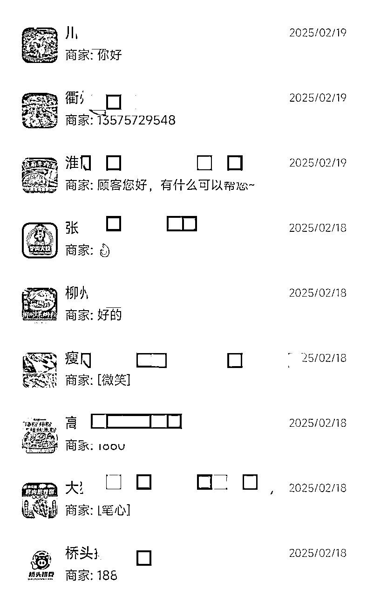

要到微信了就可以去微信开门见山说了，具体的沟通方式我会在下面的话术板块给到大家一些建议。

如果在微信上就有强烈意愿，我们可以直接线上就帮他入驻或者去线下指导；

如果在微信上没意愿没回复，我们依旧可以当作目标，线下再去试一次，因为在微信上会有些老板不信任。

# 二. 时间和店铺的选择

## 1\. 合适的时间

一般来说，最推荐工作日下午。上午也可以，但是很多商家上午10点才上班，一上班就要开始匆忙准备中午了，时间不够充裕。我的话，因为还要忙其他时间，所以每天都是下午1点半出去，弄到5点准备回来。

补充一点：雨天千万不要偷懒！下雨天实体店一般没多少人，而且淅淅沥沥的安静氛围更适合你去和老板细聊。

## 2\. 合适的店铺（血与泪总结的避雷指南😭）

1.  名气特别大的品牌店不要去❌ （肯德基、麦当劳、袁记云饺等，往往都是总部统一安排入驻）

1.  商场店能不去就不去❌（这条仅供参考，不同城市可能不一样。杭州这边我跑过的商场店，要么老板平时根本找不到，是幕后大老板；要么是连锁店，要听总部安排；要么要听商场安排。有些店甚至你完全没听过，名字也平平无奇，但人家就是连锁店🙃）

1.  独立个体店才是最佳目标用户！✔（所以去商圈并不是为了商场店，而是为了商圈附近的个体店。）

# 三. 心态与话术建议

## 1\. 核心心态：我是来帮大家的

我最开始去地推的时候相当忐忑，因为上次做类似的事情还是在三年前，会不好意思开口。所以，一定要在心理暗示自己：我是来帮大家的，当然也确实是来帮商家的，给他们扩展新财路。

在这种心态下，说话会更有底气，而且是免费帮助，都不要钱，就更有底气了。我是来帮你的，所以我跟你打个招呼，说说具体的情况，你要是有各种顾虑，我也能给你解释清楚，但你确实没意向不想做，我也不过多为难，买卖不成仁义在嘛，我还可以去下一家。

总之，被拒绝是常有的事，比如我去的第一家就被拒绝了，老板说他们不打算做外卖店，觉得外卖店水深，做好堂食就够了。我没放弃，跟他介绍京东外卖怎么怎么好，但他还是婉拒，我也就没再多拉扯了，表示理解，然后祝老板生意兴隆就走了。我刚出他家店没多久，他就给我叫住了，把我拉去他旁边好几家店，让其他店主加我微信，他说他虽然不做外卖，但是或许他旁边的商家有需要，就介绍了下。

所以嘛，要礼貌、客气一点，有底气一点，不要一听到人家说不做，一点争取性都没有调头就走，如果我当时是这样的表现，我想我也不可能在那家店主的引荐下，给周边商铺开“露天小会”介绍京东外卖的政策，也就不可能被那几家老板主动要微信。这里面获取到的成就感，就是我的开门红。

## 2\. 话术建议：利他、专业（线上线下通用）

### 1\. 开场白

“老板您好/您好咱家老板在吗，我是京东外卖的，最近在帮周边商家办理京东外卖入驻，看到您家评分不错/平时销量不错/好评挺多的，想问下有没有了解过咱们这个新平台？”

帮周边商家 >> 帮你

说帮你，别人可能会想，哪里有这种好事？但是说帮别人，老板可能就会觉得，那别人都弄了我也要弄，我不弄别人不就抢先了嘛。

### 2\. 想了解

“现在美团饿了么不是一般抽20%左右嘛（停顿），因为京东目前是刚开始做外卖，所以目前在5月1号之前入驻的商家是0抽佣，后续下一年也会保证是5%的抽佣。”

停顿很重要，其实一般抽佣是25-30%，故意说少点是为了引发对方指正我，当他说“哪有20%啊，都30%了”的时候，我就可以说，“对，可能杭州是一线城市抽得更狠点，这确实太多了，我们京东目前是刚开始做……0抽佣，后续下一年……5%的抽佣”。这样对方就更容易感受到对比和冲击，更容易接受。

之前有个店主是完全不感兴趣的，说京东目前还没做起来，做起来了再说吧，然后我就用这招，让他有了兴趣，开始主动问我京东的相关情况。

### 3\. 了解过了

“那挺好，我这边的工作呢就是专门负责帮周边商户入驻的，免费0佣金，您这边只需要一些相关证件就可以入驻了，您看下这些（递过去平板）。”

突显专业性。

### 4\. 纠结/担心没人买

“您看哈，反正入驻是不花钱的，目前京东外卖上面也只有一些奶茶店呀什么的，咱们京东现在主要是还在推广商家端，先拉商家入驻，把店搞起来，后面肯定会出一系列优惠活动来扩大用户群体，让年轻人们都用起来，而且京东也不是小公司小品牌，所以趁着现在附近入驻的商家还不多，咱先占个位置，后续就有天然的优势了。”

强调京东的品牌地位，让商家们相信这个平台未来能做起来，现在赶紧进去占位置。

*   当然，这么说有些商家可能就会问，那后续一系列的优惠活动，是让商家来承担这个优惠价吗？

*   回答：美团饿了么这边应该是商家承担的比较多吧，我昨天听一个商家跟我说，美团10块钱优惠券商家自己要承担9块钱，我们这边优惠券的京东承担的比较多，而且我们京东主打品质外卖，不会跟一些外卖店一样，搞那种无底线的低成本外卖走量。（如果追问具体承担多少，就说每个城市的消费水准不一样，这是动态变化的）

先提美团饿了么，是为了引起共鸣，然后突出京东，同时了解到这些行情也能显得自己专业。

### 5\. 实在不感兴趣

“好嘞，要不您这边加我下微信，后续京东这边要是做得不错，您有入驻的打算可以再联系我哈。打扰了哈，祝老板生意兴隆。”

买卖不成仁义在，说不定后续会有用。

### 6\. 已经入驻了

“好嘞，您这边是通过什么渠道入驻的，入驻以后体验感怎么样，有没有遇到什么问题？”

问这些主要是积累素材，方便以后去服务那些没有入驻的商家，积累自己的专业程度。

### 7\. 老板不在

“是这样，我是京东外卖的，最近在帮周边商家办理京东外卖入驻，一般情况下咱家老板什么时候会来店里呀？”

“是这样，我是京东外卖的，最近在帮周边商家办理京东外卖入驻，您这边有老板的微信嘛？”

有很多店铺的老板是不怎么在店里的，尤其是不忙的时候。而往往我们就是在店铺不忙的时候去地推的。这个时候可以问一波时间，要一波微信，后续再跟进。

# 四. 帮商户入驻

根据我跑了60多家的经验来看，一定一定要帮助商户入驻，让他们自己弄那就会有各种各样的错误，而且京东的审核相当严（sha）格（bi），证件啥的稍微远一点、反光一下，就过不了审核；而且经常还有各种bug出现搞心态。

之前帮一个商户入驻的时候，花1个多小时排错、打电话给客服人工审。反正就是特别恶心特别麻烦，最好是线下协助，不行多试试。

具体步骤👉：

# 五. 常见问题 Q & A

## Q1\. 0 佣金，但是配送这块要多少钱呢？

3公里内3块钱，超过的，不同城市不一样，也在浮动变化中。

## Q2\. 能用美团和饿了么的打印机吗？

不能，需要自己花钱购买新的打印机打印单子。

## Q3\. 开店人和法人不一致怎么办？

那没办法，京东上传证件的时候，需要保证所有涉及到的人物信息、地址信息都统一。

## Q4\. 如果明明各方面都没问题，但是就是显示信息错误怎么办？

先一遍遍把之前的信息都检查一遍：

*   编号有无错误

*   图片有无不清晰

*   图片方向要正对着的

*   大众点评评分优先；如果上传的是美团评分，请记住不是美团外卖评分，是美团美食的评分

*   评分照片要截图，不能拍照，拍手机会容易检测不出来

*   任何证件都不要缺脚、反光

*   不要使用任何 AI、美颜功能

还不行的话，隔一天试试看（亲测有效，前一天怎么都不行，隔一天啥也没动就行了）

## Q5\. 什么阶段才能领钱？

这个规则始终在动态调整，如果你是用的“任推邦”，请务必每天关注规则详情；如果你是在别的服务商那干，也一定要确认好这方面。

## Q6\. 商家的订单什么时候可以提现呢？

3天后到账商家端，提现到账T1。

## Q7\. 能校园接力送吗？

不同地区可能不一样，目前初期大多数地区可能还不支持。

## Q8\. 同一张营业执照能注册不同分店吗？（比如把麻辣烫麻辣拌分开卖）

不可以，京东外卖不允许虚拟店铺，每张营业执照只能开一家店。

不管怎么样，肯定会有商家的问题你解答不了的，这个时候就只有硬编了。

一定要底气十足地硬编，或者说，我们新平台刚刚运营，有些内容、功能没完善，加个微信，晚上回去帮您跟总部汇报下。

回去后可以致电 400-002-0020 去咨询京东秒送官方客服。

# 六. 最后：我不建议个人入局这个项目❌

我做了 5 天，每天大概是从下午 1 点半到 5 点钟。投入时间不算长，平均每天能签一个商户。但尽管是这样，我依旧在第 5 天以后就停掉了地推，因为我第 1 天成的那单，一直没有审核过，网上也是风言风语的，任推邦规则还变动了，还说什么“在测试期，结算以京东反馈为主”这种含糊其辞的话，我想看到钱了再继续办事，然后就没有然后了，一直到现在没有一单过审核。

核心原因：赚不到钱。

是的，不管别人吹得多好，我个人做这个项目体感就是很难赚到钱。

我在杭州，也是这次地推才让我感受到为什么杭州叫“美食荒漠”，因为到处都是品牌连锁店，这些店铺基本都是跟着总部一起签约合作外卖平台的；那种独立个体店太少太少了，就算真的有，要么就是幕后开店的大老板不在，要么就是苍蝇馆子、家庭店，评分、店面的质量难以符合京东的要求。

最开始加入的时候，只需要“营业”并且商品≥5就可以。

后面变成，需要保持“营业”状态5天并且商品≥15才可以。

再到现在，甚至必须要开单且商品数量比美团、饿了么多才可以算一单了，还非要商家绑定京东钱包，人家开店，我们这些陌生人让人下载“京东金融”绑定京东的钱包，开通金融相关业务，这谁放心？

而且，商家没过审核，你要跑一趟看看怎么回事；商家菜单没上齐，你要帮着上。忙前忙后，万一他京东一直不开单，后面不营业了搁置了，你那钱也没了。

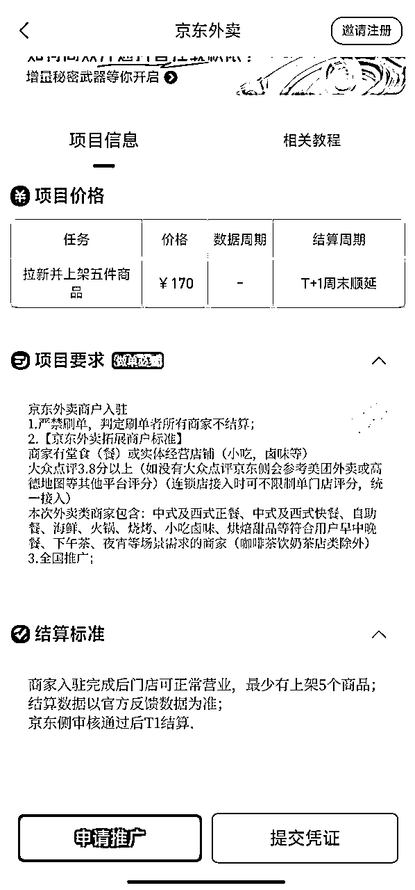

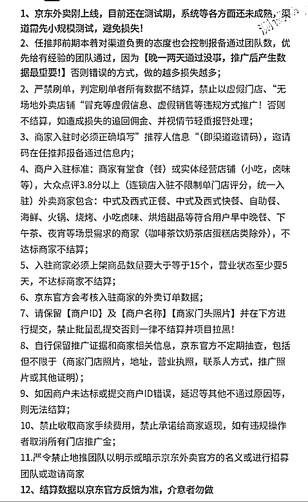

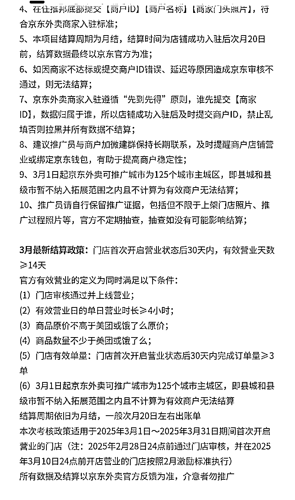

这个 “小规模测试，避免损失” 和 “结算数据以京东官方反馈为准，介意者勿做” 就很灵性了。

我想吐槽，不开单也不是商家的问题呀，平台没人用，不开单然后地推人员拿不到钱，这什么道理？

关键是还变成了月结，什么意思，也就是说，我 3 月 1 号去帮 A 商家入驻了平台，满足一切条件后，我也至少得等到 4 月 20 号才能拿到这一单的 170。而且，这中间还不清楚规则会不会变动。

而且，我也上网去搜了一些其他人对这个项目的看法。

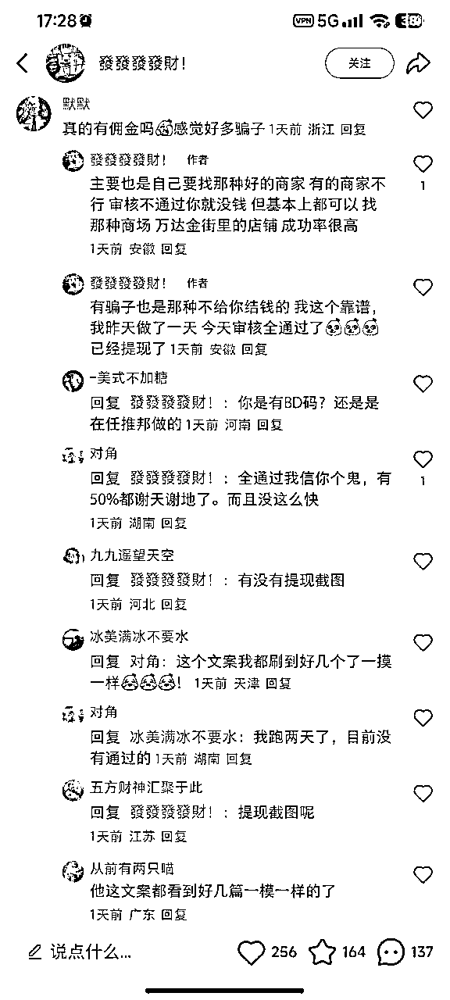

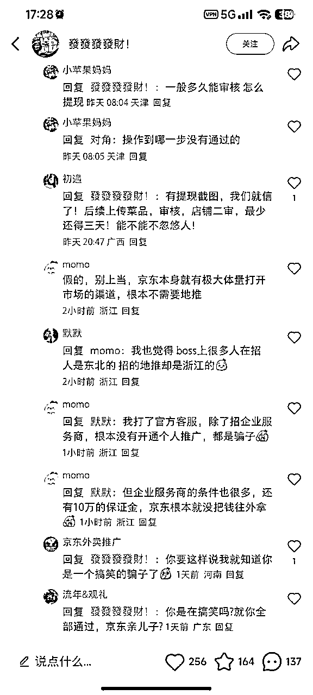

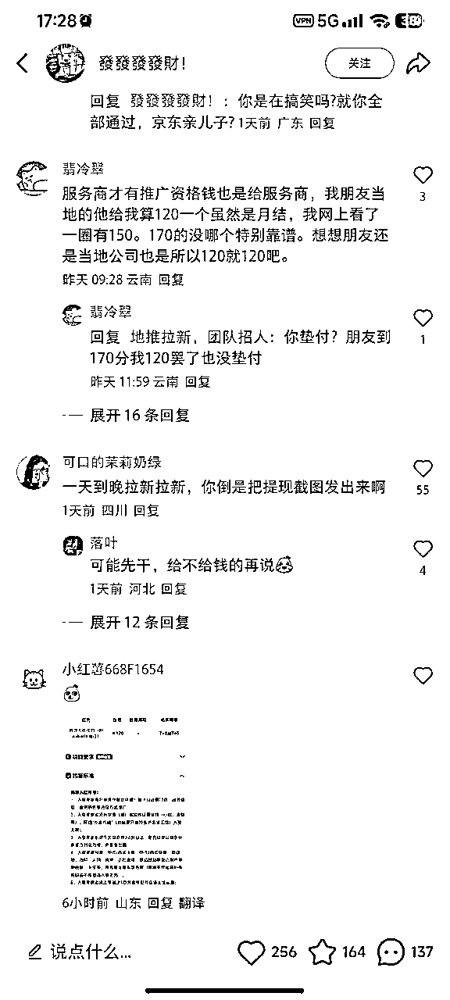

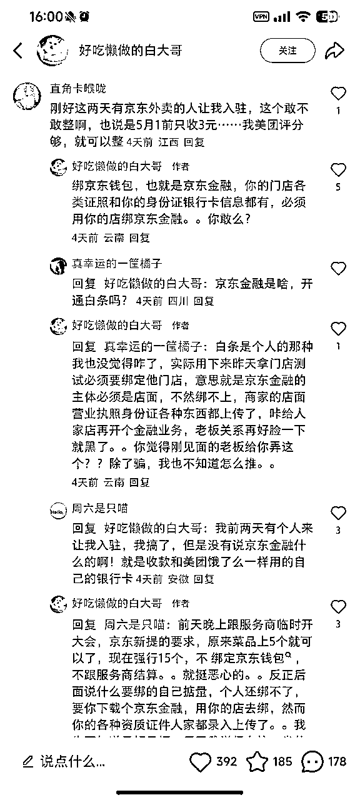

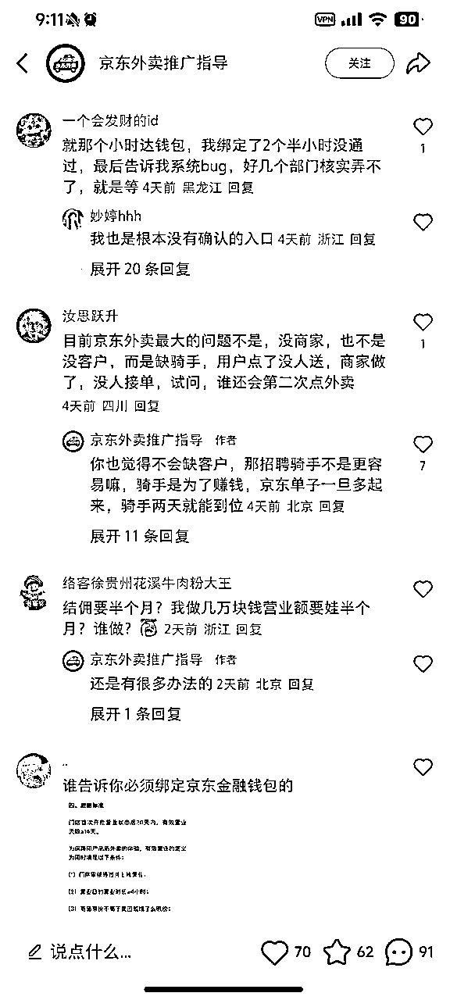

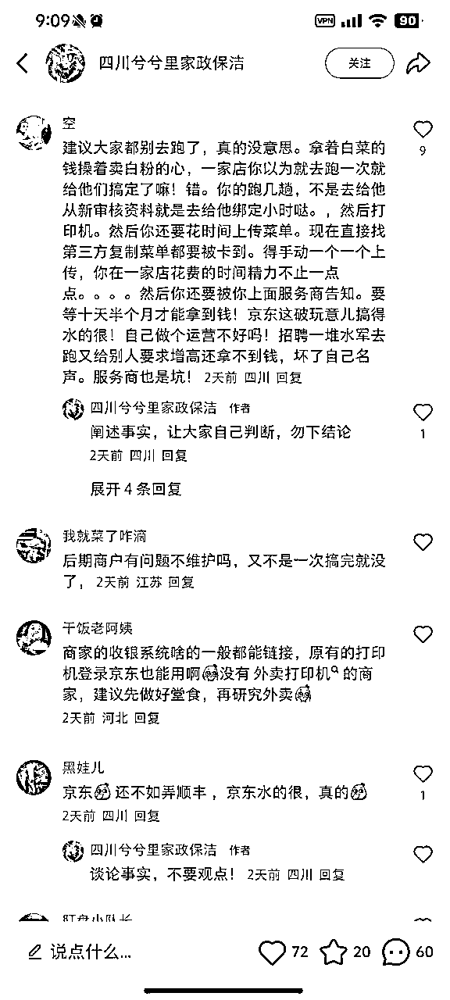

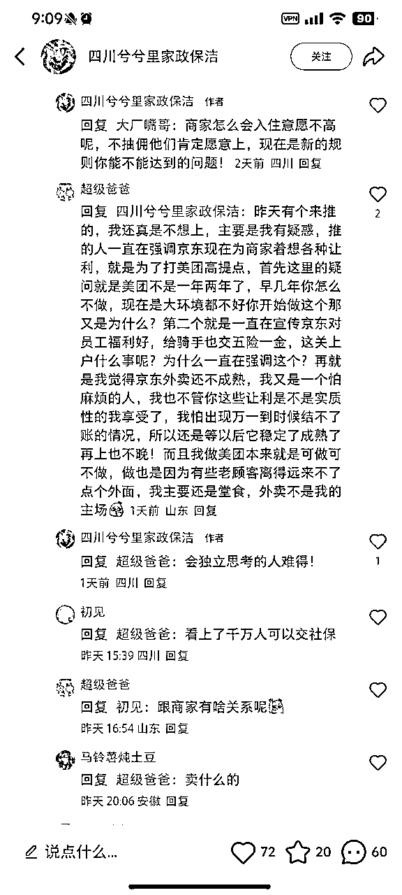

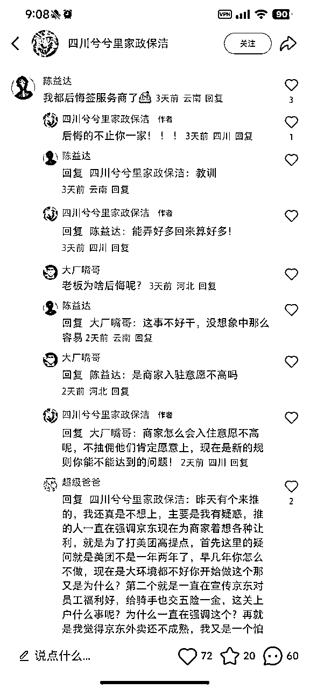

其实如果打电话去问京东官方，他们是不承认我们这种形式的地推的。

害，不要真给别人当了免费牛马。

调研全网，现在真正能提现、发钱的，要么就是P图，要么就是那种都包浆了的网图，要么就是服务商在垫资，任推邦是服务商之一，目前网上没看到过真实的在任推邦里提现了的截图，如果有，欢迎圈友纠正。

上头不拨款，很少有服务商会好心垫资，他们也知道项目不稳定；而且好多服务商现在都后悔搞这个了。

至于咱们生财里有圈友提到的“省团”，我没用过，也没有心力再去搞这个项目了，也看清了杭州这个情况貌似不太适合搞这个，ROI太低了。

如果参与的是那种BOSS直聘上找的工作，然后安排你每天去地推，每天固定工资结款，那种可能还有保障一点，只是工资很低，还不如去做销售或者其他职业。

### ——最后总结

带不走金钱，那就带走经验。作为一名刚来杭州发展的大学生，地推加深了我和这个城市的链接。我不仅有和老板交流，还有和同行、和美团饿了么骑手交流，甚至是在公交车上被陌生爷爷奶奶搭讪，聊了一路最后惊讶发现我们住一个小区。

我也通过这次地推，找到了曾经高考结束后的那个暑假里，孤身一人在陌生城市里想办法生活了一个多月的激情和感受，和最真实的社会互动。

唯一的遗憾就是，这篇文章发出来太晚，拖了好几天。不过好歹也算完成了嘛哈哈哈。