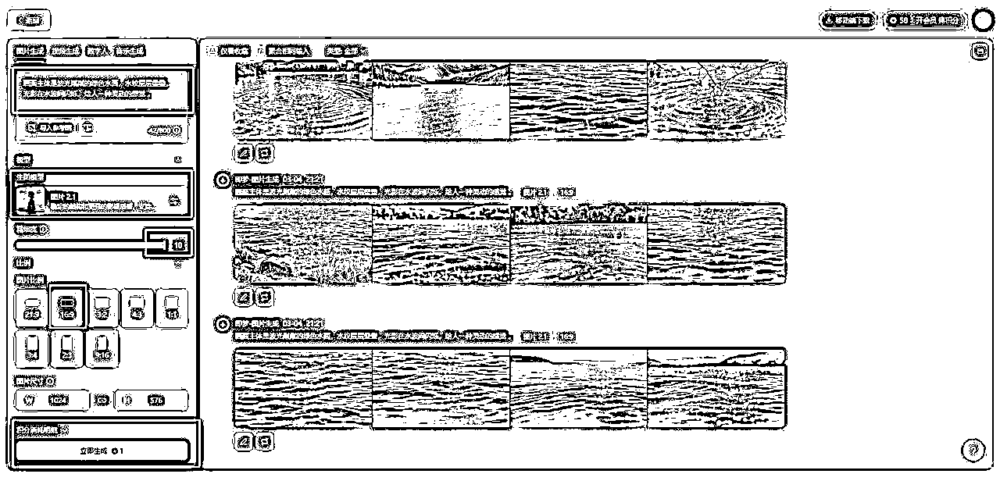
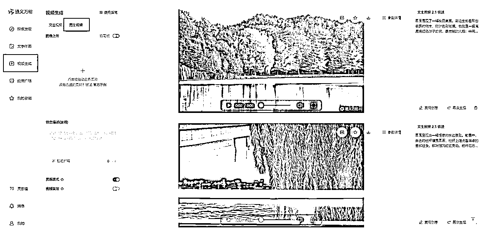
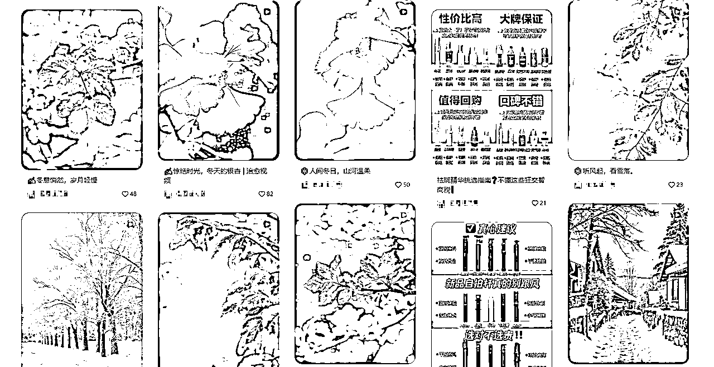

# 5分钟搞定治愈系风景视频！即梦+通义万相+剪映，三步轻松上手

> 来源：[https://yf4niapxuw.feishu.cn/docx/RhgHdJcIdodNSMxP2cCchxLOnxe](https://yf4niapxuw.feishu.cn/docx/RhgHdJcIdodNSMxP2cCchxLOnxe)

你想制作一个治愈系风景视频，却担心技术门槛高、耗时久吗？

别急！今天教你用即梦、通义万相和剪映，只需5分钟，就能轻松搞定一个高质量的空境视频。

不仅如此，我还会分享如何通过这类视频变现，让你在享受创作乐趣的同时，还能赚到钱！快来试试吧！

## 第一步：用即梦生成高质量画面

1.打开即梦：进入即梦APP或网页版，选择“生图”功能。

2.输入提示词：在提示词框中输入你想要的画面描述，比如“波光粼粼的绿色水面，水纹层层叠叠，光影在水波间闪烁，给人一种灵动的感觉”。

3.设置参数：

生图模型选择“2.1”版本，精细度拉到“10”，图片比例选择“16:9”，适合横版视频制作。

4.生成图片：点击“立即生成”，等待几秒，你会得到4张图片。从中选择一张最喜欢的，保存到本地。

如果你对生成的图片不满意，可以调整提示词，重新生成，直到满意为止。

## 第二步：用通义万相生成动态视频

打开通义万相：进入通义万相的视频生成功能，选择“图生视频”。

将刚刚在即梦生成的图片上传到通义万相。

不需要输入创意描述，直接使用默认设置。打开“灵感模式”和“视频音效”，AI会为视频自动匹配背景音效。

点击“生成视频”，等待一段时间，你就会得到一个动态的AI空境视频。

为什么用通义万相？

即梦虽然也有视频生成功能，但通义万相的优势在于可以直接生成视频音效，省去了后期在剪映中添加音效的步骤，效率更高！

## 第三步：用剪映完成最终剪辑

打开剪映，导入刚刚在通义万相生成的视频。

在视频片段之间添加合适的转场效果，比如“叠化”，让视频更加流畅自然。

如果需要调整音效，可以在剪映中微调音量或替换背景音乐。

击“导出”，选择合适的分辨率和帧率，一个治愈系空境风景视频就完成了！

## 如何通过治愈系视频变现？

1.短视频平台变现

抖音/快手：发布治愈系视频，吸引粉丝关注。通过平台流量分成、广告合作、直播打赏等方式变现。

B站：上传高质量视频，加入创作激励计划，赚取播放量收益。

2.视频素材销售

素材网站：将生成的视频上传至视觉中国、包图网等素材平台，按下载量赚取收益。

定制服务：为有需求的客户定制治愈系视频，按项目收费。

3\. 社交媒体变现

小红书：发布治愈系视频，吸引品牌合作，通过广告变现。

4.课程教学

知识付费：将制作治愈系视频的流程整理成课程，在知乎、得到等平台售卖。

直播教学：通过直播平台教授视频制作技巧，吸引打赏或课程付费。

用即梦+通义万相+剪映制作治愈系风景视频，不仅简单高效，还能让你轻松享受创作的乐趣。

快去试试吧，用5分钟创造属于你的治愈时刻，同时开启你的变现之旅！